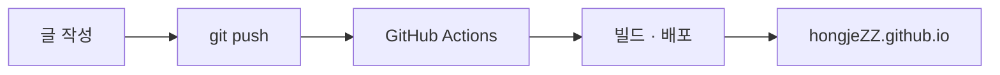

공부한 내용을 흘려보내지 않으려고 블로그를 열었다.

평소에 백엔드와 인프라를 다루면서 Kubernetes, JVM, 이벤트 스트리밍 같은 주제를 자주 들여다본다. 그때그때 검색해서 해결하고 넘어가면, 며칠 뒤 같은 걸 또 검색하고 있는 나를 발견한다. 그래서 한 번 제대로 정리한 건 여기에 글로 남겨두기로 했다.

## 무엇을 쓰나

거창한 튜토리얼보다는, 내가 막혔던 지점과 그걸 어떻게 이해했는지를 담으려 한다. 나중에 같은 곳에서 막힌 누군가에게도 도움이 되면 좋겠다.

## 코드는 이렇게 보인다

코드 블록에는 구문 강조와 복사 버튼이 들어가고, 위쪽에 파일명·언어 라벨이 붙는다. 첫 줄에 `// file: 경로`를 적으면 파일명이 표시된다.

```bash
bundle exec jekyll serve --livereload
```

```kotlin
// file: Greeter.kt
fun greet(name: String): String {
    val message = "안녕하세요, $name 님"
    return message
}
```

> [!tip] 콜아웃도 쓸 수 있다
> `> [!note]`, `> [!warning]`, `> [!danger]` 처럼 적으면 강조 박스가 된다.

> [!warning] 주의
> 이런 식으로 프로덕션에서 위험한 설정이나 버전별 차이를 강조할 수 있다.

소제목이 두 개 이상이면 좌측에 목차 사이드바가 생긴다.

## 다이어그램도 그려진다

`mermaid` 블록에 코드를 적으면 아키텍처 그림이 그려진다.



## 앞으로

천천히, 그러나 꾸준히 쌓아가려 한다.

> [!note] 샘플 글
> 이 글은 테마 확인용 샘플입니다. 첫 글을 직접 쓰면 지워도 됩니다.
