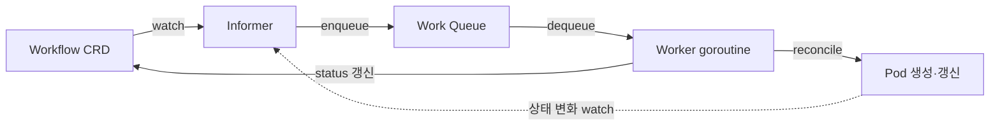
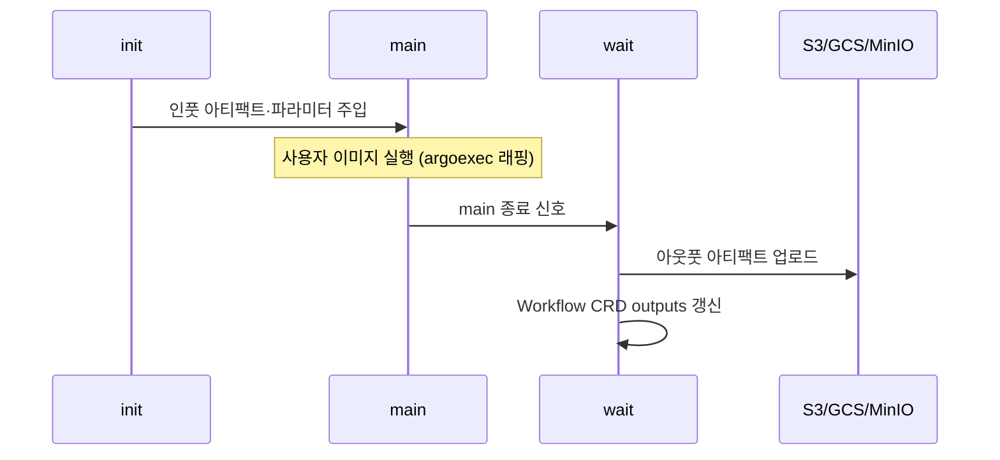
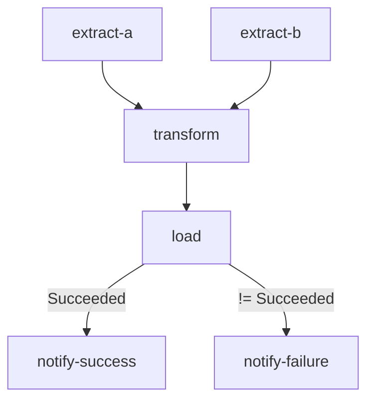
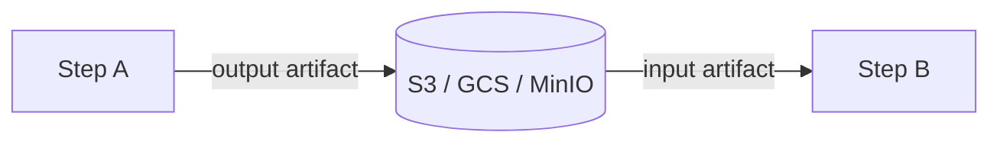


이 글은 [Argo Workflows](https://argoproj.github.io/argo-workflows/) 공식 문서를 읽고 정리한 노트입니다. 컨트롤러·CRD·템플릿 타입·Executor·아티팩트·아카이브까지 핵심 구성요소를 공식 스키마와 예제 YAML 중심으로 옮겼습니다. 재시도·동시성·메모이제이션·보안·성능 같은 심화 운영 패턴은 [고급 운영 편](/posts/argo-workflow-2/)에서 다룹니다.

Argo Workflows는 [Kubernetes](https://kubernetes.io/) 위에서 컨테이너 기반 워크플로우를 오케스트레이션하는 오픈소스 엔진입니다. Kubernetes [CRD(Custom Resource Definition)](https://kubernetes.io/docs/concepts/extend-kubernetes/api-extension/custom-resources/)로 구현되어 [Operator 패턴](https://kubernetes.io/docs/concepts/extend-kubernetes/operator/)을 그대로 활용하며, ML 파이프라인·배치 데이터 처리·CI/CD처럼 병렬 잡 실행이 필요한 도메인에서 사용됩니다. 최신 안정 버전은 v3.6.x이고, v4.0.0이 2026년 2월 GA로 릴리스됐습니다.

> [!NOTE] 사전지식
> 이 글은 Kubernetes의 Pod와 CRD(Custom Resource Definition) 개념을 안다고 가정합니다. 생소하다면 [Custom Resources](https://kubernetes.io/docs/concepts/extend-kubernetes/api-extension/custom-resources/) 문서를 먼저 보면 좋습니다.

## Workflow Controller

Workflow Controller는 Argo Workflows의 핵심 컴포넌트로, Kubernetes Operator 패턴으로 구현돼 있습니다. 동작은 다음과 같습니다.

- Informer로 Workflow와 Workflow Pod를 모니터링해 처리 큐에 추가합니다.
- Worker goroutine 풀이 큐에서 Workflow를 꺼내 처리합니다.
- 한 번에 하나의 Workflow만 처리하는 직렬 처리를 보장합니다.
- High Availability(HA) 모드에서는 리더 선출(leader election)로 한 인스턴스가 리더가 되고 나머지는 대기합니다.

소스 위치는 `workflow/controller/controller.go`입니다.

컨트롤러의 reconcile 흐름은 다음과 같습니다. Workflow CRD 변경을 Informer가 감지해 큐에 넣으면 Worker goroutine이 큐에서 꺼내 처리하면서 필요한 Pod를 생성하고, Pod 상태 변화가 다시 큐로 들어와 루프가 이어집니다.



네임스페이스 구성은 두 갈래입니다. Workflow Controller와 Argo Server는 `argo` 네임스페이스에서 실행되고, 사용자 Workflow Pod는 별도 네임스페이스에서 실행됩니다. 설치 시 클러스터 스코프와 네임스페이스 스코프 중 하나를 선택합니다.

### Pod 아키텍처

각 워크플로우 스텝 또는 DAG 태스크는 세 개의 컨테이너로 구성된 Pod를 생성합니다(Emissary Executor 기준).

| 컨테이너 | 역할 |
|----------|------|
| `init` | 아티팩트·파라미터를 main 컨테이너에 주입 (인풋 패칭) |
| `main` | 사용자 지정 이미지 실행, `argoexec` 유틸리티 마운트 |
| `wait` | 아웃풋 아티팩트·파라미터 저장, 컨테이너 생명주기 관리 |

세 컨테이너는 인풋 패칭 → 사용자 코드 실행 → 아웃풋 저장 순서로 동작합니다.



### Argo Server

Argo Server는 API와 UI를 제공하는 서버 컴포넌트입니다. REST API는 포트 2746에서 동작하며 [gRPC-Gateway](https://grpc-ecosystem.github.io/grpc-gateway/)로 REST를 프록시합니다. Web UI는 [React](https://react.dev/) SPA로 워크플로우 조회·실행·아티팩트 다운로드를 제공하고, SSO/[OAuth2](https://oauth.net/2/)는 [Dex](https://dexidp.io/) 통합으로 Google·GitHub·OIDC를 지원합니다. RBAC는 네임스페이스 레벨 권한을 제어하고, Rate Limiting은 기본값이 IP당 초당 1000 요청입니다.

SSO 인증 모드는 `workflow-controller-configmap`에 설정합니다.

```yaml
# workflow-controller-configmap
data:
  sso: |
    issuer: https://accounts.google.com
    clientId:
      name: argo-server-sso
      key: client-id
    clientSecret:
      name: argo-server-sso
      key: client-secret
    redirectUrl: https://argo.example.com/oauth2/callback
    scopes:
    - groups
    rbac:
      enabled: true
```

실행 모드는 독립 실행과 로컬 포트포워드가 있습니다.

```bash
# server 모드 (독립 실행)
argo server --auth-mode=sso --auth-mode=client

# 로컬 개발 포트포워드
kubectl port-forward -n argo svc/argo-server 2746:2746
```

## CRD 목록 (8개)

Argo Workflows는 8개의 CRD로 구성됩니다.

| CRD | 용도 |
|-----|------|
| `Workflow` | 실제 워크플로우 실행 인스턴스 |
| `WorkflowTemplate` | 재사용 가능한 워크플로우 정의 (네임스페이스 스코프) |
| `ClusterWorkflowTemplate` | WorkflowTemplate의 클러스터 스코프 버전 |
| `CronWorkflow` | Cron 스케줄 기반 워크플로우 자동 실행 |
| `WorkflowEventBinding` | 이벤트 트리거 기반 워크플로우 실행 |
| `WorkflowTaskSet` | Controller와 Exec Agent 간 데이터 교환 |
| `WorkflowArtifactGCTask` | 아티팩트 가비지 컬렉션 태스크 |
| `WorkflowTaskResult` | 태스크 실행 결과 저장 |

### Workflow CRD 구조

Workflow CRD의 기본 구조는 다음과 같습니다. `spec` 안에 진입점, 전역 인수, 종료 핸들러, 볼륨, 템플릿 배열이 들어갑니다.

```yaml
apiVersion: argoproj.io/v1alpha1
kind: Workflow
metadata:
  generateName: sample-workflow-
  namespace: argo
spec:
  # 진입점 템플릿 이름
  entrypoint: my-entrypoint

  # 워크플로우 전역 인수 (파라미터·아티팩트)
  arguments:
    parameters:
    - name: message
      value: "hello"
    artifacts:
    - name: binary-file
      http:
        url: https://example.com/file.bin

  # 종료 핸들러: 성공/실패 관계없이 항상 실행
  onExit: exit-handler

  # 볼륨 정의
  volumes:
  - name: shared-data
    emptyDir: {}

  # 서비스 어카운트
  serviceAccountName: workflow-sa

  # 템플릿 배열
  templates:
  - name: my-entrypoint
    container:
      image: busybox
      command: [echo]
      args: ["{{workflow.parameters.message}}"]

  - name: exit-handler
    container:
      image: alpine
      command: [sh, -c]
      args: ["echo 'Workflow finished with status: {{workflow.status}}'"]
```

주요 `spec` 필드는 다음과 같습니다.

- `entrypoint`: 실행 시작 템플릿 이름
- `arguments`: 워크플로우 레벨 파라미터·아티팩트
- `onExit`: 종료 핸들러 템플릿
- `templates`: 모든 템플릿 정의 배열
- `volumes`: Pod 공유 볼륨
- `serviceAccountName`: 실행 서비스 어카운트
- `parallelism`: 동시 실행 최대 Pod 수
- `podGC`: Pod 가비지 컬렉션 정책
- `ttlStrategy`: 완료 후 Workflow 객체 보존 기간

### WorkflowTemplate vs Workflow

`Workflow`는 일회성 실행 인스턴스이고, `WorkflowTemplate`은 재사용 가능한 정의 라이브러리입니다. 두 CRD의 차이는 다음과 같습니다.

| 특성 | Workflow | WorkflowTemplate |
|------|----------|------------------|
| 목적 | 일회성 실행 인스턴스 | 재사용 가능한 정의 템플릿 라이브러리 |
| 실행 여부 | 생성 즉시 실행 | 직접 실행 가능(v2.7+) 또는 참조로 사용 |
| 스코프 | 네임스페이스 | 네임스페이스 (ClusterWorkflowTemplate은 클러스터 전체) |
| 참조 방식 | - | `templateRef` 또는 `workflowTemplateRef` |

WorkflowTemplate 정의는 다음과 같습니다.

```yaml
apiVersion: argoproj.io/v1alpha1
kind: WorkflowTemplate
metadata:
  name: my-wf-template
  namespace: argo
spec:
  templates:
  - name: print-message
    inputs:
      parameters:
      - name: message
    container:
      image: busybox
      command: [echo]
      args: ["{{inputs.parameters.message}}"]
```

다른 Workflow에서 참조하는 방식은 두 가지입니다. `templateRef`는 WorkflowTemplate 안의 단일 템플릿을 참조하고, `workflowTemplateRef`는 WorkflowTemplate 전체를 실행합니다.

```yaml
# templateRef로 단일 템플릿 참조
steps:
- - name: call-template
    templateRef:
      name: my-wf-template     # WorkflowTemplate 이름
      template: print-message  # 템플릿 내 이름
    arguments:
      parameters:
      - name: message
        value: "hello from ref"

# workflowTemplateRef로 전체 WorkflowTemplate 실행
apiVersion: argoproj.io/v1alpha1
kind: Workflow
metadata:
  generateName: from-template-
spec:
  workflowTemplateRef:
    name: my-wf-template
  arguments:
    parameters:
    - name: message
      value: "injected"
```

### CronWorkflow CRD

CronWorkflow는 [Kubernetes CronJob](https://kubernetes.io/docs/concepts/workloads/controllers/cron-jobs/)과 동일한 인터페이스로 워크플로우를 스케줄링합니다. v3.6부터 복수 스케줄을 `schedules` 배열로 지정하고, `stopStrategy`의 [CEL(Common Expression Language)](https://cel.dev/) 표현식으로 조건 충족 시 자동 중단합니다.

```yaml
apiVersion: argoproj.io/v1alpha1
kind: CronWorkflow
metadata:
  name: daily-etl
  namespace: argo
spec:
  # v3.6+: 복수 스케줄 지원
  schedules:
  - "0 2 * * *"          # 매일 새벽 2시
  - "0 14 * * 1"         # 매주 월요일 오후 2시

  # timezone: IANA 타임존 (기본: 머신 타임존)
  timezone: "Asia/Seoul"

  # suspend: true 이면 스케줄링 일시 중단
  suspend: false

  # concurrencyPolicy: Allow | Replace | Forbid
  concurrencyPolicy: "Forbid"

  # 충돌 유예 기간 (Controller 재시작 후 놓친 스케줄 처리)
  startingDeadlineSeconds: 0

  # 보존 이력
  successfulJobsHistoryLimit: 3
  failedJobsHistoryLimit: 1

  # v3.6+: 특정 조건에서 CronWorkflow 자동 중단
  stopStrategy:
    expression: "cronworkflow.succeeded >= 5"

  # 실제 Workflow 스펙
  workflowSpec:
    entrypoint: main
    templates:
    - name: main
      container:
        image: alpine
        command: [sh, -c]
        args: ["date && echo 'ETL job started'"]
```

주의할 점은 다음과 같습니다.

- `concurrencyPolicy: Forbid`는 이전 실행이 완료되지 않으면 새 실행을 건너뜁니다(권장).
- `concurrencyPolicy: Replace`는 실행 중인 워크플로우를 취소하고 새로 시작합니다.

> [!WARNING] DST(일광절약시간) 주의
> CronWorkflow는 DST 전환 구간에서 스케줄이 누락되거나 두 번 실행될 수 있습니다. 중요한 작업은 UTC 타임존으로 설정하는 편이 안전합니다.

### WorkflowEventBinding CRD

WorkflowEventBinding은 HTTP 이벤트를 수신해 워크플로우를 트리거하는 CRD입니다. `event.selector`에 CEL 표현식을 써서 이벤트를 필터링하고, `submit`에 실행할 WorkflowTemplate과 인수를 지정합니다.

```yaml
apiVersion: argoproj.io/v1alpha1
kind: WorkflowEventBinding
metadata:
  name: webhook-trigger
  namespace: argo
spec:
  event:
    # CEL 표현식으로 이벤트 필터링
    # payload: JSON 이벤트 바디
    # metadata: HTTP 헤더 (소문자, x- 접두사)
    # discriminator: URL 경로 파라미터
    selector: >
      payload.action == "push" &&
      metadata["x-github-event"] == ["push"] &&
      discriminator == "github"
  submit:
    workflowTemplateRef:
      name: ci-pipeline
    arguments:
      parameters:
      - name: repo
        valueFrom:
          event: payload.repository.full_name
      - name: branch
        valueFrom:
          event: payload.ref
```

트리거는 Argo Server의 이벤트 엔드포인트로 보냅니다.

```bash
curl https://argo-server:2746/api/v1/events/argo/github \
  -H "x-github-event: push" \
  -d '{"action":"push","repository":{"full_name":"org/repo"},"ref":"refs/heads/main"}'
```

제약사항이 있습니다. 이벤트 처리는 비동기로 최대 10초 안에 응답하고 실패 알림이 없으며, 재처리·재시도 메커니즘도 없습니다. 신뢰성이 중요한 트리거에는 [Argo Events](https://argoproj.github.io/argo-events/) 사용을 권합니다.

## 템플릿 타입

템플릿 타입은 크게 여덟 가지입니다. Container와 Script는 단일 컨테이너를 실행하고, Steps와 DAG는 여러 태스크를 오케스트레이션하며, Resource·HTTP·Suspend·Data는 각각 특수한 동작을 수행합니다.

| 타입 | 설명 |
|------|------|
| Container | 가장 기본적인 타입. Kubernetes Pod spec의 container와 동일한 구조. 리소스 제한·환경 변수·볼륨 마운트·securityContext 설정 가능. |
| Script | Container의 편의 래퍼. `source` 필드에 인라인 스크립트를 작성하면 파일로 저장 후 실행되며, stdout이 자동으로 `outputs.result`에 캡처됨. |
| Steps | "리스트의 리스트" 구조. 외부 리스트(stage)는 순차, 내부 리스트는 병렬 실행. `when` 조건부 실행과 이전 스텝 아웃풋 참조 지원. |
| DAG | `dependencies` 선언 기반의 방향성 비순환 그래프. 의존성 완료 즉시 태스크 시작. 다이아몬드 패턴 등 복잡한 의존관계에 적합. |
| Resource | Kubernetes 리소스에 CRUD 작업 직접 수행. `create·apply·replace·patch·delete·get` 액션 지원. `successCondition`·`failureCondition`으로 완료 판정. |
| HTTP | HTTP 요청 실행 (v3.2+). 응답 바디가 `outputs.result`에 자동 저장. `successCondition`으로 응답 상태 코드 검사 가능. Argo Agent 권한 별도 설정 필요. |
| Suspend | 워크플로우 일시 중단. `duration` 설정으로 자동 재개 또는 무기한 대기. `argo resume` CLI·API로 수동 재개. 배포 승인 게이트 패턴에 자주 사용. |
| Data | 데이터 소스를 읽어 변환하는 특수 템플릿. 아티팩트 경로나 외부 소스에서 데이터를 읽고 CEL 표현식으로 필터링. |

### Container Template

가장 기본적인 템플릿 타입으로, Kubernetes Pod spec의 container와 동일한 구조를 씁니다.

```yaml
- name: process-data
  # 메타데이터 레이블
  metadata:
    labels:
      app: data-processor
  # 인풋 파라미터
  inputs:
    parameters:
    - name: input-file
  container:
    image: python:3.11-slim
    command: [python, /app/process.py]
    args: ["--input", "{{inputs.parameters.input-file}}"]
    # 리소스 제한
    resources:
      requests:
        memory: "256Mi"
        cpu: "500m"
      limits:
        memory: "1Gi"
        cpu: "2"
    # 환경 변수
    env:
    - name: ENV
      value: production
    - name: DB_PASSWORD
      valueFrom:
        secretKeyRef:
          name: db-secret
          key: password
    # 볼륨 마운트
    volumeMounts:
    - name: shared-data
      mountPath: /data
    # 보안 컨텍스트
    securityContext:
      runAsNonRoot: true
      runAsUser: 1000
  # 아웃풋 파라미터
  outputs:
    parameters:
    - name: result
      valueFrom:
        path: /tmp/result.txt
```

### Script Template

인라인 스크립트를 실행하는 Container의 편의 래퍼입니다. `source` 필드에 작성한 스크립트는 파일로 저장된 후 실행되며, `stdout` 출력이 자동으로 `outputs.result`에 저장됩니다.

```yaml
- name: generate-items
  script:
    image: python:3.11-alpine
    command: [python]
    source: |
      import json
      import sys

      items = [
          {"id": i, "value": f"item-{i}"}
          for i in range(1, 6)
      ]
      # stdout 출력 → outputs.result 로 자동 캡처
      json.dump(items, sys.stdout)
```

Bash 스크립트도 같은 방식으로 작성합니다.

```yaml
- name: check-health
  script:
    image: curlimages/curl:latest
    command: [bash]
    source: |
      STATUS=$(curl -s -o /dev/null -w "%{http_code}" https://api.example.com/health)
      if [ "$STATUS" = "200" ]; then
        echo "healthy"
      else
        echo "unhealthy"
        exit 1
      fi
```

### Steps Template

태스크를 순차·병렬로 실행하는 오케스트레이션 템플릿입니다. "리스트의 리스트" 구조로, 외부 리스트는 순차, 내부 리스트는 병렬로 실행됩니다. 아래 예시에서 1단계는 build만 실행하고, 2단계는 test-unit과 test-integration을 동시 실행하며, 3단계는 `when` 조건부로, 4단계는 이전 스텝의 출력을 받아 실행합니다.

```yaml
- name: build-and-deploy
  steps:
  # 1단계: 순차 (build만 실행)
  - - name: build
      template: build-image
      arguments:
        parameters:
        - name: tag
          value: "{{workflow.parameters.version}}"

  # 2단계: 병렬 (test-unit + test-integration 동시 실행)
  - - name: test-unit
      template: run-unit-tests
    - name: test-integration
      template: run-integration-tests

  # 3단계: 조건부 실행
  - - name: deploy-staging
      template: deploy
      when: "{{steps.test-unit.outputs.result}} == 'passed'"
      arguments:
        parameters:
        - name: env
          value: staging

  # 4단계: 다음 스텝에서 이전 출력 사용
  - - name: smoke-test
      template: smoke-test
      arguments:
        parameters:
        - name: endpoint
          value: "{{steps.deploy-staging.outputs.parameters.endpoint}}"
```

### DAG Template

의존관계(`dependencies`) 기반의 방향성 비순환 그래프입니다. 모든 의존성이 완료되면 즉시 태스크를 시작하므로 Steps보다 유연합니다.

```yaml
- name: data-pipeline
  dag:
    tasks:
    # 의존성 없음 → 즉시 시작
    - name: extract-a
      template: extract
      arguments:
        parameters:
        - name: source
          value: "database-a"

    - name: extract-b
      template: extract
      arguments:
        parameters:
        - name: source
          value: "database-b"

    # extract-a와 extract-b 모두 완료 후 시작
    - name: transform
      dependencies: [extract-a, extract-b]
      template: transform-data
      arguments:
        artifacts:
        - name: data-a
          from: "{{tasks.extract-a.outputs.artifacts.raw-data}}"
        - name: data-b
          from: "{{tasks.extract-b.outputs.artifacts.raw-data}}"

    # transform 완료 후 시작
    - name: load
      dependencies: [transform]
      template: load-to-warehouse
      arguments:
        artifacts:
        - name: transformed
          from: "{{tasks.transform.outputs.artifacts.clean-data}}"

    # 조건부 분기
    - name: notify-success
      dependencies: [load]
      template: send-notification
      when: "{{tasks.load.status}} == Succeeded"
      arguments:
        parameters:
        - name: message
          value: "Pipeline completed successfully"

    - name: notify-failure
      dependencies: [load]
      template: send-notification
      when: "{{tasks.load.status}} != Succeeded"
      arguments:
        parameters:
        - name: message
          value: "Pipeline failed!"
```

위 예시의 의존관계는 다음과 같습니다. `extract-a`·`extract-b`가 동시에 시작해 둘 다 끝나면 `transform`이, 그다음 `load`가 실행되고, `load` 결과에 따라 성공/실패 알림으로 분기합니다.



Steps와 DAG의 선택 기준은 다음과 같습니다. 단순 선형 파이프라인은 Steps가 가독성이 좋고, 복잡한 의존관계나 다이아몬드 패턴은 DAG가 적합합니다. DAG은 의존성이 완료되는 즉시 다음 태스크를 시작하므로 전체 처리 시간을 단축합니다.

### Resource Template

Kubernetes 리소스에 직접 CRUD 작업을 수행하는 템플릿입니다. 다른 CRD 생성, ConfigMap 관리 등에 활용합니다. `action`은 `create | apply | replace | patch | delete | get`을 지원하고, `successCondition`·`failureCondition`으로 완료를 판정합니다.

```yaml
- name: create-configmap
  resource:
    action: create          # create | apply | replace | patch | delete | get
    # 성공 조건 (선택)
    successCondition: status.ready == true
    # 실패 조건 (선택)
    failureCondition: status.failed > 3
    manifest: |
      apiVersion: v1
      kind: ConfigMap
      metadata:
        generateName: workflow-config-
        namespace: default
      data:
        job-id: "{{workflow.uid}}"
        timestamp: "{{workflow.creationTimestamp}}"
```

워크플로우 안에서 [Apache Spark](https://spark.apache.org/) Job을 Kubernetes Job으로 실행하는 예시는 다음과 같습니다.

```yaml
- name: submit-spark-job
  resource:
    action: create
    successCondition: status.succeeded > 0
    failureCondition: status.failed > 3
    manifest: |
      apiVersion: batch/v1
      kind: Job
      metadata:
        generateName: spark-job-
      spec:
        template:
          spec:
            containers:
            - name: spark
              image: apache/spark:3.5
              command: [spark-submit, /app/job.py]
            restartPolicy: Never
```

### HTTP Template

HTTP 요청을 실행하는 템플릿입니다(v3.2+). 응답 바디는 자동으로 `outputs.result`에 저장됩니다. v3.3부터는 `successCondition`에서 response 객체에 접근합니다.

```yaml
- name: call-api
  inputs:
    parameters:
    - name: payload
  http:
    url: "https://api.example.com/jobs"
    method: "POST"
    timeoutSeconds: 30
    headers:
    - name: "Content-Type"
      value: "application/json"
    - name: "Authorization"
      valueFrom:
        secretKeyRef:
          name: api-credentials
          key: token
    body: "{{inputs.parameters.payload}}"
    # v3.3+: 성공 조건 (response 객체 접근 가능)
    successCondition: "response.statusCode == 200"
```

HTTP Template은 Argo Agent를 필요로 하므로 적절한 RBAC 설정이 필수이고, 장기 실행 API 콜에는 `timeoutSeconds` 조정이 필요합니다.

### Suspend Template

워크플로우를 일시 중단해 수동 승인이나 외부 이벤트 대기에 사용합니다. `duration`을 설정하면 그 시간 후 자동 재개되고, 생략하면 무기한 대기합니다.

```yaml
- name: wait-for-approval
  suspend:
    duration: "1h"   # 1시간 후 자동 재개 (생략 시 무기한 대기)
```

수동 재개는 CLI·API로 합니다.

```bash
# CLI
argo resume my-workflow-abc123

# API
curl -X PUT https://argo-server:2746/api/v1/workflows/argo/my-workflow-abc123/resume

# 아웃풋 파라미터와 함께 재개 (suspend-template-outputs.yaml 패턴)
argo resume my-workflow-abc123 --node-field-selector displayName=wait-for-approval
```

배포 승인 게이트 패턴에서는 staging 배포 후 `approval-gate`에서 무기한 대기하고, 승인되면 production 배포로 진행합니다.

```yaml
templates:
- name: deployment-pipeline
  steps:
  - - name: deploy-staging
      template: deploy
      arguments:
        parameters: [{name: env, value: staging}]
  - - name: wait-approval
      template: approval-gate
  - - name: deploy-prod
      template: deploy
      arguments:
        parameters: [{name: env, value: production}]

- name: approval-gate
  suspend: {}   # duration 생략 → 무기한 대기
```

### Data Template

데이터 소스를 변환하는 템플릿입니다. 데이터를 소스에서 읽어 변환 후 출력하며, `transformations`의 표현식으로 필터링합니다.

```yaml
- name: process-s3-data
  data:
    source:
      artifactPaths:
        name: input-data
        s3:
          bucket: my-bucket
          key: input/data.json
    transformations:
    - expression: "item.value > 10"  # 필터 표현식
```

## Executor 타입

v3.4 이후로 사용 가능한 Executor는 emissary 하나뿐입니다. 공식 문서는 다음과 같이 설명합니다.

> As of v3.4, the only available executor is called emissary.
>
> — Argo Workflows 공식 문서, [Workflow Executors](https://argo-workflows.readthedocs.io/en/latest/workflow-executors/)

이전 Executor(pns·k8sapi·docker·kubelet)는 모두 v3.4에서 제거됐습니다.

| Executor | 상태 | 특징 | 제거 버전 |
|----------|------|------|-----------|
| `emissary` | 현재 지원 | init container 기반, 권한 최소화 | - |
| `pns` (Process Namespace Sharing) | Deprecated | 프로세스 네임스페이스 공유, root 필요 | v3.4 |
| `k8sapi` | Deprecated | Kubernetes API로 파일 수집 | v3.4 |
| `docker` | Deprecated | Docker 소켓 마운트 필요, 권한 높음 | v3.4 |
| `kubelet` | Deprecated | Kubelet API 사용 | v3.4 |

### Emissary 동작 방식

emissary는 `argoexec` 바이너리를 init container로 `/var/run/argo/` 볼륨에 마운트합니다. main 컨테이너의 원본 커맨드를 `argoexec`로 래핑해 실행하고, 아티팩트는 `/var/run/argo/outputs/artifacts/${path}.tgz`로 수집합니다.

장점은 다음과 같습니다.

- [GKE Autopilot](https://docs.cloud.google.com/kubernetes-engine/docs/concepts/autopilot-overview) 지원
- 권한 상승(privileged) 불필요
- Pod 서비스 어카운트 권한 이상으로 탈출 불가
- non-root 실행 지원
- 베이스 레이어 아티팩트 수집 (`/tmp` 등)
- 서브 프로세스 종료를 위한 init 프로세스 불필요

네트워크 API 접근은 Resource 타입 템플릿에서만 필요하고, 일반적으로는 디스크 읽기/쓰기만 합니다.

> [!WARNING] 이미지 태그 캐시 함정
> emissary는 이미지 태그가 같으면 캐시된 커맨드를 재사용합니다. 컨테이너의 entrypoint·커맨드를 바꿨다면 이미지 태그도 함께 바꿔야 예상대로 동작합니다. (emissary 자체 버그로 죽을 때는 exit code 64로 종료됩니다.)

deprecated Executor를 쓰던 환경에서는 `workflow-controller-configmap`에서 `containerRuntimeExecutors` 항목을 삭제해야 합니다.

```yaml
# 이전 (deprecated) 설정 → 제거 필요
# workflow-controller-configmap에서 아래 항목 삭제
data:
  containerRuntimeExecutors: |  # 이 항목 삭제
    - name: pns
      selector:
        matchLabels:
          workflows.argoproj.io/workflow-type: pns
```

아티팩트 수집 메커니즘은 다음 순서로 동작합니다. main 컨테이너 실행이 완료되면 wait 컨테이너(argoexec)가 output artifact 경로를 감시하다가 `tar+gzip`으로 압축해 `/var/run/argo/outputs/artifacts/<path>.tgz`에 저장하고, S3/GCS/MinIO에 업로드한 뒤 Workflow CRD의 `outputs` 필드를 갱신합니다.

## 아티팩트 시스템

아티팩트 시스템은 워크플로우 스텝 간 파일(바이너리·텍스트)을 외부 스토리지를 거쳐 전달합니다. 흐름은 다음과 같습니다.



지원 스토리지 백엔드는 [S3](https://aws.amazon.com/s3/)(AWS, S3 호환), [GCS(Google Cloud Storage)](https://docs.cloud.google.com/storage/docs), [Azure Blob Storage](https://learn.microsoft.com/en-us/azure/storage/blobs/), [MinIO](https://www.min.io/), [Git](https://git-scm.com/), HTTP URL입니다.

인풋과 아웃풋 아티팩트를 함께 쓰는 기본 예시는 다음과 같습니다. S3에서 인풋을 로드하고, 결과를 S3와 GCS에 각각 저장합니다.

```yaml
- name: generate-report
  inputs:
    artifacts:
    # S3에서 인풋 아티팩트 로드
    - name: raw-data
      path: /data/input.csv
      s3:
        bucket: my-data-bucket
        key: input/data.csv
  container:
    image: python:3.11-slim
    command: [python, /app/analyze.py]
  outputs:
    artifacts:
    # S3에 아웃풋 아티팩트 저장
    - name: report
      path: /tmp/report.html
      s3:
        bucket: my-data-bucket
        key: "output/{{workflow.uid}}/report.html"
    # GCS에 저장
    - name: metrics
      path: /tmp/metrics.json
      gcs:
        bucket: my-gcs-bucket
        key: "metrics/{{workflow.uid}}.json"
```

### 아티팩트 리포지토리 설정 (ConfigMap)

아티팩트 저장소를 Controller ConfigMap에 글로벌 기본값으로 설정하면 각 템플릿에서 반복을 줄일 수 있습니다. S3와 MinIO 설정은 다음과 같습니다.

```yaml
apiVersion: v1
kind: ConfigMap
metadata:
  name: workflow-controller-configmap
  namespace: argo
data:
  artifactRepository: |
    s3:
      bucket: argo-artifacts
      endpoint: s3.amazonaws.com        # AWS S3
      # endpoint: minio:9000            # MinIO
      # endpoint: storage.googleapis.com # GCS S3 호환 모드
      accessKeySecret:
        name: s3-credentials
        key: accessKey
      secretKeySecret:
        name: s3-credentials
        key: secretKey
      # useSDKCreds: true               # IRSA/인스턴스 프로파일 사용 시
      # insecure: true                  # MinIO TLS 미사용 시
```

GCS 네이티브 설정과 Azure Blob Storage 설정은 다음과 같습니다.

```yaml
data:
  artifactRepository: |
    gcs:
      bucket: argo-artifacts
      # GKE Workload Identity 사용 시 serviceAccountKeySecret 불필요
      serviceAccountKeySecret:
        name: gcs-credentials
        key: serviceAccountKey
```

```yaml
data:
  artifactRepository: |
    azure:
      endpoint: https://myaccount.blob.core.windows.net
      container: argo-artifacts
      # Managed Identity 사용
      useSDKCreds: true
      # 또는 액세스 키
      # accountKeySecret:
      #   name: azure-credentials
      #   key: account-access-key
```

AWS에서는 [IRSA(IAM Roles for Service Accounts)](https://docs.aws.amazon.com/eks/latest/userguide/iam-roles-for-service-accounts.html)를 쓸 수 있습니다. ServiceAccount에 `eks.amazonaws.com/role-arn` 어노테이션을 달고 ConfigMap에 `useSDKCreds: true`를 설정하면, 액세스 키 없이 IAM Role로 S3에 접근합니다.

> [!TIP] 키 없이 S3 접근
> IRSA를 쓰면 액세스 키를 Secret에 저장하지 않아도 됩니다. ServiceAccount에 `role-arn` 어노테이션 + ConfigMap `useSDKCreds: true` 조합이면 충분합니다.

```yaml
apiVersion: v1
kind: ServiceAccount
metadata:
  name: argo-workflow
  namespace: argo
  annotations:
    eks.amazonaws.com/role-arn: arn:aws:iam::123456789:role/argo-s3-role
---
apiVersion: v1
kind: ConfigMap
metadata:
  name: workflow-controller-configmap
  namespace: argo
data:
  artifactRepository: |
    s3:
      bucket: argo-artifacts
      endpoint: s3.amazonaws.com
      useSDKCreds: true    # 인스턴스 프로파일/IRSA 자동 사용
```

### Git·HTTP 아티팩트

Git 저장소를 인풋 아티팩트로 받을 수 있습니다. 비공개 저장소는 `sshPrivateKeySecret`으로 인증합니다.

```yaml
inputs:
  artifacts:
  - name: source-code
    path: /src
    git:
      repo: https://github.com/org/repo.git
      revision: "main"
      # 비공개 저장소
      sshPrivateKeySecret:
        name: git-credentials
        key: ssh-private-key
```

HTTP URL에서 직접 받을 수도 있습니다. 아래는 [Hugging Face](https://huggingface.co/)에서 모델 가중치를 basicAuth로 받는 예시입니다.

```yaml
inputs:
  artifacts:
  - name: model-weights
    path: /models/weights.bin
    http:
      url: https://huggingface.co/org/model/resolve/main/weights.bin
      auth:
        basicAuth:
          usernameSecret:
            name: hf-credentials
            key: username
          passwordSecret:
            name: hf-credentials
            key: password
```

### 아티팩트 GC (v3.4+)

`artifactGC.strategy`를 `OnWorkflowCompletion` 또는 `OnWorkflowDeletion`(또는 `Never`)으로 설정해 임시 아티팩트를 자동 정리합니다. 워크플로우 레벨과 개별 아티팩트 레벨 모두 설정할 수 있고, 개별 설정이 워크플로우 레벨을 오버라이드합니다.

```yaml
spec:
  # 워크플로우 레벨 GC 정책
  artifactGC:
    strategy: OnWorkflowCompletion   # OnWorkflowCompletion | OnWorkflowDeletion | Never
    serviceAccountName: artifact-gc-sa
  templates:
  - name: step-with-gc
    outputs:
      artifacts:
      - name: tmp-data
        path: /tmp/data
        # 개별 아티팩트 레벨 GC 오버라이드
        artifactGC:
          strategy: OnWorkflowDeletion
        s3:
          bucket: my-bucket
          key: "tmp/{{workflow.uid}}/data.tgz"
```

### 아티팩트 아카이브 포맷

기본 아카이브 포맷은 `tar+gzip`입니다. `archive: none: {}`으로 압축 없이 저장하거나 `zip`을 선택합니다.

```yaml
outputs:
  artifacts:
  - name: result
    path: /tmp/result
    archive:
      none: {}            # 압축 없이 저장
      # tar: {}           # 기본: tar+gzip
      # zip: {}           # ZIP 압축
    s3:
      bucket: my-bucket
      key: result/
```

## 파라미터 & 인수 시스템

파라미터는 워크플로우 글로벌 레벨과 템플릿 레벨로 나뉩니다. 글로벌 파라미터는 모든 템플릿에서 `{{workflow.parameters.*}}`로 접근하고, 템플릿 레벨 인풋 파라미터는 호출자가 주입합니다. 인풋 파라미터에 `default`가 없으면 필수, 있으면 선택입니다.

```yaml
spec:
  # 워크플로우 글로벌 파라미터 (모든 템플릿에서 접근 가능)
  arguments:
    parameters:
    - name: env
      value: staging
    - name: version
      value: "1.0.0"

  templates:
  - name: deploy
    # 템플릿 레벨 인풋 파라미터 (호출자가 주입)
    inputs:
      parameters:
      - name: region      # 필수 파라미터 (default 없음)
      - name: replicas
        default: "3"      # 선택 파라미터 (기본값 있음)
    container:
      image: deploy-tool:latest
      env:
      - name: ENV
        value: "{{workflow.parameters.env}}"          # 글로벌 파라미터 접근
      - name: VERSION
        value: "{{workflow.parameters.version}}"
      - name: REGION
        value: "{{inputs.parameters.region}}"         # 템플릿 파라미터
      - name: REPLICAS
        value: "{{inputs.parameters.replicas}}"
```

워크플로우 제출 시 파라미터는 `-p` 또는 파일로 주입합니다.

```bash
argo submit workflow.yaml \
  -p env=production \
  -p version=2.0.0

# 또는 파일로
argo submit workflow.yaml --parameter-file params.yaml
```


### withItems — 정적 팬아웃

정적 아이템 리스트로 병렬 실행합니다. 문자열 리스트뿐 아니라 JSON 객체 리스트도 쓸 수 있고, 객체는 `{{item.os}}`처럼 필드로 접근합니다.

```yaml
- name: parallel-process
  steps:
  - - name: process-item
      template: worker
      arguments:
        parameters:
        - name: message
          value: "{{item}}"
      # 정적 아이템 리스트로 병렬 실행
      withItems:
      - "task-alpha"
      - "task-beta"
      - "task-gamma"

# 객체 아이템 (JSON 형식)
  - - name: multi-arch-build
      template: build
      arguments:
        parameters:
        - name: os
          value: "{{item.os}}"
        - name: arch
          value: "{{item.arch}}"
      withItems:
      - { os: "linux", arch: "amd64" }
      - { os: "linux", arch: "arm64" }
      - { os: "darwin", arch: "amd64" }
```

### withParam — 동적 팬아웃

이전 스텝의 아웃풋(JSON 배열)을 받아 병렬 실행 수를 동적으로 결정합니다. 1단계에서 아이템 목록을 생성하고, 2단계에서 그 stdout을 `withParam`으로 받아 팬아웃합니다.

```yaml
- name: dynamic-fanout
  steps:
  # 1단계: 처리할 아이템 목록 동적 생성
  - - name: generate-items
      template: list-generator

  # 2단계: 생성된 아이템으로 병렬 팬아웃
  - - name: process-each
      template: processor
      arguments:
        parameters:
        - name: item-id
          value: "{{item.id}}"
        - name: item-value
          value: "{{item.value}}"
      # 이전 스텝 stdout JSON 배열을 withParam으로 사용
      withParam: "{{steps.generate-items.outputs.result}}"

- name: list-generator
  script:
    image: python:3.11-alpine
    command: [python]
    source: |
      import json
      import sys
      # stdout에 JSON 배열 출력 → withParam으로 소비
      items = [{"id": i, "value": f"data-{i}"} for i in range(10)]
      json.dump(items, sys.stdout)
```

### outputs.parameters & outputs.result

스크립트의 stdout은 `outputs.result`에 자동 캡처되고, 파일 출력은 `valueFrom.path`로 읽습니다.

```yaml
- name: compute
  script:
    image: python:3.11-alpine
    command: [python]
    source: |
      result = 42
      # stdout → outputs.result 자동 캡처
      print(result)
  outputs:
    parameters:
    # 파일에서 아웃풋 파라미터 읽기
    - name: computed-value
      valueFrom:
        path: /tmp/output.txt    # 파일 경로
    # 또는 stdout에서 캡처
    - name: direct-result
      valueFrom:
        # outputs.result = script stdout
        expression: "tasks['compute'].outputs.result"
```

DAG에서 출력을 다음 태스크로 전달할 때는 파라미터는 `value`로, 아티팩트는 `from`으로 넘깁니다.

```yaml
dag:
  tasks:
  - name: step-a
    template: generate
  - name: step-b
    dependencies: [step-a]
    template: process
    arguments:
      parameters:
      - name: input
        # 파라미터 전달
        value: "{{tasks.step-a.outputs.parameters.result}}"
      artifacts:
      - name: data-file
        # 아티팩트 전달
        from: "{{tasks.step-a.outputs.artifacts.output-file}}"
```

### Exit Handler

`spec.onExit`에 지정한 템플릿은 성공·실패와 관계없이 항상 실행됩니다. 리소스 정리나 조건부 알림에 사용합니다.

```yaml
spec:
  entrypoint: main-pipeline
  # 성공·실패 관계없이 항상 실행
  onExit: cleanup-and-notify

  templates:
  - name: main-pipeline
    steps:
    - - name: risky-step
        template: might-fail

  - name: cleanup-and-notify
    steps:
    # 성공/실패 모두에서 리소스 정리
    - - name: cleanup
        template: delete-temp-files

    # 조건부 알림
    - - name: on-success
        template: slack-notify
        when: "{{workflow.status}} == Succeeded"
        arguments:
          parameters:
          - name: message
            value: "Workflow {{workflow.name}} succeeded in {{workflow.duration}}s"

      - name: on-failure
        template: pagerduty-alert
        when: "{{workflow.status}} != Succeeded"
        arguments:
          parameters:
          - name: workflow-name
            value: "{{workflow.name}}"
          - name: status
            value: "{{workflow.status}}"
```

Exit Handler에서 접근할 수 있는 변수는 다음과 같습니다.

- `{{workflow.status}}` — Succeeded / Failed / Error
- `{{workflow.name}}` — 워크플로우 이름
- `{{workflow.uid}}` — 워크플로우 UID
- `{{workflow.duration}}` — 실행 시간(초)
- `{{workflow.failures}}` — 실패한 노드 JSON 배열

## Workflow 아카이브

완료된 워크플로우는 기본적으로 Kubernetes [etcd](https://etcd.io/)에 CRD 객체로 보존되지만, etcd 용량 한계로 오래된 워크플로우는 자동 삭제됩니다. Workflow Archive는 [PostgreSQL](https://www.postgresql.org/)이나 [MySQL](https://www.mysql.com/)에 이력을 영구 보존합니다. 대규모 운영 시에는 Archive와 `ttlStrategy` 설정이 필수입니다.

PostgreSQL 설정은 다음과 같습니다.

```yaml
# workflow-controller-configmap
apiVersion: v1
kind: ConfigMap
metadata:
  name: workflow-controller-configmap
  namespace: argo
data:
  persistence: |
    archive: true
    clusterName: production-cluster    # 멀티 클러스터 구분용 식별자
    postgresql:
      host: postgres.example.com
      port: 5432
      database: argo_workflows
      tableName: argo_workflows         # 기본값
      userNameSecret:
        name: argo-postgres-config
        key: username
      passwordSecret:
        name: argo-postgres-config
        key: password
      ssl: true
      sslMode: require                  # disable | allow | prefer | require | verify-ca | verify-full
```

자격 정보 Secret은 다음과 같이 생성합니다.

```bash
kubectl create secret generic argo-postgres-config \
  -n argo \
  --from-literal=username=argo_user \
  --from-literal=password=secure_password
```

MySQL 설정은 다음과 같습니다.

```yaml
data:
  persistence: |
    archive: true
    mysql:
      host: mysql.example.com
      port: 3306
      database: argo_workflows
      tableName: argo_workflows
      userNameSecret:
        name: argo-mysql-config
        key: username
      passwordSecret:
        name: argo-mysql-config
        key: password
```

지원 버전은 PostgreSQL ≥9.4, MySQL >7.8, [MariaDB](https://mariadb.org/) ≥10.2입니다.

보존 정책은 `archiveTTL`로 설정합니다(기본값 무기한). GC 주기는 컨트롤러 환경 변수 `ARCHIVED_WORKFLOW_GC_PERIOD`로 조정하며 기본값은 24시간입니다.

```yaml
data:
  persistence: |
    archive: true
    archiveTTL: 30d           # 30일 후 자동 삭제 (기본: 무기한)
    postgresql:
      host: postgres
      # ...
```

```yaml
# Workflow Controller Deployment 환경 변수
env:
- name: ARCHIVED_WORKFLOW_GC_PERIOD
  value: "24h"   # 기본: 24시간마다 GC 실행
```

아카이브된 워크플로우는 CLI로 조회·재실행합니다.

```bash
# CLI로 아카이브된 워크플로우 목록
argo list --archived

# 특정 UID 조회
argo get --archived <workflow-uid>

# 아카이브에서 재실행
argo resubmit --archived <workflow-uid>
```


DBA가 스키마를 수동 관리하면 `skipMigration: true`로 자동 마이그레이션을 건너뜁니다.

```yaml
# 자동 마이그레이션 건너뛰기 (DBA가 수동 관리 시)
data:
  persistence: |
    archive: true
    skipMigration: true
    postgresql:
      host: postgres
      # ...
```

IAM 기반 인증(AWS RDS IAM, Google Cloud IAM)은 현재 미지원입니다. 데이터베이스 프록시(RDS Proxy, Cloud SQL Auth Proxy)로 우회하는 방법은 있습니다.

## 고급 패턴

### Semaphore / Mutex (동시성 제어)

`workflow-controller-configmap`에 semaphore를 정의하고 Workflow의 `synchronization`에서 참조합니다. 아래 예시는 동시 실행을 최대 2개로 제한합니다.

```yaml
# workflow-controller-configmap에 semaphore 정의
data:
  semaphore: |
    workflows.argoproj.io/semaphore-config.yaml: |
      resourceVersion: "1"
      limit: 2   # 동시 실행 최대 2개

# Workflow에서 semaphore 적용
spec:
  synchronization:
    semaphore:
      configMapKeyRef:
        name: semaphore-config
        key: workflow
```

### Retry 전략

`retryStrategy`로 재시도 횟수·정책·백오프를 설정합니다. `retryPolicy`는 `Always | OnFailure | OnError | OnTransientError`를 지원하고, v3.2부터는 `expression`으로 조건부 재시도를 정의합니다.

```yaml
- name: flaky-step
  retryStrategy:
    limit: "3"                    # 최대 재시도 횟수
    retryPolicy: "Always"         # Always | OnFailure | OnError | OnTransientError
    backoff:
      duration: "2s"              # 초기 대기 시간
      factor: "2"                 # 지수 백오프 인자
      maxDuration: "1m"           # 최대 대기 시간
    # 재시도 표현식 (v3.2+)
    expression: "lastRetry.exitCode == 1"
  container:
    image: my-app
    command: [./unstable-script.sh]
```

### Node Affinity / Tolerations

GPU 노드처럼 특정 노드에 스케줄링할 때는 `nodeSelector`·`tolerations`·리소스 제한을 함께 지정합니다.

```yaml
- name: gpu-step
  nodeSelector:
    accelerator: nvidia-tesla-t4
  tolerations:
  - key: "nvidia.com/gpu"
    operator: "Exists"
    effect: "NoSchedule"
  container:
    image: nvcr.io/nvidia/cuda:12.0-base
    resources:
      limits:
        nvidia.com/gpu: 1
```

### 글로벌 파라미터 동적 업데이트 (v3.1+)

스텝 아웃풋의 `globalName`으로 글로벌 파라미터를 갱신하면, 이후 `workflow.parameters.app-version`으로 노출됩니다.

```yaml
# 스텝 아웃풋으로 글로벌 파라미터 갱신
- name: update-version
  outputs:
    parameters:
    - name: version
      globalName: app-version     # workflow.parameters.app-version 로 노출
      valueFrom:
        path: /tmp/version.txt
```

### Inline Workflow (v3.2+)

다른 템플릿 안에서 워크플로우 스펙을 바로 인라인으로 정의합니다.

```yaml
- name: child-workflow
  steps:
  - - name: nested
      inline:
        container:
          image: busybox
          command: [echo, "inlined"]
```

## v3.6 / v4.0 주요 변경사항

v3.6의 주요 변경은 다음과 같습니다.

- CronWorkflow 복수 스케줄(`schedules` 배열) 지원
- CronWorkflow `stopStrategy`(조건 기반 자동 종료)
- Artifact GC 전략 강화 (OSS 드라이버 디렉터리 지원, 스트리밍 지원)
- 대용량 환경 변수 ConfigMap 자동 오프로드
- Pod 병렬 삭제 (속도 향상)
- 65개 신기능, 268개 버그 수정

v4.0(2026-02 GA)의 주요 변경은 다음과 같습니다.

- CRD 검증 규칙: 클러스터 어드미션 시점에 설정 오류를 조기 탐지
- Artifact Driver 플러그인: GRPC 서버 플러그인으로 커스텀 스토리지 드라이버 추가
- 구조적 로깅: logrus에서 컨텍스트 인식 structured logging으로 전환
- 변환 도구: `argo convert` 커맨드(단수→복수 필드 마이그레이션)
- Custom CA 인증서: OIDC SSO 자체 서명 인증서 지원
- Global Parallelism 업데이트가 Controller 재시작 없이 즉시 반영
- Write-back informer 기본 비활성화(예측 불가 동작 감소)

## 실무에서 챙겨야 할 지점

앞 절들에 흩어져 있는 운영상 주의점을 한곳에 모았습니다.

**스토리지·아카이브**
- 완료된 Workflow 객체가 etcd에 쌓이면 용량을 잠식합니다. Workflow Archive로 완료분을 DB에 내보내고 `ttlStrategy`로 객체 보존 기간을 제한합니다(대규모 운영 시 필수).
- Archive DB 연결은 IAM 기반 인증(AWS RDS IAM·Google Cloud IAM)을 아직 지원하지 않습니다. IAM 환경에서는 RDS Proxy·Cloud SQL Auth Proxy로 우회합니다.

**Executor**
- v3.4부터 Executor는 emissary 하나뿐입니다. 이전 환경에 남은 `containerRuntimeExecutors` ConfigMap 항목은 삭제합니다.
- emissary는 이미지 태그가 같으면 캐시된 커맨드를 재사용합니다. 컨테이너 커맨드를 바꾸면 이미지 태그도 함께 바꿉니다.

**스케줄·이벤트**
- CronWorkflow는 DST(일광절약시간) 전환 구간에서 스케줄이 누락되거나 중복 실행될 수 있습니다. 중요한 작업은 UTC 타임존으로 설정합니다.
- WorkflowEventBinding은 비동기 처리에 실패 알림·재시도가 없습니다. 신뢰성이 중요한 트리거는 Argo Events를 함께 씁니다.

**보안**
- 아티팩트 키에 `../`가 포함되면 경로 순회가 허용됩니다. 신뢰할 수 없는 입력으로 키를 만들 때는 검증합니다.
- HTTP Template은 Argo Agent를 통해 동작하므로 해당 Agent에 RBAC 권한을 부여합니다.

## 참고 자료

- Argo Workflows, [공식 문서](https://argoproj.github.io/argo-workflows/)
- Argo Workflows, [문서(Read the Docs)](https://argo-workflows.readthedocs.io/en/latest/) — Architecture·Executors·Archive·Artifact Repository·New Features 등 세부 페이지 포함
- Argo Project, [Argo Events](https://argoproj.github.io/argo-events/)
- Kubernetes, [Custom Resources](https://kubernetes.io/docs/concepts/extend-kubernetes/api-extension/custom-resources/)
- Kubernetes, [Operator pattern](https://kubernetes.io/docs/concepts/extend-kubernetes/operator/)
- cel.dev, [Common Expression Language](https://cel.dev/)
- Amazon Web Services, [IAM roles for service accounts (EKS)](https://docs.aws.amazon.com/eks/latest/userguide/iam-roles-for-service-accounts.html)
- The PostgreSQL Global Development Group, [PostgreSQL](https://www.postgresql.org/)

