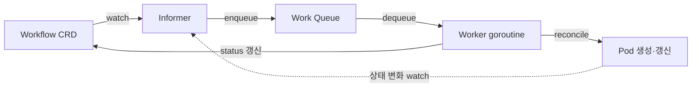
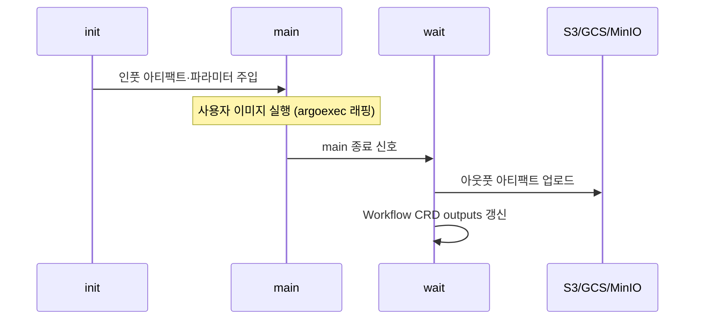
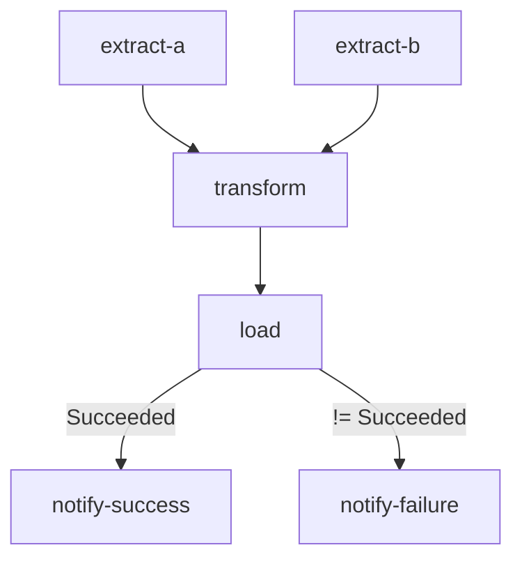
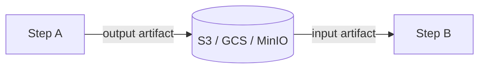



[Argo Workflows](https://argo-workflows.readthedocs.io/en/latest/)는 [Kubernetes](https://kubernetes.io/) 위에서 컨테이너 기반 워크플로우를 실행·오케스트레이션하는 오픈소스 엔진입니다. 여러 컨테이너 잡을 순차·병렬로 엮어 하나의 파이프라인으로 돌릴 때, 그 실행 순서·의존관계·데이터 전달·재시도·스케줄을 Kubernetes 리소스로 선언해 관리합니다. ML 파이프라인, 배치 데이터 처리, CI/CD처럼 병렬 잡 실행이 필요한 도메인에서 널리 쓰입니다.

핵심 설계는 두 가지로 요약됩니다. 첫째, 워크플로우를 별도 런타임이 아니라 Kubernetes [**CRD(Custom Resource Definition, 쿠버네티스에 새 리소스 타입을 추가하는 확장 메커니즘)**](https://kubernetes.io/docs/concepts/extend-kubernetes/api-extension/custom-resources/)로 정의합니다. 둘째, 그 CRD를 감시하며 Pod를 생성·조정하는 **Workflow Controller**가 Kubernetes [Operator 패턴](https://kubernetes.io/docs/concepts/extend-kubernetes/operator/)으로 동작합니다. 그 결과 워크플로우가 `kubectl`로 다루는 일반 리소스처럼 취급됩니다.

이 글은 Argo Workflows 공식 문서의 내용을 정리한 노트입니다. 컨트롤러·Pod 구조부터 CRD 목록, 템플릿 타입, 아티팩트, 파라미터, 실행기(Executor), 아카이브까지 핵심 구성요소를 순서대로 다룹니다. 재시도·동시성·메모이제이션·보안·성능 같은 심화 운영 패턴은 [2편](/posts/argo-workflow-2/)에서 다룹니다.

> [!NOTE] 버전 기준
> 최신 안정 버전은 v3.6.x이며, v4.0.0은 2026년 2월 GA로 릴리스되었습니다. 아래 설명은 이 버전대를 기준으로 합니다.

## 핵심 아키텍처

Argo Workflows는 워크플로우를 정의하는 CRD와 그것을 실행하는 컨트롤러, 그리고 실제 작업을 담는 Pod로 구성됩니다. 사용자는 Workflow CRD를 제출하고, 컨트롤러가 이를 감시하다 각 스텝마다 Pod를 만들어 실행합니다.

### Workflow Controller — Kubernetes Operator 패턴

Workflow Controller는 Argo Workflows의 핵심 컴포넌트로, Kubernetes Operator 패턴으로 구현되어 있습니다. Operator 패턴은 사용자 정의 리소스(CRD)를 지속적으로 감시하다가, 리소스의 현재 상태를 원하는 상태로 맞춰가는(reconcile) 컨트롤러를 두는 방식입니다.

reconcile 흐름은 다음 그림과 같습니다. Workflow CRD 변경을 Informer가 감지해 큐에 넣으면 Worker goroutine이 큐에서 꺼내 처리하면서 Pod를 생성하고, Pod의 상태 변화가 다시 큐로 들어와 루프가 이어집니다.


```mermaid
flowchart LR
    A[Workflow CRD] -->|watch| B[Informer]
    B -->|enqueue| C[Work Queue]
    C -->|dequeue| D[Worker goroutine]
    D -->|reconcile| E[Pod 생성·갱신]
    E -.->|상태 변화 watch| B
    D -->|status 갱신| A
```

동작 방식은 다음과 같습니다.

- Informers를 통해 Workflow와 Workflow Pod를 모니터링하고 처리 큐에 추가
- Worker goroutine 풀이 큐에서 Workflow를 꺼내 처리
- **한 번에 하나의 Workflow만 처리**하는 직렬 처리 보장
- High Availability(HA) 모드에서는 리더 선출(leader election)로 한 인스턴스만 리더가 되고 나머지는 대기

컨트롤러 소스 위치는 `workflow/controller/controller.go`입니다.

네임스페이스는 역할에 따라 나뉩니다.

- Workflow Controller와 Argo Server는 `argo` 네임스페이스에서 실행
- 사용자 Workflow Pod는 별도 네임스페이스에서 실행 — 설치 시 클러스터 스코프와 네임스페이스 스코프 중에서 선택 가능

### Pod 아키텍처 — init·main·wait 세 컨테이너

각 워크플로우 스텝 또는 DAG 태스크는 세 개의 컨테이너로 구성된 Pod를 생성합니다. 아래는 Emissary Executor(뒤의 "Executor 타입" 참조) 기준 구성입니다.

| 컨테이너 | 맡는 일 |
|----------|------|
| `init` | main이 쓸 입력 아티팩트·파라미터를 미리 받아 넣음 |
| `main` | 사용자가 지정한 이미지를 돌림 (여기에 `argoexec`가 마운트됨) |
| `wait` | 결과 아티팩트·파라미터를 거둬 저장하고 컨테이너 수명을 관리 |

`init`이 입력을 준비하고, `main`이 사용자 작업을 실행하며, `wait`이 결과를 수집하고 컨테이너의 생명주기를 관리하는 구조입니다. 세 컨테이너의 실행 순서는 다음과 같습니다.


```mermaid
sequenceDiagram
    participant init
    participant main
    participant wait
    participant Storage as S3/GCS/MinIO
    init->>main: 인풋 아티팩트·파라미터 주입
    Note over main: 사용자 이미지 실행 (argoexec 래핑)
    main->>wait: main 종료 신호
    wait->>Storage: 아웃풋 아티팩트 업로드
    wait->>wait: Workflow CRD outputs 갱신
```

### CRD 목록 (8개)

Argo Workflows는 8개의 CRD로 구성됩니다. 사용자가 직접 작성하는 것은 앞쪽 다섯 개(`Workflow`, `WorkflowTemplate`, `ClusterWorkflowTemplate`, `CronWorkflow`, `WorkflowEventBinding`)이고, 뒤쪽 세 개는 컨트롤러가 내부적으로 사용합니다.

| CRD | 무엇을 담당하나 |
|-----|------|
| `Workflow` | 한 번 실행되는 워크플로우 인스턴스 그 자체 |
| `WorkflowTemplate` | 네임스페이스 안에서 재사용하는 워크플로우 정의 |
| `ClusterWorkflowTemplate` | 위 정의를 클러스터 전역으로 넓힌 것 |
| `CronWorkflow` | 지정한 Cron 주기마다 워크플로우를 띄우는 스케줄러 |
| `WorkflowEventBinding` | 들어온 이벤트를 워크플로우 실행으로 연결 |
| `WorkflowTaskSet` | 컨트롤러와 Exec Agent가 데이터를 주고받는 통로 |
| `WorkflowArtifactGCTask` | 아티팩트 정리(GC) 작업 단위 |
| `WorkflowTaskResult` | 개별 태스크가 남긴 실행 결과 |

### Workflow CRD 구조

`Workflow`는 실제 실행 인스턴스를 정의하는 CRD입니다. 진입점 템플릿, 전역 인수, 종료 핸들러, 볼륨, 서비스 어카운트, 그리고 실행할 템플릿 배열을 담습니다.

```yaml
apiVersion: argoproj.io/v1alpha1
kind: Workflow
metadata:
  generateName: sample-workflow-
  namespace: argo
spec:
  # 진입점 템플릿 이름
  entrypoint: my-entrypoint

  # 워크플로우 전역 인수 (파라미터·아티팩트)
  arguments:
    parameters:
    - name: message
      value: "hello"
    artifacts:
    - name: binary-file
      http:
        url: https://example.com/file.bin

  # 종료 핸들러: 성공/실패 관계없이 항상 실행
  onExit: exit-handler

  # 볼륨 정의
  volumes:
  - name: shared-data
    emptyDir: {}

  # 서비스 어카운트
  serviceAccountName: workflow-sa

  # 템플릿 배열
  templates:
  - name: my-entrypoint
    # 템플릿 타입별 스펙 정의
    container:
      image: busybox
      command: [echo]
      args: ["{{workflow.parameters.message}}"]

  - name: exit-handler
    container:
      image: alpine
      command: [sh, -c]
      args: ["echo 'Workflow finished with status: {{workflow.status}}'"]
```

주요 `spec` 필드는 다음과 같습니다.

- `entrypoint`: 어느 템플릿부터 시작할지 지정
- `arguments`: 워크플로우 전역에 뿌릴 파라미터와 아티팩트
- `onExit`: 끝날 때 부르는 핸들러 템플릿
- `templates`: 여기 쓰인 모든 템플릿을 담는 배열
- `volumes`: Pod들이 함께 쓰는 볼륨
- `serviceAccountName`: 실행에 쓸 서비스 어카운트
- `parallelism`: 한꺼번에 돌릴 수 있는 Pod 상한
- `podGC`: 끝난 Pod를 언제 치울지 정하는 정책
- `ttlStrategy`: 완료된 Workflow 객체를 얼마나 남겨둘지

### WorkflowTemplate — 재사용 정의

`WorkflowTemplate`은 재사용 가능한 워크플로우 정의를 담는 CRD입니다. `Workflow`가 생성 즉시 실행되는 일회성 인스턴스라면, `WorkflowTemplate`은 여러 워크플로우에서 참조하는 정의 라이브러리에 가깝습니다.

| 특성 | Workflow | WorkflowTemplate |
|------|----------|------------------|
| 쓰임새 | 한 번 돌리고 끝나는 실행 단위 | 여러 번 끌어다 쓰는 정의 모음 |
| 언제 도나 | 만들면 곧바로 실행 | v2.7+ 라면 단독 실행도 되고, 아니면 참조 대상으로만 |
| 미치는 범위 | 한 네임스페이스 안 | 한 네임스페이스 안 (전역으로 넓히려면 ClusterWorkflowTemplate) |
| 가리키는 법 | 해당 없음 | `templateRef` 또는 `workflowTemplateRef` |

정의 예시는 다음과 같습니다.

```yaml
apiVersion: argoproj.io/v1alpha1
kind: WorkflowTemplate
metadata:
  name: my-wf-template
  namespace: argo
spec:
  templates:
  - name: print-message
    inputs:
      parameters:
      - name: message
    container:
      image: busybox
      command: [echo]
      args: ["{{inputs.parameters.message}}"]
```

참조 방식은 두 가지입니다. `templateRef`는 WorkflowTemplate 안의 **단일 템플릿**을 참조하고, `workflowTemplateRef`는 **전체 WorkflowTemplate**을 실행합니다.

```yaml
# templateRef로 단일 템플릿 참조
steps:
- - name: call-template
    templateRef:
      name: my-wf-template     # WorkflowTemplate 이름
      template: print-message  # 템플릿 내 이름
    arguments:
      parameters:
      - name: message
        value: "hello from ref"

# workflowTemplateRef로 전체 WorkflowTemplate 실행
apiVersion: argoproj.io/v1alpha1
kind: Workflow
metadata:
  generateName: from-template-
spec:
  workflowTemplateRef:
    name: my-wf-template
  arguments:
    parameters:
    - name: message
      value: "injected"
```

### CronWorkflow — 스케줄 실행

`CronWorkflow`는 [Kubernetes CronJob](https://kubernetes.io/docs/concepts/workloads/controllers/cron-jobs/)과 동일한 인터페이스로 워크플로우를 주기적으로 실행하는 CRD입니다. Cron 표현식으로 실행 시각을 지정하고, 동시성 정책·이력 보존·타임존을 함께 설정합니다.

```yaml
apiVersion: argoproj.io/v1alpha1
kind: CronWorkflow
metadata:
  name: daily-etl
  namespace: argo
spec:
  # v3.6+: 복수 스케줄 지원
  schedules:
  - "0 2 * * *"          # 매일 새벽 2시
  - "0 14 * * 1"         # 매주 월요일 오후 2시

  # timezone: IANA 타임존 (기본: 머신 타임존)
  timezone: "Asia/Seoul"

  # suspend: true 이면 스케줄링 일시 중단
  suspend: false

  # concurrencyPolicy: Allow | Replace | Forbid
  concurrencyPolicy: "Forbid"

  # 충돌 유예 기간 (Controller 재시작 후 놓친 스케줄 처리)
  startingDeadlineSeconds: 0

  # 보존 이력
  successfulJobsHistoryLimit: 3
  failedJobsHistoryLimit: 1

  # v3.6+: 특정 조건에서 CronWorkflow 자동 중단
  stopStrategy:
    expression: "cronworkflow.succeeded >= 5"

  # 실제 Workflow 스펙
  workflowSpec:
    entrypoint: main
    templates:
    - name: main
      container:
        image: alpine
        command: [sh, -c]
        args: ["date && echo 'ETL job started'"]
```

동시성 정책과 DST 관련 주의점은 다음과 같습니다.

- `concurrencyPolicy: Forbid`: 이전 실행이 완료되지 않으면 새 실행을 건너뜀 (권장)
- `concurrencyPolicy: Replace`: 실행 중인 워크플로우를 취소하고 새로 시작

> [!WARNING] DST 전환 주의
> DST(일광절약시간) 전환 시 스케줄이 건너뛰거나 두 번 실행될 수 있습니다. 중요한 작업은 UTC 타임존 사용을 권장합니다.

v3.6에서 두 기능이 추가됐습니다. `schedules`는 복수 스케줄을 배열로 받고, `stopStrategy`의 `expression`은 [CEL(Common Expression Language)](https://cel.dev/) 표현식으로 특정 조건(예: 성공 횟수 도달) 충족 시 CronWorkflow를 자동 중단합니다.

### WorkflowEventBinding — 이벤트 트리거

`WorkflowEventBinding`은 HTTP 이벤트를 수신해 워크플로우를 트리거하는 CRD입니다. 외부 시스템의 webhook을 받아 조건에 맞으면 지정된 WorkflowTemplate을 실행합니다.

```yaml
apiVersion: argoproj.io/v1alpha1
kind: WorkflowEventBinding
metadata:
  name: webhook-trigger
  namespace: argo
spec:
  event:
    # CEL 표현식으로 이벤트 필터링
    # payload: JSON 이벤트 바디
    # metadata: HTTP 헤더 (소문자, x- 접두사)
    # discriminator: URL 경로 파라미터
    selector: >
      payload.action == "push" &&
      metadata["x-github-event"] == ["push"] &&
      discriminator == "github"
  submit:
    workflowTemplateRef:
      name: ci-pipeline
    arguments:
      parameters:
      - name: repo
        valueFrom:
          event: payload.repository.full_name
      - name: branch
        valueFrom:
          event: payload.ref
```

트리거는 Argo Server의 이벤트 엔드포인트에 요청을 보내는 방식입니다.

```bash
curl https://argo-server:2746/api/v1/events/argo/github \
  -H "x-github-event: push" \
  -d '{"action":"push","repository":{"full_name":"org/repo"},"ref":"refs/heads/main"}'
```

제약사항이 있습니다. 이벤트 처리는 비동기이며 최대 10초 안에 응답하고 실패 알림이 없습니다. 또한 이벤트 재처리·재시도 메커니즘이 없습니다. 따라서 중요한 트리거에는 [Argo Events](https://argoproj.github.io/argo-events/) 사용이 권장됩니다.

### Argo Server — API·UI

Argo Server는 API와 UI를 제공하는 서버 컴포넌트입니다. 워크플로우를 조회·실행하거나 아티팩트를 다운로드하는 진입점이 됩니다.

주요 기능은 다음과 같습니다.

- REST API (포트 2746) — [gRPC-Gateway](https://grpc-ecosystem.github.io/grpc-gateway/)로 REST 프록시
- Web UI — [React](https://react.dev/) SPA, 워크플로우 조회·실행·아티팩트 다운로드
- SSO/[OAuth2](https://oauth.net/2/) — [Dex](https://dexidp.io/) 통합, Google/GitHub/OIDC 지원
- RBAC — 네임스페이스 레벨 권한 제어
- Rate Limiting — 기본 IP당 초당 1000 요청

인증 모드는 ConfigMap에서 설정합니다.

```yaml
# workflow-controller-configmap
data:
  sso: |
    issuer: https://accounts.google.com
    clientId:
      name: argo-server-sso
      key: client-id
    clientSecret:
      name: argo-server-sso
      key: client-secret
    redirectUrl: https://argo.example.com/oauth2/callback
    scopes:
    - groups
    rbac:
      enabled: true
```

실행은 서버 모드 또는 로컬 개발용 포트포워드로 합니다.

```bash
# server 모드 (독립 실행)
argo server --auth-mode=sso --auth-mode=client

# 로컬 개발 포트포워드
kubectl port-forward -n argo svc/argo-server 2746:2746
```

## 템플릿 타입

템플릿은 워크플로우 안에서 실제로 무슨 일을 할지 정의하는 단위입니다. Argo Workflows는 여덟 가지 템플릿 타입을 제공하며, 컨테이너를 실행하는 타입(Container·Script)과 흐름을 오케스트레이션하는 타입(Steps·DAG), 그리고 특수 목적 타입(Resource·HTTP·Suspend·Data)으로 나뉩니다.

### Container Template

가장 기본적인 템플릿 타입입니다. Kubernetes Pod spec의 container와 동일한 구조를 사용하므로, 리소스 제한·환경 변수·볼륨 마운트·securityContext를 그대로 지정할 수 있습니다.

```yaml
- name: process-data
  # 메타데이터 레이블
  metadata:
    labels:
      app: data-processor
  # 인풋 파라미터
  inputs:
    parameters:
    - name: input-file
  container:
    image: python:3.11-slim
    command: [python, /app/process.py]
    args: ["--input", "{{inputs.parameters.input-file}}"]
    # 리소스 제한
    resources:
      requests:
        memory: "256Mi"
        cpu: "500m"
      limits:
        memory: "1Gi"
        cpu: "2"
    # 환경 변수
    env:
    - name: ENV
      value: production
    - name: DB_PASSWORD
      valueFrom:
        secretKeyRef:
          name: db-secret
          key: password
    # 볼륨 마운트
    volumeMounts:
    - name: shared-data
      mountPath: /data
    # 보안 컨텍스트
    securityContext:
      runAsNonRoot: true
      runAsUser: 1000
  # 아웃풋 파라미터
  outputs:
    parameters:
    - name: result
      valueFrom:
        path: /tmp/result.txt
```

### Script Template

인라인 스크립트를 실행하는 Container의 편의 래퍼입니다. `source` 필드에 작성한 스크립트는 파일로 저장된 후 실행되며, `stdout` 출력이 자동으로 `outputs.result`에 저장됩니다. 별도 이미지를 빌드하지 않고 짧은 스크립트를 바로 넣을 때 편합니다.

```yaml
- name: generate-items
  script:
    image: python:3.11-alpine
    command: [python]
    source: |
      import json
      import sys

      items = [
          {"id": i, "value": f"item-{i}"}
          for i in range(1, 6)
      ]
      # stdout 출력 → outputs.result 로 자동 캡처
      json.dump(items, sys.stdout)
```

Bash 스크립트도 같은 방식으로 작성합니다.

```yaml
- name: check-health
  script:
    image: curlimages/curl:latest
    command: [bash]
    source: |
      STATUS=$(curl -s -o /dev/null -w "%{http_code}" https://api.example.com/health)
      if [ "$STATUS" = "200" ]; then
        echo "healthy"
      else
        echo "unhealthy"
        exit 1
      fi
```

### Steps Template

태스크를 순차·병렬로 실행하는 오케스트레이션 템플릿입니다. **"리스트의 리스트"** 구조를 씁니다. 외부 리스트는 순차(stage)로, 내부 리스트는 병렬(parallel)로 실행됩니다. `when` 조건부 실행과 이전 스텝 아웃풋 참조를 지원합니다.

```yaml
- name: build-and-deploy
  steps:
  # 1단계: 순차 (build만 실행)
  - - name: build
      template: build-image
      arguments:
        parameters:
        - name: tag
          value: "{{workflow.parameters.version}}"

  # 2단계: 병렬 (test-unit + test-integration 동시 실행)
  - - name: test-unit
      template: run-unit-tests
    - name: test-integration
      template: run-integration-tests

  # 3단계: 조건부 실행
  - - name: deploy-staging
      template: deploy
      when: "{{steps.test-unit.outputs.result}} == 'passed'"
      arguments:
        parameters:
        - name: env
          value: staging

  # 4단계: 다음 스텝에서 이전 출력 사용
  - - name: smoke-test
      template: smoke-test
      arguments:
        parameters:
        - name: endpoint
          value: "{{steps.deploy-staging.outputs.parameters.endpoint}}"
```

`- -`(하이픈 두 개)로 시작하는 항목이 새 stage(순차)를 열고, `-`(하이픈 하나)로 이어지는 항목이 같은 stage 안의 병렬 태스크가 됩니다.

### DAG Template

의존관계(dependencies) 기반의 방향성 비순환 그래프(DAG, Directed Acyclic Graph)입니다. 각 태스크가 `dependencies` 필드로 선행 조건을 선언하고, 모든 의존성이 완료되면 즉시 태스크를 시작합니다. 동일 완료 레벨로 묶이는 Steps보다 유연합니다.

```yaml
- name: data-pipeline
  dag:
    tasks:
    # 의존성 없음 → 즉시 시작
    - name: extract-a
      template: extract
      arguments:
        parameters:
        - name: source
          value: "database-a"

    - name: extract-b
      template: extract
      arguments:
        parameters:
        - name: source
          value: "database-b"

    # extract-a와 extract-b 모두 완료 후 시작
    - name: transform
      dependencies: [extract-a, extract-b]
      template: transform-data
      arguments:
        artifacts:
        - name: data-a
          from: "{{tasks.extract-a.outputs.artifacts.raw-data}}"
        - name: data-b
          from: "{{tasks.extract-b.outputs.artifacts.raw-data}}"

    # transform 완료 후 시작
    - name: load
      dependencies: [transform]
      template: load-to-warehouse
      arguments:
        artifacts:
        - name: transformed
          from: "{{tasks.transform.outputs.artifacts.clean-data}}"

    # 조건부 분기
    - name: notify-success
      dependencies: [load]
      template: send-notification
      when: "{{tasks.load.status}} == Succeeded"
      arguments:
        parameters:
        - name: message
          value: "Pipeline completed successfully"

    - name: notify-failure
      dependencies: [load]
      template: send-notification
      when: "{{tasks.load.status}} != Succeeded"
      arguments:
        parameters:
        - name: message
          value: "Pipeline failed!"
```

위 예시의 의존관계는 다음 그림과 같습니다. `extract-a`·`extract-b`가 동시에 시작해 둘 다 끝나면 `transform`이, 그다음 `load`가 실행되고, `load` 결과에 따라 성공/실패 알림으로 분기합니다.


```mermaid
flowchart TD
    A[extract-a] --> C[transform]
    B[extract-b] --> C
    C --> D[load]
    D -->|Succeeded| E[notify-success]
    D -->|!= Succeeded| F[notify-failure]
```

Steps와 DAG는 다음 기준으로 선택합니다.

- 단순 선형 파이프라인 → Steps가 가독성이 좋음
- 복잡한 의존관계, 다이아몬드 패턴 → DAG 사용
- DAG은 의존성이 완료되는 즉시 다음 태스크를 시작하므로 전체 처리 시간을 단축

### Resource Template

Kubernetes 리소스에 직접 CRUD 작업을 수행하는 템플릿입니다. 다른 CRD 생성, ConfigMap 관리, Job 실행 등에 활용합니다. `action`으로 작업 종류를, `successCondition`·`failureCondition`으로 완료 판정을 지정합니다. 지원 액션은 `create`, `apply`, `replace`, `patch`, `delete`, `get`입니다.

```yaml
- name: create-configmap
  resource:
    action: create          # create | apply | replace | patch | delete | get
    # 성공 조건 (선택)
    successCondition: status.ready == true
    # 실패 조건 (선택)
    failureCondition: status.failed > 3
    manifest: |
      apiVersion: v1
      kind: ConfigMap
      metadata:
        generateName: workflow-config-
        namespace: default
      data:
        job-id: "{{workflow.uid}}"
        timestamp: "{{workflow.creationTimestamp}}"
```

워크플로우 안에서 [Apache Spark](https://spark.apache.org/) Job을 Kubernetes Job으로 생성하는 예시는 다음과 같습니다.

```yaml
- name: submit-spark-job
  resource:
    action: create
    successCondition: status.succeeded > 0
    failureCondition: status.failed > 3
    manifest: |
      apiVersion: batch/v1
      kind: Job
      metadata:
        generateName: spark-job-
      spec:
        template:
          spec:
            containers:
            - name: spark
              image: apache/spark:3.5
              command: [spark-submit, /app/job.py]
            restartPolicy: Never
```

### HTTP Template

HTTP 요청을 실행하는 템플릿입니다(v3.2+). 응답 바디는 자동으로 `outputs.result`에 저장됩니다. v3.3부터는 `successCondition`에서 `response` 객체에 접근해 상태 코드를 검사할 수 있습니다.

```yaml
- name: call-api
  inputs:
    parameters:
    - name: payload
  http:
    url: "https://api.example.com/jobs"
    method: "POST"
    timeoutSeconds: 30
    headers:
    - name: "Content-Type"
      value: "application/json"
    - name: "Authorization"
      valueFrom:
        secretKeyRef:
          name: api-credentials
          key: token
    body: "{{inputs.parameters.payload}}"
    # v3.3+: 성공 조건 (response 객체 접근 가능)
    successCondition: "response.statusCode == 200"
```

주의점은 두 가지입니다. HTTP Template은 Argo Agent를 필요로 하므로 적절한 RBAC 설정이 필수입니다. 그리고 장기 실행 API 콜에는 `timeoutSeconds` 조정이 필요합니다.

### Suspend Template

워크플로우를 일시 중단하는 템플릿입니다. 수동 승인이나 외부 이벤트를 기다릴 때 사용합니다. `duration`을 설정하면 그 시간 뒤 자동으로 재개하고, 생략하면 무기한 대기합니다.

```yaml
- name: wait-for-approval
  suspend:
    duration: "1h"   # 1시간 후 자동 재개 (생략 시 무기한 대기)
```

수동 재개는 CLI·API로 합니다.

```bash
# CLI
argo resume my-workflow-abc123

# API
curl -X PUT https://argo-server:2746/api/v1/workflows/argo/my-workflow-abc123/resume

# 아웃풋 파라미터와 함께 재개 (suspend-template-outputs.yaml 패턴)
argo resume my-workflow-abc123 --node-field-selector displayName=wait-for-approval
```

배포 승인 게이트가 대표적인 실무 패턴입니다. 스테이징 배포 뒤 승인 게이트에서 멈췄다가, 승인되면 프로덕션 배포로 넘어갑니다.

```yaml
templates:
- name: deployment-pipeline
  steps:
  - - name: deploy-staging
      template: deploy
      arguments:
        parameters: [{name: env, value: staging}]
  - - name: wait-approval
      template: approval-gate
  - - name: deploy-prod
      template: deploy
      arguments:
        parameters: [{name: env, value: production}]

- name: approval-gate
  suspend: {}   # duration 생략 → 무기한 대기
```

### Data Template

데이터 소스를 읽어 변환(transformation)하는 특수 템플릿입니다. 아티팩트 경로나 외부 소스에서 데이터를 읽고 CEL 표현식으로 필터링합니다.

```yaml
- name: process-s3-data
  data:
    source:
      artifactPaths:
        name: input-data
        s3:
          bucket: my-bucket
          key: input/data.json
    transformations:
    - expression: "item.value > 10"  # 필터 표현식
```

## 아티팩트 시스템

아티팩트 시스템은 워크플로우 스텝 간에 파일(바이너리·텍스트)을 전달하는 메커니즘입니다. Pod는 스텝마다 새로 뜨고 사라지므로 파일을 직접 넘길 수 없습니다. 그래서 한 스텝이 외부 스토리지에 파일을 올리면(output artifact), 다음 스텝이 거기서 내려받아(input artifact) 이어받습니다. 흐름은 다음과 같습니다.


```mermaid
flowchart LR
    A[Step A] -->|output artifact| S[(S3 / GCS / MinIO)]
    S -->|input artifact| B[Step B]
```

지원하는 스토리지 백엔드는 [S3](https://aws.amazon.com/s3/)(AWS 및 S3 호환), [GCS(Google Cloud Storage)](https://docs.cloud.google.com/storage/docs), [Azure Blob Storage](https://learn.microsoft.com/en-us/azure/storage/blobs/), [MinIO](https://www.min.io/), [Git](https://git-scm.com/), HTTP URL입니다.

### 인풋/아웃풋 아티팩트

각 템플릿의 `inputs.artifacts`로 파일을 받아오고, `outputs.artifacts`로 파일을 내보냅니다. 아래는 S3에서 입력을 로드하고, 결과를 S3와 GCS에 각각 저장하는 예시입니다.

```yaml
- name: generate-report
  inputs:
    artifacts:
    # S3에서 인풋 아티팩트 로드
    - name: raw-data
      path: /data/input.csv
      s3:
        bucket: my-data-bucket
        key: input/data.csv
  container:
    image: python:3.11-slim
    command: [python, /app/analyze.py]
  outputs:
    artifacts:
    # S3에 아웃풋 아티팩트 저장
    - name: report
      path: /tmp/report.html
      s3:
        bucket: my-data-bucket
        key: "output/{{workflow.uid}}/report.html"
    # GCS에 저장
    - name: metrics
      path: /tmp/metrics.json
      gcs:
        bucket: my-gcs-bucket
        key: "metrics/{{workflow.uid}}.json"
```

### 아티팩트 리포지토리 설정 (ConfigMap)

아티팩트 저장소를 Controller ConfigMap에 글로벌 기본값으로 설정하면 각 템플릿에서 반복 설정을 줄일 수 있습니다. 백엔드별 설정은 다음과 같습니다.

S3/MinIO 설정:

```yaml
apiVersion: v1
kind: ConfigMap
metadata:
  name: workflow-controller-configmap
  namespace: argo
data:
  artifactRepository: |
    s3:
      bucket: argo-artifacts
      endpoint: s3.amazonaws.com        # AWS S3
      # endpoint: minio:9000            # MinIO
      # endpoint: storage.googleapis.com # GCS S3 호환 모드
      accessKeySecret:
        name: s3-credentials
        key: accessKey
      secretKeySecret:
        name: s3-credentials
        key: secretKey
      # useSDKCreds: true               # IRSA/인스턴스 프로파일 사용 시
      # insecure: true                  # MinIO TLS 미사용 시
```

GCS 네이티브 설정:

```yaml
data:
  artifactRepository: |
    gcs:
      bucket: argo-artifacts
      # GKE Workload Identity 사용 시 serviceAccountKeySecret 불필요
      serviceAccountKeySecret:
        name: gcs-credentials
        key: serviceAccountKey
```

Azure Blob Storage 설정:

```yaml
data:
  artifactRepository: |
    azure:
      endpoint: https://myaccount.blob.core.windows.net
      container: argo-artifacts
      # Managed Identity 사용
      useSDKCreds: true
      # 또는 액세스 키
      # accountKeySecret:
      #   name: azure-credentials
      #   key: account-access-key
```

> [!TIP] 키 없이 S3 접근
> AWS 환경에서는 액세스 키를 Secret으로 두는 대신 [IRSA(IAM Roles for Service Accounts)](https://docs.aws.amazon.com/eks/latest/userguide/iam-roles-for-service-accounts.html)로 S3에 접근할 수 있습니다. IAM Role을 ServiceAccount에 연결하므로 정적 자격증명을 클러스터에 저장하지 않습니다.

IRSA 설정은 ServiceAccount에 `eks.amazonaws.com/role-arn` 어노테이션을 달고, ConfigMap에 `useSDKCreds: true`를 설정하는 방식입니다.

```yaml
apiVersion: v1
kind: ServiceAccount
metadata:
  name: argo-workflow
  namespace: argo
  annotations:
    eks.amazonaws.com/role-arn: arn:aws:iam::123456789:role/argo-s3-role
---
apiVersion: v1
kind: ConfigMap
metadata:
  name: workflow-controller-configmap
  namespace: argo
data:
  artifactRepository: |
    s3:
      bucket: argo-artifacts
      endpoint: s3.amazonaws.com
      useSDKCreds: true    # 인스턴스 프로파일/IRSA 자동 사용
```

### Git·HTTP 아티팩트

소스 코드나 모델 가중치처럼 외부에서 직접 받아오는 입력은 Git·HTTP 아티팩트로 지정합니다.

Git 아티팩트:

```yaml
inputs:
  artifacts:
  - name: source-code
    path: /src
    git:
      repo: https://github.com/org/repo.git
      revision: "main"
      # 비공개 저장소
      sshPrivateKeySecret:
        name: git-credentials
        key: ssh-private-key
```

HTTP 아티팩트는 [Hugging Face](https://huggingface.co/) 같은 외부 URL에서 basicAuth로 파일을 받을 때 씁니다.

```yaml
inputs:
  artifacts:
  - name: model-weights
    path: /models/weights.bin
    http:
      url: https://huggingface.co/org/model/resolve/main/weights.bin
      auth:
        basicAuth:
          usernameSecret:
            name: hf-credentials
            key: username
          passwordSecret:
            name: hf-credentials
            key: password
```

### 아티팩트 GC (v3.4+)

Artifact GC는 완료된 워크플로우가 만든 임시 아티팩트를 외부 스토리지에서 자동 정리하는 기능입니다(v3.4+). `artifactGC.strategy`를 지정해 정리 시점을 정합니다.

```yaml
spec:
  # 워크플로우 레벨 GC 정책
  artifactGC:
    strategy: OnWorkflowCompletion   # OnWorkflowCompletion | OnWorkflowDeletion | Never
    serviceAccountName: artifact-gc-sa
  templates:
  - name: step-with-gc
    outputs:
      artifacts:
      - name: tmp-data
        path: /tmp/data
        # 개별 아티팩트 레벨 GC 오버라이드
        artifactGC:
          strategy: OnWorkflowDeletion
        s3:
          bucket: my-bucket
          key: "tmp/{{workflow.uid}}/data.tgz"
```

전략 값은 `OnWorkflowCompletion`(워크플로우 완료 시), `OnWorkflowDeletion`(워크플로우 삭제 시), `Never`(정리 안 함)입니다. 워크플로우 레벨과 개별 아티팩트 레벨 모두 설정할 수 있으며, 개별 설정이 워크플로우 레벨을 오버라이드합니다.

### 아티팩트 아카이브 포맷

아티팩트를 스토리지에 올릴 때의 압축 방식을 `archive`로 지정합니다. 기본은 `tar+gzip`이며, 압축 없이 저장하거나 ZIP을 선택할 수 있습니다.

```yaml
outputs:
  artifacts:
  - name: result
    path: /tmp/result
    archive:
      none: {}            # 압축 없이 저장
      # tar: {}           # 기본: tar+gzip
      # zip: {}           # ZIP 압축
    s3:
      bucket: my-bucket
      key: result/
```

## 파라미터 & 인수 시스템

파라미터는 워크플로우와 템플릿에 값을 주입하는 수단입니다. 워크플로우 전체에서 접근하는 글로벌 파라미터와, 특정 템플릿이 호출자에게 받는 템플릿 레벨 파라미터가 있습니다.

### 글로벌 파라미터 vs 템플릿 레벨 파라미터

글로벌 파라미터는 `spec.arguments.parameters`에 두고 모든 템플릿에서 `{{workflow.parameters.NAME}}`으로 접근합니다. 템플릿 레벨 파라미터는 `inputs.parameters`에 두고 `{{inputs.parameters.NAME}}`으로 접근하며, `default`가 없으면 필수 파라미터입니다.

```yaml
spec:
  # 워크플로우 글로벌 파라미터 (모든 템플릿에서 접근 가능)
  arguments:
    parameters:
    - name: env
      value: staging
    - name: version
      value: "1.0.0"

  templates:
  - name: deploy
    # 템플릿 레벨 인풋 파라미터 (호출자가 주입)
    inputs:
      parameters:
      - name: region      # 필수 파라미터 (default 없음)
      - name: replicas
        default: "3"      # 선택 파라미터 (기본값 있음)
    container:
      image: deploy-tool:latest
      env:
      - name: ENV
        value: "{{workflow.parameters.env}}"          # 글로벌 파라미터 접근
      - name: VERSION
        value: "{{workflow.parameters.version}}"
      - name: REGION
        value: "{{inputs.parameters.region}}"         # 템플릿 파라미터
      - name: REPLICAS
        value: "{{inputs.parameters.replicas}}"
```

워크플로우 제출 시 파라미터를 주입하는 방법은 다음과 같습니다.

```bash
argo submit workflow.yaml \
  -p env=production \
  -p version=2.0.0

# 또는 파일로
argo submit workflow.yaml --parameter-file params.yaml
```

### withItems — 정적 팬아웃

`withItems`는 미리 정해진 아이템 리스트로 같은 템플릿을 병렬 실행합니다. 각 반복에서 `{{item}}`으로 값을 참조합니다. 객체 아이템을 쓰면 `{{item.FIELD}}`로 개별 필드에 접근합니다.

```yaml
- name: parallel-process
  steps:
  - - name: process-item
      template: worker
      arguments:
        parameters:
        - name: message
          value: "{{item}}"
      # 정적 아이템 리스트로 병렬 실행
      withItems:
      - "task-alpha"
      - "task-beta"
      - "task-gamma"

# 객체 아이템 (JSON 형식)
  - - name: multi-arch-build
      template: build
      arguments:
        parameters:
        - name: os
          value: "{{item.os}}"
        - name: arch
          value: "{{item.arch}}"
      withItems:
      - { os: "linux", arch: "amd64" }
      - { os: "linux", arch: "arm64" }
      - { os: "darwin", arch: "amd64" }
```

### withParam — 동적 팬아웃

`withParam`은 이전 스텝의 아웃풋을 JSON 배열로 받아, 실행 시점에 병렬 실행 수를 동적으로 결정합니다. 처리할 아이템 수가 런타임에 정해질 때 사용합니다.

```yaml
- name: dynamic-fanout
  steps:
  # 1단계: 처리할 아이템 목록 동적 생성
  - - name: generate-items
      template: list-generator

  # 2단계: 생성된 아이템으로 병렬 팬아웃
  - - name: process-each
      template: processor
      arguments:
        parameters:
        - name: item-id
          value: "{{item.id}}"
        - name: item-value
          value: "{{item.value}}"
      # 이전 스텝 stdout JSON 배열을 withParam으로 사용
      withParam: "{{steps.generate-items.outputs.result}}"

- name: list-generator
  script:
    image: python:3.11-alpine
    command: [python]
    source: |
      import json
      import sys
      # stdout에 JSON 배열 출력 → withParam으로 소비
      items = [{"id": i, "value": f"data-{i}"} for i in range(10)]
      json.dump(items, sys.stdout)
```

### outputs.parameters & outputs.result

스텝의 출력은 두 가지로 노출됩니다. `outputs.result`는 스크립트의 stdout이 자동으로 캡처되는 값이고, `outputs.parameters`는 파일 경로나 표현식에서 명시적으로 읽어오는 값입니다.

```yaml
- name: compute
  script:
    image: python:3.11-alpine
    command: [python]
    source: |
      result = 42
      # stdout → outputs.result 자동 캡처
      print(result)
  outputs:
    parameters:
    # 파일에서 아웃풋 파라미터 읽기
    - name: computed-value
      valueFrom:
        path: /tmp/output.txt    # 파일 경로
    # 또는 stdout에서 캡처
    - name: direct-result
      valueFrom:
        # outputs.result = script stdout
        expression: "tasks['compute'].outputs.result"
```

DAG에서 태스크 간에 파라미터와 아티팩트를 전달하는 방식은 다음과 같습니다.

```yaml
dag:
  tasks:
  - name: step-a
    template: generate
  - name: step-b
    dependencies: [step-a]
    template: process
    arguments:
      parameters:
      - name: input
        # 파라미터 전달
        value: "{{tasks.step-a.outputs.parameters.result}}"
      artifacts:
      - name: data-file
        # 아티팩트 전달
        from: "{{tasks.step-a.outputs.artifacts.output-file}}"
```

### Exit Handler (종료 핸들러)

`onExit`로 지정하는 종료 핸들러는 워크플로우가 성공하든 실패하든 항상 실행됩니다. 리소스 정리나 결과 알림에 사용합니다. 핸들러 안에서 `when` 조건으로 성공·실패를 분기할 수 있습니다.

```yaml
spec:
  entrypoint: main-pipeline
  # 성공·실패 관계없이 항상 실행
  onExit: cleanup-and-notify

  templates:
  - name: main-pipeline
    steps:
    - - name: risky-step
        template: might-fail

  - name: cleanup-and-notify
    steps:
    # 성공/실패 모두에서 리소스 정리
    - - name: cleanup
        template: delete-temp-files

    # 조건부 알림
    - - name: on-success
        template: slack-notify
        when: "{{workflow.status}} == Succeeded"
        arguments:
          parameters:
          - name: message
            value: "Workflow {{workflow.name}} succeeded in {{workflow.duration}}s"

      - name: on-failure
        template: pagerduty-alert
        when: "{{workflow.status}} != Succeeded"
        arguments:
          parameters:
          - name: workflow-name
            value: "{{workflow.name}}"
          - name: status
            value: "{{workflow.status}}"
```

Exit Handler에서 접근 가능한 변수는 다음과 같습니다.

- `{{workflow.status}}` — Succeeded / Failed / Error
- `{{workflow.name}}` — 워크플로우 이름
- `{{workflow.uid}}` — 워크플로우 UID
- `{{workflow.duration}}` — 실행 시간(초)
- `{{workflow.failures}}` — 실패한 노드 JSON 배열

## Executor 타입

Executor는 각 Pod 안에서 사용자 컨테이너를 실행하고 아티팩트를 수집하는 실행기입니다. v3.4부터는 **emissary가 유일한 지원 Executor**이며, 이전 Executor는 모두 제거되었습니다.

### Emissary Executor — 현재 기본이자 유일 지원

공식 문서는 emissary를 v3.4 기준 유일한 Executor로 명시합니다.

> As of v3.4, the only available executor is called emissary.
>
> — [Argo Workflows Documentation, Workflow Executors](https://argo-workflows.readthedocs.io/en/latest/workflow-executors/)

동작 방식은 다음과 같습니다.

- `argoexec` 바이너리를 init container로 `/var/run/argo/` 볼륨에 마운트
- main 컨테이너의 원본 커맨드를 `argoexec`로 래핑하여 실행
- 아티팩트를 `/var/run/argo/outputs/artifacts/${path}.tgz`로 복사해 수집

emissary가 이전 방식들을 대체한 이유는 권한 최소화와 호환성입니다. 권한 상승 없이 동작하므로 제약이 강한 환경에서도 실행됩니다.

emissary가 지원하는 제약 환경과 특성은 다음과 같습니다. [GKE Autopilot](https://docs.cloud.google.com/kubernetes-engine/docs/concepts/autopilot-overview)처럼 권한이 강하게 제한된 환경에서도 동작합니다.

```
✓ GKE Autopilot 지원
✓ 권한 상승(privileged) 불필요
✓ Pod 서비스 어카운트 권한 이상으로 탈출 불가
✓ non-root 실행 지원
✓ 베이스 레이어 아티팩트 수집 (/tmp 등)
✓ 서브 프로세스 종료를 위한 init 프로세스 불필요
```

주의사항이 몇 가지 있습니다.

- emissary 버그 발생 시 exit code 64로 종료
- 네트워크 API 접근은 Resource 타입 템플릿에서만 필요하고, 일반적으로는 디스크 읽기/쓰기만 수행

> [!WARNING] 이미지 태그 캐시 함정
> 이미지 커맨드를 바꾸면서 태그를 그대로 두면, emissary가 캐시된 커맨드 메타데이터를 재사용해 예상치 못한 동작이 발생할 수 있습니다. 커맨드를 바꿀 때는 반드시 태그도 함께 바꿉니다.

### Deprecated Executor (역사적 참고)

emissary가 자리잡기 전에는 실행기가 넷 더 있었습니다. `pns`, `k8sapi`, `docker`, `kubelet`인데, 넷 모두 v3.4에서 함께 걷어냈습니다. 아래 표는 각 실행기가 무엇에 기대어 동작했는지, 그리고 왜 유지되지 못했는지를 정리한 것입니다.

| 실행기 | 동작이 기댔던 것 | v3.4 이후 |
|--------|------------------|-----------|
| `emissary` | init container로 `argoexec`를 주입, 별도 특권 없이 실행 | 남아서 단일 기본값이 됨 |
| `pns` | 프로세스 네임스페이스를 공유해 파일 수집, root 권한 전제 | 삭제 |
| `k8sapi` | Kubernetes API 경유로 컨테이너 산출물 회수 | 삭제 |
| `docker` | 호스트의 Docker 소켓을 물려 실행, 특권 요구가 큼 | 삭제 |
| `kubelet` | Kubelet API에 의존해 동작 | 삭제 |

이전 버전에서 올라온 클러스터라면 `workflow-controller-configmap`에 남은 `containerRuntimeExecutors` 항목을 삭제해야 합니다.

```yaml
# 이전 (deprecated) 설정 → 제거 필요
# workflow-controller-configmap에서 아래 항목 삭제
data:
  containerRuntimeExecutors: |  # 이 항목 삭제
    - name: pns
      selector:
        matchLabels:
          workflows.argoproj.io/workflow-type: pns
```

### 아티팩트 수집 메커니즘 (Emissary)

emissary에서 아웃풋 아티팩트는 main 컨테이너가 끝난 뒤 wait 컨테이너(`argoexec`)가 수집합니다. 지정된 경로를 감시하다가 압축해 스토리지로 올리고, Workflow CRD의 `outputs` 필드를 갱신합니다.

```
[main container] → 실행 완료
       ↓
[wait container (argoexec)] → output artifact 경로 감시
       ↓
    tar + gzip → /var/run/argo/outputs/artifacts/<path>.tgz
       ↓
    S3/GCS/MinIO 업로드
       ↓
    Workflow CRD outputs 필드 갱신
```

## Workflow 아카이브

Workflow Archive는 완료된 워크플로우를 [PostgreSQL](https://www.postgresql.org/)·[MySQL](https://www.mysql.com/) 같은 외부 데이터베이스에 영구 보존하는 기능입니다. 완료된 워크플로우는 기본적으로 Kubernetes [etcd](https://etcd.io/)에 CRD 객체로 남지만, etcd 용량 한계 때문에 오래된 것은 자동 삭제됩니다. 장기 운영에서 이력을 남기려면 아카이브 설정이 사실상 필수입니다.

### PostgreSQL 설정

아카이브는 Controller ConfigMap의 `persistence` 항목에 설정합니다. `archive: true`로 활성화하고 데이터베이스 접속 정보를 지정합니다.

```yaml
# workflow-controller-configmap
apiVersion: v1
kind: ConfigMap
metadata:
  name: workflow-controller-configmap
  namespace: argo
data:
  persistence: |
    archive: true
    clusterName: production-cluster    # 멀티 클러스터 구분용 식별자
    postgresql:
      host: postgres.example.com
      port: 5432
      database: argo_workflows
      tableName: argo_workflows         # 기본값
      userNameSecret:
        name: argo-postgres-config
        key: username
      passwordSecret:
        name: argo-postgres-config
        key: password
      ssl: true
      sslMode: require                  # disable | allow | prefer | require | verify-ca | verify-full
```

접속 정보 Secret은 다음처럼 생성합니다.

```bash
kubectl create secret generic argo-postgres-config \
  -n argo \
  --from-literal=username=argo_user \
  --from-literal=password=secure_password
```

### MySQL 설정

MySQL도 동일한 `persistence` 항목에 `mysql` 블록으로 설정합니다.

```yaml
data:
  persistence: |
    archive: true
    mysql:
      host: mysql.example.com
      port: 3306
      database: argo_workflows
      tableName: argo_workflows
      userNameSecret:
        name: argo-mysql-config
        key: username
      passwordSecret:
        name: argo-mysql-config
        key: password
```

지원 버전은 PostgreSQL ≥9.4, MySQL >7.8, [MariaDB](https://mariadb.org/) ≥10.2입니다.

### 보존 정책과 GC 주기

아카이브 이력의 보존 기간은 `archiveTTL`로 설정합니다. 기본은 무기한이며, 값을 주면 그 기간 뒤 자동 삭제됩니다.

```yaml
data:
  persistence: |
    archive: true
    archiveTTL: 30d           # 30일 후 자동 삭제 (기본: 무기한)
    postgresql:
      host: postgres
      # ...
```

GC 주기는 Controller Deployment의 환경 변수로 조정합니다.

```yaml
# Workflow Controller Deployment 환경 변수
env:
- name: ARCHIVED_WORKFLOW_GC_PERIOD
  value: "24h"   # 기본: 24시간마다 GC 실행
```

### 아카이브 조회와 스키마 마이그레이션

아카이브된 워크플로우는 `--archived` 플래그로 조회·재실행합니다.


```bash
# CLI로 아카이브된 워크플로우 목록
argo list --archived

# 특정 UID 조회
argo get --archived <workflow-uid>

# 아카이브에서 재실행
argo resubmit --archived <workflow-uid>
```

스키마 마이그레이션은 기본적으로 자동 수행됩니다. DBA가 수동으로 관리한다면 `skipMigration: true`로 건너뜁니다.

```yaml
# 자동 마이그레이션 건너뛰기 (DBA가 수동 관리 시)
data:
  persistence: |
    archive: true
    skipMigration: true
    postgresql:
      host: postgres
      # ...
```

> [!WARNING] IAM 인증 미지원
> 아카이브는 IAM 기반 인증(AWS RDS IAM, Google Cloud IAM)을 현재 지원하지 않습니다. 데이터베이스 프록시(RDS Proxy, Cloud SQL Auth Proxy)를 통해 우회할 수 있습니다.

## 고급 패턴

앞의 구성요소 위에 동시성 제어, 재시도, 노드 배치, 파라미터 동적 갱신 같은 운영용 패턴을 얹을 수 있습니다. 아래는 자주 쓰는 설정 조각입니다.

### Semaphore / Mutex — 동시성 제어

Semaphore는 동시에 실행되는 워크플로우 수를 제한하는 장치입니다. ConfigMap에 한도를 정의하고 워크플로우가 이를 참조합니다.

```yaml
# workflow-controller-configmap에 semaphore 정의
data:
  semaphore: |
    workflows.argoproj.io/semaphore-config.yaml: |
      resourceVersion: "1"
      limit: 2   # 동시 실행 최대 2개

# Workflow에서 semaphore 적용
spec:
  synchronization:
    semaphore:
      configMapKeyRef:
        name: semaphore-config
        key: workflow
```

### Retry 전략

`retryStrategy`로 실패한 스텝의 재시도 정책을 정합니다. 재시도 횟수·정책·백오프를 지정하고, v3.2부터는 표현식으로 재시도 조건을 세밀하게 제어합니다.

```yaml
- name: flaky-step
  retryStrategy:
    limit: "3"                    # 최대 재시도 횟수
    retryPolicy: "Always"         # Always | OnFailure | OnError | OnTransientError
    backoff:
      duration: "2s"              # 초기 대기 시간
      factor: "2"                 # 지수 백오프 인자
      maxDuration: "1m"           # 최대 대기 시간
    # 재시도 표현식 (v3.2+)
    expression: "lastRetry.exitCode == 1"
  container:
    image: my-app
    command: [./unstable-script.sh]
```

### Node Affinity / Tolerations

특정 노드에 스텝을 배치하려면 `nodeSelector`와 `tolerations`를 씁니다. GPU 스텝을 GPU 노드에 올리는 예시는 다음과 같습니다.

```yaml
- name: gpu-step
  nodeSelector:
    accelerator: nvidia-tesla-t4
  tolerations:
  - key: "nvidia.com/gpu"
    operator: "Exists"
    effect: "NoSchedule"
  container:
    image: nvcr.io/nvidia/cuda:12.0-base
    resources:
      limits:
        nvidia.com/gpu: 1
```

### 글로벌 파라미터 동적 업데이트 (v3.1+)

스텝의 아웃풋으로 글로벌 파라미터를 갱신할 수 있습니다(v3.1+). `globalName`을 지정하면 그 값이 `workflow.parameters.NAME`으로 노출되어 이후 스텝에서 참조됩니다.

```yaml
# 스텝 아웃풋으로 글로벌 파라미터 갱신
- name: update-version
  outputs:
    parameters:
    - name: version
      globalName: app-version     # workflow.parameters.app-version 로 노출
      valueFrom:
        path: /tmp/version.txt
```

### Inline Workflow (v3.2+)

다른 템플릿 안에서 별도 템플릿 정의 없이 스펙을 바로 인라인으로 넣을 수 있습니다(v3.2+).

```yaml
- name: child-workflow
  steps:
  - - name: nested
      inline:
        container:
          image: busybox
          command: [echo, "inlined"]
```

## v3.6 / v4.0 주요 변경사항

버전별로 스케줄링·검증·로깅·마이그레이션 영역에서 기능이 추가되었습니다. 아래는 v3.6과 v4.0의 주요 변경입니다.

### v3.6

- `schedules` 배열로 한 CronWorkflow에 스케줄을 여러 개 걸 수 있게 됨
- `stopStrategy`로 조건이 맞으면 CronWorkflow가 스스로 멈춤
- Artifact GC가 OSS 드라이버의 디렉터리와 스트리밍까지 다루도록 확장
- 덩치 큰 환경 변수는 ConfigMap으로 자동으로 빼냄(오프로드)
- Pod 삭제를 병렬로 처리해 더 빨라짐
- 신기능 65개에 버그 수정 268개

### v4.0 (2026-02 GA)

- **CRD 검증 규칙**: 어드미션 단계에서 잘못된 설정을 미리 잡아냄
- **Artifact Driver 플러그인**: 스토리지 드라이버를 GRPC 플러그인으로 직접 붙일 수 있음
- **구조적 로깅**: logrus를 걷어내고 컨텍스트를 담는 structured logging으로 갈아탐
- **변환 도구**: 단수 필드를 복수 필드로 옮겨 주는 `argo convert` 커맨드
- **Custom CA 인증서**: OIDC SSO에서 자체 서명 인증서를 받아 줌
- 재시작 없이 Global Parallelism 변경이 곧장 먹힘
- Write-back informer를 기본으로 꺼서 종잡을 수 없던 동작을 줄임

## 운영 시 짚어둘 점

앞 절에서 흩어져 나온 함정을 운영 관점에서 다시 짚으면 몇 가지로 좁혀집니다.

버전 이관과 관련해서는 두 가지가 걸립니다. 옛 버전에서 올라온 클러스터라면 ConfigMap에 남아 있는 `containerRuntimeExecutors` 설정을 지워야 emissary 단일 실행기(§Executor 타입)로 정리되고, 완료된 워크플로우 이력은 etcd에 오래 남기지 못하므로 규모가 커지면 외부 DB 아카이브와 `ttlStrategy` 같은 보존 설정(§Workflow 아카이브)을 함께 걸어 둬야 합니다.

보안·자격증명 쪽도 놓치기 쉽습니다. 아티팩트 키에 `../`가 섞이면 의도한 디렉터리 바깥까지 경로가 뚫릴 수 있어, 바깥에서 들어온 값으로 키를 만들 때는 반드시 걸러내야 합니다. 아카이브 DB는 아직 IAM 방식 인증을 받지 못해 RDS Proxy나 Cloud SQL Auth Proxy를 앞에 세워 우회하고, HTTP Template은 Argo Agent를 거치므로 그에 맞는 RBAC 권한을 따로 열어 줘야 합니다(§HTTP Template).

마지막으로 스케줄과 캐시가 예상을 벗어나는 경우입니다. CronWorkflow는 DST 구간에서 실행이 빠지거나 겹칠 수 있어 중요한 잡은 UTC로 고정하는 편이 안전하고, WorkflowEventBinding은 실패를 알려 주지 않는 비동기 트리거라 신뢰성이 중요하면 Argo Events로 받는 편이 낫습니다. emissary는 태그가 같으면 이전 커맨드 메타데이터를 재사용하므로, 이미지 커맨드를 바꿀 때는 태그도 같이 올려야 합니다.

## 참고 자료

- Argo Workflows, [공식 문서](https://argo-workflows.readthedocs.io/en/latest/) — Architecture·Executors·Archive·Artifact Repository·New Features 등 세부 페이지 포함
- Argo Workflows, [GitHub 저장소](https://github.com/argoproj/argo-workflows)
- Argo Project, [Argo Events](https://argoproj.github.io/argo-events/)
- Kubernetes, [Custom Resources](https://kubernetes.io/docs/concepts/extend-kubernetes/api-extension/custom-resources/)
- Kubernetes, [Operator pattern](https://kubernetes.io/docs/concepts/extend-kubernetes/operator/)
- cel.dev, [Common Expression Language](https://cel.dev/)
- Amazon Web Services, [IAM roles for service accounts (EKS)](https://docs.aws.amazon.com/eks/latest/userguide/iam-roles-for-service-accounts.html)
- The PostgreSQL Global Development Group, [PostgreSQL](https://www.postgresql.org/)


