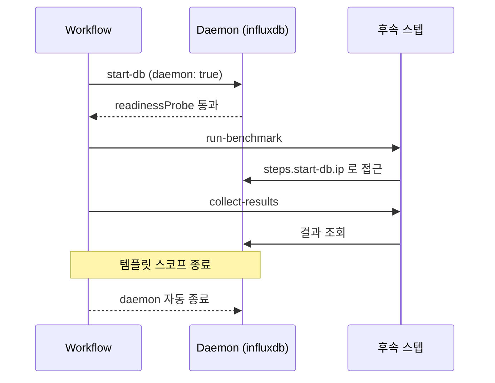
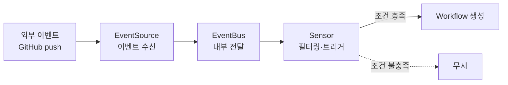


이 글은 [Argo Workflows](https://argoproj.github.io/argo-workflows/) 공식 문서와 Alibaba Cloud·CNOE·Pipekit 기술 블로그를 읽고 정리한 노트입니다. [핵심 아키텍처 편](/posts/argo-workflow/)에 이어, 재시도 전략·동시성 제어·메모이제이션·보안 RBAC·성능 튜닝 같은 고급 운영 패턴을 공식 스키마와 예제 YAML 중심으로 옮겼습니다. v3.5~v3.6에서 추가된 기능까지 포함합니다.

> [!NOTE] 사전지식
> 이 글은 Argo Workflows의 Workflow·WorkflowTemplate·CronWorkflow 같은 CRD와 steps/dag 템플릿 개념을 안다고 가정합니다. 생소하다면 [핵심 아키텍처 편](/posts/argo-workflow/)을 먼저 보면 좋습니다.

## 재시도 및 오류 처리

### retryStrategy 전체 필드

`retryStrategy`는 템플릿 레벨에서 재시도 동작을 정의합니다. 필드별 의미는 주석에 달았습니다.

```yaml
apiVersion: argoproj.io/v1alpha1
kind: Workflow
metadata:
  generateName: retry-demo-
spec:
  entrypoint: retry-example
  templates:
  - name: retry-example
    retryStrategy:
      limit: "5"                  # 최대 재시도 횟수 (문자열 또는 정수)
      retryPolicy: "OnTransientError"  # Always | OnFailure | OnError | OnTransientError
      backoff:
        duration: "2s"            # 첫 번째 재시도 대기 시간 (필수)
        factor: "2"               # 지수 백오프 배율
        maxDuration: "1m"         # 최대 대기 시간 상한
      affinity:
        nodeAntiAffinity: {}      # 재시도를 다른 노드에서 실행
    container:
      image: alpine:3.18
      command: [sh, -c]
      args: ["exit 1"]
```

### retryPolicy 옵션 비교

`retryPolicy`는 어떤 경우를 재시도 대상으로 볼지 결정합니다. 네 가지 값이 있습니다.

| 값 | 설명 | 사용 시점 |
|---|---|---|
| `OnFailure` | 컨테이너 종료 코드가 비정상(기본값) | 명시적 실패만 재시도 |
| `Always` | 실패와 에러 모두 재시도 | expression 사용 시 v3.5+ 기본값 |
| `OnError` | Argo 컨트롤러 오류, init/wait 컨테이너 실패 | 인프라 문제 처리 |
| `OnTransientError` | 일시적 오류(v3.0+), `TRANSIENT_ERROR_PATTERN` env 패턴 매칭 | 네트워크·API 일시 오류 |

### expression 기반 조건부 재시도 (v3.2+)

v3.2부터는 `expression` 필드로 종료 코드·상태·실행 시간·오류 메시지를 조합해 재시도를 세밀하게 제어합니다. expression에서 쓸 수 있는 변수는 다음과 같습니다.

| 변수 | 타입 | 설명 |
|---|---|---|
| `lastRetry.exitCode` | string | 마지막 재시도 종료 코드 (불가 시 "-1") |
| `lastRetry.status` | string | "Error" 또는 "Failed" |
| `lastRetry.duration` | string | 마지막 재시도 실행 시간(초) |
| `lastRetry.message` | string | 출력 메시지 (v3.5+) |

```yaml
retryStrategy:
  limit: "10"
  retryPolicy: "Always"   # expression 사용 시 Always 권장
  expression: >
    asInt(lastRetry.exitCode) >= 2 &&
    lastRetry.status != "Error"
  backoff:
    duration: "5s"
    factor: "2"
    maxDuration: "10m"
```

자주 쓰는 expression 패턴은 다음과 같습니다.

- `asInt(lastRetry.exitCode) == 1` — 종료 코드 1에서만 재시도
- `lastRetry.duration < "300"` — 300초 미만 실행 시에만 재시도 (무한 루프 방지)
- `"OOM" in lastRetry.message` — OOM 오류 메시지 포함 시 재시도 (v3.5+)

### onExit 핸들러

`onExit`에 지정한 템플릿은 워크플로우가 성공·실패·오류 어느 경우에도 실행됩니다. 알림 발송, 리소스 정리, 감사 로그 같은 후처리에 사용합니다.

```yaml
apiVersion: argoproj.io/v1alpha1
kind: Workflow
metadata:
  generateName: exit-handler-demo-
spec:
  entrypoint: main
  onExit: cleanup-handler       # 워크플로우 종료 시 항상 실행
  templates:
  - name: main
    steps:
    - - name: do-work
        template: flaky-job

  - name: flaky-job
    container:
      image: alpine:3.18
      command: [sh, -c]
      args: ["exit 1"]

  - name: cleanup-handler
    steps:
    - - name: notify
        template: send-notification
        when: "{{workflow.status}} != Succeeded"

  - name: send-notification
    container:
      image: curlimages/curl:8.6.0
      command: [sh, -c]
      args: ["echo 'Workflow {{workflow.name}} ended with {{workflow.status}}'"]
```

`{{workflow.status}}` 변수로 성공/실패 분기를 처리합니다.

### failFast 동작

`failFast`는 병렬 단계 중 하나가 실패할 때 전체 워크플로우를 즉시 중단할지 제어합니다. `steps`/`dag` 템플릿에서 기본값이 `true`입니다. 병렬 실행 중 하나가 실패하면 나머지가 즉시 취소됩니다. 이를 비활성화하려면 각 태스크에 `continueOn.failed: true`를 사용합니다.

```yaml
templates:
- name: parallel-steps
  steps:
  - - name: job-a
      template: worker
    - name: job-b        # job-b 실패 시 job-a도 즉시 취소
      template: worker
  parallelism: 2

spec:
  # 전체 워크플로우 레벨 failFast
  # dag/steps 템플릿 내 개별 태스크에는 failFast가 없음
  # 대신 activeDeadlineSeconds로 전체 시간 제한 가능
  activeDeadlineSeconds: 300
```

### Pod Disruption 처리

노드 드레인이나 스팟 인스턴스 중단 같은 Pod Disruption 시나리오에서는 `retryPolicy: "OnError"`를 쓰면 컨트롤러가 Pod 실패를 Error로 감지해 재시도합니다. 워크플로우 레벨에서 PodDisruptionBudget도 설정할 수 있습니다.

```yaml
spec:
  templates:
  - name: long-running-job
    retryStrategy:
      limit: "3"
      retryPolicy: "OnError"   # 컨트롤러가 Pod 실패를 Error로 감지
    podDisruptionBudget:        # 워크플로우 레벨에서 PDB 설정 가능
      minAvailable: 1
    container:
      image: alpine:3.18
      command: [sh, -c]
      args: ["sleep 300"]
```

스팟 인스턴스 환경에서는 컨트롤러 ConfigMap의 `TRANSIENT_ERROR_PATTERN` 환경 변수로 특정 오류 패턴을 일시적 오류로 분류해, `OnTransientError`와 조합하면 노드 드레인·스팟 중단을 자동 재시도 대상으로 만들 수 있습니다.

```yaml
# workflow-controller-configmap
data:
  config: |
    executor:
      envVars:
        - name: TRANSIENT_ERROR_PATTERN
          value: "transient|timeout|429|503"
```

## 동시성 제어

동시성 제어는 잠금 하나만 허용하는 Mutex와 N개까지 허용하는 Semaphore 두 종류로 나뉩니다.

### Mutex — 단일 잠금

Mutex는 동시에 하나의 워크플로우/템플릿만 실행되도록 보장합니다. ConfigMap이 필요 없고 이름만 지정합니다.

```yaml
# 워크플로우 레벨 Mutex (네임스페이스 내)
apiVersion: argoproj.io/v1alpha1
kind: Workflow
metadata:
  generateName: mutex-demo-
  namespace: argo
spec:
  synchronization:
    mutexes:
      - name: db-migration    # ConfigMap 불필요, 이름만 지정
  entrypoint: main
  templates:
  - name: main
    container:
      image: alpine:3.18
      command: [echo]
      args: ["Running exclusive migration"]
```

### Semaphore — N개 동시 실행 제한

Semaphore는 ConfigMap에 동시 실행 수를 정의하고, 워크플로우가 그 키를 참조합니다.

```yaml
# 1. ConfigMap으로 세마포어 크기 정의
apiVersion: v1
kind: ConfigMap
metadata:
  name: semaphore-config
  namespace: argo
data:
  max-parallel-jobs: "3"      # 동시 3개까지 허용
  etl-workers: "2"

---
# 2. 워크플로우 레벨 세마포어
apiVersion: argoproj.io/v1alpha1
kind: Workflow
metadata:
  generateName: semaphore-demo-
spec:
  synchronization:
    semaphores:
      - configMapKeyRef:
          name: semaphore-config
          key: max-parallel-jobs
  entrypoint: main
  templates:
  - name: main
    container:
      image: alpine:3.18
      command: [echo]
      args: ["Working..."]
```

### 템플릿 레벨 세마포어

세마포어를 템플릿 레벨에 걸면 여러 워크플로우에 걸쳐 특정 템플릿의 동시 실행 수를 제한할 수 있습니다. 아래 예시에서 `etl-workers: "2"`로 지정하면, 어느 워크플로우에서 실행되든 `heavy-task` 템플릿은 최대 2개까지만 동시에 실행됩니다.

```yaml
apiVersion: argoproj.io/v1alpha1
kind: Workflow
metadata:
  generateName: tmpl-semaphore-
spec:
  entrypoint: fan-out
  templates:
  - name: fan-out
    steps:
    - - name: worker
        template: heavy-task
        withItems: [a, b, c, d, e]

  - name: heavy-task
    synchronization:
      semaphores:
        - configMapKeyRef:
            name: semaphore-config
            key: etl-workers   # 전체 워크플로우 중 이 템플릿은 최대 2개 동시 실행
    container:
      image: alpine:3.18
      command: [sh, -c]
      args: ["sleep 10"]
```

### 데이터베이스 기반 잠금 (멀티 컨트롤러, v3.6+)

ConfigMap 기반 잠금은 단일 컨트롤러 인스턴스 내에서만 유효합니다. 여러 Argo Workflows 컨트롤러 인스턴스가 동일한 클러스터에 존재하면 컨트롤러 간 잠금이 공유되지 않습니다.

> [!WARNING] 멀티 컨트롤러에서 ConfigMap 잠금은 깨진다
> ConfigMap 기반 뮤텍스·세마포어는 잠금 상태를 컨트롤러 메모리에 들고 있습니다. HA로 컨트롤러를 여러 개 띄우거나 샤딩하면 인스턴스끼리 잠금을 모르고 동시에 임계 구역에 진입할 수 있습니다. 멀티 컨트롤러라면 아래 DB 기반 잠금을 써야 합니다.

v3.6부터는 [PostgreSQL](https://www.postgresql.org/)/[MySQL](https://www.mysql.com/)을 사용해 컨트롤러 간 뮤텍스·세마포어를 공유할 수 있습니다. 동기화 설정은 컨트롤러 ConfigMap에 두고, 잠금 쪽에는 `database: true` 플래그로 DB 기반 잠금을 선택합니다.

```yaml
# workflow-controller-configmap
data:
  syncConfig: |
    driver: postgres
    host: postgres-host
    port: 5432
    database: argo
    username: argo_user
    passwordSecret:
      name: postgres-secret
      key: password
    stateTableName: sync_state      # 기본값
    limitTableName: sync_limit      # 기본값
    controllerTableName: sync_controller

---
# 데이터베이스 Mutex 사용
spec:
  synchronization:
    mutexes:
      - name: global-lock
        database: true     # 이 플래그로 DB 기반 잠금 선택
```

DB 상태는 SQL로 직접 조회할 수 있습니다.

```sql
-- 현재 잠금 대기 중인 워크플로우 확인
SELECT * FROM sync_state WHERE held = false ORDER BY priority DESC, time ASC;
```

### parallelism 계층 구조

`parallelism`은 적용 위치에 따라 의미가 다릅니다. 워크플로우 레벨은 해당 워크플로우 내 최대 동시 Pod 수, 템플릿 레벨은 steps/dag 내 동시 실행 스텝 수를 제한합니다.

```yaml
# 워크플로우 레벨 — 이 워크플로우 내 최대 동시 Pod 수
spec:
  parallelism: 5

  # 템플릿 레벨 — steps/dag 내 동시 실행 수
  templates:
  - name: fan-out
    parallelism: 3         # 최대 3개 스텝 동시 실행
    steps:
    - - name: task
        template: worker
        withParam: "{{workflow.parameters.items}}"
```

컨트롤러 전역 제한은 ConfigMap에서 설정합니다. 컨트롤러 내 동시 워크플로우 수와 네임스페이스당 동시 워크플로우 수를 따로 둡니다.

```yaml
data:
  parallelism: "50"          # 전체 컨트롤러 내 동시 워크플로우 수
  namespaceParallelism: "10" # 네임스페이스당 동시 워크플로우 수
```

### Pod Priority Class

워크플로우에 [Kubernetes](https://kubernetes.io/docs/concepts/) PriorityClass와 큐 우선순위를 지정할 수 있습니다. `priority`의 기본값은 0입니다.

```yaml
spec:
  priorityClassName: high-priority   # PriorityClass 이름
  priority: 100                       # 워크플로우 큐 우선순위 (0 기본)
  templates:
  - name: main
    container:
      image: alpine:3.18
      command: [echo]
      args: ["high priority job"]
```

## 메모이제이션

메모이제이션은 비용이 큰 연산의 결과를 ConfigMap에 캐시해 중복 실행을 방지합니다. Cache Hit이면 컨테이너를 실행하지 않고 저장된 output을 바로 반환합니다.

### 기본 설정

먼저 캐시용 ConfigMap에 `workflows.argoproj.io/configmap-type: Cache` 레이블을 붙여야 합니다.

```yaml
# 1. 캐시용 ConfigMap 생성 (반드시 레이블 필요)
apiVersion: v1
kind: ConfigMap
metadata:
  name: ml-model-cache
  labels:
    workflows.argoproj.io/configmap-type: Cache  # 필수 레이블
```

템플릿에는 `memoize` 블록으로 캐시 키와 유효기간(`maxAge`), 캐시 저장소 ConfigMap을 지정합니다.

```yaml
# 2. 메모이제이션이 적용된 워크플로우
apiVersion: argoproj.io/v1alpha1
kind: Workflow
metadata:
  generateName: memoized-ml-
spec:
  entrypoint: train-model
  templates:
  - name: train-model
    inputs:
      parameters:
      - name: dataset-version
      - name: hyperparams
    memoize:
      key: "{{inputs.parameters.dataset-version}}-{{inputs.parameters.hyperparams}}"
      maxAge: "24h"           # 캐시 유효기간 (s/m/h 단위)
      cache:
        configMap:
          name: ml-model-cache
    container:
      image: python:3.11
      command: [python]
      args: [train.py]
      resources:
        requests:
          cpu: "4"
          memory: 16Gi
    outputs:
      parameters:
      - name: model-accuracy
        valueFrom:
          path: /tmp/accuracy.txt
```

### 캐시 키 설계 전략

`"model-v1"`처럼 너무 광범위한 키는 서로 다른 입력의 결과를 같은 키에 담아 캐시 오염을 유발합니다. 입력 파라미터 조합으로 고유 키를 생성해야 합니다. 날짜 기반 키로 일별 갱신도 구현할 수 있습니다.

```yaml
# 나쁜 예: 너무 광범위한 키 → 캐시 오염
memoize:
  key: "model-v1"

# 좋은 예: 입력 파라미터 조합으로 고유 키 생성
memoize:
  key: "{{inputs.parameters.dataset}}-{{inputs.parameters.model-type}}-{{inputs.parameters.version}}"

# 날짜 기반 키 (일별 캐시 갱신)
memoize:
  key: "daily-report-{{workflow.creationTimestamp.Y}}-{{workflow.creationTimestamp.m}}-{{workflow.creationTimestamp.d}}"
  maxAge: "25h"
```

### 캐시 히트/미스 동작

- **Cache Hit**: 이전에 저장된 output을 그대로 반환. 컨테이너 실행하지 않음.
- **Cache Miss**: 템플릿 정상 실행 후 결과를 ConfigMap에 저장.
- **maxAge 만료**: 만료된 항목은 무시되고 재실행 후 갱신.
- **v3.5 이전**: output이 없는 템플릿에는 memoize 불가.
- **v3.5+**: 모든 템플릿에 memoize 적용 가능.

### ConfigMap 1MB 한도 대응

캐시가 누적되어 ConfigMap 1MB 한도를 초과하면 업데이트가 실패합니다. 캐시를 여러 ConfigMap으로 샤딩하거나, `maxAge`를 짧게 설정해 자동 만료·삭제를 유도하는 두 가지 해결책이 있습니다.

> [!WARNING] 메모이제이션 캐시는 무한히 자라지 않는다
> 메모이제이션 캐시는 ConfigMap 한 개에 쌓입니다. etcd의 오브젝트 크기 상한인 1MB를 넘기면 캐시 쓰기가 조용히 실패하기 시작합니다. 캐시 키 카디널리티가 높은 워크플로우라면 샤딩이나 짧은 `maxAge`로 상한에 닿지 않게 관리해야 합니다.

```yaml
# ConfigMap 용량 제한: 1MB
# 해결책 1: 캐시 분리 (다른 ConfigMap 이름 사용)
memoize:
  key: "{{inputs.parameters.shard}}-{{inputs.parameters.id}}"
  cache:
    configMap:
      name: "cache-shard-{{inputs.parameters.shard}}"  # 샤드별 캐시

# 해결책 2: maxAge를 짧게 설정해 자동 만료·삭제 유도
memoize:
  maxAge: "1h"
```

메모이제이션을 쓰는 워크플로우는 ConfigMap에 대한 `create`, `update` 권한이 추가로 필요합니다.

```yaml
rules:
- apiGroups: [""]
  resources: [configmaps]
  verbs: [get, create, update]   # create, update 필수
```

## 고급 패턴

### WorkflowTemplate 재사용 (Workflow of Workflows)

공유 라이브러리 성격의 템플릿을 WorkflowTemplate으로 정의해 두고, 다른 워크플로우에서 `templateRef`로 참조합니다. 아래는 Slack 알림과 SQL 실행 템플릿을 공유 라이브러리로 정의한 예시입니다.

```yaml
# 공유 라이브러리 정의
apiVersion: argoproj.io/v1alpha1
kind: WorkflowTemplate
metadata:
  name: shared-steps
  namespace: argo
spec:
  templates:
  - name: send-slack
    inputs:
      parameters:
      - name: message
      - name: channel
    container:
      image: curlimages/curl:8.6.0
      command: [sh, -c]
      args:
      - |
        curl -X POST -H 'Content-type: application/json' \
          --data '{"text":"{{inputs.parameters.message}}","channel":"{{inputs.parameters.channel}}"}' \
          ${SLACK_WEBHOOK_URL}

  - name: run-sql
    inputs:
      parameters:
      - name: query
    script:
      image: postgres:16
      command: [psql]
      args: ["-c", "{{inputs.parameters.query}}"]
      env:
      - name: PGPASSWORD
        valueFrom:
          secretKeyRef:
            name: db-secret
            key: password
```

참조하는 워크플로우는 `templateRef`에 라이브러리 이름과 템플릿 이름을 지정하고 파라미터를 넘깁니다.

```yaml
# 재사용하는 워크플로우
apiVersion: argoproj.io/v1alpha1
kind: Workflow
metadata:
  generateName: etl-pipeline-
spec:
  entrypoint: pipeline
  templates:
  - name: pipeline
    steps:
    - - name: extract
        templateRef:
          name: shared-steps
          template: run-sql
        arguments:
          parameters:
          - name: query
            value: "SELECT * FROM orders WHERE date = '{{workflow.parameters.date}}'"
    - - name: notify
        templateRef:
          name: shared-steps
          template: send-slack
        arguments:
          parameters:
          - name: message
            value: "ETL 완료: {{workflow.name}}"
          - name: channel
            value: "#data-eng"
```

### ClusterWorkflowTemplate — 멀티 네임스페이스 공유

ClusterWorkflowTemplate은 네임스페이스 없이 클러스터 전체에서 접근 가능한 템플릿입니다.

```yaml
# 클러스터 전체에서 접근 가능한 템플릿
apiVersion: argoproj.io/v1alpha1
kind: ClusterWorkflowTemplate
metadata:
  name: org-standard-steps   # 네임스페이스 없음
spec:
  templates:
  - name: security-scan
    inputs:
      parameters:
      - name: image
    container:
      image: aquasec/trivy:latest
      command: [trivy]
      args: ["image", "--exit-code", "1", "{{inputs.parameters.image}}"]
```

다른 네임스페이스에서 참조할 때는 `clusterScope: true`가 필수입니다.

```yaml
# 다른 네임스페이스에서 참조
spec:
  templates:
  - name: build-and-scan
    steps:
    - - name: scan
        templateRef:
          name: org-standard-steps
          template: security-scan
          clusterScope: true   # ClusterWorkflowTemplate 참조 시 필수
        arguments:
          parameters:
          - name: image
            value: "myapp:{{workflow.parameters.tag}}"
```

### Daemon 컨테이너

Daemon 컨테이너는 Sidecar와 달리 여러 스텝에 걸쳐 지속되는 백그라운드 프로세스입니다. `daemon: true` 플래그로 백그라운드 실행을 지정하고, 다른 스텝에서는 `{{steps.NAME.ip}}`로 그 IP를 참조합니다. `readinessProbe`로 준비 완료를 확인한 뒤 다음 스텝이 진행됩니다. 템플릿 스코프가 끝나면 daemon은 자동으로 종료됩니다. 다음 다이어그램은 daemon이 세 스텝 동안 살아 있다가 스코프 종료와 함께 정리되는 생명주기를 나타냅니다.



```yaml
apiVersion: argoproj.io/v1alpha1
kind: Workflow
metadata:
  generateName: daemon-demo-
spec:
  entrypoint: main
  templates:
  - name: main
    steps:
    - - name: start-db
        template: influxdb-daemon    # 1단계: DB 시작
    - - name: run-benchmark
        template: load-test          # 2단계: DB 활용
    - - name: collect-results
        template: query-results      # 3단계: 결과 조회
    # 템플릿 스코프 종료 시 daemon 자동 종료

  - name: influxdb-daemon
    daemon: true              # 백그라운드 실행 플래그
    retryStrategy:
      limit: "3"
    container:
      image: influxdb:1.8
      readinessProbe:         # 준비 완료 확인 후 다음 스텝 진행
        httpGet:
          path: /ping
          port: 8086
        initialDelaySeconds: 5
        periodSeconds: 5

  - name: load-test
    container:
      image: alpine:3.18
      command: [sh, -c]
      # daemon IP는 steps.start-db.ip 로 참조
      args: ["curl http://{{steps.start-db.ip}}:8086/write?db=test -d 'metric,host=a value=1'"]
```

Daemon과 Sidecar는 생명주기와 접근 범위가 다릅니다.

| 특성 | Daemon | Sidecar |
|---|---|---|
| 생명주기 | 템플릿 스코프 전체 | 단일 스텝 |
| 여러 스텝에서 접근 | 가능 | 불가 |
| IP 참조 | `{{steps.NAME.ip}}` | 같은 Pod 내 localhost |
| 용도 | 테스트 DB, 모니터링 서버 | 로그 수집, 파일 변환 |

### Init 컨테이너

`initContainers`는 메인 컨테이너 전에 실행됩니다. `mirrorVolumeMounts: true`를 쓰면 메인 컨테이너의 볼륨 마운트를 그대로 복사합니다.

```yaml
templates:
- name: with-init
  initContainers:
  - name: download-config
    image: amazon/aws-cli:2.15.0
    command: [aws]
    args: [s3, cp, "s3://my-bucket/config.yaml", "/shared/config.yaml"]
    mirrorVolumeMounts: true    # 메인 컨테이너의 볼륨 마운트를 그대로 복사
  container:
    image: myapp:latest
    command: [./run]
    args: [--config, /shared/config.yaml]
    volumeMounts:
    - name: shared-data
      mountPath: /shared
  volumes:
  - name: shared-data
    emptyDir: {}
```

### 노드 선택 및 스케줄링 제어

`nodeSelector`·`tolerations`·`affinity`로 워크플로우가 실행될 노드를 제어합니다. 워크플로우 전체에 적용하거나, v3.6+부터는 템플릿 레벨에서 오버라이드할 수 있습니다.

```yaml
apiVersion: argoproj.io/v1alpha1
kind: WorkflowTemplate
metadata:
  name: gpu-workflow
spec:
  entrypoint: train
  # 워크플로우 전체 노드 선택
  nodeSelector:
    cloud.google.com/gke-nodepool: gpu-pool
  tolerations:
  - key: "nvidia.com/gpu"
    operator: "Exists"
    effect: "NoSchedule"

  templates:
  - name: train
    # 템플릿 레벨에서 오버라이드 가능 (v3.6+)
    nodeSelector:
      accelerator: nvidia-tesla-a100
    tolerations:
    - key: "high-memory"
      operator: "Exists"
      effect: "NoSchedule"
    affinity:
      nodeAffinity:
        requiredDuringSchedulingIgnoredDuringExecution:
          nodeSelectorTerms:
          - matchExpressions:
            - key: node.kubernetes.io/instance-type
              operator: In
              values: [a2-highgpu-1g, a2-highgpu-2g]
      podAntiAffinity:
        preferredDuringSchedulingIgnoredDuringExecution:
        - weight: 100
          podAffinityTerm:
            labelSelector:
              matchLabels:
                workflows.argoproj.io/workflow: "{{workflow.name}}"
            topologyKey: kubernetes.io/hostname
    container:
      image: tensorflow/tensorflow:2.15.0-gpu
      resources:
        limits:
          nvidia.com/gpu: 1
```

### Pod GC 정책

`podGC.strategy`는 완료된 Pod를 언제 삭제할지 결정합니다. 네 가지 전략이 있고, `deleteDelayDuration`(v3.5+)으로 삭제 전 유예 시간을 줄 수 있습니다.

```yaml
apiVersion: argoproj.io/v1alpha1
kind: Workflow
metadata:
  generateName: pod-gc-demo-
spec:
  podGC:
    strategy: OnWorkflowSuccess   # 성공한 워크플로우의 Pod만 삭제
    # 옵션:
    # OnPodCompletion    — 각 Pod 완료 즉시 삭제 (가장 공격적)
    # OnPodSuccess       — 성공한 Pod만 즉시 삭제
    # OnWorkflowCompletion — 워크플로우 완료 시 모든 Pod 삭제
    # OnWorkflowSuccess  — 워크플로우 성공 시만 Pod 삭제 (실패 시 로그 보존)
    deleteDelayDuration: "5m"   # 삭제 전 유예 시간 (v3.5+)
    labelSelector:
      matchLabels:
        workflows.argoproj.io/completed: "true"
  entrypoint: main
```

전략은 용도에 따라 고릅니다.

- 디버깅 환경: `OnWorkflowSuccess` (실패 시 Pod 로그 보존)
- 비용 절감: `OnPodCompletion` (즉시 리소스 반환)
- 프로덕션 기본: `OnWorkflowCompletion` (감사 목적으로 워크플로우 완료까지 보존)

## 스케줄링 & 트리거

### CronWorkflow 전체 필드

CronWorkflow는 cron 스케줄로 워크플로우를 주기 실행합니다. v3.6+부터 `schedules` 리스트로 복수 스케줄을 지정하고, `stopStrategy.expression`과 `when`으로 자동 중단·조건부 실행을 설정할 수 있습니다.

```yaml
apiVersion: argoproj.io/v1alpha1
kind: CronWorkflow
metadata:
  name: daily-etl
  namespace: argo
spec:
  # v3.6+: 복수 스케줄 지원
  schedules:
  - "0 2 * * *"       # 매일 오전 2시
  - "0 14 * * *"      # 매일 오후 2시

  timezone: "Asia/Seoul"          # IANA 타임존
  concurrencyPolicy: "Forbid"     # Allow | Forbid | Replace
  startingDeadlineSeconds: 30     # 컨트롤러 다운 후 놓친 실행 허용 유예(초)
  suspend: false                  # true 시 스케줄 일시 중지
  successfulJobsHistoryLimit: 5   # 성공 이력 보관 수 (기본 3)
  failedJobsHistoryLimit: 3       # 실패 이력 보관 수 (기본 1)

  # v3.6+ 추가 기능
  stopStrategy:
    expression: "cronworkflow.failed >= 3"   # 연속 3회 실패 시 자동 중단
  when: "{{= cronworkflow.lastScheduledTime != '' }}"  # 조건부 실행

  workflowSpec:
    entrypoint: main
    ttlStrategy:
      secondsAfterCompletion: 86400   # 24시간 후 워크플로우 삭제
    templates:
    - name: main
      container:
        image: alpine:3.18
        command: [echo]
        args: ["Daily ETL at {{workflow.creationTimestamp}}"]
```

`concurrencyPolicy`는 이전 실행이 끝나지 않았을 때 어떻게 처리할지 결정합니다.

- `Allow`: 이전 실행 완료 여부 무관하게 새 워크플로우 생성
- `Forbid`: 실행 중인 워크플로우가 있으면 새 스케줄 건너뜀
- `Replace`: 실행 중인 워크플로우를 종료하고 새 워크플로우 시작

`startingDeadlineSeconds`는 컨트롤러가 재시작되거나 일시 중지 후 재개할 때, 이 기간 내 놓친 스케줄을 실행합니다. `0`으로 설정하면 항상 현재 시각 기준으로만 판단합니다.

### Argo Events 통합 패턴

[Argo Events](https://argoproj.github.io/argo-events/)와 통합하면 외부 이벤트로 워크플로우를 트리거할 수 있습니다. 다음 그림은 외부 이벤트가 워크플로우 생성까지 흘러가는 경로입니다.



EventSource는 이벤트를 수신합니다. 아래는 GitHub 푸시 웹훅을 받는 예시입니다.

```yaml
# EventSource: GitHub Webhook 수신
apiVersion: argoproj.io/v1alpha1
kind: EventSource
metadata:
  name: github-eventsource
  namespace: argo-events
spec:
  github:
    push-events:
      repositories:
      - owner: myorg
        names: [myrepo]
      events:
      - push
      webhook:
        endpoint: /push
        port: "12000"
        method: POST
      apiToken:
        name: github-access
        key: token
      webhookSecret:
        name: github-webhook-secret
        key: secret
      insecure: false
      active: true
      contentType: json
```

Sensor는 이벤트를 받아 필터링하고 워크플로우를 트리거합니다. 아래 예시는 main 브랜치 푸시만 트리거합니다.

```yaml
# Sensor: 이벤트 수신 → 워크플로우 트리거
apiVersion: argoproj.io/v1alpha1
kind: Sensor
metadata:
  name: github-sensor
  namespace: argo-events
spec:
  template:
    serviceAccountName: argo-events-sa
  dependencies:
  - name: push-dep
    eventSourceName: github-eventsource
    eventName: push-events
    filters:
      data:
      - path: body.ref
        type: string
        value: ["refs/heads/main"]    # main 브랜치 푸시만 트리거
  triggers:
  - template:
      name: trigger-ci
      argoWorkflow:
        group: argoproj.io
        version: v1alpha1
        resource: workflows
        operation: create
        source:
          resource:
            apiVersion: argoproj.io/v1alpha1
            kind: Workflow
            metadata:
              generateName: ci-build-
              namespace: argo
            spec:
              workflowTemplateRef:
                name: ci-pipeline
        parameters:
        - src:
            dependencyName: push-dep
            dataKey: body.head_commit.id
          dest: spec.arguments.parameters.0.value
```

## 보안 & RBAC

### ServiceAccount 분리 전략

워크플로우 실행용 ServiceAccount는 최소 권한 원칙에 따라 별도 생성합니다. `automountServiceAccountToken: false`로 불필요한 토큰 마운트를 방지합니다. 메모이제이션을 쓰면 ConfigMap의 `create`, `update` 권한을 Role에 추가합니다.

```yaml
# 1. 워크플로우 실행용 SA (최소 권한)
apiVersion: v1
kind: ServiceAccount
metadata:
  name: workflow-runner
  namespace: argo
automountServiceAccountToken: false   # 불필요한 토큰 마운트 방지

---
# 2. 워크플로우 Runner용 RBAC
apiVersion: rbac.authorization.k8s.io/v1
kind: Role
metadata:
  name: workflow-runner-role
  namespace: argo
rules:
- apiGroups: ["argoproj.io"]
  resources: [workflows, workflowtemplates]
  verbs: [get, list, watch, create, update, patch]
- apiGroups: [""]
  resources: [pods, pods/log]
  verbs: [get, list, watch]
- apiGroups: [""]
  resources: [configmaps]
  verbs: [get, create, update]   # memoize 사용 시

---
# 3. 워크플로우 Spec에서 SA 지정
apiVersion: argoproj.io/v1alpha1
kind: Workflow
spec:
  serviceAccountName: workflow-runner
```

### 역할 분리 패턴

권한은 역할에 따라 단계적으로 부여합니다. UI 읽기 전용은 `get, list, watch`만, 워크플로우 제출은 거기에 `create`를 더합니다.

```yaml
# UI 읽기 전용 사용자
apiVersion: rbac.authorization.k8s.io/v1
kind: Role
metadata:
  name: argo-ui-readonly
  namespace: argo
rules:
- apiGroups: [""]
  resources: [events, pods, pods/log]
  verbs: [get, list, watch]
- apiGroups: [argoproj.io]
  resources: [workflows, workflowtemplates, cronworkflows, workfloweventbindings]
  verbs: [get, list, watch]

---
# 워크플로우 제출 사용자
apiVersion: rbac.authorization.k8s.io/v1
kind: Role
metadata:
  name: argo-submitter
  namespace: argo
rules:
- apiGroups: [argoproj.io]
  resources: [workflows, workflowtemplates]
  verbs: [get, list, watch, create]
- apiGroups: [""]
  resources: [pods, pods/log]
  verbs: [get, list, watch]
```

### Pod Security Context

워크플로우 레벨 `securityContext`는 모든 Pod에 적용되고, 템플릿 레벨에서 오버라이드할 수 있습니다. v3.6+에서는 `seccompProfile.type: RuntimeDefault` 기본 활성화가 권장됩니다. 컨테이너 레벨에서 `allowPrivilegeEscalation: false`, `readOnlyRootFilesystem: true`, `capabilities.drop: [ALL]`을 추가하는 것이 보안 강화의 표준 패턴입니다.

```yaml
apiVersion: argoproj.io/v1alpha1
kind: Workflow
spec:
  securityContext:              # 모든 Pod에 적용
    runAsNonRoot: true
    runAsUser: 1000
    runAsGroup: 2000
    fsGroup: 2000
    seccompProfile:
      type: RuntimeDefault      # v3.6+ 기본 활성화 권장
  templates:
  - name: secure-job
    securityContext:            # 개별 템플릿 오버라이드
      allowPrivilegeEscalation: false
      readOnlyRootFilesystem: true
      capabilities:
        drop: [ALL]
    container:
      image: alpine:3.18
      command: [echo]
      args: ["secure execution"]
```

### SSO with Dex (OIDC)

Argo Server는 [Dex](https://dexidp.io/)를 통해 [OIDC](https://openid.net/developers/how-connect-works/) 기반 SSO를 지원합니다. 컨트롤러 ConfigMap의 `sso` 블록에 OIDC 발급자·클라이언트·스코프를 설정합니다. `filterGroupsRegex`로 불필요한 그룹을 필터링해 RBAC 평가 부하를 줄이고, `customGroupClaimName`으로 비표준 groups 클레임을 매핑합니다.

```yaml
# workflow-controller-configmap
apiVersion: v1
kind: ConfigMap
metadata:
  name: workflow-controller-configmap
  namespace: argo
data:
  sso: |
    issuer: https://dex.example.com/dex
    clientId:
      name: argo-sso-secret
      key: client-id
    clientSecret:
      name: argo-sso-secret
      key: client-secret
    redirectUrl: https://argo.example.com/oauth2/callback
    scopes:
    - openid
    - profile
    - email
    - groups
    rbac:
      enabled: true
    sessionExpiry: 240h
    filterGroupsRegex:
    - ".*argo-.*"
    customGroupClaimName: argo_groups   # 비표준 groups 클레임 매핑
```

ServiceAccount의 어노테이션 `workflows.argoproj.io/rbac-rule`에 [CEL](https://cel.dev/) 표현식으로 그룹 기반 RBAC을 정의합니다. `rbac-rule-precedence` 숫자가 높을수록 우선순위가 높습니다.

```yaml
# ServiceAccount에 RBAC 규칙 어노테이션
apiVersion: v1
kind: ServiceAccount
metadata:
  name: admin-sa
  namespace: argo
  annotations:
    workflows.argoproj.io/rbac-rule: "'argo-admin' in groups"
    workflows.argoproj.io/rbac-rule-precedence: "10"   # 높은 숫자 = 높은 우선순위

---
apiVersion: v1
kind: ServiceAccount
metadata:
  name: readonly-sa
  namespace: argo
  annotations:
    workflows.argoproj.io/rbac-rule: "'argo-viewer' in groups"
    workflows.argoproj.io/rbac-rule-precedence: "1"
```

SSO를 시작할 때는 `--auth-mode`를 복수로 지정합니다.

```bash
argo server \
  --auth-mode sso \
  --auth-mode client    # 복수 auth-mode 동시 지원
```

### Argo Server API 인증

Argo Server API는 Bearer Token으로 인증합니다. `argo auth token`으로 토큰을 발급하거나 ServiceAccount 토큰을 직접 사용합니다.

```bash
# Bearer Token 방식
ARGO_TOKEN=$(kubectl exec -n argo deploy/argo-server -- argo auth token)
curl -H "Authorization: Bearer ${ARGO_TOKEN}" \
  https://argo.example.com/api/v1/workflows/argo

# ServiceAccount Token 직접 사용
SA_TOKEN=$(kubectl get secret -n argo workflow-runner-token -o jsonpath='{.data.token}' | base64 -d)
curl -H "Authorization: Bearer ${SA_TOKEN}" \
  https://argo.example.com/api/v1/workflows/argo

# UI 토큰 갱신
argo auth token --namespace argo
```

## 성능 & 스케일링

### 컨트롤러 QPS/Burst 설정

컨트롤러 Deployment의 args로 Kubernetes API 호출 속도와 워커 수를 조정합니다. 괄호 안이 기본값입니다.

```yaml
# Argo Workflows 컨트롤러 Deployment args
apiVersion: apps/v1
kind: Deployment
metadata:
  name: workflow-controller
  namespace: argo
spec:
  template:
    spec:
      containers:
      - name: workflow-controller
        args:
        - --qps=50             # Kubernetes API 초당 평균 요청 수 (기본 20)
        - --burst=75           # 버스트 허용 요청 수 (기본 30)
        - --workflow-workers=32   # 워크플로우 병렬 처리 goroutine (기본 8)
        - --pod-cleanup-workers=8  # Pod GC 병렬 처리 (기본 4)
        - --workflow-ttl-workers=4 # TTL 삭제 병렬 처리 (기본 4)
        - --cron-workflow-workers=8 # CronWorkflow 처리 (기본 2, v3.5+)
        resources:
          requests:
            cpu: "1"
            memory: 2Gi
          limits:
            cpu: "4"
            memory: 8Gi
```

CNOE의 2024년 Amazon EKS 확장성 테스트 결과는 다음과 같습니다. QPS/Burst=50/75, workers=32에서 분당 540 워크플로우가 포화점이었고, workers=32 상태에서 QPS를 더 높여도 처리량이 늘지 않았습니다.

| QPS/Burst | Workers | 최대 워크플로우/분 |
|---|---|---|
| 20/30 | 8 | 270 |
| 30/40 | 16 | 420 (+55%) |
| 40/50 | 32 | 540 (+28%) |
| 50/75 | 32 | 540 (포화점) |

### Pod 생성 속도 제한

`resourceRateLimit`은 Pod 생성 속도를 제한합니다. 이 설정은 Pod에만 적용되고, ConfigMap·PVC 등 다른 리소스는 `--qps`/`--burst`로 별도 제어합니다.

```yaml
# workflow-controller-configmap
data:
  resourceRateLimit: |
    limit: 15      # 초당 평균 Pod 생성 요청 수
    burst: 30      # 버스트 허용 Pod 생성 수
```

### Workflow TTL 설정

`ttlStrategy`로 완료된 워크플로우를 자동 삭제합니다. 완료·성공·실패별로 보존 시간을 다르게 둘 수 있고, 디버깅을 위해 실패 워크플로우는 오래 보존하는 식으로 씁니다.

```yaml
spec:
  ttlStrategy:
    secondsAfterCompletion: 86400    # 완료 후 24시간
    secondsAfterSuccess: 3600        # 성공 후 1시간
    secondsAfterFailure: 604800      # 실패 후 7일 (디버깅 목적)
```

전역 기본값은 컨트롤러 ConfigMap의 `workflowDefaults`에 둡니다.

```yaml
data:
  workflowDefaults: |
    spec:
      ttlStrategy:
        secondsAfterCompletion: 86400
      podGC:
        strategy: OnWorkflowCompletion
```

### 대규모 withParam 주의점

`withParam`으로 수천 개 아이템을 처리하면 etcd 메모리가 급증합니다. 배치 처리로 분할하거나 `parallelism`으로 동시 실행 수를 제한합니다.

```yaml
# 위험: withParam으로 수천 개 아이템 처리 시 etcd 메모리 급증
- name: fan-out-dangerous
  steps:
  - - name: process
      template: worker
      withParam: "{{workflow.parameters.huge-list}}"  # 10,000+ 아이템 → 문제

# 해결책 1: 배치 처리로 분할
- name: fan-out-batched
  steps:
  - - name: process-batch
      template: batch-worker
      withParam: "{{workflow.parameters.batch-ids}}"  # 배치당 100개

# 해결책 2: maxConcurrency 제한
- name: fan-out-limited
  steps:
  - - name: process
      template: worker
      withParam: "{{workflow.parameters.items}}"
  parallelism: 50   # 한 번에 50개만 실행
```

v3.6+ 환경에서는 256KB를 초과하는 파라미터가 자동으로 오브젝트 스토리지에 오프로딩됩니다.

```yaml
# 자동 오프로딩: 파라미터가 256KB 초과 시 자동으로 오브젝트 스토리지에 저장
data:
  config: |
    artifactRepository:
      s3:
        bucket: argo-artifacts
        endpoint: s3.amazonaws.com
    offloadNodeStatusVersion: "v1"
```

재귀 깊이는 기본 최대 100입니다. `DISABLE_MAX_RECURSION`으로 비활성화할 수 있지만 무한 루프 위험이 있습니다.

> [!DANGER] 재귀 깊이 가드를 끄지 말 것
> `DISABLE_MAX_RECURSION=true`는 재귀 템플릿의 안전장치를 제거합니다. 종료 조건에 버그가 있으면 컨트롤러가 Pod를 무한히 생성해 클러스터 리소스를 고갈시킬 수 있습니다. 기본값 100을 유지하고, 정말 깊은 재귀가 필요하면 종료 조건을 먼저 검증하세요.

```yaml
# 기본 최대 재귀 깊이: 100
# 비활성화 (주의: 무한 루프 위험)
containers:
- name: workflow-controller
  env:
  - name: DISABLE_MAX_RECURSION
    value: "true"
```

### 세마포어 ConfigMap 캐시

`semaphoreLimitCacheSeconds`로 세마포어 ConfigMap 조회 캐시 TTL을 설정합니다.

```yaml
# workflow-controller-configmap
data:
  config: |
    semaphoreLimitCacheSeconds: 60   # ConfigMap 조회 캐시 TTL (초)
```

### 샤딩 (대규모 멀티테넌트 환경)

네임스페이스별로 컨트롤러를 분리하거나 `instanceID`로 논리적으로 격리합니다.

```yaml
# 네임스페이스별 컨트롤러 분리
containers:
- name: workflow-controller
  args:
  - --namespaced           # 이 네임스페이스만 관리
  - --managed-namespace=team-a

---
# instanceID로 논리적 분리
data:
  instanceID: "cluster-a"   # 같은 클러스터 내 다른 컨트롤러와 격리
```

## v3.5~v3.6 주요 변경사항

### v3.5 주요 기능 (2023-08)

| 기능 | 설명 |
|---|---|
| 크로스 네임스페이스 잠금 | 세마포어·뮤텍스를 다른 네임스페이스에서 참조 가능 |
| 아티팩트 스트리밍 | S3/Azure Blob/HTTP/Artifactory 디스크 버퍼 없이 스트리밍 다운로드 |
| 통합 워크플로우 목록 | 라이브 CRD + 아카이브 DB 워크플로우 통합 뷰 |
| `--selector` 플래그 | `argo cron list --selector` 레이블 기반 필터링 |
| 성공 워크플로우 재시도 | `--node-field-selector` 설정 시 성공한 워크플로우도 재시도 가능 |
| expression retryPolicy 기본값 | expression 지정 시 retryPolicy 기본값이 `Always`로 변경 |
| `--cron-workflow-workers` | CronWorkflow 전용 워커 수 설정 추가 |
| `filterGroupsRegex` | SSO 그룹 필터링 정규식 지원 |

### v3.6 주요 기능 (2024)

| 기능 | 설명 |
|---|---|
| 복수 CronWorkflow 스케줄 | `schedules` 리스트로 한 CronWorkflow에 여러 스케줄 정의 |
| CronWorkflow 중단 전략 | `stopStrategy.expression`으로 자동 중단 조건 설정 |
| CronWorkflow 조건부 실행 | `when` 필드로 동적 실행 여부 결정 |
| 데이터베이스 기반 동기화 | PostgreSQL/MySQL/MariaDB로 멀티컨트롤러 뮤텍스·세마포어 |
| 동적 템플릿 참조 | 파라미터로 `templateRef.name` 동적 지정 가능 |
| 템플릿 레벨 nodeSelector/Tolerations | v3.6에서 공식 지원 (이전에는 워크플로우 레벨만) |
| OSS 아티팩트 GC | Alibaba Cloud OSS 아티팩트 자동 정리 |
| Seccomp 기본값 | `RuntimeDefault` seccomp 프로파일 자동 적용 |
| 병렬 Pod 정리 | 재시도 완료 처리 속도 대폭 향상 |
| Pod Kubernetes finalizer | Pod 조기 삭제 오류 방지 |
| 메트릭 개편 | [Prometheus](https://prometheus.io/) 메트릭 구조 전면 재설계 |
| 큐 기반 아카이빙 | 대규모 아카이빙 시 메모리 효율성 개선 |

### deprecated 기능

| 기능 | 대안 | 비고 |
|---|---|---|
| `archiveLogs: true` (전역) | 아티팩트 기반 로그 저장 | v3.x에서 동작 변경 |
| `argo server --auth-mode hybrid` | `--auth-mode sso --auth-mode client` | 명시적 복수 모드 지정 |
| PNS executor | Emissary executor | v3.4+에서 Emissary가 기본값 |
| Docker executor | Emissary executor | 완전 제거됨 |
| Kubelet executor | Emissary executor | 완전 제거됨 |
| `withSequence.count` string → int | `withSequence.count`를 정수로 | 타입 변경 |
| Argo Server Deployment의 `--port` | `--http-port`, `--https-port` | 분리됨 |

## 운영 환경 설정 종합

아래는 컨트롤러 ConfigMap에 동시성·리소스 속도 제한·세마포어 캐시·기본 워크플로우 설정·Executor 리소스를 한데 모은 예시입니다.

```yaml
# workflow-controller-configmap 종합 예시
apiVersion: v1
kind: ConfigMap
metadata:
  name: workflow-controller-configmap
  namespace: argo
data:
  # 동시성
  parallelism: "100"
  namespaceParallelism: "20"

  # 리소스 속도 제한
  resourceRateLimit: |
    limit: 20
    burst: 40

  # 세마포어 캐시
  semaphoreLimitCacheSeconds: "60"

  # 기본 워크플로우 설정
  workflowDefaults: |
    spec:
      ttlStrategy:
        secondsAfterCompletion: 604800
        secondsAfterFailure: 2592000
      podGC:
        strategy: OnWorkflowSuccess
        deleteDelayDuration: "10m"
      securityContext:
        runAsNonRoot: true
        seccompProfile:
          type: RuntimeDefault

  # Executor 리소스
  executor: |
    resources:
      requests:
        cpu: 100m
        memory: 64Mi
      limits:
        cpu: 500m
        memory: 512Mi
```

운영 중 자주 쓰는 트러블슈팅 명령은 다음과 같습니다.

```bash
# 잠금 대기 중인 워크플로우 확인
kubectl get workflows -n argo -o jsonpath='{range .items[?(@.status.phase=="Running")]}{.metadata.name}{"\t"}{.status.synchronization}{"\n"}{end}'

# ConfigMap 캐시 수동 삭제 (메모이제이션 리셋)
kubectl delete configmap -n argo ml-model-cache

# 특정 워크플로우 재시도
argo retry -n argo <workflow-name> --node-field-selector phase=Failed

# 컨트롤러 메트릭 확인
kubectl port-forward -n argo svc/workflow-controller-metrics 9090
curl localhost:9090/metrics | grep argo_workflows
```

## 참고 자료

- Argo Workflows, [공식 문서](https://argo-workflows.readthedocs.io/en/latest/)
- Alibaba Cloud, [Argo Workflows 3.6 — Key New Features in Cloud-Native Orchestration](https://www.alibabacloud.com/blog/argo-workflows-3-6-key-new-features-in-cloud-native-orchestration_601872)
- CNOE, [Argo Workflow Scalability (Amazon EKS)](https://cnoe.io/blog/argo-workflow-scalability)
- Pipekit, [Argo Workflows 3.6](https://pipekit.io/blog/argo-workflows-3-6)

