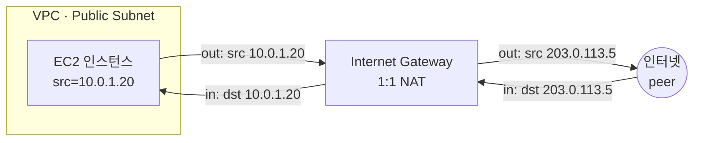
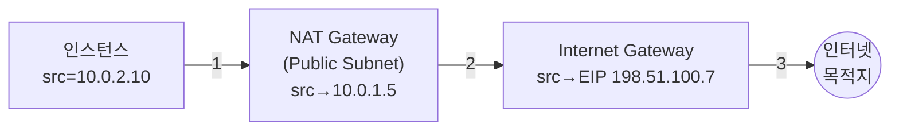
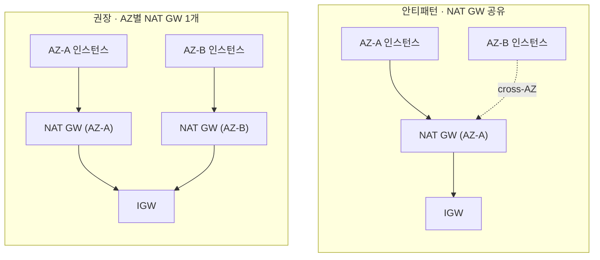
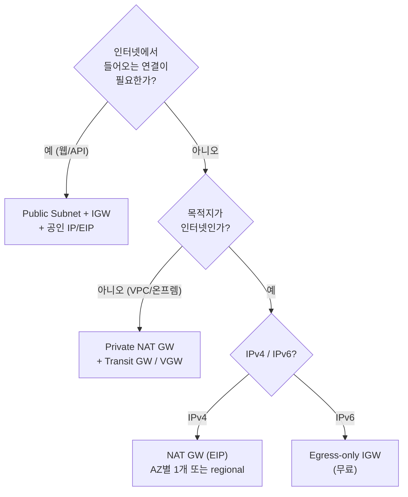

이 글은 [Amazon VPC](https://docs.aws.amazon.com/vpc/latest/userguide/what-is-amazon-vpc.html) User Guide와 [Amazon EC2](https://docs.aws.amazon.com/AWSEC2/latest/UserGuide/concepts.html) User Guide(2026년 6월 기준)를 읽고 정리한 노트입니다. [VPC 기초 편](/posts/aws-vpc/)에 이어, 트래픽이 VPC의 경계("엣지")를 넘나드는 메커니즘을 정리합니다. Internet Gateway, NAT Gateway, Egress-only Internet Gateway, Elastic IP, Elastic Network Interface, 그리고 Private IP / Public IP / Elastic IP의 정확한 구분까지 공식 수치·라우트 테이블 예제·비교표 중심으로 옮겼습니다. 대역폭·연결 한계·과금 구조·메트릭 의미 같은 수치는 모두 AWS 문서 기준값입니다.

> [!NOTE] 사전지식
> VPC·서브넷·라우트 테이블·CIDR 표기의 기본 개념은 안다고 가정합니다. 생소하다면 [VPC 기초 편](/posts/aws-vpc/)을 먼저 보면 좋습니다.

## VPC는 기본적으로 격리되어 있다

VPC는 AWS 리전 안에 소프트웨어로 정의된, 논리적으로 격리된 사설 네트워크입니다. 기본 상태에서는 VPC 안의 어떤 리소스도 인터넷으로 나갈 수 없고, 인터넷에서 VPC 안으로 들어올 수도 없습니다. 공인 가능한(publicly-routable) CIDR 블록을 쓰더라도 그것만으로 인터넷에 직접 닿지는 않습니다. AWS는 IP 주소 범위와 무관하게 VPC의 CIDR 블록(공인 가능한 블록 포함)에서 인터넷으로의 직접 접근을 지원하지 않으며, 서브넷의 IPv4 주소 범위를 인터넷에 광고하지 않습니다.

외부와의 연결은 항상 **엣지 디바이스**와 **그 디바이스를 가리키는 라우트 테이블 항목**을 함께 거칩니다. 인터넷 접근은 게이트웨이(Internet Gateway, [Virtual Private Gateway](https://docs.aws.amazon.com/vpn/latest/s2svpn/VPC_VPN.html), [AWS Site-to-Site VPN](https://docs.aws.amazon.com/vpn/latest/s2svpn/VPC_VPN.html), [Direct Connect](https://docs.aws.amazon.com/directconnect/latest/UserGuide/Welcome.html) 중 하나)를 통해 설정해야 합니다. 인터넷 방향 트래픽을 다루는 주요 엣지 디바이스는 다음과 같습니다.

| 디바이스 | 방향 | IP 패밀리 | 인터넷발 인바운드 | 공인 IP / EIP 필요 |
|---|---|---|---|---|
| **Internet Gateway (IGW)** | 양방향 | IPv4 + IPv6 | 허용(인스턴스에 공인 IP/EIP 있을 때) | 인스턴스에 공인 IPv4 또는 IPv6 |
| **NAT Gateway (public)** | 아웃바운드 전용 | IPv4 (+ NAT64로 IPv6) | 차단(unsolicited inbound) | NAT GW에 EIP(인스턴스는 사설 유지) |
| **NAT Gateway (private)** | 아웃바운드 전용(다른 VPC/온프렘) | IPv4 | 차단 | 불필요 — 사설 IP 사용 |
| **Egress-only Internet Gateway (EIGW)** | 아웃바운드 전용 | IPv6 only | 차단 | 해당 없음(IPv6는 이미 전역 고유) |
| **NAT Instance** (legacy) | 아웃바운드 전용 | IPv4 | 차단 | 인스턴스에 공인 IP 또는 EIP |

서브넷이 Public인지 Private인지는 서브넷 자체의 플래그가 아니라 **연결된 라우트 테이블**이 결정합니다. 라우트 테이블에 Internet Gateway로 가는 라우트가 있으면 그 서브넷은 Public Subnet, 없으면 Private Subnet입니다.

## Internet Gateway

### 정의와 네 가지 보장

[Internet Gateway](https://docs.aws.amazon.com/vpc/latest/userguide/VPC_Internet_Gateway.html)는 VPC 전체를 인터넷에 연결하는 단일 구성요소입니다. AWS의 정의 한 문장에는 네 가지 보장이 들어 있습니다. Internet Gateway는 수평 확장되고(horizontally scaled), 이중화되며(redundant), 고가용성을 갖춘(highly available) VPC 구성요소로, IPv4와 IPv6 트래픽을 지원하고, 네트워크 트래픽에 가용성 위험이나 대역폭 제약을 일으키지 않습니다.

풀어 보면 이렇습니다.

1. **수평 확장** — 단일 장비가 아니라 내부에서 확장됩니다.
2. **이중화** — 단일 장애점이 없도록 구성됩니다.
3. **고가용성** — 가용성 위험을 일으키지 않습니다. IGW의 HA는 사용자가 설계하지 않고 AWS가 담당합니다. NAT Gateway와 달리 "AZ마다 하나씩 배치"하는 이야기가 없습니다.
4. **대역폭 제약 없음** — IGW 자체가 처리량 병목이 되지 않습니다. 한계는 인스턴스/ENI의 대역폭입니다.

즉 IGW는 관리형이고 리전 범위이며 사실상 무한히 확장되는 무료 엣지 라우터입니다. VPC에 하나 붙여 두면 그 뒤로 신경 쓸 일이 없습니다.

### VPC당 하나

VPC에는 한 번에 **최대 1개**의 Internet Gateway만 붙일 수 있고, 그 하나가 모든 AZ에 걸쳐 VPC 전체를 담당합니다. AZ 단위로 두는 NAT Gateway와는 구조가 정반대입니다. IGW는 VPC에 연결(attach)되고 라우팅이 구성되어야 동작합니다.

### IGW가 실제로 하는 일 — 양방향, IPv4에 대한 1:1 NAT

IGW는 공인 IPv4 주소나 IPv6 주소를 가진 Public Subnet의 리소스(예: EC2 인스턴스)가 인터넷에 연결되도록 하고, 인터넷의 리소스도 그 공인 IPv4/IPv6 주소로 연결을 시작할 수 있게 합니다.

두 가지를 짚어 둡니다.

- IGW는 **양방향**입니다. 인터넷에서 들어오는 인바운드 연결이 허용된다는 점이 NAT Gateway와의 결정적 차이입니다. Public Subnet의 웹 서버는 IGW를 통해 인바운드 트래픽을 받습니다.
- 인스턴스 자체가 **공인 주소**(공인 IPv4 / EIP / IPv6)를 가지고 있어야 합니다. IGW가 사설 전용 인스턴스를 마법처럼 외부에서 닿게 만들지는 않습니다.

IGW는 VPC 라우트 테이블에서 인터넷 라우팅 가능한 트래픽의 타깃을 제공하며, IPv4 통신에 대해서는 네트워크 주소 변환(NAT)도 수행합니다.

#### 1:1 NAT의 디테일

IPv4에 대해 IGW는 인스턴스를 대신해 **1:1 NAT**(정적 NAT)를 수행합니다. 인스턴스는 자신의 사설 IP만 인지할 뿐, 공인 IP를 가졌다는 사실 자체를 모릅니다. IGW가 나갈 때 출발지 주소를, 들어올 때 목적지 주소를 바꿔 씁니다.

- 트래픽이 VPC 서브넷을 떠나 인터넷으로 갈 때, 응답 주소 필드는 인스턴스의 사설 IP가 아니라 공인 IPv4 또는 Elastic IP로 설정됩니다.
- 반대로 인스턴스의 공인 IPv4 또는 Elastic IP를 목적지로 하는 트래픽은 VPC로 전달되기 전에 목적지 주소가 인스턴스의 사설 IPv4로 변환됩니다.

다음은 공인 IP `203.0.113.5`를 가진 인스턴스(사설 `10.0.1.20`)가 IGW를 통해 외부와 주고받을 때의 주소 변환을 그린 것입니다. 인스턴스는 자신의 사설 IP만 인지하고, 헤더의 공인 IP 치환은 IGW가 양방향에서 처리합니다.

이것이 1:1 NAT입니다. 하나의 사설 IP가 정확히 하나의 공인 IP에 매핑됩니다. 뒤에서 볼 NAT Gateway의 **many-to-one** NAT(PAT/NAPT)와 대비됩니다. NAT Gateway에서는 여러 사설 IP가 하나의 공인 IP를 공유하고 출발지 포트로 구분됩니다.

IPv6에는 NAT가 전혀 없습니다. IPv6 주소는 전역 고유라 직접 라우팅됩니다. IPv6 통신을 위해서는 VPC와 서브넷에 IPv6 CIDR 블록이 연결되어 있어야 하고 인스턴스가 서브넷 범위의 IPv6 주소를 할당받아야 하며, IPv6 주소는 전역 고유이므로 기본적으로 공인입니다.

### 라우팅 요건 — `0.0.0.0/0 → igw-id`

IGW는 라우트 테이블이 트래픽을 보내 주기 전까지는 동작하지 않습니다. Public Subnet의 전형적인 라우트 테이블은 다음과 같습니다.

| Destination | Target |
|---|---|
| `VPC CIDR` (예: 10.0.0.0/16) | local |
| `0.0.0.0/0` | `igw-id` |
| `::/0` (IPv6) | `igw-id` |

Public Subnet의 라우트 테이블에서는 라우트 테이블이 명시적으로 알지 못하는 모든 목적지(IPv4는 `0.0.0.0/0`, IPv6는 `::/0`)에 대해 Internet Gateway로 가는 라우트를 지정할 수 있습니다. 또는 더 좁은 범위(예: AWS 외부에 있는 회사의 공인 엔드포인트 IP)로 라우트를 한정할 수도 있습니다.

여기서 핵심은 **공인 IP와 IGW 라우트가 둘 다 있어야 한다**는 점입니다. IGW로 가는 라우트가 없으면 Private Subnet의 인스턴스는 공인 IP를 가지고 있어도 인터넷과 통신할 수 없습니다. 인스턴스가 IGW로 IPv4 인터넷에 나가려면 다음 세 조건이 모두 필요합니다.

1. IGW가 VPC에 attach되어 있을 것.
2. 서브넷 라우트 테이블에 `0.0.0.0/0 → igw-id`가 있을 것(이것이 그 서브넷을 "Public Subnet"으로 만든다).
3. 인스턴스가 공인 IPv4 주소 또는 Elastic IP를 가질 것.

(여기에 더해 보안 그룹/NACL이 트래픽을 허용해야 합니다.)

### 과금 — IGW는 무료

Internet Gateway 자체에는 요금이 없습니다. 다만 IGW를 사용하는 EC2 인스턴스에는 데이터 전송 요금이 부과되고, 2024년 2월부터는 공인 IPv4 주소 자체에도 요금이 붙습니다(Elastic IP 절 참고).

### 기본 VPC vs 비기본 VPC

**기본(default) VPC**는 인터넷 접근 준비가 끝난 상태로 제공되지만, 직접 만든 **비기본(nondefault) VPC**는 그렇지 않아 IGW·라우트·공인 IP 설정을 직접 추가해야 합니다.

| 구성요소 | 기본 VPC | 비기본 VPC |
|---|---|---|
| Internet Gateway | 있음 | 없음 |
| IPv4 IGW 라우트(0.0.0.0/0) | 있음 | 없음 |
| IPv6 IGW 라우트(::/0) | 없음 | 없음 |
| 인스턴스 공인 IPv4 자동 할당 | 있음(기본 서브넷) | 없음 |
| 인스턴스 IPv6 자동 할당 | 없음 | 없음 |

## NAT Gateway

[NAT Gateway](https://docs.aws.amazon.com/vpc/latest/userguide/vpc-nat-gateway.html)는 **Private** 인스턴스가 외부로 나가되 외부에서 들어오지는 못하게 하는 관리형 디바이스입니다. NAT Gateway는 네트워크 주소 변환 서비스로, Private Subnet의 인스턴스가 VPC 외부 서비스에 연결할 수 있게 하면서 외부 서비스가 그 인스턴스로 먼저 연결을 시작하지는 못하게 합니다. 연결은 항상 NAT Gateway가 속한 VPC 내부에서 시작되어야 합니다.

### Public vs Private NAT Gateway (connectivity type)

생성 시 **connectivity type**을 선택합니다. 기본값은 **Public**입니다.

**Public NAT Gateway** — Private Subnet의 인스턴스가 Public NAT Gateway를 통해 인터넷에 연결할 수 있되, 인터넷에서 오는 unsolicited 인바운드 연결은 받지 못합니다. Public NAT Gateway는 Public Subnet에 생성하며, 생성 시 Elastic IP를 반드시 연결해야 합니다. 트래픽은 NAT Gateway에서 VPC의 Internet Gateway로 라우팅합니다. 또는 [Transit Gateway](https://docs.aws.amazon.com/vpc/latest/tgw/what-is-transit-gateway.html)나 Virtual Private Gateway를 거쳐 다른 VPC나 온프레미스 네트워크로 연결할 수도 있습니다.

**Private NAT Gateway** — Private Subnet의 인스턴스가 Private NAT Gateway를 통해 다른 VPC나 온프레미스 네트워크에 연결할 수 있되, 그쪽에서 오는 unsolicited 인바운드 연결은 받지 못합니다. 트래픽은 Transit Gateway나 Virtual Private Gateway를 거쳐 라우팅합니다. Private NAT Gateway에는 Elastic IP를 연결할 수 없습니다. Private NAT Gateway가 있는 VPC에 Internet Gateway를 붙일 수는 있지만, Private NAT Gateway의 트래픽을 Internet Gateway로 라우팅하면 Internet Gateway가 그 트래픽을 드롭합니다.

| | Public NAT Gateway | Private NAT Gateway |
|---|---|---|
| 인터넷에 닿는가 | 닿음(IGW 경유) | **닿지 않음**(IGW가 드롭) |
| Elastic IP 필요 | **필요**(생성 시) | **불가** — EIP를 가질 수 없음 |
| 목적지가 보는 출발지 IP | NAT GW의 EIP(IGW와 함께 쓸 때) | NAT GW의 사설 IP |
| 위치 | Public Subnet | 임의 서브넷 |
| 대표 용도 | Private Subnet → 인터넷 | VPC ↔ VPC / 온프렘, 중첩 CIDR, allow-list된 IP 범위 |

주소 변환 흐름은 두 타입 모두 인스턴스의 출발지 사설 IPv4를 NAT Gateway의 사설 IPv4로 매핑합니다. 다만 Public NAT Gateway의 경우 그 다음 단계에서 Internet Gateway가 NAT Gateway의 사설 IPv4를 그에 연결된 Elastic IP로 매핑합니다. 응답 트래픽을 인스턴스로 보낼 때는 Public이든 Private이든 NAT Gateway가 주소를 원래 출발지 IP로 되돌립니다.

Public NAT Gateway의 아웃바운드 출발지 주소는 IGW의 1:1 NAT와 달리 **두 번** 치환됩니다. 인스턴스 사설 IP가 NAT GW 사설 IP로, 다시 IGW가 그것을 EIP로 바꿉니다.

한 가지 주의할 점은, **Public** NAT Gateway라도 Transit Gateway나 Virtual Private Gateway로 라우팅될 때는 자신의 *사설* IP를 출발지로 쓴다는 것입니다. Public NAT Gateway가 EIP를 출발지 주소로 쓰는 것은 같은 VPC의 Internet Gateway와 함께 사용할 때뿐입니다.

### AZ 단위 — 멀티AZ가 아니다 (가장 중요한 운영 사실)

NAT Gateway에 관해 가장 중요한 운영 사실입니다. **NAT Gateway는 정확히 하나의 AZ에 존재합니다.** 그 AZ *안에서는* 이중화되지만, AZ를 가로지르지는 않습니다. 각 NAT Gateway는 특정 AZ에 생성되어 그 AZ 안에서 이중화로 구현되며, AZ마다 만들 수 있는 NAT Gateway 수에는 쿼터가 있습니다.

그 결과, 하나의 NAT Gateway를 여러 AZ가 공유하면 그 NAT Gateway의 AZ가 그것에 의존하는 모든 AZ의 **단일 장애 도메인**이 됩니다. 여러 AZ에 리소스가 있는데 NAT Gateway 하나를 공유하는 상황에서 그 NAT Gateway의 AZ가 다운되면, 다른 AZ의 리소스도 인터넷 접근을 잃습니다. 복원력을 높이려면 AZ마다 NAT Gateway를 만들고, 각 AZ의 리소스가 같은 AZ의 NAT Gateway를 쓰도록 라우팅을 구성해야 합니다.

왼쪽은 NAT GW 하나를 두 AZ가 공유해 AZ-A 장애가 AZ-B까지 끊는 안티패턴이고, 오른쪽은 AZ마다 NAT GW를 둬 장애를 격리하는 권장 구성입니다.

> [!WARNING] HA 규칙: AZ별 NAT Gateway 1개
> 각 AZ의 Private Subnet 라우트 테이블이 *같은* AZ의 NAT Gateway를 가리키게 합니다. 이는 AZ 간 데이터 처리/전송 요금도 피하는 선택입니다(과금 절 참고).

NAT instance와의 비교 문서도 HA 표 형태로 같은 내용을 명시합니다. NAT Gateway는 각 AZ에서 이중화로 구현되며, zone에 독립적인 아키텍처를 위해 AZ마다 NAT Gateway를 만들라고 권합니다. (한 NAT ID로 여러 AZ를 자동 관리하는 Regional NAT Gateway는 뒤에서 별도로 다룹니다.)

### 대역폭 — 5 Gbps에서 시작해 100 Gbps까지 자동 확장

NAT Gateway는 5 Gbps의 대역폭을 지원하며 100 Gbps까지 자동으로 확장됩니다. 더 많은 대역폭이 필요하면 리소스를 여러 서브넷으로 나누고 각 서브넷에 NAT Gateway를 만듭니다.

패킷 처리율도 마찬가지입니다. NAT Gateway는 초당 100만(1M) 패킷을 처리하며 초당 1000만(10M) 패킷까지 자동 확장됩니다. 이 한계를 넘으면 NAT Gateway가 패킷을 드롭하므로, 패킷 손실을 막으려면 리소스를 여러 서브넷으로 나누고 서브넷마다 별도의 NAT Gateway를 만듭니다.

확장 스토리는 단순합니다. 대역폭 **5 Gbps → 100 Gbps**, 패킷 처리율 **1M pps → 10M pps**, 자동이고 설정이 없습니다. 한계를 넘으려면 서브넷/NAT GW 단위로 샤딩합니다.

MTU도 짚어 둡니다. NAT Gateway는 최대 8500바이트 MTU 트래픽을 지원하지만, 인터넷 트래픽에서는 인스턴스 MTU를 1500 이하로 유지해야 합니다. NAT Gateway에 도착한 8500바이트 초과 패킷은 드롭(또는 가능하면 단편화)됩니다. Public NAT Gateway로 인터넷의 리소스와 통신할 때 잠재적 패킷 손실을 막으려면 EC2 인스턴스의 MTU를 1500바이트 이하로 설정해야 합니다.

### 고유 목적지당 약 55,000 동시 연결 (포트 한계)

이것이 fan-out이 큰 워크로드(예: 수천 개 인스턴스가 하나의 외부 API 엔드포인트를 두드리는 경우)에서 물리는 한계입니다. 각 IPv4 주소는 고유 목적지마다 최대 55,000개의 동시 연결을 지원합니다. 고유 목적지는 (목적지 IP, 목적지 포트, 프로토콜(TCP/UDP/ICMP))의 고유 조합으로 식별됩니다. 이 한계는 NAT Gateway에 최대 8개의 IPv4 주소(primary 1개 + secondary 7개)를 연결해 늘릴 수 있습니다.

세부는 이렇습니다.

- 55,000이라는 상한은 **(목적지 IP, 목적지 포트, 프로토콜) 튜플당, NAT Gateway IP 주소당** 값입니다. NAT Gateway 전체의 전역 상한이 아니라 고유 목적지당입니다.
- 왜 약 55,000인가 — PAT가 쓰는 ephemeral 출발지 포트 공간이기 때문입니다. NAT Gateway는 나가는 각 연결을 자신의 공인 IP에서 고유한 출발지 포트로 다시 씁니다. 쓸 수 있는 포트가 약 55,000개라 *같은* 목적지 튜플에 대한 동시 연결도 약 55,000개입니다.
- **늘리는 법** — IPv4 주소를 최대 **8개**(primary 1 + secondary 7) 붙이면 8 × 55,000 = **440,000** 동시 연결(고유 목적지당)이 됩니다. 다만 Public NAT Gateway의 기본 EIP 연결 한도는 2개입니다. Public NAT Gateway에는 기본적으로 Elastic IP를 2개까지 연결할 수 있으며, 쿼터 조정을 요청해 이 한도를 늘릴 수 있습니다.

이 포트 한계가 존재하는 이유가 바로 many-to-one NAT(PAT)입니다. 각 인스턴스가 전용 공인 IP를 갖는 IGW의 1:1 NAT에는 이런 상한이 없는 것과 대비됩니다.

### ErrorPortAllocation — 한계 도달을 알려주는 메트릭

NAT Gateway가 출발지 포트를 다 쓰면 새 연결을 열지 못하고 **`ErrorPortAllocation`** 카운터를 증가시킵니다. 이 메트릭은 NAT Gateway가 출발지 포트를 할당하지 못한 횟수로, 0보다 크면 NAT Gateway를 통한 동시 연결이 너무 많다는 신호입니다(단위: Count, 가장 유용한 통계: Sum).

`ErrorPortAllocation > 0`이면 고유 목적지당 약 55k 포트 예산을 소진하고 있다는 뜻입니다. secondary IPv4 주소를 추가하거나, 서브넷/NAT GW로 샤딩하거나, 대량 AWS 트래픽을 VPC endpoint로 옮겨 해소합니다.

NAT Gateway의 주요 [CloudWatch](https://docs.aws.amazon.com/AmazonCloudWatch/latest/monitoring/WhatIsCloudWatch.html) 메트릭은 1분 간격으로 전송되며, 의미는 다음과 같습니다.

| 메트릭 | 의미 |
|---|---|
| `ActiveConnectionCount` | NAT Gateway를 통한 동시 활성 TCP 연결의 총수. 가장 유용한 통계: Max. |
| `ErrorPortAllocation` | 출발지 포트를 할당하지 못한 횟수. 0보다 크면 동시 연결 과다. |
| `IdleTimeoutCount` | active 상태에서 idle 상태로 전환된 연결 수. 정상 종료되지 않고 마지막 350초 동안 활동이 없으면 active → idle로 전환된다. |
| `PacketsDropCount` | NAT Gateway가 드롭한 패킷 수. `PacketsDropCount/(PacketsInFromSource+PacketsInFromDestination)*100`이 0.01%를 넘으면 VPC 서비스 문제를 의심한다. |
| `ConnectionAttemptCount` / `ConnectionEstablishedCount` | SYN 시도 수 vs 수립된 연결 수. 둘의 차이가 크면 응답을 못 받은 연결이 있다는 뜻. |
| `BytesInFromSource` / `BytesOutToDestination` / `BytesInFromDestination` / `BytesOutToSource` | 방향별 바이트 카운터. 데이터 손실/차단 탐지에 쓴다. |
| `PeakBytesPerSecond` / `PeakPacketsPerSecond` | 해당 분 내 최대 처리량 / 패킷 처리율. |

**350초 idle 타임아웃**은 운영상 중요한 숫자입니다. 350초 동안 활동이 없는 연결은 idle로 가고, 그 뒤에 그 연결을 이어 가려고 하면 RST를 받습니다(타임아웃 동작은 비교표에도 나옵니다). 오래 유지되지만 조용한 연결은 350초보다 짧은 간격으로 TCP keepalive를 보내는 게 좋습니다.

### AWS가 관리한다 (NAT instance는 직접 관리)

NAT Gateway는 완전 관리형입니다. OS도, 패치도, 인스턴스 사이징도 없습니다. AWS가 관리하므로 유지보수를 수행할 필요가 없습니다(반면 NAT instance는 소프트웨어 업데이트나 OS 패치 적용 등을 직접 관리합니다). 기본 페이지가 명시하는 관리형 특성은 다음과 같습니다.

- **프로토콜**: NAT Gateway는 TCP, UDP, ICMP를 지원합니다.
- **NAT Gateway 자체에는 보안 그룹이 없음**: NAT Gateway에는 보안 그룹을 연결할 수 없습니다. 인바운드/아웃바운드 제어는 인스턴스에 보안 그룹을 붙여서 합니다(서브넷에는 NACL 사용, NAT Gateway는 1024–65535 포트를 사용).
- **requester-managed ENI로 구현됨**: NAT Gateway용으로 requester-managed network interface가 생성됩니다. 이 network interface에 태그는 추가할 수 있지만 다른 속성은 수정할 수 없습니다(ENI 절 참고).
- **primary 사설 IP는 고정**: primary 사설 IPv4 주소는 변경·제거할 수 없습니다. 필요하면 secondary 사설 IPv4 주소를 추가할 수 있습니다.
- **타임아웃 동작은 RST(FIN 아님)**: 연결이 타임아웃되면 NAT Gateway는 그 연결을 이어 가려는 뒤쪽 리소스에 RST 패킷을 돌려보냅니다(FIN 패킷을 보내지 않습니다).
- **VPC peering 주의**: peering 연결을 가로질러 NAT Gateway로 라우팅할 수는 없습니다(`Client → Peering → NAT → Internet`은 미지원). 반대로 `Client → NAT → Peering → Destination`은 "Return to Sender" 동작과 함께 지원됩니다.
- **VPN/Direct Connect**: Virtual Private Gateway를 통해 NAT Gateway로 라우팅할 수 없습니다. 대신 Transit Gateway를 씁니다.

### Elastic IP 요건 (Public NAT Gateway)

**Public** NAT Gateway는 생성 시 Elastic IP를 연결해야 합니다(그 EIP가 IGW를 거쳐 공인 출발지 주소가 됩니다). **Private** NAT Gateway는 EIP를 가질 수 없습니다. NAT Gateway의 사설 IPv4는 생성 시 서브넷의 IP 주소 범위에서 자동 선택됩니다.

### 비용 모델 — 시간당 + GB당 데이터 처리 ("비싸다"는 부분)

NAT Gateway는 예상치 못한 청구로 유명합니다. 과금 차원이 **둘**입니다. NAT Gateway를 프로비저닝하면 NAT Gateway가 가용한 매시간과 처리하는 매 GB에 대해 요금이 부과됩니다.

1. **시간당 가용성 요금** — 트래픽 유무와 무관하게 NAT Gateway가 존재하는 매시간 부과됩니다.
2. **GB당 데이터 처리 요금** — NAT Gateway를 통과하는 *모든* GB에 부과됩니다. 이 항목이 아픈 부분입니다. 일반 데이터 전송(DTO) 요금 **위에** 쌓이므로, NAT Gateway를 통한 대량 egress는 데이터 처리 + DTO로 이중 과금됩니다.

비교표는 같은 내용을 다르게 적습니다. NAT Gateway 비용은 사용하는 NAT Gateway 수, 사용 시간, 그리고 NAT Gateway를 통해 보내는 데이터 양에 따라 부과됩니다.

AWS 문서가 제시하는 비용 절감책은 두 가지입니다.

- AWS 리소스가 AZ를 가로질러 상당량의 트래픽을 주고받는다면, 리소스를 NAT Gateway와 같은 AZ에 둡니다. 또는 리소스가 있는 AZ마다 NAT Gateway를 만듭니다.
- NAT Gateway를 통과하는 트래픽 대부분이 interface endpoint나 gateway endpoint를 지원하는 AWS 서비스로 향한다면, 그 서비스용 interface endpoint나 gateway endpoint를 만드는 것을 고려합니다.

실무로 옮기면 두 가지입니다.

- **NAT Gateway를 클라이언트와 같은 AZ에 둔다** — AZ를 가로지르는 트래픽은 NAT 처리 요금 위에 AZ 간 데이터 전송 요금을 더한다. 이는 AZ별 NAT GW 1개 규칙을 비용 측면에서도 보강한다.
- **VPC endpoint를 쓴다**(S3/DynamoDB는 [Gateway endpoint](https://docs.aws.amazon.com/vpc/latest/privatelink/gateway-endpoints.html), 그 외 서비스는 Interface/[PrivateLink](https://docs.aws.amazon.com/vpc/latest/privatelink/what-is-privatelink.html) endpoint) — AWS 방향 트래픽을 NAT Gateway에서 완전히 빼낸다. S3/DynamoDB용 Gateway endpoint는 무료라 GB당 NAT 요금을 우회한다.

### Regional NAT Gateway — 자동 멀티AZ 확장

AWS는 "AZ마다 NAT Gateway 하나" 패턴을 자동화하는 **regional** 가용성 모드를 추가했습니다. Regional NAT Gateway는 AZ 단위 규칙의 예외로, 단일 NAT ID 아래에서 워크로드를 따라 AZ를 넘나듭니다. Regional NAT Gateway는 워크로드 위치를 기준으로 AZ 전반에 자동으로 확장됩니다. 단일 AZ에서 동작하는 표준 NAT Gateway(zonal NAT Gateway라 부름)와 달리, regional NAT Gateway는 워크로드를 따라가 자동 고가용성을 제공합니다.

기존 **zonal** NAT Gateway와의 차이는 다음과 같습니다.

- **Public Subnet 불필요.** Regional NAT Gateway는 자체 라우트 테이블을 가진 독립 리소스이며, 이를 두기 위해 VPC에 Public Subnet이 필요하지 않습니다. AWS가 IGW로 가는 라우트가 미리 구성된 라우트 테이블을 자동 생성합니다.
- **모든 AZ에 단일 NAT ID.** network interface가 있는 모든 AZ에서 단일 NAT ID를 쓰므로, 서로 다른 AZ의 서브넷에 같은 라우트 항목을 쓸 수 있습니다. 새 AZ로 확장할 때 AZ별 라우트 수정이 더는 필요 없습니다.
- **자동 확장/축소.** 새 AZ에서 리소스를 시작하면 regional NAT Gateway가 그 AZ의 network interface(ENI) 존재를 감지해 자동으로 그 zone으로 확장됩니다. 확장에는 **최대 60분**이 걸릴 수 있고, 그 전까지는 기존 AZ가 cross-zone으로 트래픽을 처리합니다.
- **더 높은 한도.** Regional NAT Gateway는 AZ당 최대 32개의 IP 주소를 지원합니다(zonal NAT Gateway는 8개). 각 IP 주소는 인기 목적지에 대한 동시 연결 한도를 55,000씩 늘립니다. → 32 × 55,000 = AZ당 목적지당 최대 **1,760,000** 동시 연결.
- **모드.** *automatic*(AWS가 IP와 AZ 확장을 관리, 권장) 또는 *manual*(AZ별로 IP와 확장을 직접 관리).

제약도 있습니다. Regional NAT Gateway는 private NAT를 지원하지 않습니다. private NAT가 필요하면 zonal NAT Gateway를 씁니다. AWS는 private 연결이 필요한 경우를 제외한 모든 사용 사례에 Regional NAT Gateway를 고려하라고 권합니다.

둘을 가르면, **zonal NAT GW**는 고전적인 AZ 단위 디바이스로 public·private를 모두 지원하고, **regional NAT GW**는 관리형 멀티AZ HA로 public 전용입니다.

### NAT Gateway 사용 사례

1. **Public NAT — Private Subnet에서 인터넷 접근**: Public NAT Gateway로 Private Subnet의 인스턴스가 인터넷으로 아웃바운드 트래픽을 보내되, 인터넷이 그 인스턴스로 연결을 시작하지는 못하게 합니다. Private Subnet 라우트 테이블은 `0.0.0.0/0 → nat-gateway-id`로 보내고, NAT Gateway는 라우트 테이블이 `0.0.0.0/0 → igw-id`인 Public Subnet에 둡니다.

2. **Private NAT — allow-list된 IP로 온프렘 접근**: Private NAT Gateway로 VPC에서 온프레미스 네트워크로, allow-list된 주소 풀을 써서 통신합니다. 각 인스턴스에 allow-list 범위의 별도 IP를 할당하는 대신, Private NAT Gateway(allow-list 범위의 IP를 가진)를 거쳐 라우팅합니다. 온프렘 쪽에서는 모든 인스턴스가 단일 allow-list NAT Gateway IP로 보입니다.

3. **Private NAT — 중첩 CIDR 네트워크 간 통신**: Private NAT Gateway로 CIDR 범위가 중첩되는 네트워크 간에도 통신하게 합니다. VPC들이 겹치지 않는 *routable* 범위를 할당하고, routable 서브넷의 Private NAT Gateway가 중첩되는 non-routable 출발지를 가리며, Transit Gateway가 routable 범위들을 연결합니다.

## NAT Gateway vs NAT Instance

AWS의 권고는 분명합니다. NAT Gateway가 더 나은 가용성과 대역폭을 제공하고 관리 부담이 적으므로 NAT Gateway 사용을 권장합니다.

**NAT instance**는 NAT AMI를 돌리는 일반 EC2 인스턴스입니다. Public Subnet에 있어야 하고, 공인 IP 또는 Elastic IP를 가져야 하며, source/destination 체크를 꺼야 합니다. NAT instance는 인터넷 접근이 필요하므로 Public Subnet(Internet Gateway로 가는 라우트가 있는 라우트 테이블을 가진 서브넷)에 있어야 하고, 공인 IP 또는 Elastic IP를 가져야 합니다.

(참고로 legacy NAT AMI는 EOL인 Amazon Linux 2018.03 기반이라, AWS는 NAT Gateway로 이전하거나 자체 NAT AMI를 만들기를 권합니다.)

AWS "Compare NAT gateways and NAT instances" 페이지의 전체 비교는 다음과 같습니다.

| 속성 | NAT gateway | NAT instance |
|---|---|---|
| **가용성** | 고가용성. 각 AZ의 NAT gateway가 이중화로 구현됨. zone에 독립적인 아키텍처를 위해 AZ마다 NAT gateway를 만든다. | 스크립트로 인스턴스 간 failover를 관리한다. |
| **대역폭** | 최대 100 Gbps까지 확장. | 인스턴스 타입의 대역폭에 의존. |
| **유지보수** | AWS가 관리. 유지보수를 수행할 필요가 없다. | 사용자가 관리. 예: 인스턴스에 소프트웨어 업데이트나 OS 패치 적용. |
| **성능** | NAT 트래픽 처리에 최적화된 소프트웨어. | NAT 수행하도록 구성된 범용 AMI. |
| **비용** | 사용하는 NAT gateway 수, 사용 시간, NAT gateway로 보내는 데이터 양에 따라 과금. | 사용하는 NAT instance 수, 사용 시간, 인스턴스 타입·크기에 따라 과금. |
| **타입과 크기** | 균일한 제공. 타입이나 크기를 정할 필요 없음. | 예상 워크로드에 맞는 인스턴스 타입과 크기를 선택. |
| **공인 IP 주소** | 생성 시 Public NAT gateway에 연결할 Elastic IP를 선택. | NAT instance에 Elastic IP 또는 공인 IP 사용. 새 Elastic IP를 인스턴스에 연결해 언제든 공인 IP 변경 가능. |
| **사설 IP 주소** | 생성 시 서브넷의 IP 주소 범위에서 자동 선택. | 인스턴스 시작 시 서브넷의 IP 주소 범위에서 특정 사설 IP를 지정. |
| **보안 그룹** | NAT gateway에는 보안 그룹을 연결할 수 없음. 인바운드/아웃바운드 제어는 NAT gateway 뒤 리소스에 연결. | NAT instance와 그 뒤 리소스에 연결해 인바운드/아웃바운드 제어. |
| **네트워크 ACL** | NAT gateway가 속한 서브넷의 트래픽을 NACL로 제어. | NAT instance가 속한 서브넷의 트래픽을 NACL로 제어. |
| **Flow logs** | flow log로 트래픽 캡처. | flow log로 트래픽 캡처. |
| **포트 포워딩** | 미지원. | 구성을 직접 커스터마이즈해 포트 포워딩 지원. |
| **Bastion 서버** | 미지원. | bastion 서버로 사용 가능. |
| **트래픽 메트릭** | NAT gateway의 CloudWatch 메트릭 조회. | 인스턴스의 CloudWatch 메트릭 조회. |
| **타임아웃 동작** | 연결 타임아웃 시 NAT gateway가 연결을 이어 가려는 뒤쪽 리소스에 RST 패킷을 보냄(FIN 아님). | 연결 타임아웃 시 NAT instance가 뒤쪽 리소스에 FIN 패킷을 보내 연결을 닫음. |
| **IP 단편화** | UDP 프로토콜의 IP 단편화 패킷 포워딩 지원. TCP·ICMP 단편화는 미지원(해당 패킷 드롭). | UDP·TCP·ICMP의 IP 단편화 패킷 재조립 지원. |

NAT instance가 가지지만 NAT Gateway는 가지지 못하는 능력은 셋입니다.

1. **NAT 디바이스 자체의 보안 그룹** — NAT instance 자체를 방화벽 처리할 수 있다.
2. **포트 포워딩** — DNAT/포트 포워딩 규칙을 직접 구성할 수 있다.
3. **Bastion 호스트** — 같은 인스턴스를 SSH 점프 박스로 겸할 수 있다.

NAT instance를 여전히 선택할 이유는 이 셋뿐입니다. 그 외(HA·대역폭·무관리)는 NAT Gateway가 낫습니다. 마이그레이션 시에는 NAT instance와 같은 서브넷에 NAT Gateway를 만들고, 라우트 테이블에서 NAT instance를 가리키던 기존 라우트를 NAT Gateway를 가리키는 라우트로 교체합니다. 전환 중 기존 연결은 끊기고 다시 맺어야 합니다.

## Egress-only Internet Gateway — IPv6 아웃바운드 전용 디바이스

NAT Gateway는 근본적으로 **IPv4** 구성요소입니다(IPv6→IPv4 NAT64는 하지만 IPv6→IPv6 아웃바운드 전용 의미는 제공하지 않습니다). 순수 **IPv6 아웃바운드 전용**에는 **[Egress-only Internet Gateway](https://docs.aws.amazon.com/vpc/latest/userguide/egress-only-internet-gateway.html)**를 씁니다. EIGW는 수평 확장되고 이중화되며 고가용성을 갖춘 VPC 구성요소로, VPC 인스턴스에서 인터넷으로의 IPv6 아웃바운드 통신을 허용하고 인터넷이 인스턴스로 IPv6 연결을 시작하는 것은 막습니다.

### 왜 필요한가 — IPv6는 기본이 공인

IPv6에는 NAT가 없고 주소 수준의 private/public 구분도 없습니다. 모든 IPv6 주소가 전역 고유이며 라우팅 가능합니다. 따라서 IPv4에서처럼 공인 IP를 주지 않는 방식으로 IPv6 아웃바운드 전용을 만들 수 없습니다. EIGW가 **stateful 아웃바운드 전용** 동작을 제공합니다. IPv6 주소는 전역 고유라 기본적으로 공인이므로, 인스턴스가 인터넷에 접근하되 인터넷의 리소스가 인스턴스로 통신을 시작하지 못하게 하려면 Egress-only Internet Gateway를 씁니다.

### IPv6 전용 — NAT GW가 IPv4 등가물

문서는 둘을 명시적으로 교차 참조합니다. EIGW는 IPv6 트래픽 전용이며, IPv4 아웃바운드 전용 인터넷 통신에는 NAT Gateway를 쓰라고 안내합니다. 대칭은 이렇습니다.

- **IPv4 아웃바운드 전용** → NAT Gateway.
- **IPv6 아웃바운드 전용** → Egress-only Internet Gateway.

EIGW는 NAT 디바이스가 **아닙니다**. 주소를 변환하지 않습니다(IPv6는 변환이 필요 없습니다). established/return 트래픽은 허용하고 unsolicited 인바운드는 막는 stateful 필터입니다.

### stateful

EIGW는 stateful합니다. 서브넷의 인스턴스에서 인터넷이나 다른 AWS 서비스로 트래픽을 포워딩한 뒤, 그 응답을 인스턴스로 되돌려보냅니다.

### 보안 그룹 없음, NACL 사용

EIGW에는 보안 그룹을 연결할 수 없습니다. EIGW가 트래픽을 라우팅하는 서브넷의 트래픽은 NACL로 제어합니다. (NAT Gateway와 같은 한계입니다. 엣지 디바이스에는 SG가 없고 인스턴스 SG와 서브넷 NACL에서 방화벽 처리합니다.)

### 라우팅 — `::/0 → eigw-id`

VPC에 EIGW를 만들고, 모든 IPv6 트래픽(`::/0`)이나 특정 IPv6 범위를 EIGW로 보내는 라우트를 라우트 테이블에 추가합니다.

| Destination | Target |
|---|---|
| 10.0.0.0/16 | local |
| 2001:db8:1234:1a00::/64 | local |
| `::/0` | `eigw-id` |

### 과금 — 무료(IGW와 동일)

Egress-only Internet Gateway 자체에는 요금이 없습니다(다만 그것을 사용하는 EC2 인스턴스에는 데이터 전송 요금이 부과됩니다). 대비가 분명합니다. **EIGW는 무료**지만 **NAT Gateway는 GB당 과금**합니다. egress가 많은 워크로드에서 IPv4 + NAT GW 대신 IPv6 + EIGW를 선호하는 이유가 되기도 합니다. EIGW를 통한 IPv6 egress는 NAT Gateway의 GB당 처리 요금을 완전히 피합니다.

## Elastic IP — 정적 공인 IPv4

### 정의

[Elastic IP](https://docs.aws.amazon.com/AWSEC2/latest/UserGuide/elastic-ip-addresses-eip.html)는 동적 클라우드 컴퓨팅을 위해 설계된 정적 IPv4 주소입니다. Elastic IP는 AWS 계정에 할당되며, 사용자가 release하기 전까지 그 계정의 것입니다. 핵심 가치는 **리매핑을 통한 failover**입니다. 주소가 인스턴스보다 오래 살아남습니다. Elastic IP를 쓰면 인스턴스나 소프트웨어의 장애를, 계정 내 다른 인스턴스로 주소를 빠르게 리매핑해 가릴 수 있습니다.

Elastic IP는 인터넷에서 닿을 수 있는 공인 IPv4 주소입니다. 공인 IPv4 주소가 없는 인스턴스에 연결해야 한다면, Elastic IP를 인스턴스에 연결해 인터넷과 통신하게 할 수 있습니다.

### 계정 범위·리전 한정·IPv4 전용

기본 특성은 다음과 같습니다.

- Elastic IP는 정적이라 시간이 지나도 바뀌지 않습니다.
- Elastic IP는 특정 리전에서만 사용하며 다른 리전으로 옮길 수 없습니다.
- Elastic IP는 Amazon의 IPv4 주소 풀이나 사용자가 계정에 가져온 custom IPv4 주소 풀에서 옵니다. AWS는 **IPv6에 대한 Elastic IP를 지원하지 않습니다**(IPv6 EIP라는 것은 없습니다).
- Elastic IP를 쓰려면 먼저 계정에 하나를 allocate한 뒤 인스턴스나 network interface에 associate합니다.
- Elastic IP는 **network border group**(AWS가 해당 CIDR을 광고하는 위치)에도 묶입니다.

### 인스턴스 ↔ ENI 연결

Elastic IP를 인스턴스에 연결하면 그 인스턴스의 primary network interface에도 연결됩니다. 인스턴스에 붙은 network interface에 Elastic IP를 연결하면 그 인스턴스에도 연결됩니다.

이미 자동 할당 공인 IP를 가진 인스턴스에 EIP를 붙이면 **기존 공인 IP는 영구히 사라집니다.** Elastic IP를 인스턴스나 그 primary network interface에 연결할 때 인스턴스에 이미 공인 IPv4 주소가 있으면, 그 공인 IPv4 주소는 Amazon의 공인 IPv4 풀로 반환되고 대신 Elastic IP가 인스턴스에 연결됩니다. 이전에 연결돼 있던 공인 IPv4 주소는 재사용할 수 없고 Elastic IP로 변환할 수도 없습니다.

> [!WARNING] EIP 부착은 기존 공인 IP를 되돌릴 수 없이 버린다
> 자동 할당 공인 IP에 의존하는 DNS·방화벽 화이트리스트가 있다면, EIP를 붙이기 전에 그 주소가 바뀐다는 것을 먼저 반영해야 한다.

### 리매핑

Elastic IP를 리소스에서 disassociate한 뒤 다른 리소스에 associate할 수 있습니다. 예기치 못한 동작을 피하려면, 변경 전에 기존 연결 대상 리소스로의 모든 활성 연결을 닫는 것이 좋습니다. 이것이 failover 프리미티브입니다. 죽은 인스턴스에서 EIP를 떼어 standby에 붙이면, 같은 주소로 트래픽이 재개되며 DNS 변경이 필요 없습니다.

### 과금 — 사용 중이든 유휴든 부과

유명한 함정입니다. EIP는 **아무 데도 붙어 있지 않아도** 비용이 듭니다. 사용 중(EC2 인스턴스 같은 리소스에 allocate됨)이든 유휴(계정에 만들었으나 미할당)든 모든 Elastic IP에 요금이 부과됩니다. disassociate된 Elastic IP는 명시적으로 release하기 전까지 계정에 할당된 채로 남고, 인스턴스에 연결됐든 안 됐든 계정의 모든 Elastic IP에 요금이 부과됩니다.

과거 AWS는 *유휴* EIP에만 요금을 부과하고(IPv4 사재기를 막으려고) 붙어 있는 것은 무료였습니다. **2024년 2월 1일부터 AWS는 붙어 있든 아니든 모든 공인 IPv4 주소에 과금합니다.** 실행 중인 인스턴스에 연결된 공인 IPv4 주소와 Elastic IP를 포함해, 모든 공인 IPv4 주소에 요금이 부과됩니다.

그래서 "유휴 EIP를 release해 청구를 막아라"라는 옛 조언은 이제 충분하지 않습니다. 모든 공인 IPv4에 비용이 듭니다. 안 쓰는 EIP는 release합니다. 단, BYOIP로 가져온 EIP는 계정 쿼터에 포함되지 않습니다. 계정에 가져온 IP 주소 풀에서 allocate한 Elastic IP는 Elastic IP 한도에 포함되지 않습니다.

### 쿼터와 "failover 용도로만" 권고

기본적으로 모든 AWS 계정은 리전당 5개의 Elastic IP 쿼터를 가집니다(공인 IPv4 인터넷 주소가 희소한 공용 자원이기 때문). AWS는 Elastic IP를 주로 인스턴스 장애 시 다른 인스턴스로 주소를 리매핑하는 용도로 쓰고, 그 외 노드 간 통신에는 DNS 호스트네임을 쓰기를 강력히 권합니다. 즉 EIP는 범용 공인 IP가 아니라 failover/정적 주소 용도로만 쓰고, 나머지는 자동 할당 공인 IP나 DNS를 쓰라는 것입니다.

### BYOIP — Bring Your Own IP

[BYOIP](https://docs.aws.amazon.com/AWSEC2/latest/UserGuide/ec2-byoip.html)로 자신의 공인 IPv4 주소 범위나 IPv6 주소 범위의 일부 또는 전부를 AWS 계정으로 가져올 수 있습니다. 주소 범위의 소유권은 그대로 유지되며, AWS가 기본적으로 그것을 인터넷에 광고합니다. 주소 범위를 AWS로 가져오면 계정에 address pool로 나타납니다. IPv4 주소 풀에서 Elastic IP를 만들 수 있고, IPv6 주소 풀의 IPv6 CIDR 블록을 VPC에 연결할 수 있습니다. 용도는 IP 평판 유지(이메일 발신자), 파트너와의 재화이트리스트 회피, 공표된 IP를 바꾸지 않고 워크로드 마이그레이션 등입니다.

## Elastic Network Interface (ENI)

### 정의

[Elastic Network Interface](https://docs.aws.amazon.com/AWSEC2/latest/UserGuide/using-eni.html)는 가상 네트워크 카드를 나타내는 VPC의 논리적 네트워킹 구성요소입니다. network interface를 만들어 구성하고 같은 AZ에서 시작한 인스턴스에 붙일 수 있습니다. network interface의 속성은 인스턴스에 attach·detach되고 다른 인스턴스에 재attach될 때 그것을 따라갑니다. network interface를 한 인스턴스에서 다른 인스턴스로 옮기면 네트워크 트래픽이 원래 인스턴스에서 새 인스턴스로 리디렉션됩니다.

이 문단에 중요한 사실이 둘 있습니다.

- ENI는 **하나의 AZ에 묶입니다** — **같은 AZ**의 인스턴스에만 붙일 수 있습니다.
- **속성이 ENI를 따라 이동합니다.** 인스턴스 A에서 떼어 (같은 AZ의) 인스턴스 B에 붙이면, B가 ENI의 IP·MAC·SG를 물려받고 트래픽이 B로 리디렉션됩니다. 이것이 failover 메커니즘입니다.

(콘솔/API에서는 그냥 "network interface"라 부르며, "elastic network interface"/ENI와 같은 것입니다.)

### network interface가 가질 수 있는 속성

network interface는 다음 속성을 포함할 수 있습니다.

- 서브넷 IPv4 범위의 primary 사설 IPv4 주소
- 서브넷 IPv6 범위의 primary IPv6 주소
- 서브넷 IPv4 범위의 secondary 사설 IPv4 주소들
- 각 사설 IPv4 주소마다 하나의 Elastic IP(IPv4)
- 하나의 공인 IPv4 주소
- secondary IPv6 주소들
- 보안 그룹
- MAC 주소
- source/destination 체크 플래그
- 설명(description)

즉 ENI가 실제로 보유하는 것은 사설 IP(들), 공인 IP, EIP(들), IPv6 주소(들), **MAC 주소**, **보안 그룹**, 그리고 **source/dest 체크 플래그**입니다. "인스턴스가 보안 그룹/ MAC/ EIP를 가진다"고 말할 때, 실제로는 *ENI*가 그것들을 보유합니다.

### Primary vs Secondary ENI

각 인스턴스에는 기본 network interface인 **primary network interface**가 있고, 이것은 인스턴스에서 detach할 수 없습니다. 인스턴스에 **secondary network interface**를 만들어 붙일 수 있으며, network interface의 최대 개수는 인스턴스 타입에 따라 다릅니다.

핵심 구분은 이렇습니다.

- **Primary ENI(eth0)**: 인스턴스와 함께 생성되고 primary 사설 IP를 보유하며, 인스턴스 수명 동안 **detach할 수 없다.**
- **Secondary ENI(eth1, …)**: 독립적으로 생성되고 **(AZ 안에서) attach/detach·인스턴스 간 이동이 가능하다.** 이 이동성이 관리 네트워크·failover·dual-homing을 가능케 한다.

### source/destination 체크 — NAT/라우터/방화벽은 꺼야 한다

source/destination 체크를 켜거나 끌 수 있습니다. 이 체크는 인스턴스가 자신이 받는 모든 트래픽의 출발지이거나 목적지임을 보장합니다. 기본값은 켜짐입니다. 인스턴스가 네트워크 주소 변환·라우팅·방화벽 같은 서비스를 실행하면 source/destination 체크를 꺼야 합니다.

이것이 바로 **NAT instance**(또는 라우터/방화벽 어플라이언스)가 `source/dest check = disabled`를 요구하는 이유입니다. 정의상 자기 자신을 향하지도 자기 자신에게서 나가지도 않는 패킷을 포워딩하기 때문입니다. 관리형 NAT *Gateway*는 이를 내부에서 처리하지만, NAT *instance*는 직접 설정해야 합니다.

### 사용 사례 — 저비용 HA failover

특정 기능을 담당하던 인스턴스가 실패하면, 그 network interface를 같은 역할로 미리 구성된 교체/hot standby 인스턴스에 붙여 서비스를 빠르게 복구할 수 있습니다. 예를 들어 데이터베이스 인스턴스나 NAT instance 같은 중요 서비스의 primary 또는 secondary network interface로 network interface를 씁니다. 인스턴스가 실패하면 (대개는 사용자를 대신해 동작하는 코드가) 그 network interface를 hot standby 인스턴스에 붙입니다. interface가 사설 IP·Elastic IP·MAC 주소를 유지하므로, network interface를 교체 인스턴스에 붙이는 즉시 네트워크 트래픽이 standby 인스턴스로 흐르기 시작합니다. 사용자는 인스턴스 실패 시점부터 network interface가 standby에 붙는 시점까지 짧은 연결 끊김을 겪지만, 라우트 테이블이나 DNS 서버 변경은 필요 없습니다.

핵심은 **사설 IP + EIP + MAC**이 모두 ENI에 있어서, ENI를 standby로 옮기면 네트워크 정체성 전체가 그대로 따라간다는 것입니다. **라우트 테이블 수정도, DNS 변경도** 필요 없습니다. ELB나 EIP를 리매핑하는 스크립트보다 저렴한 HA 패턴입니다.

### 사용 사례 — 관리 네트워크(dual-homing)

인스턴스의 primary network interface(예: eth0)는 공인 트래픽을 처리하고, secondary network interface(예: eth1)는 백엔드 관리 트래픽을 처리합니다. eth1은 더 제한적인 접근 제어를 가진 별도 서브넷에 연결되며, primary network interface와 같은 AZ에 위치합니다.

패턴은 이렇습니다. eth0 = 공인 SG(0.0.0.0/0에서 80/443), eth1 = 제한적 SG(admin 범위/bastion에서 SSH만). 하나의 인스턴스에서 data-plane과 control-plane 트래픽을 분리합니다. 문서에 나온 다른 multi-ENI 사용 사례는 다음과 같습니다.

- **네트워크/보안 어플라이언스**: 로드 밸런서, NAT 서버, 프록시 서버 같은 일부 네트워크·보안 어플라이언스는 여러 network interface로 구성되는 것을 선호합니다.
- **서브넷을 가로지르는 dual-homed 인스턴스**(web → mid-tier → DB) — 프런트엔드 ENI에서 받고 백엔드 ENI로 시작합니다.
- **VPC를 가로지르는 dual-homing(같은 계정)**: 한 VPC에서 EC2 인스턴스를 시작하고 다른 VPC의 secondary ENI를 붙일 수 있습니다. 단 그 network interface가 인스턴스와 같은 AZ에 있어야 합니다. 서로 다른 AWS 계정의 VPC를 가로지르는 multi-homed 인스턴스는 만들 수 없습니다. peering이 안 되는 VPC 간 CIDR 중첩을 우회하는 데 유용합니다.

### Requester-managed ENI

AWS 서비스가 VPC 안에 발판을 필요로 하면, 사용자가 볼 수는 있지만 건드릴 수 없는 **requester-managed** ENI를 만듭니다. requester-managed network interface는 AWS 서비스가 사용자를 대신해 VPC에 만드는 network interface로, [Amazon RDS](https://docs.aws.amazon.com/AmazonRDS/latest/UserGuide/Welcome.html)의 DB 인스턴스, NAT Gateway, AWS PrivateLink의 interface VPC endpoint 같은 다른 서비스의 리소스와 연결됩니다.

사용자는 이 network interface를 조회하고 태그를 추가/제거할 수 있지만, 속성 수정·attach/detach·EIP (dis)associate·사설 IP (un)assign·인스턴스 시작 시 지정은 **할 수 없습니다.** 연관 리소스를 삭제하면 AWS 서비스가 그 network interface를 detach하고 삭제합니다.

그래서 NAT Gateway, RDS 인스턴스, VPC 안의 [Lambda](https://docs.aws.amazon.com/lambda/latest/dg/welcome.html), interface VPC endpoint, ELB는 각각 서브넷에 requester-managed ENI를 심습니다. 이렇게 관리형 서비스가 서브넷 CIDR의 IP를 소비하므로, 서브넷 IP 공간을 그만큼 감안해 잡아야 합니다.

### ENI의 공인 IPv4 수명주기

인스턴스가 stop·hibernate·terminate되면 공인 IP가 release됩니다. 멈추거나 hibernate된 인스턴스를 다시 시작하면 새 공인 IP를 할당합니다. 단, secondary network interface나 Elastic IP와 연결된 secondary 사설 IPv4가 있으면 그렇지 않습니다.

즉 자동 할당 공인 IP는 **ephemeral**이라 stop/start 시 바뀝니다. 안정적인 주소가 필요하면 EIP를 씁니다. ENI에 붙은 EIP는 그대로 유지됩니다.

## Private IP vs Public IP vs Elastic IP

이 셋의 구분이 전체를 묶는 개념적 핵심입니다. 인스턴스/ENI가 가질 수 있는 IPv4 주소는 세 종류입니다.

### Private IPv4 주소

Private IPv4 주소는 인터넷에서 닿을 수 없고, VPC 안 인스턴스 간 통신에 씁니다. VPC에 인스턴스를 시작하면 서브넷 IPv4 범위의 primary 사설 IP가 인스턴스의 primary network interface(예: eth0)에 할당됩니다.

- 인터넷 라우팅 불가, VPC 내부 전용.
- **primary 사설 IP는 인스턴스 수명 동안 영구**: 사설 IP는 인스턴스를 stop·restart해도 network interface에 유지되며, 인스턴스를 terminate할 때 release됩니다.
- **secondary 사설 IP는 이동 가능**: primary 사설 IP와 달리 secondary 사설 IP는 한 network interface에서 다른 network interface로 재할당할 수 있습니다.

### Public IPv4 주소 (자동 할당)

모든 서브넷에는 그 안에 생성된 network interface가 공인 IPv4 주소를 자동으로 받을지 결정하는 속성이 있습니다. 공인 IP 주소는 NAT를 통해 primary 사설 IP에 매핑됩니다.

- **계정에 묶이지 않음** — Amazon의 공유 풀에서 옵니다. 공인 IP 주소는 Amazon의 공인 IP 풀에서 할당되며 계정에 연관되지 않습니다.
- **Ephemeral** — disassociate되면 풀로 반환되고 **복구 불가**: 공인 IP 주소가 인스턴스에서 disassociate되면 풀로 반환되어 더는 사용할 수 없습니다. 어떤 경우에는 AWS가 인스턴스의 공인 IP를 release하거나 새것을 할당합니다.
- stop/start 시 바뀝니다. 선택할 수도, 유지할 수도, EIP로 변환할 수도 없습니다.
- 지속적이고 제어 가능한 공인 IP가 필요하면 문서는 곧장 EIP를 가리킵니다. 계정에 할당되어 필요에 따라 인스턴스에 붙였다 뗐다 할 수 있는 지속적 공인 IP가 필요하면 Elastic IP를 쓰라는 것입니다.

### Elastic IP 주소

- **계정에 할당**되고 release하기 전까지 유지되는 공인 IPv4 주소입니다.
- failover를 위해 인스턴스/ENI 간 **리매핑**할 수 있고, stop/start를 거쳐도 유지됩니다.
- 계정/리전당 쿼터(기본 5)의 적용을 받고, 붙어 있든 유휴든 과금됩니다.

### 나란히 비교

| 속성 | Private IPv4 | Public IPv4(자동) | Elastic IP |
|---|---|---|---|
| 인터넷 도달 | 불가 | 가능 | 가능 |
| 소유 범위 | ENI/VPC | Amazon 풀(내 것 아님) | **내 계정** |
| stop/start 유지 | primary: 유지 | **미유지**(새것 할당) | **유지** |
| 값 선택 가능 | 가능(서브넷 범위) | 불가 | 불가(단 allocate한 것은 유지) |
| 다른 인스턴스로 이동 | secondary만 | 불가 | **가능**(리매핑) |
| 인스턴스 terminate 후 생존 | 불가(release) | 불가(release) | **생존**(release 전까지 계정에 남음) |
| 쿼터 | 서브넷 CIDR 크기 | 해당 없음 | 리전당 5(기본) |
| 비용 | 무료 | 과금(2024년 2월부터) | 과금(붙어 있든 유휴든) |
| IPv6 등가물 | 사설 IPv6(IPAM 통한 ULA/GUA) | 전역 IPv6(기본 공인) | **없음** — IPv6 EIP 없음 |

### IPv6 각주

IPv6는 private/public/elastic 삼분법에 들어맞지 않습니다. Amazon이 제공하는 IPv6 주소는 항상 인터넷에 광고되며, 전역 고유라 인터넷에서 닿을 수 있습니다. **IPv6 Elastic IP는 없고**, **IPv6를 공인으로 만드는 NAT도 없습니다.** IPv6 도달성은 라우팅(IGW vs EIGW)·보안 그룹·NACL로 제어합니다. 사설 IPv6(IPAM을 통한 ULA/GUA)도 존재하지만 AWS가 인터넷에 광고하지 않으며 광고할 수도 없고, Internet Gateway 엣지에서 자동으로 드롭됩니다. **사설 IPv6 주소에는 요금이 없습니다.**

## 빠른 정리

**이 서브넷을 어떻게 나가게 할 것인가**

- 인스턴스가 **인터넷에서 닿아야** 함(웹/API 서버) → Public Subnet + **IGW** + 인스턴스에 공인 IP/EIP.
- 인스턴스가 **아웃바운드 전용**으로 인터넷에 나가야 함(패칭, 외부 API 호출), **IPv4** → Private Subnet → `0.0.0.0/0 → NAT GW` 라우트. NAT GW(EIP 부착)는 Public Subnet에 두고 → IGW. **AZ별 NAT GW 1개**(또는 **regional** NAT GW 1개). **GB당** 비용과 **목적지·IP당 약 55k 연결** 한계에 주의.
- 인스턴스가 **아웃바운드 전용**, **IPv6** → **Egress-only IGW**, `::/0 → eigw-id` 라우트. **무료.**
- 인스턴스가 인터넷 없이 **다른 VPC/온프렘**에 닿아야 함, CIDR 중첩 가능 → **Private NAT GW** + Transit Gateway / VGW.
- failover용 **안정적이고 이동 가능한 공인 IPv4** 필요 → **Elastic IP**(장애 시 리매핑). 안 쓰면 release — 유휴여도 과금.
- 인스턴스 장애 시 **네트워크 정체성(IP+MAC+SG)을 DNS/라우트 변경 없이** 유지 → **secondary ENI**를 standby로 이동(같은 AZ).

위 선택을 하나의 결정 흐름으로 그리면 다음과 같습니다.

**기억할 숫자**

| 항목 | 값 |
|---|---|
| VPC당 IGW | 1 |
| IGW 대역폭 한계 | 없음 |
| NAT GW 초기 대역폭 | 5 Gbps |
| NAT GW 최대 대역폭 | 100 Gbps(자동 확장) |
| NAT GW 패킷 처리율 | 1M pps → 10M pps |
| NAT GW 고유 목적지·IP당 연결 | 약 55,000 |
| NAT GW 최대 IP(zonal) | 8(primary 1 + secondary 7) → 목적지당 최대 440,000 연결 |
| NAT GW 최대 IP(regional) | AZ당 32 → AZ당 목적지당 최대 1,760,000 연결 |
| NAT GW EIP 연결(기본) | 2(쿼터 증가 가능) |
| NAT GW idle 타임아웃 | 350초(이후 RST) |
| NAT GW MTU | 최대 8500(인스턴스는 인터넷 시 1500 이하) |
| NAT GW 비용 | 시간당 + 처리 GB당 |
| Regional NAT GW AZ 확장 시간 | 최대 60분 |
| EIP 기본 쿼터 | 리전당 5 |
| EIGW / IGW 비용 | 무료(데이터 전송은 별도) |

## 참고 자료

- AWS, [Internet gateways](https://docs.aws.amazon.com/vpc/latest/userguide/VPC_Internet_Gateway.html)
- AWS, [NAT gateways](https://docs.aws.amazon.com/vpc/latest/userguide/vpc-nat-gateway.html) · [NAT gateway basics](https://docs.aws.amazon.com/vpc/latest/userguide/nat-gateway-basics.html)
- AWS, [Compare NAT gateways and NAT instances](https://docs.aws.amazon.com/vpc/latest/userguide/vpc-nat-comparison.html)
- AWS, [NAT instances](https://docs.aws.amazon.com/vpc/latest/userguide/VPC_NAT_Instance.html)
- AWS, [Egress-only internet gateways](https://docs.aws.amazon.com/vpc/latest/userguide/egress-only-internet-gateway.html)
- AWS, [Elastic IP addresses](https://docs.aws.amazon.com/AWSEC2/latest/UserGuide/elastic-ip-addresses-eip.html)
- AWS, [Elastic network interfaces](https://docs.aws.amazon.com/AWSEC2/latest/UserGuide/using-eni.html) · [Requester-managed network interfaces](https://docs.aws.amazon.com/AWSEC2/latest/UserGuide/requester-managed-eni.html)
- AWS, [IP addressing for your VPCs and subnets](https://docs.aws.amazon.com/vpc/latest/userguide/vpc-ip-addressing.html)
