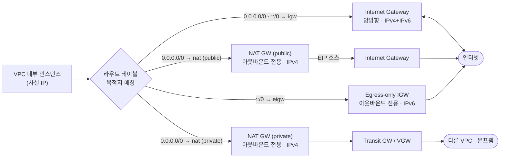
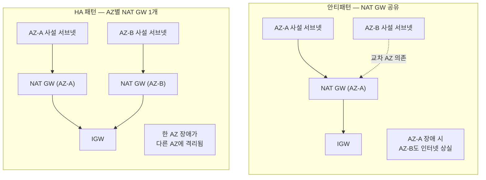
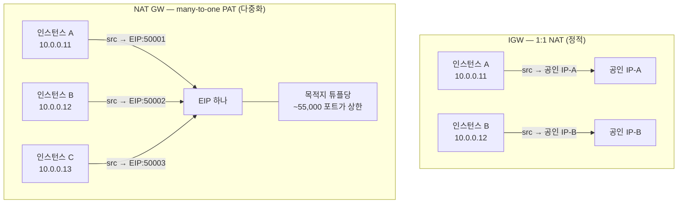
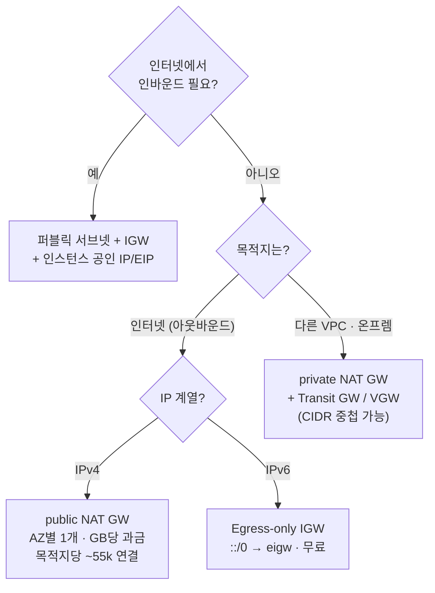

이 글은 [Amazon VPC](https://docs.aws.amazon.com/vpc/latest/userguide/what-is-amazon-vpc.html) User Guide와 [Amazon EC2](https://docs.aws.amazon.com/AWSEC2/latest/UserGuide/concepts.html) User Guide(2026년 6월 기준)를 읽고 정리한 노트입니다. [VPC 기초 편](/posts/aws-vpc/)에 이어, 트래픽이 VPC의 경계("엣지")를 넘나드는 메커니즘을 정리합니다. Internet Gateway, NAT Gateway, Egress-only Internet Gateway, Elastic IP, Elastic Network Interface, 그리고 Private IP / Public IP / Elastic IP의 정확한 구분까지 공식 수치·라우트 테이블 예제·비교표 중심으로 옮겼습니다. 대역폭·연결 한계·과금 구조·메트릭 의미 같은 수치는 모두 AWS 문서 기준값입니다. 보안(Security Group·Network ACL)은 [3편](/posts/aws-vpc-3/)에서 다룹니다.

> [!NOTE] 사전지식
> VPC·서브넷·라우트 테이블·CIDR 표기의 기본 개념은 안다고 가정합니다. 생소하다면 [VPC 기초 편](/posts/aws-vpc/)을 먼저 보면 좋습니다.

## VPC는 기본적으로 격리되어 있다

VPC는 기본 상태에서 인터넷과 완전히 단절되어 있고 외부와의 모든 통신은 반드시 *엣지 디바이스 + 그 디바이스를 가리키는 라우트 테이블 항목*을 거칩니다. 이 절은 그 전제를 먼저 세웁니다. 이후의 모든 장치(IGW·NAT Gateway·EIGW)는 이 격리를 어떤 방향으로, 어떤 조건에서 뚫어 주느냐로 갈립니다.

VPC는 AWS 리전 안에 소프트웨어로 정의된, 논리적으로 격리된 사설 네트워크입니다. 기본 상태에서는 VPC 안의 어떤 리소스도 인터넷으로 나갈 수 없고 인터넷에서 VPC 안으로 들어올 수도 없습니다. 공인 가능한(publicly-routable) CIDR 블록을 쓰더라도 그것만으로 인터넷에 직접 닿지는 않습니다. AWS 문서는 이 점을 명시합니다.

> *"Regardless of the IP address range of your VPC, we do not support direct access to the internet from your VPC's CIDR block, including a publicly-routable CIDR block. You must set up internet access through a gateway."*
>
> — Amazon VPC User Guide, [Internet gateways](https://docs.aws.amazon.com/vpc/latest/userguide/VPC_Internet_Gateway.html)

주소 범위를 인터넷에 알리지도 않습니다.

> *"We never advertise the IPv4 address range of a subnet to the internet."*
>
> — Amazon VPC User Guide, [Internet gateways](https://docs.aws.amazon.com/vpc/latest/userguide/VPC_Internet_Gateway.html)

외부로의 연결은 항상 **엣지 디바이스**와 그 디바이스를 가리키는 **라우트 테이블 항목**을 함께 거칩니다. 인터넷 방향 트래픽을 다루는 주요 엣지 디바이스는 다음과 같습니다.

| 디바이스 | 방향 | IP 계열 | 인터넷에서 인바운드? | 공인 IP / EIP 필요? |
|---|---|---|---|---|
| **Internet Gateway (IGW)** | 양방향 | IPv4 + IPv6 | 예(인스턴스가 공인 IP/EIP 보유 시) | 인스턴스에 공인 IPv4 또는 IPv6 |
| **NAT Gateway (public)** | 아웃바운드 전용 | IPv4 (+ NAT64로 IPv6) | 아니오(비요청 인바운드 차단) | NAT GW에 EIP(인스턴스는 사설 유지) |
| **NAT Gateway (private)** | 아웃바운드 전용(다른 VPC/온프렘 방향) | IPv4 | 아니오 | 불필요 — 사설 IP 사용 |
| **Egress-only Internet Gateway (EIGW)** | 아웃바운드 전용 | IPv6 전용 | 아니오 | 해당 없음(IPv6는 이미 전역 고유) |
| **NAT Instance**(레거시) | 아웃바운드 전용 | IPv4 | 아니오 | 인스턴스에 공인 IP 또는 EIP |

서브넷이 Public인지 Private인지는 서브넷 자체의 플래그가 아니라 **연결된 라우트 테이블**이 결정합니다.

> *"If a subnet is associated with a route table that has a route to an internet gateway, it's known as a public subnet ... that does not have a route to an internet gateway, it's known as a private subnet."*
>
> — Amazon VPC User Guide, [Internet gateways](https://docs.aws.amazon.com/vpc/latest/userguide/VPC_Internet_Gateway.html)

다음 그림은 인스턴스가 서브넷을 떠날 때 라우트 테이블의 목적지 매칭이 트래픽을 어느 엣지 디바이스로 보내는지, 그 디바이스가 어느 방향·IP 계열을 담당하는지를 정리한 것입니다. 어느 경로든 **라우트 테이블 항목**을 반드시 거칩니다.

```mermaid
flowchart LR
    INST["VPC 내부 인스턴스<br/>(사설 IP)"] --> RT{"라우트 테이블<br/>목적지 매칭"}

    RT -->|"0.0.0.0/0 · ::/0 → igw"| IGW["Internet Gateway<br/>양방향 · IPv4+IPv6"]
    RT -->|"0.0.0.0/0 → nat (public)"| NATPUB["NAT GW (public)<br/>아웃바운드 전용 · IPv4"]
    RT -->|"0.0.0.0/0 → nat (private)"| NATPRV["NAT GW (private)<br/>아웃바운드 전용 · IPv4"]
    RT -->|"::/0 → eigw"| EIGW["Egress-only IGW<br/>아웃바운드 전용 · IPv6"]

    IGW <--> NET(["인터넷"])
    NATPUB -->|"EIP 소스"| IGW2["Internet Gateway"] --> NET
    NATPRV --> TGW["Transit GW / VGW"] --> ONP(["다른 VPC · 온프렘"])
    EIGW --> NET
```

## Internet Gateway (IGW)

IGW는 VPC 하나를 인터넷에 연결하는 단일 구성요소이며 VPC당 정확히 하나만 붙고 양방향 통신을 허용합니다. IGW 자체는 가용성·대역폭 병목을 일으키지 않으므로 사용자가 HA를 설계할 필요가 없습니다. 이 절은 IGW의 네 가지 보장, "VPC당 1개" 규칙, IPv4에 대한 1:1 NAT 동작, 라우팅 요건, 과금을 다룹니다.

### 정의 — 네 가지 보장

AWS의 한 문장짜리 정의에 네 가지 보장이 압축되어 있습니다.

> *"An internet gateway is a horizontally scaled, redundant, and highly available VPC component ... It supports IPv4 and IPv6 traffic. It does not cause availability risks or bandwidth constraints on your network traffic."*
>
> — Amazon VPC User Guide, [Internet gateways](https://docs.aws.amazon.com/vpc/latest/userguide/VPC_Internet_Gateway.html)

- **수평 확장(horizontally scaled)** — 단일 장비가 아니라 내부에서 수평으로 확장됩니다.
- **이중화(redundant)** — 단일 장애점이 없도록 이중으로 구성됩니다.
- **고가용성(highly available)** — 가용성 위험을 만들지 않습니다. IGW의 HA는 AWS가 담당하므로 "AZ마다 하나 배치" 같은 설계가 필요 없습니다(NAT Gateway와 대비되는 지점입니다).
- **대역폭 제약 없음** — IGW 자체가 처리량 병목이 되지 않습니다. 한계는 인스턴스/ENI의 대역폭입니다.

IGW는 관리형·리전 광역·무한 확장·무료 엣지 라우터입니다. VPC에 하나 붙여 두면 그 뒤로는 신경 쓸 일이 없습니다.

### VPC당 IGW 1개

VPC에는 한 번에 **최대 하나**의 IGW만 붙일 수 있고 그 하나가 모든 가용 영역(AZ)에 걸쳐 VPC 전체를 담당합니다(AZ 단위로 배치되는 NAT Gateway와 정반대 구조입니다 — [NAT Gateway는 AZ 단위](#nat-gateway는-멀티az가-아니다--장애-도메인) 참고). IGW는 VPC에 연결되고 라우팅이 구성되어야 동작합니다.

> *"To use an internet gateway, you must attach it to a VPC and configure routing."*
>
> — Amazon VPC User Guide, [Internet gateways](https://docs.aws.amazon.com/vpc/latest/userguide/VPC_Internet_Gateway.html)

### 양방향 통신, 그리고 IPv4의 1:1 NAT

IGW는 퍼블릭 서브넷의 리소스가 인터넷과 연결되도록 하며 인터넷의 리소스도 공인 주소로 서브넷 리소스에 연결을 시작할 수 있습니다.

> *"An internet gateway enables resources in your public subnets ... to connect to the internet ... Similarly, resources on the internet can initiate a connection to resources in your subnet using the public IPv4 address or IPv6 address."*
>
> — Amazon VPC User Guide, [Internet gateways](https://docs.aws.amazon.com/vpc/latest/userguide/VPC_Internet_Gateway.html)

두 가지가 핵심입니다.

- IGW는 **양방향**입니다. 인터넷에서 들어오는 인바운드 연결이 허용됩니다(NAT Gateway와 구분되는 지점입니다). 퍼블릭 서브넷의 웹 서버는 IGW를 통해 인바운드 트래픽을 받습니다.
- 인스턴스 자신이 **공인 주소**(공인 IPv4 / EIP / IPv6)를 가져야 합니다. IGW가 사설 전용 인스턴스를 저절로 도달 가능하게 만들지는 않습니다.

IPv4 통신에 대해서는 IGW가 [NAT(Network Address Translation)](https://datatracker.ietf.org/doc/html/rfc3022)도 수행합니다.

> *"An internet gateway provides a target in your VPC route tables for internet-routable traffic. For communication using IPv4, the internet gateway also performs network address translation (NAT)."*
>
> — Amazon VPC User Guide, [Internet gateways](https://docs.aws.amazon.com/vpc/latest/userguide/VPC_Internet_Gateway.html)

이 NAT는 **1:1 NAT**(정적 NAT)입니다. 인스턴스는 자신의 사설 IP만 인지하고 자신에게 공인 IP가 있다는 사실은 모릅니다. IGW가 나갈 때 소스 주소를, 들어올 때 목적지 주소를 바꿔 씁니다.

> *"Your instance is only aware of the private (internal) IP address space defined within the VPC and subnet. The internet gateway logically provides the one-to-one NAT on behalf of your instance."*
>
> — Amazon VPC User Guide, [Internet gateways](https://docs.aws.amazon.com/vpc/latest/userguide/VPC_Internet_Gateway.html)

트래픽이 서브넷을 떠나 인터넷으로 갈 때 응답 주소 필드는 인스턴스의 공인 IPv4/EIP로 설정되고 인스턴스의 공인 IPv4/EIP로 향하는 트래픽은 인스턴스의 사설 IPv4로 목적지 주소가 변환된 뒤 전달됩니다. 사설 IP 하나가 공인 IP 하나에 대응하는 형태입니다. 뒤에 나오는 NAT Gateway의 **many-to-one NAT**([PAT / NAPT](https://datatracker.ietf.org/doc/html/rfc3022): 여러 사설 IP가 하나의 공인 IP를 소스 포트로 구분해 공유)와 대비됩니다.

IPv6에는 NAT가 없습니다. IPv6 주소는 전역 고유이며 직접 라우팅됩니다.

> *"IPv6 addresses are globally unique, and therefore public by default."*
>
> — Amazon VPC User Guide, [Internet gateways](https://docs.aws.amazon.com/vpc/latest/userguide/VPC_Internet_Gateway.html)

IPv6로 인터넷 통신을 하려면 VPC와 서브넷에 IPv6 CIDR 블록이 연결되어 있고 인스턴스가 서브넷 범위에서 IPv6 주소를 할당받아야 합니다.

### 라우팅 요건 — `0.0.0.0/0 → igw-id`

IGW는 라우트 테이블이 트래픽을 보내 주기 전까지 아무 일도 하지 않습니다. 퍼블릭 서브넷의 표준 라우트 테이블은 다음과 같습니다.

| Destination | Target |
|---|---|
| `VPC CIDR`(예: 10.0.0.0/16) | local |
| `0.0.0.0/0` | `igw-id` |
| `::/0`(IPv6) | `igw-id` |

기본 경로를 IGW로 보내거나, 회사의 외부 엔드포인트 같은 더 좁은 범위로 한정할 수도 있습니다.

> *"In your public subnet's route table, you can specify a route for the internet gateway to all destinations not explicitly known to the route table (0.0.0.0/0 for IPv4 or ::/0 for IPv6)."*
>
> — Amazon VPC User Guide, [Internet gateways](https://docs.aws.amazon.com/vpc/latest/userguide/VPC_Internet_Gateway.html)

주의할 점은 공인 IP와 IGW 경로가 **둘 다** 있어야 한다는 것입니다. IGW로 가는 경로가 없으면 공인 IP가 있어도 인터넷과 통신할 수 없습니다.

> *"Because there is no route to the internet gateway, instances in the private subnet can't communicate with the internet, even if they have public IP addresses."*
>
> — Amazon VPC User Guide, [Internet gateways](https://docs.aws.amazon.com/vpc/latest/userguide/VPC_Internet_Gateway.html)

정리하면 인스턴스가 IGW를 통해 IPv4로 인터넷에 나가려면 세 조건이 모두 필요합니다.

1. IGW가 VPC에 연결되어 있을 것.
2. 서브넷 라우트 테이블에 `0.0.0.0/0 → igw-id`가 있을 것(이것이 "퍼블릭 서브넷"을 만듭니다).
3. 인스턴스가 공인 IPv4 주소 또는 Elastic IP를 가질 것.

(추가로 Security Group / NACL이 해당 트래픽을 허용해야 합니다.)

### 과금 — IGW는 무료

IGW 자체에는 요금이 없습니다. 다만 IGW를 쓰는 EC2 인스턴스의 데이터 전송 요금은 부과됩니다.

> *"There is no charge for an internet gateway, but there are data transfer charges for EC2 instances that use internet gateways."*
>
> — Amazon VPC User Guide, [Internet gateways](https://docs.aws.amazon.com/vpc/latest/userguide/VPC_Internet_Gateway.html)

데이터 전송 아웃(DTO)과, 2024년 2월부터는 공인 IPv4 주소 자체에 대한 요금이 붙습니다(뒤의 [Elastic IP 과금](#과금--연결-여부와-무관하게-과금) 참고).

### 기본 VPC vs 비기본 VPC

**기본 VPC(default VPC)**는 인터넷 접근이 준비된 상태로 제공되지만 직접 만든 **비기본 VPC(nondefault VPC)**는 IGW·경로·공인 IP 설정을 직접 추가해야 합니다.

| 구성요소 | 기본 VPC | 비기본 VPC |
|---|---|---|
| Internet gateway | 있음 | 없음 |
| IPv4용 IGW 경로(0.0.0.0/0) | 있음 | 없음 |
| IPv6용 IGW 경로(::/0) | 없음 | 없음 |
| 인스턴스에 공인 IPv4 자동 할당 | 있음(기본 서브넷) | 없음 |
| 인스턴스에 IPv6 자동 할당 | 없음 | 없음 |

## NAT Gateway 심화

NAT Gateway는 **사설** 인스턴스가 밖으로 나가되 밖에서 들어오지는 못하게 하는 관리형 장치입니다. 이 절은 NAT Gateway의 전부를 다룹니다 — 퍼블릭/프라이빗 타입, AZ 단위 장애 도메인, 대역폭·연결 한계, 메트릭, 과금, IPv6용 대안까지.

> *"You can use a NAT gateway so that instances in a private subnet can connect to services outside your VPC but external services can't initiate a connection with those instances."*
>
> — Amazon VPC User Guide, [NAT gateways](https://docs.aws.amazon.com/vpc/latest/userguide/vpc-nat-gateway.html)

연결은 항상 VPC 내부에서 시작되어야 합니다.

> *"Connections must always be initiated from within the VPC containing the NAT gateway."*
>
> — Amazon VPC User Guide, [NAT gateways](https://docs.aws.amazon.com/vpc/latest/userguide/vpc-nat-gateway.html)

### Public vs Private NAT Gateway

NAT Gateway는 생성 시 **연결 유형(connectivity type)**을 선택합니다. **Public이 기본값**입니다. Public은 IGW를 통해 인터넷으로 나가고 Private는 다른 VPC나 온프렘으로만 나갑니다.

Public NAT Gateway는 퍼블릭 서브넷에 만들고 생성 시 Elastic IP를 연결해야 합니다.

> *"Public – (Default) Instances in private subnets can connect to the internet through a public NAT gateway ... You create a public NAT gateway in a public subnet and must associate an Elastic IP address with the NAT gateway at creation."*
>
> — Amazon VPC User Guide, [NAT gateways](https://docs.aws.amazon.com/vpc/latest/userguide/vpc-nat-gateway.html)

Private NAT Gateway는 Elastic IP를 연결할 수 없고 IGW로 트래픽을 보내면 IGW가 그 트래픽을 폐기합니다.

> *"You can't associate an Elastic IP address with a private NAT gateway ... if you route traffic from the private NAT gateway to the internet gateway, the internet gateway drops the traffic."*
>
> — Amazon VPC User Guide, [NAT gateways](https://docs.aws.amazon.com/vpc/latest/userguide/vpc-nat-gateway.html)

| | Public NAT Gateway | Private NAT Gateway |
|---|---|---|
| 인터넷 도달 | 가능(IGW 경유) | **불가**(IGW가 트래픽 폐기) |
| Elastic IP 필요 | **예**, 생성 시 | **아니오** — EIP 불가 |
| 목적지가 보는 소스 IP | NAT GW의 EIP(IGW와 함께 쓸 때) | NAT GW의 사설 IP |
| 위치 | 퍼블릭 서브넷 | 임의 서브넷 |
| 대표 용도 | 사설 서브넷 → 인터넷 | VPC↔VPC / 온프렘, 중첩 CIDR, 허용 목록 IP 범위 |

주소 변환 흐름은 두 타입 모두 소스 사설 IP를 NAT GW의 사설 IP로 매핑하고 퍼블릭 경로에서만 IGW가 다시 EIP로 매핑을 추가합니다.

> *"Both private and public NAT gateways map the source private IPv4 address ... to the private IPv4 address of the NAT gateway ... in the case of a public NAT gateway, the internet gateway then maps [it] to the Elastic IP."*
>
> — Amazon VPC User Guide, [NAT gateways](https://docs.aws.amazon.com/vpc/latest/userguide/vpc-nat-gateway.html)

한 가지 미묘한 점 — Public NAT GW라도 트랜짓 게이트웨이/VGW로 라우팅될 때는 자신의 *사설* IP를 소스로 씁니다. EIP를 소스로 쓰는 것은 같은 VPC의 IGW와 함께 쓸 때뿐입니다.

> *"The public NAT gateway only uses its Elastic IP address as the source IP address when used in conjunction with an internet gateway in the same VPC."*
>
> — Amazon VPC User Guide, [NAT gateways](https://docs.aws.amazon.com/vpc/latest/userguide/vpc-nat-gateway.html)

### NAT Gateway는 멀티AZ가 아니다 — 장애 도메인

NAT Gateway에서 가장 중요한 운영 사실입니다. **NAT Gateway는 정확히 하나의 가용 영역(AZ)에만 존재합니다.** 그 AZ 안에서는 이중화되지만 AZ를 가로지르지는 않습니다.

> *"Each NAT gateway is created in a specific Availability Zone and implemented with redundancy in that zone. There is a quota on the number of NAT gateways that you can create in each Availability Zone."*
>
> — Amazon VPC User Guide, [NAT gateway basics](https://docs.aws.amazon.com/vpc/latest/userguide/nat-gateway-basics.html)

결과적으로 여러 AZ가 NAT GW 하나를 공유하면, 그 NAT GW의 AZ가 그것에 의존하는 모든 AZ의 **단일 장애 도메인**이 됩니다.

> *"If you have resources in multiple Availability Zones and they share one NAT gateway, and if the NAT gateway's Availability Zone is down, resources in the other Availability Zones lose internet access."*
>
> — Amazon VPC User Guide, [NAT gateway basics](https://docs.aws.amazon.com/vpc/latest/userguide/nat-gateway-basics.html)

> [!IMPORTANT] HA 규칙 — AZ별 NAT GW 1개
> 각 AZ에 NAT Gateway를 하나씩 만들고, 각 AZ의 사설 서브넷 라우트 테이블이 *같은 AZ*의 NAT GW를 가리키게 합니다. 이것은 가용성뿐 아니라 AZ 간 데이터 처리·전송 요금([과금](#과금-모델--시간당--gb당-데이터-처리) 참고)까지 줄이는 결정입니다.

비교 문서도 같은 내용을 HA 표 형태로 진술합니다.

> *"Highly available. NAT gateways in each Availability Zone are implemented with redundancy. Create a NAT gateway in each Availability Zone to ensure zone-independent architecture."*
>
> — Amazon VPC User Guide, [Compare NAT gateways and NAT instances](https://docs.aws.amazon.com/vpc/latest/userguide/vpc-nat-comparison.html)

이 AZ별 패턴을 자동화한 2024년 이후 기능이 Regional NAT Gateway이며 [뒤에서](#regional-nat-gateway--자동-멀티az-확장) 별도로 다룹니다.

다음 두 그림이 그 차이를 보여 줍니다. 왼쪽(안티패턴)은 AZ-B의 사설 서브넷이 AZ-A의 NAT GW를 가리켜, AZ-A가 죽으면 AZ-B까지 인터넷을 잃습니다. 오른쪽(HA 패턴)은 각 AZ가 같은 AZ의 NAT GW를 가리켜 장애가 그 AZ에 갇힙니다.

```mermaid
flowchart TB
    subgraph BAD["안티패턴 — NAT GW 공유"]
        direction TB
        PA["AZ-A 사설 서브넷"] --> NA["NAT GW (AZ-A)"]
        PB["AZ-B 사설 서브넷"] -.->|"교차 AZ 의존"| NA
        NA --> IA["IGW"]
        XA["AZ-A 장애 시<br/>AZ-B도 인터넷 상실"]
    end

    subgraph GOOD["HA 패턴 — AZ별 NAT GW 1개"]
        direction TB
        QA["AZ-A 사설 서브넷"] --> MA["NAT GW (AZ-A)"] --> JA["IGW"]
        QB["AZ-B 사설 서브넷"] --> MB["NAT GW (AZ-B)"] --> JA
        YB["한 AZ 장애가<br/>다른 AZ에 격리됨"]
    end
```

### 대역폭 — 5 Gbps에서 100 Gbps까지 자동 확장

NAT Gateway의 대역폭·패킷 처리율은 별도 설정 없이 자동으로 확장되며 상한을 넘기려면 서브넷·NAT GW를 분할(샤딩)합니다.

대역폭은 5 Gbps에서 시작해 100 Gbps까지 자동 확장됩니다.

> *"A NAT gateway supports 5 Gbps of bandwidth and automatically scales up to 100 Gbps. If you require more bandwidth, you can split your resources into multiple subnets and create a NAT gateway in each subnet."*
>
> — Amazon VPC User Guide, [NAT gateway basics](https://docs.aws.amazon.com/vpc/latest/userguide/nat-gateway-basics.html)

패킷 처리율은 초당 100만(1M pps)에서 시작해 초당 1000만(10M pps)까지 자동 확장되고 그 한계를 넘으면 패킷을 폐기합니다.

> *"A NAT gateway can process one million packets per second and automatically scales up to ten million packets per second. Beyond this limit, a NAT gateway will drop packets."*
>
> — Amazon VPC User Guide, [NAT gateway basics](https://docs.aws.amazon.com/vpc/latest/userguide/nat-gateway-basics.html)

대역폭은 **5 Gbps → 100 Gbps**, 패킷 처리율은 **1M pps → 10M pps**로 자동 확장되며, 상한을 넘으려면 서브넷·NAT GW 단위로 샤딩합니다.

MTU는 최대 8500바이트까지 지원하지만 인터넷 트래픽에서는 인스턴스 MTU를 1500바이트 이하로 유지해야 합니다.

> *"NAT gateways support traffic with a maximum transmission unit (MTU) of 8500 ... the MTU setting for your EC2 instances should not exceed 1500 bytes."*
>
> — Amazon VPC User Guide, [NAT gateway basics](https://docs.aws.amazon.com/vpc/latest/userguide/nat-gateway-basics.html)

8500바이트를 초과해 NAT GW에 도착한 패킷은 폐기되거나(해당 시) 단편화됩니다.

### 고유 목적지당 약 55,000 동시 연결 — 포트 한계

한 IPv4 주소는 **(목적지 IP, 목적지 포트, 프로토콜) 튜플당** 최대 약 55,000개의 동시 연결만 지원합니다. 한 외부 API 엔드포인트로 수천 개 인스턴스가 몰리는 고팬아웃(high-fan-out) 워크로드에서 걸리는 한계입니다.

> *"Each IPv4 address can support up to 55,000 simultaneous connections to each unique destination. A unique destination is identified by a unique combination of destination IP address, the destination port, and protocol (TCP/UDP/ICMP)."*
>
> — Amazon VPC User Guide, [NAT gateway basics](https://docs.aws.amazon.com/vpc/latest/userguide/nat-gateway-basics.html)

핵심을 정리하면 다음과 같습니다.

- 55,000 상한은 **(목적지 IP, 목적지 포트, 프로토콜) 튜플당, NAT GW IP 주소당** 값입니다. NAT GW 전체의 총량 상한이 아니라 고유 목적지당 값입니다.
- 이 수치는 PAT가 쓰는 ephemeral 소스 포트(클라이언트가 연결마다 임시로 여는 높은 번호 포트) 공간에서 비롯됩니다. NAT GW는 아웃바운드 연결마다 공인 IP의 서로 다른 소스 포트로 다시 씁니다. 사용 가능한 포트가 약 5만 5천 개라 *같은* 목적지 튜플에 대한 동시 연결도 약 5만 5천 개입니다.
- 한계를 올리려면 NAT GW에 IPv4 주소를 **최대 8개**(primary 1개 + secondary 7개) 붙입니다. 8 × 55,000 = **440,000** 동시 연결(고유 목적지당)까지 늘어납니다.

주소를 8개까지 붙일 수 있다는 근거는 다음과 같습니다.

> *"You can increase this limit by associating up to 8 IPv4 addresses to your NAT gateways (1 primary IPv4 address and 7 secondary IPv4 addresses)."*
>
> — Amazon VPC User Guide, [NAT gateway basics](https://docs.aws.amazon.com/vpc/latest/userguide/nat-gateway-basics.html)

다만 Public NAT GW의 기본 EIP 연결 상한은 2개이며 쿼터 상향 요청으로 늘립니다.

> *"You are limited to associating 2 Elastic IP addresses to your public NAT gateway by default. You can increase this limit by requesting a quota adjustment."*
>
> — Amazon VPC User Guide, [NAT gateway basics](https://docs.aws.amazon.com/vpc/latest/userguide/nat-gateway-basics.html)

이 포트 한계는 many-to-one NAT(PAT) 때문에 존재합니다. 인스턴스마다 전용 공인 IP를 갖는 IGW의 [1:1 NAT](#양방향-통신-그리고-ipv4의-11-nat)에는 이런 상한이 없습니다.

아래 그림은 두 방식의 소스 주소 매핑 차이를 정리한 것입니다. IGW는 사설 IP 하나를 공인 IP 하나에 고정 매핑하고(포트 상한 없음), NAT GW는 여러 사설 IP를 공인 IP 하나에 소스 포트로 구분해 다중화하므로(목적지 튜플당 약 5만 5천 포트) 포트 예산이 상한이 됩니다.

```mermaid
flowchart TB
    subgraph L["IGW — 1:1 NAT (정적)"]
        direction LR
        A1["인스턴스 A<br/>10.0.0.11"] -->|"src → 공인 IP-A"| PA["공인 IP-A"]
        A2["인스턴스 B<br/>10.0.0.12"] -->|"src → 공인 IP-B"| PB["공인 IP-B"]
    end

    subgraph R["NAT GW — many-to-one PAT (다중화)"]
        direction LR
        B1["인스턴스 A<br/>10.0.0.11"] -->|"src → EIP:50001"| E1["EIP 하나"]
        B2["인스턴스 B<br/>10.0.0.12"] -->|"src → EIP:50002"| E1
        B3["인스턴스 C<br/>10.0.0.13"] -->|"src → EIP:50003"| E1
        E1 --- CAP["목적지 튜플당<br/>~55,000 포트가 상한"]
    end
```

### ErrorPortAllocation — 한계 도달을 알리는 메트릭

소스 포트가 고갈되면 NAT GW는 새 연결을 열지 못하고 **`ErrorPortAllocation`** 카운터를 증가시킵니다. 이 값이 0보다 크면 동시 연결이 과다하다는 신호입니다.

> *"ErrorPortAllocation — The number of times the NAT gateway could not allocate a source port. A value greater than zero indicates that too many concurrent connections are open through the NAT gateway."*
>
> — Amazon VPC User Guide, [NAT gateway metrics](https://docs.aws.amazon.com/vpc/latest/userguide/metrics-dimensions-nat-gateway.html)

`ErrorPortAllocation > 0`이면 목적지당 약 5만 5천 포트 예산을 소진하는 상태입니다. secondary IPv4 추가, 서브넷·NAT GW 샤딩, 또는 대용량 AWS 트래픽을 VPC endpoint로 옮겨 해소합니다.

다른 주요 NAT GW [CloudWatch](https://docs.aws.amazon.com/AmazonCloudWatch/latest/monitoring/WhatIsCloudWatch.html) 메트릭(1분 간격 전송)은 다음과 같습니다.

| 메트릭 | 의미(AWS 문서 기준) |
|---|---|
| `ActiveConnectionCount` | NAT GW를 통과하는 동시 활성 TCP 연결의 총 개수. 가장 유용한 통계는 Max. |
| `ErrorPortAllocation` | NAT GW가 소스 포트를 할당하지 못한 횟수. 0 초과 ⇒ 동시 연결 과다. |
| `IdleTimeoutCount` | 활성 상태에서 유휴 상태로 전환된 연결 수. 정상 종료되지 않고 350초간 활동이 없으면 유휴로 전환됩니다. |
| `PacketsDropCount` | NAT GW가 폐기한 패킷 수. `PacketsDropCount/(PacketsInFromSource+PacketsInFromDestination)*100`이 0.01%를 넘으면 VPC 서비스 문제를 의심합니다. |
| `ConnectionAttemptCount` / `ConnectionEstablishedCount` | SYN 시도 vs 수립. 차이가 크면 응답 없는 연결이 있다는 뜻. |
| `BytesInFromSource` / `BytesOutToDestination` / `BytesInFromDestination` / `BytesOutToSource` | 방향별 바이트 카운터. 데이터 손실·차단 탐지에 사용. |
| `PeakBytesPerSecond` / `PeakPacketsPerSecond` | 1분 내 최대 처리량 / 패킷 처리율. |

유휴 타임아웃 **350초**는 중요한 운영 수치입니다. 350초간 활동이 없는 연결은 유휴가 되고 이후 그 연결을 계속 쓰려 하면 RST를 받습니다([타임아웃 동작](#관리형--nat-instance와의-차이) 참고).

> *"An active connection transitions to idle if it was not closed gracefully and there was no activity for the last 350 seconds."*
>
> — Amazon VPC User Guide, [NAT gateway metrics](https://docs.aws.amazon.com/vpc/latest/userguide/metrics-dimensions-nat-gateway.html)

오래 유지되지만 조용한 연결에는 350초보다 짧은 간격으로 [TCP keepalive](https://datatracker.ietf.org/doc/html/rfc1122)를 보내야 합니다.

### 관리형 — NAT Instance와의 차이

NAT Gateway는 완전 관리형입니다. OS도, 패치도, 인스턴스 사이징도 없습니다.

> *"Managed by AWS. You do not need to perform any maintenance."*
>
> — Amazon VPC User Guide, [Compare NAT gateways and NAT instances](https://docs.aws.amazon.com/vpc/latest/userguide/vpc-nat-comparison.html)

기본 문서에 나오는 다른 관리형 특성들입니다.

- **프로토콜**: TCP, UDP, ICMP를 지원합니다.
- **NAT GW 자체에는 Security Group을 붙일 수 없습니다.** 대신 뒤에 있는 인스턴스에 SG를 붙여 인바운드/아웃바운드를 제어합니다(서브넷에는 NACL 사용, NAT GW는 포트 1024–65535 사용).
- **requester-managed ENI로 구현됩니다.** NAT GW에 대해 requester-managed 네트워크 인터페이스가 생성됩니다([requester-managed ENI](#requester-managed-eni) 참고).
- **primary 사설 IP는 고정**입니다. primary 사설 IPv4는 변경·제거할 수 없고 필요에 따라 secondary 사설 IPv4만 추가합니다.
- **타임아웃 동작은 RST**(FIN이 아님)입니다.

타임아웃 시 동작은 아래와 같습니다.

> *"When a connection times out, a NAT gateway returns an RST packet to any resources behind the NAT gateway that attempt to continue the connection (it does not send a FIN packet)."*
>
> — Amazon VPC User Guide, [Compare NAT gateways and NAT instances](https://docs.aws.amazon.com/vpc/latest/userguide/vpc-nat-comparison.html)

라우팅 관련 제약도 있습니다.

- **VPC 피어링**: 피어링 연결을 가로질러 NAT GW *로* 라우팅할 수 없습니다(`Client → Peering → NAT → Internet`은 미지원). 반대 방향 `Client → NAT → Peering → Destination`은 지원되며 "Return to Sender" 동작을 따릅니다.
- **VPN/Direct Connect**: *virtual private gateway*를 통해 NAT GW로 라우팅할 수 없습니다. *transit gateway*를 사용합니다.

### Elastic IP 요건(Public NAT GW)

**Public** NAT GW는 생성 시 Elastic IP를 연결해야 하고(그 EIP가 IGW를 통한 공인 소스 주소가 됩니다), **Private** NAT GW는 EIP를 가질 수 없습니다.

> *"Choose the Elastic IP address to associate with a public NAT gateway at creation."*
>
> — Amazon VPC User Guide, [Compare NAT gateways and NAT instances](https://docs.aws.amazon.com/vpc/latest/userguide/vpc-nat-comparison.html)

NAT GW의 사설 IPv4는 서브넷 범위에서 자동 선택됩니다.

> *"Automatically selected from the subnet's IP address range when you create the gateway."*
>
> — Amazon VPC User Guide, [Compare NAT gateways and NAT instances](https://docs.aws.amazon.com/vpc/latest/userguide/vpc-nat-comparison.html)

### 과금 모델 — 시간당 + GB당 데이터 처리

NAT Gateway는 두 축으로 과금됩니다. 트래픽이 없어도 매시간 부과되는 가용성 요금과, 통과하는 모든 GB에 붙는 데이터 처리 요금입니다.

> *"When you provision a NAT gateway, you are charged for each hour that your NAT gateway is available and each gigabyte of data that it processes."*
>
> — Amazon VPC User Guide, [NAT gateway pricing](https://docs.aws.amazon.com/vpc/latest/userguide/nat-gateway-pricing.html)

1. **시간당 가용성 요금** — NAT GW가 존재하는 매시간, 트래픽 유무와 무관하게 부과됩니다.
2. **GB당 데이터 처리 요금** — NAT GW를 통과하는 *모든* GB에 부과됩니다. 이 요금이 일반 데이터 전송 아웃(DTO) 요금 **위에** 쌓이므로, NAT GW를 통한 대량 egress는 이중 과금(데이터 처리 + DTO)됩니다.

비교 표의 표현은 다음과 같습니다.

> *"Charged depending on the number of NAT gateways you use, duration of usage, and amount of data that you send through the NAT gateways."*
>
> — Amazon VPC User Guide, [Compare NAT gateways and NAT instances](https://docs.aws.amazon.com/vpc/latest/userguide/vpc-nat-comparison.html)

AWS 문서가 제시하는 절감책은 두 가지입니다.

> *"If your AWS resources send or receive a significant volume of traffic across Availability Zones, ensure that the resources are in the same Availability Zone as the NAT gateway."*
>
> — Amazon VPC User Guide, [NAT gateway pricing](https://docs.aws.amazon.com/vpc/latest/userguide/nat-gateway-pricing.html)

- **NAT GW를 클라이언트와 같은 AZ에 둡니다.** AZ 간 트래픽은 NAT 처리 요금 위에 AZ 간 데이터 전송 요금을 더합니다(AZ별 NAT GW 1개 규칙이 HA뿐 아니라 비용 결정이기도 한 이유입니다).
- **VPC endpoint를 씁니다.** S3/DynamoDB는 Gateway endpoint로, 그 외 서비스는 Interface/PrivateLink endpoint로 AWS 방향 트래픽을 NAT GW에서 완전히 빼냅니다. S3/DynamoDB용 Gateway endpoint는 무료이며 GB당 NAT 요금을 우회합니다.

인터페이스/게이트웨이 엔드포인트 권고의 근거입니다.

> *"If most traffic through your NAT gateway is to AWS services that support interface endpoints or gateway endpoints, consider creating an interface endpoint or gateway endpoint for these services."*
>
> — Amazon VPC User Guide, [NAT gateway pricing](https://docs.aws.amazon.com/vpc/latest/userguide/nat-gateway-pricing.html)

### Regional NAT Gateway — 자동 멀티AZ 확장

Regional NAT Gateway는 "AZ별 NAT GW 1개" 패턴을 자동화한 가용성 모드입니다. 단일 NAT ID로 워크로드를 따라 AZ를 가로지르며 [AZ 단위](#nat-gateway는-멀티az가-아니다--장애-도메인)로 동작하는 기존 zonal NAT GW의 예외입니다.

> *"A regional NAT gateway automatically expands across Availability Zones based on your workload presence. Unlike standard NAT gateways (referred to as zonal NAT gateways), which operate in a single Availability Zone, regional NAT gateways follow your workloads."*
>
> — Amazon VPC User Guide, [Regional NAT gateways](https://docs.aws.amazon.com/vpc/latest/userguide/nat-gateways-regional.html)

기존 **zonal** NAT GW와 다른 점은 다음과 같습니다.

- **퍼블릭 서브넷이 필요 없습니다.** Regional NAT GW는 자체 라우트 테이블을 가진 독립 리소스이며 AWS가 IGW로 향하는 경로를 미리 구성해 자동 생성합니다.
- **모든 AZ에 걸쳐 단일 NAT ID**를 씁니다. 새 AZ로 확장해도 AZ별 경로를 수정할 필요가 없습니다.
- **자동 확장·축소**됩니다. 새 AZ에 리소스를 띄우면 그 AZ의 ENI 존재를 감지해 자동으로 확장합니다. 확장에는 **최대 60분**이 걸릴 수 있고 그 전까지는 기존 AZ가 교차 영역으로 트래픽을 처리합니다.
- **한계가 더 높습니다.** AZ당 IP를 **최대 32개**까지 지원합니다(zonal은 8개). IP 하나당 인기 목적지에 대한 동시 연결 한계가 55,000씩 늘어, 32 × 55,000 = **1,760,000** 동시 연결(AZ당·목적지당)까지 늘어납니다.
- **모드**는 *automatic*(AWS가 IP·AZ 확장을 관리, 권장) 또는 *manual*(AZ별로 IP·확장을 직접 관리)입니다.

한계 상향의 근거입니다.

> *"Your regional NAT Gateways support up to 32 IP addresses per Availability Zone (compared to 8 for zonal NAT gateways). Each IP address increases the limit on concurrent connections to a popular destination ... by 55,000."*
>
> — Amazon VPC User Guide, [Regional NAT gateways](https://docs.aws.amazon.com/vpc/latest/userguide/nat-gateways-regional.html)

제약은 프라이빗 NAT 미지원입니다.

> *"Regional NAT gateways do not support private NAT. If you need private NAT, use zonal NAT gateways instead."*
>
> — Amazon VPC User Guide, [Regional NAT gateways](https://docs.aws.amazon.com/vpc/latest/userguide/nat-gateways-regional.html)

둘을 갈라 두면, **zonal NAT GW**는 퍼블릭·프라이빗을 모두 지원하는 고전적인 AZ 단위 장치이고 **regional NAT GW**는 관리형 멀티AZ HA를 제공하되 퍼블릭 전용입니다.

### NAT Gateway 사용 사례

AWS 문서가 드는 세 가지 사례입니다.

1. **Public NAT — 사설 서브넷에서 인터넷 접근**: 사설 서브넷 라우트 테이블이 `0.0.0.0/0 → nat-gateway-id`를 보내고 NAT GW는 `0.0.0.0/0 → igw-id`를 가진 퍼블릭 서브넷에 위치합니다.

> *"You can use a public NAT gateway to enable instances in a private subnet to send outbound traffic to the internet, while preventing the internet from establishing connections to the instances."*
>
> — Amazon VPC User Guide, [NAT gateway use cases](https://docs.aws.amazon.com/vpc/latest/userguide/nat-gateway-scenarios.html)

2. **Private NAT — 허용 목록 IP로 온프렘 접근**: 인스턴스마다 허용 목록 IP를 부여하는 대신, 허용 목록 범위의 IP를 가진 private NAT GW로 트래픽을 라우팅합니다. 온프렘에는 모든 인스턴스가 단일 허용 목록 NAT GW IP로 보입니다.

> *"You can use a private NAT gateway to enable communication from your VPCs to your on-premises network using a pool of allow-listed addresses."*
>
> — Amazon VPC User Guide, [NAT gateway use cases](https://docs.aws.amazon.com/vpc/latest/userguide/nat-gateway-scenarios.html)

3. **Private NAT — 중첩 CIDR 네트워크 간 통신**: VPC가 겹치지 않는 *routable* 범위를 배정하고 routable 서브넷의 private NAT GW가 중첩되는 non-routable 소스를 가린 뒤, transit gateway가 routable 범위를 연결합니다.

> *"You can use a private NAT gateway to enable communication between networks even if they have overlapping CIDR ranges."*
>
> — Amazon VPC User Guide, [NAT gateway use cases](https://docs.aws.amazon.com/vpc/latest/userguide/nat-gateway-scenarios.html)

## NAT Gateway vs NAT Instance

NAT Instance는 NAT AMI로 돌아가는 일반 EC2 인스턴스입니다. AWS 권고는 명확합니다 — 가용성·대역폭이 더 낫고 관리 부담이 적으므로 NAT Gateway를 권장합니다. 이 절은 전체 비교표와, NAT Instance만이 가진 세 가지 기능을 정리합니다.

> *"We recommend that you use NAT gateways because they provide better availability and bandwidth and require less effort on your part to administer."*
>
> — Amazon VPC User Guide, [Compare NAT gateways and NAT instances](https://docs.aws.amazon.com/vpc/latest/userguide/vpc-nat-comparison.html)

NAT Instance는 퍼블릭 서브넷에 있어야 하고 공인/Elastic IP를 가져야 하며, source/destination check가 비활성화되어 있어야 합니다.

> *"The NAT instance must have internet access, so it must be in a public subnet ... and it must have a public IP address or an Elastic IP address."*
>
> — Amazon VPC User Guide, [NAT instances](https://docs.aws.amazon.com/vpc/latest/userguide/VPC_NAT_Instance.html)

> [!NOTE] 레거시 AMI
> 레거시 NAT AMI는 Amazon Linux 2018.03 기반으로 EOL(end-of-life) 상태입니다. AWS는 NAT Gateway로 이전하거나 직접 NAT AMI를 만들 것을 권장합니다.

AWS "Compare NAT gateways and NAT instances" 페이지의 전체 비교표입니다.

| 속성 | NAT gateway | NAT instance |
|---|---|---|
| **가용성** | 고가용성. 각 AZ의 NAT GW가 이중화로 구현됨. 영역 독립 아키텍처를 위해 AZ마다 NAT GW를 생성. | 스크립트로 인스턴스 간 페일오버를 관리. |
| **대역폭** | 최대 100 Gbps로 확장. | 인스턴스 타입의 대역폭에 종속. |
| **유지보수** | AWS 관리. 유지보수 불필요. | 사용자 관리. 소프트웨어 업데이트·OS 패치 등. |
| **성능** | NAT 트래픽 처리에 최적화된 소프트웨어. | NAT를 수행하도록 구성된 범용 AMI. |
| **비용** | NAT GW 개수·사용 시간·전송 데이터량에 따라 과금. | NAT 인스턴스 개수·사용 시간·인스턴스 타입/크기에 따라 과금. |
| **타입/크기** | 균일 제공. 타입·크기 결정 불필요. | 예상 워크로드에 맞는 타입·크기를 선택. |
| **공인 IP 주소** | 생성 시 Public NAT GW에 연결할 EIP를 선택. | NAT 인스턴스에 EIP 또는 공인 IP 사용. 새 EIP를 연결해 언제든 변경 가능. |
| **사설 IP 주소** | 생성 시 서브넷 범위에서 자동 선택. | 시작 시 서브넷 범위에서 특정 사설 IP를 지정. |
| **Security groups** | NAT GW에는 SG 연결 불가. 뒤의 리소스에 SG를 연결해 제어. | NAT 인스턴스와 뒤의 리소스에 SG를 연결해 제어. |
| **Network ACLs** | NAT GW가 있는 서브넷의 트래픽을 NACL로 제어. | NAT 인스턴스가 있는 서브넷의 트래픽을 NACL로 제어. |
| **Flow logs** | 플로우 로그로 트래픽 캡처. | 플로우 로그로 트래픽 캡처. |
| **Port forwarding** | 미지원. | 구성을 직접 수정해 포트 포워딩 지원. |
| **Bastion servers** | 미지원. | 배스천 서버로 사용 가능. |
| **트래픽 메트릭** | NAT GW의 CloudWatch 메트릭 확인. | 인스턴스의 CloudWatch 메트릭 확인. |
| **타임아웃 동작** | 타임아웃 시 연결을 계속하려는 리소스에 RST 패킷 반환(FIN 아님). | 타임아웃 시 뒤의 리소스에 FIN 패킷을 보내 연결 종료. |
| **IP 단편화** | UDP 프로토콜의 IP 단편 패킷 전달 지원. TCP·ICMP는 단편화 미지원(폐기). | UDP·TCP·ICMP의 IP 단편 패킷 재조립 지원. |

NAT Instance가 가지고 NAT Gateway가 갖지 못한 기능은 세 가지입니다.

1. **NAT 장치 자체에 Security Group** — NAT 인스턴스 자체를 방화벽으로 막을 수 있습니다.
2. **포트 포워딩** — DNAT/포트 포워딩 규칙을 직접 구성할 수 있습니다.
3. **배스천 호스트** — 같은 인스턴스를 SSH 점프 박스로 겸용할 수 있습니다.

여전히 NAT Instance를 고를 유일한 이유가 이 세 가지입니다. HA·대역폭·무유지보수 등 나머지는 NAT Gateway가 앞섭니다.

기존 NAT Instance는 같은 서브넷에 NAT Gateway를 만들고 라우트를 교체해 이전합니다.

> *"If you're already using a NAT instance, we recommend that you replace it with a NAT gateway. You can create a NAT gateway in the same subnet as your NAT instance, and then replace the existing route."*
>
> — Amazon VPC User Guide, [Compare NAT gateways and NAT instances](https://docs.aws.amazon.com/vpc/latest/userguide/vpc-nat-comparison.html)

전환 중 기존 연결은 끊기고 다시 맺어야 합니다.

## Egress-only Internet Gateway (EIGW)

EIGW는 IPv6 아웃바운드 전용 장치입니다. IPv6는 NAT가 없고 모든 주소가 공인이라, 공인 IP를 주지 않는 방식으로 아웃바운드 전용을 만들 수 없습니다. EIGW가 stateful 필터로 그 역할을 대신합니다. NAT Gateway는 IPv4 아웃바운드 전용 장치이고 EIGW는 그 IPv6 대응물입니다.

> *"An egress-only internet gateway is a horizontally scaled, redundant, and highly available VPC component that allows outbound communication over IPv6 from instances in your VPC to the internet, and prevents the internet from initiating an IPv6 connection with your instances."*
>
> — Amazon VPC User Guide, [Egress-only internet gateways](https://docs.aws.amazon.com/vpc/latest/userguide/egress-only-internet-gateway.html)

### 존재 이유 — IPv6는 기본적으로 공인

IPv6에는 NAT도, 주소 수준의 사설/공인 구분도 없습니다. 모든 IPv6 주소가 전역 고유이며 라우팅 가능합니다. IPv4에서처럼 공인 IP를 주지 않는 방식으로 "아웃바운드 전용"을 만들 수 없습니다. EIGW가 **stateful 아웃바운드 전용** 동작을 제공합니다.

> *"IPv6 addresses are globally unique, and are therefore public by default. If you want your instance to be able to access the internet, but ... prevent resources on the internet from initiating communication ..., you can use an egress-only internet gateway."*
>
> — Amazon VPC User Guide, [Egress-only internet gateways](https://docs.aws.amazon.com/vpc/latest/userguide/egress-only-internet-gateway.html)

### IPv6 전용 — NAT GW가 IPv4 대응물

문서는 두 장치를 명시적으로 교차 참조합니다.

> *"An egress-only internet gateway is for use with IPv6 traffic only. To enable outbound-only internet communication over IPv4, use a NAT gateway instead."*
>
> — Amazon VPC User Guide, [Egress-only internet gateways](https://docs.aws.amazon.com/vpc/latest/userguide/egress-only-internet-gateway.html)

대칭 관계는 다음과 같습니다.

- **IPv4 아웃바운드 전용** → NAT Gateway.
- **IPv6 아웃바운드 전용** → Egress-only Internet Gateway.

EIGW는 NAT 장치가 아닙니다. 주소를 변환하지 않으며(IPv6는 변환이 필요 없습니다), established/return 트래픽을 허용하고 비요청 인바운드를 차단하는 stateful 필터입니다.

### Stateful

> *"An egress-only internet gateway is stateful: it forwards traffic from the instances in the subnet to the internet or other AWS services, and then sends the response back to the instances."*
>
> — Amazon VPC User Guide, [Egress-only internet gateways](https://docs.aws.amazon.com/vpc/latest/userguide/egress-only-internet-gateway.html)

### Security Group 없음 — NACL 사용

EIGW에는 SG를 붙일 수 없습니다. 서브넷 트래픽은 NACL로 제어합니다(NAT GW와 같은 제약입니다 — 엣지 장치에는 SG가 없고 인스턴스 SG와 서브넷 NACL로 방화벽을 겁니다).

> *"You can't associate a security group with an egress-only internet gateway ... You can use a network ACL to control the traffic to and from the subnet."*
>
> — Amazon VPC User Guide, [Egress-only internet gateways](https://docs.aws.amazon.com/vpc/latest/userguide/egress-only-internet-gateway.html)

### 라우팅 — `::/0 → eigw-id`

EIGW를 VPC에 만들고 라우트 테이블에 모든 IPv6 트래픽(`::/0`) 또는 특정 IPv6 범위를 EIGW로 보내는 경로를 추가합니다.

| Destination | Target |
|---|---|
| 10.0.0.0/16 | local |
| 2001:db8:1234:1a00::/64 | local |
| `::/0` | `eigw-id` |

### 과금 — 무료(IGW처럼)

EIGW 자체에는 요금이 없고 EIGW를 쓰는 EC2 인스턴스의 데이터 전송 요금만 부과됩니다.

> *"There is no charge for an egress-only internet gateway, but there are data transfer charges for EC2 instances that use internet gateways."*
>
> — Amazon VPC User Guide, [Egress-only internet gateways](https://docs.aws.amazon.com/vpc/latest/userguide/egress-only-internet-gateway.html)

대비되는 지점 — **EIGW는 무료**이지만 **NAT Gateway는 GB당** 과금합니다. egress가 많은 워크로드에서 IPv4 + NAT GW 대신 IPv6 + EIGW를 택하는 이유가 여기에 있습니다. EIGW를 통한 IPv6 egress는 NAT GW의 GB당 처리 요금을 완전히 피합니다.

## Elastic IP (EIP)

Elastic IP는 계정에 할당된 정적 IPv4 주소이며 핵심 가치는 페일오버 리매핑입니다. 죽은 인스턴스에서 떼어 standby에 붙이면 같은 주소로 트래픽이 재개되어 DNS 변경이 필요 없습니다. 이 절은 정의, 범위, 인스턴스↔ENI 연결, 리매핑, 과금, 쿼터, BYOIP를 다룹니다.

### 정의

> *"An Elastic IP address is a static IPv4 address designed for dynamic cloud computing. An Elastic IP address is allocated to your AWS account, and is yours until you release it."*
>
> — Amazon EC2 User Guide, [Elastic IP addresses](https://docs.aws.amazon.com/AWSEC2/latest/UserGuide/elastic-ip-addresses-eip.html)

핵심은 주소가 인스턴스보다 오래 살아남아 **리매핑으로 페일오버**한다는 점입니다.

> *"By using an Elastic IP address, you can mask the failure of an instance or software by rapidly remapping the address to another instance in your account."*
>
> — Amazon EC2 User Guide, [Elastic IP addresses](https://docs.aws.amazon.com/AWSEC2/latest/UserGuide/elastic-ip-addresses-eip.html)

### 계정 범위·리전 한정·IPv4 전용

기본 특성은 다음과 같습니다.

- 정적입니다 — 시간이 지나도 바뀌지 않습니다.
- 특정 리전에서만 사용하며 다른 리전으로 옮길 수 없습니다.
- Amazon의 IPv4 풀 또는 BYOIP 풀에서 나옵니다. **IPv6 EIP는 없습니다.**
- 계정에 먼저 할당(allocate)한 뒤 인스턴스나 네트워크 인터페이스에 연결(associate)합니다.
- 네트워크 경계 그룹(network border group, AWS가 CIDR을 광고하는 위치)에 묶입니다.

IPv6를 지원하지 않는다는 근거입니다.

> *"We do not support Elastic IP addresses for IPv6."*
>
> — Amazon EC2 User Guide, [Elastic IP addresses](https://docs.aws.amazon.com/AWSEC2/latest/UserGuide/elastic-ip-addresses-eip.html)

### 인스턴스 ↔ ENI 연결

EIP를 인스턴스에 연결하면 인스턴스의 primary 네트워크 인터페이스에도 연결되고 인스턴스에 붙은 네트워크 인터페이스에 연결하면 인스턴스에도 연결됩니다.

> *"When you associate an Elastic IP address with an instance, it is also associated with the instance's primary network interface."*
>
> — Amazon EC2 User Guide, [Elastic IP addresses](https://docs.aws.amazon.com/AWSEC2/latest/UserGuide/elastic-ip-addresses-eip.html)

이미 자동 할당 공인 IP를 가진 인스턴스에 EIP를 붙이면, **그 기존 공인 IP는 영구히 사라집니다.**

> *"if the instance already has a public IPv4 address associated with it, that public IPv4 address is released back into Amazon's pool ... You cannot reuse the public IPv4 address previously associated with the instance."*
>
> — Amazon EC2 User Guide, [Elastic IP addresses](https://docs.aws.amazon.com/AWSEC2/latest/UserGuide/elastic-ip-addresses-eip.html)

> [!WARNING] 되돌릴 수 없음
> 실행 중인 인스턴스에 EIP를 연결하면 기존 자동 할당 공인 IP는 Amazon 풀로 반환되어 복구할 수 없습니다. 그 주소를 DNS·허용 목록·외부 참조에 이미 쓰고 있었다면 연결 전에 영향을 확인합니다.

### 리매핑

> *"You can disassociate an Elastic IP address from a resource, and then associate it with a different resource ... ensure that all active connections to the resource named in the existing association are closed before you make the change."*
>
> — Amazon EC2 User Guide, [Elastic IP addresses](https://docs.aws.amazon.com/AWSEC2/latest/UserGuide/elastic-ip-addresses-eip.html)

이것이 페일오버 프리미티브입니다. 죽은 인스턴스에서 EIP를 떼어 standby에 붙이면, 같은 주소로 트래픽이 재개되며 DNS 변경이 없습니다.

### 과금 — 연결 여부와 무관하게 과금

유명한 함정입니다. EIP는 **아무것에도 붙어 있지 않아도** 요금이 붙습니다.

> *"There is a charge for all Elastic IP addresses whether they are in use (allocated to a resource, like an EC2 instance) or idle (created in your account but unallocated)."*
>
> — Amazon EC2 User Guide, [Elastic IP addresses](https://docs.aws.amazon.com/AWSEC2/latest/UserGuide/elastic-ip-addresses-eip.html)

연결 해제된 EIP는 명시적으로 release하기 전까지 계정에 남고 연결 여부와 무관하게 과금됩니다.

과거 AWS는 IPv4 축적을 억제하려고 *유휴* EIP에만 과금하고 붙어 있는 것은 무료로 두었습니다. **2024년 2월 1일부터는 모든 공인 IPv4 주소에 과금**합니다(붙어 있든 아니든).

> *"AWS charges for all public IPv4 addresses, including public IPv4 addresses associated with running instances and Elastic IP addresses."*
>
> — Amazon EC2 User Guide, [Elastic IP addresses](https://docs.aws.amazon.com/AWSEC2/latest/UserGuide/elastic-ip-addresses-eip.html)

"유휴 EIP를 release해 요금을 멈춘다"는 옛 조언만으로는 부족합니다. 모든 공인 IPv4에 요금이 붙으므로, **필요 없는 EIP는 즉시 release**합니다. 단 BYOIP EIP는 계정 쿼터에 포함되지 않습니다.

> *"When you allocate an Elastic IP address from an IP address pool that you have brought to your AWS account, it does not count toward your Elastic IP address limits."*
>
> — Amazon EC2 User Guide, [Elastic IP addresses](https://docs.aws.amazon.com/AWSEC2/latest/UserGuide/elastic-ip-addresses-eip.html)

### 쿼터와 "페일오버에만 쓰라"는 지침

기본 쿼터는 리전당 5개이며 AWS는 EIP를 페일오버 리매핑 용도로만 쓰고 나머지 통신은 DNS 호스트네임을 쓰라고 권합니다.

> *"By default, all AWS accounts have a quota of five (5) Elastic IP addresses per Region, because public (IPv4) internet addresses are a scarce public resource."*
>
> — Amazon EC2 User Guide, [Elastic IP addresses](https://docs.aws.amazon.com/AWSEC2/latest/UserGuide/elastic-ip-addresses-eip.html)

AWS는 EIP를 인스턴스 장애 시 다른 인스턴스로 주소를 리매핑하는 용도로만 쓰고, 나머지 노드 간 통신에는 DNS 호스트네임을 쓰라고 강하게 권합니다. 그 외에는 자동 할당 공인 IP나 DNS를 씁니다.

### BYOIP — Bring Your Own IP

자신의 공인 IPv4/IPv6 주소 범위 전체 또는 일부를 AWS 계정으로 가져올 수 있습니다. 소유권은 그대로 유지하되, AWS가 기본으로 그 범위를 인터넷에 광고합니다.

> *"You can bring part or all of your own public IPv4 address range or IPv6 address range to your AWS account. You continue to own the address range, but AWS advertises it on the internet by default."*
>
> — Amazon VPC User Guide, [IP addressing for your VPCs and subnets](https://docs.aws.amazon.com/vpc/latest/userguide/vpc-ip-addressing.html)

가져온 범위는 계정에서 주소 풀로 나타나며 그 IPv4 풀에서 EIP를 만들 수 있습니다. 용도는 IP 평판 유지(이메일 발신자), 파트너와의 재화이트리스트 회피, 공개 IP를 바꾸지 않고 워크로드 이전 등입니다.

## Elastic Network Interface (ENI)

ENI는 VPC 안의 가상 네트워크 카드로, IP·MAC·SG·source/destination check 플래그를 실제로 보유하는 구성요소입니다. AZ 하나에 묶이며 이 속성들이 ENI를 따라 이동합니다. 이 절은 정의, ENI가 가지는 속성, primary/secondary 구분, source/dest check, 페일오버·다중 홈 사용 사례, requester-managed ENI, 공인 IPv4 수명을 다룹니다.

### 정의

> *"An elastic network interface is a logical networking component in a VPC that represents a virtual network card ... The attributes of a network interface follow it as it's attached or detached from an instance and reattached to another instance."*
>
> — Amazon EC2 User Guide, [Elastic network interfaces](https://docs.aws.amazon.com/AWSEC2/latest/UserGuide/using-eni.html)

두 가지가 중요합니다.

- ENI는 **하나의 AZ에 묶입니다.** 같은 AZ의 인스턴스에만 붙일 수 있습니다.
- **속성이 ENI를 따라 이동합니다.** 인스턴스 A에서 떼어 (같은 AZ의) 인스턴스 B에 붙이면 B가 ENI의 IP·MAC·SG를 물려받고 트래픽이 B로 재지향됩니다. 이것이 페일오버 메커니즘입니다.

(콘솔/API에서는 그냥 "network interface"라고 부르며 "elastic network interface"/ENI와 같은 것입니다.)

### ENI가 가지는 속성

네트워크 인터페이스는 다음 속성을 가질 수 있습니다.

- 서브넷 IPv4 범위의 primary 사설 IPv4 주소
- 서브넷 IPv6 범위의 primary IPv6 주소
- 서브넷 IPv4 범위의 secondary 사설 IPv4 주소들
- 각 사설 IPv4에 대한 Elastic IP(IPv4) 하나
- 공인 IPv4 주소 하나
- secondary IPv6 주소들
- Security groups
- MAC 주소
- source/destination check 플래그
- 설명(description)

ENI가 사설 IP·공인 IP·EIP·IPv6 주소·**MAC 주소**·**Security Group**·**source/dest check 플래그**의 실제 보유자입니다. "인스턴스에 SG가 있다 / MAC이 있다 / EIP가 있다"고 말할 때, 실제로는 *ENI*가 그것을 보유합니다.

### Primary vs Secondary ENI

각 인스턴스에는 기본 네트워크 인터페이스(primary network interface)가 있으며 인스턴스에서 분리할 수 없습니다.

> *"Each instance has a default network interface, called the primary network interface. You can't detach a primary network interface from an instance."*
>
> — Amazon EC2 User Guide, [Elastic network interfaces](https://docs.aws.amazon.com/AWSEC2/latest/UserGuide/using-eni.html)

secondary 네트워크 인터페이스는 독립적으로 만들어 붙이며 최대 개수는 인스턴스 타입에 따라 다릅니다.

- **Primary ENI(eth0)**: 인스턴스와 함께 생성되고 primary 사설 IP를 보유하며 인스턴스 수명 동안 **분리할 수 없습니다.**
- **Secondary ENI(eth1, …)**: 독립적으로 만들어 **인스턴스 간에 붙였다 뗐다 이동**할 수 있습니다(같은 AZ 내). 이 이동성이 관리 네트워크·페일오버·다중 홈을 가능하게 합니다.

### Source/destination check — NAT/라우터/방화벽은 반드시 OFF

source/destination check는 인스턴스가 받는 모든 트래픽의 소스 또는 목적지가 자신인지 확인하는 검사이며 기본으로 활성화되어 있습니다. NAT·라우팅·방화벽을 실행하는 인스턴스에서는 반드시 비활성화해야 합니다.

> *"Source/destination checks are enabled by default. You must disable source/destination checks if the instance runs services such as network address translation, routing, or firewalls."*
>
> — Amazon EC2 User Guide, [Elastic network interfaces](https://docs.aws.amazon.com/AWSEC2/latest/UserGuide/using-eni.html)

**NAT Instance**(또는 라우터·방화벽 어플라이언스)가 `source/dest check = disabled`를 요구하는 이유가 이것입니다. 정의상 자신에게 오지도, 자신에게서 나가지도 않는 패킷을 포워딩하기 때문입니다. 관리형 NAT *Gateway*는 이를 내부에서 처리하지만 NAT *Instance*는 직접 설정해야 합니다.

### 사용 사례 — 저비용 HA 페일오버

ENI의 대표적 활용입니다. 특정 역할의 인스턴스가 죽으면, 그 ENI를 같은 역할로 미리 구성된 hot standby 인스턴스에 붙여 서비스를 빠르게 복구합니다.

> *"Because the interface maintains its private IP addresses, Elastic IP addresses, and MAC address, network traffic begins flowing to the standby instance ... no changes to the route table or your DNS server are required."*
>
> — Amazon EC2 User Guide, [Elastic network interfaces](https://docs.aws.amazon.com/AWSEC2/latest/UserGuide/using-eni.html)

핵심은 **사설 IP + EIP + MAC**이 모두 ENI에 있으므로, ENI를 standby로 옮기면 네트워크 정체성 전체가 그대로 따라간다는 점입니다. **라우트 테이블 수정도, DNS 변경도** 필요 없습니다. ELB나 EIP 리매핑 스크립트보다 저렴한 HA 패턴입니다. 인스턴스가 죽고 ENI가 standby에 붙기까지 짧은 연결 손실이 있습니다.

### 사용 사례 — 관리 네트워크(다중 홈)

primary ENI(eth0)는 공개 트래픽을, secondary ENI(eth1)는 백엔드 관리 트래픽을 담당하도록 나눕니다.

> *"The primary network interface on the instance (for example, eth0) handles public traffic. The secondary network interface on the instance (for example, eth1) handles backend management traffic."*
>
> — Amazon EC2 User Guide, [Scenarios for network interfaces](https://docs.aws.amazon.com/AWSEC2/latest/UserGuide/scenarios-enis.html)

패턴: eth0 = 공개 SG(0.0.0.0/0에서 80/443), eth1 = 제한 SG(관리 범위/배스천에서 SSH만). 한 인스턴스에서 데이터 플레인과 컨트롤 플레인을 분리합니다.

문서에 나오는 다른 다중 ENI 사례입니다.

- **네트워크/보안 어플라이언스**: 로드 밸런서·NAT 서버·프록시 서버는 여러 네트워크 인터페이스로 구성하는 것을 선호합니다.
- **서브넷을 넘는 다중 홈 인스턴스**(웹 → 미드티어 → DB): 프런트엔드 ENI로 수신하고 백엔드 ENI로 개시합니다.
- **VPC를 넘는 다중 홈(같은 계정)**: 한 VPC의 EC2 인스턴스에 다른 VPC의 secondary ENI를 붙일 수 있습니다(ENI가 인스턴스와 같은 AZ에 있는 한). 단 서로 다른 AWS 계정의 VPC 간에는 다중 홈 인스턴스를 만들 수 없습니다. 피어링할 수 없는 VPC 간 CIDR 중첩을 우회할 때 유용합니다.

### Requester-managed ENI

AWS 서비스가 VPC 안에 발판이 필요할 때, 사용자가 볼 수는 있지만 건드릴 수 없는 **requester-managed** ENI를 생성합니다.

> *"A requester-managed network interface is a network interface that an AWS service creates in your VPC on your behalf. The network interface is associated with a resource for another service."*
>
> — Amazon EC2 User Guide, [Requester-managed network interfaces](https://docs.aws.amazon.com/AWSEC2/latest/UserGuide/requester-managed-eni.html)

이 ENI는 태그만 추가·제거할 수 있고 속성 수정·연결/분리·EIP 연결/해제·사설 IP 할당/해제·인스턴스 시작 시 지정은 할 수 없습니다. 연결된 리소스를 삭제하면 AWS 서비스가 ENI를 분리하고 삭제합니다.

NAT Gateway, RDS 인스턴스, VPC 내 Lambda, 인터페이스 VPC endpoint, ELB가 각각 서브넷에 requester-managed ENI를 심습니다. 이 관리형 서비스들이 서브넷 CIDR의 IP를 소비하는 방식이므로, 서브넷 IP 공간을 그만큼 감안해 계획해야 합니다.

### 공인 IPv4 수명

자동 할당 공인 IP는 인스턴스가 중지·최대 절전·종료되면 해제되고 다시 시작하면 새 공인 IP가 할당됩니다(secondary ENI나 EIP에 연결된 secondary 사설 IPv4가 있는 경우는 예외).

> *"We release the public IP address when the instance is stopped, hibernated, or terminated. We assign a new public IP address when you start your stopped instance, unless it has a secondary network interface ... associated with an Elastic IP."*
>
> — Amazon EC2 User Guide, [Elastic network interfaces](https://docs.aws.amazon.com/AWSEC2/latest/UserGuide/using-eni.html)

자동 할당 공인 IP는 **일시적(ephemeral)**입니다 — 중지/시작 때 바뀝니다. 안정적인 주소가 필요하면 EIP를 씁니다(ENI에 붙어 있어 유지됩니다).

## Public IP vs Elastic IP vs Private IP

이 세 가지 IPv4 주소의 구분이 앞의 모든 내용을 잇는 개념적 핵심입니다. 인스턴스/ENI가 가질 수 있는 IPv4 주소는 사설 IPv4, 자동 할당 공인 IPv4, Elastic IP 세 종류입니다.

### 사설 IPv4 주소

인터넷으로 도달할 수 없고 VPC 내부 통신에만 쓰입니다.

> *"Private IPv4 addresses ... are not reachable over the internet, and can be used for communication between the instances in your VPC."*
>
> — Amazon VPC User Guide, [IP addressing for your VPCs and subnets](https://docs.aws.amazon.com/vpc/latest/userguide/vpc-ip-addressing.html)

- 인터넷 라우팅 불가, VPC 내부 전용.
- primary 사설 IP는 인스턴스 수명 동안 영구적입니다 — 중지·재시작 시 유지되고 종료 시 해제됩니다.
- secondary 사설 IP는 이동 가능합니다 — 한 네트워크 인터페이스에서 다른 인터페이스로 재배정할 수 있습니다.

### 공인 IPv4 주소(자동 할당)

서브넷의 속성이 그 서브넷에 생성되는 네트워크 인터페이스가 공인 IPv4를 자동으로 받는지를 결정하며 공인 IP는 primary 사설 IP에 NAT로 매핑됩니다.

> *"A public IP address is assigned from Amazon's pool of public IP addresses; it's not associated with your account."*
>
> — Amazon VPC User Guide, [IP addressing for your VPCs and subnets](https://docs.aws.amazon.com/vpc/latest/userguide/vpc-ip-addressing.html)

- **계정에 묶이지 않습니다** — Amazon 공유 풀에서 나옵니다.
- **일시적**입니다 — 연결 해제 시 풀로 반환되며 복구할 수 없습니다. 중지/시작 때 바뀝니다.
- 값을 고를 수도, 유지할 수도, EIP로 변환할 수도 없습니다.

지속적이고 제어 가능한 공인 IP가 필요하면 문서는 곧바로 EIP를 가리킵니다.

> *"If you require a persistent public IP address allocated to your account that can be assigned to and removed from instances as you require, use an Elastic IP address instead."*
>
> — Amazon VPC User Guide, [IP addressing for your VPCs and subnets](https://docs.aws.amazon.com/vpc/latest/userguide/vpc-ip-addressing.html)

### Elastic IP 주소

- **계정에 할당**되어 release하기 전까지 유지되는 공인 IPv4입니다.
- 페일오버를 위해 인스턴스/ENI 간에 **리매핑**할 수 있고 중지/시작에도 유지됩니다.
- 계정/리전당 쿼터(기본 5개)가 있고 붙어 있든 유휴든 과금됩니다.

### 나란히 비교

| 속성 | 사설 IPv4 | 공인 IPv4(자동) | Elastic IP |
|---|---|---|---|
| 인터넷 도달 | 불가 | 가능 | 가능 |
| 소유 범위 | ENI/VPC | Amazon 풀(내 것 아님) | **내 계정** |
| 중지/시작에 유지 | primary: 유지 | **아니오**(새로 할당) | **예** |
| 값 선택 가능 | 예(서브넷 범위) | 아니오 | 아니오(할당받은 것을 유지) |
| 다른 인스턴스로 이동 | secondary만 | 아니오 | **예**(리매핑) |
| 인스턴스 종료 시 유지 | 아니오(해제) | 아니오(해제) | **예**(release 전까지 계정에 유지) |
| 쿼터 | 서브넷 CIDR 크기 | 해당 없음 | 리전당 5개(기본) |
| 비용 | 무료 | 과금(2024년 2월부터) | 과금(붙어 있든 유휴든) |
| IPv6 대응물 | 사설 IPv6(IPAM으로 ULA/GUA) | 전역 IPv6(기본 공인) | **없음** — IPv6 EIP 없음 |

### IPv6 각주

IPv6는 사설/공인/Elastic 삼분법에 들어맞지 않습니다. Amazon이 제공하는 IPv6 주소는 항상 인터넷에 광고되며 전역 고유이고 인터넷으로 도달 가능합니다. **IPv6 Elastic IP는 없고**, **IPv6를 공인으로 바꾸는 NAT도 없습니다.** IPv6 도달성은 라우팅(IGW vs EIGW)·Security Group·NACL로 제어합니다. 사설 IPv6(ULA/GUA, IPAM 경유)는 존재하지만 AWS가 인터넷에 광고하지 않으며 IGW 경계에서 자동 폐기됩니다. **사설 IPv6 주소에는 요금이 없습니다.**

## 빠른 참조

### 이 서브넷은 어떻게 나가야 하나

다음 결정 트리로 방향·IP 계열을 먼저 좁힌 뒤, 아래 목록에서 정확한 라우트·조건을 확인합니다.

```mermaid
flowchart TD
    START{"인터넷에서<br/>인바운드 필요?"}
    START -->|"예"| PUB["퍼블릭 서브넷 + IGW<br/>+ 인스턴스 공인 IP/EIP"]
    START -->|"아니오"| DIR{"목적지는?"}

    DIR -->|"인터넷 (아웃바운드)"| FAM{"IP 계열?"}
    DIR -->|"다른 VPC · 온프렘"| PRV["private NAT GW<br/>+ Transit GW / VGW<br/>(CIDR 중첩 가능)"]

    FAM -->|"IPv4"| NAT["public NAT GW<br/>AZ별 1개 · GB당 과금<br/>목적지당 ~55k 연결"]
    FAM -->|"IPv6"| EIGW["Egress-only IGW<br/>::/0 → eigw · 무료"]
```

- 인스턴스가 **인터넷에서 도달 가능**해야 함(웹/API 서버) → 퍼블릭 서브넷 + **IGW** + 인스턴스에 공인 IP/EIP.
- 인스턴스가 **아웃바운드만**(패치, 외부 API 호출), **IPv4** → 사설 서브넷에서 `0.0.0.0/0 → NAT GW`; 퍼블릭 서브넷의 NAT GW(EIP 보유) → IGW. **AZ별 NAT GW 1개**(또는 regional NAT GW 하나). **GB당 비용**과 **목적지·IP당 약 5만 5천 연결** 한계에 유의.
- 인스턴스가 **아웃바운드만**, **IPv6** → **Egress-only IGW**, 경로 `::/0 → eigw-id`. **무료.**
- 인스턴스가 인터넷 없이 **다른 VPC / 온프렘**에 도달, CIDR 중첩 가능 → **private NAT GW** + transit gateway / VGW.
- 페일오버용 **안정적·이동 가능한 공인 IPv4** 필요 → **Elastic IP**(장애 시 리매핑). 안 쓰면 release — 유휴여도 과금.
- 인스턴스 장애 시 **네트워크 정체성(IP+MAC+SG)을 유지**하며 DNS/경로 변경 없이 → secondary **ENI**를 standby로 이동(같은 AZ).

### 기억할 숫자

| 항목 | 값 |
|---|---|
| VPC당 IGW | 1 |
| IGW 대역폭 한계 | 없음(제약 없음) |
| NAT GW 초기 대역폭 | 5 Gbps |
| NAT GW 최대 대역폭 | 100 Gbps(자동 확장) |
| NAT GW 패킷 처리율 | 1M pps → 10M pps |
| NAT GW 연결 / 고유 목적지 / IP | 약 55,000 |
| NAT GW 최대 IP(zonal) | 8개(primary 1 + secondary 7) → 목적지당 최대 440,000 연결 |
| NAT GW 최대 IP(regional) | AZ당 32개 → AZ·목적지당 최대 1,760,000 연결 |
| NAT GW EIP 연결(기본) | 2개(쿼터 상향 가능) |
| NAT GW 유휴 타임아웃 | 350초(이후 RST) |
| NAT GW MTU | 최대 8500(인스턴스: 인터넷은 ≤1500) |
| NAT GW 비용 | 시간당 + GB당 처리 |
| Regional NAT GW AZ 확장 시간 | 최대 60분 |
| EIP 기본 쿼터 | 리전당 5개 |
| EIGW / IGW 비용 | 무료(데이터 전송은 별도) |

## 참고 자료

- Amazon VPC User Guide, [Internet gateways](https://docs.aws.amazon.com/vpc/latest/userguide/VPC_Internet_Gateway.html)
- Amazon VPC User Guide, [NAT gateways](https://docs.aws.amazon.com/vpc/latest/userguide/vpc-nat-gateway.html) · [NAT gateway basics](https://docs.aws.amazon.com/vpc/latest/userguide/nat-gateway-basics.html) · [Regional NAT gateways](https://docs.aws.amazon.com/vpc/latest/userguide/nat-gateways-regional.html) · [Use cases](https://docs.aws.amazon.com/vpc/latest/userguide/nat-gateway-scenarios.html) · [Pricing](https://docs.aws.amazon.com/vpc/latest/userguide/nat-gateway-pricing.html) · [Metrics](https://docs.aws.amazon.com/vpc/latest/userguide/metrics-dimensions-nat-gateway.html)
- Amazon VPC User Guide, [Compare NAT gateways and NAT instances](https://docs.aws.amazon.com/vpc/latest/userguide/vpc-nat-comparison.html) · [NAT instances](https://docs.aws.amazon.com/vpc/latest/userguide/VPC_NAT_Instance.html)
- Amazon VPC User Guide, [Egress-only internet gateways](https://docs.aws.amazon.com/vpc/latest/userguide/egress-only-internet-gateway.html)
- Amazon VPC User Guide, [IP addressing for your VPCs and subnets](https://docs.aws.amazon.com/vpc/latest/userguide/vpc-ip-addressing.html)
- Amazon EC2 User Guide, [Elastic IP addresses](https://docs.aws.amazon.com/AWSEC2/latest/UserGuide/elastic-ip-addresses-eip.html)
- Amazon EC2 User Guide, [Elastic network interfaces](https://docs.aws.amazon.com/AWSEC2/latest/UserGuide/using-eni.html) · [Scenarios for network interfaces](https://docs.aws.amazon.com/AWSEC2/latest/UserGuide/scenarios-enis.html) · [Requester-managed network interfaces](https://docs.aws.amazon.com/AWSEC2/latest/UserGuide/requester-managed-eni.html)
- IETF, [RFC 3022 — Traditional IP Network Address Translator (Basic NAT · NAPT)](https://datatracker.ietf.org/doc/html/rfc3022)
