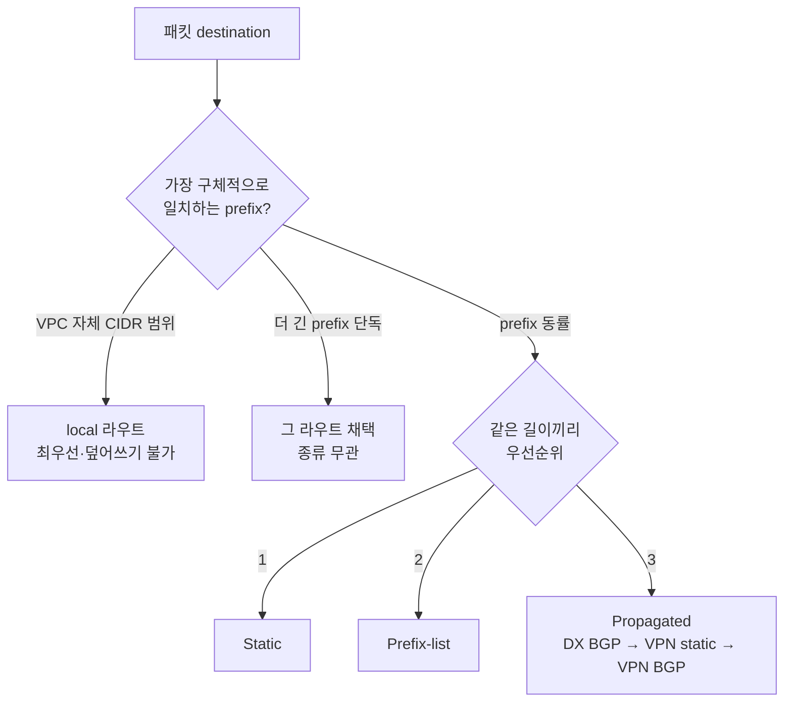

이 글은 [AWS VPC](https://docs.aws.amazon.com/vpc/latest/userguide/what-is-amazon-vpc.html) 공식 문서를 읽고 정리한 노트입니다. CIDR 표기법의 산술 기초(prefix 길이와 호스트 수 계산, 서브넷 분할)는 따로 다루지 않고, 그 위에 얹히는 **AWS 고유의 VPC 동작·한도·예약 규칙**에 집중합니다. VPC 자체의 범위와 CIDR 제약, 서브넷의 예약 IP, 라우트 테이블의 우선순위 결정 방식을 공식 수치와 예제 표 중심으로 옮겼습니다. 엣지·NAT(IGW·NAT Gateway·Elastic IP·ENI)는 [2편](/posts/aws-vpc-2/)에서 다룹니다.

> [!NOTE] 사전지식
> CIDR 표기법(`/24`가 256개 주소라는 식의 prefix-호스트 수 관계, 서브넷 분할 계산)은 안다고 가정합니다. 이 글은 그 산술 자체를 다시 유도하지 않고 AWS가 그 위에 정의한 규칙만 정리합니다.

## VPC 기초

### VPC의 정의와 범위

VPC(Virtual Private Cloud)는 AWS 계정 전용의 논리적으로 격리된 가상 네트워크입니다. 온프레미스 네트워크에 대응하는 AWS 네이티브 구성요소이되 소프트웨어로 정의된다는 점이 다릅니다.

- **리전 범위(Region-scoped).** VPC는 **한 AWS 리전 안의 모든 가용 영역(Availability Zone, AZ)에 걸칩니다.** 리전을 넘지는 못합니다. 리전을 넘어 VPC를 연결하려면 inter-Region VPC peering, Transit Gateway peering 같은 별도 수단이 필요합니다.
- VPC는 **최소 하나의 IPv4 CIDR 블록을 반드시** 가집니다. IPv6는 선택이며 가산(dual-stack)입니다.
- VPC에 띄우는 리소스(EC2 인스턴스, RDS, ELB, VPC 내 Lambda 등)는 VPC 서브넷의 사설 IP 주소를 받습니다.

### 리전당 VPC 개수 — soft limit

- **기본 할당량은 리전당 VPC 5개**이며 Service Quotas로 조정합니다.
- 이 값은 *soft* limit이라 "리전당 수백 개"까지 올릴 수 있습니다.
- **연동되는 한도:** "리전당 VPC" 할당량을 올리면 "리전당 인터넷 게이트웨이" 할당량도 같은 양만큼 올라갑니다(둘 다 기본 5개). VPC 하나에는 인터넷 게이트웨이를 최대 하나만 붙일 수 있어서 두 값이 함께 움직입니다.

### VPC의 IPv4 CIDR 크기

- 허용되는 VPC IPv4 CIDR 크기는 **`/16`(주소 65,536개)부터 `/28`(주소 16개)까지**이며 양 끝을 포함합니다.
- AWS는 **[RFC 1918](https://datatracker.ietf.org/doc/html/rfc1918) 사설 대역**에서 고르기를 권장합니다.

  | RFC 1918 대역 | Prefix | VPC CIDR 예시 |
  |---|---|---|
  | 10.0.0.0 – 10.255.255.255 | 10/8 | `10.0.0.0/16` |
  | 172.16.0.0 – 172.31.255.255 | 172.16/12 | `172.31.0.0/16` |
  | 192.168.0.0 – 192.168.255.255 | 192.168/16 | `192.168.0.0/20` |

- **금지 CIDR 블록**(어떤 VPC에도 쓸 수 없음):
  - `0.0.0.0/8`
  - `127.0.0.0/8` (호스트 내부 loopback 대역)
  - `169.254.0.0/16` (link-local 대역, RFC 5735 예약)
  - `224.0.0.0/4` (multicast 대역)
- **공인 라우팅 가능 CIDR도 허용됩니다.** RFC 1918이 아닌 공인 라우팅 가능 CIDR로 VPC를 만들 수 있습니다. 다만 AWS는 VPC 안의 모든 주소를 "사설"로 취급하며, 그 의미는 **AWS가 서브넷의 IPv4 대역을 인터넷에 광고하지 않는다**는 것입니다. 공인 라우팅 가능 CIDR이라도 명시적 게이트웨이(IGW, VGW, Site-to-Site VPN, Direct Connect) 없이는 **VPC의 CIDR에서 인터넷으로 직접 나가지 못합니다.**
- **충돌 주의:** 일부 AWS 서비스는 내부적으로 `172.17.0.0/16`을 씁니다(예: AWS Cloud9, Amazon SageMaker AI가 이 대역에서 [Docker bridge](https://docs.docker.com/engine/network/drivers/bridge/)를 사용). IP 충돌을 피하려면 VPC에 `172.17.0.0/16`을 쓰지 않습니다.
- **정규 형식(canonical form):** CLI/API로 `100.68.0.18/18`처럼 호스트 비트가 지저분한 CIDR을 넣으면 AWS가 정규 형식 `100.68.0.0/18`로 다시 씁니다.

### 기본 CIDR은 바꿀 수 없다

- **기본(primary) IPv4 CIDR 블록은 불변입니다.** VPC를 처음 만들 때 쓴 CIDR은 연결 해제할 수 없습니다.
- 기존 CIDR 블록의 **크기 조정도 불가능합니다.** 공식 문서 표현으로 "기존 CIDR 블록의 크기를 늘리거나 줄일 수 없다"입니다. 제자리에서 다시 마스킹하는 방법은 없고, 새 블록을 추가하거나 재구축해야 합니다.
- CLI로 기본 CIDR을 찾으려면 [`aws ec2 describe-vpcs`](https://docs.aws.amazon.com/cli/latest/reference/ec2/describe-vpcs.html)의 최상위 `CidrBlock` 요소로 반환됩니다(모든 연결을 나열하는 `CidrBlockAssociationSet`과는 별개입니다).

### Secondary IPv4 CIDR 블록

기존 VPC에 **추가(secondary) IPv4 CIDR 블록**을 연결할 수 있습니다.

- **할당량은 VPC당 IPv4 CIDR 블록 기본 5개**이며 **50개**까지 조정합니다. 기본 블록과 모든 secondary 블록이 이 할당량에 합산됩니다.
- CIDR 블록을 연결하면 AWS가 VPC의 **모든 라우트 테이블에 `local` 라우트를 자동으로 추가**합니다(destination = 새 CIDR, target = `local`). 새 대역에 대한 VPC 내부 라우팅을 위해서입니다. `10.0.0.0/16` VPC에 secondary `10.2.0.0/16`을 추가한 뒤의 main 라우트 테이블 예시입니다.

  | Destination | Target |
  |---|---|
  | `10.0.0.0/16` | `local` |
  | `10.2.0.0/16` | `local` |

- **secondary CIDR 추가 규칙:**
  1. 허용 크기는 여전히 `/28`부터 `/16`까지입니다.
  2. 블록은 VPC에 이미 연결된 **어떤 CIDR과도 겹치면 안 됩니다.**
  3. 블록은 VPC의 라우트 테이블에 있는 **기존 라우트의 destination CIDR과 같거나 그보다 커서는 안 됩니다.** 예를 들어 라우트 테이블에 `10.0.0.0/24 → vgw-...` 라우트가 있으면 `10.0.0.0/24`나 그보다 큰 블록(예: `10.0.0.0/16`)은 **연결할 수 없고**, `10.0.0.0/25`나 그보다 작은 블록은 *연결할 수 있습니다.*
  4. VPC당 CIDR 블록 또는 라우트 테이블당 라우트 할당량을 넘으면 안 됩니다.
- **연결 상태 머신:** CIDR 연결은 `associating → associated → disassociating → disassociated`를 거치며, 오류 시 `failing` / `failed`로 갑니다. `associated` 상태에서만 사용할 수 있습니다.

  ```mermaid
  stateDiagram-v2
      [*] --> associating: CIDR 연결 요청
      associating --> associated: 성공
      associating --> failing: 검증 실패
      failing --> failed
      associated --> disassociating: 연결 해제 요청
      disassociating --> disassociated
      note right of associated
          이 상태에서만 사용 가능
      end note
  ```

#### secondary CIDR 연결 제한 (cross-account/cross-VPC 기능)

일부 AWS 서비스는 충돌 없는 CIDR을 요구하는 cross-VPC / cross-account 기능을 쓰기 때문에, AWS는 *기존* 대역을 기준으로 추가 가능한 secondary 대역을 제한합니다. AWS 표의 핵심 제한입니다.

- **기존 대역이 `10.0.0.0/8`에 있으면:** *다른* RFC 1918 대역(`172.16.0.0/12`, `192.168.0.0/16`)이나 `198.19.0.0/16`에서는 CIDR을 추가할 수 없습니다. 또한 연결된 CIDR이 `10.0.0.0/15`(10.0.0.0–10.1.255.255)에 있으면 `10.0.0.0/16`에서는 추가할 수 없습니다. 다른 `10.0.0.0/8` 대역(제한 없음), 공인 라우팅 가능한 비-RFC-1918 `/16`–`/28`, `100.64.0.0/10`의 `/16`–`/28`은 *추가할 수 있습니다.*
- **기존 대역이 `172.16.0.0/12`에 있으면:** 다른 RFC 1918 대역, `172.31.0.0/16`, `198.19.0.0/16`에서는 추가할 수 없습니다.
- **기존 대역이 `192.168.0.0/16`에 있으면:** 다른 RFC 1918 대역이나 `198.19.0.0/16`은 추가할 수 없습니다.
- **기존 대역이 `198.19.0.0/16`이면:** RFC 1918 대역은 추가할 수 없습니다(공인 라우팅 가능 또는 `100.64.0.0/10`만 가능).
- **기존 대역이 공인 라우팅 가능 / `100.64.0.0/10`이면:** RFC 1918이나 `198.19.0.0/16`은 추가할 수 없습니다. RFC 1918과 공인 CIDR을 섞으려면 **VPC 생성 시 RFC 1918 CIDR을 먼저** 넣은 다음 비-RFC-1918 CIDR을 추가해야 합니다.
- `169.254.0.0/16`(link-local)은 어떤 VPC에도 영원히 할당할 수 없습니다.

> [!WARNING] RFC 1918 패밀리 혼용
> 한 VPC 안에서 세 RFC 1918 패밀리(10/8·172.16/12·192.168/16)를 자유롭게 섞을 계획을 세우지 않습니다. 한 패밀리를 골라 secondary 블록도 그 안에서 유지합니다.

#### secondary CIDR과 VPC peering의 상호작용

- peering 연결이 **active**면, peer의 CIDR과 겹치지 않는 한 CIDR을 추가할 수 있습니다.
- peering이 **pending-acceptance**면, **요청자(requester)** 측은 *어떤* CIDR도 추가할 수 없습니다(먼저 요청을 수락하거나 삭제 후 재생성해야 합니다). **수락자(accepter)** 측은 CIDR을 추가할 수 있지만 새 블록이 요청자의 CIDR과 겹치면 보류 중인 요청이 실패하고 수락할 수 없게 됩니다.
- **Direct Connect gateway:** 같은 Direct Connect gateway에 연결된 VPC들은 CIDR이 겹치면 안 됩니다. 겹치는 secondary CIDR을 추가하면 이 조건이 깨집니다.

### IPv6와 dual-stack

VPC는 **dual-stack**(IPv4 + IPv6 동시)일 수 있습니다. IPv4는 필수이고 IPv6는 옵트인·가산입니다. AWS는 *VPC* 레벨에서는 IPv6-only를 지원하지 않습니다 — 모든 VPC는 IPv4 CIDR을 가집니다. 다만 개별 *서브넷*은 IPv6-only일 수 있습니다.

- **Amazon 제공 IPv6 CIDR:** Amazon의 IPv6 주소 풀에서 나온 고정 **`/56`**입니다.
  - **대역을 고를 수 없습니다** — AWS가 할당합니다(예: `2001:db8:1234:1a00::/56`).
  - `/56`은 2^72개 주소만큼의 서브넷 공간입니다.
  - Amazon 제공 IPv6 `/56`을 연결 해제했다가 나중에 다시 연결하면 **같은 prefix를 돌려받는다고 기대하면 안 됩니다.**
- **IPAM 또는 BYOIP 제공 IPv6 CIDR:** **`/44`부터 `/60`까지 `/4` 증분**(즉 `/44`, `/48`, `/52`, `/56`, `/60`)으로 **최대 5개의 IPv6 CIDR 블록**을 연결할 수 있습니다.
  - **할당량은 VPC당 IPv6 CIDR 블록 5개**이며 50개까지 조정합니다.
- **공인 IPv6 vs 사설 IPv6(AWS 정의):**
  - *공인(Public) IPv6*: 전역 고유하며 AWS가 **항상 인터넷에 광고**합니다. 라우팅/보안 그룹/NACL 제어로 도달합니다. Amazon 풀, IPAM 풀, BYOIP에서 나옵니다.
  - *사설(Private) IPv6*: AWS가 **인터넷에 광고하지 않습니다.** **IPAM을 통해서만** 사용할 수 있습니다. 두 종류가 있습니다.
    - **ULA**([RFC 4193](https://datatracker.ietf.org/doc/html/rfc4193)) — `fc`/`fd`로 시작하며, 유효한 ULA 공간은 Amazon이 예약한 `fd00::/16`을 제외한 `fd00::/8` 아래입니다. 유효한 사설 ULA 대역은 `fd80::/9`에서 시작하는 **`/9`부터 `/60`까지**입니다.
    - **GUA**([RFC 3587](https://datatracker.ietf.org/doc/html/rfc3587)) — 기본 비활성이라 켜야 하며, 본인이 소유한 GUA 공간이어야 합니다.
  - 사설 IPv6는 **인터넷 게이트웨이 엣지에서 드롭됩니다** — IGW나 egress-only IGW가 있어도 AWS는 사설 IPv6 대역에서의 직접 egress를 허용하지 않습니다.
  - 사설 IPv6 주소에는 **요금이 없습니다.**

### dual-stack이 중요한 이유 — IPv6에는 NAT가 없다

IPv6 주소는 전역 고유하므로 AWS에는 IPv6 NAT가 없습니다. 아웃바운드 전용 IPv6 인터넷 접속은 NAT가 아니라 **egress-only internet gateway**(NAT gateway의 IPv6 대응물)를 씁니다. 게이트웨이의 상세 동작은 CIDR·라우트 중심인 이 글의 범위를 벗어나며, 여기서는 완결성을 위해 짚어 둡니다.

## 서브넷 유형과 규칙

### 서브넷의 범위 — 서브넷 하나 = AZ 하나

- **서브넷은 항상 정확히 하나의 가용 영역에 존재합니다.** 서브넷은 AZ를 넘지 못합니다.
- VPC는 리전의 모든 AZ에 걸치므로, 멀티-AZ HA를 위해서는 AZ별로 서브넷을 나눕니다.
- **할당량은 VPC당 서브넷 200개**이며 조정 가능합니다. AWS의 주의: 서브넷 할당량을 올리면 VPC당 라우트 테이블 할당량도 올려야 할 수 있습니다. 서브넷은 정확히 하나의 라우트 테이블에 연결되기 때문입니다.

### 서브넷 IPv4 크기

- 허용되는 서브넷 IPv4 CIDR 크기는 **`/28`(주소 16개)부터 `/16`(주소 65,536개)까지**이며 양 끝을 포함합니다 — VPC 자체와 같은 범위입니다.
- 서브넷의 CIDR은 VPC CIDR과 같을 수도(단일 서브넷) 부분집합일 수도(여러 서브넷) 있습니다. **VPC 안의 서브넷 CIDR끼리는 겹치면 안 됩니다.**
- `10.0.0.0/24` VPC를 두 개의 `/25` 서브넷으로 나눈 예시입니다.
  - `10.0.0.0/25` → 주소 `10.0.0.0`–`10.0.0.127`
  - `10.0.0.128/25` → 주소 `10.0.0.128`–`10.0.0.255`

### 서브넷당 예약 IP 5개 (핵심)

**모든 서브넷 CIDR의 처음 네 개 IP 주소와 마지막 IP 주소는 AWS가 예약**하며 어떤 리소스(EC2 인스턴스, ENI 등)에도 할당할 수 없습니다. `10.0.0.0/24` 서브넷의 예약 주소와 AWS가 밝힌 각각의 용도입니다.

| 주소 | AWS의 예약 사유 |
|---|---|
| `10.0.0.0` | **네트워크 주소.** 서브넷의 기준 주소(네트워크 자체를 식별). |
| `10.0.0.1` | **VPC 라우터용으로 AWS가 예약.** 서브넷의 암묵적 라우터 / 기본 게이트웨이. |
| `10.0.0.2` | **DNS 서버용으로 AWS가 예약.** "DNS 서버의 IP 주소는 VPC 네트워크 범위의 기준 + 2"입니다. 멀티-CIDR VPC에서는 *DNS 서버*가 **기본 CIDR의 `.2`**에 있지만, AWS는 VPC의 모든 CIDR 블록에 걸쳐 **모든 서브넷 범위의 기준 + 2도 예약**합니다(Route 53 Resolver). |
| `10.0.0.3` | **미래 사용을 위해 AWS가 예약.** |
| `10.0.0.255` | **네트워크 브로드캐스트 주소.** "VPC에서는 브로드캐스트를 지원하지 않으므로 이 주소를 예약한다." VPC에는 L2 브로드캐스트 도메인이 없습니다. |

귀결:

- `/24` 서브넷(256개 주소)은 254개가 아니라 **251개를 사용**할 수 있습니다(일반 브로드캐스트 네트워크가 2개를 예약하는 데 비해 AWS는 5개를 예약하기 때문).
- 가장 작은 실용 서브넷 **`/28`**(16개 주소)은 **11개만 사용** 가능합니다.
- **BYOIP 예외:** BYOIP로 IPv4 대역을 AWS에 가져오면 첫(네트워크)·마지막(브로드캐스트) 주소를 포함해 모든 주소를 쓸 수 있습니다 — 예약 5개 규칙은 AWS가 할당한 대역에 대한 것입니다.

### IPv6 서브넷 크기와 예약

- IPv6 서브넷 netmask 길이는 **`/44`부터 `/64`까지 `/4` 증분**입니다. 표준적이고 흔한 dual-stack 서브넷은 **`/64`**입니다.
- **각 서브넷 CIDR의 처음 네 개와 마지막 IPv6 주소도 예약됩니다.** `2001:db8:1234:1a00::/64` 서브넷의 경우:
  - `2001:db8:1234:1a00::` (기준)
  - `2001:db8:1234:1a00::1` — **VPC 라우터용으로 AWS가 예약**
  - `2001:db8:1234:1a00::2`
  - `2001:db8:1234:1a00::3`
  - `2001:db8:1234:1a00:ffff:ffff:ffff:ffff` (마지막)
- IPv6 **기본 VPC 라우터**는 추가로 link-local 주소에서도 도달할 수 있습니다 — `FE80::/10` EUI-64 생성 주소와 `FE80:ec2::1`입니다.

### Public vs Private vs Isolated 서브넷 (라우팅상의 구분)

"Public", "private", "isolated"는 **서브넷 속성이 아닙니다** — **서브넷의 라우트 테이블이 전적으로 정의하는** 관례입니다.

| 서브넷 유형 | 정의 라우트 | 인터넷 도달성 |
|---|---|---|
| **Public** | `0.0.0.0/0 → internet gateway(IGW)` 라우트 보유 | 양방향 인터넷(공인 IP / EIP가 있을 때). |
| **Private** | `0.0.0.0/0 → NAT gateway`(또는 NAT 인스턴스) 라우트 보유 | 인터넷으로 아웃바운드 전용. 인바운드 개시 불가. |
| **Isolated** (= VPN-only / 완전 사설) | **인터넷 게이트웨이·NAT로 가는 라우트가 전혀 없음** | 인터넷 라우트 자체가 없음. `local` + 선택적 VGW/TGW/peering/VPC-endpoint 라우트만. |

- 서브넷이 "public"인 것은 *오직* 연결된 라우트 테이블이 **인터넷 게이트웨이**로 가는 경로를 가질 때입니다. 인스턴스에 auto-assign된 공인 IPv4가 있어도 그 IGW 라우트가 없으면 아무 일도 하지 못합니다.
- "private" 서브넷은 *public* 서브넷 안에 있는 **NAT gateway**를 통해 아웃바운드로 인터넷에 닿습니다.
- "isolated"/VPN-only 서브넷은 둘 다 없습니다. 그래도 **gateway/interface VPC endpoint**로 AWS 서비스에 사설로 닿고 VGW/TGW로 온프레미스에 닿을 수 있습니다 — 모두 인터넷 없이.
- auto-assign-public-IPv4 동작은 **서브넷 속성**입니다(커스텀 서브넷은 기본 OFF, 기본 VPC 서브넷은 ON). 인스턴스 시작 시 재정의할 수 있습니다. 이 속성은 public/private 라우팅 구분과는 직교하지만 보통 함께 쓰입니다.

## 라우트 테이블

### 핵심 개념과 용어

**라우트 테이블(route table)**은 서브넷(또는 게이트웨이)에서 나가는 네트워크 트래픽이 어디로 가는지 결정하는 규칙들(**라우트routes**)의 집합입니다. AWS가 정의한 개념들입니다.

- **Main route table** — VPC와 함께 **자동으로 생기는** 라우트 테이블. **다른 테이블에 명시적으로 연결되지 않은 모든 서브넷**의 라우팅을 제어합니다. 모든 VPC에는 main 라우트 테이블이 정확히 하나 있습니다.
- **Custom route table** — 직접 만든 라우트 테이블.
- **Subnet route table** — 서브넷에 연결된 라우트 테이블.
- **Destination** — 트래픽의 대상 CIDR 범위(예: `172.16.0.0/12`, "전부"를 뜻하는 `0.0.0.0/0`).
- **Target** — 트래픽을 보내는 게이트웨이 / 네트워크 인터페이스 / 연결(예: internet gateway, NAT gateway, ENI, peering connection, transit gateway, VPC endpoint).
- **Local route** — VPC 내부 통신을 위한 항상 존재하는 기본 라우트.
- **Route table association** — 라우트 테이블과 서브넷, 인터넷 게이트웨이, virtual private gateway 사이의 바인딩.
- **Propagation** — 연결된 virtual private gateway에서 VPN/Direct-Connect 라우트(또는 Transit Gateway 경유 라우트)를 라우트 테이블에 자동 삽입하는 것.
- **Gateway route table** — **internet gateway** 또는 **virtual private gateway**에 연결된 라우트 테이블(edge association / ingress routing에 사용).
- **Edge association** — gateway 라우트 테이블로 *인바운드* VPC 트래픽을 서브넷 도달 전에 어플라이언스(예: 방화벽 ENI)로 라우팅하는 것.
- **Transit gateway route table** — Transit Gateway에 연결된 라우트 테이블.
- **Local gateway route table** — **AWS Outposts** local gateway에 연결된 라우트 테이블.

### local 라우트 — 항상 존재하며 삭제 불가

- 모든 라우트 테이블에는 target이 `local`인 **`local` 라우트**가 있습니다. VPC의 모든 CIDR 블록에 걸쳐 **VPC 내부** 통신을 가능하게 합니다.
- 자동으로 생성되며 **삭제할 수 없습니다.** VPC에 CIDR 블록을 추가하면 AWS가 모든 라우트 테이블에 대응하는 `local` 라우트를 자동으로 추가합니다.
- **Dual-stack:** VPC가 IPv4와 IPv6를 모두 가지면 **IPv4용과 IPv6용 local 라우트가 따로** 있습니다.
- local 라우트는 모든 라우트 중 **우선순위가 가장 높습니다** — VPC 자체 대역에 대해서는 더 구체적인 propagated 라우트로도 덮어쓸 수 없습니다. (고급 구성에서는 검사용 어플라이언스로 local 라우트의 target을 교체·축소할 수 있지만, local 연결이라는 개념 자체를 없앨 수는 없습니다.)

### Longest-prefix match — 가장 구체적인 라우트가 이긴다

- AWS는 **가장 구체적으로 일치하는 라우트** = **longest prefix match**로 트래픽을 라우팅합니다. 예: `10.10.2.15/32`가 `10.10.2.0/24`를 이깁니다.
- IPv4와 IPv6 라우팅은 **독립적**입니다 — 가장 구체적인 IPv4 라우트가 IPv4 트래픽을, 가장 구체적인 IPv6 라우트가 IPv6 트래픽을 따로 처리합니다.
- 풀어 본 예시(서브넷 라우트 테이블)입니다.

  | Destination | Target |
  |---|---|
  | `10.0.0.0/16` | `local` |
  | `172.31.0.0/16` | `pcx-11223344556677889` (peering) |
  | `0.0.0.0/0` | `igw-12345678901234567` |

  - `172.31.x.x`로 가는 트래픽 → peering 연결(IGW 기본보다 구체적).
  - `10.0.x.x`로 가는 트래픽 → `local`(VPC 자체 대역).
  - 그 외 모든 트래픽 → internet gateway.

### 라우트 우선순위 / 평가 순서

destination이 **겹치거나 동률**일 때 AWS는 다음 우선순위(높은 것 먼저)를 적용합니다.

1. **Longest prefix**(가장 구체적인 라우트가 항상 먼저 이김 — 예: `/24`보다 `/32`). 경쟁 라우트가 static이든 propagated든 prefix-list든 무관합니다. VPC 자체 CIDR 범위에 대해서는 **`local` 라우트가 가장 선호**되며, 더 구체적인 propagated 라우트로도 local 라우트를 덮어쓸 수 없습니다.
2. **Static 라우트**(수동 추가) — internet gateway, NAT gateway, network interface, instance ID, gateway VPC endpoint, transit gateway, VPC peering connection, Gateway Load Balancer endpoint 같은 target.
3. **Prefix-list 라우트**(관리형 prefix list를 참조하는 라우트).
4. **Propagated 라우트**, 하위 순서:
   1. Direct Connect BGP 라우트(동적)
   2. VPN static 라우트
   3. VPN BGP 라우트(동적) — 예: virtual private gateway에서 옴

이 평가를 흐름으로 보면 다음과 같습니다. 한 패킷의 destination에 대해 위에서 아래로 내려가며 가장 먼저 확정되는 라우트가 이깁니다.



동률 처리와 특수 규칙:

- 같은 destination에서는 **static이 propagated를 이깁니다.** 예: 라우트 테이블에 `172.31.0.0/24 → vgw-... (propagated)`와 `172.31.0.0/24 → igw-... (static)`이 모두 있으면 `172.31.0.0/24` 트래픽 전부를 **internet gateway**로 보냅니다(static 승).
- **Prefix-list vs propagated:** prefix list를 참조하는 라우트가 일치하는 propagated 라우트를 이깁니다. 단 **더 구체적인 라우트는 종류와 무관하게 항상 이깁니다.**
- **서로 다른 target으로 가는 겹치는 prefix list:** AWS가 **무작위로** 승자를 고르며, 이후로는 같은 라우트가 일관되게 이깁니다.

### 라우트 propagation (VGW / TGW)

- **Virtual private gateway(VGW)**를 VPC에 붙이고 서브넷 라우트 테이블에서 **route propagation을 켜면**, AWS가 **Site-to-Site VPN 라우트**를 그 테이블에 **propagated** 라우트로 **자동 추가**합니다 — 수동 추가/제거가 필요 없습니다.
- **할당량은 라우트 테이블당 propagated 라우트 100개이며 조정 불가입니다.** 더 많은 prefix가 필요하면 대신 기본 라우트(default route)를 광고합니다.
- Transit gateway는 자체 **transit gateway route table**을 가지며, 연결된 VPC·VPN 연결·Direct Connect gateway에서 라우트를 propagate하고 static 라우트도 둘 수 있습니다.

### 서브넷 연결 규칙

- **서브넷 하나 ↔ 라우트 테이블 정확히 하나**(동시점 기준). 서브넷은 두 라우트 테이블에 동시에 연결될 수 없습니다.
- **라우트 테이블 하나 ↔ 다수 서브넷.** 라우트 테이블 하나를 여러 서브넷이 공유할 수 있습니다.
- **암묵적 vs 명시적 연결:** 라우트 테이블에 *명시적으로* 연결하지 않은 서브넷은 **main 라우트 테이블에 암묵적으로 연결**됩니다. 커스텀 테이블에 명시적으로 연결하면 암묵적 main-테이블 연결을 덮어씁니다.
- **할당량은 VPC당 라우트 테이블 200개**입니다(조정 가능, main 라우트 테이블도 합산).

### Gateway route table (edge association / ingress routing)

- 라우트 테이블을 **internet gateway** 또는 **virtual private gateway**에 연결할 수 있습니다 — 이것이 **edge association**이며 **ingress routing**에 씁니다.
- 목적: VPC로 들어오는 **인바운드** 트래픽(IGW 경유 인터넷에서, 또는 VGW 경유 온프레미스에서)을 목적지 서브넷에 닿기 *전에* **미들박스 어플라이언스**(예: 방화벽/IDS ENI)로 라우팅합니다. VPC로 향하는 트래픽의 target은 어플라이언스의 네트워크 인터페이스입니다.
- 이로써 VPC 엣지에서 north-south 트래픽에 검사를 강제합니다.

### Main vs custom 라우트 테이블 전략

- **Main 라우트 테이블**은 catch-all입니다. 흔한 베스트 프랙티스는 main 라우트 테이블을 **최소·잠금 상태**로 유지하고(예: local만, "기본적으로 private"), public 서브넷에는 IGW 라우트를 가진 **명시적 커스텀 라우트 테이블**을 쓰는 것입니다 — 그러면 새로 만든 서브넷은 public 테이블에 명시적으로 연결하지 않는 한 기본적으로 private입니다.

## 암묵적 라우터 / VPC 라우터

- 모든 VPC에는 **암묵적 라우터**("VPC 라우터"라고도 함)가 있습니다. 라우트 테이블에 따라 서브넷 간·게이트웨이 간 라우팅을 모두 수행하는 개념적 장치입니다. 관리할 인스턴스는 없으며 SDN 패브릭의 일부입니다.
- VPC 라우터는 **모든 서브넷의 `.1` 주소**(각 서브넷 CIDR의 두 번째 IP)를 그 서브넷의 인터페이스 / 기본 게이트웨이로 차지합니다. 그래서 `.1`이 예약 주소 5개 중 하나입니다.
- IPv6 VPC 라우터는 서브넷의 `::1`과 함께 link-local 주소 `FE80:ec2::1`, `FE80::/10` EUI-64 주소를 씁니다.
- 라우트 테이블은 라우터에 "속한다"기보다 서브넷별로(edge association이면 게이트웨이별로) **암묵적 라우터의 동작을 프로그래밍**합니다.

## 기본 VPC vs 커스텀 VPC

### 기본 VPC 구성요소 (리전마다 자동 생성)

Amazon VPC를 처음 쓰기 시작하면 AWS가 **리전마다 기본 VPC**를 프로비저닝해 바로 인스턴스를 띄울 수 있게 합니다. AWS가 다음을 설정합니다.

- **`/16` IPv4 CIDR = `172.31.0.0/16`**인 VPC(사설 IPv4 주소 최대 65,536개).
- **각 가용 영역에 `/20` 기본 서브넷**(서브넷당 주소 최대 4,096개에서 예약 5개를 뺀 수). AZ당 서브넷 하나.
- VPC에 붙은 **internet gateway**.
- **main 라우트 테이블**의 **`0.0.0.0/0` → internet gateway** 라우트(그래서 모든 기본 서브넷이 *public*). 기본 VPC의 main 라우트 테이블:

  | Destination | Target |
  |---|---|
  | `172.31.0.0/16` | `local` |
  | `0.0.0.0/0` | `igw-...` |

- VPC에 연결된 **기본 보안 그룹**.
- VPC에 연결된 **기본 network ACL**.
- 계정의 **기본 DHCP options set**이 VPC에 연결됨.
- **DNS resolution 활성** — 기본 VPC에서는 `enableDnsHostnames`가 `true`이고(커스텀 VPC는 기본 `false`), `enableDnsSupport`도 `true`입니다.
- 기본 서브넷은 **auto-assign public IPv4 = ON**이라 거기 띄운 인스턴스는 기본으로 공인 IP를 받습니다.
- 기본 VPC에 IPv6 CIDR을 선택적으로 연결할 수 있습니다.

> [!NOTE] IAM 주의
> AWS가 기본 VPC 리소스를 *사용자 대신* 만들기 때문에, 예를 들어 `CreateInternetGateway`를 거부하는 IAM 정책으로도 `CreateDefaultVpc`가 IGW를 만드는 것은 막지 못합니다. 막으려면 `CreateDefaultVpc`와 `CreateInternetGateway`를 모두 거부해야 합니다.

### 기본 vs 커스텀 — 핵심 차이

| 항목 | 기본 VPC | 커스텀(nondefault) VPC |
|---|---|---|
| CIDR | 고정 `172.31.0.0/16` | 직접 선택(`/16`–`/28`) |
| 서브넷 | AZ마다 `/20` public 서브넷 자동 생성 | 만들기 전까지 없음 |
| Internet gateway | 사전 연결 + `0.0.0.0/0` 라우트 | 추가하기 전까지 없음 |
| 서브넷 기본값 | **Public**(auto public IPv4 ON) | **Private**(auto public IPv4 OFF) |
| `enableDnsHostnames` | `true` | `false`(기본) |
| 프로비저닝 주체 | AWS, 자동 | 사용자 |

- 기본 VPC도 다른 VPC처럼 완전히 편집할 수 있습니다 — nondefault 서브넷 추가, main 라우트 테이블 수정, 라우트 테이블 추가, CIDR 블록 추가, Site-to-Site VPN 연결 등.

## IP 주소 지정 상세

### Primary vs secondary 사설 IPv4

- 인스턴스를 시작하면 **기본 네트워크 인터페이스(eth0)**가 서브넷 범위에서 **기본(primary) 사설 IPv4**를 받습니다. 직접 지정하거나 AWS가 가용한 것을 고릅니다.
- **기본 사설 IP는 다른 인터페이스로 재할당할 수 없고** 인스턴스 수명 동안 그 인스턴스에 머뭅니다(종료 시 해제).
- 인터페이스에 **secondary 사설 IPv4 주소**를 추가할 수 있습니다. 기본과 달리 **secondary 사설 IP는 한 ENI에서 다른 ENI로 옮길 수 있습니다.** 사설 IP는 stop/start를 거쳐도 유지되고 종료 시 해제됩니다.
- 각 인스턴스는 자신의 사설 IP로 해석되는 내부 **사설 DNS 호스트네임**도 받습니다(리소스 기반 `RBN` 또는 IP 기반 네이밍).

### `.1` / `.2` / `.3`이 예약된 이유 (정리)

- `.0` — 네트워크 주소(서브넷 식별).
- `.1` — 서브넷의 **VPC 라우터** 인터페이스 / 기본 게이트웨이.
- `.2` — **Amazon DNS 서버**(Route 53 Resolver). "VPC 네트워크 범위의 기준 + 2".
- `.3` — AWS가 **미래 사용**을 위해 예약.
- 마지막(`/24`의 `.255`) — 브로드캐스트 주소(VPC에서 브로드캐스트 미지원이라 예약).

### Amazon DNS 서버 / Route 53 Resolver

**Amazon DNS 서버**(=**Route 53 Resolver**, =`AmazonProvidedDNS`)는 리전의 **모든 가용 영역**에 내장되어 있습니다. 다음 주소로 도달합니다.

- **`169.254.169.253`**(IPv4 link-local) — 모든 서브넷에서, IPv6-only 서브넷을 포함해 동작합니다(DHCP option set의 name server가 `AmazonProvidedDNS`인 한).
- **`fd00:ec2::253`**(IPv6).
- **VPC 기본 IPv4 CIDR 기준 + 2** — 예: `10.0.0.0/16` VPC면 `10.0.0.2`. 그래서 모든 서브넷에서 `.2`가 예약됩니다(각 서브넷 기준 + 2가 모든 CIDR에 걸쳐 예약되지만, 실제 resolver는 기본 CIDR의 `.2`에 있습니다).
- 쿼리는 **link-local 주소**를 쓰며 resolver로 **사설로** 전달됩니다 — 네트워크에 보이지 않습니다.

DNS 동작과 규칙:

- 보안 그룹이나 network ACL로 Amazon DNS 서버를 오가는 트래픽을 **필터링할 수 없습니다.**
- Route 53 Resolver는 **recursive 쿼리만** 지원합니다.
- **`enableDnsSupport`**(기본 `true`): true면 Amazon DNS 서버로의 쿼리가 성공합니다(해석 동작).
- **`enableDnsHostnames`**(기본 `false`, 단 기본 VPC는 `true`): true면 VPC가 공인 IPv4/EIP를 가진 인스턴스에 **공인 DNS 호스트네임**을 부여합니다.
- 다음을 하려면 **둘 다 `true`**여야 합니다: public 인스턴스에 공인 DNS 호스트네임 부여, Amazon 제공 사설 DNS 호스트네임 해석, private hosted zone 사용, interface VPC endpoint(PrivateLink)와 private DNS 사용.
- 하나라도 `false`면: 공인 DNS 호스트네임 없음, Amazon 제공 사설 호스트네임 미해석(DHCP option set의 domain name server를 통한 커스텀 DNS로 폴백).

### DHCP 동작

- AWS는 시작 시 서브넷 범위에서 **기본 사설 IPv4를 DHCP로** 할당합니다.
- VPC는 `domain-name-servers`(기본 `AmazonProvidedDNS`), `domain-name`, 그리고 선택적으로 NTP/NetBIOS 설정을 지정하는 **DHCP options set**(기본 VPC에는 기본 set이 연결)을 씁니다.
- **Hadoop/EMR 주의:** 인스턴스가 자기 FQDN을 해석할 수 있어야 합니다. `domain-name-servers`를 커스텀 값으로 재정의하면 `<region>.compute.internal`에 대한 conditional forwarder를 Amazon DNS 서버로 추가합니다.

### 공인 IPv4, Elastic IP

- 서브넷 속성(**auto-assign public IPv4**)이 서브넷의 새 ENI가 **공인 IPv4**를 받을지 결정합니다. 이 공인 IP는 1:1 **NAT**로 기본 사설 IP에 매핑됩니다. 인스턴스 시작 시 재정의할 수 있습니다.
- auto-assign된 공인 IP는 **사용자 계정이 아니라 Amazon의 풀에서** 나옵니다. 해제되면 풀로 돌아가며 같은 것을 다시 받을 수 없습니다. AWS가 stop/start 시 바꿀 수 있습니다.
- 계정에 묶여 인스턴스 간 이동할 수 있는 **지속적인** 공인 IP가 필요하면 **Elastic IP(EIP)**를 씁니다.
- **비용 주의:** AWS는 실행 중 인스턴스의 것과 모든 Elastic IP를 포함해 **모든** 공인 IPv4 주소에 요금을 부과합니다.
- `enableDnsHostnames=true`면 공인 IP/EIP 인스턴스에 **공인 DNS 호스트네임**이 부여되며, 이는 VPC 외부에서는 공인 IP로, 내부에서는 사설 IP로 해석됩니다.

### DNS/link-local PPS 한도

link-local 주소(`.2`, `169.254.169.253`)의 서비스에는 **네트워크 인터페이스당 초당 1024 패킷(PPS)** 한도가 있습니다. 이 합산치는 Route 53 Resolver DNS 쿼리 **더하기** IMDS(인스턴스 메타데이터), Amazon Time Sync(NTP), Windows licensing 요청을 포함합니다.

> [!WARNING] 올릴 수 없는 1024 PPS 한도
> 이 한도는 상향이 불가능합니다. 한도에 닿으면 resolver가 트래픽을 거부하며, 간헐적 DNS 실패의 흔한 원인입니다.

## VPC 크기 산정 / 설계 베스트 프랙티스

### 겹치지 않는 CIDR (제1 규칙)

- **Peering, Transit Gateway, Direct Connect 모두 겹치지 않는 CIDR을 요구합니다.** VPC peering은 IPv4 CIDR이 겹치는 VPC 사이에서는 동작하지 않습니다. 같은 Direct Connect gateway의 VPC들은 겹치면 안 됩니다. TGW 라우트 테이블은 고유한 prefix가 필요합니다.
- 언젠가 연결할 수 있는 모든 VPC/계정/리전에 걸쳐 **전역적으로 겹치지 않는 주소 계획**을 미리 세웁니다. 사후에 비-겹침을 끼워 맞추려면 (기본 CIDR이 불변이라) 흔히 VPC를 재구축해야 합니다.

### 성장 여지를 남긴다

- 기본 CIDR은 불변이고 크기를 못 바꾸며, secondary CIDR은 제약이 있습니다(RFC-1918 패밀리 제한, 라우트-겹침 제한). 그러므로 **앞에서 넉넉히** 잡습니다 — VPC당 `/16`이 흔한 기본값이며, 초기에는 일부만 서브넷팅하더라도 여유를 남깁니다.
- 빡빡하게 채우기보다 미래의 서브넷/AZ를 위한 공간을 VPC 안에 비워 둡니다.

### AZ와 서브넷 계획

- **서브넷 1개 = AZ 1개**이므로, 각 계층(예: public/app/data)마다 **최소 2~3개 AZ에 대칭적인 서브넷 집합**을 계획해 워크로드를 멀티-AZ로 돌릴 수 있게 합니다.
- 크기를 잡을 때 **서브넷당 예약 주소 5개**를 감안합니다 — `/28`은 11개만 줍니다. 예약 + ENI 오버헤드로 모자라지 않도록 서브넷을 너무 빡빡하게 잡지 않습니다.
- 예측 가능한 용량을 위해 계층 서브넷을 AZ 간 **같은 크기**로 유지합니다.

### 설계 시 고려할 할당량 (기본값)

| 리소스 | 기본값 | 조정 가능 |
|---|---|---|
| 리전당 VPC | 5 | 예(수백 개까지) |
| VPC당 서브넷 | 200 | 예 |
| VPC당 IPv4 CIDR 블록 | 5 | 예(50개까지) |
| VPC당 IPv6 CIDR 블록 | 5 | 예(50개까지) |
| VPC당 라우트 테이블 | 200 | 예(main RT도 합산) |
| 라우트 테이블당 라우트(static) | 500 | 예(1,000개까지, 성능 영향) |
| 라우트 테이블당 propagated 라우트 | 100 | **불가** |
| 리전당 internet gateway | 5 | 예(VPC 할당량과 함께 증감) |
| AZ당 NAT gateway | 5 | 예 |
| 리전당 보안 그룹 | 2,500 | 예 |
| 보안 그룹당 규칙(인 또는 아웃) | 60 | 예(SG 규칙 × ENI당 SG ≤ 1,000) |
| 네트워크 인터페이스당 보안 그룹 | 5 | 예(16개까지) |
| VPC당 network ACL | 200 | 예 |
| network ACL당 규칙(인 또는 아웃) | 20 | 예(인 40 + 아웃 40까지) |
| 리전당 네트워크 인터페이스 | 5,000 | 예(AZ별로 강제) |
| 리전당 Elastic IP | 5 | 예 |

static 라우트 할당량은 **IPv4와 IPv6 라우트에 대해 따로** 강제되고, SG당 규칙 할당량은 인바운드/아웃바운드, IPv4/IPv6에 대해 따로 강제됩니다.

### 용량 계획을 위한 NAU(Network Address Usage)

- **NAU**는 VPC 크기를 계획·모니터링하는 데 쓰는 집계 지표입니다(IP 주소 + 네트워크 인터페이스 + 관리형 prefix list의 CIDR).
- **VPC당 기본 64,000 NAU 단위**(256,000까지 조정), **VPC와 그 인트라-리전 peered VPC를 합치면 128,000**(512,000까지)입니다. 크로스-리전 peer는 합산하지 않습니다.
- NAU 여유가 있어도 개별 리소스는 여전히 각자의 서비스 할당량에 묶입니다.

### 주소 계획을 위한 IPAM

- **[Amazon VPC IP Address Manager(IPAM)](https://docs.aws.amazon.com/vpc/latest/ipam/what-it-is-ipam.html)**는 비즈니스 규칙으로 계정·리전에 걸쳐 IP CIDR을 계획·할당·추적·모니터링하게 해 줍니다. 멀티-VPC/멀티-계정 조직에서 비-겹침을 강제하고 할당을 자동화하기 위해 권장됩니다. IPAM은 **사설 IPv6(ULA/GUA)**를 쓰는 유일한 방법이며, 연속된 공인 IPv4 블록에서 순차적 Elastic IP를 할당하는 유일한 방법이기도 합니다.

## CIDR 산술 — 포인터

이 글은 CIDR 기초(prefix 길이가 호스트 수로 어떻게 매핑되는지, `/24` = 256개 주소, 서브넷 분할 산술, `2^(32 - prefix)` 공식, 호스트/네트워크/브로드캐스트 비트 계산)를 다시 유도하지 않습니다. 그쪽은 [CIDR 표기법](https://docs.aws.amazon.com/vpc/latest/userguide/vpc-cidr-blocks.html)의 몫이고, 여기서는 AWS 고유 동작(예약 주소 5개, `/16`–`/28` 범위, 불변 기본 CIDR, secondary-CIDR 패밀리 제한)을 둡니다.

위에서 다시 진술한 AWS 고유 수치만 모으면 다음과 같습니다.

- VPC/서브넷 IPv4 CIDR 범위: `/16`(65,536) ~ `/28`(16).
- 서브넷당 예약 IP 5개 → 사용 가능 = `2^(32 - prefix) − 5`.
  - `/24` → 251개 사용 가능, `/28` → 11개, `/20` → 4,091개, `/16` → 65,531개.
- Amazon 제공 IPv6 = 고정 `/56`, IPv6 서브넷은 보통 `/64`, IPAM IPv6는 `/44`–`/60`.

## 참고 자료

- AWS, [Amazon VPC User Guide](https://docs.aws.amazon.com/vpc/latest/userguide/what-is-amazon-vpc.html) — VPC·서브넷·CIDR·IPv6·DNS·기본 VPC·할당량까지 본문 대부분의 근거
- AWS, [How route tables determine routing priority](https://docs.aws.amazon.com/vpc/latest/userguide/route-tables-priority.html) — 라우트 우선순위(longest-prefix·local·static·prefix-list·propagated)
- AWS, [What is IPAM?](https://docs.aws.amazon.com/vpc/latest/ipam/what-it-is-ipam.html) — 사설 IPv6(ULA/GUA)·멀티 계정 주소 계획
- IETF, [RFC 1918 — Address Allocation for Private Internets](https://datatracker.ietf.org/doc/html/rfc1918)
