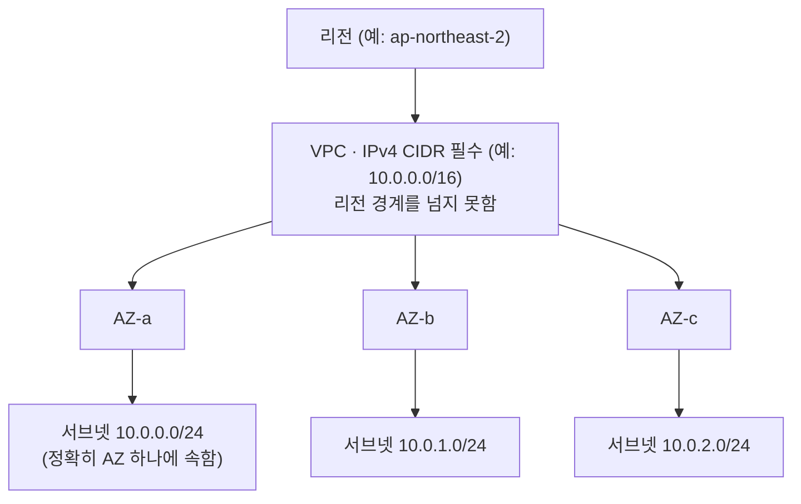
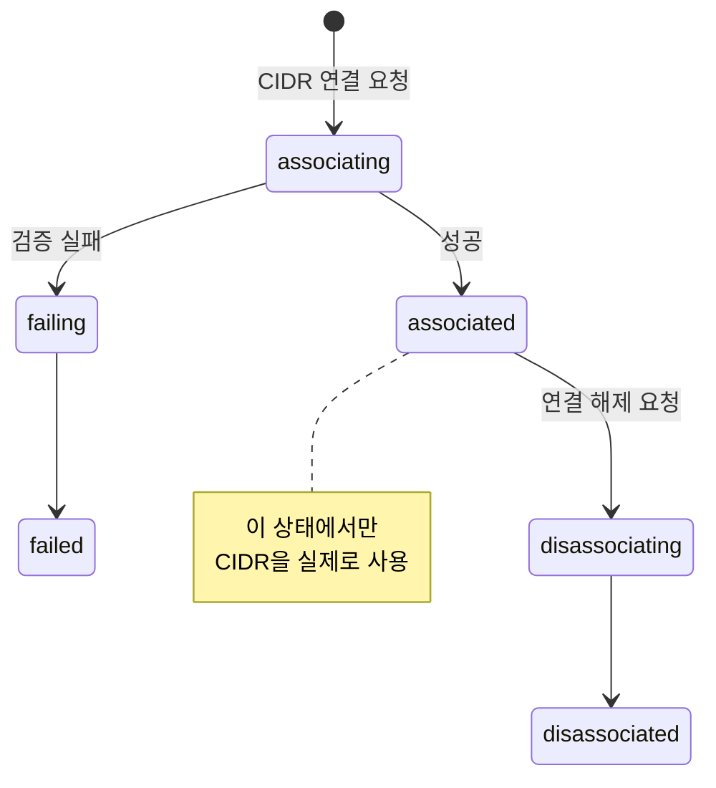
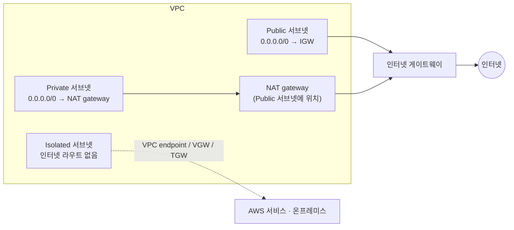
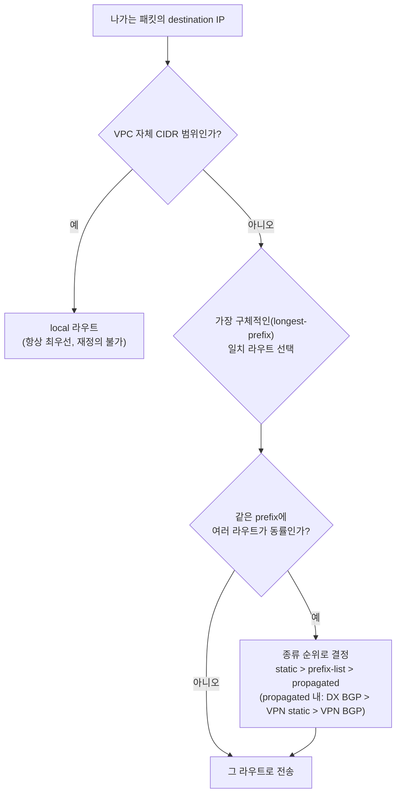

[VPC(Virtual Private Cloud)](https://docs.aws.amazon.com/vpc/latest/userguide/what-is-amazon-vpc.html)는 AWS 계정 전용으로 논리적으로 격리된 가상 네트워크입니다. 온프레미스 네트워크에 대응하는 소프트웨어 정의 네트워크이며 그 위에서 서브넷(Subnet)·라우트 테이블(Route Table)·게이트웨이가 IP 대역과 트래픽 경로를 결정합니다.

이 글은 AWS VPC 공식 문서(`docs.aws.amazon.com/vpc`)에서 VPC·서브넷·라우트 테이블의 동작·한도·예약 규칙을 정리한 노트입니다. CIDR 산술 자체(프리픽스 길이가 호스트 수로 이어지는 방식, `/24 = 256개` 같은 계산)는 이 글의 범위가 아니며, VPC·서브넷·라우팅에 얹히는 **AWS 고유의 의미와 제약**에 집중합니다. 엣지·NAT(IGW·NAT Gateway·Elastic IP·ENI)는 [2편](/posts/aws-vpc-2/)에서, 보안(SG·NACL)은 [3편](/posts/aws-vpc-3/)에서 다룹니다.

> [!NOTE] 전제
> IPv4 CIDR 표기(프리픽스 길이, 호스트 수 계산, 서브넷 분할 산술)를 이미 안다고 가정합니다. `2^(32 − prefix)` 같은 기초 계산은 다시 유도하지 않습니다.

## VPC의 범위와 기본 성질

VPC는 한 리전 안의 모든 가용 영역(AZ, Availability Zone)에 걸치는 리전 범위의 네트워크이며 IPv4 CIDR을 반드시 하나 가집니다. 리전을 넘지 못하는 것이 첫 번째 경계이고 IPv4는 필수이되 IPv6는 선택이라는 것이 두 번째 성질입니다. VPC·AZ·서브넷의 포함 관계는 다음과 같습니다.

```mermaid
flowchart TD
    R["리전 (예: ap-northeast-2)"]
    R --> V["VPC · IPv4 CIDR 필수 (예: 10.0.0.0/16)<br/>리전 경계를 넘지 못함"]
    V --> A1["AZ-a"]
    V --> A2["AZ-b"]
    V --> A3["AZ-c"]
    A1 --> S1["서브넷 10.0.0.0/24<br/>(정확히 AZ 하나에 속함)"]
    A2 --> S2["서브넷 10.0.1.0/24"]
    A3 --> S3["서브넷 10.0.2.0/24"]
```

- **리전 범위**: 하나의 VPC는 한 리전의 모든 AZ에 걸치지만 리전 경계를 넘지 못한다. 리전을 넘어 VPC를 연결하려면 inter-Region [VPC peering](https://docs.aws.amazon.com/vpc/latest/peering/what-is-vpc-peering.html), [Transit Gateway](https://docs.aws.amazon.com/vpc/latest/tgw/what-is-transit-gateway.html) peering 등이 필요하다.
- **IPv4 CIDR은 필수, IPv6는 가산(dual-stack)**: VPC는 최소 하나의 IPv4 CIDR 블록을 가져야 한다. IPv6는 옵트인이며 더해서 쓴다.
- VPC에 배치된 리소스(EC2 인스턴스, RDS, ELB, VPC 안의 Lambda 등)는 서브넷 대역에서 사설 IP를 받는다.

### 리전당 VPC 개수 — soft limit

리전당 VPC 기본 한도는 5개이며 [Service Quotas](https://docs.aws.amazon.com/servicequotas/latest/userguide/intro.html)로 상향할 수 있는 soft limit입니다.

- **기본 5개/리전**, "리전당 수백 개"까지 상향 가능하다.
- **결합 관계**: "VPCs per Region" 한도를 올리면 "Internet gateways per Region" 한도도 같은 양만큼 함께 올라간다(둘 다 기본 5). VPC 하나에는 인터넷 게이트웨이를 최대 하나만 붙일 수 있어 두 값이 함께 움직인다.

## IPv4 CIDR 지정 규칙

VPC의 IPv4 CIDR은 크기 범위·금지 대역·불변성이라는 세 가지 규칙을 따릅니다. 크기는 `/16`~`/28` 안에서 고르고, 몇몇 대역은 아예 쓸 수 없으며, 한 번 정한 기본 CIDR은 바꾸지 못합니다.

### CIDR 크기와 권장 대역

VPC IPv4 CIDR 크기는 `/16`(65,536개)부터 `/28`(16개)까지 허용됩니다. AWS는 [RFC 1918](https://datatracker.ietf.org/doc/html/rfc1918) 사설 대역에서 고르기를 권장합니다.

| RFC 1918 대역 | 프리픽스 | VPC CIDR 예 |
|---|---|---|
| 10.0.0.0 – 10.255.255.255 | 10/8 | `10.0.0.0/16` |
| 172.16.0.0 – 172.31.255.255 | 172.16/12 | `172.31.0.0/16` |
| 192.168.0.0 – 192.168.255.255 | 192.168/16 | `192.168.0.0/20` |

- **공인 라우팅 가능 CIDR도 허용된다.** RFC 1918이 아닌 공인 대역으로 VPC를 만들 수 있다. 다만 AWS는 어느 경우든 VPC 안의 주소를 "사설"로 취급해 **서브넷의 IPv4 대역을 인터넷에 광고하지 않으며**, 명시적 게이트웨이(IGW, VGW, Site-to-Site VPN, Direct Connect) 없이는 공인 대역이라도 **VPC CIDR에서 인터넷으로 직접 접근할 수 없다.**
- **정규형 변환**: CLI/API로 호스트 비트가 남은 CIDR(예: `100.68.0.18/18`)을 넘기면 AWS가 정규형 `100.68.0.0/18`로 다시 쓴다.

### 금지 CIDR 대역

다음 대역은 어떤 VPC에도 쓸 수 없습니다.

- `0.0.0.0/8`
- `127.0.0.0/8` (호스트 내부 루프백 대역)
- `169.254.0.0/16` (link-local 대역, [RFC 5735](https://datatracker.ietf.org/doc/html/rfc5735) 예약)
- `224.0.0.0/4` (멀티캐스트 대역)

> [!WARNING] 172.17.0.0/16 충돌 회피
> 일부 AWS 서비스가 `172.17.0.0/16`을 내부적으로 씁니다(예: [AWS Cloud9](https://docs.aws.amazon.com/cloud9/latest/user-guide/welcome.html), [Amazon SageMaker AI](https://docs.aws.amazon.com/sagemaker/latest/dg/whatis.html)가 이 대역에서 Docker bridge 사용). IP 충돌을 막으려면 VPC에 `172.17.0.0/16`을 쓰지 않습니다.

### 기본 CIDR은 불변

기본 IPv4 CIDR 블록은 변경할 수 없습니다. 분리도, 크기 증감도 되지 않습니다.

- **기본 CIDR은 분리 불가**: VPC를 처음 만들 때의 CIDR은 연결 해제할 수 없다.
- **리사이즈 불가**: 기존 CIDR 블록의 크기를 늘리거나 줄일 수 없다("You cannot increase or decrease the size of an existing CIDR block"). in-place re-masking은 없으며 새 블록을 추가하거나 재구축해야 한다.
- CLI로 기본 CIDR을 찾으려면 `aws ec2 describe-vpcs`의 최상위 `CidrBlock` 요소를 본다(모든 연결을 나열하는 `CidrBlockAssociationSet`과 구분된다).

## Secondary IPv4 CIDR

기본 CIDR을 바꿀 수 없으므로, 대역을 넓히려면 secondary(추가) IPv4 CIDR 블록을 붙입니다. 추가에는 크기·비중첩·라우트 관계 조건이 붙고, RFC 1918 패밀리를 자유롭게 섞을 수 없다는 제약이 따릅니다.

기존 VPC에 추가 IPv4 CIDR 블록을 연결할 수 있습니다.

- **쿼터: VPC당 IPv4 CIDR 블록 기본 5개**, 최대 50개까지 상향 가능하다. 기본 블록과 모든 secondary 블록이 이 쿼터에 합산된다.
- CIDR 블록을 연결하면 AWS가 VPC의 **모든 라우트 테이블에 `local` 라우트를 자동으로 추가**한다(destination = 새 CIDR, target = `local`). `10.0.0.0/16` VPC에 secondary `10.2.0.0/16`을 추가한 뒤 메인 라우트 테이블은 다음과 같다.

  | Destination | Target |
  |---|---|
  | `10.0.0.0/16` | `local` |
  | `10.2.0.0/16` | `local` |

### secondary CIDR 추가 조건

secondary CIDR을 추가할 때 다음 네 가지를 모두 만족해야 합니다.

1. 허용 크기는 여전히 `/28`~`/16`이다.
2. 이미 VPC에 연결된 어떤 CIDR과도 **중첩되면 안 된다.**
3. VPC의 어떤 라우트 테이블에 있는 **기존 라우트의 destination CIDR과 같거나 그보다 큰 블록이면 안 된다.** 예: 라우트 테이블에 `10.0.0.0/24 → vgw-...`가 있으면 `10.0.0.0/24`나 그보다 큰 `10.0.0.0/16`은 연결할 수 없고, `10.0.0.0/25` 이하는 가능하다.
4. CIDR-blocks-per-VPC 또는 routes-per-route-table 쿼터를 초과하면 안 된다.

- **연결 상태 머신**: CIDR 연결은 `associating → associated → disassociating → disassociated`로 전이하며 오류 시 `failing`/`failed`가 된다. `associated` 상태에서만 사용할 수 있다.

```mermaid
stateDiagram-v2
    [*] --> associating: CIDR 연결 요청
    associating --> associated: 성공
    associating --> failing: 검증 실패
    failing --> failed
    associated --> disassociating: 연결 해제 요청
    disassociating --> disassociated
    note right of associated
        이 상태에서만
        CIDR을 실제로 사용
    end note
```

### RFC 1918 패밀리 혼용 제한 (심화)

일부 AWS 서비스는 CIDR 충돌이 없어야 하는 cross-VPC/cross-account 기능을 씁니다. 그래서 AWS는 *기존* 대역에 따라 추가할 수 있는 secondary 대역을 제한합니다.

심화: 기존 대역별 secondary 추가 제한

- **기존 대역이 `10.0.0.0/8`인 경우**: 다른 RFC 1918 대역(`172.16.0.0/12`, `192.168.0.0/16`)과 `198.19.0.0/16`을 추가할 수 없다. 또한 연결된 CIDR 중 하나라도 `10.0.0.0/15`(10.0.0.0–10.1.255.255) 안에 있으면 `10.0.0.0/16`에서 CIDR을 추가할 수 없다. 다른 `10.0.0.0/8` 대역, 공인 라우팅 가능한 non-RFC-1918 `/16`~`/28`, `100.64.0.0/10`의 `/16`~`/28`은 추가할 수 있다.
- **기존 대역이 `172.16.0.0/12`인 경우**: 다른 RFC 1918 대역, `172.31.0.0/16`, `198.19.0.0/16`을 추가할 수 없다.
- **기존 대역이 `192.168.0.0/16`인 경우**: 다른 RFC 1918 대역이나 `198.19.0.0/16`을 추가할 수 없다.
- **기존 대역이 `198.19.0.0/16`인 경우**: RFC 1918 대역을 추가할 수 없다(공인 라우팅 가능 대역 또는 `100.64.0.0/10`만 가능).
- **기존 대역이 공인 라우팅 가능/`100.64.0.0/10`인 경우**: RFC 1918이나 `198.19.0.0/16`을 추가할 수 없다. RFC 1918과 공인 CIDR을 섞으려면 **VPC 생성 시 RFC 1918 CIDR을 먼저** 넣은 뒤 non-RFC-1918 CIDR을 추가해야 한다.
- `169.254.0.0/16`(link-local)은 어떤 VPC에도 영원히 할당할 수 없다.

> [!IMPORTANT] 한 VPC 안에서 RFC 1918 패밀리를 자유롭게 섞지 않는다
> 세 RFC 1918 패밀리(`10/8`·`172.16/12`·`192.168/16`)를 한 VPC 안에서 자유롭게 섞을 계획을 세우지 않습니다. 하나의 패밀리를 골라 secondary 블록도 그 안에서 유지합니다.

### secondary CIDR과 VPC peering (심화)

심화: peering·Direct Connect gateway 상호작용

- peering 연결이 **active**이면, peer의 CIDR과 겹치지 않는 한 CIDR을 추가할 수 있다.
- peering이 **pending-acceptance**이면, **requester** 소유자는 CIDR을 *하나도* 추가할 수 없다(요청을 수락하거나 삭제 후 재생성해야 한다). **accepter** 소유자는 추가할 수 있으나, 새 블록이 requester의 CIDR과 겹치면 pending 요청이 실패하고 수락할 수 없게 된다.
- **Direct Connect gateway**: 같은 Direct Connect gateway에 연결된 VPC들은 CIDR이 겹치면 안 된다. 겹치는 secondary CIDR을 추가하면 이 조건이 깨진다.

## IPv6와 dual-stack

VPC는 IPv4와 IPv6를 동시에 쓰는 dual-stack이 될 수 있습니다. IPv4는 필수이고 IPv6는 옵트인·가산입니다. VPC *수준*에서는 IPv6-only를 지원하지 않지만(모든 VPC가 IPv4 CIDR을 가집니다), 개별 *서브넷*은 IPv6-only가 될 수 있습니다.

- **Amazon 제공 IPv6 CIDR**: Amazon IPv6 풀에서 고정 `/56`을 받는다.
  - 대역을 **직접 고를 수 없다**. AWS가 할당한다(예: `2001:db8:1234:1a00::/56`).
  - `/56`은 2^72개 규모의 서브넷 공간이다.
  - Amazon 제공 IPv6 `/56`을 분리했다가 나중에 다시 연결하면 **같은 prefix를 다시 받는다고 기대하면 안 된다.**
- **[IPAM](https://docs.aws.amazon.com/vpc/latest/ipam/what-it-is-ipam.html)/[BYOIP](https://docs.aws.amazon.com/AWSEC2/latest/UserGuide/ec2-byoip.html) 제공 IPv6 CIDR**: `/44`부터 `/60`까지 `/4` 증분(`/44`·`/48`·`/52`·`/56`·`/60`)으로 최대 5개의 IPv6 CIDR 블록을 연결할 수 있다.
  - **쿼터: VPC당 IPv6 CIDR 블록 5개**(최대 50개로 상향 가능).

### Public/Private IPv6 (AWS 정의, 심화)

심화: public·private IPv6 구분과 ULA/GUA

- **Public IPv6**: 전역 고유하며 AWS가 **항상 인터넷에 광고**한다. 라우팅·security group·NACL 제어로 도달한다. 출처는 Amazon 풀, IPAM 풀, BYOIP.
- **Private IPv6**: AWS가 **인터넷에 광고하지 않는다.** **IPAM으로만** 사용할 수 있고 두 종류가 있다.
  - **ULA**([RFC 4193](https://datatracker.ietf.org/doc/html/rfc4193)) — `fc`/`fd`로 시작. 유효한 ULA 공간은 `fd00::/8` 중 Amazon 예약분 `fd00::/16`을 제외한 범위. 유효한 private ULA 대역은 `fd80::/9`에서 시작하는 `/9`~`/60`이다.
  - **GUA**([RFC 3587](https://datatracker.ietf.org/doc/html/rfc3587)) — 기본 비활성. 활성화해야 하며 소유한 GUA 공간이어야 한다.
- Private IPv6는 **인터넷 게이트웨이 엣지에서 드롭된다** — IGW나 egress-only IGW가 있어도 AWS는 private IPv6 대역에서 직접 egress를 허용하지 않는다.
- Private IPv6 주소에는 **요금이 없다.**

**IPv6에는 NAT가 없습니다.** IPv6 주소는 전역 고유하므로 AWS에 IPv6 NAT가 없습니다. 아웃바운드 전용 IPv6 인터넷 접속은 NAT가 아니라 **[egress-only 인터넷 게이트웨이](https://docs.aws.amazon.com/vpc/latest/userguide/egress-only-internet-gateway.html)**([NAT gateway](https://docs.aws.amazon.com/vpc/latest/userguide/vpc-nat-gateway.html)의 IPv6 대응물)를 씁니다.

## 서브넷 유형과 규칙

서브넷은 정확히 하나의 AZ에 속하고, CIDR마다 IP 5개를 예약하며, Public/Private/Isolated 구분은 서브넷 속성이 아니라 라우트 테이블이 정합니다. 이 세 가지가 서브넷 설계의 골격입니다.

### 서브넷 범위: 서브넷 하나 = AZ 하나

서브넷은 항상 정확히 하나의 AZ에 존재하며 AZ를 넘지 못합니다.

- VPC는 리전의 모든 AZ에 걸치므로, 멀티-AZ HA는 AZ별로 서브넷을 쪼개서 구현한다.
- **쿼터: VPC당 서브넷 200개**(상향 가능). AWS 힌트: 서브넷 쿼터를 올리면 route-tables-per-VPC도 올려야 할 수 있다. 서브넷은 정확히 하나의 라우트 테이블과 연결되기 때문이다.

### 서브넷 IPv4 크기

서브넷 IPv4 CIDR 크기는 `/28`(16개)부터 `/16`(65,536개)까지로, VPC와 같은 범위입니다.

- 서브넷 CIDR은 VPC CIDR과 같을 수도(단일 서브넷), 부분집합일 수도 있다(다중 서브넷). **한 VPC 안의 서브넷 CIDR은 서로 겹치면 안 된다.**
- `10.0.0.0/24` VPC를 `/25` 두 개로 나누는 예:
  - `10.0.0.0/25` → 주소 `10.0.0.0`–`10.0.0.127`
  - `10.0.0.128/25` → 주소 `10.0.0.128`–`10.0.0.255`

### 서브넷당 예약 IP 5개

모든 서브넷 CIDR의 **앞 4개 주소와 마지막 1개 주소는 AWS가 예약**해 어떤 리소스(EC2 인스턴스, ENI 등)에도 할당할 수 없습니다. `10.0.0.0/24` 서브넷의 예약 주소와 AWS가 밝힌 용도는 다음과 같습니다.

| 주소 | AWS의 예약 사유 |
|---|---|
| `10.0.0.0` | **네트워크 주소.** 서브넷의 기준 주소(네트워크 자체를 식별). |
| `10.0.0.1` | **VPC 라우터용 예약.** 서브넷의 암시적 라우터/기본 게이트웨이. |
| `10.0.0.2` | **DNS 서버용 예약.** "DNS 서버 IP는 VPC 네트워크 범위의 기준 + 2"다. 다중 CIDR VPC에서 *DNS 서버*는 **primary** CIDR의 `.2`에 있지만, AWS는 VPC의 모든 CIDR 블록에 걸쳐 *각* 서브넷 범위의 base+2도 예약한다. (Route 53 Resolver) |
| `10.0.0.3` | **미래 사용을 위한 예약.** |
| `10.0.0.255` | **네트워크 브로드캐스트 주소.** "VPC는 브로드캐스트를 지원하지 않으므로 이 주소를 예약한다." (VPC에는 L2 브로드캐스트 도메인이 없다.) |

예약의 결과:

- `/24` 서브넷(256개)은 **251개**를 쓸 수 있다(254개가 아니다). AWS가 5개를 예약하기 때문이다(일반 브로드캐스트 네트워크의 2개와 대비).
- 실무상 **가장 작은 서브넷 `/28`**(16개)은 **11개**만 쓸 수 있다.
- **BYOIP 예외**: BYOIP로 IPv4 대역을 AWS에 가져오면 첫(네트워크)·마지막(브로드캐스트) 주소를 포함해 모든 주소를 쓸 수 있다. 5개 예약 규칙은 AWS가 할당한 대역에 적용된다.

### IPv6 서브넷 크기와 예약 (심화)

심화: IPv6 서브넷 예약 주소와 링크-로컬 라우터

- IPv6 서브넷 넷마스크 길이는 `/44`~`/64`를 `/4` 증분으로 쓴다. 표준적인 dual-stack 서브넷은 `/64`다.
- **각 서브넷 CIDR의 앞 4개와 마지막 IPv6 주소도 예약**된다. `2001:db8:1234:1a00::/64` 서브넷의 경우:
  - `2001:db8:1234:1a00::` (기준)
  - `2001:db8:1234:1a00::1` — **VPC 라우터용 예약**
  - `2001:db8:1234:1a00::2`
  - `2001:db8:1234:1a00::3`
  - `2001:db8:1234:1a00:ffff:ffff:ffff:ffff` (마지막)
- IPv6 **기본 VPC 라우터**는 link-local 주소로도 도달할 수 있다: `FE80::/10` EUI-64 생성 주소와 `FE80:ec2::1`.

### Public vs Private vs Isolated 서브넷 (라우팅 구분)

"Public", "Private", "Isolated"는 **서브넷 속성이 아니라** 서브넷의 라우트 테이블이 전적으로 정의하는 관례입니다.

| 서브넷 유형 | 정의하는 라우트 | 인터넷 도달성 |
|---|---|---|
| **Public** | `0.0.0.0/0 → 인터넷 게이트웨이(IGW)` 라우트 보유 | 양방향 인터넷(공인 IP/EIP 있을 때). |
| **Private** | `0.0.0.0/0 → NAT gateway`(또는 NAT 인스턴스) 라우트 보유 | 아웃바운드 전용, 인바운드 개시 불가. |
| **Isolated**(VPN-only/완전 사설) | 인터넷 게이트웨이·NAT로 가는 라우트 없음 | 인터넷 라우트 없음. `local` + 선택적 VGW/TGW/peering/VPC-endpoint 라우트만. |

같은 VPC 안의 세 서브넷이 `0.0.0.0/0`을 서로 다른 target으로 보내면서 성격이 갈립니다. 아래 그림에서 인터넷으로 나가는 경로만 다릅니다.

```mermaid
flowchart LR
    subgraph VPC["VPC"]
        PUB["Public 서브넷<br/>0.0.0.0/0 → IGW"]
        NAT["NAT gateway<br/>(Public 서브넷에 위치)"]
        PRIV["Private 서브넷<br/>0.0.0.0/0 → NAT gateway"]
        ISO["Isolated 서브넷<br/>인터넷 라우트 없음"]
    end
    IGW["인터넷 게이트웨이"]
    NETWORK(("인터넷"))
    PUB --> IGW
    PRIV --> NAT --> IGW
    IGW --> NETWORK
    ISO -.->|VPC endpoint / VGW / TGW| AWS["AWS 서비스 · 온프레미스"]
```

- 서브넷이 "public"인 것은 연결된 라우트 테이블이 **인터넷 게이트웨이**로 가는 경로를 가질 때뿐이다. 인스턴스에 자동 할당된 공인 IPv4가 있어도 그 IGW 라우트가 없으면 아무 소용이 없다.
- "private" 서브넷은 *public* 서브넷에 있는 **NAT gateway**를 통해 아웃바운드로 인터넷에 도달한다.
- "isolated"/VPN-only 서브넷은 둘 다 없다. 인터넷 없이 **gateway/interface VPC endpoint**로 AWS 서비스에 사설 접근하고 VGW/TGW로 온프레미스에 도달할 수는 있다.
- auto-assign-public-IPv4 동작은 **서브넷 속성**이다(커스텀 서브넷 기본 OFF, 기본 VPC 서브넷 ON). 인스턴스 시작 시 재정의할 수 있다. public/private 라우팅 구분과는 직교하지만 보통 함께 묶인다.

## 라우트 테이블

라우트 테이블은 서브넷(또는 게이트웨이)에서 나가는 트래픽의 목적지를 정하는 규칙(라우트) 집합입니다. 항상 존재하는 `local` 라우트, 가장 구체적인 경로가 이기는 longest-prefix match, 그리고 동률 시 우선순위가 핵심 동작입니다.

### 핵심 개념과 용어

용어: 라우트 테이블 관련 개념 전체

- **메인 라우트 테이블(Main route table)** — VPC와 함께 자동으로 생기는 라우트 테이블. 다른 테이블에 **명시적으로 연결되지 않은 모든 서브넷**의 라우팅을 제어한다. VPC마다 메인 라우트 테이블이 정확히 하나 있다.
- **커스텀 라우트 테이블(Custom route table)** — 직접 만든 라우트 테이블.
- **서브넷 라우트 테이블(Subnet route table)** — 서브넷에 연결된 라우트 테이블.
- **Destination** — 트래픽의 목적지 CIDR 범위(예: `172.16.0.0/12`, "전부"를 뜻하는 `0.0.0.0/0`).
- **Target** — 트래픽을 보내는 게이트웨이/네트워크 인터페이스/연결(예: 인터넷 게이트웨이, NAT gateway, ENI, peering 연결, transit gateway, VPC endpoint).
- **Local 라우트** — VPC 내부 통신을 위해 항상 존재하는 기본 라우트.
- **라우트 테이블 연결(Association)** — 라우트 테이블과 서브넷/인터넷 게이트웨이/가상 사설 게이트웨이 사이의 바인딩.
- **전파(Propagation)** — 연결된 가상 사설 게이트웨이의 VPN/Direct Connect 라우트(또는 Transit Gateway 경유 라우트)를 라우트 테이블에 자동 삽입.
- **게이트웨이 라우트 테이블(Gateway route table)** — 인터넷 게이트웨이 또는 가상 사설 게이트웨이에 연결된 라우트 테이블(엣지 연결/ingress 라우팅용).
- **엣지 연결(Edge association)** — 게이트웨이 라우트 테이블로 *인바운드* VPC 트래픽을 서브넷 도달 전에 어플라이언스(예: 방화벽 ENI)로 보내는 것.
- **Transit gateway 라우트 테이블** — Transit Gateway에 연결된 라우트 테이블.
- **Local gateway 라우트 테이블** — AWS Outposts local gateway에 연결된 라우트 테이블.

### local 라우트 — 항상 존재, 삭제 불가

모든 라우트 테이블에는 target이 `local`인 `local` 라우트가 있으며 VPC의 모든 CIDR 블록에 걸친 **VPC 내부 통신**을 가능하게 합니다.

- 자동으로 생성되며 **삭제할 수 없다.** VPC에 CIDR 블록을 추가하면 AWS가 모든 라우트 테이블에 대응하는 `local` 라우트를 자동으로 추가한다.
- **dual-stack**: VPC에 IPv4와 IPv6가 둘 다 있으면 **IPv4용과 IPv6용 local 라우트가 각각** 존재한다.
- local 라우트는 모든 라우트 중 **가장 높은 우선순위**를 가진다. VPC 자체 대역에 대해서는 더 구체적인 propagated 라우트로도 재정의할 수 없다.

### Longest-prefix match (가장 구체적인 라우트가 이긴다)

AWS는 **가장 구체적으로 일치하는 라우트** = **longest-prefix match**로 트래픽을 라우팅합니다. 예: `10.10.2.15/32`가 `10.10.2.0/24`를 이깁니다.

- IPv4와 IPv6 라우팅은 **독립적**이다. 가장 구체적인 IPv4 라우트가 IPv4 트래픽을, 가장 구체적인 IPv6 라우트가 IPv6 트래픽을 각각 처리한다.
- 서브넷 라우트 테이블 예:

  | Destination | Target |
  |---|---|
  | `10.0.0.0/16` | `local` |
  | `172.31.0.0/16` | `pcx-11223344556677889` (peering) |
  | `0.0.0.0/0` | `igw-12345678901234567` |

  - `172.31.x.x`로 가는 트래픽 → peering 연결(IGW 기본값보다 구체적).
  - `10.0.x.x`로 가는 트래픽 → `local`(VPC 자체 대역).
  - 그 외 모든 트래픽 → 인터넷 게이트웨이.

### 라우트 우선순위 / 평가 순서

destination이 **겹치거나 동률**일 때 AWS는 다음 우선순위(높은 것 먼저)를 적용합니다.

1. **Longest prefix**(가장 구체적인 라우트가 항상 먼저 이긴다 — 예: `/32`가 `/24`보다). 경쟁 라우트가 static·propagated·prefix-list 어느 쪽이든 무관하다. VPC 자체 CIDR 범위에 대해서는 **`local` 라우트가 가장 선호**되며 더 구체적인 propagated 라우트로도 재정의되지 않는다.
2. **Static 라우트**(수동 추가) — 인터넷 게이트웨이, NAT gateway, 네트워크 인터페이스, 인스턴스 ID, gateway VPC endpoint, transit gateway, VPC peering 연결, Gateway Load Balancer endpoint 같은 target으로 향한다.
3. **Prefix-list 라우트**(관리형 prefix list를 참조하는 라우트).
4. **Propagated 라우트**, 하위 순서:
   1. [Direct Connect](https://docs.aws.amazon.com/directconnect/latest/UserGuide/Welcome.html) BGP 라우트(동적)
   2. VPN static 라우트
   3. VPN BGP 라우트(동적) — 예: 가상 사설 게이트웨이 발

패킷 하나가 어느 라우트로 나갈지는 다음 순서로 결정됩니다. 위에서 걸리면 아래는 보지 않습니다.

```mermaid
flowchart TD
    P["나가는 패킷의 destination IP"]
    P --> Q1{"VPC 자체 CIDR 범위인가?"}
    Q1 -->|예| L["local 라우트<br/>(항상 최우선, 재정의 불가)"]
    Q1 -->|아니오| Q2{"가장 구체적인(longest-prefix)<br/>일치 라우트 선택"}
    Q2 --> Q3{"같은 prefix에<br/>여러 라우트가 동률인가?"}
    Q3 -->|아니오| WIN["그 라우트로 전송"]
    Q3 -->|예| ORD["종류 순위로 결정<br/>static > prefix-list > propagated<br/>(propagated 내: DX BGP > VPN static > VPN BGP)"]
    ORD --> WIN
```

동률 처리와 특수 규칙:

- 같은 destination에서 **static이 propagated를 이긴다.** 예: `172.31.0.0/24 → vgw-... (propagated)`와 `172.31.0.0/24 → igw-... (static)`이 함께 있는 라우트 테이블은 모든 `172.31.0.0/24` 트래픽을 **인터넷 게이트웨이**로 보낸다(static 승).
- **prefix-list vs propagated**: prefix list를 참조하는 라우트가 일치하는 propagated 라우트를 이긴다. 다만 **더 구체적인 라우트는 종류와 무관하게 항상 이긴다.**
- **다른 target으로 겹치는 prefix list**: AWS가 어느 것이 이길지 **무작위로** 고른다. 이후에는 같은 라우트가 일관되게 이긴다.

### 라우트 전파 (VGW / TGW)

라우트 전파는 VPN·Direct Connect 라우트를 라우트 테이블에 자동으로 넣어 수동 관리를 없앱니다.

- **가상 사설 게이트웨이(VGW)**를 VPC에 붙이고 서브넷 라우트 테이블에서 **라우트 전파를 활성화**하면, AWS가 **Site-to-Site VPN 라우트를 자동으로 추가**한다(propagated 라우트로). 수동 추가/삭제가 필요 없다.
- **쿼터: 라우트 테이블당 propagated 라우트 100개(상향 불가).** 더 많은 프리픽스가 필요하면 기본 라우트를 광고한다.
- Transit gateway는 자체 **transit gateway 라우트 테이블**을 가지며 연결된 VPC·VPN 연결·Direct Connect gateway의 라우트를 전파하고 static 라우트도 넣을 수 있다.

### 서브넷 연결 규칙

- **서브넷 하나 ↔ 라우트 테이블 정확히 하나**(어느 시점에나). 서브넷을 동시에 두 라우트 테이블에 연결할 수 없다.
- **라우트 테이블 하나 ↔ 다수 서브넷.** 하나의 라우트 테이블을 여러 서브넷이 공유할 수 있다.
- **암시적 vs 명시적 연결**: 라우트 테이블에 *명시적으로* 연결하지 않은 서브넷은 **메인 라우트 테이블에 암시적으로 연결**된다. 커스텀 테이블에 명시적으로 연결하면 이 암시적 메인 테이블 연결을 재정의한다.
- **쿼터: VPC당 라우트 테이블 200개**(상향 가능, 메인 라우트 테이블도 포함).

### 게이트웨이 라우트 테이블 (엣지 연결/ingress 라우팅, 심화)

심화: 엣지 연결과 north-south 검사

- 라우트 테이블을 **인터넷 게이트웨이** 또는 **가상 사설 게이트웨이**에 연결할 수 있다. 이것이 **엣지 연결**이며 **ingress 라우팅**에 쓴다.
- 목적: VPC로 들어오는 **인바운드** 트래픽(IGW 경유 인터넷에서, 또는 VGW 경유 온프레미스에서)을 목적지 서브넷에 닿기 전에 **미들박스 어플라이언스**(예: 방화벽/IDS ENI)로 보낸다. VPC로 향하는 트래픽의 target은 어플라이언스의 네트워크 인터페이스다.
- north-south 트래픽에 대한 검사를 VPC 엣지에서 강제한다.

### 메인 vs 커스텀 라우트 테이블 전략

메인 라우트 테이블은 catch-all입니다. 흔한 모범 사례는 메인 라우트 테이블을 **최소/잠금 상태**(예: local만, "기본 사설")로 유지하고 public 서브넷에는 **명시적 커스텀 라우트 테이블**(IGW 라우트 포함)을 쓰는 것입니다. 그러면 새로 만든 서브넷은 public 테이블에 명시적으로 연결되기 전까지 기본적으로 private이 됩니다.

## 암시적 라우터 / VPC 라우터

모든 VPC에는 라우트 테이블에 따라 서브넷 간·게이트웨이로의 라우팅을 수행하는 **암시적 라우터**("VPC 라우터")가 있습니다. 관리할 인스턴스가 없는 SDN 패브릭의 일부입니다.

- VPC 라우터는 각 서브넷의 인터페이스/기본 게이트웨이로서 **모든 서브넷의 `.1` 주소**(서브넷 CIDR의 두 번째 IP)를 차지한다. `.1`이 예약 주소 5개 중 하나인 이유가 이것이다.
- IPv6 VPC 라우터는 서브넷의 `::1`과 link-local 주소 `FE80:ec2::1`, `FE80::/10` EUI-64 주소를 쓴다.
- 라우트 테이블은 라우터에 "속한다"기보다 서브넷별(엣지 연결의 경우 게이트웨이별)로 **암시적 라우터의 동작을 프로그래밍**한다.

## 기본 VPC vs 커스텀 VPC

Amazon VPC를 처음 쓰면 AWS가 리전마다 **기본 VPC**를 프로비저닝해 즉시 인스턴스를 띄울 수 있게 합니다. 기본 VPC는 고정 CIDR·AZ별 public 서브넷·IGW·public 기본값을 미리 갖춘 반면, 커스텀 VPC는 이 모두를 직접 만듭니다.

### 기본 VPC 구성요소 (리전마다 자동 생성)

기본 VPC에서 AWS가 설정하는 것:

- **`/16` IPv4 CIDR = `172.31.0.0/16`** VPC(최대 65,536개 사설 IPv4).
- **각 AZ에 `/20` 기본 서브넷**(서브넷당 최대 4,096개, 예약 5개 제외). AZ마다 서브넷 하나.
- VPC에 붙은 **인터넷 게이트웨이**.
- **메인 라우트 테이블**에 **`0.0.0.0/0` → 인터넷 게이트웨이** 라우트(그래서 모든 기본 서브넷이 *public*). 기본 VPC 메인 라우트 테이블:

  | Destination | Target |
  |---|---|
  | `172.31.0.0/16` | `local` |
  | `0.0.0.0/0` | `igw-...` |

- VPC에 연결된 **기본 security group**.
- VPC에 연결된 **기본 network ACL**.
- VPC에 연결된 계정의 **기본 DHCP options set**.
- **DNS 해석 활성화** — 기본 VPC는 `enableDnsHostnames`가 `true`이고(커스텀 VPC는 기본 `false`), `enableDnsSupport`가 `true`.
- 기본 서브넷은 **auto-assign public IPv4 = ON**이라 여기서 띄운 인스턴스는 기본으로 공인 IP를 받는다.
- 기본 VPC에 IPv6 CIDR을 선택적으로 연결할 수 있다.

> [!NOTE] IAM 주의
> AWS가 기본 VPC 리소스를 *사용자를 대신해* 만들기 때문에, `CreateInternetGateway`를 거부하는 IAM 정책이 있어도 `CreateDefaultVpc`가 IGW를 만드는 것을 막지 못합니다. 막으려면 `CreateDefaultVpc`와 `CreateInternetGateway`를 둘 다 거부해야 합니다.

### 기본 vs 커스텀 — 주요 차이

| 항목 | 기본 VPC | 커스텀(nondefault) VPC |
|---|---|---|
| CIDR | 고정 `172.31.0.0/16` | 직접 선택(`/16`~`/28`) |
| 서브넷 | AZ마다 `/20` public 서브넷 자동 생성 | 만들기 전까지 없음 |
| 인터넷 게이트웨이 | 사전 연결 + `0.0.0.0/0` 라우트 | 추가 전까지 없음 |
| 서브넷 기본값 | **Public**(auto public IPv4 ON) | **Private**(auto public IPv4 OFF) |
| `enableDnsHostnames` | `true` | `false`(기본) |
| 프로비저닝 주체 | AWS, 자동 | 사용자 |

- 기본 VPC도 다른 VPC처럼 완전히 편집할 수 있다: nondefault 서브넷 추가, 메인 라우트 테이블 수정, 라우트 테이블 추가, CIDR 블록 추가, Site-to-Site VPN 연결 등.

## IP 주소 지정 상세

인스턴스는 기본 사설 IPv4를 하나 받고, DNS는 Route 53 Resolver가 처리하며, 공인 IPv4에는 요금이 붙습니다. 이 절은 주소 할당·DNS·요금의 세부입니다.

### primary vs secondary 사설 IPv4

심화: primary·secondary 사설 IPv4 동작

- 시작 시 인스턴스의 **primary 네트워크 인터페이스(eth0)**는 서브넷 범위에서 **primary 사설 IPv4**를 받는다. 직접 지정하거나 AWS가 가용 주소를 고른다.
- **primary 사설 IP는 다른 인터페이스로 재할당할 수 없고** 인스턴스 수명 동안 유지된다(종료 시 반환).
- 인터페이스에 **secondary 사설 IPv4 주소**를 추가할 수 있다. primary와 달리 **secondary 사설 IP는 ENI 간 이동이 가능**하다. 사설 IP는 stop/start를 거쳐도 유지되고 종료 시 반환된다.
- 각 인스턴스는 자신의 사설 IP로 해석되는 내부 **사설 DNS 호스트네임**도 받는다(resource-based RBN 또는 IP-based naming).

### Amazon DNS 서버 / Route 53 Resolver

**Amazon DNS 서버**(=**[Route 53 Resolver](https://docs.aws.amazon.com/vpc/latest/userguide/AmazonDNS-concepts.html)**, =`AmazonProvidedDNS`)는 리전의 **모든 AZ**에 내장되어 있으며 다음 주소로 도달합니다.

- **`169.254.169.253`**(IPv4 link-local) — 어떤 서브넷에서도 동작(IPv6-only 서브넷 포함, DHCP option set의 name server가 `AmazonProvidedDNS`인 한).
- **`fd00:ec2::253`**(IPv6).
- **VPC primary IPv4 CIDR 기준 + 2** — 예: `10.0.0.0/16` VPC면 `10.0.0.2`. 모든 서브넷에서 `.2`가 예약되는 이유다(각 서브넷 기준 + 2도 모든 CIDR에 걸쳐 예약되지만 실제 resolver는 primary CIDR의 `.2`에 있다).
- 쿼리는 **link-local 주소**를 쓰고 resolver로 **사설로 전송**된다(네트워크에 노출되지 않음).

DNS 동작과 규칙:

- security group이나 network ACL로 Amazon DNS 서버로의/에서의 트래픽을 **필터링할 수 없다.**
- Route 53 Resolver는 **재귀 쿼리만** 지원한다.
- **`enableDnsSupport`**(기본 `true`): true이면 Amazon DNS 서버로의 쿼리가 성공한다(해석 동작).
- **`enableDnsHostnames`**(기본 `false`, 기본 VPC만 `true`): true이면 VPC가 공인 IPv4/EIP를 가진 인스턴스에 **공인 DNS 호스트네임**을 부여한다.
- 다음을 하려면 **둘 다 `true`**여야 한다: public 인스턴스의 공인 DNS 호스트네임 확보, Amazon 제공 사설 DNS 호스트네임 해석, private hosted zone 사용, interface VPC endpoint(PrivateLink)의 private DNS 사용.
- 하나라도 `false`이면: 공인 DNS 호스트네임 없음, Amazon 제공 사설 호스트네임 미해석(DHCP options set의 domain name server를 통한 커스텀 DNS로 대체).

심화: DHCP·public IPv4·Elastic IP 동작

**DHCP 동작**

- AWS는 시작 시 서브넷 범위에서 **primary 사설 IPv4를 DHCP로** 할당한다.
- VPC는 `domain-name-servers`(기본 `AmazonProvidedDNS`), `domain-name`, 선택적 NTP/NetBIOS 설정을 지정하는 **[DHCP options set](https://docs.aws.amazon.com/vpc/latest/userguide/VPC_DHCP_Options.html)**을 쓴다.
- **Hadoop/EMR 주의**: 인스턴스는 자기 FQDN을 해석할 수 있어야 한다. `domain-name-servers`를 커스텀 값으로 재정의하면 `<region>.compute.internal`에 대한 조건부 포워더를 Amazon DNS 서버에 추가한다.

**public IPv4, Elastic IP**

- 서브넷 속성(**auto-assign public IPv4**)이 서브넷의 새 ENI가 **공인 IPv4**를 받을지를 정한다. 이 공인 IP는 1:1 **NAT**로 primary 사설 IP에 매핑된다. 인스턴스 시작 시 재정의 가능.
- 자동 할당 공인 IP는 **계정이 아니라 Amazon 풀에서** 나온다. 반환하면 풀로 돌아가며 같은 것을 다시 받을 수 없다. AWS가 stop/start 시 바꿀 수 있다.
- 계정에 묶여 인스턴스 간 이동 가능한 **영속** 공인 IP가 필요하면 **[Elastic IP(EIP)](https://docs.aws.amazon.com/vpc/latest/userguide/vpc-eips.html)**를 쓴다.
- **요금 주의**: AWS는 실행 중 인스턴스의 것과 모든 Elastic IP를 포함해 **모든** 공인 IPv4 주소에 요금을 부과한다.
- `enableDnsHostnames=true`이면 공인 IP/EIP 인스턴스는 **공인 DNS 호스트네임**을 받는다. 외부에서는 공인 IP로, VPC 내부에서는 사설 IP로 해석된다.

> [!WARNING] link-local PPS 한도 (상향 불가)
> link-local 주소(`.2`, `169.254.169.253`)의 서비스에는 **네트워크 인터페이스당 초당 1024 패킷(PPS)** 한도가 있습니다. 이 합산은 Route 53 Resolver DNS 쿼리에 더해 IMDS(인스턴스 메타데이터), Amazon Time Sync(NTP), Windows 라이선싱 요청을 포함합니다. **이 한도는 상향할 수 없습니다.** 초과하면 resolver가 트래픽을 거부하며 간헐적 DNS 실패의 흔한 원인입니다.

## 설계 시 고려할 쿼터와 규칙

VPC 설계의 두 축은 CIDR 비중첩과 여유 공간 확보입니다. 기본 CIDR이 불변이고 secondary CIDR에 제약이 많으므로, 처음에 넉넉히 잡고 겹치지 않게 계획합니다.

- **CIDR 비중첩(제1원칙)**: peering·Transit Gateway·Direct Connect는 모두 CIDR이 겹치지 않아야 한다. VPC peering은 IPv4 CIDR이 겹치는 VPC 간에는 동작하지 않고, 같은 Direct Connect gateway의 VPC들은 겹치면 안 되며, TGW 라우트 테이블은 고유 프리픽스가 필요하다. 연결할 가능성이 있는 모든 VPC/계정/리전에 걸쳐 **전역 비중첩 주소 계획**을 미리 세운다. 사후에 비중첩을 맞추려면 기본 CIDR이 불변이라 VPC 재구축이 되는 경우가 많다.
- **성장 여유**: 기본 CIDR은 리사이즈 불가, secondary CIDR은 제약이 많으므로 **처음에 넉넉히**(VPC당 `/16`이 흔한 기본값) 잡는다. 서브넷당 예약 5개도 감안한다(`/28`은 11개만 사용 가능).
- **AZ·서브넷 계획**: 서브넷 하나 = AZ 하나이므로, 각 계층(public/app/data)마다 **최소 2~3개 AZ에 걸친 대칭적 서브넷** 집합을 계획한다. 예측 가능한 용량을 위해 AZ 간 계층 서브넷 크기를 같게 유지한다.

### 설계 기준 쿼터 (기본값)

심화: VPC 관련 기본 쿼터 표

| 리소스 | 기본값 | 상향 가능 |
|---|---|---|
| VPCs per Region | 5 | 예(수백까지) |
| Subnets per VPC | 200 | 예 |
| IPv4 CIDR blocks per VPC | 5 | 예(최대 50) |
| IPv6 CIDR blocks per VPC | 5 | 예(최대 50) |
| Route tables per VPC | 200 | 예(메인 RT 포함) |
| Routes per route table (static) | 500 | 예(최대 1,000, 성능 영향) |
| Propagated routes per route table | 100 | **아니오** |
| Internet gateways per Region | 5 | 예(VPC 쿼터와 함께) |
| NAT gateways per AZ | 5 | 예 |
| Security groups per Region | 2,500 | 예 |
| Rules per security group (in 또는 out) | 60 | 예(SG-rules × SGs-per-ENI ≤ 1,000) |
| Security groups per network interface | 5 | 예(최대 16) |
| Network ACLs per VPC | 200 | 예 |
| Rules per network ACL (in 또는 out) | 20 | 예(in 40 + out 40까지) |
| Network interfaces per Region | 5,000 | 예(AZ별 강제) |
| Elastic IPs per Region | 5 | 예 |

static-route 쿼터는 **IPv4와 IPv6 라우트에 대해 각각** 강제되고 rules-per-SG 쿼터는 in/out과 IPv4/IPv6에 대해 각각 강제됩니다.

### 용량 계획 도구 (심화)

심화: NAU와 IPAM

**Network Address Usage (NAU)**

- NAU는 VPC 크기를 계획·모니터링하는 집계 메트릭이다(IP 주소 + 네트워크 인터페이스 + 관리형 prefix list의 CIDR).
- **VPC당 기본 64,000 NAU 단위**(최대 256,000으로 상향), **VPC + 같은 리전 peered VPC는 128,000**(최대 512,000). 리전 간 peer는 계산에 포함되지 않는다.
- NAU 여유가 있어도 개별 리소스는 각자의 서비스 쿼터에 여전히 묶인다.

**IPAM**

- **Amazon VPC IP Address Manager(IPAM)**는 비즈니스 규칙으로 계정/리전에 걸쳐 IP CIDR을 계획·할당·추적·모니터링한다. 멀티-VPC/멀티-계정 조직에서 비중첩 강제와 할당 자동화에 권장된다. IPAM은 **private IPv6(ULA/GUA)를 쓰는 유일한 방법**이자, 연속된 공인 IPv4 블록에서 순차적 Elastic IP를 할당하는 방법이다.

## 참고 자료

- AWS, [VPC CIDR blocks](https://docs.aws.amazon.com/vpc/latest/userguide/vpc-cidr-blocks.html)
- AWS, [IP addressing for VPCs and subnets](https://docs.aws.amazon.com/vpc/latest/userguide/vpc-ip-addressing.html)
- AWS, [Subnet CIDR blocks (sizing)](https://docs.aws.amazon.com/vpc/latest/userguide/subnet-sizing.html)
- AWS, [Route table concepts](https://docs.aws.amazon.com/vpc/latest/userguide/RouteTables.html)
- AWS, [How route priority works](https://docs.aws.amazon.com/vpc/latest/userguide/route-tables-priority.html)
- AWS, [Default VPC components](https://docs.aws.amazon.com/vpc/latest/userguide/default-vpc-components.html)
- AWS, [Understanding Amazon DNS (Route 53 Resolver)](https://docs.aws.amazon.com/vpc/latest/userguide/AmazonDNS-concepts.html)
- AWS, [Amazon VPC quotas](https://docs.aws.amazon.com/vpc/latest/userguide/amazon-vpc-limits.html)
- AWS, [What is IPAM? (Amazon VPC IP Address Manager)](https://docs.aws.amazon.com/vpc/latest/ipam/what-it-is-ipam.html)
- IETF, [RFC 1918 — Address Allocation for Private Internets](https://datatracker.ietf.org/doc/html/rfc1918)
