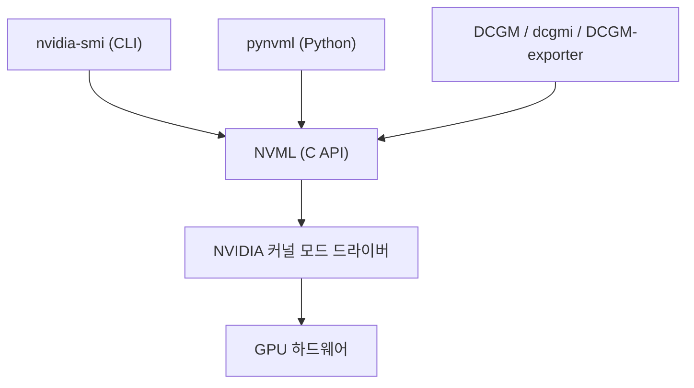
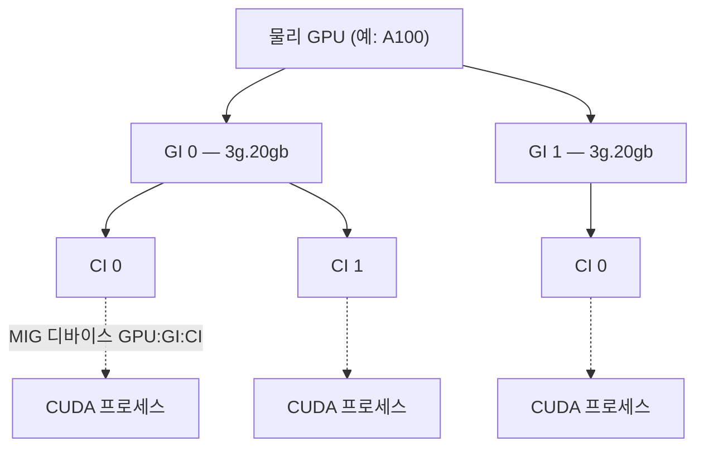
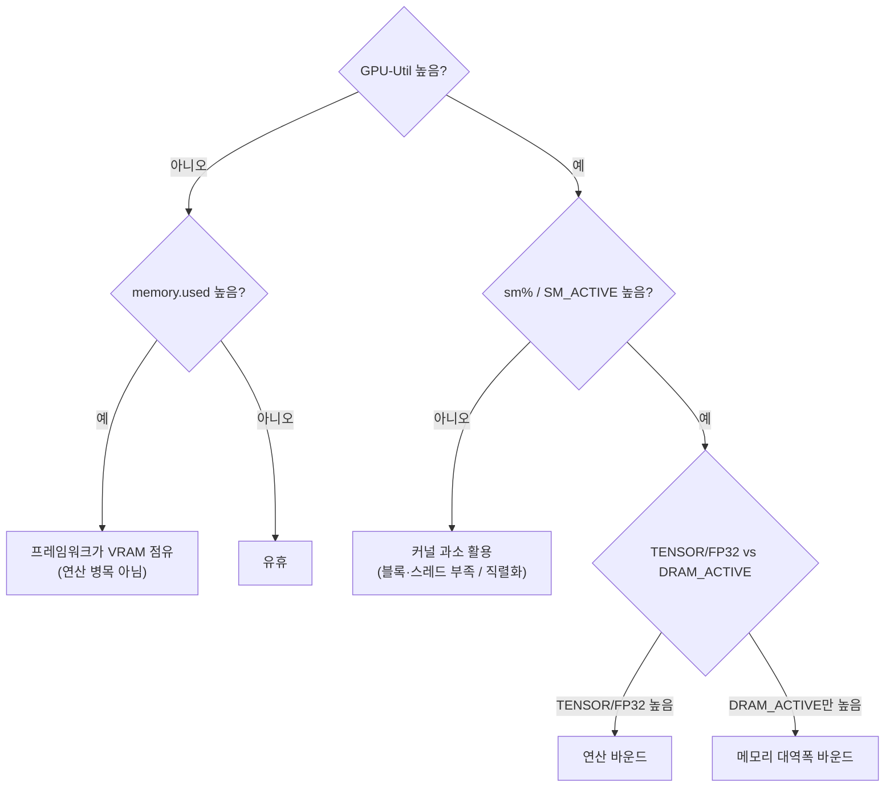

이 글은 [NVIDIA 공식 문서](https://docs.nvidia.com/deploy/nvidia-smi/)(nvidia-smi 레퍼런스, MIG User Guide, Driver Persistence, DCGM, NVIDIA Container Toolkit)를 정리한 것입니다. `nvidia-smi`의 기본 출력 필드, 쿼리 모드, 모니터링·관리 명령, MIG, 토폴로지, 종료 코드까지를 다룹니다.

## nvidia-smi의 정체

`nvidia-smi`(NVIDIA System Management Interface)는 NVIDIA GPU를 모니터링하고 관리하는 커맨드라인 유틸리티입니다.

- [NVML](https://developer.nvidia.com/management-library-nvml)(NVIDIA Management Library) 위에 얹힌 얇은 CLI 래퍼입니다. NVML은 GPU 상태와 제어를 노출하는 C 기반 API이며, `nvidia-smi`가 출력하는 모든 값은 NVML이 프로그래밍 인터페이스로도 노출합니다. 즉 `nvidia-smi`는 NVML의 사람용 프런트엔드입니다. 같은 NVML 위에 Python 바인딩 `pynvml`과 데이터센터용 [DCGM](https://docs.nvidia.com/datacenter/dcgm/latest/gpu-telemetry/dcgm-exporter.html)이 함께 얹힙니다.
- NVIDIA GPU 드라이버에 포함되어 배포됩니다. 별도로 설치할 패키지가 없으며, 드라이버가 있으면 `nvidia-smi`도 있습니다. 리눅스에서는 `/usr/bin/nvidia-smi`, 윈도우에서는 `C:\Windows\System32\nvidia-smi.exe`에 위치합니다.
- Tesla / 데이터센터(A100, H100, V100, T4, L4 등), Quadro / RTX 프로페셔널, GRID / vGPU, GeForce 전 제품군에서 동작합니다. 다만 **기능 지원은 제품과 드라이버에 따라 다릅니다.** ECC 설정, 전력 캡, persistence mode, MIG, accounting, application clock 같은 관리 기능은 Tesla/데이터센터와 고급 Quadro에서 완전 지원되고, consumer GeForce에서는 부분 지원되거나 지원되지 않습니다. 미지원 기능을 호출하면 종료 코드 3("operation unsupported on target device")을 반환합니다.
- **출력 포맷은 드라이버 릴리스 간 하위 호환을 보장하지 않습니다.** NVIDIA는 운영 도구에서 사람이 읽는 기본 출력이나 `-q` 출력을 파싱하지 말라고 명시합니다. 안정적인 기계 인터페이스인 `--query-...=... --format=csv`를 쓰거나, NVML / pynvml / DCGM에 직접 프로그래밍하는 방식을 권장합니다.
- 대부분의 읽기·모니터링 작업은 특별한 권한이 필요 없지만, 대부분의 관리·설정 작업은 root(리눅스) 또는 Administrator(윈도우) 권한이 필요합니다.

`nvidia-smi`·`pynvml`·DCGM은 모두 NVML이라는 같은 라이브러리를 소비하는 클라이언트이며, NVML은 커널 모드 드라이버를 통해 GPU에 접근합니다.



명령군을 익숙한 도구에 빗대 보면, 인자 없는 `nvidia-smi`는 GPU용 `top`, `nvidia-smi dmon`은 GPU용 `vmstat`, `nvidia-smi -q`는 `/proc` 스타일 전체 덤프, `--query-*` 모드는 스크립트용 export입니다.

## 기본 출력 — 모든 필드

인자 없이 `nvidia-smi`를 실행하면 스냅샷 테이블이 출력됩니다. 대표적인 레이아웃은 다음과 같으며, 드라이버/CUDA 버전과 정확한 열 구성은 드라이버마다 조금씩 달라집니다.


```
+-----------------------------------------------------------------------------------------+
| NVIDIA-SMI 550.54.15              Driver Version: 550.54.15      CUDA Version: 12.4      |
|-----------------------------------------+------------------------+----------------------+
| GPU  Name                 Persistence-M | Bus-Id          Disp.A | Volatile Uncorr. ECC |
| Fan  Temp   Perf          Pwr:Usage/Cap |           Memory-Usage | GPU-Util  Compute M. |
|                                         |                        |               MIG M. |
|=========================================+========================+======================|
|   0  NVIDIA A100-SXM4-40GB      On      | 00000000:07:00.0 Off   |                    0 |
| N/A   34C    P0              63W / 400W |  19478MiB / 40960MiB   |     78%      Default |
|                                         |                        |             Disabled |
+-----------------------------------------+------------------------+----------------------+

+-----------------------------------------------------------------------------------------+
| Processes:                                                                              |
|  GPU   GI   CI        PID   Type   Process name                              GPU Memory |
|        ID   ID                                                               Usage      |
|=========================================================================================|
|    0   N/A  N/A     12345      C   python                                     19450MiB  |
+-----------------------------------------------------------------------------------------+
```

### 헤더 줄

- **NVIDIA-SMI `<x.y.z>`** — `nvidia-smi` 도구 자체의 버전입니다(드라이버 빌드를 따라갑니다).
- **Driver Version** — 설치된 NVIDIA 커널 모드 드라이버 버전입니다(예: `550.54.15`).
- **CUDA Version** — 설치된 드라이버가 지원하는 *최대 [CUDA](https://docs.nvidia.com/cuda/) 런타임 버전*입니다. 이것은 드라이버의 CUDA 지원 능력이며, 컴파일에 사용한 CUDA toolkit이 아닙니다. "CUDA Version: 12.4"는 12.4 이하의 애플리케이션을 실행할 수 있다는 뜻이지, CUDA 12.4 toolkit이 설치돼 있다는 뜻이 아닙니다.

### GPU 블록 윗줄

- **GPU** — 0부터 시작하는 디바이스 인덱스(0, 1, 2 …)입니다. `-i`의 기본 ID이며 드라이버가 할당하는 열거 순서입니다(`CUDA_DEVICE_ORDER=PCI_BUS_ID`가 아니면 PCI 순서와 일치하지 않을 수 있습니다).
- **Name** — 마케팅 제품명입니다(예: `NVIDIA A100-SXM4-40GB`, `Tesla V100-PCIE-16GB`, `NVIDIA L4`).
- **Persistence-M** — Persistence Mode 플래그로 `On` 또는 `Off`입니다. `On`이면 CUDA 앱·X 서버·`nvidia-smi` 같은 클라이언트가 GPU를 사용하지 않아도 드라이버가 초기화·로드된 상태로 남습니다. 프로세스가 붙을 때마다 발생하는 수 초의 드라이버 재초기화 지연을 피합니다. 리눅스 전용이며 `nvidia-persistenced`로 대체되어 deprecated 상태입니다.
- **Bus-Id** — GPU의 PCI 버스 주소로 `domain:bus:device.function` 16진 형식입니다(예: `00000000:07:00.0`). 물리 슬롯을 구분하거나 `-i`에 넘길 때 사용합니다.
- **Disp.A** — Display Active로 `On`/`Off`입니다. 이 GPU에 디스플레이가 초기화·연결되어 있는지(모니터를 구동하거나 디스플레이용 프레임버퍼가 할당되어 있는지)를 나타냅니다. 헤드리스 데이터센터 GPU에서는 `Off`입니다. 디스플레이가 물리적으로 연결됐는지를 뜻하는 "Display Mode"와는 구분됩니다.
- **Volatile Uncorr. ECC** — 마지막 카운터 리셋/재부팅 이후의 volatile uncorrectable ECC 오류 횟수입니다. `0`이 정상이고, 0이 아니면서 증가하는 값은 메모리 고장을 의미합니다. "Volatile"은 마지막 리셋 이후를 뜻하고, "Aggregate"는 infoROM에 영속되는 누적치입니다. ECC가 미지원이거나 비활성이면 `N/A`로 표시됩니다.

### GPU 블록 아랫줄

- **Fan** — 최대 대비 팬 속도 백분율입니다. 팬을 제어할 수 없는 수동 냉각 데이터센터 카드에서는 `N/A`로 표시되며, 이는 오류가 아니라 정상입니다.
- **Temp** — 현재 GPU 코어 온도(°C)입니다. slowdown/shutdown 임계값과 비교합니다(`-q -d TEMPERATURE`로 확인).
- **Perf** — Performance State(P-State)로 `P0`–`P12`입니다. **`P0`이 최고 성능**(최고 클럭, 부하 시)이고 **`P12`가 최저/최심 유휴**(최저 클럭, 절전)입니다. 상태는 성능과 역순으로 정렬되어 번호가 낮을수록 클럭이 높습니다. 부하 중에는 P0–P2가, 유휴 시에는 P8/P12가 일반적입니다.
- **Pwr:Usage/Cap** — 현재 소비 전력 / 전력 제한(캡)으로 둘 다 와트 단위입니다(예: `63W / 400W`). 왼쪽이 순간 보드 전력, 오른쪽이 적용된 전력 제한입니다. 오른쪽 값이 기본 최대치와 다르면 `-pl`로 지정한 커스텀 제한이 적용된 상태입니다. 전력 측정이 미지원이면 `N/A`입니다.
- **Memory-Usage** — 사용 / 전체 프레임버퍼(VRAM)로 MiB 단위입니다(예: `19478MiB / 40960MiB`). 여기서의 값은 점유된 프레임버퍼 메모리이며, 드라이버/CUDA 컨텍스트 오버헤드와 프레임워크가 예약했지만 실제로 쓰지 않는 메모리도 포함합니다([PyTorch](https://pytorch.org/)/TensorFlow의 caching allocator가 큰 예약을 잡아두는 경우가 흔합니다). Memory-Usage가 높다고 연산량이 높은 것은 아닙니다.
- **GPU-Util** — GPU 사용률 백분율입니다. NVML 정의로는 *"지난 샘플 주기 동안 하나 이상의 커널이 GPU에서 실행되고 있던 시간의 비율"*입니다(아래 "GPU-Util의 정확한 의미" 참고).
- **Compute M.** — Compute Mode로 `Default`, `Exclusive_Process`, `Prohibited` 중 하나입니다. GPU를 공유할 수 있는 CUDA 컨텍스트 수를 제어합니다.
- **MIG M.** — MIG Mode로 `Enabled` / `Disabled` / `N/A`입니다. Multi-Instance GPU 파티셔닝의 활성 여부를 나타냅니다(Ampere/Hopper 이상 데이터센터 GPU 한정).

### 프로세스 테이블

- **GPU** — 프로세스가 실행 중인 GPU의 인덱스입니다.
- **GI ID** — GPU Instance ID입니다(MIG 전용, MIG 비활성 시 `N/A`). 프로세스가 묶인 MIG GPU Instance를 식별합니다.
- **CI ID** — Compute Instance ID입니다(MIG 전용, MIG 비활성 시 `N/A`). GI 안의 Compute Instance를 식별합니다.
- **PID** — GPU 클라이언트의 운영체제 프로세스 ID입니다.
- **Type** — 컨텍스트 타입입니다.
  - **`C`** = Compute(CUDA) 컨텍스트
  - **`G`** = Graphics 컨텍스트(예: X 서버, 게임, 렌더러)
  - **`C+G`** = Compute와 Graphics 컨텍스트를 모두 보유
  - 일부 드라이버는 `M+C` 등도 표시하며, `M`은 [MPS](https://docs.nvidia.com/deploy/mps/latest/index.html)(Multi-Process Service)를 뜻합니다.
- **Process name** — 실행 파일명/명령(예: `python`, `/usr/lib/xorg/Xorg`)입니다.
- **GPU Memory Usage** — 이 프로세스에 귀속되는 프레임버퍼 메모리(MiB)입니다. 어떤 프로세스가 VRAM을 점유하는지 찾을 때 유용합니다. 공유/드라이버 오버헤드 때문에 프로세스별 사용량의 합이 테이블의 전체 Memory-Usage보다 작을 수 있습니다.

### Performance State 보충

`P0`(최고) → `P1`, `P2` … → `P8` … → `P12`(유휴/최저) 순이며, 번호가 낮을수록 클럭이 높습니다. 부하 중 `P0`은 GPU가 부스트하고 있다는 정상 신호이고, 유휴 중 `P8`/`P12`는 정상 절전입니다. 부하 중인데도 높은 번호의 P-state에 묶여 있다면 throttle나 전력/클럭 캡을 의심하고 `clocks_throttle_reasons.*` 또는 `-q -d PERFORMANCE`를 확인합니다.

## GPU-Util의 정확한 의미

> [!IMPORTANT] GPU-Util은 시간 기반 사용률 지표다
> NVML 정의: GPU 사용률은 *"지난 샘플 주기 동안 하나 이상의 커널이 GPU에서 실행되고 있던 시간의 비율"*입니다. 샘플 주기는 제품에 따라 약 1초에서 1/6초 사이입니다.

GPU-Util은 "GPU가 *무언가*를 하고 있었는가"를 거칠게 시간으로 측정하는 지표이지, 연산 포화를 측정하는 지표가 아닙니다. 가장 흔하고 비용이 큰 오독이 여기서 나옵니다. `GPU-Util: 100%`를 "GPU가 완전히/효율적으로 사용되고 있다"로 읽어버립니다.

- **GPU-Util은 커널이 실행된 시간을 측정하며, 그 시간 동안 SM을 얼마나 채웠는지는 보지 않습니다.** 단 하나의 블록에 단 하나의 스레드(`kernel<<<1,1>>>()`)만 계속 실행되어도 GPU-Util은 **100%**를 보고하며, 이때 GPU의 streaming multiprocessor(SM)는 극히 일부만 사용됩니다. 문서화된 한 실험에서는 스레드 1개짜리 커널이 GPU-Util 100%를 보고하는 동안 SM 점유율은 20% 미만이었습니다.
- 메모리 바운드 작업과 연산 바운드 작업을 구분하지 못합니다. 메모리를 기다리며 정지한 커널도 "실행 중"으로 집계되므로, 연산 유닛을 놀리는 메모리 대역폭 바운드 작업도 GPU-Util 100%를 보일 수 있습니다.
- **Utilization과 Saturation은 다릅니다.** Utilization은 GPU가 시간의 몇 %를 사용 중이었는지를, Saturation은 GPU의 실제 용량(SM 연산 처리량, 메모리 대역폭, tensor core)을 얼마나 소비했는지를 나타냅니다. GPU-Util은 앞의 질문만 답합니다.
- 실제 그림을 보려면 SM 단위·파이프 단위 지표가 필요하며, 이는 `nvidia-smi` 기본 화면이 제공하지 않습니다. 다음을 사용합니다.
  - `nvidia-smi dmon`의 `sm` 열 — 여전히 시간 기반("적어도 하나의 SM이 사용 중이었던 시간 %")이지만 SM 파이프 단위로 GPU-Util보다 세분화됩니다.
  - 특히 [DCGM](https://docs.nvidia.com/datacenter/dcgm/latest/gpu-telemetry/dcgm-exporter.html) 프로파일링 지표 — `DCGM_FI_PROF_SM_ACTIVE`(warp가 하나 이상 상주한 SM의 비율), `DCGM_FI_PROF_SM_OCCUPANCY`(warp 슬롯 점유율), `DCGM_FI_PROF_PIPE_TENSOR_ACTIVE`, `DCGM_FI_PROF_PIPE_FP32_ACTIVE`, `DCGM_FI_PROF_DRAM_ACTIVE`(메모리 대역폭 포화).

실무 규칙은 단순합니다. GPU-Util 하나만으로 "GPU가 바쁘다/효율적이다"라고 결론짓지 않습니다. 작업이 GPU 바운드인지, 하드웨어가 포화됐는지 판단하기 전에 GPU-Util + Memory-Usage + dmon `sm`% + DCGM SM_ACTIVE/occupancy + tensor/DRAM 파이프 활성을 함께 봅니다.

## 쿼리 모드 — 상태를 읽는 안정적 방법

자동화에는 선택적 쿼리 인터페이스를 사용합니다. NVIDIA가 안정적이고 파싱 가능한 계약으로 취급하는 유일한 출력입니다.

```bash
nvidia-smi --query-gpu=<comma,separated,fields> --format=csv[,noheader][,nounits]
```

- `--format=csv`는 `--query-*` 모드에서 필수입니다(여기서 지원되는 유일한 포맷입니다).
- `noheader` — 열 헤더 줄을 생략합니다(순수 데이터만 파싱).
- `nounits` — 단위를 제거합니다(`63 W` 대신 `63`, `19478 MiB` 대신 `19478`). 깔끔한 수치 파싱에 필수입니다.
- 출력 열 순서는 필드를 나열한 순서를 따릅니다.

### 자주 쓰는 `--query-gpu` 필드

```
timestamp
name                 (alias: gpu_name)
index
uuid                 (alias: gpu_uuid)
pci.bus_id           (alias: gpu_bus_id)
driver_version
pstate
utilization.gpu      # % — 기본 GPU-Util과 같은 지표/주의사항
utilization.memory   # 메모리 R/W가 활성이던 시간의 % (VRAM 사용률 아님!)
memory.total         # MiB
memory.used          # MiB
memory.free          # MiB
memory.reserved      # MiB
temperature.gpu      # C
temperature.memory   # C (HBM, 지원 시)
power.draw           # W
power.draw.instant   # W (최신 드라이버)
power.limit          # W
enforced.power.limit # W
power.min_limit / power.max_limit / power.default_limit
clocks.sm            (alias: clocks.current.sm)        # MHz
clocks.gr            (alias: clocks.current.graphics)   # MHz
clocks.mem           (alias: clocks.current.memory)     # MHz
clocks.current.video
clocks.max.sm / clocks.max.gr / clocks.max.mem
clocks.applications.graphics / clocks.applications.memory
fan.speed            # %
compute_mode
compute_cap          # CUDA compute capability, 예: 8.0
mig.mode.current / mig.mode.pending
pcie.link.gen.current / pcie.link.gen.max
pcie.link.width.current / pcie.link.width.max
ecc.errors.corrected.volatile.total
ecc.errors.uncorrected.volatile.total
clocks_throttle_reasons.active   # bitmask: 클럭이 캡된 이유
encoder.stats.sessionCount / encoder.stats.averageFps / encoder.stats.averageLatency
```

> [!WARNING] `utilization.memory`는 VRAM 사용률이 아니다
> `utilization.memory`는 사용 중인 VRAM의 비율이 아니라 *"샘플 주기 동안 글로벌(디바이스) 메모리를 읽거나 쓴 시간의 비율"*입니다. 사용 중인 VRAM은 `memory.used` / `memory.total`로 조회합니다.

### Throttle 원인 — 클럭이 왜 낮은가

`clocks_throttle_reasons.active`(및 개별 `clocks_throttle_reasons.*` 불리언)는 GPU가 왜 최고 클럭이 아닌지를 알려줍니다.

```
clocks_throttle_reasons.gpu_idle
clocks_throttle_reasons.applications_clocks_setting
clocks_throttle_reasons.sw_power_cap          # 전력 제한 도달
clocks_throttle_reasons.hw_slowdown
clocks_throttle_reasons.hw_thermal_slowdown   # 과열
clocks_throttle_reasons.hw_power_brake_slowdown
clocks_throttle_reasons.sw_thermal_slowdown
clocks_throttle_reasons.sync_boost
```

작업이 기대만큼 성능을 내지 못할 때 열적 throttle, 전력 캡, 사용자가 설정한 application clock 제한을 구분하는 데 필수입니다.

### Compute 프로세스 조회

```bash
nvidia-smi --query-compute-apps=pid,process_name,used_memory --format=csv
nvidia-smi --query-compute-apps=timestamp,gpu_uuid,pid,process_name,used_memory --format=csv,noheader,nounits
```

각 CUDA 프로세스를 PID, 이름, 프로세스별 VRAM(MiB)과 함께 나열합니다.

### 특정 GPU 지정

```bash
nvidia-smi -i 0 --query-gpu=...           # 인덱스
nvidia-smi -i GPU-<uuid> --query-gpu=...  # UUID
nvidia-smi -i 00000000:07:00.0 --query... # PCI 버스 ID
```

`-i`(`--id`)는 인덱스, 보드 시리얼, GPU UUID, PCI 버스 ID를 받습니다. 여러 개는 콤마로 구분합니다(`-i 0,1`).

### 조회 가능한 필드 전체 확인

```bash
nvidia-smi --help-query-gpu            # 모든 --query-gpu 필드 + 설명
nvidia-smi --help-query-compute-apps   # --query-compute-apps 필드
nvidia-smi --help-query-accounted-apps
nvidia-smi --help-query-retired-pages
nvidia-smi --help-query-remapped-rows
nvidia-smi --help-query-supported-clocks
```

사용 가능한 필드는 드라이버/제품에 따라 다르므로, 대상 호스트에서 실행하는 `--help-query-gpu`가 권위 있는 목록입니다.

### 그 밖의 쿼리 대상

```bash
nvidia-smi --query-compute-apps=...      --format=csv
nvidia-smi --query-accounted-apps=...    --format=csv   # 이력 (accounting mode)
nvidia-smi --query-retired-pages=...     --format=csv
nvidia-smi --query-remapped-rows=...     --format=csv    # Ampere+ row remapper
nvidia-smi --query-supported-clocks=...  --format=csv    # 유효한 -ac 조합
```

## 모니터링·루프 모드

### 임의 호출의 단순 반복

```bash
nvidia-smi -l 1            # 기본 화면을 1초마다 재실행 (--loop=SEC)
nvidia-smi -l              # 인자 없으면 기본 5초 간격
nvidia-smi --query-gpu=timestamp,utilization.gpu,memory.used --format=csv -l 1
nvidia-smi --query-gpu=... --format=csv -lms 200   # --loop-ms: 200ms마다 (sub-second)
```

- `-l SEC` / `--loop=SEC` — Ctrl+C까지 명령 전체를 `SEC`초마다 반복합니다. 기본 5초.
- `-lms MS` / `--loop-ms=MS` — 동일하되 밀리초 단위입니다(고빈도 샘플링용).

### `nvidia-smi dmon` — 디바이스(스크롤) 모니터링

샘플마다 디바이스당 한 줄씩 스크롤 출력하며(최대 16 GPU) 로그로 파이프하기에 적합합니다.

```bash
nvidia-smi dmon
nvidia-smi dmon -i 0,1 -s pucm -c 100 -d 1 -o T
```

옵션은 다음과 같습니다.

- `-i <device_list>` — 대상 GPU.
- `-s <metric_groups>` — 지표 그룹(문자를 이어 붙임).
  - **`p`** = 전력 & 온도
  - **`u`** = 사용률(sm / mem / enc / dec)
  - **`c`** = proc & mem 클럭
  - **`m`** = 프레임버퍼 메모리 사용
  - **`e`** = ECC 오류 & PCIe replay
  - **`t`** = PCIe throughput(rx/tx)
  - **`v`** = 전력/열 violations
- `-c <count>` — N회 샘플 후 종료.
- `-d <interval>` — 샘플 간 초.
- `-o D|T` — 앞에 Date 또는 Time 열을 붙임.
- `--format csv,nounit,noheader` — CSV 출력.

`-s` 없는 기본 `dmon` 열은 다음과 같습니다.

```
# gpu   pwr  gtemp  mtemp   sm   mem   enc   dec   mclk   pclk
```

- **gpu** 인덱스, **pwr** = 전력(W), **gtemp** = GPU 온도(°C), **mtemp** = 메모리 온도(°C), **mclk** = 메모리 클럭(MHz), **pclk** = 프로세서/그래픽스 클럭(MHz).
- **sm** = "적어도 하나의 SM이 사용 중이었던 시간 %"입니다(기본 GPU-Util보다 세분화되지만 여전히 시간 기반 프록시이며 원시 SM 점유율은 아님).
- **mem** = 메모리를 읽거나 쓴 시간의 %. **enc** / **dec** = NVENC 인코더 / NVDEC 디코더 사용률 %.

### `nvidia-smi pmon` — 프로세스별 모니터링

GPU별로 샘플마다 프로세스당 한 줄을 출력합니다.

```bash
nvidia-smi pmon
nvidia-smi pmon -i 0 -s um -c 50 -d 1
```

- `-s u` = 사용률 그룹, `-s m` = 메모리 사용 그룹(`um`으로 결합).
- `-c <count>`, `-d <delay>`, `-o D|T`는 dmon과 동일합니다.

`pmon` 열은 다음과 같습니다.

```
# gpu   pid  type   sm   mem   enc   dec   fb   command
```

- **type** = `C`(compute) / `G`(graphics) / `C+G`.
- **sm/mem/enc/dec** = 해당 프로세스의 엔진별 사용률 %.
- **fb** = 프로세스가 사용하는 프레임버퍼 메모리(MiB).
- **command** = 프로세스 이름.

### `daemon` / `replay` (리눅스, root)

- `nvidia-smi daemon` — `/var/log/nvstats/`에 로깅하는 백그라운드 샘플러입니다(PID는 `/var/run/nvsmi.pid`). `-t`로 중지합니다.
- `nvidia-smi replay -f <logfile> [-b HH:MM:SS] [-e HH:MM:SS]` — daemon 로그를 시간 구간으로 재생/추출합니다.

## 관리 명령 (root / Administrator 필요)

관리 명령은 GPU 상태를 변경합니다. 리눅스에서는 `sudo`를 붙이고, GPU별로 `-i`로 적용합니다. 많은 명령이 재부팅 시 유지되지 않습니다(항목별로 표시).

### Persistence Mode — `-pm`

```bash
sudo nvidia-smi -pm 1        # 활성  (--persistence-mode=1)
sudo nvidia-smi -pm 0        # 비활성
```

활성 클라이언트가 없어도 드라이버를 초기화·상주 상태로 유지하여, 첫 CUDA 앱이 수 초의 드라이버 초기화 비용을 치르지 않게 하고 클럭/ECC 같은 설정이 유지되게 합니다. 리눅스 전용이며 재부팅 시 비활성으로 초기화됩니다.

> [!WARNING] -pm은 deprecated
> 레거시 persistence mode(`-pm`)는 deprecated이며 향후 릴리스에서 제거됩니다. NVIDIA는 [NVIDIA Persistence Daemon](https://docs.nvidia.com/deploy/driver-persistence/persistence-daemon.html) `nvidia-persistenced`를 권장합니다. 데몬은 커널 플래그를 세팅하는 대신 파일 디스크립터를 열어두므로 드라이버 재로드와 시스템 이벤트 전반에 더 견고합니다. 드라이버 319부터 `nvidia-smi -pm 1`은 `nvidia-persistenced`가 떠 있으면 데몬의 RPC 인터페이스를 사용하고, 없으면 레거시 커널 플래그로 폴백합니다. 운영 환경은 `nvidia-persistenced`를 systemd 서비스 등으로 상시 구동하는 것이 권장됩니다.

### Power Limit — `-pl`

```bash
sudo nvidia-smi -pl 250       # 보드 전력을 250W로 캡 (--power-limit=WATTS)
```

- GPU의 `[min_limit, max_limit]` 범위 안이어야 합니다(`power.min_limit`/`power.max_limit` 참고). 소수도 허용합니다.
- Kepler 이상에서만 동작합니다. 재부팅 시 유지되지 않으므로 부팅 때 재적용해야 합니다(또는 서비스로). 선택적으로 `-sc/--scope`를 씁니다.

### 클럭 — application clocks & locked clocks

```bash
# Application clocks (앱이 동작하는 클럭 설정): -ac <MEM,GRAPHICS>
sudo nvidia-smi -ac 1215,1410     # mem=1215MHz, graphics=1410MHz
sudo nvidia-smi -rac              # application clock 리셋 (--reset-applications-clocks)
nvidia-smi --query-supported-clocks=mem,gr --format=csv   # 유효한 조합 확인

# 클럭을 범위로 고정 (Volta+): -lgc / -lmc, 리셋은 -rgc / -rmc
sudo nvidia-smi -lgc 1400,1400    # GPU/graphics 클럭 고정 (--lock-gpu-clocks=MIN,MAX)
sudo nvidia-smi -lmc 877,877      # 메모리 클럭 고정 (--lock-memory-clocks=MIN,MAX)
sudo nvidia-smi -rgc              # locked GPU 클럭 리셋 (--reset-gpu-clocks)
sudo nvidia-smi -rmc              # locked 메모리 클럭 리셋
```

locked/application clock은 재현 가능한 벤치마크를 위해 클럭을 고정하거나, 전력/열 사유로 클럭을 캡할 때 사용합니다. 재부팅 시 유지되지 않습니다. `-ac`/`-rac`는 데이터센터 제품에서 유효하고, `-lgc`/`-lmc`는 Volta 이상입니다.

### ECC — `-e`

```bash
sudo nvidia-smi -e 1     # ECC 활성  (--ecc-config=1)
sudo nvidia-smi -e 0     # ECC 비활성
sudo nvidia-smi -p 0     # volatile ECC 오류 카운트 리셋 (--reset-ecc-errors)
```

ECC 토글은 적용을 위해 GPU 리셋 또는 재부팅이 필요합니다. 대부분의 설정과 달리 ECC enable/disable 상태는 재부팅 시에도 유지됩니다(GPU에 저장). ECC를 끄면 약간의 VRAM이 확보되고 유효 대역폭이 소폭 올라가지만 오류 정정을 잃습니다.

### Compute Mode — `-c`

```bash
sudo nvidia-smi -c 0     # DEFAULT            — 여러 컨텍스트/프로세스가 GPU 공유 가능
sudo nvidia-smi -c 1     # EXCLUSIVE_PROCESS  — 한 프로세스만 (스레드끼리는 공유 가능)
sudo nvidia-smi -c 2     # PROHIBITED         — CUDA 컨텍스트 불가
sudo nvidia-smi -c 3     # EXCLUSIVE_PROCESS  (일부 문서) — 아래 주의 참고
```

canonical NVML 값은 **0 = Default**, **1 = Exclusive_Thread(DEPRECATED)**, **2 = Prohibited**, **3 = Exclusive_Process**입니다. 실무·최신 문서는 Default / Exclusive_Process / Prohibited로 매핑합니다. `EXCLUSIVE_PROCESS`는 배치 스케줄러가 GPU의 우발적 공유를 막을 때 흔히 씁니다. 재부팅 시 DEFAULT로 초기화됩니다.

> [!NOTE] Compute mode 숫자 매핑은 문서마다 갈린다
> canonical NVML enum은 `0=Default, 1=Exclusive_Thread(deprecated), 2=Prohibited, 3=Exclusive_Process`이지만 일부 문서는 `1=Exclusive_Process`로 표기합니다. 대상 드라이버에서는 `nvidia-smi -q -d COMPUTE`로 실제 라벨을 확인합니다.

### GPU Reset — `-r`

```bash
sudo nvidia-smi -r            # GPU 리셋 — 기본 Function-Level Reset (--gpu-reset)
sudo nvidia-smi -r -i 0       # GPU 0만 리셋
sudo nvidia-smi -r bus        # bus-level 리셋
```

호스트 재부팅 없이 HW/SW 상태를 비웁니다. GPU에 활성 클라이언트/프로세스가 없어야 합니다(먼저 모든 CUDA 앱 종료). pre-Ampere NVLink 시스템에서는 연결된 GPU를 함께 리셋해야 할 수 있습니다.

### Accounting Mode — `-am`

```bash
sudo nvidia-smi -am 1        # 프로세스별 accounting 활성 (--accounting-mode=1)
sudo nvidia-smi -caa         # accounted-apps 이력 삭제 (--clear-accounted-apps)
nvidia-smi --query-accounted-apps=pid,gpu_util,max_memory_usage,time --format=csv
```

종료된 작업을 감사할 수 있도록 프로세스별 GPU/메모리 사용 이력을 기록합니다. Kepler 이상, 관리자 권한 필요.

### 그 밖의 관리 플래그

```bash
sudo nvidia-smi -gom 0        # GPU Operation Mode: 0=ALL_ON, 1=COMPUTE, 2=LOW_DP (일부 GPU)
sudo nvidia-smi -gtt 83       # GPU 목표 온도 설정 (°C)
```

## MIG (Multi-Instance GPU)

[MIG](https://docs.nvidia.com/datacenter/tesla/mig-user-guide/getting-started-with-mig.html)는 하나의 Ampere/Hopper 이상 데이터센터 GPU(A100, A30, H100, H200 등)를 최대 7개의 격리된 GPU Instance로 분할합니다. 각 인스턴스에는 전용 SM, L2 캐시 슬라이스, 메모리, 메모리 대역폭이 있으며, time-slicing이나 MPS와 달리 fault isolation을 동반한 진짜 공간적 하드웨어 파티셔닝입니다.

### 2계층 구조

- **GI(GPU Instance)** — 상위 슬라이스로, 물리 GPU에서 잘라낸 고정 비율의 SM + 메모리 + 엔진입니다. GI ID로 식별합니다.
- **CI(Compute Instance)** — GI 내부의 세분으로, 그 GI 연산(SM)의 일부를 소유합니다. 한 GI에는 적어도 하나의 CI가 있으며, GI를 여러 CI로 쪼개면 여러 CUDA 프로세스가 한 GI의 메모리를 공유하되 연산은 격리할 수 있습니다. CI ID로 식별합니다.

따라서 MIG 디바이스는 `GPU : GI : CI`입니다. 이 ID들이 곧 기본 출력 프로세스 테이블의 GI ID / CI ID 열입니다.



GI는 SM·메모리·메모리 대역폭을 통째로 격리하고, 한 GI를 여러 CI로 나누면 그 GI의 메모리를 공유하되 연산만 분리됩니다.

### MIG mode 활성/비활성

```bash
sudo nvidia-smi -i 0 -mig 1     # GPU 0에서 MIG 활성  (--multi-instance-gpu=1)
sudo nvidia-smi -i 0 -mig 0     # 비활성
```

- 실행 중인 GPU 클라이언트/프로세스가 없어야 합니다. Ampere에서는 MIG 활성에 GPU 리셋(또는 재부팅)이 필요하고, Hopper 이상에서는 즉시 적용됩니다.
- MIG mode와 인스턴스 레이아웃은 재부팅 시 유지되지 않습니다. 부팅 때 재구성하거나 [mig-parted](https://github.com/NVIDIA/mig-parted)(선언형 MIG 파티션 에디터) / [NVIDIA GPU Operator](https://docs.nvidia.com/datacenter/cloud-native/gpu-operator/latest/index.html) 같은 자동화를 사용합니다.

### GPU Instance 프로파일 & 생성

```bash
nvidia-smi mig -lgip                 # 사용 가능한 GPU-Instance 프로파일 목록
# 예: MIG 1g.5gb (ID 19), 2g.10gb (ID 14), 3g.20gb (ID 9),
#     4g.20gb (ID 5), 7g.40gb (ID 0)   ← 프로파일 명명: <연산 슬라이스>g.<메모리>gb

sudo nvidia-smi mig -cgi 9,9         # 프로파일 ID로 3g.20gb GI 두 개 생성 (--create-gpu-instance)
sudo nvidia-smi mig -cgi 3g.20gb -C  # 이름으로 GI 생성 + (-C) compute instance 자동 생성
nvidia-smi mig -lgi                  # 생성된 GPU instance 목록
```

프로파일 이름 `Ng.Mgb`는 N개의 연산 슬라이스, M GB 메모리를 뜻합니다(예: `3g.20gb` = SM의 3/7, 20GB).

### Compute Instance 프로파일 & 생성

```bash
nvidia-smi mig -lcip                          # compute-instance 프로파일 목록
sudo nvidia-smi mig -gi <GI_ID> -cci <prof>   # GI 안에 CI 생성 (--create-compute-instance)
nvidia-smi mig -lci                           # 생성된 compute instance 목록
```

### 해제 (순서 중요: CI 먼저, GI 다음)

```bash
sudo nvidia-smi mig -dci          # compute instance 제거 (--destroy-compute-instance)
sudo nvidia-smi mig -dgi          # GPU instance 제거    (--destroy-gpu-instance)
```

### MIG 디바이스 사용

- `nvidia-smi`에서 GPU 블록은 `MIG M.: Enabled`와 함께 MIG 디바이스 서브 테이블을 보여주며, 각 `GPU / GI ID / CI ID / MIG Device`를 자체 메모리 줄과 함께 나열합니다.
- MIG 슬라이스는 `CUDA_VISIBLE_DEVICES`에 MIG UUID(`MIG-<uuid>`, `nvidia-smi -L`로 획득) 또는 `<GPU>:<MIG_index>` 형식으로 지정합니다. CUDA 프로세스는 자신이 묶인 단 하나의 MIG 인스턴스만 봅니다.

## 토폴로지 & 연결성

### `nvidia-smi topo -m` — 연결성 행렬

```bash
nvidia-smi topo -m
```

모든 GPU/NIC이 서로 어떻게 연결되는지를 N×N 행렬로 출력하고, CPU/NUMA affinity 열(각 GPU에 가장 가까운 CPU 코어 / NUMA 노드)도 함께 보여줍니다. [NCCL](https://docs.nvidia.com/deeplearning/nccl/user-guide/docs/overview.html) 튜닝과 프로세스를 GPU 근처에 고정하는 데 필수입니다. 범례는 지연/대역폭이 좋은 순에서 나쁜 순입니다.


| 기호 | 의미 |
|---|---|
| **`X`** | 자기 자신 |
| **`NV#`** | 묶인 # 개의 NVLink로 연결(최선 — 직접 GPU-GPU) |
| **`PIX`** | 단일 PCIe 브리지를 최대 하나 경유 |
| **`PXB`** | 여러 PCIe 브리지 경유(단, PCIe Host Bridge / CPU는 거치지 않음) |
| **`PHB`** | PCIe Host Bridge 경유(보통 CPU) |
| **`NODE`** | PCIe + 같은 NUMA 노드 내 PCIe Host Bridge 간 인터커넥트 경유 |
| **`SYS`** | PCIe + NUMA 노드 간 SMP 인터커넥트(예: QPI/UPI) 경유 — 최악 |

이와 함께 디바이스별 CPU Affinity, NUMA Affinity 열도 표시됩니다.

관련 `topo` 서브커맨드는 다음과 같습니다.

```bash
nvidia-smi topo -mp            # PCI 연결만
nvidia-smi topo -c <CPU_NUM>   # 특정 CPU 근처 GPU
nvidia-smi topo -p2p rwnap     # P2P 능력 행렬 (read/write/nvlink/atomics/pci)
nvidia-smi topo -gpu / -nic / -nvme / -cpu / -all
```

### `nvidia-smi nvlink` — NVLink 상세

```bash
nvidia-smi nvlink -s     # NVLink 상태 (링크별 상태 & 속도, 예: 26.562 GB/s)
nvidia-smi nvlink -c     # NVLink 능력
nvidia-smi nvlink -e     # NVLink 오류 카운터 (CRC/replay/recovery)
nvidia-smi nvlink -i <ID> -l <LINK>   # GPU의 특정 링크 지정
```

`-s`로 기대한 NVLink가 모두 풀 스피드로 올라왔는지 확인하고, `-e`로 멀티 GPU 대역폭을 떨어뜨리는 링크 오류를 잡습니다.

## 그 밖의 유용한 호출

### UUID와 함께 GPU 나열 — `-L`

```bash
nvidia-smi -L
# GPU 0: NVIDIA A100-SXM4-40GB (UUID: GPU-xxxxxxxx-....)
#   MIG 3g.20gb     Device  0: (UUID: MIG-xxxxxxxx-....)   ← MIG 슬라이스도 나열
```

`-i` / `CUDA_VISIBLE_DEVICES`에 쓸 GPU와 MIG UUID를 가장 빠르게 얻는 방법입니다.

### 전체 상세 덤프 — `-q`

```bash
nvidia-smi -q              # 사람이 읽는, GPU별 모든 속성
nvidia-smi -q -x           # XML 포맷 (--xml-format); 기계용이지만 장황함
nvidia-smi -q -x --dtd     # DTD 임베드
nvidia-smi -q -i 0         # GPU 0만 전체 덤프
nvidia-smi -q -f out.txt   # 파일로 기록 (-f / --filename, 덮어씀)
```

`-q`는 기본 테이블보다 훨씬 많은 정보를 노출합니다. 클럭 임계값, 모든 ECC 버킷, BAR1 메모리, retired/remapped 페이지, GSP 펌웨어 버전, 전압, accounting, encoder/FBC 통계, 보드 시리얼 등입니다.

### 필터링된 상세 덤프 — `-q -d <GROUP>`

```bash
nvidia-smi -q -d TEMPERATURE         # 열 섹션만 (+ 임계값)
nvidia-smi -q -d POWER               # 전력 + 모든 제한
nvidia-smi -q -d CLOCK               # 현재/최대/app 클럭
nvidia-smi -q -d MEMORY              # FB + BAR1 메모리 상세
nvidia-smi -q -d UTILIZATION         # 사용률 + 샘플
nvidia-smi -q -d ECC                 # 전체 ECC 오류 테이블
nvidia-smi -q -d MEMORY,POWER -i 0   # 그룹 결합, GPU 0 지정
```

유효한 그룹은 `MEMORY, UTILIZATION, ECC, TEMPERATURE, POWER, CLOCK, COMPUTE, PIDS, PERFORMANCE, SUPPORTED_CLOCKS, PAGE_RETIREMENT, ACCOUNTING, ENCODER_STATS, ROW_REMAPPER, FBC_STATS, VOLTAGE, GSP_FIRMWARE_VERSION` 등이며 드라이버에 따라 더 있습니다.

### 종료 코드 (스크립트에서 유용)

| 코드 | 의미 |
|---|---|
| `0` | 성공 |
| `2` | 잘못된 인자/플래그 |
| `3` | 대상 디바이스에서 미지원 작업 |
| `4` | 권한 부족(root/admin 필요) |
| `6` | 객체 조회 실패 |
| `8` | 외부 전원 케이블 미연결 |
| `9` | 드라이버 미로드 |
| `10` | 커널이 GPU 인터럽트 문제 감지 |
| `12` | NVML 공유 라이브러리 미발견/로드 불가 |
| `13` | 로컬 NVML 버전이 해당 함수 미구현 |
| `14` | infoROM 손상 |
| `15` | GPU 접근 불가 / 버스에서 이탈 |
| `255` | 기타/내부 드라이버 오류 |

## 실무 패턴

### `watch` vs `-l` vs `dmon`

```bash
watch -n1 nvidia-smi          # 매초 전체 화면 재그리기; 편하지만 매 틱마다 새 nvidia-smi
                              #   프로세스를 띄움 (초기화 오버헤드↑, 화면 깜빡임)
nvidia-smi -l 1               # 내장 루프; 한 프로세스가 갱신 — watch보다 가벼움
nvidia-smi dmon -s u          # 라이브 추세 & 로깅에 최선 — 스크롤 한 줄 샘플
```

대략적인 규칙은 이렇습니다. 인터랙티브하게 한번 볼 때는 `watch -n1 nvidia-smi`나 `-l 1`, 시계열을 캡처하거나 추세를 볼 때는 `dmon`(또는 아래 CSV 쿼리 루프)을 씁니다.

### 파일로의 CSV 시계열 로깅

```bash
nvidia-smi \
  --query-gpu=timestamp,index,utilization.gpu,utilization.memory,memory.used,memory.total,temperature.gpu,power.draw,clocks.sm \
  --format=csv,nounits -l 1 >> gpu_metrics.csv
# 시간에 따른 프로세스별 VRAM:
nvidia-smi --query-compute-apps=timestamp,pid,process_name,used_memory \
  --format=csv,nounits -lms 500 >> gpu_procs.csv
```

자기 기술적인(self-describing) CSV를 위해 첫 기록에는 헤더를 유지하고(`noheader`를 빼고), `timestamp`로 각 행에 벽시계 시각을 남깁니다.

### 사용률을 *정확히* 읽기 (전체 그림)

GPU-Util 하나만 믿지 않고 여러 지표로 삼각측량합니다.

```bash
nvidia-smi --query-gpu=utilization.gpu,utilization.memory,memory.used,clocks.sm,clocks.mem,clocks_throttle_reasons.active --format=csv -l 1
nvidia-smi dmon -s um               # sm% + mem% + 디바이스별 enc/dec
dcgmi dmon -e 1002,1003,1004,1005   # DCGM: SM_ACTIVE, SM_OCCUPANCY, TENSOR_ACTIVE, DRAM_ACTIVE
```

- **GPU-Util 높음 + dmon `sm`% 높음 + DCGM SM_ACTIVE/occupancy 높음** → 실제로 연산 바운드.
- **GPU-Util 높지만 `sm`%/SM_ACTIVE 낮음** → 커널이 과소 활용됨(블록/스레드가 너무 적거나 직렬화된 실행).
- **`memory.used` 높지만 GPU-Util 낮음** → 프레임워크가 유휴 상태로 VRAM을 잡고 있음(caching allocator에서 흔함). 연산 병목 아님.
- **DRAM_ACTIVE 높고 TENSOR/FP32 낮음** → 메모리 대역폭 바운드.

같은 판단을 흐름으로 정리하면 다음과 같습니다.




### 컨테이너 주의 (Docker / Kubernetes)

- [Docker](https://docs.docker.com/)·[Kubernetes](https://kubernetes.io/docs/home/) 컨테이너 안의 `nvidia-smi`는 기본적으로 동작하지 않습니다. 컨테이너에 [NVIDIA Container Toolkit](https://docs.nvidia.com/datacenter/cloud-native/container-toolkit/latest/docker-specialized.html)이 필요합니다(호스트 드라이버 라이브러리, `nvidia-smi`, 디바이스 노드를 컨테이너에 주입). 없으면 "command not found"나 디바이스 없음 상태가 됩니다.
- GPU 접근을 노출하여 실행합니다.
  ```bash
  docker run --rm --gpus all nvidia/cuda:12.4.0-base-ubuntu22.04 nvidia-smi
  # 또는:  docker run --rm --runtime=nvidia --gpus all ... nvidia-smi
  ```
- 컨테이너 안 `nvidia-smi`는 호스트의 물리 GPU(컨테이너에 노출된 GPU)를 보고합니다. "컨테이너 GPU" 같은 것은 없습니다. `NVIDIA_VISIBLE_DEVICES`가 노출할 GPU를, `NVIDIA_DRIVER_CAPABILITIES`(예: `compute,utility`)가 마운트할 드라이버 라이브러리/바이너리(CUDA, NVML, `nvidia-smi`)를 제어합니다.
- 드라이버는 호스트에 있고 컨테이너는 CUDA user-space만 싣습니다. 컨테이너의 CUDA 버전은 호스트 드라이버가 지원하는 CUDA 버전(헤더의 "CUDA Version") 이하여야 합니다.

### 운영급 대안: DCGM-exporter (규모에서 nvidia-smi 스크레이프 금지)

함대 규모에서는 `nvidia-smi`를 셸로 반복 호출하는 대신 [DCGM-exporter](https://github.com/NVIDIA/dcgm-exporter)를 씁니다. DCGM(Data Center GPU Manager) 위에 구축된 NVIDIA의 Prometheus exporter입니다.

- HTTP `/metrics` 엔드포인트(기본 포트 9400)로 GPU 지표를 노출하여 [Prometheus](https://prometheus.io/)가 스크레이프하고 [Grafana](https://grafana.com/docs/grafana/latest/)로 시각화합니다.
- 독립 컨테이너 또는 GPU 노드의 Kubernetes DaemonSet으로 동작하며(NVIDIA GPU Operator가 배포하는 것이 이것입니다), 오버헤드는 약 5%이고 모든 데이터센터 GPU를 지원합니다.
- 지표 이름은 `DCGM_FI_DEV_*`(디바이스)와 `DCGM_FI_PROF_*`(프로파일링) 접두사를 씁니다. 예: `DCGM_FI_DEV_GPU_UTIL`, `DCGM_FI_DEV_GPU_TEMP`, `DCGM_FI_DEV_FB_USED`/`DCGM_FI_DEV_FB_FREE`, 그리고 실제 포화 지표 `DCGM_FI_PROF_SM_ACTIVE`, `DCGM_FI_PROF_SM_OCCUPANCY`, `DCGM_FI_PROF_PIPE_TENSOR_ACTIVE`, `DCGM_FI_PROF_DRAM_ACTIVE`.
- `nvidia-smi` 대비 이점은 호스트별 셸 루프가 없고, 중앙집중식 다중 호스트 시계열, 적절한 라벨(GPU UUID, k8s pod), 장기 보존, 그리고 `nvidia-smi` 기본 화면이 줄 수 없는 SM/tensor/DRAM 포화 지표입니다.

`nvidia-smi`는 인터랙티브 디버깅, 일회성 점검, 관리·설정에 적합한 도구로 남고, DCGM-exporter는 지속적 함대 관측에 적합한 도구입니다.

## 흔한 함정 (요약)

1. **`GPU-Util`을 "연산 포화"로 읽기.** 이것은 "커널이 실행되고 있던 시간 %"일 뿐이며 100%가 SM 점유율 20% 미만과 공존할 수 있습니다. 항상 `dmon`의 `sm`%와 DCGM SM_ACTIVE/occupancy/tensor 지표로 보강합니다.
2. **`utilization.memory`를 "사용 중인 VRAM %"로 오인.** 이것은 "메모리를 읽거나 쓴 시간 %"입니다. VRAM 사용은 `memory.used`/`memory.total`로 봅니다.
3. **Persistence-mode 혼동.** `-pm 1`은 deprecated이며 `nvidia-persistenced`를 씁니다. 또한 `-pm`은 재부팅 시 유지되지 않으므로 부팅 때 재적용하거나 데몬을 서비스로 구동합니다.
4. **전력/클럭 변경이 재부팅 시 유지 안 됨.** `-pl`, `-ac`, `-lgc`, `-lmc`, compute mode(`-c`), MIG 레이아웃은 모두 재부팅 시 초기화됩니다. 부팅 때 재적용합니다(systemd unit, GPU Operator, `mig-parted`). ECC enable/disable 상태는 유지됩니다.
5. **MIG mode는 실행 중인 프로세스가 없어야** 하고, Ampere에서는 활성에 GPU 리셋이 필요하며, MIG 레이아웃은 재부팅 시 유지되지 않습니다.
6. **GPU 인덱스 ≠ PCI 순서** — `CUDA_DEVICE_ORDER=PCI_BUS_ID`가 아니면 일치하지 않습니다. 안정적 지정에는 UUID(`-L`로 획득)를 선호합니다.
7. **`watch -n1 nvidia-smi`**는 매 틱마다 새 프로세스를 띄웁니다(추가 초기화 비용, 깜빡임). 지속 모니터링에는 `-l 1`이나 `dmon`을 선호합니다.
8. **스크립트에서 기본/`-q` 텍스트 파싱.** 그 출력은 안정적 계약이 아닙니다. `--query-...=... --format=csv`나 NVML/DCGM을 씁니다.
9. **`N/A` 필드(Fan, ECC, temperature.memory)는 일부 제품에서 정상**이며 오류가 아닙니다. 미지원 관리 작업은 종료 코드 3을 반환합니다.
10. **컨테이너 안 `nvidia-smi`**는 NVIDIA Container Toolkit이 필요하고, 호스트 GPU를 보여주며, 컨테이너의 CUDA는 호스트 드라이버가 지원하는 CUDA 버전 이하여야 합니다.

## 참고 자료

- NVIDIA, [nvidia-smi Documentation](https://docs.nvidia.com/deploy/nvidia-smi/)
- NVIDIA, [Multi-Instance GPU User Guide](https://docs.nvidia.com/datacenter/tesla/mig-user-guide/getting-started-with-mig.html)
- NVIDIA, [Driver Persistence — Persistence Daemon](https://docs.nvidia.com/deploy/driver-persistence/persistence-daemon.html)
- NVIDIA, [DCGM Exporter — GPU Telemetry](https://docs.nvidia.com/datacenter/dcgm/latest/gpu-telemetry/dcgm-exporter.html)
- NVIDIA, [NVIDIA Container Toolkit — Specialized Configurations with Docker](https://docs.nvidia.com/datacenter/cloud-native/container-toolkit/latest/docker-specialized.html)
- Arthur Chiao, [Understanding NVIDIA GPU Performance: Utilization vs. Saturation](https://arthurchiao.art/blog/understanding-gpu-performance/)
