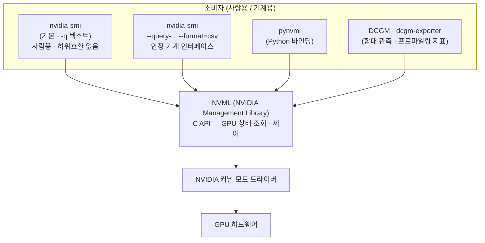
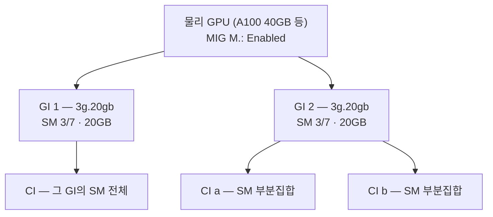

이 글은 [NVIDIA 공식 문서](https://docs.nvidia.com/deploy/nvidia-smi/)(nvidia-smi 레퍼런스, MIG User Guide, Driver Persistence, DCGM, NVIDIA Container Toolkit)의 내용을 정리한 노트입니다. `nvidia-smi`의 기본 출력 필드, 스크립트용 쿼리 모드, 모니터링 루프, 관리 명령, MIG, 토폴로지, 종료 코드까지를 다룹니다.

`nvidia-smi`는 NVIDIA GPU를 확인하고 설정을 바꾸는 명령줄 도구입니다. GPU가 얼마나 바쁜지, VRAM을 얼마나 쓰는지, 어떤 프로세스가 붙어 있는지를 한 장으로 보여주고 전력 캡·클럭·MIG 같은 드라이버 설정도 바꿉니다. 이 도구를 쓸 때 가장 흔한 오해 하나가 `GPU-Util 100%`를 "GPU를 꽉 쓰고 있다"로 읽는 것인데, 이 지표는 그런 뜻이 아닙니다(자세한 정의는 아래 GPU-Util 절).

## nvidia-smi란 무엇인가

`nvidia-smi`(NVIDIA System Management Interface)는 NVIDIA GPU를 **모니터링**하고 **관리**하는 명령줄 유틸리티입니다. 핵심 성질은 다음과 같습니다.

- [NVML](https://developer.nvidia.com/management-library-nvml)(NVIDIA Management Library, GPU 상태와 제어를 노출하는 C 기반 API) 위에 얹힌 **얇은 CLI 래퍼**입니다. `nvidia-smi`가 출력하는 모든 값은 NVML이 프로그래밍 API로도 노출하며, `nvidia-smi`는 그 값을 사람이 읽게 보여주는 NVML의 프런트엔드입니다.
- **NVIDIA GPU 드라이버에 포함되어 배포됩니다.** 별도로 설치할 패키지가 없고 드라이버가 있으면 `nvidia-smi`도 있습니다. 리눅스에서는 `/usr/bin/nvidia-smi`, 윈도우에서는 `C:\Windows\System32\nvidia-smi.exe`(또는 드라이버 설치 디렉터리 하위)에 위치합니다.
- Tesla / 데이터센터(A100, H100, V100, T4, L4 등), Quadro / RTX 프로페셔널, GRID / vGPU, GeForce 전 제품군에서 동작합니다. 다만 **기능 지원은 제품과 드라이버에 따라 다릅니다.** ECC 설정, 전력 캡, persistence mode, MIG, accounting, application clock 같은 관리 기능은 Tesla/데이터센터와 고급 Quadro에서 완전 지원되고 consumer GeForce에서는 부분 지원되거나 지원되지 않습니다. 미지원 기능을 호출하면 종료 코드 3("operation unsupported on target device")을 반환합니다.
- **출력 포맷은 드라이버 릴리스 간 하위 호환을 보장하지 않습니다.** NVIDIA는 운영 도구에서 사람이 읽는 기본 출력이나 `-q` 출력을 파싱하지 말라고 명시합니다. 안정적인 기계 인터페이스인 `--query-...=... --format=csv`를 쓰거나, NVML / pynvml / DCGM에 직접 프로그래밍하는 방식을 권장합니다.
- 대부분의 읽기·모니터링 작업은 특별한 권한이 필요 없지만 대부분의 관리·설정 작업은 root(리눅스) 또는 Administrator(윈도우) 권한이 필요합니다.

명령군을 익숙한 도구에 대응시키면 다음과 같습니다. 인자 없는 `nvidia-smi`는 GPU용 `top`, `nvidia-smi dmon`은 GPU용 `vmstat`, `nvidia-smi -q`는 `/proc` 스타일 전체 덤프, `--query-*` 모드는 스크립트에서 파싱하기 좋은 export입니다.

다음 그림은 이 도구들이 어디에 얹혀 있는지를 나타냅니다. `nvidia-smi`·[pynvml](https://pypi.org/project/nvidia-ml-py/)·DCGM은 모두 커널 모드 드라이버 위의 NVML을 공유하며, 이 가운데 자동화가 계약으로 삼아도 되는 것은 `--query-... --format=csv`, pynvml, DCGM뿐입니다(사람용 기본/`-q` 텍스트는 아님).


```mermaid
flowchart TD
    subgraph clients["소비자 (사람용 / 기계용)"]
        smi_h["nvidia-smi<br/>(기본 · -q 텍스트)<br/>사람용 · 하위호환 없음"]
        smi_q["nvidia-smi<br/>--query-... --format=csv<br/>안정 기계 인터페이스"]
        pynvml["pynvml<br/>(Python 바인딩)"]
        dcgm["DCGM · dcgm-exporter<br/>(함대 관측 · 프로파일링 지표)"]
    end
    nvml["NVML (NVIDIA Management Library)<br/>C API — GPU 상태 조회 · 제어"]
    driver["NVIDIA 커널 모드 드라이버"]
    gpu["GPU 하드웨어"]

    smi_h --> nvml
    smi_q --> nvml
    pynvml --> nvml
    dcgm --> nvml
    nvml --> driver --> gpu
```

## 기본 출력 — 모든 필드

인자 없이 `nvidia-smi`를 실행하면 스냅샷 테이블이 출력됩니다. 대표적인 레이아웃은 다음과 같으며, 드라이버/CUDA 버전과 정확한 열 구성은 드라이버마다 조금씩 달라집니다.

```
+-----------------------------------------------------------------------------------------+
| NVIDIA-SMI 550.54.15              Driver Version: 550.54.15      CUDA Version: 12.4      |
|-----------------------------------------+------------------------+----------------------+
| GPU  Name                 Persistence-M | Bus-Id          Disp.A | Volatile Uncorr. ECC |
| Fan  Temp   Perf          Pwr:Usage/Cap |           Memory-Usage | GPU-Util  Compute M. |
|                                         |                        |               MIG M. |
|=========================================+========================+======================|
|   0  NVIDIA A100-SXM4-40GB      On      | 00000000:07:00.0 Off   |                    0 |
| N/A   34C    P0              63W / 400W |  19478MiB / 40960MiB   |     78%      Default |
|                                         |                        |             Disabled |
+-----------------------------------------+------------------------+----------------------+

+-----------------------------------------------------------------------------------------+
| Processes:                                                                              |
|  GPU   GI   CI        PID   Type   Process name                              GPU Memory |
|        ID   ID                                                               Usage      |
|=========================================================================================|
|    0   N/A  N/A     12345      C   python                                     19450MiB  |
+-----------------------------------------------------------------------------------------+
```


### 헤더 라인

- **NVIDIA-SMI `<x.y.z>`** — `nvidia-smi` 도구 자체의 버전(드라이버 빌드를 따라감).
- **Driver Version** — 설치된 NVIDIA 커널 모드 드라이버 버전(예: `550.54.15`).
- **CUDA Version** — **설치된 드라이버가 지원하는 최대 [CUDA](https://docs.nvidia.com/cuda/) 런타임 버전**입니다. *드라이버의* CUDA 지원 능력이지, 컴파일에 쓴 CUDA 툴킷 버전이 아닙니다. "CUDA Version: 12.4"를 표시하는 드라이버는 CUDA 12.4 이하 애플리케이션을 실행할 수 있다는 뜻이며, CUDA 12.4 툴킷이 설치돼 있다는 뜻은 아닙니다.

### GPU 블록 — 윗줄

- **GPU** — 0부터 시작하는 장치 **인덱스**(0, 1, 2, ...). `-i`가 쓰는 기본 ID이며, 드라이버가 부여하는 열거 순서입니다(`CUDA_DEVICE_ORDER=PCI_BUS_ID`를 지정하지 않으면 PCI 순서와 일치한다는 보장이 없습니다).
- **Name** — 제품 마케팅 이름(예: `NVIDIA A100-SXM4-40GB`, `Tesla V100-PCIE-16GB`, `NVIDIA L4`).
- **Persistence-M** — **Persistence Mode** 플래그(`On`/`Off`). `On`이면 CUDA 앱·X 서버·`nvidia-smi` 같은 클라이언트가 GPU를 쓰지 않을 때도 드라이버가 초기화·로드된 상태로 남습니다. 프로세스가 붙을 때마다 발생하는 **수 초짜리 드라이버 재초기화 지연을 피합니다**(관리 명령 절 참조). 리눅스 전용이며 `nvidia-persistenced`로 대체되는 방향으로 deprecated 되었습니다.
- **Bus-Id** — GPU의 **PCI 버스 주소**를 `domain:bus:device.function` 16진 형식으로 표시(예: `00000000:07:00.0`). 물리 슬롯을 구분하거나 `-i`에 넘길 때 씁니다.
- **Disp.A** — **Display Active**(`On`/`Off`). 이 GPU에 **디스플레이가 초기화·연결되어 있는지**(모니터를 구동하거나 디스플레이용 프레임버퍼가 할당됐는지)를 나타냅니다. 헤드리스 데이터센터 GPU에서는 `Off`입니다. (모니터가 물리적으로 연결됐는지를 뜻하는 "Display Mode"와는 다릅니다.)
- **Volatile Uncorr. ECC** — 마지막 카운터 리셋·재부팅 이후 발생한 **volatile uncorrectable ECC 에러** 수. `0`이 정상이고 0이 아니면서 늘어나는 값은 메모리 고장의 신호입니다. "Volatile"은 마지막 리셋 이후, "Aggregate"는 infoROM에 영속되는 누적치입니다. ECC가 미지원·비활성이면 `N/A`.

### GPU 블록 — 아랫줄

- **Fan** — 팬 속도를 **최대치 대비 백분율**로 표시. 능동 팬이 없는 수동 냉각 데이터센터 카드에서는 `N/A`가 뜨며, 에러가 아니라 정상입니다.
- **Temp** — 현재 **GPU 코어 온도**(°C). 슬로다운·셧다운 임계값(`-q -d TEMPERATURE`로 확인)과 비교합니다.
- **Perf** — **Performance State(P-State)**, `P0`–`P12`. **`P0`이 최고 성능**(부하 시 사용하는 최고 클럭), **`P12`가 최저·최심 유휴**(절전용 최저 클럭)입니다. 상태는 성능과 **역순**입니다(낮은 숫자 = 높은 클럭). 부하 시 P0–P2, 유휴 시 P8/P12가 일반적입니다.
- **Pwr:Usage/Cap** — **현재 전력 소비 / 전력 캡(한계)**, 둘 다 와트(예: `63W / 400W`). 왼쪽은 순간 보드 전력, 오른쪽은 적용된 전력 한계입니다. 오른쪽 값이 기본 최대치와 다르면 사용자가 지정한 `-pl` 한계가 걸린 것입니다. 전력 읽기가 미지원이면 `N/A`.
- **Memory-Usage** — **사용 / 전체 프레임버퍼(VRAM)**, MiB(예: `19478MiB / 40960MiB`). 여기 잡히는 값은 **점유된 프레임버퍼 메모리**이며, 드라이버/CUDA 컨텍스트 오버헤드와 프레임워크가 예약했지만 실제로는 쓰지 않는 메모리(PyTorch/TF의 캐싱 할당기가 흔히 큰 예약을 잡음)를 포함합니다. Memory-Usage가 높다고 연산량이 높은 것은 아닙니다.
- **GPU-Util** — **GPU 사용률(%)**(아래 GPU-Util 절의 주의 사항 참조). NVML 정의로는 *"지난 샘플 주기 동안 하나 이상의 커널이 GPU에서 실행되고 있던 시간의 비율"*입니다.
- **Compute M.** — **Compute Mode**(`Default` / `Exclusive_Process` / `Prohibited`, 관리 명령 절 참조). 몇 개의 CUDA 컨텍스트가 GPU를 공유할 수 있는지를 제어합니다.
- **MIG M.** — **MIG Mode**(`Enabled` / `Disabled` / `N/A`). Multi-Instance GPU 분할이 켜졌는지 여부이며, Ampere/Hopper+ 데이터센터 GPU에서만 유효합니다(MIG 절 참조).

### Processes 테이블

- **GPU** — 프로세스가 실행 중인 GPU의 인덱스.
- **GI ID** — **GPU Instance ID**(MIG 전용, MIG 비활성 시 `N/A`). 프로세스가 바인딩된 MIG GPU Instance를 식별합니다.
- **CI ID** — **Compute Instance ID**(MIG 전용, MIG 비활성 시 `N/A`). GI 내부의 Compute Instance를 식별합니다.
- **PID** — GPU 클라이언트의 운영체제 프로세스 ID.
- **Type** — 컨텍스트 종류.
  - **`C`** = **Compute**(CUDA) 컨텍스트.
  - **`G`** = **Graphics** 컨텍스트(X 서버, 게임, 렌더러 등).
  - **`C+G`** = Compute와 Graphics 컨텍스트를 **둘 다** 가진 프로세스.
  - 일부 드라이버는 `M+C` 등도 표시하며, 이때 `M`은 [MPS](https://docs.nvidia.com/deploy/mps/latest/index.html)(Multi-Process Service)입니다.
- **Process name** — 실행 파일 이름 / 명령(예: `python`, `/usr/lib/xorg/Xorg`).
- **GPU Memory Usage** — **이 프로세스에** 귀속된 프레임버퍼 메모리(MiB). 어떤 프로세스가 VRAM을 점유하는지 찾을 때 씁니다. (공유·드라이버 오버헤드 때문에 프로세스별 합이 테이블의 전체 Memory-Usage보다 작을 수 있습니다.)

> [!NOTE] Performance State는 성능과 역순이다
> `P0`(최고) → `P1`, `P2` … → `P8` … → `P12`(유휴/최저)로, **숫자가 낮을수록 클럭이 높습니다.** 부하 중 `P0`은 부스팅이 걸린 정상 상태이고 유휴 시 `P8`/`P12`는 정상 절전입니다. 부하 중인데 높은 번호의 P-state에 "묶여" 있다면 throttle나 전력·클럭 캡을 의심하고 `clocks_throttle_reasons.*`(쿼리 모드 절)나 `-q -d PERFORMANCE`로 원인을 확인합니다.

### GPU-Util이 실제로 뜻하는 것

`GPU-Util`은 "GPU가 *무엇이든* 하고 있었는가"를 시간으로 잰 값이지, 연산 자원을 얼마나 채웠는지를 재는 값이 아닙니다. 이 도구에서 가장 흔하고 값비싼 오해가 `GPU-Util: 100%`를 "GPU가 완전히·효율적으로 활용되고 있다"로 읽는 것입니다.

> **NVML의 정확한 정의:** GPU utilization은 *"지난 샘플 주기 동안 하나 이상의 커널이 GPU에서 실행되고 있던 시간의 비율"*입니다. 샘플 주기는 제품에 따라 대략 1초에서 1/6초 사이입니다.

- **GPU-Util은 점유를 *공간*이 아니라 *시간*으로 잽니다.** 단일 블록의 단일 스레드(`kernel<<<1,1>>>()`)라도 끊김 없이 돌면 GPU의 SM(streaming multiprocessor)을 극히 일부만 쓰면서도 GPU-Util은 **100%**를 보고합니다. 스레드 1개짜리 커널이 **GPU-Util 100%**를 보고하는 동안 **SM 점유율은 20% 미만**이었던 실험이 문서화되어 있습니다.
- **memory-bound와 compute-bound를 구분하지 못합니다.** 메모리를 기다리며 멈춰 있는 커널도 "실행 중"으로 세므로, 연산 유닛이 놀고 있는 메모리 대역폭 병목 작업도 GPU-Util 100%를 보일 수 있습니다.
- **Utilization ≠ Saturation.** *Utilization*은 GPU가 시간의 몇 %를 바빴는지이고, *Saturation*은 GPU의 실제 용량(SM 연산 처리량, 메모리 대역폭, 텐서 코어)을 얼마나 소비했는지입니다. GPU-Util은 앞의 질문만 답합니다.
- 실제 그림을 보려면 SM·파이프 수준 지표가 필요하고 이는 `nvidia-smi` 기본 화면이 제공하지 않습니다. 대신 다음을 씁니다.
  - `nvidia-smi dmon`의 `sm` 열(여전히 시간 기반 — "적어도 하나의 SM이 바빴던 시간의 %"이지만 GPU-Util보다 세분화됨),
  - 특히 **[DCGM](https://docs.nvidia.com/datacenter/dcgm/)(Data Center GPU Manager) 프로파일링 지표**: `DCGM_FI_PROF_SM_ACTIVE`(적어도 하나의 warp가 상주하는 SM 비율), `DCGM_FI_PROF_SM_OCCUPANCY`(warp 슬롯 점유율), `DCGM_FI_PROF_PIPE_TENSOR_ACTIVE`, `DCGM_FI_PROF_PIPE_FP32_ACTIVE`, `DCGM_FI_PROF_DRAM_ACTIVE`(메모리 대역폭 포화).

정리하면, GPU-Util 하나만 보고 "GPU가 바쁘다/효율적이다"라고 결론짓지 않습니다. 작업이 GPU-bound인지, 하드웨어가 포화됐는지 판단하기 전에 **GPU-Util + Memory-Usage + dmon `sm`% + DCGM SM_ACTIVE/occupancy + 텐서/DRAM 파이프 활성도**를 함께 봅니다.

## 쿼리 모드 — 스크립트용 안정 인터페이스

자동화에서는 **선택적 쿼리** 인터페이스를 씁니다. NVIDIA가 안정적이고 파싱 가능한 계약으로 취급하는 유일한 출력입니다.

### 문법

```bash
nvidia-smi --query-gpu=<comma,separated,fields> --format=csv[,noheader][,nounits]
```

- `--format=csv`는 `--query-*` 모드에서 **필수**입니다(여기서 지원되는 유일한 포맷).
- `noheader` — 열 헤더 줄을 생략(순수 데이터만 파싱).
- `nounits` — 단위를 제거(예: `63 W` 대신 `63`, `19478 MiB` 대신 `19478`). 깔끔한 숫자 파싱에 필수적입니다.
- 출력 열의 순서는 나열한 필드 순서를 따릅니다.

### 자주 쓰는 `--query-gpu` 필드

```
timestamp
name                 (alias: gpu_name)
index
uuid                 (alias: gpu_uuid)
pci.bus_id           (alias: gpu_bus_id)
driver_version
pstate
utilization.gpu      # % — 기본 GPU-Util과 같은 지표/주의사항
utilization.memory   # 메모리 R/W가 활성이던 시간의 % (VRAM 사용률 아님!)
memory.total         # MiB
memory.used          # MiB
memory.free          # MiB
memory.reserved      # MiB
temperature.gpu      # C
temperature.memory   # C (지원 시 HBM)
power.draw           # W
power.draw.instant   # W (신형 드라이버)
power.limit          # W
enforced.power.limit # W
power.min_limit / power.max_limit / power.default_limit
clocks.sm            (alias: clocks.current.sm)        # MHz
clocks.gr            (alias: clocks.current.graphics)   # MHz
clocks.mem           (alias: clocks.current.memory)     # MHz
clocks.current.video
clocks.max.sm / clocks.max.gr / clocks.max.mem
clocks.applications.graphics / clocks.applications.memory
fan.speed            # %
compute_mode
compute_cap          # CUDA compute capability, 예: 8.0
mig.mode.current / mig.mode.pending
pcie.link.gen.current / pcie.link.gen.max
pcie.link.width.current / pcie.link.width.max
ecc.errors.corrected.volatile.total
ecc.errors.uncorrected.volatile.total
clocks_throttle_reasons.active   # 비트마스크: 클럭이 캡된 이유
encoder.stats.sessionCount / encoder.stats.averageFps / encoder.stats.averageLatency
```

> [!WARNING] utilization.memory는 VRAM 사용률이 아니다
> `utilization.memory`는 사용 중인 VRAM의 백분율이 **아닙니다.** *"샘플 주기 동안 글로벌(장치) 메모리가 읽히거나 쓰인 시간의 비율"*입니다. "VRAM을 얼마나 쓰는가"는 **`memory.used` / `memory.total`**로 쿼리합니다.

### throttle 원인 — 클럭이 낮은 이유

`clocks_throttle_reasons.active`(및 개별 `clocks_throttle_reasons.*` 불리언)는 GPU가 최고 클럭에 있지 않은 *이유*를 알려줍니다.

```
clocks_throttle_reasons.gpu_idle
clocks_throttle_reasons.applications_clocks_setting
clocks_throttle_reasons.sw_power_cap          # 전력 한계 도달
clocks_throttle_reasons.hw_slowdown
clocks_throttle_reasons.hw_thermal_slowdown   # 과열
clocks_throttle_reasons.hw_power_brake_slowdown
clocks_throttle_reasons.sw_thermal_slowdown
clocks_throttle_reasons.sync_boost
```

작업이 기대만큼 성능을 못 낼 때 필수적입니다. 열 throttle인지, 전력 캡인지, 사용자가 설정한 application-clock 한계인지를 구분해 줍니다.

<details markdown="1">
<summary>심화: 프로세스·타깃 지정·필드 탐색 쿼리</summary>

**Compute 프로세스 쿼리** — 각 CUDA 프로세스의 PID, 이름, 프로세스별 VRAM(MiB)을 나열합니다.

```bash
nvidia-smi --query-compute-apps=pid,process_name,used_memory --format=csv
nvidia-smi --query-compute-apps=timestamp,gpu_uuid,pid,process_name,used_memory --format=csv,noheader,nounits
```

**특정 GPU 지정** — `-i`(`--id`)는 인덱스, 보드 시리얼, GPU UUID, PCI 버스 ID를 받습니다. 여러 개는 콤마로 구분(`-i 0,1`).

```bash
nvidia-smi -i 0 --query-gpu=...           # 인덱스로
nvidia-smi -i GPU-<uuid> --query-gpu=...  # UUID로
nvidia-smi -i 00000000:07:00.0 --query... # PCI 버스 id로
```

**쿼리 가능한 필드 탐색** — 사용 가능한 필드는 드라이버/제품마다 다르므로, 대상 호스트에서 `--help-query-gpu`가 권위 있는 목록입니다.

```bash
nvidia-smi --help-query-gpu            # 모든 --query-gpu 필드 + 설명
nvidia-smi --help-query-compute-apps   # --query-compute-apps 필드
nvidia-smi --help-query-accounted-apps
nvidia-smi --help-query-retired-pages
nvidia-smi --help-query-remapped-rows
nvidia-smi --help-query-supported-clocks
```

**그 밖의 쿼리 타깃**

```bash
nvidia-smi --query-compute-apps=...      --format=csv
nvidia-smi --query-accounted-apps=...    --format=csv   # 이력 (accounting mode)
nvidia-smi --query-retired-pages=...     --format=csv
nvidia-smi --query-remapped-rows=...     --format=csv    # Ampere+ row remapper
nvidia-smi --query-supported-clocks=...  --format=csv    # 유효한 -ac 조합
```

</details>

## 모니터링 / 루프 모드

한 시점 스냅샷이 아니라 GPU 상태를 시간에 따라 지켜보는 방법입니다. 명령 전체를 주기적으로 반복하거나(`-l`), 디바이스별 한 줄 스크롤(`dmon`)·프로세스별 한 줄 스크롤(`pmon`)로 찍습니다.

### 명령 전체를 반복

```bash
nvidia-smi -l 1            # 1초마다 기본 화면 재실행 (--loop=SEC)
nvidia-smi -l              # 인자 없으면 기본 5초 간격
nvidia-smi --query-gpu=timestamp,utilization.gpu,memory.used --format=csv -l 1
nvidia-smi --query-gpu=... --format=csv -lms 200   # --loop-ms: 200ms마다 (서브초)
```

- `-l SEC` / `--loop=SEC` — Ctrl+C까지 명령 전체를 `SEC`초마다 반복. 기본 5초.
- `-lms MS` / `--loop-ms=MS` — 같은 동작을 **밀리초** 단위로(고주기 샘플링용).

### `nvidia-smi dmon` — 장치 스크롤 모니터링

샘플·장치마다 **한 줄씩** 스크롤하며 출력합니다(최대 16개 GPU). 로그로 파이프하기 좋습니다.

```bash
nvidia-smi dmon
nvidia-smi dmon -i 0,1 -s pucm -c 100 -d 1 -o T
```

옵션:

- `-i <device_list>` — 대상 GPU.
- `-s <metric_groups>` — 지표 그룹(문자를 이어 붙임).
  - **`p`** = power & temperature
  - **`u`** = utilization (sm / mem / enc / dec)
  - **`c`** = proc & mem **clocks**
  - **`m`** = frame-buffer **memory** 사용
  - **`e`** = **ECC** 에러 & PCIe replay
  - **`t`** = PCIe **throughput**(rx/tx)
  - **`v`** = power/thermal **violations**
- `-c <count>` — N번 샘플 후 종료.
- `-d <interval>` — 샘플 간 초.
- `-o D|T` — **D**ate 또는 **T**ime 열을 앞에 붙임.
- `--format csv,nounit,noheader` — CSV 출력.

기본 `dmon` 열(`-s` 없을 때):

```
# gpu   pwr  gtemp  mtemp   sm   mem   enc   dec   mclk   pclk
```

- **gpu** 인덱스, **pwr** = 전력(W), **gtemp** = GPU 온도(°C), **mtemp** = 메모리 온도(°C), **mclk** = 메모리 클럭(MHz), **pclk** = 프로세서/그래픽 클럭(MHz).
- **sm** = "**적어도 하나의 SM**이 바빴던 시간의 %"(기본 GPU-Util보다 세분화되지만 여전히 시간 기반 프록시로, 원시 SM 점유율은 아님).
- **mem** = 메모리가 읽히거나 쓰인 시간의 %. **enc** / **dec** = NVENC 인코더 / NVDEC 디코더 사용률 %.


### `nvidia-smi pmon` — 프로세스별 모니터링

GPU마다, 샘플마다, **프로세스마다** 한 줄씩 출력합니다.

```bash
nvidia-smi pmon
nvidia-smi pmon -i 0 -s um -c 50 -d 1
```

- `-s u` = utilization 그룹, `-s m` = memory-usage 그룹(`um`으로 결합).
- `-c <count>`, `-d <delay>`, `-o D|T`는 dmon과 동일.

`pmon` 열:

```
# gpu   pid  type   sm   mem   enc   dec   fb   command
```

- **type** = `C`(compute) / `G`(graphics) / `C+G`.
- **sm/mem/enc/dec** = 그 프로세스의 엔진별 사용률 %.
- **fb** = 프로세스가 쓰는 프레임버퍼 메모리(MiB).
- **command** = 프로세스 이름.

<details markdown="1">
<summary>심화: daemon / replay (리눅스, root)</summary>

- `nvidia-smi daemon` — `/var/log/nvstats/`에 로그를 남기는 백그라운드 샘플러(PID는 `/var/run/nvsmi.pid`). 중지는 `-t`.
- `nvidia-smi replay -f <logfile> [-b HH:MM:SS] [-e HH:MM:SS]` — daemon 로그를 시간 구간으로 재생·추출.

</details>

## 관리 명령 (root / Administrator 필요)

이 명령들은 GPU 상태를 바꿉니다. 리눅스에서는 `sudo`를 앞에 붙입니다. **상당수는 재부팅 시 초기화됩니다**(항목별로 표기). GPU별 적용은 `-i`로 합니다.

> [!WARNING] 대부분의 설정은 재부팅 시 초기화된다
> `-pl`(전력 캡), `-ac`/`-lgc`/`-lmc`(클럭), `-c`(compute mode), MIG 레이아웃은 모두 부팅 때 리셋되므로 부팅마다 재적용해야 합니다([systemd](https://systemd.io/) 유닛, [GPU Operator](https://docs.nvidia.com/datacenter/cloud-native/gpu-operator/latest/index.html), [mig-parted](https://github.com/NVIDIA/mig-parted) 등). **예외는 ECC enable/disable 상태로, 이는 재부팅 후에도 유지됩니다.**

### Persistence Mode — `-pm`

```bash
sudo nvidia-smi -pm 1        # 활성  (--persistence-mode=1)
sudo nvidia-smi -pm 0        # 비활성
```

활성 클라이언트가 없어도 드라이버를 **초기화·상주** 상태로 유지해, **첫 CUDA 앱이 수 초짜리 드라이버 초기화 비용을 물지 않게** 하고 클럭·ECC 같은 설정이 계속 적용되게 합니다. **리눅스 전용. 재부팅 시 비활성으로 초기화됩니다.**

> [!IMPORTANT] `-pm`은 deprecated, `nvidia-persistenced` 권장
> 레거시 persistence mode(`-pm`)는 **deprecated**이며 향후 릴리스에서 제거될 예정입니다. NVIDIA는 [NVIDIA Persistence Daemon `nvidia-persistenced`](https://docs.nvidia.com/deploy/driver-persistence/persistence-daemon.html) 사용을 권장합니다. 이 데몬은 커널 플래그를 세팅하는 대신 파일 디스크립터를 열어 두는 방식이라, 드라이버 리로드와 시스템 이벤트 전반에서 더 견고합니다. 드라이버 **319**부터 `nvidia-persistenced`가 실행 중이면 `nvidia-smi -pm 1`이 데몬의 RPC 인터페이스를 사용하고, 아니면 레거시 커널 플래그로 폴백합니다. 운영 환경에서는 `nvidia-persistenced`를 (보통 systemd 서비스로) 띄우는 것이 권장됩니다.

### Power Limit — `-pl`

```bash
sudo nvidia-smi -pl 250       # 보드 전력을 250W로 캡 (--power-limit=WATTS)
```

- **GPU의 [min_limit, max_limit] 범위 안**이어야 합니다(`power.min_limit`/`power.max_limit` 참조). 소수도 허용.
- Kepler+ 전용. **재부팅 시 유지되지 않으므로** 부팅 때 재적용합니다(또는 서비스로). 선택 옵션 `-sc/--scope`.

### Clocks — application clocks & locked clocks

```bash
# Application clocks (앱이 돌 클럭 설정): -ac <MEM,GRAPHICS>
sudo nvidia-smi -ac 1215,1410     # mem=1215MHz, graphics=1410MHz
sudo nvidia-smi -rac              # application clock 리셋 (--reset-applications-clocks)
nvidia-smi --query-supported-clocks=mem,gr --format=csv   # 유효 조합 확인

# 클럭을 범위로 잠금 (Volta+): -lgc / -lmc, 리셋은 -rgc / -rmc
sudo nvidia-smi -lgc 1400,1400    # GPU/graphics 클럭 잠금 (--lock-gpu-clocks=MIN,MAX)
sudo nvidia-smi -lmc 877,877      # 메모리 클럭 잠금 (--lock-memory-clocks=MIN,MAX)
sudo nvidia-smi -rgc              # 잠근 GPU 클럭 리셋 (--reset-gpu-clocks)
sudo nvidia-smi -rmc              # 잠근 메모리 클럭 리셋
```

Locked/application clocks는 **재현 가능한 벤치마크를 위해 클럭을 고정**하거나 전력·열을 이유로 클럭을 제한할 때 씁니다. **재부팅 시 유지되지 않습니다.** `-ac`/`-rac`는 데이터센터 제품에서, `-lgc`/`-lmc`는 Volta+에서 유효합니다.

### ECC — `-e`

```bash
sudo nvidia-smi -e 1     # ECC 활성  (--ecc-config=1)
sudo nvidia-smi -e 0     # ECC 비활성
sudo nvidia-smi -p 0     # volatile ECC 에러 카운트 리셋 (--reset-ecc-errors)
```

ECC 토글은 **적용되려면 GPU 리셋이나 재부팅이 필요합니다.** 대부분의 설정과 달리 **ECC enable/disable 상태는 재부팅 후에도 유지됩니다**(GPU에 저장). ECC를 끄면 VRAM이 약간 늘고 유효 대역폭이 조금 올라가지만 에러 정정을 포기하는 대가가 있습니다.

### Compute Mode — `-c`

```bash
sudo nvidia-smi -c 0     # DEFAULT            — 여러 컨텍스트/프로세스가 GPU 공유 가능
sudo nvidia-smi -c 1     # EXCLUSIVE_PROCESS  — 프로세스 하나만 (그 스레드들은 공유 가능)
sudo nvidia-smi -c 2     # PROHIBITED         — CUDA 컨텍스트 불가
sudo nvidia-smi -c 3     # EXCLUSIVE_PROCESS  (일부 문서) — 아래 주석 참조
```

모드(canonical NVML 값): **0 = Default**, **1 = Exclusive_Thread(DEPRECATED)**, **2 = Prohibited**, **3 = Exclusive_Process**. 실무의 최신 문서·사용은 Default / Exclusive_Process / Prohibited로 매핑합니다. `EXCLUSIVE_PROCESS`는 배치 스케줄러가 우발적 GPU 공유를 막을 때 흔히 씁니다. **재부팅 시 DEFAULT로 초기화됩니다.**

> [!NOTE] Compute mode 숫자 매핑은 출처마다 갈린다
> canonical NVML enum은 `0=Default, 1=Exclusive_Thread(deprecated), 2=Prohibited, 3=Exclusive_Process`이지만, 일부 문서는 `1=Exclusive_Process`로 표기합니다. 대상 드라이버에서 `nvidia-smi -q -d COMPUTE`로 실제 라벨을 확인합니다.

<details markdown="1">
<summary>심화: GPU 리셋·accounting·그 밖의 관리 플래그</summary>

**GPU 리셋 — `-r`** — 호스트 재부팅 없이 HW/SW 상태를 지웁니다. **GPU에 활성 클라이언트/프로세스가 없어야** 합니다(먼저 모든 CUDA 앱 종료). Ampere 이전 NVLink 시스템에서는 연결된 GPU들을 함께 리셋해야 할 수 있습니다.

```bash
sudo nvidia-smi -r            # GPU 리셋 — 기본 Function-Level Reset (--gpu-reset)
sudo nvidia-smi -r -i 0       # GPU 0만 리셋
sudo nvidia-smi -r bus        # bus-level 리셋
```

**Accounting Mode — `-am`** — 프로세스별 GPU/메모리 사용 이력을 기록해 끝난 작업을 감사할 수 있게 합니다. Kepler+, admin 필요.

```bash
sudo nvidia-smi -am 1        # 프로세스별 accounting 활성 (--accounting-mode=1)
sudo nvidia-smi -caa         # accounted-apps 이력 클리어 (--clear-accounted-apps)
nvidia-smi --query-accounted-apps=pid,gpu_util,max_memory_usage,time --format=csv
```

**그 밖의 관리 플래그**

```bash
sudo nvidia-smi -gom 0        # GPU Operation Mode: 0=ALL_ON, 1=COMPUTE, 2=LOW_DP (일부 GPU)
sudo nvidia-smi -gtt 83       # GPU 목표 온도 설정 (°C)
```

</details>

## MIG (Multi-Instance GPU)

**MIG**는 하나의 Ampere/Hopper+ 데이터센터 GPU(A100, A30, H100, H200 등)를 **최대 7개의 격리된 GPU Instance**로 나눕니다. 각 인스턴스는 **전용 SM, L2 캐시 슬라이스, 메모리, 메모리 대역폭**을 가지며, time-slicing이나 MPS와 달리 fault isolation을 갖춘 진짜 공간적 하드웨어 분할입니다.

### 2계층 구조

- **GI (GPU Instance)** — 최상위 슬라이스. 물리 GPU에서 잘라낸 고정 비율의 SM + 메모리 + 엔진. **GI ID**로 식별합니다.
- **CI (Compute Instance)** — GI *내부*의 세분으로, 그 GI가 가진 연산(SM)의 부분집합을 소유합니다. GI는 최소 하나의 CI를 가지며, GI를 여러 CI로 쪼개면 여러 CUDA 프로세스가 한 GI의 메모리를 공유하면서 연산은 격리할 수 있습니다. **CI ID**로 식별합니다.

즉 MIG 장치 = `GPU : GI : CI`입니다. 이 ID들이 곧 기본 `nvidia-smi` Processes 테이블의 **GI ID / CI ID 열**입니다. 아래 그림은 한 물리 GPU가 두 계층으로 쪼개지는 예시입니다.


```mermaid
flowchart TD
    gpu["물리 GPU (A100 40GB 등)<br/>MIG M.: Enabled"]
    gi1["GI 1 — 3g.20gb<br/>SM 3/7 · 20GB"]
    gi2["GI 2 — 3g.20gb<br/>SM 3/7 · 20GB"]
    ci1a["CI — 그 GI의 SM 전체"]
    ci2a["CI a — SM 부분집합"]
    ci2b["CI b — SM 부분집합"]

    gpu --> gi1
    gpu --> gi2
    gi1 --> ci1a
    gi2 --> ci2a
    gi2 --> ci2b
```

GI는 메모리·엔진까지 통째로 격리하는 최상위 슬라이스이고 CI는 한 GI 안에서 연산(SM)만 더 쪼개 여러 프로세스가 같은 GI 메모리를 공유하되 연산은 분리하게 합니다.

### MIG 모드 활성/비활성

```bash
sudo nvidia-smi -i 0 -mig 1     # GPU 0에서 MIG 활성  (--multi-instance-gpu=1)
sudo nvidia-smi -i 0 -mig 0     # 비활성
```

- **실행 중인 GPU 클라이언트/프로세스가 없어야** 합니다. **Ampere**에서는 MIG 활성에 **GPU 리셋**(또는 재부팅)이 필요하고 **Hopper+**에서는 즉시 적용됩니다.
- **MIG 모드와 인스턴스 레이아웃은 재부팅 시 유지되지 않으므로** 부팅 때 재구성하거나 `mig-parted` / GPU Operator 같은 자동화를 씁니다.

### GPU Instance 프로파일 & 생성

프로파일 이름 `Ng.Mgb`는 **N개 compute 슬라이스, M GB 메모리**를 뜻합니다(예: `3g.20gb` = SM의 3/7, 20 GB).

```bash
nvidia-smi mig -lgip                 # 사용 가능한 GPU-Instance 프로파일 목록
# 예: MIG 1g.5gb (ID 19), 2g.10gb (ID 14), 3g.20gb (ID 9),
#     4g.20gb (ID 5), 7g.40gb (ID 0)   ← 프로파일 이름: <compute slices>g.<memory>gb

sudo nvidia-smi mig -cgi 9,9         # 프로파일 ID로 3g.20gb GI 두 개 생성 (--create-gpu-instance)
sudo nvidia-smi mig -cgi 3g.20gb -C  # 이름으로 GI 생성 AND (-C) compute instance 자동 생성
nvidia-smi mig -lgi                  # 생성된 GPU instance 목록
```

### Compute Instance 프로파일 & 생성

```bash
nvidia-smi mig -lcip                          # compute-instance 프로파일 목록
sudo nvidia-smi mig -gi <GI_ID> -cci <prof>   # GI 안에 CI 생성 (--create-compute-instance)
nvidia-smi mig -lci                           # 생성된 compute instance 목록
```

### 해제 (순서: CI 먼저, 그다음 GI)

```bash
sudo nvidia-smi mig -dci          # compute instance 파괴 (--destroy-compute-instance)
sudo nvidia-smi mig -dgi          # GPU instance 파괴    (--destroy-gpu-instance)
```

### MIG 장치 사용

- `nvidia-smi`에서 GPU 블록은 `MIG M.: Enabled`를 표시하고 각 `GPU / GI ID / CI ID / MIG Device`를 자체 메모리 줄과 함께 나열하는 **MIG devices 하위 테이블**을 보여줍니다.
- MIG 슬라이스는 **MIG UUID**(`MIG-<uuid>`, `nvidia-smi -L`로 확인)나 `<GPU>:<MIG_index>` 형식을 `CUDA_VISIBLE_DEVICES`에 넘겨 지정합니다. CUDA 프로세스는 자신이 고정된 MIG 인스턴스 하나만 보게 됩니다.

## 토폴로지 & 연결성

멀티 GPU 호스트에서 GPU·NIC이 서로 어떻게 연결됐는지(NVLink·PCIe 경로)를 보는 명령입니다. 어느 GPU 쌍이 빠른 링크로 붙어 있는지는 멀티 GPU 통신 성능과 프로세스를 가까운 GPU에 고정하는 데 직접 영향을 줍니다.

### `nvidia-smi topo -m` — 연결 매트릭스

```bash
nvidia-smi topo -m
```

모든 GPU/NIC가 서로 **어떻게 연결되는지 N×N 매트릭스**로 출력하고 **CPU/NUMA affinity** 열(각 GPU에 가장 가까운 CPU 코어 / NUMA 노드)을 함께 보여줍니다. [NCCL](https://docs.nvidia.com/deeplearning/nccl/user-guide/docs/) 튜닝과 프로세스를 GPU 근처에 고정할 때 필수적입니다. 범례(지연·대역폭 기준 좋음 → 나쁨):

| 기호 | 의미 |
|---|---|
| **`X`** | 자기 자신 |
| **`NV#`** | **# 개의 NVLink** 묶음으로 연결(최상 — 직접 GPU-GPU) |
| **`PIX`** | **PCIe 브리지 하나만** 통과 |
| **`PXB`** | **여러 PCIe 브리지**를 통과(단 PCIe Host Bridge / CPU는 아님) |
| **`PHB`** | **PCIe Host Bridge**를 통과(보통 CPU) |
| **`NODE`** | PCIe **+** 한 NUMA 노드 안의 PCIe Host Bridge 간 인터커넥트를 통과 |
| **`SYS`** | PCIe **+** NUMA 노드 간 SMP 인터커넥트(QPI/UPI 등)를 통과 — 최악 |

매트릭스는 장치별 **CPU Affinity**와 **NUMA Affinity** 열도 보여줍니다.


관련 `topo` 서브커맨드:

```bash
nvidia-smi topo -mp            # PCI 전용 연결성
nvidia-smi topo -c <CPU_NUM>   # 특정 CPU에 가까운 GPU
nvidia-smi topo -p2p rwnap     # P2P 능력 매트릭스 (read/write/nvlink/atomics/pci)
nvidia-smi topo -gpu / -nic / -nvme / -cpu / -all
```

### `nvidia-smi nvlink` — NVLink 상세

```bash
nvidia-smi nvlink -s     # NVLink 상태 (링크별 상태·속도, 예: 26.562 GB/s)
nvidia-smi nvlink -c     # NVLink 능력
nvidia-smi nvlink -e     # NVLink 에러 카운터 (CRC/replay/recovery)
nvidia-smi nvlink -i <ID> -l <LINK>   # GPU의 특정 링크 지정
```

`-s`로 기대한 NVLink가 모두 정상 속도로 올라왔는지 확인하고 `-e`로 멀티-GPU 대역폭을 갉는 링크 에러를 잡습니다.

## 그 밖의 유용한 호출

### GPU와 UUID 나열 — `-L`

`-i` / `CUDA_VISIBLE_DEVICES`에 넣을 **GPU와 MIG UUID**를 가장 빠르게 얻는 방법입니다.

```bash
nvidia-smi -L
# GPU 0: NVIDIA A100-SXM4-40GB (UUID: GPU-xxxxxxxx-....)
#   MIG 3g.20gb     Device  0: (UUID: MIG-xxxxxxxx-....)   ← MIG 슬라이스도 나열됨
```

### 전체 상세 덤프 — `-q`

`-q`는 기본 테이블보다 훨씬 많은 것을 노출합니다. 클럭 임계값, 모든 ECC 버킷, BAR1 메모리, retired/remapped pages, GSP 펌웨어 버전, 전압, accounting, 인코더/FBC 통계, 보드 시리얼 등입니다.

```bash
nvidia-smi -q              # 사람용, 모든 GPU의 모든 속성
nvidia-smi -q -x           # XML 포맷 (--xml-format); 기계 판독용이지만 장황
nvidia-smi -q -x --dtd     # DTD 포함
nvidia-smi -q -i 0         # GPU 0만 전체 덤프
nvidia-smi -q -f out.txt   # 파일로 기록 (-f / --filename, 덮어씀)
```

### 그룹 필터 상세 덤프 — `-q -d <GROUP>`

```bash
nvidia-smi -q -d TEMPERATURE         # 온도 섹션만 (+ 임계값)
nvidia-smi -q -d POWER               # 전력 소비 + 모든 한계
nvidia-smi -q -d CLOCK               # 현재/최대/앱 클럭
nvidia-smi -q -d MEMORY              # FB + BAR1 메모리 상세
nvidia-smi -q -d UTILIZATION         # 샘플 포함 사용률
nvidia-smi -q -d ECC                 # 전체 ECC 에러 테이블
nvidia-smi -q -d MEMORY,POWER -i 0   # 그룹 결합, GPU 0 지정
```

유효 그룹: `MEMORY, UTILIZATION, ECC, TEMPERATURE, POWER, CLOCK, COMPUTE, PIDS, PERFORMANCE, SUPPORTED_CLOCKS, PAGE_RETIREMENT, ACCOUNTING, ENCODER_STATS, ROW_REMAPPER, FBC_STATS, VOLTAGE, GSP_FIRMWARE_VERSION`(및 드라이버에 따라 추가).

### 종료 코드 (스크립트에서 유용)

| 코드 | 의미 |
|---|---|
| `0` | 성공 |
| `2` | 잘못된 인자/플래그 |
| `3` | 대상 장치에서 **미지원** 작업 |
| `4` | **권한 부족**(root/admin 필요) |
| `6` | 객체 쿼리 실패 |
| `8` | 외부 전원 케이블이 제대로 연결되지 않음 |
| `9` | **드라이버 미로드** |
| `10` | 커널이 GPU 인터럽트 문제 감지 |
| `12` | **NVML 공유 라이브러리 없음 / 로드 불가** |
| `13` | 로컬 NVML 버전이 해당 함수를 구현하지 않음 |
| `14` | infoROM 손상 |
| `15` | **GPU 접근 불가 / 버스에서 이탈** |
| `255` | 기타/내부 드라이버 에러 |

## 실무 패턴

앞의 명령들을 실무에서 조합하는 방식입니다. 인터랙티브 관찰과 CSV 로깅, 사용률을 여러 지표로 정확히 읽기, 컨테이너 안에서의 실행을 다룹니다.

### `watch` vs `-l` vs `dmon`

```bash
watch -n1 nvidia-smi          # 매초 전체 화면 다시 그림. 편하지만 매 tick마다 새
                              #   nvidia-smi 프로세스를 띄움 (초기화 오버헤드·화면 깜빡임)
nvidia-smi -l 1               # 내장 루프; 프로세스 하나가 갱신 — watch보다 가벼움
nvidia-smi dmon -s u          # 라이브 *추세*와 로깅에 최적 — 스크롤하는 한 줄 샘플
```

기준: 대화형으로 한눈에 볼 때는 `watch -n1 nvidia-smi`나 `-l 1`, 시계열을 남기거나 추세를 볼 때는 `dmon`(또는 아래 CSV 쿼리 루프)입니다.

### CSV 시계열을 파일로 로깅

```bash
nvidia-smi \
  --query-gpu=timestamp,index,utilization.gpu,utilization.memory,memory.used,memory.total,temperature.gpu,power.draw,clocks.sm \
  --format=csv,nounits -l 1 >> gpu_metrics.csv
# 시간에 따른 프로세스별 VRAM:
nvidia-smi --query-compute-apps=timestamp,pid,process_name,used_memory \
  --format=csv,nounits -lms 500 >> gpu_procs.csv
```

첫 기록에는 **헤더**를 남겨(`noheader`를 빼고) 자기 기술적인 CSV로 만들고 `timestamp`로 각 행에 벽시계 시각을 붙입니다.

### 사용률을 *제대로* 읽기 (전체 그림)

GPU-Util 하나만 믿지 않고(GPU-Util 절) 여러 지표를 함께 봅니다.

```bash
nvidia-smi --query-gpu=utilization.gpu,utilization.memory,memory.used,clocks.sm,clocks.mem,clocks_throttle_reasons.active --format=csv -l 1
nvidia-smi dmon -s um               # sm% + mem% + 장치별 enc/dec
dcgmi dmon -e 1002,1003,1004,1005   # DCGM: SM_ACTIVE, SM_OCCUPANCY, TENSOR_ACTIVE, DRAM_ACTIVE
```

- **GPU-Util 높음 + dmon `sm`% 높음 + DCGM SM_ACTIVE/occupancy 높음** → 진짜 compute-bound.
- **GPU-Util 높지만 `sm`%/SM_ACTIVE 낮음** → 저활용 커널(블록/스레드가 너무 적거나 실행이 직렬화됨).
- **`memory.used` 높지만 GPU-Util 낮음** → 프레임워크가 유휴 상태로 VRAM만 쥐고 있음(캐싱 할당기에서 흔함) — 연산 병목이 아님.
- **DRAM_ACTIVE 높고 TENSOR/FP32 낮음** → 메모리 대역폭 병목.

### 컨테이너 주의 (Docker / Kubernetes)

- 컨테이너 안의 `nvidia-smi`는 **기본적으로 동작하지 않습니다.** 컨테이너에 [NVIDIA Container Toolkit](https://docs.nvidia.com/datacenter/cloud-native/container-toolkit/latest/sample-workload.html)이 필요합니다(호스트 드라이버 라이브러리, `nvidia-smi`, 장치 노드를 컨테이너에 주입). 없으면 "command not found"가 나거나 장치가 보이지 않습니다.
- [Docker](https://docs.docker.com/)에서는 GPU 접근을 노출해 실행합니다. 예:
  ```bash
  docker run --rm --gpus all nvidia/cuda:12.4.0-base-ubuntu22.04 nvidia-smi
  # 또는:  docker run --rm --runtime=nvidia --gpus all ... nvidia-smi
  ```
- 컨테이너 안의 `nvidia-smi`는 **호스트의 물리 GPU**(컨테이너에 노출된 것)를 보고합니다. "컨테이너 GPU"라는 것은 없습니다. `NVIDIA_VISIBLE_DEVICES`가 어떤 GPU를 노출할지, `NVIDIA_DRIVER_CAPABILITIES`(예: `compute,utility`)가 어떤 드라이버 라이브러리/바이너리(CUDA, NVML, `nvidia-smi`)를 마운트할지 제어합니다.
- **드라이버는 호스트에 있고** 컨테이너는 CUDA 사용자 공간만 담습니다. 컨테이너의 CUDA 버전은 호스트 드라이버가 지원하는 CUDA 버전(헤더의 "CUDA Version") 이하여야 합니다.

### 함대 규모 대안: DCGM-exporter

함대(fleet) 규모에서는 `nvidia-smi`를 셸 루프로 스크랩하는 대신 [DCGM-exporter](https://github.com/NVIDIA/dcgm-exporter)를 씁니다. DCGM 위에 얹힌 NVIDIA의 [Prometheus](https://prometheus.io/docs/) exporter입니다.

- HTTP `/metrics` 엔드포인트(기본 **포트 9400**)로 GPU 지표를 노출해 Prometheus가 스크랩하고 [Grafana](https://grafana.com/docs/grafana/latest/)로 시각화합니다.
- **독립 컨테이너**나 GPU 노드의 **[Kubernetes](https://kubernetes.io/docs/home/) DaemonSet**으로 돕니다(NVIDIA GPU Operator가 배포하는 것도 이것). 오버헤드 약 5%, 모든 데이터센터 GPU 지원.
- 지표 이름은 **`DCGM_FI_DEV_*`**(device)와 **`DCGM_FI_PROF_*`**(profiling) 접두사를 씁니다. 예: `DCGM_FI_DEV_GPU_UTIL`, `DCGM_FI_DEV_GPU_TEMP`, `DCGM_FI_DEV_FB_USED`/`DCGM_FI_DEV_FB_FREE`, 그리고 *진짜* 포화 지표인 `DCGM_FI_PROF_SM_ACTIVE`, `DCGM_FI_PROF_SM_OCCUPANCY`, `DCGM_FI_PROF_PIPE_TENSOR_ACTIVE`, `DCGM_FI_PROF_DRAM_ACTIVE`.
- `nvidia-smi` 대비 이점: 호스트별 셸 루프가 없고 다중 호스트 시계열을 중앙에서 다루며, 적절한 라벨(GPU UUID, k8s pod)과 장기 보존, 그리고 `nvidia-smi` 기본 화면이 줄 수 없는 SM/텐서/DRAM 포화 지표를 제공합니다.

`nvidia-smi`는 여전히 **대화형 디버깅, 일회성 점검, 관리·설정**에 맞는 도구이고 DCGM-exporter는 **지속적인 함대 관측**에 맞는 도구입니다.

## 흔한 함정 정리

1. **`GPU-Util`을 "연산 포화"로 읽음.** 이 값은 "커널이 돌던 시간의 %"일 뿐입니다. 100%가 SM 점유율 20% 미만과 공존할 수 있습니다. 항상 `dmon`의 `sm`%와 DCGM SM_ACTIVE/occupancy/tensor 지표로 확인합니다.
2. **`utilization.memory`를 "VRAM 사용률 %"로 오해.** 이 값은 "메모리가 읽히거나 쓰인 시간의 %"입니다. VRAM 사용은 `memory.used`/`memory.total`로 봅니다.
3. **Persistence mode 혼동.** `-pm 1`은 **deprecated**이며 `nvidia-persistenced`를 씁니다. 그리고 `-pm`은 재부팅을 넘기지 못하므로 재적용하거나 데몬을 서비스로 돌립니다.
4. **전력·클럭 변경이 재부팅 후 유지되지 않음.** `-pl`, `-ac`, `-lgc`, `-lmc`, compute mode(`-c`), MIG 레이아웃은 모두 재부팅 시 리셋됩니다. 부팅 때 재적용합니다(systemd 유닛, GPU Operator, `mig-parted`). ECC enable/disable 상태는 유지됩니다.
5. **MIG 모드는 실행 중인 프로세스가 없어야** 하고 Ampere에서는 활성에 **GPU 리셋**이 필요하며, MIG 레이아웃은 재부팅 시 유지되지 않습니다.
6. **GPU 인덱스 ≠ PCI 순서** — `CUDA_DEVICE_ORDER=PCI_BUS_ID`가 없으면 그렇습니다. 안정적 지정에는 (`-L`로 얻은) **UUID**를 선호합니다.
7. **`watch -n1 nvidia-smi`**는 매 tick마다 새 프로세스를 띄웁니다(추가 초기화 비용·깜빡임). 지속 모니터링에는 `-l 1`이나 `dmon`을 선호합니다.
8. **기본/`-q` 텍스트를 스크립트에서 파싱.** 그 출력은 안정적 계약이 아닙니다. `--query-...=... --format=csv`나 NVML/DCGM을 씁니다.
9. **`N/A` 필드(Fan, ECC, temperature.memory)는 일부 제품에서 정상**이며 에러가 아닙니다. 미지원 관리 작업은 종료 코드 3을 반환합니다.
10. **컨테이너 안 `nvidia-smi`**는 NVIDIA Container Toolkit이 필요하고 **호스트** GPU를 보여주며, 컨테이너 CUDA는 호스트 드라이버가 지원하는 CUDA 버전 이하여야 합니다.

## 참고 자료

- NVIDIA, [nvidia-smi reference](https://docs.nvidia.com/deploy/nvidia-smi/) — 플래그·옵션 레퍼런스, 쿼리 타깃, `-q -d` 그룹, 종료 코드, dmon/pmon, topo, nvlink, MIG 플래그.
- NVIDIA, [Multi-Instance GPU (MIG) User Guide](https://docs.nvidia.com/datacenter/tesla/mig-user-guide/getting-started-with-mig.html) — `-mig`, `mig -lgip/-cgi/-C/-lcip/-cci/-lgi/-lci/-dci/-dgi`, GI/CI 개념, 프로파일 이름, MIG UUID와 `CUDA_VISIBLE_DEVICES`.
- NVIDIA, [Driver Persistence — Persistence Daemon](https://docs.nvidia.com/deploy/driver-persistence/persistence-daemon.html) — `-pm` deprecation, `nvidia-persistenced`, 드라이버 319 RPC 폴백.
- NVIDIA, [DCGM-Exporter](https://docs.nvidia.com/datacenter/dcgm/latest/gpu-telemetry/dcgm-exporter.html) / [NVIDIA/dcgm-exporter (GitHub)](https://github.com/NVIDIA/dcgm-exporter) — Prometheus 포트 9400, `DCGM_FI_DEV_*` / `DCGM_FI_PROF_*` 지표, DaemonSet 배포.
- NVIDIA, [NVIDIA Container Toolkit](https://docs.nvidia.com/datacenter/cloud-native/container-toolkit/latest/sample-workload.html) — `--gpus all`, `NVIDIA_VISIBLE_DEVICES` / `NVIDIA_DRIVER_CAPABILITIES`, 호스트-GPU 패스스루.
- Arthur Chiao, [Understanding NVIDIA GPU Performance: Utilization vs. Saturation](https://arthurchiao.art/blog/understanding-gpu-performance/) — NVML GPU-Util 정의, `<<<1,1>>>` 커널의 100%-util-이지만-<20%-occupancy 실험, DCGM SM_ACTIVE/occupancy 구분.
