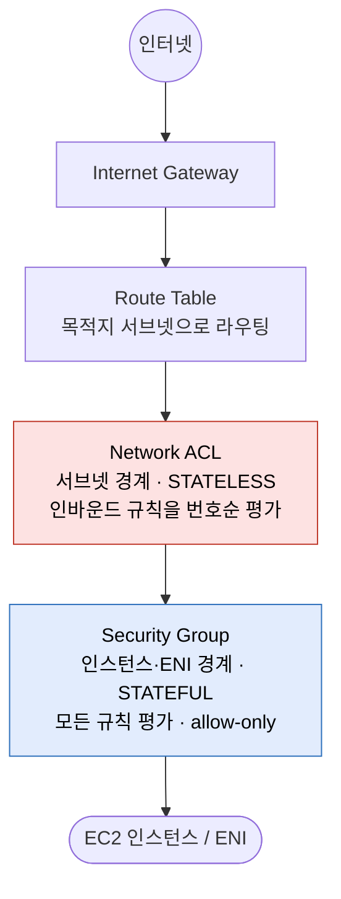
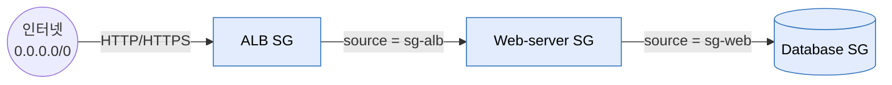

이 글은 [Amazon VPC](https://docs.aws.amazon.com/vpc/latest/userguide/what-is-amazon-vpc.html)의 두 가지 패킷 필터링 방화벽인 [Security Group](https://docs.aws.amazon.com/vpc/latest/userguide/vpc-security-groups.html)과 [Network ACL](https://docs.aws.amazon.com/vpc/latest/userguide/vpc-network-acls.html)을 AWS 공식 문서(Amazon VPC User Guide, Amazon EC2 User Guide) 기준으로 정리한 노트입니다. 두 메커니즘의 stateful/stateless 차이가 규칙 작성 방식을 어떻게 결정하는지, 그리고 각각의 기본값·평가 방식·한도·예외를 공식 표와 예제 중심으로 옮겼습니다. CIDR 표기법과 VPC·서브넷·라우트 테이블 기초는 [1편](/posts/aws-vpc/), 엣지·NAT(IGW·NAT Gateway·Elastic IP·ENI)는 [2편](/posts/aws-vpc-2/)에서 다뤘습니다.

## 두 방화벽의 위치

VPC는 네트워크 경로의 서로 다른 지점에서 동작하는 두 가지 패킷 필터링 방화벽을 제공합니다.

- **Security Group(SG)** — 인스턴스/ENI 레벨의 가상 방화벽. **stateful**, allow 규칙만 지원. AWS의 *기본(primary)* 네트워크 접근 제어 수단입니다.
- **Network ACL(NACL)** — 서브넷 레벨의 방화벽. **stateless**, allow와 deny를 모두 지원하며 번호순으로 평가됩니다. *보조(secondary)*·coarse-grained 가드레일이자 defense-in-depth 레이어입니다.

두 메커니즘 모두 추가 비용이 없습니다. 인터넷에서 인스턴스로 들어오는 인바운드 요청 기준으로, 패킷은 다음 순서로 각 컴포넌트를 통과합니다.

응답(리턴 트래픽)은 같은 컴포넌트를 역방향으로 통과합니다. 바로 이 지점에서 stateful/stateless 차이가 드러납니다. SG는 연결을 기억해 리턴 패킷을 자동 허용하지만, NACL은 기억하지 못해 리턴 트래픽용 명시적 아웃바운드 규칙을 요구합니다. 이것이 ephemeral port 문제의 뿌리입니다.

## Security Group

### 정의

Security Group은 자신이 연결된 리소스에 도달하거나 그 리소스를 떠나는 트래픽을 제어합니다. EC2 인스턴스에 연결하면 그 인스턴스의 인바운드/아웃바운드 트래픽을 제어하며, 규칙으로 명시적으로 허용한 트래픽만 인스턴스에 도달합니다.

SG는 **[Elastic Network Interface(ENI)](https://docs.aws.amazon.com/AWSEC2/latest/UserGuide/using-eni.html)** 에 연결됩니다. 모든 EC2 인스턴스는 최소 하나의 ENI를 가지므로 실무에서는 인스턴스 레벨로 간주합니다.

- 단일 리소스에 **여러 개의 SG**를 할당할 수 있습니다. 이때 규칙은 집계됩니다.
- SG는 **같은 VPC**의 리소스에 할당하거나, *Security Group VPC Association* 기능으로 **같은 Region의 다른 VPC** 리소스에도 할당할 수 있습니다.

VPC를 만들면 **default security group**이 함께 생성되며, 각자 인바운드/아웃바운드 규칙을 가진 SG를 추가로 만들 수 있습니다.

### stateful — 리턴 트래픽 자동 허용

SG의 가장 중요한 동작 특성입니다. 인스턴스에서 요청을 보내면 그에 대한 응답은 **인바운드 규칙과 무관하게** 인스턴스에 도달이 허용됩니다. 허용된 인바운드 트래픽에 대한 응답은 **아웃바운드 규칙과 무관하게** 인스턴스를 떠날 수 있습니다.

구체적으로:

- 인터넷의 클라이언트가 웹 서버의 **인바운드 TCP 443**으로 접속하면(허용해 둔 경우), 서버의 응답은 클라이언트의 ephemeral port로 나갑니다. 이때 **아웃바운드 규칙은 필요하지 않습니다.** 아웃바운드 규칙이 그 트래픽을 막게 되어 있더라도 SG의 connection tracking이 응답을 인식해 내보냅니다.
- 인스턴스가 **아웃바운드** 요청을 시작하면(예: 리포지토리로 TCP 443 `yum update`), 응답은 **인바운드**로 돌아옵니다. 이때 **인바운드 규칙은 필요하지 않습니다.**

규칙은 **연결이 시작되는 방향에 대해서만** 작성하면 되고, 리턴 절반은 자동으로 처리됩니다. SG 규칙 셋이 NACL보다 짧고 읽기 쉬운 이유입니다.

### connection tracking — statefulness의 구현

statefulness는 **connection tracking(conntrack)** 으로 구현됩니다. SG는 인스턴스를 오가는 트래픽 정보를 추적하고, 트래픽의 연결 상태를 기준으로 허용/거부를 판단합니다.

EC2 connection tracking 문서의 세부 사항:

- **TCP/UDP/ICMP 이외 프로토콜**은 IP 주소와 프로토콜 번호만 추적됩니다. 인스턴스가 다른 호스트로 트래픽을 보내고 그 호스트가 **600초 이내에** 같은 유형의 트래픽을 인스턴스로 보내면, 인바운드 규칙과 무관하게 응답 트래픽으로 간주되어 허용됩니다.
- **규칙을 변경해도 추적 중인 연결은 즉시 끊기지 않습니다.** SG는 기존 연결이 타임아웃될 때까지 패킷을 계속 허용합니다. 변경을 *즉시* 적용해야 한다면(예: 공격자 차단) NACL을 사용해야 합니다. 어느 방향이든 트래픽을 막는 NACL을 추가하면 기존 연결이 끊깁니다. 이것이 NACL을 도구함에 남겨 둘 실질적 이유입니다.

#### untracked 연결

모든 흐름이 추적되는 것은 아닙니다. conntrack 테이블 공간을 아끼기 위해, SG 규칙이 모든 트래픽(`0.0.0.0/0` 또는 `::/0`)에 대해 TCP/UDP 흐름을 허용하고 반대 방향에도 모든 포트(`0-65535`)의 응답 트래픽을 허용하는 대응 규칙이 있으면, 그 흐름은 **추적되지 않습니다(untracked)**.

untracked 흐름의 응답 트래픽은 추적 상태가 아니라 *규칙*에 근거해 허용됩니다. 결과적으로 untracked 흐름은 그것을 허용하던 규칙을 제거·수정하면 **즉시** 끊깁니다. 추적을 유지하는 항목이 없기 때문입니다. 반면 tracked 흐름은 규칙을 조여도 타임아웃까지 유지됩니다. 문서의 예: 아웃바운드가 열린 상태에서 모든 IP(`0.0.0.0/0`) 인바운드 SSH 규칙을 제거하면 기존 SSH 연결이 **즉시** 끊깁니다(추적된 적이 없으므로). 그러나 *좁은* 범위의 인바운드 SSH 규칙을 조이면 기존(추적 중인) 세션은 끊기지 않습니다.

#### 항상 추적되는 연결

위 규칙 형태와 무관하게 *항상* 추적되는 경로가 있습니다. Egress-only internet gateway, [Global Accelerator](https://docs.aws.amazon.com/global-accelerator/latest/dg/what-is-global-accelerator.html), **[NAT gateway](https://docs.aws.amazon.com/vpc/latest/userguide/vpc-nat-gateway.html)**, [Network Firewall](https://docs.aws.amazon.com/network-firewall/latest/developerguide/what-is-aws-network-firewall.html) endpoint, **[Network Load Balancer](https://docs.aws.amazon.com/elasticloadbalancing/latest/network/introduction.html)**, **[PrivateLink(interface VPC endpoint)](https://docs.aws.amazon.com/vpc/latest/privatelink/what-is-privatelink.html)**, **[AWS Lambda](https://docs.aws.amazon.com/lambda/latest/dg/configuration-vpc.html)**(Hyperplane ENI), DynamoDB gateway endpoint(DynamoDB 연결 하나당 conntrack 항목 2개 소비)가 여기에 해당합니다.

#### conntrack 용량과 idle 타임아웃

각 인스턴스는 **추적 가능한 최대 연결 수**를 가지며 초과하면 새 패킷이 드롭됩니다. `conntrack_allowance_available`과 `conntrack_allowance_exceeded` [ENA 네트워크 성능 지표](https://docs.aws.amazon.com/AWSEC2/latest/UserGuide/monitoring-network-performance-ena.html)로 모니터링합니다. [Nitro](https://docs.aws.amazon.com/ec2/latest/instancetypes/ec2-nitro-instances.html) 인스턴스에서는 ENI 레벨에서 세 가지 idle 타임아웃을 조정할 수 있습니다.

| 타임아웃 | 최소 | 최대 | 기본값 |
|---|---|---|---|
| **TCP established** | 60초 | 432000초(5일) | **350초**(Nitro v6, P6e-GB200 제외) / **432000초**(그 외 모든 인스턴스 타입) |
| **UDP**(단방향 / 단일 요청-응답) | 30초 | 60초 | 30초 |
| **UDP stream**(요청-응답 2회 이상) | 60초 | 180초 | 180초 |

> [!WARNING] Nitro v6 기본 타임아웃 변경
> Nitro v6 세대 인스턴스는 TCP-established 타임아웃 기본값이 **350초**로, 다른 인스턴스 타입의 **432000초**보다 훨씬 짧습니다. DB 풀·persistent HTTP·스트리밍 같은 장수명 연결은 실행 시 `TcpEstablishedTimeout`을 올리거나 **5분 미만 간격으로 TCP keep-alive**를 보내 추적 상태를 유지해야 합니다. AWS는 프로덕션 전 Nitro v6에서의 테스트를 명시적으로 권장합니다. 한편 Network Load Balancer를 통과하는 TCP/UDP는 모든 연결이 추적되며, NLB 레벨 idle 타임아웃은 ENI 레벨 값과 독립적으로 TCP 350초·UDP 120초입니다.

### 인스턴스/ENI 레벨

SG는 ENI에 바인딩되므로 서브넷이 아니라 개별 인스턴스 경계에서 필터링합니다. **같은 서브넷**의 두 인스턴스가 **완전히 다른** SG를 가질 수 있습니다. NACL은 서브넷 전체에 적용되므로 이렇게 할 수 없습니다. 이 특성 덕분에 SG는 서브넷 내부 **마이크로 세그먼테이션(micro-segmentation)** 에 적합합니다.

### allow 규칙만 — 암묵적 deny-all

SG에는 allow 규칙만 지정할 수 있고 deny 규칙은 지정할 수 없습니다. **명시적 deny가 존재하지 않으며**, 명시적으로 허용되지 않은 모든 것은 암묵적으로 거부됩니다. 판정은 이진입니다. 연결된 모든 SG를 통틀어 *어떤* 규칙이 허용하면 패킷이 통과하고, 그렇지 않으면 드롭됩니다. deny가 없으므로 **규칙 순서는 무의미**합니다.

새로 만든 커스텀 SG의 기본 상태:

- 처음 만든 SG는 **인바운드 규칙이 없습니다.** 인바운드 규칙을 추가하기 전까지 인바운드 트래픽은 허용되지 않습니다.
- 처음 만든 SG는 리소스의 **모든 아웃바운드 트래픽을 허용하는 아웃바운드 규칙**을 하나 가집니다. 이 규칙을 제거하고 특정 아웃바운드만 허용하는 규칙을 추가할 수 있습니다. 아웃바운드 규칙이 없으면 아웃바운드 트래픽은 허용되지 않습니다.

새 커스텀 SG는 **인바운드 전부 거부, 아웃바운드 전부 허용** 상태입니다.

### 전체 규칙을 한 번에 평가 — 순서·first-match 없음

공식 비교 표의 규칙 평가 항목에 따르면 SG는 트래픽 허용 여부를 결정하기 전에 **모든 규칙을 평가**합니다. allow 규칙만 있으므로 AWS는 집계된 *전체* 규칙 셋을 한 번에 고려하고 어느 규칙이든 매칭되면 허용합니다. 규칙 번호도, "가장 낮은 것 먼저"도, "first match wins"도 없습니다. NACL과 정반대입니다.

### 규칙 구성 요소

인바운드/아웃바운드 규칙은 각각 다음으로 구성됩니다.

- **Protocol** — 가장 흔한 것은 **6(TCP)**, **17(UDP)**, **1(ICMP)**. 표준 프로토콜 번호 또는 "All"을 지정할 수 있습니다.
- **Port range** — TCP/UDP/custom의 경우 단일 포트(`22`) 또는 범위(`7000-8000`).
- **ICMP type and code** — ICMP의 경우(예: type 8 = Echo Request / type 128 = ICMPv6 Echo Request).
- **Source**(인바운드) / **Destination**(아웃바운드) — 다음 중 *하나*:
  - `/32`가 붙은 단일 IPv4 주소(예: `203.0.113.1/32`).
  - `/128`이 붙은 단일 IPv6 주소(예: `2001:db8:1234:1a00::123/128`).
  - IPv4 CIDR 범위(예: `203.0.113.0/24`).
  - IPv6 CIDR 범위(예: `2001:db8:1234:1a00::/64`).
  - **prefix list의 ID**(예: `pl-1234abc1234abc123`) — [managed prefix list](https://docs.aws.amazon.com/vpc/latest/userguide/managed-prefix-lists.html).
  - **다른 security group의 ID**(예: `sg-1234567890abcdef0`) — *security group referencing*.
- **(선택) Description** — 최대 255자.

각 규칙에는 AWS가 부여하는 **고유 rule ID**가 있어, API/CLI에서 특정 규칙을 수정·삭제할 때 사용합니다.

> [!NOTE] SG로 막을 수 없는 트래픽
> SG는 Route 53 Resolver(“VPC+2” 주소 / AmazonProvidedDNS)로 향하는 DNS 요청을 **차단할 수 없습니다.** 이 경우 **[Route 53 Resolver DNS Firewall](https://docs.aws.amazon.com/Route53/latest/DeveloperGuide/resolver-dns-firewall.html)**을 사용합니다. 그 밖에 Amazon DNS, DHCP, [EC2 instance metadata(IMDS)](https://docs.aws.amazon.com/AWSEC2/latest/UserGuide/configuring-instance-metadata-service.html), ECS task metadata, Windows license activation, Amazon Time Sync Service, 예약된 VPC 라우터 IP로 오가는 트래픽도 필터링하지 않습니다.

### security group referencing — 티어드 아키텍처의 핵심 기능

규칙의 source 또는 destination으로 security group을 지정하면, 그 규칙은 해당 SG에 연결된 모든 인스턴스에 적용됩니다. 인스턴스들은 지정된 방향으로, 인스턴스의 **사설 IP 주소(private IP)** 를 사용해, 지정된 프로토콜·포트로 통신할 수 있습니다.

이것은 NACL이 근본적으로 흉내 낼 수 없는 기능이며, AWS가 SG를 "more versatile"하다고 표현하는 이유입니다. IP 범위를 하드코딩하는 대신 "**security group X에 속한 인스턴스로부터의** 트래픽을 허용"이라고 규칙을 씁니다. 인스턴스가 스케일 인/아웃해도 규칙이 그대로 동작하므로 CIDR 관리가 필요 없습니다.

문서의 정석 3-tier 예제(ALB → web → DB):

- **Load balancer SG**: 인터넷(`0.0.0.0/0`)에서 HTTP/HTTPS 허용.
- **Web-server SG**: **로드 밸런서 SG로부터만**(source = `sg-<alb>`) HTTP/HTTPS 허용.
- **Database SG**: **web-server SG로부터만**(source = `sg-<web>`) DB 포트 허용.

각 SG 규칙의 source가 IP가 아니라 *앞 티어의 SG*를 가리키는 구조는 다음과 같습니다.

인터넷 경계를 제외하면 어디에도 IP 주소가 등장하지 않습니다. 이것이 *security-group chaining*이며 티어드·마이크로 세그먼테이션 앱의 관용적 AWS 패턴입니다.

referencing 규칙과 주의점:

- 다른 SG의 **인바운드** 규칙에서 SG를 참조하려면 **같은 VPC**이거나, **[VPC peering](https://docs.aws.amazon.com/vpc/latest/peering/what-is-vpc-peering.html)** 또는 **[transit gateway](https://docs.aws.amazon.com/vpc/latest/tgw/what-is-transit-gateway.html)**로 연결되어 있어야 합니다.
- **아웃바운드** 규칙에서 참조하려면 **같은 VPC** 또는 **VPC peering**이어야 합니다(아웃바운드는 transit gateway 미지원).
- 참조되는 SG의 규칙은 참조하는 SG에 **추가되지 않습니다.** 규칙이 아니라 *멤버십*을 참조하는 것입니다.
- referencing은 참조된 그룹에 속한 인스턴스 **ENI의 사설 IP**와 매칭됩니다.
- **middlebox 주의:** 두 인스턴스 사이 트래픽을 middlebox 어플라이언스로 라우팅하면, source로 *상대 인스턴스의 SG*를 참조하는 방식은 **동작하지 않습니다.** 이 경우 상대 인스턴스의 **사설 IP 또는 서브넷 CIDR**을 참조해야 합니다.
- **stale 규칙:** 참조된 SG가 peer/shared VPC에 있고 그 VPC, peering 연결, 또는 SG가 삭제되면, 참조하던 규칙은 정리 가능한 **stale security group rule**이 됩니다.

### default security group

모든 VPC는 "default"라는 이름의 SG 하나를 가집니다.

- 규칙은 **변경할 수 있지만** **삭제할 수 없습니다**(`Client.CannotDelete` 오류).
- SG를 지정하지 않고 인스턴스를 띄우면 default SG에 연결됩니다.

**기본 인바운드 규칙** — *같은*(default) SG의 멤버로부터 오는 모든 트래픽을 **self-reference**로 허용:

| Source | Protocol | Port range | Description |
|---|---|---|---|
| `sg-…`(이 SG 자신의 ID) | All | All | 이 SG에 할당된 모든 리소스로부터의 인바운드 허용 |

**기본 아웃바운드 규칙** — 모든 아웃바운드 허용:

| Destination | Protocol | Port range | Description |
|---|---|---|---|
| `0.0.0.0/0` | All | All | 모든 아웃바운드 IPv4 트래픽 허용 |
| `::/0` | All | All | 모든 아웃바운드 IPv6 트래픽 허용(VPC에 IPv6 CIDR이 있을 때만) |

default SG는 **외부로부터의 인바운드 전부 거부, self-reference로 그룹 내부 인바운드는 전부 허용, 아웃바운드 전부 허용** 상태입니다. default SG에 함께 속한 두 인스턴스는 모든 포트/프로토콜로 통신할 수 있지만, internet gateway나 NAT gateway로부터의 트래픽은 **받지 못합니다.** AWS는 default SG에 의존하기보다 목적에 맞는 SG를 만들 것을 권장합니다.

### 한도/쿼터 (기본값, 별도 표기가 없으면 Region당)

| 쿼터 | 기본값 | 조정 가능 |
|---|---|---|
| **Region당** VPC security group | **2,500** | 가능 |
| SG당 **인바운드** 규칙 | **60** | 가능 |
| SG당 **아웃바운드** 규칙 | **60** | 가능 |
| **network interface(ENI)당** security group | **5** | 가능, **최대 16** |

이 수치의 주의할 세부 사항:

- 60개 규칙 쿼터는 **인바운드와 아웃바운드에 각각 별도로**, 그리고 **IPv4와 IPv6에 각각 별도로** 적용됩니다. 기본값에서 하나의 SG는 인바운드-IPv4 60개 + 인바운드-IPv6 60개 + 아웃바운드-IPv4 60개 + 아웃바운드-IPv6 60개를 담을 수 있습니다.
- **강한 결합:** 이 쿼터에 ENI당 security group 쿼터를 곱한 값이 **1,000을 넘을 수 없습니다.** ENI당 5개 SG면 SG당 규칙이 200개로 제한됩니다. SG당 규칙을 올리려면 ENI당 SG 수를 낮춰야 하고 그 반대도 마찬가지입니다. (기본값 60 × 5 = 300으로 1,000 아래에 여유가 있습니다.)

**규칙 카운팅 가중치**(하나의 규칙이 60개 한도에 얼마로 계산되는가):

- **CIDR**을 참조하는 규칙 = **1개**.
- **다른 security group**을 참조하는 규칙 = **1개**(그 SG가 얼마나 크든 무관).
- **customer-managed prefix list**를 참조하는 규칙 = prefix list의 **최대 크기**(예: 최대 20개 항목 리스트 = 20개).
- **AWS-managed prefix list**를 참조하는 규칙 = 리스트의 **weight**(예: weight 10 = 10개).

이 가중치 때문에 prefix list는 규칙 쿼터를 조용히 초과시킬 수 있습니다.

## Network ACL

### 정의

Network ACL은 **서브넷 레벨**에서 특정 인바운드/아웃바운드 트래픽을 허용하거나 거부합니다. VPC의 default network ACL을 쓰거나, 커스텀 network ACL을 만들어 **추가 보안 레이어**를 더할 수 있습니다.

NACL은 트래픽이 **서브넷에 들어오고 나갈 때** 평가되며, 서브넷 *내부*로 라우팅되는 트래픽에는 적용되지 않습니다. 서브넷 내부의 인스턴스 간 트래픽은 NACL로 필터링되지 않고 서브넷 경계를 넘는 트래픽만 필터링됩니다.

### stateless — 양방향을 모두 명시적으로 허용

NACL은 **stateless**이므로 이전에 주고받은 트래픽 정보가 **저장되지 않습니다.** 예를 들어 서브넷으로 들어오는 특정 인바운드 트래픽을 허용하는 규칙을 만들어도, 그에 대한 응답은 **자동으로 허용되지 않습니다.** security group과 대비되는 지점입니다.

커스텀 NACL 가이드에 따르면, **추가하는 모든 규칙마다 응답 트래픽을 허용하는 인바운드 또는 아웃바운드 규칙이 있어야 합니다.**

연결 상태가 없으므로 모든 연결의 리턴 절반은 자신만의 명시적 규칙이 필요합니다. 그리고 리턴 트래픽은 well-known 서비스 포트가 아니라 거의 항상 **ephemeral port**로 향합니다. 이것이 NACL 버그의 1순위 원인입니다.

### 서브넷 레벨 연결

- **모든** 서브넷은 반드시 NACL에 연결되어야 합니다. 명시적으로 연결하지 않으면 서브넷은 자동으로 **default NACL**을 사용합니다.
- 하나의 NACL은 **여러 서브넷**에 연결될 수 있지만, **하나의 서브넷은 한 번에 하나의 NACL에만** 연결됩니다. 서브넷에 NACL을 연결하면 이전 연결은 제거됩니다.

NACL은 서브넷 전체를 덮으므로 **coarse-grained** 제어입니다. SG와 달리 서브넷 내부의 개별 인스턴스를 구분하지 못합니다.

### allow와 deny 규칙

SG와 달리 각 규칙은 트래픽을 **허용하거나 거부**할 수 있습니다. 이것이 NACL의 강점입니다. SG가 물리적으로 표현할 수 없는 **명시적 deny**를 쓸 수 있습니다. 대표적 용도는 서브넷 경계에서 **특정 악성 IP/CIDR을 차단**하는 것입니다. allow-only인 SG로는 "이 IP 하나를 거부"를 표현할 수 없습니다.

### 번호순·first-match-wins 평가와 `*` catch-all

각 규칙은 **1부터 32766까지**의 번호를 가집니다. 트래픽 허용/거부를 결정할 때 **가장 낮은 번호의 규칙부터 순서대로** 평가합니다. **트래픽이 규칙에 매칭되면 그 규칙이 적용되고 더 높은 번호의 규칙은 그것과 모순되더라도 평가하지 않습니다.**

NACL 평가는 **번호순·first-match-wins**이며, SG의 "모든 규칙 평가" 모델과 정확히 반대입니다. 실무 지침:

- AWS는 나중에 규칙을 끼워 넣을 수 있도록 **10 또는 100 단위**로 번호를 매길 것을 권장합니다.
- **넓은 allow 안에서 일부를 deny**하려면(예: 넓은 ephemeral 범위 안에서 하나의 나쁜 포트 차단), **deny 규칙 번호가 넓은 allow보다 낮아야** first-match에서 먼저 걸립니다.

**asterisk(`*`) 규칙**은 필수 catch-all입니다. 규칙 번호가 `*`인 규칙은 패킷이 다른 어떤 번호 규칙에도 매칭되지 않을 때 **거부**되도록 보장합니다. 이 규칙은 **삭제할 수 없고 수정할 수 없으며**, 항상 `DENY`이고 항상 마지막에 평가됩니다.

### 규칙 구성 요소

NACL 규칙은 **Rule number**, **Type**(예: SSH/HTTP/custom range), **Protocol**(표준 프로토콜 번호. ICMP의 경우 type/code 설정 가능), **Port range**, **Source**(인바운드, **CIDR만**), **Destination**(아웃바운드, CIDR), **Allow/Deny**로 구성됩니다. NACL은 SG처럼 security group을 참조하거나 단일 인스턴스 추상화를 쓸 수 **없습니다.**

IPv4와 IPv6는 **별도로** 평가됩니다. IPv4 규칙은 IPv6 트래픽에 적용되지 않고 그 반대도 마찬가지이므로, 병렬 규칙 셋을 유지해야 합니다.

> [!WARNING] 배치 삭제·추가의 함정
> 인바운드/아웃바운드 규칙을 삭제하면서 허용된 개수보다 많은 새 항목을 추가하면, 삭제 대상 항목은 제거되지만 **새 항목은 추가되지 않습니다.** 한 번의 배치에서 삭제와 추가를 쿼터 초과로 섞으면 규칙 셋이 조용히 깨지고 스스로 락아웃될 수 있습니다.

### default NACL — 전부 허용

default network ACL은 연결된 서브넷을 오가는 **모든 트래픽을 허용**하도록 구성됩니다.

**기본 인바운드 규칙:**

| Rule # | Type | Protocol | Port range | Source | Allow/Deny |
|---|---|---|---|---|---|
| 100 | All IPv4 traffic | All | All | `0.0.0.0/0` | **ALLOW** |
| 101 | All IPv6 traffic | All | All | `::/0` | **ALLOW**(VPC에 IPv6 CIDR이 있을 때만) |
| `*` | All traffic | All | All | `0.0.0.0/0` | **DENY** |
| `*` | All IPv6 traffic | All | All | `::/0` | **DENY** |

**기본 아웃바운드 규칙**도 형태가 동일합니다. 규칙 100 ALLOW all IPv4, 규칙 101 ALLOW all IPv6, `*` DENY. 규칙 100이 모든 것을 먼저 매칭하므로 `*` DENY에는 도달하지 않고, default NACL은 사실상 완전히 열려 있어 security group을 **방해하지 않습니다.** 설계 의도입니다. AWS는 default NACL을 no-op로 두어 SG가 활성 제어가 되게 합니다.

### 커스텀 NACL — 규칙 추가 전까지 전부 거부

새로 만든 **커스텀** NACL은 두 개의 `*` DENY 규칙(IPv4 + IPv6)**만** 포함하고 다른 규칙은 없습니다. 명시적 allow 규칙을 추가하기 전까지 **모든 인바운드·아웃바운드를 거부**합니다. default NACL의 정반대이며, 흔한 함정입니다. 새 커스텀 NACL을 서브넷에 연결하는 순간 그 서브넷을 black-hole시키게 됩니다.

**커스텀 NACL 인바운드 규칙 예제**(퍼블릭 웹 서브넷, AWS 문서):

| Rule # | Type | Protocol | Port range | Source | Allow/Deny | 설명 |
|---|---|---|---|---|---|---|
| 100 | HTTP | TCP | 80 | `0.0.0.0/0` | ALLOW | 모든 IPv4로부터 인바운드 HTTP |
| 105 | HTTP | TCP | 80 | `::/0` | ALLOW | 모든 IPv6로부터 인바운드 HTTP |
| 110 | HTTPS | TCP | 443 | `0.0.0.0/0` | ALLOW | 모든 IPv4로부터 인바운드 HTTPS |
| 115 | HTTPS | TCP | 443 | `::/0` | ALLOW | 모든 IPv6로부터 인바운드 HTTPS |
| 120 | SSH | TCP | 22 | `192.0.2.0/24` | ALLOW | home network 범위로부터 인바운드 SSH |
| 140 | Custom TCP | TCP | **32768-65535** | `0.0.0.0/0` | ALLOW | 서브넷에서 시작된 요청에 대한 **인바운드 리턴(ephemeral) IPv4 트래픽** |
| 145 | Custom TCP | TCP | **32768-65535** | `::/0` | ALLOW | 인바운드 리턴(ephemeral) IPv6 트래픽 |
| `*` | All | All | All | `0.0.0.0/0` | DENY | 그 외 전부 거부(수정 불가) |
| `*` | All | All | All | `::/0` | DENY | 그 외 IPv6 전부 거부(수정 불가) |

**커스텀 NACL 아웃바운드 규칙 예제:**

| Rule # | Type | Protocol | Port range | Destination | Allow/Deny | 설명 |
|---|---|---|---|---|---|---|
| 100 | HTTP | TCP | 80 | `0.0.0.0/0` | ALLOW | 인터넷으로 아웃바운드 HTTP |
| 105 | HTTP | TCP | 80 | `::/0` | ALLOW | 아웃바운드 HTTP IPv6 |
| 110 | HTTPS | TCP | 443 | `0.0.0.0/0` | ALLOW | 인터넷으로 아웃바운드 HTTPS |
| 115 | HTTPS | TCP | 443 | `::/0` | ALLOW | 아웃바운드 HTTPS IPv6 |
| 120 | Custom TCP | TCP | **1024-65535** | `192.0.2.0/24` | ALLOW | home network로부터의 **인바운드 SSH에 대한 아웃바운드 응답** |
| 140 | Custom TCP | TCP | **32768-65535** | `0.0.0.0/0` | ALLOW | 인터넷 클라이언트로의 아웃바운드 응답(웹페이지 제공) |
| 145 | Custom TCP | TCP | **32768-65535** | `::/0` | ALLOW | 아웃바운드 응답 IPv6 |
| `*` | All | All | All | `0.0.0.0/0` | DENY | 그 외 전부 거부 |
| `*` | All | All | All | `::/0` | DENY | 그 외 IPv6 전부 거부 |

두 표를 나란히 놓으면 stateless의 비용이 보입니다. **모든 인바운드 서비스 포트는 대응하는 아웃바운드 ephemeral allow가 필요하고, 모든 아웃바운드 서비스 요청은 대응하는 인바운드 ephemeral allow가 필요합니다.** 규칙 140/145(인바운드 ephemeral)는 오직 서브넷 자신의 *아웃바운드* 요청에 대한 응답을 받기 위해 존재하고 아웃바운드 규칙 120(home network를 향한 ephemeral)은 오직 *인바운드* SSH에 대한 응답을 돌려보내기 위해 존재합니다. security group이라면 이 리턴 트래픽 규칙들은 아예 필요 없습니다.

문서의 평가 예제: 인바운드 IPv4 패킷이 **443**으로 오면 규칙 100(HTTP/80)이나 105에 매칭되지 않고 **규칙 110**에 매칭되어 ALLOW되고 평가가 멈춥니다. **139(NetBIOS)** 로 오는 패킷은 어떤 번호 규칙에도 매칭되지 않으므로 **`*` 규칙이 DENY**합니다.

### 한도/쿼터 (기본값, Region당)

| 쿼터 | 기본값 | 조정 가능 |
|---|---|---|
| **VPC당** Network ACL | **200** | 가능 |
| **NACL당 규칙** | **20** | 가능, 인바운드 **40** + 아웃바운드 **40**(합 80)까지 |

NACL당 규칙 쿼터는 인바운드 최대 규칙 수와 아웃바운드 최대 규칙 수를 동시에 결정합니다. 인바운드 40개 + 아웃바운드 40개(합 80개)까지 올릴 수 있지만, **네트워크 성능에 영향이 있을 수 있습니다.**

기본값 20의 낮은 값과 성능 경고는 의도된 신호입니다. NACL은 **짧고 coarse**하게 유지되도록 설계되었습니다. NACL 규칙이 수십 개 필요해진다면 그 로직은 security group(또는 AWS Network Firewall)에 두는 편이 맞습니다.

## SG와 NACL 전체 비교

다음은 AWS 공식 비교 표("Compare security groups and network ACLs")에 위에서 정리한 차원을 더한 것입니다.

| 특성 | **Security Group** | **Network ACL** |
|---|---|---|
| **동작 레벨** | **인스턴스 레벨**(ENI에 연결) | **서브넷 레벨** |
| **범위** | 연결된 모든 인스턴스에 적용 | 연결된 서브넷의 모든 인스턴스에 적용 |
| **상태** | **Stateful** — connection-tracked | **Stateless** — 이전 패킷 기억 없음 |
| **리턴 트래픽** | **자동 허용**(리턴 규칙 불필요) | **명시적으로 허용해야 함**(ephemeral port 규칙 작성) |
| **규칙 유형** | **Allow only**(암묵적 deny-all, 명시적 deny 없음) | **Allow와 deny** |
| **규칙 평가** | **모든 규칙 평가** 후 결정(순서 무관) | **번호 오름차순, first match wins** |
| **규칙 번호** | 없음(규칙에 ID는 있으나 우선순위 없음) | **1–32766** + 제거 불가 `*` catch-all DENY |
| **Source/dest 유형** | CIDR, **다른 SG**, **prefix list**, 단일 IP | **CIDR만**(SG 참조 불가) |
| **다른 그룹 참조?** | **가능**(SG referencing — 티어의 핵심) | **불가** |
| **기본 객체 동작** | default SG: 인바운드 거부(self-ref 제외), 아웃바운드 전부 허용 | default NACL: **전부 허용** / 커스텀 NACL: 규칙 추가 전까지 **전부 거부** |
| **새 커스텀 객체** | 인바운드 규칙 없음, 아웃바운드 전부 허용 규칙 | `*` DENY 규칙만(전부 거부) |
| **새 인스턴스에 자동 적용?** | 아니오 — 명시적으로 연결된 인스턴스에만 | **예** — 서브넷에 띄운 모든 인스턴스가 적용 대상 |
| **규칙 변경 시 즉시 차단?** | tracked 흐름은 아니오(타임아웃까지 대기), untracked는 예 | **예** — 차단 규칙이 기존 연결을 즉시 끊음 |
| **기본 쿼터** | 인바운드 60 / 아웃바운드 60 규칙, ENI당 SG 5개(×규칙 ≤ 1,000) | 규칙 20개(→ 40+40), VPC당 NACL 200개 |
| **전형적 역할** | **기본** 접근 제어 / 마이크로 세그먼테이션 | **보조** 가드레일 / 서브넷 광역 deny / defense-in-depth |

AWS의 한 줄 요약: security group은 stateful 패킷 필터링을 수행하고 다른 security group을 참조하는 규칙을 만들 수 있어 network ACL보다 **more versatile**하며, network ACL은 보조 제어나 서브넷 광역 가드레일로 효과적입니다.

## ephemeral port — NACL이 필요로 하는 이유

클라이언트가 서버의 well-known 포트(80, 443, 22 등)로 TCP/UDP 연결을 열면, 클라이언트 OS는 그 연결에 쓸 **임시의 높은 번호 source 포트**를 고릅니다. 이것이 **ephemeral port**입니다. 서버의 응답은 well-known 포트가 아니라 *그 ephemeral port로* 돌아갑니다.

- **security group**에서는 이 과정이 보이지 않습니다. SG가 연결을 추적하고 ephemeral port로 오는 리턴 패킷을 자동 허용하므로(statefulness), ephemeral port를 신경 쓸 일이 없습니다.
- **NACL**(stateless)에서 리턴 패킷은 인식되지 않는 새 패킷입니다. 이를 통과시키려면 요청과 *반대* 방향에 **ephemeral port 범위를 커버하는 명시적 allow 규칙**을 추가해야 합니다. 이 규칙을 빠뜨리는 것이 **가장 흔한 NACL 오설정**입니다. 요청은 들어오지만 응답은 `*` 규칙에 조용히 드롭되어 연결이 "half-open"처럼 보입니다.

### OS별 ephemeral port 범위 (AWS 문서 기준)

ephemeral 범위는 **연결을 시작하는 쪽**이 고르며 OS/서비스에 따라 다릅니다.

| 클라이언트 / 서비스 | Ephemeral port 범위 |
|---|---|
| 다수의 **Linux** 커널(**Amazon Linux** 포함) | **32768 – 61000** |
| **Elastic Load Balancing** | **1024 – 65535** |
| **Windows** ~ Windows Server **2003** | **1025 – 5000** |
| **Windows Server 2008** 이상 | **49152 – 65535** |
| **NAT gateway** | **1024 – 65535** |
| **AWS Lambda** 함수 | **1024 – 65535** |

### 실무 지침

- **Windows 10 클라이언트**가 인터넷에서 VPC 안의 웹 서버로 요청을 보내면, network ACL에는 포트 **49152-65535**로 향하는 트래픽을 허용하는 **아웃바운드** 규칙이 있어야 합니다(응답이 Windows 클라이언트의 ephemeral port로 돌아가므로).
- VPC 안의 인스턴스가 요청을 시작하는 **클라이언트**라면, network ACL에는 그 **인스턴스**의 OS에 해당하는 ephemeral port로 향하는 트래픽을 허용하는 **인바운드** 규칙이 있어야 합니다(응답이 *인스턴스*의 ephemeral port로 돌아오므로).
- **실용적 catch-all:** 다양한 클라이언트 유형을 커버하려면 **ephemeral port 1024-65535를 열 수 있습니다.** 클라이언트 OS를 예측할 수 없을 때(예: 퍼블릭 웹 서버) 흔히 쓰는, 가장 넓은 범위입니다.
- 그 넓은 범위 **안에서 악성 포트를 deny**할 수도 있습니다. 단 first-match-wins이므로 **deny 규칙 번호가 넓은 ephemeral allow보다 낮아야** deny가 먼저 걸립니다.

> [!NOTE] 어떤 범위를 열 것인가
> AWS 예제 표는 **32768-65535**(Linux + Windows Server 2008+ 커버)를 씁니다. 오래된 Windows·ELB·NAT 클라이언트까지 응대하는 진짜 퍼블릭 서브넷은 보통 더 넓은 **1024-65535**가 필요합니다. 실제 클라이언트가 쓰는 범위들의 합집합을 고릅니다.

## Defense-in-depth — SG + NACL 레이어링

AWS의 명시적 권장은 VPC 네트워크 접근 제어의 **기본 수단으로 security group을 쓰고**, 필요할 때 **network ACL로 stateless·coarse-grained 제어를 더하는** 것입니다. network ACL은 특정 트래픽 부분집합을 거부하는 **보조 제어**나 **서브넷 광역 가드레일**로 효과적입니다. network ACL은 서브넷 전체에 적용되므로, **인스턴스가 올바른 security group 없이 띄워진 경우의 defense-in-depth**로 쓸 수 있습니다.

### SG를 선택하는 경우 (기본 선택)

- 인스턴스별/티어별 접근 제어(web vs app vs DB).
- 서브넷 내부 **마이크로 세그먼테이션** — 인스턴스마다 다른 규칙.
- security-group referencing을 통한 **티어드 아키텍처**(ALB → web → DB chaining).
- "이 *논리적 그룹*으로부터 허용"이 "이 CIDR로부터 허용"보다 필요한 모든 경우.
- 더 단순한 운영 모델 — 한 방향에 대해서만 규칙을 쓰고 리턴 트래픽은 자동 처리.

### NACL을 더하는 경우 (보조 레이어)

- **서브넷 광역 deny / blocklist:** 알려진 악성 IP나 CIDR을 서브넷 전체에서 차단. SG로는 표현할 수 없는 **명시적 deny**.
- **휴먼 에러 가드레일:** SG를 실수로 어디서든 인바운드 SSH를 허용하도록 바꿔도, network ACL이 원격 컴퓨터의 IP 범위에서만 접근을 허용하고 있다면 다른 IP로부터의 인바운드 SSH는 network ACL이 거부합니다. NACL이 SG 실수의 blast radius를 제한하는 **backstop**입니다.
- **올바른 SG 없이 띄워진 인스턴스 보호:** NACL은 서브넷 전체를 덮으므로, 누군가 올바른 SG 연결을 잊은 인스턴스까지 보호합니다.
- **즉시 연결 차단 / 컴플라이언스:** SG 규칙 변경은 기존 *tracked* 연결을 끊지 않고 conntrack 타임아웃까지 유지합니다. NACL deny는 기존 연결을 **즉시 끊으므로** 인시던트 대응, 그리고 "모든 트래픽이 항상 현재 방화벽 규칙의 적용을 받아야 한다"는 규정에 유용합니다.
- **coarse하고 안정적인 경계:** "이 서브넷은 인터넷과 HTTP/HTTPS로만 통신한다"처럼 거의 바뀌지 않는 작은 규칙 셋으로 서브넷 경계에서 의도를 문서화.

### 레이어링 방식 (둘 다 허용해야 함)

패킷이 인스턴스에 도달하려면 **서브넷의 NACL 인바운드 규칙 AND 인스턴스의 SG 인바운드 규칙**을 통과해야 합니다. 응답이 돌아가려면 **NACL 아웃바운드 규칙**(명시적 ephemeral allow 필요) **AND** SG(stateful이라 자동 허용)를 통과해야 합니다. 두 레이어 중 어느 쪽이든 패킷을 드롭할 수 있습니다. OR가 아니라 AND입니다. AWS의 모델: 서브넷에 연결된 **network ACL**의 규칙이 **서브넷**에 허용되는 트래픽을 제어하고, 인스턴스에 연결된 **security group**의 규칙이 **인스턴스**에 허용되는 트래픽을 제어합니다.

문서의 2-레이어 예제(서브넷에 관리자 전용 접근):

- **NACL 인바운드:** 규칙 100 ALLOW TCP 22 from `172.31.1.2/32`(관리자 호스트), `*` DENY 그 외 전부.
- **NACL 아웃바운드:** 규칙 100 ALLOW TCP **1024-65535** to `172.31.1.2/32`(리턴 트래픽 — stateless 비용), `*` DENY 그 외 전부.
- **SG 인바운드:** 자신의 SG로부터 전부 허용(그룹 내부) + `172.31.1.2/32`로부터 SSH 22 허용.
- **SG 아웃바운드:** 자신의 SG로 전부 허용. **리턴 규칙 불필요** — SG는 stateful.

NACL은 명시적 `1024-65535` 아웃바운드 리턴 규칙이 필요하지만 SG는 그에 상응하는 규칙이 필요 없습니다. 이 비대칭 하나가 stateful/stateless의 전부입니다.

## 자주 발생하는 함정

### NACL 함정

1. **ephemeral port 리턴 규칙 누락(1순위 NACL 버그).** 인바운드 443을 허용하고 아웃바운드 `1024-65535`(또는 `32768-65535`) allow를 빠뜨리면, 서버는 요청을 받지만 응답은 `*` DENY에 드롭됩니다. 증상: 인바운드 규칙이 맞아 보이는데 연결이 멈추거나 타임아웃됩니다. 모든 서비스 포트 allow는 반대 방향의 ephemeral allow와 *항상* 짝지어야 합니다.
2. **클라이언트 OS에 맞지 않는 ephemeral 범위.** 클라이언트가 Windows Server 2008+(`49152-65535`)인데 `32768-61000`(Linux)만 여는 경우 — 겹치기는 하지만 낮은 쪽에서 상위집합이 아닙니다. ELB/NAT/Lambda 클라이언트는 `1024`까지 필요합니다. 불확실하면 `1024-65535`를 씁니다.
3. **deny 규칙 번호가 너무 높음.** 넓은 allow에서 deny를 파내려면 **deny가 더 낮은 번호**여야 합니다(first-match-wins). 넓은 allow *뒤에* 번호를 매긴 deny는 결코 발동하지 않습니다.
4. **커스텀 NACL이 서브넷을 black-hole시킴.** 새 커스텀 NACL은 `*` DENY만 가지므로, allow 규칙을 추가하기 전에 연결하면 서브넷 전체가 즉시 끊깁니다.
5. **쿼터 초과 상태의 배치 추가+삭제**는 삭제만 반영하고 추가를 건너뛰어 깨진 규칙 셋(그리고 락아웃 가능성)을 남깁니다. 편집 중에는 NACL당 규칙 쿼터 안에 머무릅니다.
6. **NACL이 서브넷 내부 트래픽을 필터링한다는 오해.** NACL은 서브넷 경계에서만 동작합니다. *같은* 서브넷의 두 인스턴스 사이는 NACL로 필터링되지 않고 SG로만 됩니다.
7. **NACL이 security group을 참조할 수 있다는 오해.** 불가능합니다. NACL은 CIDR 전용입니다.

### Security group 함정

1. **`0.0.0.0/0` 남용.** AWS 베스트 프랙티스: SSH(22)/RDP(3389)를 `0.0.0.0/0`으로 열지 말고 특정 IP 범위로 좁힙니다. 넓은 포트 범위를 열지 않습니다.
2. **마이크로 세그먼테이션에서 SG referencing 오해.** 다른 SG를 참조하는 것은 **그 그룹 ENI의 사설 IP**와 매칭할 뿐, 그 그룹의 규칙을 가져오지 않고, **middlebox**를 사이에 두면 동작하지 않습니다(그때는 peer의 IP/서브넷 CIDR을 써야 함). "SG X를 참조"하면 X의 allow 규칙까지 끌려온다고 기대하지만 그렇지 않습니다.
3. **규칙 변경이 연결을 즉시 끊는다는 가정.** *tracked* 흐름은 그렇지 않고 conntrack idle 타임아웃까지 유지됩니다(Nitro v6가 아닌 경우 TCP-established 기본값 **432000초 / 5일**). 인시던트 대응에는 NACL deny(즉시)가 필요하거나, 즉시 끊기는 *untracked* 흐름 동작에 의존해야 합니다.
4. **규칙 수 × ENI당 SG ≤ 1,000 상한**에 예기치 않게 걸림. 특히 **prefix list**가 규칙 수를 부풀릴 때(prefix list는 현재 크기가 아니라 *최대 크기*로 계산됨).
5. **SG가 DNS/metadata를 막는다는 기대.** Route 53 Resolver(VPC+2) DNS나 IMDS는 필터링할 수 없습니다. DNS Firewall / IMDS 옵션을 씁니다.
6. **default SG self-reference를 잊음.** default SG에 함께 속한 두 인스턴스는 self-referencing 인바운드 규칙 때문에 *모든* 포트로 서로 도달할 수 있습니다. 의도치 않은 lateral 경로가 되기 쉬우므로 실제 워크로드에서는 default SG를 피할 이유가 됩니다.

## 요약

- **SG** — 각 인스턴스 경계의 stateful 방화벽. 들어온 연결을 기억해 응답을 자동으로 내보내고, allow-list만 가지며, "web-tier SG에 속한 인스턴스로부터 허용"처럼 SG referencing을 쓸 수 있습니다. **기본 도구.**
- **NACL** — 서브넷 경계의 stateless 방화벽. 모든 패킷을 상태 없이 검사하므로 리턴 트래픽용 ephemeral port 규칙을 명시해야 하고, **명시적 deny**로 특정 대상을 차단할 수 있으며, 규칙을 **번호순·first-match-wins**로 읽습니다. **보조·blocklist 도구.**
- **거의 모든 경우 SG로** 제어하고, 서브넷 광역 deny·SG 실수 가드레일·즉시 차단에 **NACL을 더합니다.** 트래픽이 통과하려면 두 레이어가 모두 "허용"해야 합니다.

## 참고 자료

- AWS, [Control traffic to your AWS resources using security groups](https://docs.aws.amazon.com/vpc/latest/userguide/vpc-security-groups.html)
- AWS, [Security group rules](https://docs.aws.amazon.com/vpc/latest/userguide/security-group-rules.html)
- AWS, [Default security groups for your VPCs](https://docs.aws.amazon.com/vpc/latest/userguide/default-security-group.html)
- AWS, [Amazon EC2 security group connection tracking](https://docs.aws.amazon.com/AWSEC2/latest/UserGuide/security-group-connection-tracking.html)
- AWS, [Control subnet traffic with network access control lists](https://docs.aws.amazon.com/vpc/latest/userguide/vpc-network-acls.html)
- AWS, [Network ACL rules](https://docs.aws.amazon.com/vpc/latest/userguide/nacl-rules.html)
- AWS, [Default network ACL for a VPC](https://docs.aws.amazon.com/vpc/latest/userguide/default-network-acl.html)
- AWS, [Custom network ACLs for your VPC (incl. Ephemeral ports)](https://docs.aws.amazon.com/vpc/latest/userguide/custom-network-acl.html)
- AWS, [Example: Control access to instances in a subnet](https://docs.aws.amazon.com/vpc/latest/userguide/nacl-examples.html)
- AWS, [Infrastructure security in Amazon VPC (Compare security groups and network ACLs)](https://docs.aws.amazon.com/vpc/latest/userguide/infrastructure-security.html)
- AWS, [Amazon VPC quotas](https://docs.aws.amazon.com/vpc/latest/userguide/amazon-vpc-limits.html)
