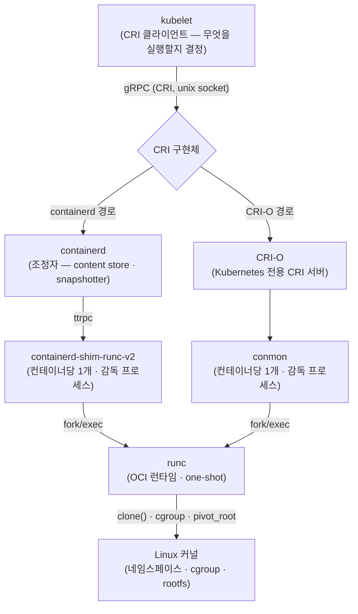
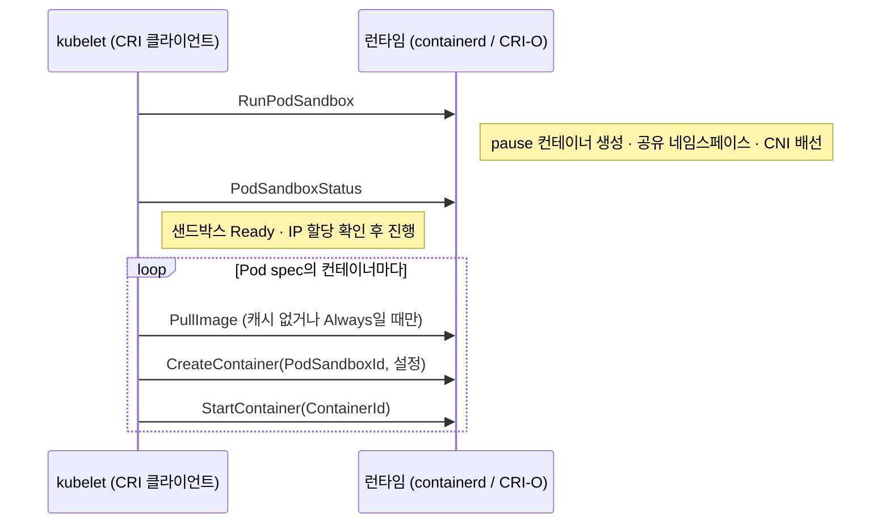
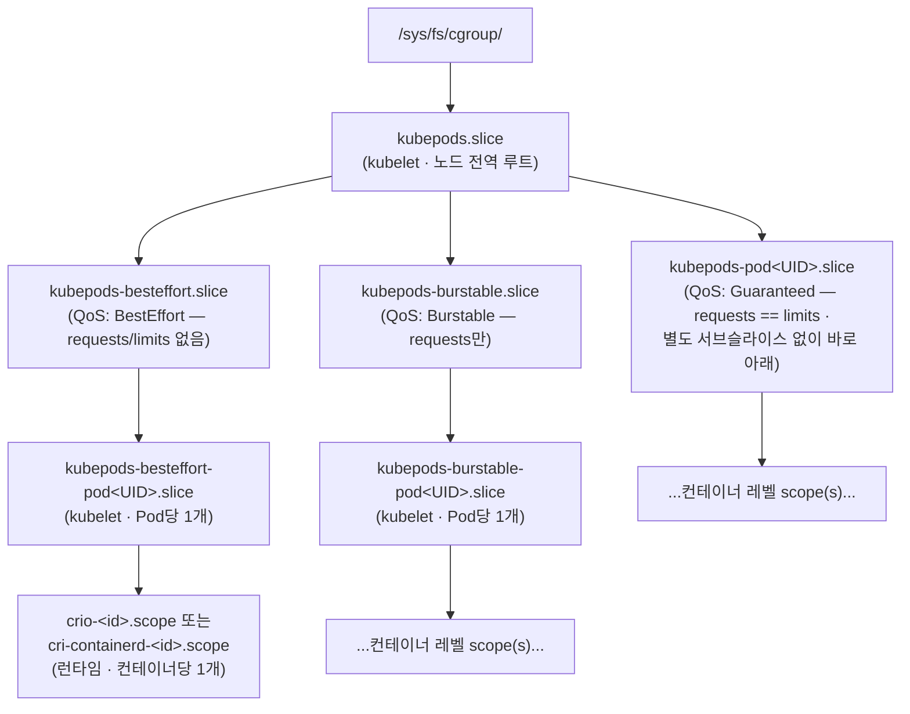

Kubernetes Pod spec 하나가 실제로 동작하는 Linux 프로세스가 되기까지는 여러 추상화 계층을 거칩니다. [kubelet](https://kubernetes.io/docs/reference/command-line-tools-reference/kubelet/), [Container Runtime Interface(CRI)](https://kubernetes.io/docs/concepts/architecture/cri/), 프로덕션 CRI 구현체인 [containerd](https://containerd.io/)와 [CRI-O](https://cri-o.io/), shim 계층, 저수준 [OCI 런타임](https://opencontainers.org/)인 [runc](https://github.com/opencontainers/runc)가 순서대로 개입합니다. 이 글은 kubernetes.io·containerd.io·cri-o.io·opencontainers.org 공식 문서의 내용을 정리한 노트입니다. 각 계층이 무엇을 담당하고 무엇을 담당하지 않는지, 그리고 계층 사이 경계에서 어떤 호출이 오가는지를 실행 순서대로 따라갑니다.

다음 그림은 Pod spec 하나가 실행 중인 프로세스가 되기까지 각 계층이 아래 계층으로 실행을 위임하는 전체 구조입니다. 위쪽은 "무엇을 실행할지 결정"하고, 아래로 내려갈수록 "어떻게 실행할지"를 담당하며, 맨 아래 runc만이 Linux 커널과 직접 상호작용합니다.



## Kubernetes가 CRI를 도입한 배경

### CRI 이전의 문제

CRI가 존재하기 전에는 컨테이너 런타임 지원이 kubelet 자체에 하드코딩되어 있었습니다. 공식 블로그 글 "Introducing Container Runtime Interface (CRI) in Kubernetes"의 설명은 다음과 같습니다.

- Docker(이후 Kubernetes 1.3 무렵의 "rktnetes" 작업으로 rkt까지)는 **내부적이고 불안정한 인터페이스를 통해 kubelet 소스 코드에 직접·깊게 통합**되어 있었습니다.
- 새 컨테이너 런타임을 지원하려면 kubelet 내부를 깊이 이해해야 했고, 이는 Kubernetes 프로젝트 자체에 높은 유지보수 부담을, 런타임 작성자에게는 높은 진입 장벽을 지웠습니다.
- "Pod를 관리하는 것"(kubelet)과 "컨테이너를 실행하는 것"(Docker/rkt) 사이에 깔끔한 경계가 없었습니다. 런타임별 특이사항이 전부 kubelet 코드베이스로 새어 나왔습니다.

### 해결책: 명시적 플러그인 인터페이스

CRI는 이 문제를 풀기 위해 **Kubernetes v1.5에서 Alpha 기능**으로 도입되었습니다. 현재 kubernetes.io CRI 페이지가 밝히는 목적은 "kubelet이 클러스터 구성요소를 재컴파일할 필요 없이 다양한 컨테이너 런타임을 사용할 수 있게 하는 플러그인 인터페이스"입니다. CRI는 **Kubernetes v1.23에서 stable**이 되었습니다.

설계 목표는 네 가집니다.

- **Decoupling** — kubelet을 특정 런타임의 구현 세부사항에서 분리합니다.
- **Flexibility** — 이미지와 런타임 오퍼레이션을 한 프로세스에서 모두 제공하는 모놀리식 런타임과, 이를 분리한 구현을 모두 지원합니다.
- **Extensibility** — kubelet의 Go 소스를 수정하지 않고도 새 런타임을 통합할 수 있게 합니다.
- **Maintainability** — 새 런타임마다 kubelet에 런타임별 glue 코드가 필요 없어지므로 코어 Kubernetes 프로젝트의 리뷰·유지보수 부담을 줄입니다.

이 구조는 이후 여러 해 동안 **dockershim**이 존재한 이유이기도 합니다. dockershim은 CRI 호출을 [Docker](https://www.docker.com/) Engine API 호출로 번역하는 kubelet 쪽 CRI shim이었습니다. Docker가 CRI보다 먼저 나왔고 CRI를 네이티브로 말하지 못했기 때문에 필요했습니다. 이후 dockershim은 CRI를 네이티브로 구현하는 런타임(containerd, CRI-O) 또는 코어 밖에서 유지되는 별도 어댑터 [cri-dockerd](https://github.com/Mirantis/cri-dockerd)로 대체되며 kubelet에서 제거되었습니다.

### 버전 요구사항

Kubernetes v1.26+부터 kubelet은 컨테이너 런타임이 **CRI v1 API**를 지원할 것을 요구합니다. 런타임이 v1을 지원하지 않으면 kubelet은 노드 등록에 실패합니다. 이것은 소프트 경고가 아니라 노드 등록 시점에 강제되는 하드 호환성 게이트입니다.

> [!WARNING] CRI v1은 하드 게이트다
> v1.26+ 노드에서 런타임이 CRI v1을 말하지 못하면 kubelet은 조용히 폴백하지 않고 노드 등록 자체가 실패합니다. 오래된 containerd·CRI-O를 쓰는 노드를 최신 컨트롤 플레인에 붙이기 전에 런타임 버전이 CRI v1을 지원하는지 먼저 확인해야 합니다.

## CRI gRPC API 표면

### 전송과 프로토콜

CRI는 **kubelet과 컨테이너 런타임 사이 통신을 위한 메인 [gRPC](https://grpc.io/) 프로토콜**을 정의합니다. kubelet은 항상 **gRPC 클라이언트**이고, 컨테이너 런타임(containerd의 CRI 플러그인, CRI-O 등)은 **Unix domain socket**에서 대기하는 **gRPC 서버** 쪽을 실행합니다. 직렬화는 [Protocol Buffers](https://protobuf.dev/)를 씁니다. 표준 `.proto` 정의는 [`kubernetes/cri-api`](https://github.com/kubernetes/cri-api)(예: `pkg/apis/runtime/v1/api.proto`)에 있습니다.

### 두 서비스: ImageService와 RuntimeService

CRI protobuf API는 정확히 두 개의 gRPC 서비스를 정의합니다.

**`ImageService`** — 특정 컨테이너와 무관한 이미지 라이프사이클 오퍼레이션입니다.

- `PullImage` — 인증 설정과 함께 레지스트리에서 이미지를 pull합니다.
- `ListImages` — 노드에 현재 존재하는 이미지를 나열합니다.
- `ImageStatus` — 특정 이미지를 조회합니다(크기, digest 등).
- `RemoveImage` — 로컬 저장소에서 이미지를 제거합니다.
- `ImageFsInfo` — 이미지 저장 백엔드의 파일시스템 사용량 정보를 반환합니다.

**`RuntimeService`** — Pod 샌드박스·컨테이너 라이프사이클과 인터랙티브 오퍼레이션을 담당합니다. 개념적으로 세 그룹으로 나뉩니다.

*샌드박스(Pod) 오퍼레이션:*

- `RunPodSandbox` — Pod 샌드박스를 생성·시작합니다. pause/infra 컨테이너와 그 네임스페이스를 만드는 호출이 바로 이것입니다.
- `StopPodSandbox` — 실행 중인 샌드박스를 네트워크 리소스까지 포함해 정지합니다.
- `RemovePodSandbox` — 정지된 샌드박스와 그 메타데이터를 제거합니다.
- `PodSandboxStatus` — 샌드박스의 현재 상태를 가져옵니다.
- `ListPodSandbox` — 존재하는 샌드박스를 나열합니다.

*컨테이너 오퍼레이션:*

- `CreateContainer` — `PodSandboxId`와 컨테이너 설정을 받아 이미 실행 중인 샌드박스 안에 컨테이너를 생성합니다.
- `StartContainer` — 생성됐으나 아직 실행되지 않은 컨테이너를 시작합니다.
- `StopContainer` — 실행 중인 컨테이너를 grace period와 함께 정지합니다.
- `RemoveContainer` — 정지된 컨테이너를 제거합니다.
- `ListContainers` — 컨테이너를 나열합니다(선택적 필터).
- `ContainerStatus` — 특정 컨테이너의 상태를 가져옵니다.
- `UpdateContainerResources` — 실행 중인 컨테이너의 리소스 제약(cgroup limit)을 갱신합니다.

*인터랙티브·스트리밍 오퍼레이션(`kubectl exec` / `attach` / `port-forward`에서 사용):*

- `Exec` — 컨테이너에서 명령을 실행하기 위한 **스트리밍 엔드포인트**를 준비합니다(비동기·스트림).
- `ExecSync` — 컨테이너에서 명령을 **동기적으로** 실행하고 stdout/stderr/exit code를 단일 RPC 응답으로 반환합니다(별도 스트리밍 엔드포인트 없음).
- `Attach` — 실행 중인 컨테이너의 stdio에 붙기 위한 스트리밍 엔드포인트를 준비합니다.
- `PortForward` — PodSandbox에서 포트를 포워딩하기 위한 스트리밍 엔드포인트를 준비합니다.

`Exec`/`Attach`/`PortForward`가 같은 gRPC 연결 위에서 스트리밍을 인라인으로 처리하는 대신 URL을 반환하도록 한 것은 의도적인 CRI 설계 결정입니다. 모든 `kubectl exec` 세션마다 kubelet을 데이터 경로에 두면 kubelet이 네트워크 병목이 되고, 런타임이 내부적으로 스트리밍을 구현하는 방식이 제약됩니다. 대신 런타임이 자체 스트리밍 서버를 띄워 URL을 돌려주고, kubelet의 API 서버는 클라이언트를 그 URL로 직접 프록시합니다.

### `--container-runtime-endpoint` 플래그

kubelet은 `--container-runtime-endpoint` 커맨드라인 플래그로 특정 CRI 소켓과 통신하도록 설정됩니다(런타임의 gRPC 소켓을 가리키는 `unix://` URI). 과거에는 이미지 서비스와 런타임 서비스를 별도 프로세스로 분리한 런타임을 위해 `--image-service-endpoint` 플래그가 따로 있었으나, 실무에서는 containerd와 CRI-O 모두 두 서비스를 같은 소켓에서 제공합니다.

기본·관례적 소켓 경로는 다음과 같습니다. 이 경로들은 CRI가 강제하는 값이 아니라 런타임의 기본값이며, kubelet의 플래그와 일치하기만 하면 어떤 경로든 설정할 수 있습니다.

| 런타임 | 기본 CRI 소켓 |
|---|---|
| containerd | `unix:///run/containerd/containerd.sock` |
| CRI-O | `unix:///var/run/crio/crio.sock` |
| cri-dockerd (Docker 어댑터) | `unix:///run/cri-dockerd.sock` |

이 엔드포인트는 `--container-runtime=remote`와 함께 지정해야 합니다. 현대 kubelet 기본값에서는 이것이 유일하게 지원되는 모드이며, 레거시 in-process "built-in" 런타임 경로는 dockershim과 함께 제거되었습니다.

### List 스트리밍

최근 Kubernetes 버전(v1.36, alpha, `CRIListStreaming` 게이트)은 list RPC의 서버 사이드 스트리밍 변형(`StreamContainers`, `StreamPodSandboxes`, `StreamImages`)을 추가했습니다. 컨테이너 수가 매우 많은 노드(10,000+)에서는 기존 unary list RPC가 gRPC의 16 MiB 메시지 크기 제한을 넘을 수 있기 때문입니다. 이것은 위에서 설명한 코어 RuntimeService/ImageService 모델을 재설계한 것이 아니라 그 위에 얹힌 확장성 개선입니다.

## kubelet의 역할: 런타임이 아니라 CRI 클라이언트

### kubelet은 컨테이너를 직접 pull하거나 run하지 않습니다

이 시스템 전체를 관통하는 핵심 사실은 **kubelet에 컨테이너 실행 로직이 전혀 없다**는 것입니다. kubelet은 `fork()`를 호출하지 않고, 컨테이너를 위해 cgroup을 직접 조작하지 않으며, 이미지 레이어를 직접 pull하지 않습니다. 이 모든 오퍼레이션은 CRI gRPC 소켓을 통해 설정된 런타임으로 위임됩니다. kubelet의 역할은 *무엇이 실행되어야 하는지 결정*하고(원하는 Pod spec을 관측된 상태와 조정), CRI 호출로 *런타임에게 그렇게 만들라고 요청*하는 데 국한됩니다.

### 새 Pod 생성 시퀀스

kubelet의 sync loop가 노드에 새 Pod를 생성해야 한다고 판단하면, CRI 호출 시퀀스는 다음과 같습니다.

1. **`RuntimeService.RunPodSandbox`** — kubelet이 런타임에게 Pod의 샌드박스를 생성하라고 요청합니다. 시퀀스에서 가장 중대한 호출입니다. 이 호출이 pause/infra 컨테이너를 생성하게 만들고, Pod의 공유 Linux 네임스페이스(network·IPC, Pod spec에 따라 선택적으로 UTS/PID)를 설정하게 합니다. 네트워크 배선(Pod IP를 할당하고 veth pair를 붙이는 CNI 플러그인 호출)도 이 단계의 일부로 일어납니다.
2. **`RuntimeService.PodSandboxStatus`** — kubelet이 다음 단계로 넘어가기 전에 샌드박스가 실제로 올라와 준비됐는지(네트워크 네임스페이스와 IP 할당 등) 확인합니다.
3. Pod spec의 **각 컨테이너**에 대해 순서대로:
   - a. **`ImageService.PullImage`** — 이미지가 로컬에 없거나 `imagePullPolicy: Always`일 때만 호출됩니다. 이미지가 이미 캐시돼 있고 정책이 재사용을 허용하면(`IfNotPresent`/`Never`에서 hit) 이 호출은 완전히 생략됩니다.
   - b. **`RuntimeService.CreateContainer`** — 1단계의 `PodSandboxId`와 컨테이너 설정(command, env, mounts, 리소스 제한, security context)을 받아, 런타임이 프로세스를 아직 시작하지 않은 채 컨테이너를 준비합니다.
   - c. **`RuntimeService.StartContainer`** — 런타임이 샌드박스의 공유 네임스페이스 안에서 컨테이너 프로세스를 실제로 시작합니다.

다음 시퀀스는 위 호출들이 kubelet과 런타임 사이에서 오가는 순서입니다. 컨테이너별 루프(3a·3b·3c)가 컨테이너마다 반복되고, `PullImage`는 캐시가 없을 때만 발행된다는 점이 이 다이어그램의 핵심입니다.



컨테이너 3개짜리 Pod는 `RunPodSandbox` 1회, `PullImage` 최대 3회, `CreateContainer`/`StartContainer` 쌍 3회로 귀결되며, kubelet과 Linux 커널이 직접 상호작용하는 일은 없습니다.

### 순수 오케스트레이션과 순수 실행의 분리

이 분리가 CRI의 존재 이유입니다. kubelet의 sync loop는 완전히 런타임에 무관할 수 있습니다. 소켓 반대편이 containerd인지 CRI-O인지 제3의 CRI 구현체인지 알 필요가 없습니다. 같은 RPC 시퀀스를 발행하고 런타임이 `api.proto`에 정의된 계약을 만족하리라 신뢰할 뿐입니다.

### cgroup 계층: 어느 레벨을 누가 생성하는가

kubelet은 *컨테이너의* cgroup을 직접 건드리지 않지만(그것은 컨테이너 `config.json`의 `linux.resources` 블록이 이끄는 런타임의 몫입니다), 개별 컨테이너보다 위의 cgroup 레벨은 kubelet이 생성·관리합니다. 널리 문서화된 구조는 cgroupfs 루트([cgroup v2](https://kubernetes.io/docs/concepts/architecture/cgroups/) 호스트에서 `/sys/fs/cgroup/`) 아래 중첩된 트리입니다. 아래 그림에서 `kubepods.slice`부터 Pod 슬라이스까지는 kubelet이, 가장 안쪽 컨테이너 scope는 런타임이 소유합니다.




- **kubelet**은 `kubepods` 최상위 cgroup과 그 아래 세 QoS 클래스 레벨 cgroup(Guaranteed/Burstable/BestEffort), 그리고 Pod가 노드에 스케줄되면 적절한 QoS cgroup 아래 중첩되는 Pod별 cgroup을 생성·소유합니다.
- **컨테이너 런타임**(containerd 또는 CRI-O)은 Pod/컨테이너 spec에서 읽어 `config.json`에 인코딩한 리소스 제한에 따라, 그 Pod cgroup 안쪽의 가장 안쪽 컨테이너별 cgroup을 생성합니다. runc가 `clone()`/cgroup-join 과정에서 컨테이너 프로세스를 실제로 넣는 cgroup이 이것입니다.
- 리소스 **limit은 하향 cascade**하고(`kubepods-burstable.slice`에 설정된 제한은 그 아래 모든 것을 제한), **사용량은 상향 roll-up**합니다(노드는 부모 cgroup의 accounting을 읽어 컨테이너를 일일이 조회하지 않고도 Pod·QoS 클래스 단위 총사용량을 관측합니다).
- 이 계층은 노드 메모리 압박 시 QoS 기반 eviction 순서의 물리적 근거이기도 합니다. BestEffort Pod(리소스 request가 전혀 없는)는 애초에 어떤 리소스도 보장하지 않았으므로, kubelet이 가장 먼저 eviction할 의향이 있는 cgroup 서브트리에 놓입니다.

## pause 컨테이너(infra 컨테이너)

### 무엇인가

모든 Kubernetes Pod에는 **pause 컨테이너**가 연결됩니다. **infra 컨테이너** 또는 **sandbox 컨테이너**라고도 부릅니다. 어떤 Pod든 kubelet이 CRI 런타임에게 가장 먼저 시작하라고 지시하는 컨테이너이며, 앞서 본 `RunPodSandbox` 호출의 부수효과로 생성됩니다.

### 실제로 하는 일(거의 없음)

pause 바이너리가 코드 수준에서 하는 일의 전부는 `pause()` 시스콜(또는 그에 준하는 무한 sleep 루프)을 호출하고 그 외에는 아무것도 하지 않습니다. 공유 PID 네임스페이스에서 PID 1로 실행될 경우 좀비 프로세스를 reap하는 정도가 추가됩니다. 애플리케이션 로직도, 네트워크 리스너도, 유의미한 리소스 발자국도 없습니다. 이미지는 설계상 최소 크기입니다(역사적으로 수백 KB, 정적 컴파일).

### 존재 이유 — 네임스페이스 앵커

pause 컨테이너의 진짜 목적은 기능적이지 않고 구조적입니다. **Pod의 공유 Linux 네임스페이스를 최초로 획득하는 프로세스**입니다(최소한 network 네임스페이스, 그리고 IPC 네임스페이스, Pod 레벨 `shareProcessNamespace` 등 설정에 따라 UTS/PID 네임스페이스). 이것이 **네임스페이스 앵커**가 됩니다. Pod의 다른 모든 컨테이너는 이후 자기 네임스페이스를 만드는 대신, pause 컨테이너가 이미 열어 둔 *같은* 네임스페이스에 join하며 시작됩니다.

이것이 "Pod당 IP 하나"를 기술적으로 가능하게 하는 원리입니다.

- CNI 플러그인은 pause 컨테이너의 network 네임스페이스에 대해 한 번 호출되어 Pod의 IP를 할당하고 네트워킹을 배선합니다(veth pair, 한쪽 끝은 호스트 브리지/오버레이, 다른 쪽 끝은 netns 안).
- Pod의 모든 애플리케이션 컨테이너는 자기 네트워크 네임스페이스를 갖는 대신 그 같은 네트워크 네임스페이스에 join합니다. 그래서 Pod 안의 모든 컨테이너가 IP 하나를 공유하고, `localhost`로 서로에게 접근할 수 있으며, IPC 네임스페이스를 공유하면 공유 메모리·System V IPC를 직접 쓸 수 있습니다.

> [!IMPORTANT] pause 컨테이너 = Pod 네임스페이스의 수명
> Pod IP가 애플리케이션 컨테이너 재시작에도 유지되는 이유는 네임스페이스를 소유한 프로세스가 애플리케이션 컨테이너가 아니라 계속 살아 있는 pause 컨테이너이기 때문입니다. 네임스페이스(따라서 IP)는 pause 컨테이너와 운명을 같이하므로, 전체 샌드박스가 해체될 때만 사라집니다.

### 라이프사이클: 컨테이너 재시작 사이에 reap·재사용

Pod 안의 애플리케이션 컨테이너가 크래시하거나 재시작해도(예: liveness probe 실패, 정상적인 crash-restart-backoff 순환) **pause 컨테이너 자체는 재시작되지 않습니다**. 계속 실행되므로 네임스페이스(따라서 Pod의 IP 주소)는 같은 Pod 안의 개별 컨테이너 재시작 사이에 그대로 유지됩니다. pause 컨테이너는 전체 Pod 샌드박스가 해체될 때만(`StopPodSandbox`/`RemovePodSandbox`), 즉 Pod 자체가 삭제되거나 재스케줄될 때만 내려갑니다.

### containerd의 구체적 처리

containerd의 CRI 플러그인은 내부적으로 containerd를 사용해 이 특수한 pause 컨테이너(sandbox 컨테이너)를 생성·시작하고, 애플리케이션 컨테이너가 생성되기 전에 그 컨테이너를 Pod의 cgroup과 네임스페이스에 배치합니다. 위 CRI 레벨 설명을 그대로 반영하되, 그것을 실현하는 containerd 내부 경로를 명명합니다.

## containerd 아키텍처

### 최상위 형태: containerd는 실행기가 아니라 조정자

containerd 자체는 컨테이너를 직접 실행하지 않습니다. **상위 관리자·허브**로서 컨테이너와 콘텐츠의 활동을 조정하고, 실제 "컨테이너 시작/정지/관리" 작업은 *런타임*이라 불리는 저수준 프로그램(가장 흔하게 runc)에 위임합니다. 이 관심사 분리는 의도적이며, 한 계층 위의 CRI가 쓰는 것과 같은 설계 패턴입니다(kubelet이 containerd에 위임하고, containerd가 shim+runc에 위임합니다).

### 클라이언트

containerd는 자체 gRPC API를 노출합니다(자신이 함께 제공하는 CRI API와는 다른, 더 저수준의 API). 여러 클라이언트가 이 API와 통신할 수 있습니다.

- **`ctr`** — containerd 자체의 저수준 디버깅 CLI(프로덕션 워크플로용이 아니며 namespace를 인식합니다).
- **[`nerdctl`](https://github.com/containerd/nerdctl)** — containerd의 클라이언트 라이브러리 위에 직접 만든 Docker-CLI 호환 클라이언트.
- **CRI 플러그인** — containerd에 컴파일되어 들어간 플러그인으로, 들어오는 CRI gRPC 호출(kubelet로부터)을 containerd의 네이티브 API 호출로 번역합니다. Kubernetes가 실제로 쓰는 경로입니다.

### content store

content store는 containerd의 **content-addressable blob 저장소**입니다. 각 콘텐츠(이미지 manifest, config blob, layer blob)는 자신의 암호학적 digest(SHA-256)를 이름으로 하는 파일로 저장되며, 이는 OCI 레지스트리가 콘텐츠를 주소 지정하는 방식을 그대로 따릅니다. 일반적인 Linux 설치에서 blob은 `/var/lib/containerd/io.containerd.content.v1.content/blobs/sha256/<digest>` 아래에 놓입니다. store의 콘텐츠는 불변이며, 한 번 pull한 이미지 레이어는 같은 레이어를 참조하는 임의 개수의 컨테이너·이미지·pull에서 digest로 재사용됩니다.

### snapshotter

**snapshotter**는 컨테이너가 실제로 동작하는 대상인, 계층화된 가변 파일시스템 뷰를 관리합니다. content store의 불변·압축된 레이어 blob을 사용 가능한 rootfs로 바꾸는 것이 그 역할입니다.

1. 비어 있는 snapshot에서 시작합니다.
2. 각 이미지 레이어를 순차적으로 적용하고, 레이어마다 새 **committed snapshot**을 commit합니다. 각각은 불변이며 부모에 체인됩니다.
3. 컨테이너가 실행되기 직전에 최종 committed snapshot 위에 가변 **active snapshot**을 준비합니다. 이 active snapshot이 컨테이너의 쓰기 가능 레이어가 됩니다.
4. garbage-collection 참조는 레이블(예: `containerd.io/gc.ref.snapshot.overlayfs=<digest>`)로 추적되어, 레이어 체인이 아직 사용 중일 때 수거되지 않게 합니다.

containerd는 여러 내장 snapshotter 구현을 제공하며 **[overlayfs](https://docs.kernel.org/filesystems/overlayfs.html)가 기본값**입니다. 다른 snapshotter(btrfs, devmapper, native 등)는 containerd 설정에서 런타임별로 지정할 수 있습니다.

### shim (`containerd-shim-runc-v2`)

shim은 컨테이너 라이프사이클을 containerd 데몬 프로세스로부터 실제로 분리하는 구성요소입니다. 현재 shim 아키텍처인 Runtime v2는 런타임 작성자가 containerd와 통합하기 위해 구현하는 **first-class shim API**를 정의합니다.

핵심 아키텍처 사실은 다음과 같습니다.

- **컨테이너당 shim 프로세스 1개**(일반적인 경우). `containerd-shim-runc-v2`는 관리하는 컨테이너마다 한 번씩 spawn되지만, 일부 설정에서는 단일 shim 인스턴스가 원리상 여러 컨테이너를 관리할 수 있습니다.
- shim은 containerd로부터 오는 **[ttrpc](https://github.com/containerd/ttrpc)** 명령을 소켓에서 대기합니다. ttrpc는 full gRPC와 달리 **HTTP 스택을 제거**한 경량 RPC 프로토콜입니다. shim이 컨테이너당 존재해 노드 전역 오버헤드가 컨테이너 수에 비례해 곱해지므로, 메모리를 아끼고 바이너리를 작게 유지하기 위한 선택입니다.
- shim은 "start" 명령을 받으면 **fork/exec**로 실제 저수준 런타임 엔진(runc)을 호출해 컨테이너 프로세스를 생성·시작합니다.
- 중요한 점으로, **runc는 컨테이너를 시작한 뒤 종료합니다**. runc는 오래 사는 프로세스가 아닙니다. **shim이 계속 살아** 컨테이너가 실행되는 동안 그 실질적 부모·감독 프로세스가 됩니다. 이것이 컨테이너 라이프사이클을 containerd 데몬으로부터 독립시키는 원리입니다. containerd 자체가 재시작되거나 크래시해도 이미 실행 중인 컨테이너는 영향받지 않습니다. 감독 프로세스가 containerd가 아니라 shim이기 때문입니다.
- shim은 최소 두 명령을 구현합니다. `start`(컨테이너 설정으로 shim을 실행)와 `delete`(리소스 정리 — shim이 SIGKILL된 뒤처럼 containerd가 shim과의 RPC 연결을 잃었을 때 상태를 복구하는 데 쓰인다)입니다.
- shim은 **OCI bundle의 `rootfs/` 디렉터리로 파일시스템을 마운트**(해체 시 언마운트)하는 책임도 집니다. 파일시스템 자체는 snapshotter가 공급하지만, runc가 나중에 `pivot_root`할 bundle 디렉터리로 실제 마운트를 수행하는 것은 shim입니다.

**TaskService와 라이프사이클 이벤트**: shim이 containerd에 노출하는 ttrpc API는 **TaskService**라 불립니다. 그 메서드(`Create`, `Start`, `Delete`, `Kill`, `Exec`, `Pause`, `Resume`, `Checkpoint` 등)가 위 "start"/"delete" 요약 뒤의 구체적 RPC입니다. shim은 이 RPC에 응답하는 것을 넘어, 데몬 자신의 상태 추적이 어긋나지 않도록 **라이프사이클 이벤트**를 containerd로 능동적으로 발신합니다. `TaskCreate`, `TaskStart`, `TaskDelete`, `TaskExit`, `TaskOOM`, `TaskExecAdded`, `TaskExecStarted`, `TaskPaused`, `TaskResumed`, `TaskCheckpointed`가 그것입니다. containerd 문서는 여기서 **순서가 중요**하다고 명시합니다. 예컨대 `TaskStart` 이벤트는 대응하는 `TaskCreate` 이벤트보다 먼저 관측되어서는 안 됩니다. containerd의 내부 조정 로직이 인과적 순서를 가정하기 때문입니다. shim 프로세스 자체가 소실되면(예: kill), containerd는 영구히 desync되는 대신 `State` RPC나 `delete` 재호출로 컨테이너의 마지막 상태를 복구할 수 있습니다.

**바이너리 명명 규약**: containerd는 URI 형식의 런타임 이름을, 점을 하이픈으로 바꾸고 마지막 두 점 구분 컴포넌트를 취한 뒤 `containerd-shim-`을 앞에 붙여 실행 경로로 변환합니다. 예: `io.containerd.runc.v2` → `containerd-shim-runc-v2`. 이것이 대안 저수준 런타임이 꽂히는 방식이기도 합니다. `io.containerd.runsc.v1`(gVisor)이라는 런타임은 동일한 규약을 따라 다른 이름의 shim 바이너리 `containerd-shim-runsc-v1`으로 해석됩니다. 이것이 RuntimeClass와 어떻게 연결되는지는 뒤에서 다룹니다.

### containerd 네임스페이스 (`k8s.io` vs Docker의 `moby`)

containerd에는 자체 "namespace" 개념이 있습니다. Linux 커널 네임스페이스와는 무관하며, 순전히 **단일 containerd 인스턴스 안의 멀티테넌시**를 위한 것입니다. 여러 소비자(Docker, Kubernetes, 임시 `ctr` 사용)가 한 호스트에서 containerd 데몬 하나를 공유하되 각자의 이미지·컨테이너·snapshot이 충돌하지 않을 수 있는데, 소비자별 리소스가 서로 다른 containerd namespace로 스코프되기 때문입니다.

- **Kubernetes**(CRI 플러그인 경유)는 항상 **`k8s.io`** containerd namespace를 생성하고 그 안에서 동작합니다.
- **Docker Engine**은 내부적으로 containerd를 쓸 때 **`moby`** namespace 안에서 동작합니다.
- 수동 `ctr` 호출은 `-n`/`--namespace`를 명시하지 않으면 **`default`** namespace를 기본으로 합니다.

**실무적 결과**: 이미지·컨테이너·snapshot은 containerd namespace별로 스코프됩니다. 노드에서 `docker pull nginx`를 하면 그 이미지는 `moby` namespace의 content store 뷰에 들어가며, `k8s.io`만 들여다보는 Kubernetes/kubelet에는 자동으로 보이지 않습니다. 반대로 kubelet이 CRI 플러그인의 `PullImage`로 받은 이미지는 같은 호스트의 `docker images`에 보이지 않습니다. Docker와 Kubernetes가 궁극적으로 같은 containerd 데몬과 같은 물리 content-addressable 저장 백엔드를 쓰더라도, **각자 pull한 같은 이미지는 논리적으로 별개 사본**이 됩니다(namespace가 명시적으로 브리지·공유되지 않는 한). 이것이 혼합 Docker/Kubernetes-on-containerd 환경에서 "왜 이미지를 또 받았지?" 혼란의 흔한 원인입니다.

## CRI-O

### Kubernetes 전용으로 설계됨

CRI-O는 스스로를 **추가 추상화 계층이 없는 목적 특화 CRI 구현체**로 규정합니다. 자체 사이트(cri-o.io)는 "Optimized for Kubernetes", "Committed to passing Kubernetes tests"라고 밝힙니다. 범용 컨테이너 런타임 데몬이면서 CRI를 플러그인으로 함께 구현하고 Docker의 백엔드이기도 한 containerd와 달리, CRI-O는 *오직* CRI 서버가 되기 위해서만 존재합니다. `ctr`/`nerdctl`에 견줄 만한 독립된 클라이언트용 API/CLI 생태계가 없습니다. 존재 이유 전체가 kubelet이 통신하는 CRI 소켓을 제공하는 데 있습니다.

### 구성요소 분해

kubelet이 CRI-O에게 Pod를 실행하라고 요청할 때, CRI-O의 아키텍처는 다음과 같습니다.

- **이미지 관리**: **[`containers/image`](https://github.com/containers/image)** 라이브러리로 임의의 OCI/Docker 호환 레지스트리에서 이미지 콘텐츠를 pull합니다.
- **저장**: **[`containers/storage`](https://github.com/containers/storage)** 라이브러리로 이미지를 copy-on-write로 컨테이너 루트 파일시스템에 풀어냅니다. 여러 스토리지 드라이버(overlayfs, devicemapper, aufs, btrfs)가 구현돼 있으며 **overlayfs가 기본값**으로, containerd의 기본 선택과 일치합니다. 이 두 라이브러리는 [Podman](https://podman.io/)·[Buildah](https://buildah.io/)와 공유됩니다.
- **OCI 런타임 실행**: OCI 런타임 spec(`config.json`)을 생성하고 실제 프로세스 생성을 OCI 호환 저수준 런타임에 위임합니다. **runc가 기본값**이고, **[crun](https://github.com/containers/crun)**이 흔한 대안이며, Kata Containers도 런타임 핸들러로 꽂을 수 있습니다.
- **conmon**: **컨테이너당 별도 [`conmon`](https://github.com/containers/conmon) 프로세스**로, containerd의 shim에 대응하는 CRI-O의 대략적 대응물입니다(아키텍처적으로는 구별됩니다). `conmon`은 컨테이너 PID 1 프로세스의 pty(pseudo-terminal)를 보유하고, 로그 캡처를 처리하며, 컨테이너의 exit code를 기록합니다. containerd shim처럼 conmon도 독립적으로 지속되어, CRI-O 데몬 재시작이 실행 중인 컨테이너를 죽이지 않습니다.
- **네트워킹**: **[CNI](https://github.com/containernetworking/cni)**(Container Network Interface)로 구현됩니다. 표준 CNI 플러그인이면 무엇이든 동작하며, Kubernetes 네트워킹이 일반적으로 의존하는 것과 같은 인터페이스 계열입니다.

### CRI-O vs containerd — 비교

둘 다 **CNCF graduated 프로젝트**이며 Kubernetes 클러스터에서 널리 쓰이는 프로덕션급 CRI 구현체입니다. 핵심 차이는 범위입니다.

| 측면 | containerd | CRI-O |
|---|---|---|
| 설계 의도 | 범용 컨테이너 런타임 데몬. CRI는 여러 클라이언트용 표면 중 하나의 플러그인 | Kubernetes를 위한 CRI 서버로만 목적 특화 |
| Docker의 백엔드인가? | 그렇다 — Docker Engine이 18.09부터 내부적으로 containerd 사용 | 아니다 — Docker와 무관 |
| 비-CRI 클라이언트 | `ctr`, `nerdctl`, containerd 네이티브 gRPC API | 사실상 없음 — CRI가 유일한 인터페이스 |
| 컨테이너 감독 프로세스 | `containerd-shim-runc-v2`(또는 런타임 클래스별 shim) | `conmon` |
| 스토리지 라이브러리 | content store + snapshotter(containerd 네이티브) | `containers/storage`(Podman·Buildah와 공유) |
| 기본 저수준 런타임 | runc | runc(crun이 흔한 대안) |

둘 다 궁극적으로 같은 지점, 즉 OCI 호환 bundle을 실행하는 OCI 호환 저수준 런타임에 도달합니다. 차이는 전적으로 그 지점 위의 계층, 즉 이미지를 어떻게 pull·저장하고 컨테이너 프로세스를 어떻게 감독하는가에 있습니다.

## runc와 OCI Runtime Specification

### config.json이 담는 것

OCI Runtime Specification은 runc·crun 같은 저수준 컨테이너 런타임의 **동작과 설정 인터페이스**를 정의합니다. 이 명세는 runc뿐 아니라 crun, youki, gVisor(runsc), Kata Containers에서도 구현됩니다. 이들 중 무엇이든 같은 `config.json` 형식을 소비할 수 있다는 뜻입니다. `config.json`은 루트 파일시스템 디렉터리와 함께 **OCI bundle**을 이룹니다. 저수준 런타임이 다루는 자기완결적 단위입니다.

runtime-spec이 정의하는 주요 필드는 다음과 같습니다(`opencontainers/runtime-spec/config.md` 기준).

- **`root`** — 컨테이너의 루트 파일시스템. `path`(절대 또는 bundle 상대)와 선택적 `readonly` 플래그.
- **`process`** — 실행 파라미터. `args`(command + arguments), `env`, `cwd`, terminal/console 설정, 프로세스의 `user`(uid/gid/추가 그룹), `rlimits`.
- **Linux 특화 프로세스 설정** — AppArmor 프로파일, Linux **capabilities**(effective·bounding·inheritable·permitted·ambient 집합), `noNewPrivileges`, OOM score 조정, 스케줄러 정책.
- **`linux`**(및 플랫폼 등가물 `windows`/`solaris`/`freebsd`/`zos`/`vm` 블록) — **네임스페이스**와 **cgroup** 설정이 여기 있습니다. 생성·join할 네임스페이스 유형(pid, network, ipc, uts, mount, user, cgroup), cgroup 리소스 제한(CPU, memory, pids, block I/O), 디바이스 접근 규칙, sysctl, seccomp 프로파일 등.
- **`mounts`** — 루트 외 추가 파일시스템 마운트 배열. 각각 `destination`, `source`, 마운트 `options`(bind mount, propagation 모드, idmap 설정 등).
- **Lifecycle hooks** — `prestart`(`createRuntime`으로 대체되며 deprecated), `createRuntime`, `createContainer`, `startContainer`, `poststart`, `poststop`. 런타임이 특정 라이프사이클 전환 지점에 호출하는 외부 프로그램입니다.

`config.json`은 **상위 계층**(containerd의 shim 또는 CRI-O 직접)이 Pod/컨테이너의 Kubernetes 레벨 정의(command, env var, 리소스 request/limit, security context, volume mount)를 이 OCI 표준 형태로 번역해 **생성**합니다. runc 자체는 Kubernetes Pod spec을 본 적이 없습니다. 오직 `config.json`이 들어 있는 bundle 디렉터리만 봅니다.

### runc가 실제로 하는 일

runc는 OCI Runtime Specification의 **레퍼런스 구현체**로, 그 명세에 따라 Linux에서 컨테이너를 spawn·실행하는 CLI 도구입니다. 구체적으로 runc는 다음을 합니다.

1. bundle에서 `config.json`을 읽습니다.
2. 기술된 격리를 실현하는 데 필요한 **저수준 Linux 시스템콜**을 수행합니다. 적절한 네임스페이스 플래그(`CLONE_NEWNET`, `CLONE_NEWPID`, `CLONE_NEWNS`, `CLONE_NEWIPC`, `CLONE_NEWUTS`, `CLONE_NEWUSER`, `CLONE_NEWCGROUP`을 설정대로)를 준 `clone()`, cgroup 생성과 지정된 리소스 제한 적용, capability 집합 적용, seccomp 필터, 그리고 컨테이너의 루트 파일시스템을 프로세스가 보는 `/`로 만드는 `pivot_root`(또는 등가물)입니다.
3. 컨테이너의 실제 command를 그 격리된 프로세스로 시작합니다.

중요한 점으로, **runc는 얇은 one-shot 프로세스**입니다. Linux 커널과 직접 상호작용해 이 모든 것을 설정하고, 컨테이너의 프로세스를 실행한 뒤 **종료합니다**. 컨테이너를 감독하며 상주하지 않습니다. 이것이 한 계층 위에 shim/conmon 계층이 존재하는 이유입니다. runc가 종료된 뒤 컨테이너 프로세스의 오래 사는 부모·감독은 shim(containerd 경로) 또는 conmon(CRI-O 경로)이 맡습니다.

## 대안 저수준(OCI) 런타임과 RuntimeClass

runc는 containerd와 CRI-O 모두의 기본 저수준 런타임이지만, OCI runtime-spec이 열린·구현 가능한 계약이므로 다른 런타임으로 대체할 수 있습니다.

- **crun** — 같은 OCI runtime spec의 **C 기반**(runc의 Go 대비) 구현체로, containers/ 생태계에서 나왔습니다(CRI-O·Podman이 사용). 더 작고, 런타임 코드베이스가 더 작으며, 시작이 빠르고, 메모리 오버헤드가 낮습니다. 일부 배포판에서 cgroup v2 호스트의 기본 런타임으로 흔히 언급됩니다. OCI 런타임 계층에서 runc의 drop-in 대체품입니다.
- **[gVisor](https://gvisor.dev/)(`runsc`)** — Go로 작성된 **유저스페이스 커널**입니다. 컨테이너 프로세스가 호스트 Linux 커널에 시스템콜을 직접 하도록 두는 대신, gVisor의 "Sentry" 구성요소가 Linux 시스템콜 ABI의 상당 부분을 가로채 유저스페이스에서 재구현하며, 컨테이너와 실제 커널 사이의 추가 격리 경계로 작동합니다. 하드웨어 수준(VM) 격리를 제공하지는 않습니다. 격리는 소프트웨어 기반이며 시스템콜 가로채기 계층에 있습니다. RuntimeClass 핸들러(containerd에서 `io.containerd.runsc.v1`)로 설정되며, 커널 공격 표면을 유의미하게 줄이는 대가로 CPU·시스템콜 지연 비용을 치르되 워크로드에는 대체로 drop-in입니다.
- **[Kata Containers](https://katacontainers.io/)** — 각 컨테이너의 워크로드를 **경량 가상머신**(QEMU micro-VM, Cloud Hypervisor 등) 안에서 자체 게스트 커널과 함께 실행합니다. 컨테이너의 시스템콜은 호스트 커널이 아니라 그 게스트 커널이 전적으로 처리합니다. 이것은 진짜 **VM 기반 격리**로, gVisor의 유저스페이스 커널 접근보다 구조적으로 강하되 Pod당 오버헤드(메모리 발자국과 시작 지연 모두 runc·gVisor 대비 증가)가 더 높습니다.

### RuntimeClass — Pod가 선택하는 방식

Kubernetes의 **`RuntimeClass`** 리소스(v1.20부터 stable, 클러스터 스코프·비네임스페이스)는 개별 Pod가 기본이 아닌 저수준 런타임을 선택하는 메커니즘입니다. 이 필드 하나 외에는 kubelet이나 CRI 계층이 Pod spec별 특수 처리를 할 필요가 없습니다.

Pod는 `spec.runtimeClassName`으로 선택합니다.

```yaml
apiVersion: v1
kind: Pod
metadata:
  name: mypod
spec:
  runtimeClassName: gvisor
  # ... 나머지 pod spec
```

`RuntimeClass` 오브젝트 자체는 Kubernetes 레벨 이름을 CRI 레벨 런타임 `handler` 이름에 매핑하기만 합니다.

```yaml
apiVersion: node.k8s.io/v1
kind: RuntimeClass
metadata:
  name: gvisor
handler: gvisor   # 노드의 containerd/CRI-O에 설정된 런타임과 일치해야 함
```

containerd에서 이 handler 이름은 `/etc/containerd/config.toml`의 `[plugins."io.containerd.grpc.v1.cri".containerd.runtimes.<handler>]` 섹션 항목에 대응해야 합니다. 그 항목이 shim 바이너리/`runtime_engine`(예: `io.containerd.runsc.v1`)을 지정하며, 이는 앞서 본 shim 명명 규약과 곧바로 이어집니다. CRI-O에서 대응물은 `/etc/crio/crio.conf`의 `[crio.runtime.runtimes.<handler>]` 아래에 OCI 런타임 바이너리로의 명시적 `runtime_path`와 함께 있습니다.

Pod가 존재하지 않는 `RuntimeClass`를 참조하거나, 그 handler가 착지한 노드에 실제로 설정·실행 가능하지 않으면 Pod는 `Failed` phase로 갑니다. 기본 런타임으로 조용히 폴백하는 것이 아니라 하드 실패입니다.

> [!WARNING] RuntimeClass 불일치는 조용히 폴백하지 않는다
> handler 이름이 노드의 containerd `config.toml`·CRI-O `crio.conf`에 설정된 런타임과 정확히 일치하지 않으면, Pod는 기본 런타임으로 넘어가는 대신 `Failed`로 떨어집니다. `scheduling` 제약을 걸어 handler를 갖춘 노드로만 스케줄되게 하지 않으면, 해당 런타임이 없는 노드에 착지한 Pod가 그대로 실패합니다.

`RuntimeClass`는 `scheduling` 제약(handler가 없는 노드에서 그런 Pod를 떼어 놓기 위한 nodeSelector/tolerations)과 `overhead`(예: Kata의 VM 비용처럼 Pod당 고정 리소스 오버헤드를 선언해 스케줄러가 이를 계산에 넣도록)도 지원하며, 각각 후속 릴리스에서 안정화되었습니다(v1.16 beta, v1.24 stable).

## Docker 자신의 경로 — 맥락과 비교

**Docker Engine 18.09**부터 Docker 자체가 런타임 백엔드로 **내부적으로 containerd를 사용**합니다. Docker 자신의 실행 경로가 CRI 계층 아래에서 Kubernetes가 쓰는 것과 *정확히 같은* 스택을 통과한다는 뜻입니다.

```
dockerd → containerd → containerd-shim-runc-v2 → runc
```

구체적으로, `docker run` 요청이 들어오면 `dockerd`(Docker API·이미지 캐시·네트워킹 설정·볼륨을 다루는 Docker 데몬)가 컨테이너 생성을 **containerd**에 넘깁니다. containerd는 content store와 snapshotter로 콘텐츠를 pull·준비하고, **shim**(기본값 `containerd-shim-runc-v2`)을 spawn하며, shim이 **runc**를 fork/exec해 격리된 프로세스를 실제로 시작합니다. 앞서 본 shim·runc 메커니즘과 동일합니다.

핵심 함의는 이렇습니다. **이 지점에서 Docker의 고유 가치는 전적으로 상위 UX 계층에 있습니다**. `docker` CLI, Docker Engine API, 이미지 빌드 도구, Docker Compose 통합 등이 그것이며, 이는 Kubernetes(containerd의 CRI 플러그인 경유 또는 CRI-O)가 함께 쓰는 *같은* content-addressable 저장소와 *같은* OCI 런타임 기반 위에 얹혀 있습니다. 두 경로는 containerd 위에서만 갈립니다. Docker는 `dockerd`에서 containerd의 네이티브 gRPC API와 직접 통신하며 상태를 `moby` containerd namespace 아래 조직하고, Kubernetes는 CRI 플러그인으로 containerd와 통신하며 상태를 `k8s.io` namespace 아래 조직합니다. 그 분기점 아래의 메커니즘(content-addressable blob, overlayfs snapshot, 컨테이너당 shim, 얇은 one-shot runc)은 동일합니다.

이것이 역사적으로 dockershim이 애초에 성립할 수 있었던 이유이기도 합니다. Docker 자신의 바닥 계층(18.09 이후)이 CRI가 통신하려는 바로 그 containerd/runc 스택이므로, dockershim의 역할은 실은 CRI의 gRPC 호출을 등가의 Docker Engine API 호출로 번역하는 것뿐이었고, 그 뒤는 Docker가 자신의 이미 containerd 기반인 경로로 밀어 내리면 됐습니다.

## 전체 시퀀스: 종단 간 추적

앞의 내용을 합치면, Pod spec이 노드에 착지한 순간부터 실행 중인 Linux 프로세스가 되기까지의 전체 경로는 다음 시퀀스입니다.

```
┌──────────┐         gRPC (unix socket,           ┌────────────────────┐
│ kubelet  │────────  --container-runtime-endpoint) ──▶│ containerd (CRI    │
│ (CRI     │                                        │ plugin)  또는 CRI-O │
│  client) │                                        └────────────────────┘
└──────────┘

Step 1 — ImageService.PullImage (컨테이너별, 캐시 없을 때만)
  containerd/CRI-O ──▶ content store: manifest + config + layer blob을
                        SHA-256 digest로 주소 지정해 fetch,
                        /var/lib/containerd/io.containerd.content.v1.content/... 아래에 기록
                        (CRI-O는 containers/storage 관리 레이어)
  containerd/CRI-O ──▶ snapshotter (기본: overlayfs): 각 레이어를
                        순차 적용 → 불변 committed snapshot 체인
                        → 실행 시점에 컨테이너별 active(쓰기 가능) snapshot으로 전환

Step 2 — RuntimeService.RunPodSandbox (Pod당 1회)
  containerd/CRI-O ──▶ shim (containerd-shim-runc-v2) / conmon spawn
                    ──▶ shim/conmon이 runc(또는 crun)를 fork+exec
                    ──▶ runc가 SANDBOX(pause) 컨테이너의 config.json을 읽음
                    ──▶ runc: netns/ipc/uts 네임스페이스 플래그로 clone(),
                        cgroup 생성, pause의 최소 rootfs로 pivot_root
                    ──▶ runc가 pause 바이너리를 시작(pause() 호출, 영원히 sleep)
                    ──▶ runc 종료(one-shot) — shim/conmon이 pause 컨테이너의
                        감독 부모 프로세스로 남음
                    ──▶ 샌드박스의 netns에 대해 CNI 플러그인 호출:
                        Pod IP 할당, veth pair를 호스트 브리지/오버레이에 배선

Step 3 — RuntimeService.PodSandboxStatus
  kubelet이 진행 전 샌드박스가 Ready(IP 보유, 네임스페이스 확립)인지 확인

Step 4 — Pod spec의 애플리케이션 컨테이너별:
  4a. ImageService.PullImage (imagePullPolicy가 요구하고 캐시 없을 때)
  4b. RuntimeService.CreateContainer(PodSandboxId, 컨테이너 설정)
        containerd/CRI-O ──▶ snapshotter: 이미 committed된 이미지 레이어 체인
                              위에, 이 컨테이너용 ACTIVE(쓰기 가능) snapshot 준비
        containerd/CRI-O ──▶ 이 컨테이너의 config.json 생성. 자기 것을 만드는
                              대신 샌드박스의 기존 netns/ipc/uts 네임스페이스에
                              JOIN하도록 지정 — Pod 안 모든 컨테이너가
                              IP 하나를 공유하게 만드는 메커니즘
  4c. RuntimeService.StartContainer(ContainerId)
        containerd/CRI-O ──▶ 이 컨테이너용 NEW shim 인스턴스
                              (containerd-shim-runc-v2) / conmon 프로세스 spawn
                          ──▶ shim/conmon이 runc를 fork+exec
                          ──▶ runc가 이 컨테이너의 config.json을 읽고 샌드박스
                              네임스페이스에 join, Pod cgroup 계층 아래 자기
                              cgroup 생성, 준비된 active snapshot을 rootfs로 pivot_root
                          ──▶ runc가 컨테이너의 실제 command 시작
                          ──▶ runc 종료 — shim/conmon이 이 컨테이너의
                              오래 사는 감독 부모로 남음

결과: 애플리케이션 컨테이너 N개짜리 Pod당 감독 프로세스 N+1개
       (pause 컨테이너용 shim/conmon 1개 + 앱 컨테이너당 1개),
       모두 pause 컨테이너가 앵커한 network/IPC/UTS 네임스페이스를 공유,
       각각 독립 cgroup과 (snapshotter 경유) 공유 불변 이미지 레이어 위에
       쌓인 자기 쓰기 가능 파일시스템 레이어를 가짐
```

### 인터랙티브 오퍼레이션 (kubectl exec, port-forward)

컨테이너가 실행된 뒤 `kubectl exec`/`attach`/`port-forward`는 `CreateContainer`/`StartContainer`를 다시 거치지 **않습니다**. 대신 kubelet은 이미 실행 중인 컨테이너에 `RuntimeService.Exec`(또는 one-shot 동기 명령의 경우 `ExecSync`), `Attach`, `PortForward`를 호출합니다. 스트림 변형에서는 런타임이 수명이 짧은 자체 스트리밍 서버를 띄워 URL을 돌려주고, API 서버가 클라이언트 연결을 그 URL로 직접 프록시합니다. 실제 stdio/포트 트래픽을 kubelet의 gRPC 채널을 거쳐 런타임으로 라우팅하지 않습니다.

### 컨테이너가 크래시할 때: CRI 경계의 restart backoff

위 다이어그램은 정상 경로를 기술합니다. 컨테이너 프로세스가(정상이든 크래시든) 종료되고 Pod의 `restartPolicy`가 재시작을 요구할 때, 런타임은 즉시 `CreateContainer`/`StartContainer`를 tight loop로 재발행하지 **않습니다**. 공식 Kubernetes Pod Lifecycle 문서에 따르면, 재시작 *타이밍* 정책을 소유하는 것은 런타임이 아니라 **kubelet**입니다.

- kubelet의 sync loop가 컨테이너 종료를 감지합니다(`RuntimeService.ContainerStatus`, 또는 런타임이 노출하는 라이프사이클 이벤트 경유).
- `restartPolicy`가 재시작을 허용하면, kubelet은 그 컨테이너의 다음 `CreateContainer`/`StartContainer` 쌍을 발행하기 전에 **지수 backoff 지연**을 적용합니다. 대략 **100밀리초**에서 시작해 실패할 때마다 두 배가 되고 **5분**에서 상한이 걸립니다.
- 일반적인 컨테이너 재시작에서는 Pod 샌드박스 자체(pause 컨테이너와 그 네임스페이스)가 해체되지 **않습니다**. 실패한 애플리케이션 컨테이너의 `CreateContainer`/`StartContainer` 순환만 반복됩니다. `RemovePodSandbox`는 정상적인 샌드박스 안 단일 컨테이너의 재시작이 아니라 전체 Pod를 해체할 때(삭제·재스케줄) 예약됩니다.
- `kubectl get pods` 출력에 보이는 `CrashLoopBackOff`는 순전히 **kubectl의 표시 편의**입니다. Kubernetes API 자체의 데이터 모델에는 별개의 Pod phase가 아닙니다. 그 아래 Pod phase는 backoff 순환 내내 `Running`으로 남고(해당 컨테이너의 `state.waiting.reason`이 그에 맞게 설정됨), `CrashLoopBackOff`는 "kubelet이 이 Pod의 어떤 컨테이너에 대해 재시작 시도 사이의 backoff 지연 기간에 있다"에 대한 kubectl의 사람 친화 라벨입니다.
- 이것은 이 문서 전체와 일관되게 책임을 한 번 더 깔끔히 나눕니다. **런타임**(containerd/CRI-O)은 지시받은 각 `CreateContainer`/`StartContainer` 쌍을 그대로 실행하며 재시작 타이밍에 관해 어떤 의견도 없습니다. 다음 시도를 *언제* 발행할지는 **kubelet**만 결정합니다.

## Kubernetes 추상화 아래 디버깅: `crictl`

앞에서 기술한 모든 것은 `kubectl`의 시야 아래에서 일어납니다. `kubectl get pods`는 Kubernetes API 서버에 저장된 오브젝트 상태만 반영하며, 그것은 kubelet의 마지막 상태 보고만큼만 최신입니다. CRI/런타임 계층 자체에서 문제가 생기면(pull되지 않는 이미지, 올라오지 않는 샌드박스, API 레벨 추상화로 설명되지 않는 채 나쁜 상태에 갇힌 컨테이너), 노드를 **CRI 계층에서 직접** 검사하는 표준 도구는 **[`crictl`](https://github.com/kubernetes-sigs/cri-tools/blob/master/docs/crictl.md)**입니다.

### 무엇인가

`crictl`은 [`kubernetes-sigs/cri-tools`](https://github.com/kubernetes-sigs/cri-tools) 리포지터리에서 개발된 CLI(Kubernetes v1.11부터 stable)로, kubelet이 쓰는 것과 **같은 CRI gRPC 프로토콜**을 런타임 소켓에 직접 말합니다. kubelet과 API 서버를 완전히 우회합니다. 표준화된 `api.proto` 계약에만 의존하고 런타임별 구현 세부에 의존하지 않으므로, 임의의 CRI 호환 런타임(containerd, CRI-O)에서 동작합니다.

### crictl vs kubectl

| | `crictl` | `kubectl` |
|---|---|---|
| 통신 대상 | 런타임의 CRI 소켓 직접(노드 로컬) | Kubernetes API 서버(클러스터 전역) |
| 컨트롤 플레인 도달 필요? | 아니오 | 예 |
| 추상화 수준 | CRI(런타임이 보는 그대로의 샌드박스·컨테이너·이미지) | Kubernetes 오브젝트(Pod, Deployment 등) |
| 전형적 용도 | 노드 레벨 런타임 트러블슈팅 — 이미지 pull 실패, 샌드박스 생성 실패, 런타임 설정 문제 | 클러스터 전역 워크로드 관리 |

### 설정

`crictl`은 어느 소켓과 통신할지 알아야 합니다. `--runtime-endpoint` 플래그, `CONTAINER_RUNTIME_ENDPOINT`/`IMAGE_SERVICE_ENDPOINT` 환경변수, 또는 `/etc/crictl.yaml`로 설정하며, kubelet 자신의 `--container-runtime-endpoint` 플래그가 가리키는 것과 정확히 같은 종류의 `unix://` 소켓 경로를 씁니다(예: `unix:///run/containerd/containerd.sock`).

### 대표 명령과 그것이 호출하는 CRI 호출

- `crictl pods` — Pod 샌드박스를 나열합니다. `RuntimeService.ListPodSandbox`의 결과를 드러냅니다(`RunPodSandbox`가 만든 샌드박스).
- `crictl ps [-a]` — 컨테이너를 나열합니다(실행 중, 또는 `-a`로 정지 포함 전체). `RuntimeService.ListContainers`.
- `crictl images` — 로컬 캐시 이미지를 나열합니다. `ImageService.ListImages`로, 런타임이 스코프된 containerd namespace(또는 CRI-O 스토리지)의 content store에 있는 것을 그대로 드러냅니다.
- `crictl inspectp <pod-id>` / `crictl inspect <container-id>` — 상세 상태. `PodSandboxStatus` / `ContainerStatus`.
- `crictl exec -i -t <container-id> <cmd>` — 컨테이너에서 명령을 실행합니다. kubelet의 프록시를 거치지 않고 직접 호출하는 `RuntimeService.Exec`/`ExecSync`입니다.
- `crictl logs <container-id>` — 컨테이너 로그를 런타임의 로그 저장소에서 직접 가져옵니다. `kubectl logs`의 API 서버 매개 경로와 무관합니다.
- `crictl pull <image>` / `crictl rmi <image>` — `ImageService.PullImage` / `RemoveImage`를 수동 실행합니다. 전체 Pod 스케줄링 순환을 기다리지 않고 kubelet이 겪는 이미지 pull 실패를 재현하는 데 유용합니다.

모든 `crictl` 명령이 특정 CRI RPC와 1:1로 대응하므로, `crictl`은 kubelet 자신이 구동하는 바로 그 gRPC 표면을 매개 없이 들여다보는 창으로 기능합니다. 문제가 kubelet 자신의 로직(스케줄링, sync loop, 상태 보고)에 있는지 한 계층 아래 RPC를 실제로 실행하는 런타임에 있는지 확인하는 자연스러운 도구입니다.


## 참고 자료

- Kubernetes, [Container Runtime Interface (CRI)](https://kubernetes.io/docs/concepts/architecture/cri/)
- Kubernetes Blog, [Introducing Container Runtime Interface (CRI) in Kubernetes](https://kubernetes.io/blog/2016/12/container-runtime-interface-cri-in-kubernetes/)
- Kubernetes Blog, [Container Runtime Interface streaming explained](https://kubernetes.io/blog/2024/05/01/cri-streaming-explained/)
- Kubernetes, [RuntimeClass](https://kubernetes.io/docs/concepts/containers/runtime-class/)
- Kubernetes, [About cgroup v2](https://kubernetes.io/docs/concepts/architecture/cgroups/)
- kubernetes-sigs/cri-tools, [crictl documentation](https://github.com/kubernetes-sigs/cri-tools/blob/master/docs/crictl.md)
- containerd, [Runtime v2 shim API](https://containerd.io/docs/main/runtime-v2/) · [content flow / namespaces / CRI config](https://github.com/containerd/containerd/tree/main/docs)
- CRI-O, [official site](https://cri-o.io/) · [crio.conf(5)](https://github.com/cri-o/cri-o/blob/main/docs/crio.conf.5.md)
- OCI, [Runtime Specification (config)](https://specs.opencontainers.org/runtime-spec/config/?v=v1.0.2)
- opencontainers/runc, [runc](https://github.com/opencontainers/runc)
- Red Hat Blog, [An introduction to crun](https://www.redhat.com/en/blog/introduction-crun)
