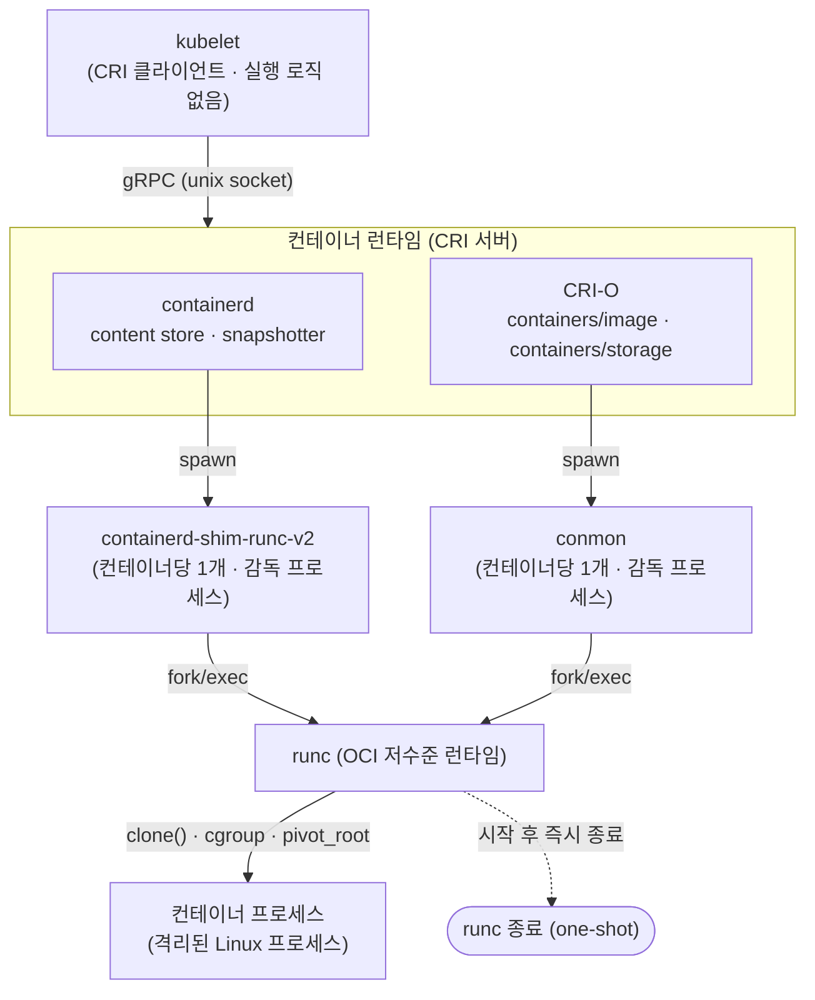
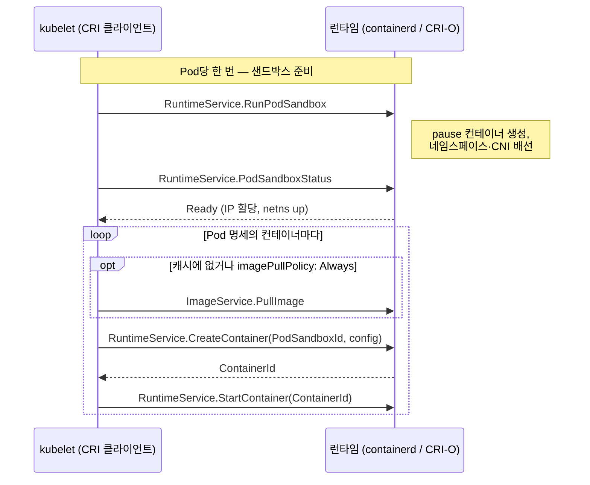

Kubernetes에 Pod를 하나 띄우면, 그 명세는 노드 위의 Linux 프로세스 하나가 됩니다. 그 사이에는 여러 계층이 있습니다. [kubelet](https://kubernetes.io/docs/reference/command-line-tools-reference/kubelet/)이 Pod를 조율하고, [CRI](https://kubernetes.io/docs/concepts/architecture/cri/)(Container Runtime Interface)라는 gRPC 인터페이스가 kubelet과 런타임을 잇고, [containerd](https://containerd.io/) 또는 [CRI-O](https://cri-o.io/)가 이미지를 받고 컨테이너를 준비하며, shim이나 conmon이 컨테이너를 감독하고, 맨 아래에서 [runc](https://github.com/opencontainers/runc)가 실제 시스템콜을 실행합니다.

이 글은 kubernetes.io·containerd.io·cri-o.io·opencontainers.org 공식 문서를 근거로 그 실행 경로를 계층별로 정리한 노트입니다. 각 계층이 무엇을 하고 무엇을 하지 않는지, 어떤 API·설정·기본값을 쓰는지를 위에서 아래로 따라갑니다.

> [!NOTE] 전제 지식
> Kubernetes Pod의 개념, Linux 네임스페이스·cgroup, gRPC의 클라이언트-서버 모델을 안다고 가정합니다. 이 글은 그 위에서 kubelet 아래의 실행 계층을 다룹니다.

한 문장으로 요약하면 이렇습니다. **kubelet은 컨테이너를 직접 pull하거나 run하지 않습니다.** 이미지를 받는 것도, `fork()`도, cgroup 조작도 kubelet이 하지 않습니다. kubelet은 무엇을 실행할지 결정해 CRI 소켓 너머의 런타임에 위임할 뿐이고, 실제 실행은 전부 런타임 쪽에서 일어납니다. 아래 계층들은 이 위임 구조의 세부입니다.

다음 그림은 이 위임 사슬을 위에서 아래로 한눈에 정리한 것입니다. 각 계층은 바로 아래 계층에 위임하고, 두 런타임(containerd·CRI-O) 경로는 결국 같은 저수준 런타임 runc로 모입니다.



## 왜 Kubernetes는 CRI를 도입했는가

**한 줄 요지: CRI는 kubelet을 재컴파일하지 않고도 여러 컨테이너 런타임을 갈아 끼울 수 있게 하는 플러그인 인터페이스입니다.**

CRI가 없던 시절에는 컨테이너 런타임 지원이 kubelet 소스 코드 안에 직접 박혀 있었습니다. Kubernetes 공식 블로그 "Introducing Container Runtime Interface (CRI) in Kubernetes"에 따르면 당시 상황은 이렇습니다.

- Docker(그리고 나중에 rkt — Kubernetes 1.3 무렵의 "rktnetes" 작업으로 들어왔다)가 **내부적이고 불안정한 인터페이스를 통해 kubelet 소스 코드에 직접·깊이 통합**되어 있었다.
- 새 컨테이너 런타임을 추가하려면 kubelet 내부를 깊이 이해해야 했다. 이 통합 방식은 Kubernetes 프로젝트 자체에 높은 유지보수 부담을, 런타임 작성자에게는 높은 진입 장벽을 지웠다.
- "Pod를 관리하는 것"(kubelet)과 "컨테이너를 실행하는 것"(Docker/rkt) 사이에 깔끔한 경계가 없었다. 런타임마다의 특수성이 전부 kubelet 코드베이스로 새어 들어왔다.

CRI는 이를 풀기 위해 **Kubernetes v1.5에서 Alpha 기능**으로 도입되었습니다. 현재 kubernetes.io CRI 페이지가 밝히는 목적은 다음과 같습니다.

> The CRI is a plugin interface which enables the kubelet to use a wide variety of container runtimes, without having a need to recompile the cluster components.

CRI는 **Kubernetes v1.23에서 stable**이 되었습니다.

설계 목표는 네 가지입니다.

- **디커플링(Decoupling)** — kubelet을 특정 런타임의 구현 세부에서 분리한다.
- **유연성(Flexibility)** — 이미지와 런타임 오퍼레이션을 한 프로세스에서 모두 제공하는 모놀리식 런타임과, 둘을 나눈 구현을 모두 지원한다.
- **확장성(Extensibility)** — kubelet의 Go 소스를 수정하지 않고도 새 런타임이 통합될 수 있게 한다.
- **유지보수성(Maintainability)** — 새 런타임마다 kubelet에 런타임 전용 접착 코드가 필요 없어지므로, 코어 Kubernetes 프로젝트의 리뷰·유지보수 부담을 줄인다.

**dockershim**이 그 뒤로도 오래 유지되었던 이유가 여기 있습니다. dockershim은 CRI 호출을 Docker Engine API 호출로 번역하는 kubelet 쪽 CRI shim이었습니다 — Docker는 CRI보다 먼저 나왔고 CRI를 네이티브로 말하지 못하기 때문입니다. dockershim은 kubelet에서 제거되었고, CRI를 네이티브로 구현하는 런타임(containerd, CRI-O)이나 코어 밖에서 유지되는 별도 어댑터 [cri-dockerd](https://github.com/Mirantis/cri-dockerd)로 대체되었습니다.

> [!IMPORTANT] 버전 하드 게이트
> Kubernetes v1.26+부터 kubelet은 컨테이너 런타임이 **CRI v1 API**를 지원할 것을 요구합니다. 런타임이 v1을 지원하지 않으면 kubelet은 노드 등록에 실패합니다. 노드 등록 시점에 강제되는 하드 호환성 게이트이며, 무시 가능한 경고가 아닙니다.

## CRI gRPC API 표면

**한 줄 요지: CRI는 gRPC 서비스 두 개(`ImageService`·`RuntimeService`)로 이루어지고, kubelet이 항상 클라이언트, 런타임이 Unix 도메인 소켓 위의 서버입니다.**

### 전송과 프로토콜

CRI는 **kubelet과 컨테이너 런타임 사이 통신을 위한 주 gRPC 프로토콜**을 정의합니다. kubelet은 항상 **gRPC 클라이언트**이고, 컨테이너 런타임(containerd의 CRI 플러그인, CRI-O 등)이 **gRPC 서버** 쪽으로 **Unix 도메인 소켓**에서 리슨합니다. 직렬화는 [Protocol Buffers](https://protobuf.dev/)입니다. 정본 `.proto` 정의는 [`github.com/kubernetes/cri-api`](https://github.com/kubernetes/cri-api)에 있습니다(예: `pkg/apis/runtime/v1/api.proto`).

### 두 서비스: ImageService와 RuntimeService

CRI protobuf API는 정확히 두 개의 gRPC 서비스를 정의합니다.

**`ImageService`** — 특정 컨테이너와 무관한 이미지 라이프사이클 오퍼레이션.

- `PullImage` — 인증 설정과 함께 레지스트리에서 이미지를 pull한다.
- `ListImages` — 노드에 현재 존재하는 이미지를 나열한다.
- `ImageStatus` — 특정 이미지를 조회한다(크기, digest 등).
- `RemoveImage` — 로컬 저장소에서 이미지를 제거한다.
- `ImageFsInfo` — 이미지 저장 백엔드의 파일시스템 사용량 정보.

**`RuntimeService`** — Pod 샌드박스와 컨테이너 라이프사이클, 그리고 인터랙티브 오퍼레이션. 개념상 세 묶음으로 나뉩니다.

*샌드박스(Pod) 오퍼레이션:*

- `RunPodSandbox` — Pod 샌드박스를 생성·시작한다(이 호출이 pause/infra 컨테이너와 그 네임스페이스를 만든다 — 뒤 섹션 참고).
- `StopPodSandbox` — 네트워크 리소스를 포함해 실행 중인 샌드박스를 중지한다.
- `RemovePodSandbox` — 중지된 샌드박스와 그 메타데이터를 제거한다.
- `PodSandboxStatus` — 샌드박스의 현재 상태를 가져온다.
- `ListPodSandbox` — 존재하는 샌드박스를 나열한다.

*컨테이너 오퍼레이션:*

- `CreateContainer` — `PodSandboxId`와 컨테이너 설정을 받아, 이미 실행 중인 샌드박스 안에 컨테이너를 생성한다.
- `StartContainer` — 생성됐지만 아직 실행되지 않은 컨테이너를 시작한다.
- `StopContainer` — 실행 중인 컨테이너를 중지한다(grace period 포함).
- `RemoveContainer` — 중지된 컨테이너를 제거한다.
- `ListContainers` — 컨테이너를 나열한다(선택적 필터).
- `ContainerStatus` — 특정 컨테이너의 상태를 가져온다.
- `UpdateContainerResources` — 실행 중인 컨테이너의 리소스 제약(cgroup 제한)을 갱신한다.

*인터랙티브·스트리밍 오퍼레이션(`kubectl exec`/`attach`/`port-forward`에 사용):*

- `Exec` — 컨테이너에서 명령을 실행할 **스트리밍 엔드포인트**를 준비한다(비동기·스트림).
- `ExecSync` — 컨테이너에서 명령을 **동기적으로** 실행하고 stdout/stderr/exit code를 단일 RPC 응답으로 반환한다(별도 스트리밍 엔드포인트 없음).
- `Attach` — 실행 중인 컨테이너의 stdio에 붙는 스트리밍 엔드포인트를 준비한다.
- `PortForward` — PodSandbox의 포트를 포워딩하는 스트리밍 엔드포인트를 준비한다.

스트리밍 오퍼레이션(`Exec`/`Attach`/`PortForward`)이 같은 gRPC 연결에서 인라인으로 스트리밍하지 않고 URL을 반환하도록 한 것은 의도된 CRI 설계 결정입니다. `kubectl exec` 세션마다 kubelet을 데이터 경로에 두면 kubelet이 네트워크 병목이 되고, 런타임이 스트리밍을 내부적으로 구현하는 방식이 제약됩니다. 대신 런타임이 자체 스트리밍 서버를 띄워 URL을 돌려주고, kubelet의 API 서버가 클라이언트를 그 URL로 직접 프록시합니다.

### `--container-runtime-endpoint` 플래그

kubelet은 `--container-runtime-endpoint` 명령줄 플래그로 특정 CRI 소켓과 통신하도록 설정됩니다(런타임의 gRPC 소켓을 가리키는 `unix://` URI). 과거에는 이미지와 런타임 서비스를 서로 다른 프로세스로 나눈 런타임을 위한 별도 `--image-service-endpoint` 플래그도 있었지만, 실제로는 containerd와 CRI-O 모두 두 서비스를 같은 소켓에서 제공합니다.

기본·관습적 소켓 경로는 다음과 같습니다. 이 경로들은 CRI가 강제하는 것이 아니라 런타임의 기본값이며, kubelet의 플래그와 일치하기만 하면 어떤 경로든 설정할 수 있습니다.

| 런타임 | 기본 CRI 소켓 |
|---|---|
| containerd | `unix:///run/containerd/containerd.sock` |
| CRI-O | `unix:///var/run/crio/crio.sock` |
| cri-dockerd (Docker 어댑터) | `unix:///run/cri-dockerd.sock` |

이 엔드포인트는 `--container-runtime=remote`와 짝지어야 합니다(현대 kubelet 기본값에서는 이것이 사실상 유일한 지원 모드입니다 — 레거시 인프로세스 "빌트인" 런타임 경로는 dockershim과 함께 제거되었습니다).

<details markdown="1">
<summary>심화: List 스트리밍 (최근 추가)</summary>

최신 Kubernetes 버전(v1.36, alpha, `CRIListStreaming`으로 게이트)은 list RPC의 서버사이드 스트리밍 변형(`StreamContainers`, `StreamPodSandboxes`, `StreamImages`)을 추가했습니다. 컨테이너 수가 매우 많은 노드(10,000+)에서는 기존 unary list RPC가 gRPC의 16 MiB 메시지 크기 한계를 넘길 수 있기 때문입니다. 위에서 설명한 동일한 코어 RuntimeService/ImageService 모델 위의 확장성 개선이며, 그 모델의 재설계는 아닙니다.

</details>

## kubelet의 역할: 실행 로직 없는 CRI 클라이언트

**한 줄 요지: kubelet에는 컨테이너 실행 로직이 전혀 없습니다. 새 Pod 하나를 띄우는 CRI 호출 순서는 정해져 있습니다.**

### kubelet은 컨테이너를 직접 pull하거나 run하지 않는다

이것이 전체 시스템의 중심 아키텍처 사실입니다. **kubelet에는 컨테이너 실행 로직이 전혀 없습니다.** kubelet은 `fork()`를 부르지 않고, 컨테이너를 위해 cgroup을 직접 만지지 않으며, 이미지 레이어를 직접 pull하지 않습니다. 이 오퍼레이션 전부가 CRI gRPC 소켓 너머 설정된 런타임으로 위임됩니다. kubelet의 일은 전적으로 *무엇을 실행할지 결정하는 것*(원하는 Pod 명세를 관측된 상태와 맞추는 조정)과 *런타임에게 그렇게 만들어 달라고 CRI 호출로 요청하는 것*입니다.

### 새 Pod 생성 시퀀스

kubelet의 sync 루프가 노드에 새 Pod를 만들어야 한다고 판단하면, CRI 호출 순서는 다음과 같습니다.

1. **`RuntimeService.RunPodSandbox`** — kubelet이 런타임에게 Pod의 샌드박스를 만들어 달라고 요청한다. 이 시퀀스에서 가장 큰 영향을 미치는 호출이다. 이 호출이 pause/infra 컨테이너를 생성하게 하고, Pod의 공유 Linux 네임스페이스(network, IPC, 그리고 Pod 명세에 따라 선택적으로 UTS/PID)를 설정하게 한다. 네트워크 배선(Pod IP를 할당하고 veth 페어를 붙이는 [CNI](https://www.cni.dev/)(Container Network Interface) 플러그인 호출)도 이 단계의 일부로 일어난다.
2. **`RuntimeService.PodSandboxStatus`** — kubelet이 다음으로 넘어가기 전에 샌드박스가 실제로 떠서 준비됐는지(네트워크 네임스페이스가 있고 IP가 할당됐는지 등) 확인한다.
3. Pod 명세의 **각 컨테이너**마다 순서대로:
   - **`ImageService.PullImage`** — 이미지가 로컬에 없거나 `imagePullPolicy: Always`일 때만 호출된다. 이미지가 이미 캐시돼 있고 정책이 재사용을 허용하면(`IfNotPresent`/`Never`에 캐시 히트) 이 호출은 통째로 건너뛴다.
   - **`RuntimeService.CreateContainer`** — (1단계의) `PodSandboxId`와 컨테이너 설정(command, env, mounts, 리소스 제한, security context)을 받아, 런타임이 프로세스를 아직 시작하지 않은 채 컨테이너를 준비한다.
   - **`RuntimeService.StartContainer`** — 런타임이 샌드박스의 공유 네임스페이스 안에서 컨테이너 프로세스를 실제로 시작한다.

아래 시퀀스는 이 호출 순서를 시간축으로 나타낸 것입니다. 샌드박스를 한 번 세운 뒤, 컨테이너마다 `PullImage`(선택) → `CreateContainer` → `StartContainer`가 반복됩니다.



따라서 컨테이너 3개짜리 Pod는 `RunPodSandbox` 1회, `PullImage` 최대 3회, `CreateContainer`/`StartContainer` 쌍 3회로 귀결되며, kubelet이 Linux 커널과 직접 상호작용하는 일은 결코 없습니다.

### cgroup 계층: 어느 레벨을 누가 만드는가

**한 줄 요지: kubelet은 컨테이너보다 위의 cgroup 레벨을, 런타임은 컨테이너별 최말단 cgroup을 만듭니다.**

kubelet은 *컨테이너의* cgroup을 직접 만지지는 않지만(그건 런타임의 일이며, 컨테이너 `config.json`의 `linux.resources` 블록이 이끕니다), 개별 컨테이너보다 **위의** cgroup 레벨은 kubelet이 생성·관리합니다. 문서화된 구조는 cgroupfs 루트(cgroup v2 호스트에서 `/sys/fs/cgroup/`) 아래의 중첩 트리입니다.

```
/sys/fs/cgroup/
└── kubepods.slice/                          (kubelet 관리, 모든 Pod의 노드 전역 루트)
    ├── kubepods-besteffort.slice/            (QoS 클래스: BestEffort — requests/limits 미설정)
    │   └── kubepods-besteffort-pod<UID>.slice/   (kubelet 관리, Pod당 하나)
    │       └── crio-<containerID>.scope  or  cri-containerd-<containerID>.scope
    │                                        (런타임 관리, 컨테이너당 하나)
    ├── kubepods-burstable.slice/              (QoS 클래스: Burstable — requests 설정, limits 없거나 느슨)
    │   └── kubepods-burstable-pod<UID>.slice/
    │       └── ...컨테이너 레벨 scope(들)...
    └── kubepods-<UID>.slice/                  (QoS 클래스: Guaranteed — requests == limits — 별도 QoS
                                                 하위 slice 없이 kubepods.slice 바로 아래에 붙음)
```

- **kubelet**은 `kubepods` 최상위 cgroup과 그 아래 세 QoS 클래스 레벨 cgroup(Guaranteed/Burstable/BestEffort), 그리고 Pod가 노드에 스케줄되면 해당 QoS cgroup 아래 중첩되는 Pod별 cgroup까지 생성·소유한다.
- **컨테이너 런타임**(containerd 또는 CRI-O)은 그 Pod cgroup 안쪽에 중첩되는 최말단 컨테이너별 cgroup을 생성한다 — runc가 `clone()`/cgroup-join 때 컨테이너 프로세스를 실제로 넣는 cgroup이 이것이다. 런타임은 Pod/컨테이너 명세에서 읽어 `config.json`에 인코딩한 리소스 제한을 근거로 이를 만든다.
- 리소스 **제한은 하향 cascade**하고(`kubepods-burstable.slice`에 건 제한은 그 아래 중첩된 모든 것을 제한한다) **사용량은 상향 roll-up**된다(노드가 부모 cgroup의 회계를 읽어, 컨테이너를 하나하나 조회하지 않고도 Pod 또는 QoS 클래스 단위 집계 사용량을 관측할 수 있다).
- 이 계층은 노드 메모리 압박 시 QoS 기반 eviction 순서의 기계적 근거이기도 하다. BestEffort Pod(리소스 requests가 전혀 없는)는 애초에 아무 리소스 보장도 하지 않았으므로, kubelet이 가장 먼저 eviction하려는 cgroup 하위 트리에 놓인다.

## pause 컨테이너 (infra 컨테이너)

**한 줄 요지: Pod마다 가장 먼저 뜨는 pause 컨테이너는 아무 일도 하지 않고, Pod의 공유 네임스페이스를 붙잡는 앵커 역할만 합니다. 그래서 "Pod당 IP 하나"가 가능합니다.**

### 무엇인가

모든 Kubernetes Pod에는 **pause 컨테이너**가 딸려 있습니다. **infra 컨테이너** 또는 **샌드박스 컨테이너**라고도 부릅니다. 어떤 Pod에서든 kubelet이 CRI 런타임에게 가장 먼저 시작하라고 지시하는 컨테이너입니다(위 `RunPodSandbox` 호출의 부수 효과로 생성됩니다).

### 실제로 하는 일 (거의 없음)

pause 바이너리가 코드 레벨에서 하는 일 전부는 `pause()` 시스콜(또는 동등한 무한 sleep 루프)을 호출하고 그 밖에는 아무것도 하지 않는 것입니다 — 공유 PID 네임스페이스 안에서 PID 1로 실행될 경우 좀비 프로세스를 reap하는 것을 더합니다. 애플리케이션 로직도, 네트워크 리스너도, 의미 있는 리소스 발자국도 없습니다. 이미지는 설계상 최소이며, 역사적으로 수백 KB에 정적 컴파일되어 있습니다.

### 왜 존재하는가 — 네임스페이스 앵커

pause 컨테이너의 진짜 목적은 기능적이 아니라 구조적입니다. **Pod의 공유 Linux 네임스페이스를 최초로 획득하는 프로세스**가 pause 컨테이너입니다(최소한 network 네임스페이스, 그리고 IPC 네임스페이스, Pod 레벨 `shareProcessNamespace` 등 설정에 따라 UTS/PID 네임스페이스). pause 컨테이너는 **네임스페이스 앵커**가 됩니다 — Pod의 다른 모든 컨테이너는 이후 자기 네임스페이스를 만드는 대신 pause 컨테이너가 이미 열어 둔 *같은* 네임스페이스에 join해서 시작됩니다.

이것이 "Pod당 IP 하나"를 기술적으로 가능하게 하는 원리입니다.

- CNI 플러그인은 pause 컨테이너의 network 네임스페이스에 대해 한 번 호출되어 Pod의 IP를 할당하고 네트워킹을 배선한다(veth 페어 — 한쪽 끝은 호스트 브리지/오버레이에, 다른 쪽 끝은 netns 안에).
- 그러면 Pod의 모든 애플리케이션 컨테이너는 자기 것을 얻는 대신 그 같은 network 네임스페이스에 join한다 — 그래서 한 Pod의 모든 컨테이너가 IP 하나를 공유하고, `localhost`로 서로 닿으며, (IPC 네임스페이스를 공유하면) 공유 메모리나 System V IPC를 직접 쓸 수 있다.

### 라이프사이클: 컨테이너 재시작 사이에 유지된다

Pod 안의 애플리케이션 컨테이너가 크래시하거나 재시작되어도(예: liveness probe 실패, 또는 일반적인 크래시-재시작-백오프 사이클) **pause 컨테이너 자체는 재시작되지 않습니다.** pause 컨테이너는 계속 실행되고, 따라서 네임스페이스(그리고 Pod의 IP 주소)는 같은 Pod 안 개별 컨테이너 재시작 전반에서 바뀌지 않고 유지됩니다. pause 컨테이너는 Pod 샌드박스 전체가 헐릴 때(`StopPodSandbox`/`RemovePodSandbox`), 즉 Pod 자체가 삭제되거나 재스케줄될 때만 헐립니다.

containerd의 CRI 플러그인은 이를 이렇게 구현합니다. containerd를 내부적으로 사용해 특별한 pause 컨테이너(샌드박스 컨테이너)를 생성·시작하고, 애플리케이션 컨테이너가 만들어지기 전에 그 컨테이너를 Pod의 cgroup과 네임스페이스에 배치합니다 — 위의 일반적 CRI 레벨 설명을 그대로 반영하되, 그것을 실현하는 containerd 내부 경로를 지목한 것입니다.

## containerd 아키텍처

**한 줄 요지: containerd는 컨테이너를 직접 실행하지 않습니다. content store·snapshotter·shim으로 이루어진 조정자이며, 실제 실행은 runc에 위임합니다.**

### 최상위 형태: containerd는 실행기가 아니라 조정자다

containerd 자체는 컨테이너를 직접 띄우지 않습니다. containerd는 컨테이너와 콘텐츠의 활동을 조정하는 **상위 레벨 매니저·허브**로 동작하며, 실제 "컨테이너를 시작·중지·관리하는" 일은 *런타임*이라 불리는 하위 레벨 프로그램(가장 흔하게는 runc)에 위임합니다. 이 관심사 분리는 의도된 것이며, 한 계층 위에서 CRI가 쓰는 것과 같은 설계 패턴입니다(kubelet이 containerd에 위임하고, containerd가 shim+runc에 위임합니다).

### 클라이언트

containerd는 자체 gRPC API를 노출합니다(그것이 함께 제공하는 CRI API와는 다르고 더 낮은 레벨입니다). 여러 클라이언트가 이 API와 통신할 수 있습니다.

- **`ctr`** — containerd 자체의 저수준 디버깅 CLI(프로덕션 워크플로용이 아니며, namespace-aware하다).
- **[`nerdctl`](https://github.com/containerd/nerdctl)** — containerd의 클라이언트 라이브러리 위에 직접 만든 Docker-CLI 호환 클라이언트.
- **CRI 플러그인** — containerd에 컴파일되어 들어간 플러그인으로, (kubelet이 보내는) 들어오는 CRI gRPC 호출을 containerd의 네이티브 API 호출로 번역한다. Kubernetes가 실제로 쓰는 경로다.

### content store

content store는 containerd의 **콘텐츠 주소 지정(content-addressable) blob 저장소**입니다. 각 콘텐츠 조각(이미지 매니페스트, config blob, 레이어 blob)은 자신의 암호학적 digest(SHA-256)를 이름으로 하는 파일로 저장됩니다. OCI 레지스트리 자체가 콘텐츠를 주소 지정하는 방식을 그대로 따른 것입니다. 전형적인 Linux 설치에서 blob은 `/var/lib/containerd/io.containerd.content.v1.content/blobs/sha256/<digest>` 아래에 놓입니다. store 안의 콘텐츠는 불변(immutable)이며, 한 번 pull한 이미지 레이어는 같은 레이어를 참조하는 임의 개수의 컨테이너·이미지·pull 전반에서 digest로 재사용됩니다.

### snapshotter

**snapshotter**는 컨테이너가 실제로 실행되는, 레이어드된 가변 파일시스템 뷰를 관리합니다. content store에서 온 불변의(흔히 압축된) 레이어 blob을 쓸 수 있는 rootfs로 바꾸는 것이 그 일입니다.

1. 빈 스냅샷에서 시작한다.
2. 각 이미지 레이어를 순차 적용하고, 매 레이어 뒤에 새 **committed 스냅샷**을 커밋한다 — 각각 불변이며 부모에 체이닝된다.
3. 컨테이너가 실행되려 할 때, 마지막 committed 스냅샷 위에 가변 **active 스냅샷**을 준비한다 — 이 active 스냅샷이 컨테이너의 쓰기 가능 레이어다.
4. 가비지 컬렉션 참조는 레이블로 추적되어(예: `containerd.io/gc.ref.snapshot.overlayfs=<digest>`) 아직 사용 중인 레이어 체인이 수집되지 않게 한다.

containerd에는 여러 내장 snapshotter 구현이 딸려 오며 **overlayfs가 기본값**입니다. 다른 snapshotter(btrfs, devmapper, native 등)는 containerd 설정으로 런타임별 지정할 수 있습니다.

### shim (`containerd-shim-runc-v2`)

shim은 컨테이너 라이프사이클을 containerd 데몬 프로세스에서 실제로 떼어 내는 구성요소입니다. Runtime v2(현재 shim 아키텍처)는 런타임 작성자가 containerd와 통합하려고 구현하는 **일급 shim API**를 정의합니다.

핵심 아키텍처 사실은 다음과 같습니다.

- **컨테이너당 shim 프로세스 하나**(일반적인 경우) — `containerd-shim-runc-v2`는 관리하는 컨테이너당 한 번 spawn된다. 다만 어떤 설정에서는 단일 shim 인스턴스가 원리상 여러 컨테이너를 관리할 수도 있다.
- shim은 containerd로부터 오는 **[ttrpc](https://github.com/containerd/ttrpc)** 명령을 소켓에서 리슨한다. ttrpc는 (완전한 gRPC와 달리) **HTTP 스택을 제거한** 경량 RPC 프로토콜로, 메모리를 아끼고 shim 바이너리를 작게 유지하기 위한 것이다 — shim은 컨테이너당 존재하므로 노드 전역 오버헤드가 컨테이너 수에 비례해 곱해지기 때문에 적절한 선택이다.
- shim은 "start" 명령을 받으면 실제 저수준 런타임 엔진(runc)을 **fork/exec**로 호출해 컨테이너 프로세스를 생성·시작한다.
- 결정적으로, **runc는 컨테이너를 시작한 뒤 종료한다**(뒤 섹션 참고) — runc는 오래 사는 프로세스가 아니다. **계속 살아 있는 것은 shim**으로, 컨테이너가 실행되는 동안 그 컨테이너의 실질적 부모·감독 프로세스로 남는다. 컨테이너 라이프사이클이 containerd 데몬과 독립적인 이유가 바로 이것이다. containerd 자체가 재시작되거나 크래시해도 이미 실행 중인 컨테이너는 영향받지 않는다 — 감독 프로세스가 containerd가 아니라 shim이기 때문이다.
- shim은 최소 두 명령을 구현한다. `start`(컨테이너 설정과 함께 shim을 띄운다)와 `delete`(리소스를 정리한다 — containerd가 shim과의 RPC 연결을 잃었더라도, 예컨대 shim이 SIGKILL된 뒤에도 상태를 복구하는 데 쓴다).
- shim은 **OCI bundle의 `rootfs/` 디렉터리에 파일시스템을 마운트**하는(그리고 헐 때 언마운트하는) 책임도 진다 — 파일시스템 자체는 snapshotter가 공급하지만, runc가 나중에 `pivot_root`할 bundle 디렉터리에 실제 마운트를 수행하는 것은 shim이다.

<details markdown="1">
<summary>심화: TaskService와 라이프사이클 이벤트, 바이너리 명명 규칙</summary>

**TaskService.** shim이 containerd에 노출하는 ttrpc API는 **TaskService**라 불립니다 — 그 메서드(`Create`, `Start`, `Delete`, `Kill`, `Exec`, `Pause`, `Resume`, `Checkpoint` 등)가 위 "start"/"delete" 요약 뒤의 구체 RPC입니다. 이 RPC에 응답하는 것을 넘어, 잘 동작하는 shim은 자신이 바꾸지 않은 것도 데몬의 상태 추적이 동기화되도록 **라이프사이클 이벤트**를 containerd로 능동적으로 보냅니다: `TaskCreate`, `TaskStart`, `TaskDelete`, `TaskExit`, `TaskOOM`, `TaskExecAdded`, `TaskExecStarted`, `TaskPaused`, `TaskResumed`, `TaskCheckpointed`. containerd 문서는 여기서 **순서가 중요하다**고 명시합니다 — 예컨대 `TaskStart` 이벤트는 대응하는 `TaskCreate` 이벤트보다 먼저 관측되어서는 안 됩니다 — containerd 내부 조정 로직이 인과 순서를 가정하기 때문입니다. shim 프로세스 자체가 소실되면(예: killed), containerd는 `State` RPC나 `delete` 재호출로 컨테이너의 마지막 알려진 상태를 여전히 복구할 수 있어, 영구히 desync되지 않습니다.

**바이너리 명명 규칙.** containerd는 URI 스타일 런타임 이름을 실행 파일 경로로 변환할 때, 마침표를 하이픈으로 바꾸고, 점으로 나뉜 마지막 두 구성요소를 취한 뒤 `containerd-shim-`을 앞에 붙입니다. 예: `io.containerd.runc.v2` → `containerd-shim-runc-v2`. 대안 저수준 런타임이 꽂히는 방식이 바로 이것입니다 — `io.containerd.runsc.v1`(gVisor)이라는 이름의 런타임은 동일한 규칙에 따라 다른 이름의 shim 바이너리 `containerd-shim-runsc-v1`으로 해석됩니다. 이것이 RuntimeClass와 어떻게 이어지는지는 아래 RuntimeClass 섹션 참고.

</details>

### containerd namespace (`k8s.io` vs Docker의 `moby`)

**한 줄 요지: containerd 내부 namespace는 Linux 커널 네임스페이스와 무관한 멀티테넌시 개념입니다. Kubernetes는 `k8s.io`, Docker는 `moby`를 쓰므로, 한쪽이 받은 이미지가 다른 쪽에 안 보입니다.**

containerd에는 자체 "namespace" 개념이 있는데 — Linux 커널 네임스페이스와는 무관하며 — 순수하게 **단일 containerd 인스턴스 안의 멀티테넌시**를 위한 것입니다. 여러 소비자(Docker, Kubernetes, 임시 `ctr` 사용)가 한 호스트의 containerd 데몬 하나를 공유하면서도 이미지·컨테이너·스냅샷이 충돌하지 않는데, 각 소비자의 리소스가 별개의 containerd namespace로 스코프되기 때문입니다.

- **Kubernetes**(CRI 플러그인 경유)는 항상 **`k8s.io`** containerd namespace를 생성해 그 안에서 동작한다.
- **Docker Engine**은 containerd를 내부적으로 쓸 때 **`moby`** namespace에서 동작한다.
- 수동 `ctr` 호출은 `-n`/`--namespace`를 명시적으로 넘기지 않으면 **`default`** namespace를 기본으로 쓴다.

> [!WARNING] 이미지 중복 저장의 흔한 원인
> 이미지·컨테이너·스냅샷은 containerd namespace별로 스코프됩니다. 노드에서 `docker pull nginx`를 하면 그 이미지는 `moby` namespace의 content store 뷰에 놓입니다 — Kubernetes/kubelet에는 **자동으로 보이지 않습니다.** kubelet은 `k8s.io` 안만 보기 때문입니다. 반대로 kubelet이 CRI 플러그인의 `PullImage`로 받은 이미지는 같은 호스트의 `docker images`에 보이지 않습니다. Docker와 Kubernetes가 궁극적으로 같은 containerd 데몬과 같은 물리 콘텐츠 주소 지정 저장소를 쓰더라도, **각자가 받은 같은 이미지는 논리적으로 별개의 사본이 됩니다**(namespace를 명시적으로 브리지·공유하지 않는 한). Docker와 containerd는 이런 의미에서 기본적으로 이미지 백엔드를 공유하지 않습니다. Docker/Kubernetes-on-containerd 혼합 환경에서 "왜 이미지를 또 받았지?" 하는 혼란의 흔한 원인입니다.

## CRI-O

**한 줄 요지: CRI-O는 Kubernetes 전용으로 만들어진 순수 CRI 구현체입니다. containerd처럼 범용 데몬이 CRI를 플러그인으로 얹은 게 아니라, 처음부터 CRI 서버로만 존재합니다.**

### Kubernetes를 위해 특별히 만들어졌다

CRI-O는 자신을 명시적으로 **여분의 추상화 계층이 없는, 목적을 갖고 만들어진 CRI 구현체**로 규정합니다 — 자체 사이트(cri-o.io)는 "Optimized for Kubernetes"와 "Committed to passing Kubernetes tests"라고 밝힙니다. CRI를 플러그인으로 함께 구현하는(그리고 Docker의 백엔드이기도 한) 범용 컨테이너 런타임 데몬 containerd와 달리, CRI-O는 *특정하게* CRI 서버가 되기 위해서만 존재합니다. `ctr`/`nerdctl`에 견줄 만한 독자적 클라이언트용 API/CLI 생태계도 없습니다 — 존재 이유 전부가 kubelet이 통신하는 CRI 소켓을 제공하는 것입니다.

### 구성요소 분해

kubelet이 CRI-O에게 Pod를 실행하라고 요청할 때의 아키텍처는 이렇습니다.

- **이미지 관리**: **[`containers/image`](https://github.com/containers/image)** 라이브러리를 써서 임의의 OCI/Docker 호환 레지스트리에서 이미지 콘텐츠를 pull한다.
- **저장소**: **[`containers/storage`](https://github.com/containers/storage)** 라이브러리를 써서 이미지를 copy-on-write로 컨테이너 rootfs로 풀어낸다. 여러 저장소 드라이버(overlayfs, devicemapper, aufs, btrfs)가 구현돼 있으며 **overlayfs가 기본값**으로, containerd의 기본 선택과 같다.
- **OCI 런타임 실행**: OCI 런타임 명세(`config.json` — 아래 섹션 참고)를 생성하고, 실제 프로세스 생성을 OCI 호환 저수준 런타임에 위임한다. **runc가 기본값**이고, **[crun](https://github.com/containers/crun)**(아래 RuntimeClass 섹션)이 흔한 대안이며, Kata Containers도 런타임 핸들러로 꽂을 수 있다.
- **conmon**: **컨테이너당 별도 [`conmon`](https://github.com/containers/conmon) 프로세스** — containerd의 shim에 대응하는 CRI-O의 대략적 대응물이지만 아키텍처적으로는 별개다. `conmon`은 컨테이너 PID 1 프로세스의 pty(의사 터미널)를 보유하고, 로그 캡처를 처리하며, 컨테이너의 exit code를 기록한다. containerd shim처럼 conmon도 독립적으로 지속되므로 CRI-O 데몬 재시작이 실행 중인 컨테이너를 죽이지 않는다.
- **네트워킹**: **CNI**(Container Network Interface)로 구현된다 — 임의의 표준 CNI 플러그인이 동작하며, Kubernetes 네트워킹이 일반적으로 기대는 것과 같은 인터페이스 계열이다.

### CRI-O vs containerd — 비교

둘 다 **CNCF Graduated 프로젝트**이며, 둘 다 Kubernetes 클러스터에서 널리 쓰이는 프로덕션급 CRI 구현체입니다. 핵심 차이는 스코프입니다.

| 관점 | containerd | CRI-O |
|---|---|---|
| 설계 의도 | 범용 컨테이너 런타임 데몬. CRI는 여러 클라이언트용 표면 중 하나인 플러그인 | 오직 Kubernetes용 CRI 서버가 되기 위해 만들어짐 |
| Docker 백엔드? | 예 — Docker Engine이 18.09부터 containerd를 내부적으로 사용 | 아니오 — CRI-O는 Docker와 무관 |
| 비-CRI 클라이언트 | `ctr`, `nerdctl`, containerd 네이티브 gRPC API | 의미 있는 것 없음 — CRI가 사실상 유일한 인터페이스 |
| 컨테이너 감독 프로세스 | `containerd-shim-runc-v2`(또는 런타임 클래스별 shim) | `conmon` |
| 저장소 라이브러리 | content store + snapshotter (containerd 네이티브) | `containers/storage` ([Podman](https://podman.io/)·[Buildah](https://buildah.io/)와 공유) |
| 기본 저수준 런타임 | runc | runc (crun이 흔한 대안) |

둘 다 궁극적으로 같은 지점에 도달합니다: OCI 호환 저수준 런타임이 OCI 호환 bundle을 실행하는 것. 차이는 전적으로 그 지점 위의 계층에 있습니다 — 이미지를 어떻게 pull·저장하고 컨테이너 프로세스를 어떻게 감독하는가.

## runc와 OCI 런타임 명세

**한 줄 요지: runc는 OCI 런타임 명세의 레퍼런스 구현체입니다. `config.json`을 읽어 저수준 시스템콜을 실행하고, 컨테이너를 시작한 뒤 곧바로 종료하는 one-shot 프로세스입니다.**

### config.json이 담는 것

[OCI](https://opencontainers.org/)(Open Container Initiative) 런타임 명세는 runc·crun 등 저수준 컨테이너 런타임의 **동작과 설정 인터페이스**를 정의합니다. 이 명세는 runc뿐 아니라 crun, [youki](https://github.com/youki-dev/youki), gVisor(runsc), Kata Containers도 구현합니다 — 이들 중 무엇이든 같은 `config.json` 형식을 소비할 수 있다는 뜻입니다. `config.json`은 루트 파일시스템 디렉터리와 함께 **OCI bundle**을 이룹니다 — 저수준 런타임이 작업하는 자기 완결적 단위입니다.

런타임 명세([`opencontainers/runtime-spec`의 `config.md`](https://github.com/opencontainers/runtime-spec/blob/main/config.md))가 정의하는 핵심 필드는 다음과 같습니다.

- **`root`** — 컨테이너의 루트 파일시스템: `path`(절대 또는 bundle 상대)와 선택적 `readonly` 플래그.
- **`process`** — 실행 파라미터: `args`(command + 인자), `env`, `cwd`, 터미널/콘솔 설정, 프로세스의 `user`(uid/gid/추가 그룹), `rlimits`.
- **Linux 특정 프로세스 설정** — AppArmor 프로파일, Linux **capabilities**(effective, bounding, inheritable, permitted, ambient 집합), `noNewPrivileges`, OOM score 조정, 스케줄러 정책.
- **`linux`**(그리고 플랫폼 등가 `windows`/`solaris`/`freebsd`/`zos`/`vm` 블록) — 여기에 **네임스페이스**와 **cgroups** 설정이 있다: 어떤 네임스페이스 타입을 생성/join할지(pid, network, ipc, uts, mount, user, cgroup), cgroup 리소스 제한(CPU, memory, pids, block I/O), 디바이스 접근 규칙, sysctls, seccomp 프로파일 등.
- **`mounts`** — 루트 외의 추가 파일시스템 마운트 배열. 각 항목은 `destination`, `source`, 마운트 `options`(bind mount, propagation 모드, idmap 설정 등)를 갖는다.
- **라이프사이클 훅** — `prestart`(`createRuntime`으로 대체되며 deprecated), `createRuntime`, `createContainer`, `startContainer`, `poststart`, `poststop` — 런타임이 특정 라이프사이클 전이 지점에서 호출하는 외부 프로그램.

`config.json`은 Pod/컨테이너의 Kubernetes 레벨 정의(command, env 변수, 리소스 requests/limits, security context, 볼륨 마운트)를 이 OCI 표준 형태로 번역해 **상위 계층**(containerd의 shim 또는 CRI-O가 직접)이 생성합니다. runc 자체는 Kubernetes Pod 명세를 본 적이 없습니다 — bundle 디렉터리에 든 `config.json`만 볼 뿐입니다.

### runc가 실제로 하는 일

runc는 OCI 런타임 명세의 **레퍼런스 구현체**입니다 — 그 명세에 따라 Linux에서 컨테이너를 생성·실행하는 CLI 도구입니다. 구체적으로 runc는 다음 일을 합니다.

1. bundle에서 `config.json`을 읽는다.
2. 서술된 격리를 실현하는 데 필요한 **저수준 Linux 시스템콜**을 수행한다: 적절한 네임스페이스 플래그(`CLONE_NEWNET`, `CLONE_NEWPID`, `CLONE_NEWNS`, `CLONE_NEWIPC`, `CLONE_NEWUTS`, `CLONE_NEWUSER`, `CLONE_NEWCGROUP` 중 설정된 것)와 함께 `clone()`, cgroup 생성과 지정된 리소스 제한 적용, capability 집합 적용, seccomp 필터, 그리고 컨테이너 루트 파일시스템을 프로세스의 `/` 뷰로 만드는 `pivot_root`(또는 등가).
3. 그 결과로 격리된 프로세스로서 컨테이너의 실제 command를 시작한다.

결정적으로, **runc는 얇은 one-shot 프로세스**입니다. Linux 커널과 직접 상호작용해 이 모든 것을 설정하고, 컨테이너 프로세스를 띄운 뒤 **종료합니다.** 컨테이너를 감독하며 상주하지 않습니다. shim이나 conmon 계층이 한 레벨 위에 존재하는 이유가 정확히 이것입니다 — runc가 종료된 뒤에도 컨테이너 프로세스의 오래 사는 부모·감독으로 남을 무언가가 있어야 하며, 그 무언가는 shim(containerd 경로) 또는 conmon(CRI-O 경로)입니다. 이미 종료된 runc는 그 감독 역할을 맡지 않습니다.

## 대안 저수준(OCI) 런타임과 RuntimeClass

**한 줄 요지: OCI 런타임 명세는 개방된 계약이므로 runc를 다른 런타임으로 교체할 수 있고, RuntimeClass가 Pod 단위로 그것을 고르는 수단입니다.**

runc는 containerd와 CRI-O 모두의 기본 저수준 런타임이지만, OCI 런타임 명세가 개방된 구현 가능한 계약이므로 다른 런타임으로 대체할 수 있습니다.

- **crun** — runc의 Go 대신 **C로 만든** 같은 OCI 런타임 명세 구현체로, containers/ 생태계(CRI-O·Podman이 사용)에서 나왔다. 더 작고, 런타임 코드베이스가 더 작으며, 시작이 빠르고 메모리 오버헤드가 낮으며, 일부 배포판에서 cgroup v2 호스트의 기본 런타임으로 흔히 언급된다. OCI 런타임 계층에서 runc의 사실상 drop-in 대체재다.
- **[gVisor](https://gvisor.dev/)(`runsc`)** — Go로 작성된 **유저스페이스 커널**. 컨테이너 프로세스가 호스트 Linux 커널에 시스템콜을 직접 하도록 두는 대신, gVisor의 "Sentry" 구성요소가 Linux 시스템콜 ABI의 상당 부분을 유저스페이스에서 가로채 재구현해, 컨테이너와 진짜 커널 사이의 추가 격리 경계 역할을 한다. 하드웨어(VM) 수준 격리를 제공하지는 않는다 — 격리는 시스템콜 가로채기 계층의 소프트웨어 기반이다. RuntimeClass 핸들러로 설정되며(containerd에서 `io.containerd.runsc.v1`), CPU·시스템콜 레이턴시 비용을 얼마간 치르는 대신 커널 공격 표면을 유의미하게 줄이는, 워크로드 관점에서 대체로 drop-in이다.
- **[Kata Containers](https://katacontainers.io/)** — 각 컨테이너의 워크로드를 자체 게스트 커널을 가진 **경량 가상 머신**(QEMU micro-VM, Cloud Hypervisor 등) 안에서 실행한다. 컨테이너의 시스템콜은 호스트 커널이 아니라 그 게스트 커널이 전부 처리한다 — 이것이 진짜 **VM 기반 격리**로, gVisor의 유저스페이스 커널 접근보다 구조적으로 강하되, Pod당 오버헤드가 더 높다(runc나 gVisor 대비 메모리 발자국과 시작 레이턴시가 모두 늘어난다).

### RuntimeClass — Pod가 opt-in하는 방법

Kubernetes의 **`RuntimeClass`** 리소스(v1.20부터 stable, 클러스터 스코프·비네임스페이스)는 개별 Pod가 기본이 아닌 저수준 런타임을 선택하는 수단이며, kubelet이나 CRI 계층이 이 필드 하나 외에 Pod 명세별 특수 처리를 할 필요가 없습니다.

Pod는 `spec.runtimeClassName`으로 opt-in합니다.

```yaml
apiVersion: v1
kind: Pod
metadata:
  name: mypod
spec:
  runtimeClassName: gvisor
  # ... 나머지 pod spec
```

`RuntimeClass` 객체 자체는 Kubernetes 레벨 이름을 CRI 레벨 런타임 `handler` 이름에 매핑할 뿐입니다.

```yaml
apiVersion: node.k8s.io/v1
kind: RuntimeClass
metadata:
  name: gvisor
handler: gvisor   # 노드의 containerd/CRI-O에 설정된 런타임과 일치해야 한다
```

containerd에서 그 handler 이름은 `/etc/containerd/config.toml`의 `[plugins."io.containerd.grpc.v1.cri".containerd.runtimes.<handler>]` 섹션의 항목과 대응해야 합니다(그 섹션이 shim 바이너리/`runtime_engine`을 지정합니다, 예: `io.containerd.runsc.v1` — shim 명명 규칙과 곧바로 이어집니다). CRI-O에서는 등가물이 `/etc/crio/crio.conf`의 `[crio.runtime.runtimes.<handler>]` 아래에 OCI 런타임 바이너리로의 명시적 `runtime_path`와 함께 있습니다.

> [!WARNING] 조용한 폴백은 없다
> Pod가 존재하지 않는 `RuntimeClass`를 참조하거나, 그 handler가 착지한 노드에 실제로 설정·실행 가능하지 않으면, Pod는 `Failed` phase로 갑니다 — 하드 실패이며 기본 런타임으로의 조용한 폴백이 아닙니다.

`RuntimeClass`는 `scheduling` 제약(nodeSelector/tolerations로 핸들러가 없는 노드에서 그런 Pod를 떼어 놓습니다)과 `overhead`(Kata의 VM 비용 같은 고정 Pod당 리소스 오버헤드를 선언해 스케줄러가 이를 회계에 반영하게 합니다)도 지원하며, 둘 다 이후 릴리스에서 안정화되었습니다(각각 v1.16 beta, v1.24 stable).

## Docker 자신의 경로 — 맥락과 비교

**한 줄 요지: Docker Engine도 18.09부터 내부적으로 containerd를 쓰므로, CRI 계층 아래에서 Kubernetes와 정확히 같은 스택을 공유합니다.**

**Docker Engine 18.09**부터 Docker 자체가 런타임 백엔드로 **containerd를 내부적으로** 사용합니다 — Docker 자신의 실행 경로가 CRI 계층 아래에서 Kubernetes가 쓰는 것과 *정확히 같은* 스택으로 귀결된다는 뜻입니다.

```
dockerd → containerd → containerd-shim-runc-v2 → runc
```

구체적으로: `docker run` 요청이 들어오면 `dockerd`(Docker 데몬 — Docker API, 이미지 캐시, 네트워킹 설정, 볼륨을 처리)가 컨테이너 생성을 **containerd**에 넘기고, containerd는 앞서 설명한 대로 content store와 snapshotter로 콘텐츠를 pull·준비한 뒤, **shim**(`containerd-shim-runc-v2`가 기본)을 spawn하고, 그 shim이 **runc**를 fork/exec해 격리된 프로세스를 실제로 시작합니다 — 위 shim·runc 섹션과 동일한 메커니즘입니다.

핵심 함의는 이것입니다. **이 지점에서 Docker의 차별적 가치는 전적으로 상위 UX 계층에 있습니다** — `docker` CLI, Docker Engine API, 이미지 빌드 도구, Docker Compose 통합 등 — 이들이 Kubernetes(containerd의 CRI 플러그인 또는 CRI-O 경유)도 쓰는 *같은* 콘텐츠 주소 지정 저장소와 *같은* OCI 런타임 기반 위에 얹혀 있습니다. 두 경로는 containerd 위에서만 갈라집니다: Docker는 `dockerd`에서 containerd 네이티브 gRPC API와 직접 통신하며 상태를 `moby` containerd namespace 아래에 정리하고, Kubernetes는 CRI 플러그인 경유로 containerd와 통신하며 `k8s.io` namespace 아래에 정리합니다. 그 분기점 아래로 메커니즘 — 콘텐츠 주소 지정 blob, overlayfs 스냅샷, 컨테이너당 shim, 얇은 one-shot runc — 은 동일합니다.

dockershim이 애초에 가능했던 것도 역사적으로 이 때문입니다: (18.09 이후) Docker 자신의 바닥 계층이 CRI가 통신하려는 바로 그 containerd/runc 스택이므로, dockershim의 일은 실제로는 CRI의 gRPC 호출을 등가의 Docker Engine API 호출로 번역하는 것뿐이었고, 그러면 Docker가 이미 containerd로 뒷받침되는 자기 경로로 그것을 밀어 넣었습니다.

## 전체 시퀀스: 종단 간 추적

**한 줄 요지: Pod 명세가 노드에 착지해 Linux 프로세스가 되기까지, 위 계층들이 한 줄로 어떻게 이어지는지를 순서로 봅니다.**

지금까지의 계층을 합치면, Pod 명세가 노드에 착지한 뒤 실행 중인 Linux 프로세스가 되기까지의 전체 경로는 다음 시퀀스와 같습니다.

```
┌──────────┐         gRPC (unix socket,           ┌────────────────────┐
│ kubelet  │────────  --container-runtime-endpoint) ──▶│ containerd (CRI    │
│ (CRI     │                                        │ plugin)  or  CRI-O │
│  client) │                                        └────────────────────┘
└──────────┘

단계 1 — ImageService.PullImage (컨테이너별, 아직 캐시되지 않았다면)
  containerd/CRI-O ──▶ content store: 매니페스트 + config + 레이어 blob을
                        SHA-256 digest로 주소 지정해 가져오고
                        /var/lib/containerd/io.containerd.content.v1.content/... 아래에 씀
                        (CRI-O는 containers/storage가 관리하는 레이어)
  containerd/CRI-O ──▶ snapshotter (기본: overlayfs): 각 레이어를 순차 적용
                        → 불변 committed 스냅샷 체인
                        → 실행 시점에 컨테이너별 active(쓰기 가능) 스냅샷으로 바뀔 준비

단계 2 — RuntimeService.RunPodSandbox (Pod당 한 번)
  containerd/CRI-O ──▶ shim (containerd-shim-runc-v2) / conmon spawn
                    ──▶ shim/conmon이 runc(또는 crun)를 fork+exec
                    ──▶ runc가 SANDBOX(pause) 컨테이너의 config.json을 읽음
                    ──▶ runc: netns/ipc/uts 네임스페이스 플래그와 함께 clone(),
                        cgroup 생성, pause의 최소 rootfs로 pivot_root
                    ──▶ runc가 pause 바이너리를 시작(pause() 호출, 영원히 sleep)
                    ──▶ runc 종료(one-shot) — shim/conmon이 pause 컨테이너의
                        감독 부모 프로세스로 남음
                    ──▶ CNI 플러그인이 샌드박스의 netns에 대해 호출됨:
                        Pod IP 할당, veth 페어를 호스트 브리지/오버레이에 배선

단계 3 — RuntimeService.PodSandboxStatus
  kubelet이 진행 전에 샌드박스가 Ready인지(IP 보유, 네임스페이스 up) 확인

단계 4 — Pod 명세의 애플리케이션 컨테이너별:
  4a. ImageService.PullImage (imagePullPolicy가 요구하고 캐시되지 않았다면)
  4b. RuntimeService.CreateContainer(PodSandboxId, 컨테이너 config)
        containerd/CRI-O ──▶ snapshotter: 이미 committed된 이미지 레이어 체인
                              위에, 이 특정 컨테이너를 위한 ACTIVE(쓰기 가능)
                              스냅샷 준비
        containerd/CRI-O ──▶ 이 컨테이너의 config.json 생성. 자기 것을 만드는 대신
                              샌드박스의 기존 netns/ipc/uts 네임스페이스에 JOIN한다고
                              명시 — 이것이 한 Pod의 모든 컨테이너가 IP 하나를
                              공유하게 하는 메커니즘
  4c. RuntimeService.StartContainer(ContainerId)
        containerd/CRI-O ──▶ 이 컨테이너를 위한 NEW shim 인스턴스
                              (containerd-shim-runc-v2) / conmon 프로세스 spawn
                          ──▶ shim/conmon이 runc를 fork+exec
                          ──▶ runc가 이 컨테이너의 config.json을 읽고, 샌드박스의
                              네임스페이스에 join하며, Pod cgroup 계층 아래 자기
                              cgroup을 만들고, 준비된 active 스냅샷을 rootfs로 pivot_root
                          ──▶ runc가 컨테이너의 실제 command를 시작
                          ──▶ runc 종료 — shim/conmon이 이 컨테이너의
                              오래 사는 감독 부모로 남음

결과: 애플리케이션 컨테이너 N개짜리 Pod당 N+1개의 감독 프로세스
        (pause 컨테이너용 shim/conmon 1개, 앱 컨테이너당 각 1개),
        모두 pause 컨테이너가 앵커한 network/IPC/UTS 네임스페이스를 공유하고,
        각자 독립된 cgroup과 (snapshotter 경유) 공유 불변 이미지 레이어 위에
        쌓인 자기 쓰기 가능 파일시스템 레이어를 가짐
```

### 인터랙티브 오퍼레이션 (kubectl exec, port-forward)

컨테이너가 실행되고 나면 `kubectl exec`/`attach`/`port-forward`는 `CreateContainer`/`StartContainer`를 다시 거치지 **않습니다.** 대신 kubelet이 이미 실행 중인 컨테이너에 `RuntimeService.Exec`(또는 one-shot 동기 명령이면 `ExecSync`), `Attach`, `PortForward`를 호출합니다. 스트림 변형의 경우 런타임이 자체 단명 스트리밍 서버를 띄워 URL을 반환하고, API 서버가 실제 stdio/포트 트래픽을 kubelet의 gRPC 채널로 되돌리지 않고 클라이언트 연결을 그 URL로 직접 프록시합니다.

### 컨테이너가 크래시할 때: CRI 경계에서의 재시작 백오프

위 시퀀스는 정상 경로입니다. 컨테이너 프로세스가 종료되고(정상이든 크래시든) Pod의 `restartPolicy`가 재시작을 요구하면, 런타임은 `CreateContainer`/`StartContainer`를 타이트 루프로 즉시 재발행하지 **않습니다.** Kubernetes Pod Lifecycle 공식 문서에 따르면 재시작 *타이밍* 정책은 런타임이 아니라 **kubelet**이 소유합니다.

- kubelet의 sync 루프가 컨테이너 종료를 감지한다(`RuntimeService.ContainerStatus`를 통해, 또는 런타임이 표면화하는 라이프사이클 이벤트를 통해).
- `restartPolicy`가 재시작을 허용하면, kubelet은 그 컨테이너의 다음 `CreateContainer`/`StartContainer` 쌍을 발행하기 전에 **지수 백오프 지연**을 적용한다: 대략 **10초**에서 시작해, 실패한 시도마다 두 배로 늘고, **5분**에서 상한이 걸린다.
- Pod 샌드박스 자체(pause 컨테이너와 그 네임스페이스)는 평범한 컨테이너 재시작에서 헐리지 **않는다.** 실패한 애플리케이션 컨테이너의 `CreateContainer`/`StartContainer` 사이클만 반복된다. `RemovePodSandbox`는 Pod 전체를 헐 때(삭제/재스케줄)를 위한 것이지, 건강한 샌드박스 안 단일 컨테이너의 재시작을 위한 것이 아니다.
- `kubectl get pods` 출력에 보이는 `CrashLoopBackOff`는 순수하게 **kubectl 표시 편의**다 — Kubernetes API 자체 데이터 모델에서 별개의 Pod phase가 아니다. 그 밑의 Pod phase는 백오프 사이클 내내 `Running`으로 남고(해당 컨테이너의 `state.waiting.reason`이 그에 맞게 설정됨), `CrashLoopBackOff`는 "kubelet이 이 Pod의 한 컨테이너에 대해 재시작 시도 사이 백오프 지연 구간에 있다"에 대한 kubectl의 사람이 읽을 라벨이다.
- 이 대목에서도 문서 전반과 일관되게 책임이 한 번 더 깔끔히 나뉜다: **런타임**(containerd/CRI-O)은 각 `CreateContainer`/`StartContainer` 쌍을 지시받은 그대로 실행할 뿐 재시작 타이밍에 대한 의견이 없고, *언제* 다음 시도를 발행할지는 **kubelet**만이 결정한다.

## Kubernetes 추상 아래를 디버깅하기: `crictl`

**한 줄 요지: `crictl`은 kubelet과 API 서버를 우회해 런타임의 CRI 소켓과 직접 통신하는 CLI입니다. 문제가 kubelet 로직에 있는지 한 계층 아래 런타임에 있는지 가릅니다.**

위에서 설명한 모든 일은 `kubectl`의 뷰 아래에서 일어납니다 — `kubectl get pods`는 Kubernetes API 서버가 저장한 객체 상태만 반영하고, 그것은 kubelet의 마지막 상태 보고만큼만 신선합니다. CRI/런타임 계층 자체에서 무언가 잘못될 때(pull되지 않는 이미지, 올라오지 않는 샌드박스, API 레벨 추상으로는 설명 안 되는 나쁜 상태에 갇힌 컨테이너), 노드를 **CRI 계층에서 직접** 들여다보는 표준 도구가 **`crictl`**입니다.

### 무엇인가

`crictl`은 [`kubernetes-sigs/cri-tools`](https://github.com/kubernetes-sigs/cri-tools) 저장소에서 개발된 CLI(Kubernetes v1.11부터 stable)로, **kubelet이 쓰는 것과 같은 CRI gRPC 프로토콜**을 런타임 소켓에 직접 말합니다 — kubelet과 API 서버를 통째로 우회합니다. 표준화된 `api.proto` 계약에만 의존하고 런타임 특정 구현 세부에는 의존하지 않으므로, 임의의 CRI 호환 런타임(containerd, CRI-O)에 대해 동작합니다.

### crictl vs kubectl

| | `crictl` | `kubectl` |
|---|---|---|
| 통신 대상 | 런타임의 CRI 소켓 직접(노드 로컬) | Kubernetes API 서버(클러스터 전역) |
| 컨트롤 플레인 도달 필요? | 아니오 | 예 |
| 추상 레벨 | CRI(런타임 자신이 보는 샌드박스·컨테이너·이미지) | Kubernetes 객체(Pod, Deployment 등) |
| 전형적 용도 | 노드 레벨 런타임 트러블슈팅 — 이미지 pull 실패, 샌드박스 생성 실패, 런타임 설정 문제 | 클러스터 전역 워크로드 관리 |

### 설정

`crictl`은 어떤 소켓과 통신할지 알아야 합니다 — `--runtime-endpoint` 플래그, `CONTAINER_RUNTIME_ENDPOINT`/`IMAGE_SERVICE_ENDPOINT` 환경 변수, 또는 `/etc/crictl.yaml`로 설정하며, kubelet 자신의 `--container-runtime-endpoint` 플래그가 가리키는 것과 정확히 같은 종류의 `unix://` 소켓 경로를 씁니다(예: `unix:///run/containerd/containerd.sock`).

### 대표 명령과 그것이 부르는 CRI 호출

- `crictl pods` — Pod 샌드박스를 나열한다, 즉 `RuntimeService.ListPodSandbox`의 결과를 표면화한다(`RunPodSandbox`로 생성된 샌드박스).
- `crictl ps [-a]` — 컨테이너를 나열한다(실행 중, 또는 `-a`로 중지된 것 포함 전부) — `RuntimeService.ListContainers`.
- `crictl images` — 로컬 캐시된 이미지를 나열한다 — `ImageService.ListImages`, 런타임이 스코프된 containerd namespace(또는 CRI-O 저장소)의 content store에 있는 것을 정확히 표면화한다.
- `crictl inspectp <pod-id>` / `crictl inspect <container-id>` — 상세 상태 — `PodSandboxStatus` / `ContainerStatus`.
- `crictl exec -i -t <container-id> <cmd>` — 컨테이너에서 명령을 실행한다 — `RuntimeService.Exec`/`ExecSync`를 kubelet 프록시 경유가 아니라 직접 호출.
- `crictl logs <container-id>` — `kubectl logs`의 API 서버 매개 경로와 무관하게, 런타임의 로그 저장소에서 컨테이너 로그를 직접 가져온다.
- `crictl pull <image>` / `crictl rmi <image>` — `ImageService.PullImage` / `RemoveImage`를 수동 실행, 전체 Pod 스케줄링 사이클을 기다리지 않고 kubelet이 겪는 이미지 pull 실패를 재현하는 데 유용하다.


모든 `crictl` 명령이 특정 CRI RPC와 1:1로 대응하므로, `crictl`은 kubelet 자신이 구동하는 것과 정확히 같은 gRPC 표면을 직접·비매개로 들여다보는 창이 됩니다 — 문제가 kubelet 자신의 로직(스케줄링, sync 루프, 상태 보고)에 있는지 한 계층 아래 RPC를 실제로 실행하는 런타임에 있는지 확인하는 자연스러운 도구입니다.

## 참고 자료

- Kubernetes, [Container Runtime Interface (CRI)](https://kubernetes.io/docs/concepts/architecture/cri/)
- Kubernetes Blog, [Introducing Container Runtime Interface (CRI) in Kubernetes](https://kubernetes.io/blog/2016/12/container-runtime-interface-cri-in-kubernetes/)
- Kubernetes Blog, [Container Runtime Interface streaming explained](https://kubernetes.io/blog/2024/05/01/cri-streaming-explained/)
- Kubernetes, [RuntimeClass](https://kubernetes.io/docs/concepts/containers/runtime-class/)
- Kubernetes, [Debugging Kubernetes nodes with crictl](https://kubernetes.io/docs/tasks/debug/debug-cluster/crictl/)
- Kubernetes, [About cgroup v2](https://kubernetes.io/docs/concepts/architecture/cgroups/)
- Kubernetes, [Pod Lifecycle](https://kubernetes.io/docs/concepts/workloads/pods/pod-lifecycle/)
- containerd, [Runtime v2](https://github.com/containerd/containerd/blob/main/docs/runtime-v2.md)
- containerd, [Namespaces](https://github.com/containerd/containerd/blob/main/docs/namespaces.md)
- containerd, [CRI Plugin Config Guide](https://github.com/containerd/containerd/blob/main/docs/cri/config.md)
- CRI-O, [공식 사이트](https://cri-o.io/)
- CRI-O, [crio.conf 문서](https://github.com/cri-o/cri-o/blob/main/docs/crio.conf.5.md)
- OCI, [Runtime Specification — config.md](https://github.com/opencontainers/runtime-spec/blob/main/config.md)
- opencontainers/runc, [GitHub](https://github.com/opencontainers/runc)
- kubernetes-sigs/cri-tools, [crictl.md](https://github.com/kubernetes-sigs/cri-tools/blob/master/docs/crictl.md)
