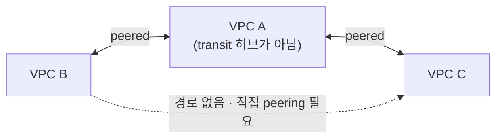
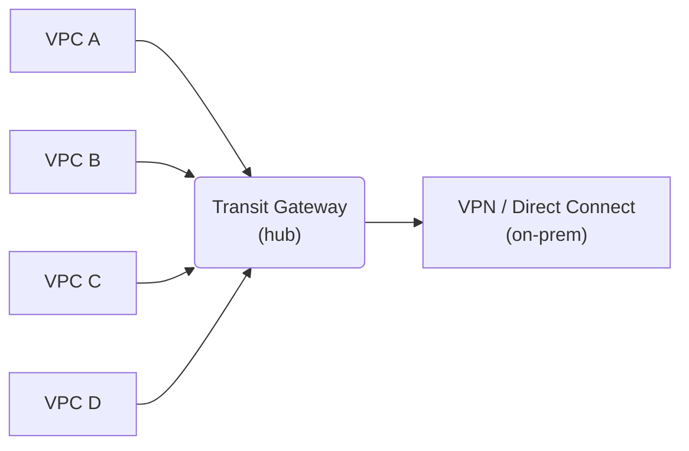
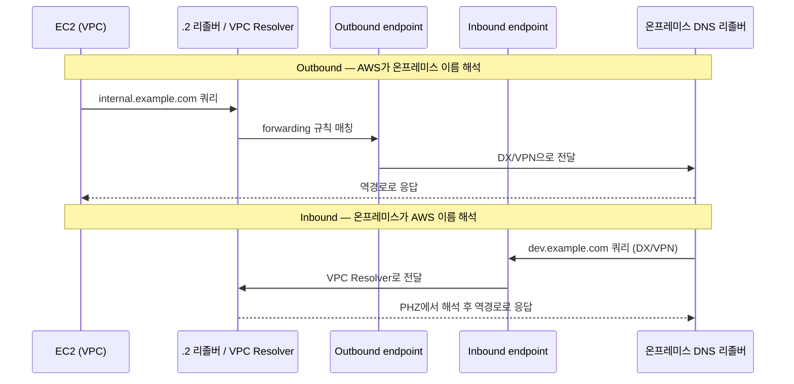

이 글은 [Amazon VPC](https://docs.aws.amazon.com/vpc/latest/userguide/what-is-amazon-vpc.html)를 다른 VPC와, 온프레미스 네트워크와, 그리고 AWS 서비스에 **사설로** 연결하는 7가지 기본 수단을 AWS 공식 문서 기준으로 정리한 노트입니다. 대상은 [VPC Peering](https://docs.aws.amazon.com/vpc/latest/peering/what-is-vpc-peering.html), [Transit Gateway](https://docs.aws.amazon.com/vpc/latest/tgw/what-is-transit-gateway.html), [VPC Endpoint](https://docs.aws.amazon.com/vpc/latest/privatelink/concepts.html)(Gateway·Interface), [AWS PrivateLink](https://docs.aws.amazon.com/vpc/latest/privatelink/what-is-privatelink.html), [Site-to-Site VPN](https://docs.aws.amazon.com/vpn/latest/s2svpn/VPC_VPN.html), [Direct Connect](https://docs.aws.amazon.com/directconnect/latest/UserGuide/Welcome.html), VPC DNS([Route 53 Resolver](https://docs.aws.amazon.com/Route53/latest/DeveloperGuide/resolver.html))입니다. 각 수단의 동작·대역폭 수치·스코핑 규칙·쿼터를 공식 표와 예제 중심으로 옮깁니다. CIDR 표기법과 VPC·서브넷·라우트 테이블 기초는 [1편](/posts/aws-vpc/), 엣지·NAT는 [2편](/posts/aws-vpc-2/), Security Group·Network ACL은 [3편](/posts/aws-vpc-3/)에서 다뤘습니다.

## 한 줄 요지

- **VPC Peering** — 두 VPC를 1:1로 잇는 연결. 비전이적(non-transitive)이고 CIDR이 겹치면 안 됩니다. 소수의 VPC를 단순하게 연결할 때 씁니다.
- **Transit Gateway** — Regional 가상 라우터. 전이적(transitive) 허브앤스포크로, O(n²) 메시를 O(n) attachment로 대체합니다. 수십~수천 개 VPC와 온프레미스를 중앙에서 연결할 때 씁니다.
- **VPC Endpoint** — IGW·NAT·VPN·DX 없이 AWS 서비스에 사설 접근. Gateway(S3·DynamoDB 전용, 무료)와 Interface(대부분 서비스, 유료) 두 종류입니다.
- **AWS PrivateLink** — 내 서비스를 다른 VPC·계정에 단방향으로 사설 노출. 컨슈머와 프로바이더의 CIDR이 겹쳐도 됩니다.
- **Site-to-Site VPN / Direct Connect** — 온프레미스 연결. VPN은 인터넷 위 IPsec, DX는 전용 사설 회선. 프로덕션 권장은 둘의 조합입니다.
- **VPC DNS** — `.2` 리졸버(Route 53 Resolver)와 두 개의 DNS 속성이 위의 사설 연결에서 이름 해석을 뒷받침합니다.

전체를 관통하는 두 원칙이 있습니다.

- **트래픽을 AWS 백본에 유지한다.** Peering·엔드포인트·PrivateLink·Region 간 TGW peering은 모두 패킷을 퍼블릭 인터넷 밖에 두어 DDoS·익스플로잇 노출을 줄입니다.
- **라우팅은 항상 명시적이다.** 거의 모든 수단이 서브넷 라우트 테이블·TGW 라우트 테이블·BGP 광고를 직접 추가할 것을 요구합니다. AWS가 자동으로 연결해 주는 경우는 드뭅니다.

## 연결 결정 트리

세부에 들어가기 전에, "무엇을 무엇에 연결하는가"의 상위 지도입니다. 아래 표에서 필요한 연결 형태를 찾으면 어떤 수단을 쓰는지 바로 정해집니다.

| 연결하려는 대상 | 주요 수단 |
|---|---|
| VPC 두 개(소수, 단순 토폴로지) | **VPC Peering** |
| 다수 VPC + 온프레미스를 허브로(수십~수천) | **Transit Gateway** |
| 내 VPC에서 AWS 서비스(S3/DynamoDB)로, 인터넷 없이 | **Gateway Endpoint** |
| 내 VPC에서 대부분의 다른 AWS 서비스로, 인터넷 없이 | **Interface Endpoint (PrivateLink)** |
| *내* 서비스를 다른 VPC·계정에 노출 | **AWS PrivateLink** (endpoint service + NLB) |
| VPC에서 온프레미스로, 인터넷 위(암호화) | **Site-to-Site VPN** |
| VPC에서 온프레미스로, 전용 사설 회선 | **Direct Connect** |
| VPC 내부·VPC 간·하이브리드 이름 해석 | **Route 53 Resolver + DNS 속성** |

## VPC Peering

**한 줄 요지:** VPC Peering은 두 VPC를 사설 IP로 잇는 1:1 연결이며 별도 하드웨어·게이트웨이·VPN 어플라이언스를 쓰지 않습니다. 단순하지만 전이되지 않고 CIDR이 겹치면 안 된다는 두 가지 한계가 나머지 성격을 결정합니다.

### 정의

VPC peering connection은 두 VPC 사이의 일대일(one-to-one) 네트워킹 연결로, 양쪽 VPC의 리소스가 마치 같은 네트워크에 있는 것처럼 **사설 IP 주소**로 통신하게 합니다. AWS는 **기존 VPC 인프라**를 그대로 활용해 연결을 만들며 별도 물리 하드웨어·게이트웨이·VPN 어플라이언스에 의존하지 않습니다. 그 결과 다음이 성립합니다.

- 단일 장애점(SPOF)이 **없습니다**.
- peering 자체가 만드는 네트워크 대역폭 병목이 **없습니다**.

peering 연결은 다음 사이에 만들 수 있습니다.

- 같은 계정의 내 VPC들
- **다른 AWS 계정**의 VPC(cross-account)
- **다른 AWS Region**의 VPC(inter-Region / cross-region peering)

### 연결 수립 과정

수명주기는 요청/수락 핸드셰이크입니다.

1. **requester VPC** 소유자가 **accepter VPC** 소유자에게 peering 요청을 보냅니다. accepter VPC는 내 계정이거나 다른 계정일 수 있고 **그 CIDR은 requester VPC의 CIDR과 겹치면 안 됩니다.**
2. **accepter VPC** 소유자가 요청을 수락해 연결을 활성화합니다.
3. **양쪽 모두** 자신의 VPC 라우트 테이블에 **peer VPC의 IP 범위**로 향하는 라우트를 수동으로 추가해야 하며 대상(target)은 peering 연결(`pcx-…`)입니다. 트래픽이 흐르려면 라우팅을 **양쪽 다** 설정해야 합니다.
4. 필요하면 **보안 그룹 규칙**을 갱신해 peer VPC로/에서의 트래픽을 허용합니다. 두 VPC가 **같은 Region**이면 내 SG 규칙의 출발지/목적지로 peer VPC의 보안 그룹을 참조할 수 있습니다.
5. 기본적으로 반대쪽 인스턴스의 퍼블릭 DNS 호스트명은 그 인스턴스의 **퍼블릭 IP**로 해석됩니다. peering 연결에 대한 **DNS resolution을 활성화**하면 대신 인스턴스의 **사설 IP**로 해석됩니다.

#### 수명주기 상태

`initiating-request` → `pending-acceptance`(조치가 없으면 **7일** 후 만료) → `provisioning` → `active` 순서로 진행됩니다. 그 외 상태로는 `failed`(2시간 표시), `expired`(2일 표시), `rejected`, `deleting`(inter-Region), `deleted`가 있습니다. `active` 연결은 어느 쪽 소유자든 삭제할 수 있지만 거부(reject)할 수는 없습니다. Regional 이벤트가 트래픽을 막더라도 상태는 **`active`로 유지**됩니다.

### 결정적 한계 1 — 비전이성(non-transitive)

VPC peering은 **비전이적**입니다. VPC A가 VPC B와 peering되어 있고 A가 VPC C와도 peering되어 있어도, **B와 C는 A를 거쳐 통신할 수 없습니다.** 직접 peering하지 않은 VPC와는 어떤 peering 관계도 없습니다. 다음 그림에서 A는 B·C 양쪽과 연결되지만 transit 허브 역할을 하지 못해 B와 C 사이에는 경로가 없습니다.

B와 C를 연결하려면 별도의 **직접** B↔C peering 연결을 만들어야 합니다. N개 VPC를 서로 다 통신시키려면 **풀메시**가 필요합니다.

> 풀메시에 필요한 peering 연결 수 = **n × (n − 1) / 2**

- 4개 VPC → 6개 연결
- 10개 VPC → 45개 연결
- 50개 VPC → 1,225개 연결
- 100개 VPC → 4,950개 연결

이 **메시 폭발(mesh explosion)**이 peering의 핵심 확장 문제이며 Transit Gateway가 존재하는 주된 이유입니다. 메시가 커지면 AWS가 권장하는 공식 대안은 transit 허브로서의 **AWS Transit Gateway** 또는 [AWS Cloud WAN](https://docs.aws.amazon.com/network-manager/latest/cloudwan/what-is-cloudwan.html)입니다.

### 결정적 한계 2 — CIDR 중복 불가

- **matching 또는 overlapping**하는 IPv4 **또는** IPv6 CIDR 블록을 가진 VPC들 사이에는 peering 연결을 만들 수 **없습니다**.
- VPC가 **여러 개**의 IPv4 CIDR 블록을 가지면, 그중 **하나라도** 겹치면 peering이 차단됩니다. 겹치지 않는 블록만 쓰려 하거나 IPv6만 쓰려는 경우여도 마찬가지입니다.
- 백서는 이를 명확히 합니다. 두 VPC는 **primary** IPv4 CIDR이 겹치면 보조(secondary) IPv4/IPv6 블록과 무관하게 peering할 수 없습니다. primary CIDR을 사전에 신중히 설계해야 하는 이유입니다.
- CIDR 중복이 불가능하므로 peering은 같은 CIDR을 가진 두 VPC 간 **ECMP** 로드밸런싱을 애초에 지원하지 않습니다.

### 결정적 한계 3 — edge-to-edge 라우팅 미지원

VPC B의 리소스는 peering된 VPC A에 있는 게이트웨이나 연결을 **빌려 쓸 수 없습니다**.

- B는 **A의 인터넷 게이트웨이**로 인터넷에 나갈 수 없습니다.
- B는 인터넷 접근에 **A의 NAT 장치**를 쓸 수 없습니다.
- B는 회사 네트워크 도달에 **A의 VPN 연결**을 쓸 수 없습니다.
- B는 회사 네트워크 도달에 **A의 Direct Connect** 연결을 쓸 수 없습니다.
- B는 Amazon S3 도달에 **A의 gateway endpoint**를 쓸 수 없습니다.

비전이성 원칙을 게이트웨이에 적용한 것과 같습니다. peering은 두 VPC 자신의 주소 공간만 잇고 그 "뒤"에 있는 것은 잇지 않습니다.

### Inter-Region peering 세부

- Inter-Region peering 트래픽은 **항상 글로벌 AWS 백본에 머물며** 퍼블릭 인터넷을 거치지 않아 위협 벡터(흔한 익스플로잇·DDoS)를 줄입니다.
- **MTU**: 점보 프레임은 **같은 Region** 내에서 **9001바이트**, **inter-Region** peering에서는 **8500바이트**입니다.
- peering된 VPC의 사설 DNS 호스트명을 사설 IP로 해석하려면 peering 연결에서 **DNS resolution support를 활성화해야 합니다.** VPC의 CIDR이 [RFC 1918](https://datatracker.ietf.org/doc/html/rfc1918) 범위 안이더라도 필요합니다.

심화: peering의 그 밖의 한계·고려사항

- VPC당 **활성 + 대기 중 peering 연결 수에 쿼터**가 있습니다(계정 수준, 조정 가능).
- **동일한 두 VPC** 사이에 동시에 둘 이상의 peering 연결을 가질 수 없습니다.
- peer VPC의 **Amazon DNS 서버(`.2` 리졸버)를 쿼리할 수 없습니다.**
- VPC의 IPv4 CIDR이 RFC 1918 범위 **밖**이면, peering DNS resolution을 켜지 않는 한 사설 DNS 호스트명이 사설 IP로 해석되지 않습니다.
- **Unicast Reverse Path Forwarding(uRPF)**은 peering 연결에서 지원되지 **않습니다**.
- peering 연결의 태그는 그것을 만든 계정/Region에서만 적용됩니다.
- **공유 VPC/서브넷**: VPC **소유자(owner)**만 peering 연결을 describe/create/accept/reject/modify/delete할 수 있고 **참여자(participant)는 할 수 없습니다.**
- IPv6는 양쪽 VPC가 IPv6 CIDR을 갖고 인스턴스가 IPv6로 활성화되며 IPv6 트래픽을 peering 연결로 라우팅하면 지원됩니다.

### 비용

**peering 연결 자체에는 요금이 없습니다.** **데이터 전송**에 대해서만 지불합니다(관련되는 경우 inter-Region/inter-AZ 데이터 전송 요율이 적용됩니다).

## AWS Transit Gateway (TGW)

**한 줄 요지:** Transit Gateway는 Regional 가상 라우터이자 허브앤스포크 중심이며 peering과 다른 핵심 차별점은 전이적 라우팅입니다. 모든 스포크가 다른 모든 스포크에 도달할 수 있어 O(n²) 메시를 O(n) attachment로 대체합니다.

### 정의

AWS Transit Gateway는 VPC들과 온프레미스 네트워크 사이 트래픽의 **허브앤스포크** 중심 역할을 하는 **Regional 가상 라우터**입니다. **완전 관리형** 서비스로, 서드파티 가상 어플라이언스나 VPN 오버레이가 필요 없습니다. 고가용성과 확장성은 AWS가 관리합니다. 라우팅은 **Layer 3**에서 일어납니다. 목적지 IP를 기준으로 특정 **next-hop attachment**로 패킷을 전달하며 TGW는 트래픽 양에 따라 **탄력적으로 확장**됩니다.

peering과 구분되는 결정적 속성은 이것입니다.

> **Transit Gateway는 전이적(transitive) 라우팅을 지원합니다.** TGW에 붙은 모든 스포크가 (라우트 테이블 허용 하에) 다른 모든 스포크에 도달할 수 있으므로, O(n²) peering 메시를 O(n) attachment로 대체합니다.

각 VPC는 허브에 정확히 하나의 attachment만 두고 온프레미스 연결(VPN·Direct Connect)도 같은 허브에 붙어 모든 VPC가 공유합니다.

단일 TGW는 같은 Region 안에서 **수천 개의 VPC**를 연결할 수 있습니다. 보통 Region당 **하나**의 TGW를 두고 **TGW 라우트 테이블**로 트래픽을 격리·세그먼트합니다. HA를 위해 TGW를 추가할 필요는 없습니다. TGW는 설계상 고가용성입니다. (여러 개를 운영하는 정당한 이유도 있습니다. 오설정의 blast radius 제한, 컨트롤 플레인 운영 분리, 관리 편의 등.)

### attachment 종류

TGW attachment는 패킷의 **출발지이자 목적지**입니다. 붙일 수 있는 대상은 다음과 같습니다.

- **하나 이상의 VPC.** TGW가 선택한 서브넷에 **ENI**를 배치해 트래픽을 라우팅합니다. 도달 가능하게 하려는 **가용 영역(AZ)마다** 최소 하나의 서브넷을 활성화해야 합니다. 리소스는 자신과 **같은 AZ**에 attachment 서브넷이 있을 때에**만** TGW에 도달할 수 있습니다.
- **하나 이상의 VPN 연결**(Site-to-Site VPN).
- **하나 이상의 VPN Concentrator.**
- **하나 이상의 AWS Direct Connect 게이트웨이.**
- **하나 이상의 Transit Gateway Connect attachment**([GRE](https://datatracker.ietf.org/doc/html/rfc2784) + [BGP](https://datatracker.ietf.org/doc/html/rfc4271), SD-WAN 어플라이언스용).
- **하나 이상의 Transit Gateway peering 연결**(같은 또는 다른 Region의 다른 TGW로).

### 라우트 테이블 — association과 propagation

**한 줄 요지:** TGW 라우팅은 각 attachment를 어느 라우트 테이블에 묶을지(association)와 그 라우트를 어느 테이블에 전파할지(propagation)로 제어합니다. 이 두 개념이 세그먼트 설계의 핵심입니다.

TGW 라우팅은 **transit gateway 라우트 테이블**로 제어합니다(VPC 서브넷 라우트 테이블과는 별개입니다).

- TGW는 기본적으로 **default 라우트 테이블**을 갖고 이는 기본 **association** 라우트 테이블이자 기본 **propagation** 라우트 테이블입니다.
- **추가** 라우트 테이블(기본 쿼터 **TGW당 20개**, 조정 가능)을 만들어 **attachment의 부분집합을 격리**할 수 있습니다. 세그먼트(예: prod vs dev, 격리 VPC, 공유 서비스)를 이렇게 구성합니다.
- **Association**: 각 attachment는 **정확히 하나**의 라우트 테이블에 연결됩니다. 한 라우트 테이블은 **0개~다수**의 attachment와 연결될 수 있습니다.
- **Propagation**: attachment는 자신의 라우트를 **하나 이상**의 라우트 테이블에 **전파**할 수 있습니다.
  - **VPC attachment**의 경우 VPC의 **CIDR 블록**이 전파됩니다.
  - **동적 라우팅**을 쓰는 **VPN / VPN Concentrator / Direct Connect 게이트웨이** attachment의 경우, 온프레미스에서 **BGP**로 학습한 라우트가 전파될 수 있습니다. 그리고 TGW 라우트 테이블의 라우트가 BGP로 customer gateway에 다시 광고됩니다.
  - **TGW peering attachment는 STATIC 라우트만 지원합니다**(동적 라우팅 없음).
- **static 라우트**와 **blackhole 라우트**(매칭 트래픽을 의도적으로 드롭)를 추가할 수 있습니다.
- static 라우트와 propagated 라우트가 같은 목적지를 공유하면 **static 라우트가 이깁니다.**

심화: 라우트 평가 순서(most-specific first)

TGW는 **가장 구체적인(longest-prefix)** 라우트를 먼저 평가합니다. **서로 다른 attachment 종류**에서 온 동일 CIDR에 대한 우선순위는 다음과 같습니다.

static 라우트 → prefix-list 참조 라우트 → VPC 전파 → Direct Connect 게이트웨이 전파 → TGW Connect 전파 → VPN-over-private-DX 전파 → VPN 전파 → VPN Concentrator → Client VPN → TGW peering(Cloud WAN).

**같은** BGP 지원 attachment 종류에서 온 동일 CIDR은 BGP 속성이 결정합니다(더 짧은 AS-path, 더 낮은 MED, iBGP보다 eBGP 우선). TGW는 **선호(preferred)** 라우트만 표시하며 백업 라우트는 활성 라우트가 철회될 때만 나타납니다.

### appliance mode — 상태 저장 검사

**한 줄 요지:** appliance mode는 상태 저장 방화벽 같은 어플라이언스를 위해 왕복 트래픽이 같은 ENI/AZ를 지나도록 흐름을 고정합니다.

**상태 저장 네트워크 어플라이언스**(예: 방화벽)를 공유 서비스/검사 VPC에서 운영하면, 그 VPC attachment에 **appliance mode**를 활성화해 **흐름 고정(flow stickiness)**을 보장합니다. TGW가 **flow-hash** 알고리즘으로 흐름의 수명 동안 **단일 ENI / AZ**를 선택하고 복귀 트래픽에도 **같은** ENI를 사용합니다. 그 결과 양방향 트래픽이 같은 어플라이언스/AZ를 통해 **대칭적으로** 라우팅됩니다. 이 동작은 AWS Region을 넘어서도 이어집니다.

핵심 규칙입니다.

- 고정을 보장하려면 어플라이언스 VPC에 **정확히 하나**의 TGW를 연결합니다. 여러 TGW는 흐름 상태를 서로 공유하지 않습니다.
- appliance mode가 없으면 TGW는 트래픽을 **출발 AZ**에 유지하고 AZ 장애 시나 해당 AZ에 attachment 서브넷이 없을 때만 AZ를 넘습니다. 이 때문에 다른 AZ의 상태 저장 어플라이언스로 가는 복귀 트래픽이 **드롭**될 수 있습니다.
- 콘솔 / API / CLI로 활성화합니다. `create-transit-gateway-vpc-attachment` 또는 `modify-transit-gateway-vpc-attachment`에서 `--options ApplianceModeSupport=enable`.

이와 별개로 더 새로운 **network function attachment**(예: [AWS Network Firewall](https://docs.aws.amazon.com/network-firewall/latest/developerguide/what-is-aws-network-firewall.html) 통합)가 있습니다. 방화벽을 TGW에 직접 붙이는 방식으로, AWS가 서비스 관리형 버퍼 VPC(AZ당 하나의 [Gateway Load Balancer](https://docs.aws.amazon.com/elasticloadbalancing/latest/gateway/introduction.html) endpoint)를 자동 프로비저닝하고 appliance mode를 자동으로 켜므로, 검사 VPC를 직접 구축할 필요가 없습니다. (static 라우팅만 지원하며 이 기능으로는 서드파티 방화벽을 쓸 수 없습니다.)

### Cross-Region peering과 ECMP

- **TGW peering**은 두 TGW를 **같은 Region 안에서 또는 Region 간에** 연결하고 그 사이 트래픽을 라우팅합니다. **VPC peering과 같은 기반 인프라**를 쓰므로 **암호화**됩니다. peering attachment에서는 **static 라우트만** 지원됩니다.
- **ECMP(Equal-Cost Multi-Path)**:
  - **VPN** attachment는 ECMP를 지원합니다(토글 가능). **여러 VPN 터널을 묶어** 더 높은 대역폭을 얻는 데 씁니다(**동적/BGP** 라우팅 필요, static VPN에서는 미지원).
  - **TGW Connect**와 **Direct Connect 게이트웨이** attachment는 ECMP를 자동 지원합니다(DX 게이트웨이는 prefix·prefix-length·AS_PATH가 정확히 일치할 때).
  - **VPC** attachment는 ECMP를 지원하지 **않습니다**(CIDR이 겹칠 수 없으므로).
  - **TGW peering**은 ECMP를 지원하지 **않습니다**(동적 라우팅이 없어 하나의 static 라우트를 두 target에 겨눌 수 없음).
  - ECMP는 **서로 다른 attachment 종류 사이에서는** 지원되지 않습니다.

### 대역폭과 쿼터

**한 줄 요지:** TGW의 대역폭·쿼터에는 정확한 공식 수치가 있으며 대부분 조정 가능합니다. VPC attachment당 대역폭은 문서 버전에 따라 값이 갈리므로 아래 주의가 필요합니다.

> [!IMPORTANT] 버전 주의 — 50 Gbps vs 100 Gbps/AZ
> AWS는 과거 VPC attachment당 한도를 **최대 50 Gbps**로 문서화했습니다. 현행 Transit Gateway Quotas 페이지는 **VPC attachment당, AZ당, 각 방향 최대 100 Gbps**(인그레스 100 Gbps + 이그레스 100 Gbps)로 명시하며, AWS가 기본값을 넘는 추가 대역폭을 제공하려 시도한다고 밝힙니다. 많은 학습 가이드와 오래된 블로그가 여전히 50 Gbps를 인용합니다. **50 Gbps는 legacy 기본값, 100 Gbps/AZ는 현행 공개 상한**으로 취급합니다.

**대역폭**

- **VPC attachment당, AZ당:** 각 방향 최대 **100 Gbps**(SA/TAM 통해 조정 가능).
- **Direct Connect 게이트웨이 / peer TGW 연결당, AZ당:** 각 방향 최대 **100 Gbps**.
- **VPC attachment당, AZ당 초당 패킷:** 최대 **7,500,000**(SA/TAM 통해 조정 가능).
- **TGW Connect peer당(GRE 터널):** 최대 **5 Gbps**, 최대 **300,000 pps**.
- **TGW Connect attachment:** 총 최대 **20 Gbps**(최대 **4개 Connect peer**, ECMP 집계).
- **VPN 터널당:** 표준 **1.25 Gbps**(아래 VPN 섹션 참고). TGW/Cloud WAN에서 "Large Bandwidth Tunnel"은 **터널당 최대 5 Gbps**를 지원합니다. 각 최대 4.9 Gbps인 2개 터널에 ECMP를 적용하면 약 **9.8 Gbps**로 집계할 수 있습니다.

**일반 쿼터(기본값, Region별)**

- **계정당** transit gateway: **5**(조정 가능).
- TGW당 CIDR 블록(Connect용): **5**(조정 불가).
- **TGW당 attachment**: **5,000**(조정 가능) → 이것이 "수천 개 VPC"의 실질 상한입니다.
- **VPC당** transit gateway: **5**(조정 불가).
- **TGW당 peering attachment**: **50**(조정 가능).
- **TGW당 라우트 테이블**: **20**(조정 가능).
- **TGW당 총 라우트(동적 + static)**: **10,000**.
- TGW당 Direct Connect 게이트웨이: **20**. DX 게이트웨이당 transit gateway: **6**.

심화: TGW의 MTU 규칙

- TGW는 VPC·Direct Connect·TGW Connect·peering attachment 사이에서 **8500바이트**를 지원합니다(intra-Region, inter-Region, Cloud WAN peering).
- TGW 위 **VPN** 트래픽: MTU **1500바이트**.
- TGW는 모든 패킷에 **MSS clamping**을 적용합니다. VPC peering(9001)에서 TGW(8500)로 마이그레이션하면 MTU 불일치로 비대칭 점보 패킷이 드롭될 수 있으므로, 두 VPC를 동시에 갱신합니다.
- TGW는 VPC와 Connect attachment의 인그레스에서 **PMTUD**를 지원합니다(ICMP "frag needed" / "packet too big" 생성). 단 VPN·Direct Connect·peering attachment에서는 지원하지 **않습니다**.

### Cross-account 공유와 배치

- [AWS Resource Access Manager](https://docs.aws.amazon.com/ram/latest/userguide/what-is.html)(RAM)로 같은 Region 안에서 AWS Organization 내 계정들에 TGW를 공유합니다.
- 모범 사례는 조직의 TGW를 전용 **Network Services 계정**에 두어 네트워크 엔지니어가 중앙에서 관리하는 것입니다.

### peering 메시 문제를 TGW가 푸는 방식

두 수단의 핵심 트레이드오프를 한 표로 정리하면 다음과 같습니다.

| 항목 | VPC Peering | Transit Gateway |
|---|---|---|
| 토폴로지 | 점대점(1:1) | 허브앤스포크 |
| 전이성 | **비전이적** | **전이적** |
| N개 VPC 풀메시 연결 수 | **n(n−1)/2** | **N개 attachment** |
| 추가 홉 / 지연 | **추가 홉 없음**(직접) | 허브를 거치는 **홉 1개** 추가 |
| 대역폭 | 집계 한도 없음(VPC-to-VPC) | VPC attachment당 최대 **100 Gbps/AZ** |
| MTU(같은 Region) | **9001** | **8500** |
| MTU(inter-Region) | **8500** | **8500** |
| 온프레미스(VPN/DX) 통합 | peer를 거쳐 전이 불가 | 1급 attachment, 모든 VPC가 공유 |
| 비용 | 무료 + 데이터 전송만 | **attachment-시간당 + GB당 데이터 처리** + 데이터 전송 |
| 적합한 경우 | 소수 VPC, 최저 지연/비용 | 다수 VPC, 중앙 라우팅, 대규모 하이브리드 |

경험칙은 이렇습니다. VPC가 소수이고 지연/비용이 중요하면 **peering**, VPC가 다수이고 세그먼트·중앙 온프레미스 연결이 필요하면 **Transit Gateway**입니다.

## VPC Endpoint — AWS 서비스에 사설 접근

**한 줄 요지:** VPC endpoint는 인터넷 게이트웨이·NAT·VPN·Direct Connect 없이 지원 AWS 서비스에 접근하게 하며 트래픽이 AWS 네트워크에 머뭅니다. 크게 Gateway endpoint(라우트 테이블 기반, S3·DynamoDB 전용)와 PrivateLink 기반 endpoint(Interface·Gateway Load Balancer·Resource·Service-network)로 나뉩니다.

VPC endpoint는 VPC의 리소스가 지원 AWS 서비스(그리고 내 서비스)에 인터넷 게이트웨이·NAT 장치·VPN·Direct Connect **없이** 연결하게 합니다. 트래픽은 **AWS 네트워크에 머뭅니다.** endpoint 종류는 두 계열로 나뉩니다. **Gateway** endpoint(라우트 테이블 기반, S3/DynamoDB 전용)와 **PrivateLink 기반** endpoint(Interface, Gateway Load Balancer, Resource, Service-network)입니다.

### Gateway Endpoint (S3와 DynamoDB 전용)

**한 줄 요지:** Gateway endpoint는 라우트 테이블에 prefix list 라우트를 추가해 S3·DynamoDB에 사설 접근하는 무료 수단이며 자기 VPC 안에서만 동작합니다.

- **지원 서비스: Amazon S3와 Amazon DynamoDB — 이 둘, 그리고 오직 이 둘뿐입니다.**
- Gateway endpoint는 다른 endpoint 종류와 달리 **AWS PrivateLink를 쓰지 않습니다.**
- **요금: 추가 요금이 없습니다(무료).**
- **Region-local**: gateway endpoint는 자기 Region 안에서만 동작합니다(prefix list가 Region별입니다).
- **IPv4**(서비스와 서브넷이 허용하는 곳에서 IPv6/dualstack 지원 추가).

#### 동작 방식 — 라우트 테이블 + prefix list

gateway endpoint를 만들 때 VPC **라우트 테이블**을 선택합니다. AWS가 자동으로 다음 라우트를 추가합니다.

| Destination | Target |
|---|---|
| `{prefix_list_id}`(서비스용 AWS 관리형 prefix list) | `{gateway_endpoint_id}`(`vpce-…`) |

목적지는 서비스용 **AWS 관리형 prefix list**이고 대상은 gateway endpoint입니다. 이 endpoint 라우트는 **수동으로 수정·삭제할 수 없습니다.** 라우트 테이블을 연결/해제하면 나타나고 사라집니다. 동작은 다음과 같습니다.

- 그 라우트 테이블에 연결된 서브넷의 **모든 인스턴스**가 자동으로 endpoint를 사용합니다. 연결되지 **않은** 서브넷의 인스턴스는 **퍼블릭** 서비스 endpoint를 씁니다.
- 한 라우트 테이블은 S3 endpoint 라우트와 DynamoDB endpoint 라우트를 **둘 다** 가질 수 있지만 한 라우트 테이블에 **같은 서비스로 향하는 라우트를 둘** 가질 수는 없습니다.
- **Longest-prefix match**가 이깁니다. **같은 Region** S3/DynamoDB 트래픽에 대해 endpoint(prefix-list) 라우트가 `0.0.0.0/0` → 인터넷 게이트웨이 라우트보다 우선합니다. **다른 Region**의 서비스로 향하는 트래픽은 여전히 인터넷 게이트웨이로 나갑니다(prefix list가 Region 범위이므로).

#### 보안

인스턴스는 서비스의 **퍼블릭 endpoint** 주소로 서비스에 접근하므로, 보안 그룹이 **서비스로/에서의 트래픽을 허용**해야 합니다. 이때 SG 아웃바운드 규칙에서 **서비스의 prefix list ID를 직접 참조**할 수 있습니다(예: 목적지 = prefix list, TCP 443). Network ACL은 prefix list를 참조할 수 **없으므로**, NACL 규칙에는 prefix list의 실제 IP 범위를 써야 합니다.

#### Gateway endpoint의 큰 한계 (Interface endpoint 선택을 가르는 지점)

- gateway endpoint는 **온프레미스에서 접근할 수 없습니다**(VPN/DX 경유).
- gateway endpoint는 **다른 Region에서 접근할 수 없습니다.**
- peering된 VPC나 TGW를 거쳐 **전이적으로** 쓸 수 없습니다(endpoint 라우트를 라우트 테이블에 가진 VPC 안에서만 동작).

### Interface Endpoint (AWS PrivateLink 기반)

**한 줄 요지:** Interface endpoint는 서브넷에 사설 IP를 가진 ENI를 두어 서비스에 접근하며 DNS 기반으로 동작하고 온프레미스·타 Region에서도 도달할 수 있습니다. 대신 유료입니다.

interface endpoint는 서브넷에 배치된 하나 이상의 **Elastic Network Interface(ENI)**이며 각각 서브넷 범위에서 **사설 IP**를 할당받습니다. **AWS PrivateLink** 기반 서비스에 연결되며 여기에는 **대부분의 AWS 서비스**와 **내** PrivateLink 서비스가 포함됩니다.

핵심 속성입니다.

- 선택한 **서브넷마다** AWS가 **endpoint 네트워크 인터페이스**를 만들고 사설 IP를 할당합니다. 이 ENI는 **requester-managed**로, 계정에서 보이지만 직접 관리할 수는 없습니다. **ping에 응답하지 않으므로** `nc`/`nmap`으로 테스트합니다.
- **AZ당 서브넷 하나**입니다(같은 AZ의 서브넷 둘을 고를 수 없습니다). 서브넷 CIDR의 처음 네 개와 마지막 IP는 예약되어 있어 ENI에 할당할 수 없습니다.
- **라우트 테이블이 아니라 DNS 기반입니다.** **private DNS**를 활성화하면 서비스의 평소 퍼블릭 DNS 이름(예: `ec2.us-east-1.amazonaws.com`)이 VPC 안에서 interface endpoint의 **사설 IP**로 해석됩니다. 기존 SDK/CLI 호출이 코드 변경 없이 사설로 "그냥 동작"합니다. private DNS를 켜려면 VPC 속성 `enableDnsSupport`와 `enableDnsHostnames`가 **둘 다** `true`여야 **합니다.**
- **보안 그룹으로 제어합니다.** endpoint ENI에 **보안 그룹**을 붙여 기대하는 트래픽(예: VPC 리소스에서 오는 인바운드 HTTPS/443)을 허용합니다. 리소스 서브넷의 NACL도 그 트래픽을 허용해야 합니다.
- **endpoint 정책.** endpoint에 붙는 IAM **리소스 정책**이 그것을 통과할 수 있는 principal/action/resource를 제어합니다(기본값 = 전체 허용).
- **서비스 이름**은 AWS 서비스의 경우 `com.amazonaws.<region>.<service>` 형식입니다.
- **요금: 시간당 사용량 + GB당 데이터 처리로 과금됩니다**(무료인 gateway endpoint와의 비용 차이입니다).
- **온프레미스·타 Region/VPC에서 도달 가능합니다.** 이것이 gateway endpoint 대비 대표 이점입니다(아래 비교 표 참고). 온프레미스 앱은 **Direct Connect 또는 Site-to-Site VPN**으로 interface endpoint에 도달하고 타 Region VPC는 **VPC peering 또는 Transit Gateway**로 도달합니다.
- PrivateLink로 공유된 서비스에는 **Cross-Region endpoint**가 지원됩니다("Enable cross Region endpoint" 체크박스로 서비스 Region 선택).

### Gateway Load Balancer Endpoint

Gateway Load Balancer endpoint는 트래픽을 **가상 어플라이언스** 플릿(방화벽, IDS/IPS, 심층 패킷 검사)에 **사설 IP**로 보냅니다. 라우트 테이블로 VPC 트래픽을 GWLB endpoint에 라우팅하면, **Gateway Load Balancer**가 트래픽을 어플라이언스에 분산하고 수요에 따라 확장합니다. 서드파티 보안 어플라이언스를 트래픽 경로에 투명하게 삽입하는 PrivateLink 메커니즘입니다(앞서 언급한 TGW Network Firewall 통합에서도 내부적으로 사용됩니다).

### 더 새로운 PrivateLink endpoint 종류

- **Resource endpoint**(`Resource`): 다른 VPC나 온프레미스에 있는 **단일 공유 리소스**(데이터베이스, EC2 인스턴스, 애플리케이션 endpoint, 도메인 이름 target, IP)에 사설 접근합니다. **로드밸런서가 필요 없으며** 리소스에 직접 접근합니다.
- **Service-network endpoint**(`Service network`): **service network**에 연결된 **여러** 리소스/서비스에 접근하는 **단일** endpoint입니다([VPC Lattice](https://docs.aws.amazon.com/vpc-lattice/latest/ug/what-is-vpc-lattice.html) 방식의 집계).

### Gateway vs Interface endpoint — 표준 비교 (S3 예)

**한 줄 요지:** Gateway와 Interface endpoint의 결정적 차이는 온프레미스·타 Region 접근 가능 여부와 과금 여부입니다.

Amazon S3(그리고 DynamoDB)는 **두 endpoint 종류를 모두** 지원하며 같은 VPC에서 둘을 함께 운영할 수 있습니다. AWS의 직접 비교입니다.

| S3용 Gateway endpoint | S3용 Interface endpoint |
|---|---|
| 네트워크 트래픽이 AWS 네트워크에 머뭄 | 네트워크 트래픽이 AWS 네트워크에 머뭄 |
| S3 **퍼블릭** IP 주소 사용 | VPC의 **사설** IP 사용 |
| **동일한** S3 DNS 이름 사용 | **endpoint 전용** S3 DNS 이름 필요(또는 private DNS) |
| 온프레미스 접근 **불가** | 온프레미스 접근 **허용**(DX / VPN) |
| 다른 Region 접근 **불가** | 다른 Region 접근 **허용**(peering / TGW) |
| **과금 없음** | **과금**(시간당 + GB당) |

> [!TIP] S3 비용 최적화 — gateway + interface 병행
> **VPC 내부** S3 트래픽에는 **무료 gateway endpoint**를 유지하고, **온프레미스** 트래픽용으로만 **interface endpoint**를 추가합니다. private DNS의 "inbound-resolver-only" 모드가 VPC 내부 요청은 gateway endpoint로, 온프레미스 요청은 interface endpoint로 라우팅해 과금 대상 트래픽을 최소화합니다.

## AWS PrivateLink — 내 서비스를 노출하기

**한 줄 요지:** AWS PrivateLink는 프로바이더가 자신의 서비스를 다른 VPC·계정의 컨슈머에게 사설로 노출하는 기술이며 단방향이고 CIDR 조율이 불필요합니다.

AWS PrivateLink는 **프로바이더**가 서비스를 다른 VPC와 계정의 **컨슈머**에게 사설로 노출하게 하는 기술입니다. VPC peering도, 인터넷 게이트웨이도, **CIDR 조율도** 필요 없습니다. 컨슈머는 **interface endpoint**로 서비스에 도달하며 트래픽은 AWS 네트워크에 머물고 퍼블릭 인터넷을 절대 거치지 않습니다. 아래 그림은 연결이 컨슈머 → 프로바이더 **한 방향**으로만 열리고 두 VPC의 CIDR이 겹쳐도(`10.0.0.0/16` 양쪽) 성립하는 구조를 보여줍니다.

### 프로바이더 측 (서비스 공유)

1. **서비스 프로바이더**는 애플리케이션을 자신의 VPC에서 **Network Load Balancer(NLB)** 뒤에 둡니다(NLB가 서비스 프런트엔드입니다). (어플라이언스 변형에는 Gateway Load Balancer를 씁니다.)
2. 프로바이더가 그 로드밸런서를 가리키는 **endpoint service** 구성을 만듭니다. AWS가 다음 형식의 서비스 이름을 부여합니다.
   `{endpoint_service_id}.{region}.vpce.amazonaws.com`
   (예: `vpce-svc-071afff70666e61e0.us-east-2.vpce.amazonaws.com`).
3. 기본적으로 endpoint service는 누구에게도 제공되지 **않습니다.** 프로바이더가 특정 AWS principal(계정/역할)에 **권한을 부여**해야 연결할 수 있습니다.
4. 프로바이더는 들어오는 각 연결 요청을 **수락하거나 거부**할 수 있습니다(auto-accept 선택 가능).
5. 권장: HA를 위해 서비스를 **최소 두 개 AZ**에서 제공합니다. endpoint service는 NLB에 활성화한 AZ에서 제공됩니다. cross-zone 로드밸런싱이 대안이지만 EC2 데이터 전송 요금이 발생하고 격리 이점을 잃습니다.
6. 선택적으로 **private DNS 이름**을 연결해 컨슈머가 서비스의 기존 DNS 이름을 계속 쓰게 합니다.

### 컨슈머 측

- **컨슈머**는 프로바이더의 **서비스 이름**을 지정해 **interface VPC endpoint**를 만듭니다. AWS가 컨슈머가 선택한 서브넷에 endpoint ENI(AZ당 하나)를 사설 IP로 만듭니다.
- 컨슈머는 **endpoint 정책**으로 접근을 제어합니다(어느 IAM principal이 endpoint를 쓸 수 있는지).
- AWS가 컨슈머에게 **Regional**·**zonal** DNS 이름을 생성합니다.
  - Regional: `{endpoint_id}.{endpoint_service_id}.{service_region}.vpce.amazonaws.com`
  - Zonal: `{endpoint_id}-{endpoint_zone}.{endpoint_service_id}.{service_region}.vpce.amazonaws.com`

  Regional 요청은 서로 다른 AZ의 정상 ENI에 라운드로빈되고 zonal 이름은 트래픽을 한 AZ에 유지합니다.

### 결정적 속성

- **단방향(unidirectional):** **컨슈머만** 프로바이더로 연결을 개시합니다. 프로바이더는 컨슈머 VPC로 역방향 연결을 개시할 수 없습니다. 이것이 신뢰할 수 없는/독립적인 계정에 서비스를 노출해도 PrivateLink가 안전한 이유입니다.
- **CIDR 조율 불필요:** **컨슈머와 프로바이더 VPC의 IP 범위가 겹쳐도 됩니다.** PrivateLink는 두 주소 공간을 잇지 않습니다(peering/TGW와 다릅니다). 다수 고객을 상대하는 SaaS 프로바이더에게 큰 운영 이점입니다.
- **Cross-account·Cross-Region:** 서비스는 (권한을 통해) 계정 간에 공유되고 (`vpce:AllowMultiRegion`과 조건 키 `ec2:VpceSupportedRegion` / `ec2:VpceServiceRegion`을 통해) 여러 Region에서 제공될 수 있습니다. cross-Region 접근에서 PrivateLink는 **AZ** 페일오버는 관리하지만 **cross-Region** 페일오버는 관리하지 않습니다. AWS는 가능하면 intra-Region 연결을 권장합니다(더 낮은 지연·비용).
- **IPv4/IPv6/dualstack:** 프로바이더는 백엔드가 IPv4 전용이어도 IPv4·IPv6·둘 다로 노출할 수 있습니다(NLB가 dualstack이어야 함). endpoint ENI의 IPv6 주소는 **인터넷에서 도달할 수 없습니다**(`denyAllIgwTraffic`이 설정됨).
- **Split-horizon DNS:** 퍼블릭 웹사이트와 PrivateLink endpoint service에 같은 도메인 이름을 쓸 수 있습니다. 컨슈머 VPC 요청은 사설 endpoint ENI로 해석되고 외부 요청은 퍼블릭 endpoint로 해석됩니다.

심화: 리소스 공유(더 새로운 모델)

전체 서비스가 아니라 **리소스**를 공유하려면, **resource provider**가 **resource configuration**(IP, 도메인 이름 target, 또는 Amazon RDS 데이터베이스를 나타냄)을 만들어 **AWS RAM**으로 공유합니다. 컨슈머는 **resource VPC endpoint** 또는 **service-network VPC endpoint**로 도달하며 로드밸런서가 필요 없습니다. **resource gateway**는 리소스가 공유되는 프로바이더 VPC로의 진입점입니다.

## AWS Site-to-Site VPN

**한 줄 요지:** Site-to-Site VPN은 VPC와 온프레미스 네트워크 사이에 퍼블릭 인터넷을 지나는 IPsec 연결을 만듭니다. 연결마다 두 개의 터널이 있어 고가용성을 제공합니다.

### 정의

AWS Site-to-Site VPN은 VPC와 **온프레미스**(또는 다른 원격) 네트워크 사이에 **퍼블릭 인터넷 위**로 [IPsec](https://datatracker.ietf.org/doc/html/rfc4301) VPN 연결을 만듭니다. 기본적으로 VPC 인스턴스는 온프레미스 네트워크에 도달할 수 없으며 Site-to-Site VPN 연결과 라우팅이 이를 가능하게 합니다. Site-to-Site VPN은 **IPsec** 터널만 지원합니다.

### 핵심 구성요소

- **VPN 연결** — 온프레미스 장비와 VPC들 사이의 보안 연결입니다.
- **VPN 터널** — AWS로 데이터를 오가게 하는 암호화 링크입니다. **각 VPN 연결은 두 개의 VPN 터널**을 포함하며 고가용성을 위해 **동시에** 쓸 수 있습니다(각 터널 endpoint는 AWS Region 안의 **서로 다른 AZ**에 있습니다).
- **Customer gateway** — 온프레미스 장치를 기술하는 AWS 리소스입니다.
- **Customer gateway device** — 사용자 쪽의 물리/소프트웨어 장치입니다.
- **Target gateway** — Amazon 쪽 endpoint를 가리키는 일반 용어이며 다음 중 하나입니다.
  - **Virtual Private Gateway(VGW)** — **단일 VPC**에 붙는 VPN endpoint.
  - **Transit Gateway** — **다수** VPC와 온프레미스 네트워크의 Amazon 쪽 VPN endpoint 역할을 하는 transit 허브.

### 대역폭과 처리량

**한 줄 요지:** VPN 터널당 표준 대역폭은 1.25 Gbps이며 TGW에 붙이면 더 큰 터널과 ECMP 집계로 대역폭을 올릴 수 있습니다.

- **표준: 터널당 최대 1.25 Gbps**, 그리고 **VPN 연결당 약 140,000 pps**.
- **Large Bandwidth Tunnel: 터널당 최대 5 Gbps** — VPN이 **Transit Gateway 또는 Cloud WAN**에 붙었을 때만 제공됩니다(VGW 불가).
- **VGW 한도:** 처리량이 **터널당 1.25 Gbps**로 제한되고 VGW에서는 **ECMP가 지원되지 않습니다.** 즉 VGW에서는 터널을 묶어 대역폭을 올릴 수 없습니다.
- **TGW + ECMP:** VPN을 **Transit Gateway(또는 Cloud WAN)**에 종단하면 **ECMP**로 **여러 터널을 묶어** 더 높은 대역폭을 얻을 수 있습니다. 단 **동적/BGP 라우팅에서만** 가능합니다(static 라우팅 VPN에서는 ECMP 미지원). 예: 각 최대 **4.9 Gbps**인 2개 터널을 약 **9.8 Gbps**로 집계.
- 한 연결의 두 터널은 **같은** 대역폭 구성을 써야 합니다(둘 다 1.25 Gbps 또는 둘 다 5 Gbps).

심화: 라우팅·암호화·기능

- **라우팅**: **static** 또는 **동적(BGP)**. ECMP와 자동 페일오버 동작에는 동적/BGP가 필요합니다.
- **ASN**: Amazon 쪽(VGW)은 4-byte ASN(1–2147483647), customer gateway는 2-byte ASN(1–65535).
- **암호화/IKE**: [IKEv2](https://datatracker.ietf.org/doc/html/rfc7296), NAT traversal, **AES-256**, **SHA-2** 해싱, 추가 Diffie-Hellman 그룹, 구성 가능한 터널 옵션, AWS Private CA의 사설 인증서.
- **IPv6**: 내부(패킷) IP는 지원. 외부(outer) 터널 IP의 IPv6는 **TGW / Cloud WAN**에서만(VGW 불가). 단일 VPN 연결은 IPv4와 IPv6를 동시에 실을 수 없으므로 별도 연결을 씁니다. 기존 IPv4 VPN을 IPv6로 변환할 수 없습니다(삭제 후 재생성).
- **Accelerated Site-to-Site VPN**: AWS가 두 개의 [Global Accelerator](https://docs.aws.amazon.com/global-accelerator/latest/dg/what-is-global-accelerator.html) accelerator를 만들어 VPN 트래픽을 AWS 글로벌 네트워크로 라우팅해 성능을 높입니다(추가 accelerator + 데이터 요금).
- **제약**: Path MTU Discovery 없음. VPN 위 MTU 1500. 여러 VPC를 공통 온프레미스 네트워크에 연결할 때는 **겹치지 않는 CIDR**을 권장합니다.

### 비용

**VPN 연결-시간당**(프로비저닝 + 사용 가능) 요금에 **데이터 전송 아웃**을 더해 지불합니다. Accelerated VPN은 Global Accelerator 시간당 + 데이터 전송 요금을 더합니다. IPv6에는 추가 요금이 없습니다.

## AWS Direct Connect (DX)

**한 줄 요지:** Direct Connect는 온프레미스 라우터와 AWS Direct Connect 위치 사이의 전용 사설 물리 회선으로, 퍼블릭 인터넷을 우회해 일관된 낮은 지연과 예측 가능한 처리량을 제공합니다. 기본적으로 암호화되지 않습니다.

### 정의

AWS Direct Connect는 온프레미스/colo 라우터와 **AWS Direct Connect 위치** 사이의 **전용 사설 물리 네트워크 연결**(광케이블)로, 퍼블릭 인터넷을 우회합니다. **일관된 낮은 지연**, 더 높고 예측 가능한 처리량, 그리고 (종종) 인터넷/VPN 대비 절감된 데이터 전송 비용을 제공합니다.

### 연결 속도

- **Dedicated connection**(AWS 장치의 직접 포트, 고객 1인): **1 Gbps, 10 Gbps, 100 Gbps, 또는 400 Gbps**.
- **Hosted connection**(**AWS Direct Connect Partner**가 사전 구성된 링크로 프로비저닝): **50 Mbps ~ 25 Gbps**. 이산 값: **50, 100, 200, 300, 400, 500 Mbps 및 1, 2, 5, 10, 25 Gbps**.
- 여러 연결을 **Link Aggregation Group(LAG)**으로 묶어 하나처럼 다룰 수 있습니다.

### Virtual Interface (VIF)

**한 줄 요지:** DX 연결을 쓰려면 최소 하나의 VIF를 만들어야 하며 각 VIF는 BGP 세션과 VLAN 태그를 갖고 세 종류로 나뉩니다.

DX 연결을 쓰려면 최소 하나의 VIF를 만들어야 합니다. 각 VIF는 **BGP** peering 세션을 실행하고 **VLAN 태그**(802.1Q, 값 1–4094)를 가집니다. 세 종류입니다.

| VIF 종류 | 접근 대상 | 비고 |
|---|---|---|
| **Private VIF** | **사설 IP를 쓰는 하나 이상의 VPC** | **VGW**(단일 VPC, 같은 Region) 또는 **Direct Connect 게이트웨이**(모든 Region의 VPC)에 연결. MTU **1500 또는 9001**(점보). |
| **Public VIF** | **퍼블릭 IP를 쓰는 모든 AWS 퍼블릭 서비스**(S3, 퍼블릭 API endpoint, Amazon.com 등) | AWS가 Amazon prefix를 광고하고, 사용자는 퍼블릭/BYOIP prefix를 광고(≥1개, 최대 **1,000개** prefix). 비Amazon prefix 접근 불가. SiteLink 없음. |
| **Transit VIF** | **Direct Connect 게이트웨이에 연결된 하나 이상의 Transit Gateway** | 어떤 속도의 dedicated·hosted 연결과도 동작. MTU **1500 또는 8500**(점보). |

심화: MTU·ASN·SiteLink 규칙

- **MTU / 점보 프레임**: private VIF 최대 **9001**, transit VIF 최대 **8500**. 점보로 변경하면 물리 연결이 **최대 30초** 끊길 수 있습니다(그 연결의 모든 VIF). 두 private VIF가 서로 다른 MTU로 같은 라우트를 광고하거나 Site-to-Site VPN이 같은 라우트를 광고하면 **1500**이 사용됩니다.
- **ASN 규칙**: 같은 VIF에서 customer gateway와 VGW/DX 게이트웨이에 같은 ASN을 쓸 수 없습니다. customer-gateway ASN은 여러 VIF에서 재사용할 수 있습니다. 같은 VGW/DX-게이트웨이와 customer-gateway ASN 쌍은 **서로 다른** DX 연결에서 반복될 수 있습니다.
- **SiteLink**(선택): 두 Direct Connect PoP를 **Region을 거치지 않고** 최단 AWS 경로로 연결합니다. transit VIF와 DX 게이트웨이에 붙은 private VIF에서 지원됩니다(public VIF나 VGW에 직접 붙은 private VIF는 불가). 별도 요금이며 GovCloud/중국에서는 제공되지 않습니다.

### Direct Connect Gateway

Direct Connect 게이트웨이는 **전역으로 사용 가능한** 가상 리소스(분산된 BGP route reflector 집합)로, **단일** DX 연결이 **모든 AWS Region의 VPC**에 도달하게 합니다(GovCloud US 포함, **중국 제외**). **데이터 경로 밖**에서 동작하므로 단일 장애점과 Region 의존성을 피합니다. **HA가 내장되어 있어** DX 게이트웨이를 여럿 둘 필요가 없습니다.

DX 게이트웨이는 다음 중 무엇과도 연결할 수 있습니다.

- **transit gateway**(같은 Region에 여러 VPC가 있을 때) — **transit VIF**를 통해.
- **virtual private gateway** — **private VIF**를 통해(VPC당 VGW 하나. 하나의 연결로 Region을 넘나드는 VPC 연결).
- **AWS Cloud WAN** core network.

**Cross-account**: DX 게이트웨이 소유자(예: 계정 Z)는 다른 계정(계정 A/B)의 VGW나 TGW로부터 **association proposal**을 수락할 수 있고 허용 prefix를 선택적으로 제한할 수 있습니다. 계정 Z가 게이트웨이를 소유하므로 라우팅을 소유합니다.

> [!WARNING] 격리 주의 — supernet 광고 시 VPC 간 누수
> 기본적으로 **같은** DX 게이트웨이의 두 association은 서로 트래픽을 보낼 수 없습니다(예: VGW-to-VGW). 하지만 온프레미스에서 **같은** VIF로 여러 연결 VPC에 겹치는 **supernet**(예: `10.0.0.0/8`이나 `0.0.0.0/0`)을 광고하면, 그 VPC들은 서로 통신할 수 있습니다. VPC 간 누수를 막으려면 보안 그룹을 조이거나, supernet 대신 **구체적인**(겹치지 않는) prefix를 광고하거나, **VPC마다 별도 DX 게이트웨이**를 쓰거나, VPC attachment에 **blackhole** 라우트 테이블을 붙입니다.

### 복원력과 DX vs VPN 트레이드오프

**한 줄 요지:** 단일 DX 연결은 물리 회선 하나라 구조상 이중화되지 않으므로, 프로덕션에서는 DX를 이중으로 두거나 VPN을 백업으로 둡니다.

Direct Connect는 단일 물리 회선이므로 단일 DX 연결은 구조상 이중화되어 있지 **않습니다.** 프로덕션 설계는 보통 **두 개의 DX 연결**(가급적 서로 다른 DX 위치)과/또는 **백업으로서의 Site-to-Site VPN**(흔히 public VIF 위 VPN 또는 별도 인터넷 VPN)을 씁니다. [AWS Well-Architected](https://docs.aws.amazon.com/wellarchitected/latest/reliability-pillar/welcome.html) 지침은 온프레미스와 클라우드 사이에 **이중화된 연결**을 프로비저닝하라고 안내합니다.

| 항목 | Site-to-Site VPN | Direct Connect |
|---|---|---|
| 매체 | **퍼블릭 인터넷** 위 IPsec | **전용 사설** 광케이블 회선 |
| 지연/지터 | 가변(인터넷 상황) | **일관적**, 낮음 |
| 대역폭 | 1.25 Gbps/터널(large tunnel 5 Gbps, TGW에서 ECMP 집계) | dedicated 1/10/100/400 Gbps, hosted 50 Mbps–25 Gbps |
| 암호화 | **내장(IPsec)** | **기본 미암호화**(MACsec 또는 VPN-over-DX 추가) |
| 설정 시간 | **수 분**(소프트웨어) | **수 주~수 개월**(물리 프로비저닝, cross-connect) |
| 비용 | 낮은 초기 비용, 시간당 + DTO | 높은 초기 비용(포트 + DX 데이터 전송), 대량에서 종종 더 저렴 |
| 전형적 역할 | 빠른 연결, DX 백업, 소량 | 정상 상태 대량, 예측 가능한 성능, 대규모/민감 워크로드 |

프로덕션의 흔한 패턴은 **Direct Connect(주) + Site-to-Site VPN(백업)**이며 자동 페일오버를 위해 흔히 둘 다 **Transit Gateway**에 **BGP**로 종단합니다.

## VPC의 DNS

**한 줄 요지:** 모든 VPC에는 내장 리졸버인 `.2` Route 53 Resolver가 있고 두 개의 DNS 속성이 사설 이름 해석의 동작 여부를 결정하며 하이브리드 DNS는 inbound/outbound Resolver endpoint로 양방향을 잇습니다.

### Amazon DNS 서버 (`.2` 리졸버)

모든 VPC에는 내장 DNS 리졸버가 있습니다. **Route 53 Resolver**, 일명 "Amazon DNS 서버" 또는 **`AmazonProvidedDNS`**이며 **각 가용 영역에** 존재합니다. 다음 주소로 도달합니다.

- **`169.254.169.253`**(IPv4 link-local)
- **`fd00:ec2::253`**(IPv6)
- **VPC의 primary IPv4 CIDR base + 2**("**.2 리졸버**", 예: `10.0.0.0/16` → `10.0.0.2`)

이 리졸버에 대한 쿼리는 **link-local** 주소를 쓰고 **사설로** 전송되며 **네트워크에서 보이지 않습니다.** 다음에 대해 **재귀적으로** 응답합니다.

- **퍼블릭** 레코드(인터넷 네임 서버에 대한 재귀 조회)
- **VPC 전용** 이름(예: `ec2-192-0-2-44.compute-1.amazonaws.com`)
- **Route 53 private hosted zone**의 레코드

보안 그룹이나 NACL로 Amazon DNS 서버로/에서의 트래픽을 **필터링할 수 없습니다.** 재귀 쿼리만 지원합니다.

> [!IMPORTANT] DNS 쿼터 — 1024 PPS/ENI (증가 불가)
> link-local 주소를 쓰는 서비스에는 **네트워크 인터페이스당 1024 packets-per-second(PPS) 하드 리밋**이 있습니다. 이 집계에는 Route 53 Resolver DNS 쿼리, **IMDS**, **NTP**(Amazon Time Sync), Windows 라이선싱이 포함됩니다. **증가시킬 수 없습니다.** 초과하면 리졸버가 트래픽을 거부합니다(VPC DNS throttling).

### 두 개의 VPC DNS 속성

**한 줄 요지:** `enableDnsSupport`는 리졸버 동작 여부를, `enableDnsHostnames`는 퍼블릭 DNS 호스트명 부여 여부를 제어하며 private hosted zone과 PrivateLink private DNS를 쓰려면 둘 다 `true`여야 합니다.

| 속성 | 기본값 | 제어 대상 |
|---|---|---|
| **`enableDnsSupport`** | **`true`** | Amazon 제공 DNS 서버를 통한 DNS **resolution** 동작 여부. `true`면 `.2`/`169.254.169.253` 리졸버에 대한 쿼리가 성공합니다. |
| **`enableDnsHostnames`** | **`false`**(default VPC는 `true`) | **퍼블릭 IP**를 가진 인스턴스가 **퍼블릭 DNS 호스트명**을 받는지 여부. |

조합 동작입니다.

- **둘 다 `true`** → 퍼블릭 IP를 가진 인스턴스가 퍼블릭 DNS 호스트명을 받고 **또한** 리졸버가 Amazon 제공 **사설** DNS 호스트명을 해석할 수 있습니다.
- **하나라도 `false`** → 퍼블릭 DNS 호스트명 없음. 리졸버가 Amazon 제공 사설 호스트명을 해석할 수 **없습니다.** **DHCP option set**에 custom 도메인을 설정한 경우에만 인스턴스가 custom 사설 호스트명을 받습니다.
- Route 53의 **private hosted zone**을 쓰거나 **interface VPC endpoint(PrivateLink)의 private DNS**를 쓰려면 **둘 다 `true`로 설정해야 합니다.** 가장 흔한 DNS 함정입니다.
- 리졸버는 RFC 1918 **밖**의 VPC CIDR에 대해서도 사설 호스트명을 해석할 수 있습니다. 단 **2016년 10월 이전**에 만든 VPC는 예외입니다(활성화하려면 Support에 문의).

심화: DHCP option set·Private Hosted Zone·Resolver endpoint

**DHCP option set** — VPC의 DHCP option set이 인스턴스에 DNS 구성을 공급합니다. `domain-name-servers`(기본값 `AmazonProvidedDNS`), `domain-name`, `ntp-servers`, NetBIOS 옵션 등입니다. Amazon 리졸버 대신 **자체 DNS 서버**를 쓰려면, `domain-name-servers`가 사용자 서버를 가리키는 새 DHCP option set을 만들어 VPC에 연결합니다. (주의: EMR 같은 Hadoop 기반 서비스는 자신의 FQDN을 해석해야 하므로, `domain-name-servers`를 재정의하면 `{region}.compute.internal`에 대한 conditional forwarder를 Amazon DNS 서버로 다시 추가합니다.)

**Private Hosted Zone(PHZ)** — private hosted zone은 **연결된 VPC 안에서만** 해석되는(인터넷에 노출되지 않는) Route 53 DNS 레코드 컨테이너입니다. 예를 들어 `mywebserver.example.com`을 VPC의 사설 IP로 해석합니다. 하나 이상의 VPC를 PHZ에 연결하면 Route 53 Resolver가 그 VPC들의 쿼리에 이를 사용해 응답합니다. **두 DNS 속성이 모두 `true`**여야 합니다. PHZ는 **VPC 밖으로 전이 관계를 지원하지 않습니다.** 예를 들어 Resolver inbound endpoint 없이는 **VPN 연결 반대쪽**에서 PHZ 이름을 해석할 수 없습니다.

**Route 53 Resolver endpoint(하이브리드 DNS)** — VPC와 온프레미스에 걸친 워크로드에는 DNS가 양방향으로 흘러야 합니다. Route 53 Resolver는 두 endpoint 종류를 제공하며(각각 서브넷의 **ENI 집합**), **VPN 또는 Direct Connect**로 사용합니다.

- **Inbound endpoint** — **온프레미스(또는 다른 VPC) DNS 리졸버가 VPC의 Route 53 Resolver로 쿼리를 전달**하게 해, 온프레미스 클라이언트가 **AWS** 이름(private hosted zone, VPC DNS)을 해석하게 합니다. 온프레미스는 inbound endpoint의 IP에 conditional forwarder를 겁니다. 서브도메인 권한을 위임하는 **delegation inbound endpoint**도 있습니다.
- **Outbound endpoint** — **VPC Resolver가 쿼리를 온프레미스(또는 다른 VPC) 리졸버로 전달**하게 해, AWS 리소스가 **온프레미스** 이름을 해석하게 합니다. **Resolver 규칙**과 함께 씁니다.
- **Resolver 규칙(conditional forwarding)** — **도메인 이름당 하나의 forwarding 규칙**이 어느 도메인의 쿼리를 전달할지와 온프레미스 리졸버의 **target IP**를 지정합니다. 규칙은 VPC에 직접 적용되며 (AWS RAM으로) 계정 간 **공유**할 수 있습니다.

표준 하이브리드 흐름은 다음과 같습니다.

- *Outbound:* EC2가 `internal.example.com` 쿼리 → `.2` 리졸버 → forwarding 규칙 매칭 → 쿼리가 **outbound endpoint**로 → **DX/VPN**으로 온프레미스 DNS 리졸버에 전달 → 역경로로 응답 반환.
- *Inbound:* 온프레미스 클라이언트가 `dev.example.com` 쿼리 → 온프레미스 리졸버에 **inbound endpoint**로의 forwarding 규칙 존재 → 쿼리가 **DX/VPN**으로 도착 → VPC Resolver에 전달 → 해석(예: private hosted zone에서) → 역경로로 응답 반환.

두 방향은 서로 반대 endpoint를 통해 DX/VPN 경계를 넘습니다.

(참고: "Route 53 Resolver"는 "Route 53 Global Resolver" 도입 시 "**Route 53 VPC Resolver**"로 이름이 바뀌었습니다. 위 동작은 그대로입니다.)

### DNS와 다른 연결 수단의 관계

- **VPC peering**: peer의 `.2` 리졸버를 쿼리할 수 없습니다. peer의 사설 호스트명을 사설 IP로 해석하려면 **peering DNS resolution**을 활성화합니다(inter-Region과 비RFC 1918 CIDR에는 필수).
- **Interface endpoint(PrivateLink)**: **private DNS**가 퍼블릭 서비스 이름을 endpoint의 사설 IP로 해석합니다. 두 VPC DNS 속성이 모두 `true`여야 합니다.
- **온프레미스에서 interface endpoint로 S3 접근**: 온프레미스 DNS가 **endpoint 전용** S3 DNS 이름을 해석하거나(퍼블릭 S3 DNS 도메인에서 해석 가능), private-DNS 해석을 위해 **inbound Resolver endpoint**로 VPC Resolver에 전달합니다.

## 정리 — 결정 지침

**한 줄 요지:** 연결 대상과 규모에 따라 수단이 갈립니다. 아래 세 표는 VPC 간·온프레미스·엔드포인트 선택을 각각 정리합니다.

### VPC Peering vs Transit Gateway vs PrivateLink

| 질문 | Peering | Transit Gateway | PrivateLink |
|---|---|---|---|
| VPC 개수? | 소수 | 다수(수십~수천) | 무관(컨슈머↔프로바이더) |
| 전이적 라우팅 필요? | 아니오(1:1만) | **예** | 해당 없음(서비스 노출) |
| VPC 간 전체 IP 연결? | 예(양 CIDR 결합) | 예(양 CIDR 결합) | **아니오** — 노출된 서비스/포트만 |
| CIDR 중복 허용? | **아니오** | **아니오** | **예**(컨슈머/프로바이더 겹쳐도 됨) |
| 최저 지연 / 추가 홉 없음? | **예**(직접) | 아니오(허브 홉 1개) | 홉 1개(NLB 경유) |
| 중앙 온프레미스(VPN/DX) 통합? | 아니오 | **예** | 아니오 |
| 단일 서비스를 다른 계정에 노출(SaaS 포함)? | 아니오 | 아니오 | **예**(단방향, 안전) |
| 비용 형태 | 무료 + 데이터 전송 | attachment-시간당 + GB당 + 데이터 전송 | endpoint-시간당 + GB당 |

경험칙입니다.

- **VPC 2~3개, 단순, 지연 민감, 온프레미스 허브 없음** → **VPC Peering**.
- **다수 VPC + 온프레미스 허브, 세그먼트, 중앙 라우팅** → **Transit Gateway**.
- **네트워크 병합이 아니라 서비스 하나에 접근을 부여**(특히 조직 간, CIDR이 겹칠 수 있고 단방향) → **AWS PrivateLink**.

### VPN vs Direct Connect

- **Site-to-Site VPN**: 연결이 **빠르게**(수 분) 필요하거나, 볼륨이 **중간**이거나, 암호화가 **내장**이어야 하거나, Direct Connect의 **백업** 경로가 필요할 때. 터널당 최대 1.25 Gbps(large tunnel 5 Gbps, TGW에서 BGP로 ECMP 집계).
- **Direct Connect**: **일관된 낮은 지연**, **높고 예측 가능한 대역폭**(1/10/100/400 Gbps), 대량에서 낮은 데이터 전송 비용, 또는 컴플라이언스/성능이 **사설 회선**을 요구할 때. 암호화는 **MACsec 또는 VPN over DX**를 더합니다(DX는 기본 미암호화). 복원력을 위해 **두 개의 DX 연결**과/또는 **VPN 백업**을 둡니다.
- **둘 다(프로덕션 권장):** **Direct Connect(주) + Site-to-Site VPN(백업)**을 자동 페일오버를 위해 **Transit Gateway**에 **BGP**로 종단합니다. 라우트 선호는 DX 전파 라우트를 우선하고 VPN은 DX가 철회될 때만 나타나는 백업입니다.

### Gateway vs Interface endpoint

- **S3 / DynamoDB, VPC 내부만, 비용 민감** → **Gateway endpoint**(무료, 라우트 테이블 기반).
- **대부분의 다른 AWS 서비스, 또는 온프레미스/타 Region/peer VPC에서 필요한 S3/DynamoDB** → **Interface endpoint(PrivateLink)**(사설 IP/ENI, DNS 기반, 과금).
- **S3에 둘 다:** VPC 내부 트래픽엔 gateway endpoint(무료) + 온프레미스 트래픽엔 interface endpoint(private-DNS "inbound-resolver-only" 모드) = 최저 비용.

## 핵심 수치 요약

| 항목 | 값 |
|---|---|
| Peering 풀메시 연결 수(N개 VPC) | n(n−1)/2 |
| Peering MTU(같은 Region / inter-Region) | 9001 / 8500 바이트 |
| Peering 연결 대기 만료 | 7일 |
| TGW VPC attachment당 AZ당 대역폭(현행) | 각 방향 최대 100 Gbps(legacy 기본 50 Gbps) |
| TGW VPC attachment당 AZ당 pps | 최대 7,500,000 |
| TGW당 attachment | 5,000(조정 가능) |
| TGW당 라우트 테이블 | 20(조정 가능) |
| TGW당 총 라우트 | 10,000 |
| TGW당 peering attachment | 50(조정 가능) |
| TGW MTU(VPC/DX/Connect/peering) | 8500 바이트. TGW 위 VPN = 1500 |
| TGW Connect 대역폭 | peer당 최대 5 Gbps, attachment당 최대 20 Gbps(4 peer) |
| 계정당 transit gateway | 5(조정 가능). VPC당 = 5 |
| Gateway endpoint 서비스 | S3 + DynamoDB 전용, **무료** |
| Interface endpoint 비용 | 시간당 + GB당 |
| Site-to-Site VPN 연결당 | 2개 터널, 약 140,000 pps |
| VPN 터널 대역폭 | 표준 1.25 Gbps, large tunnel 5 Gbps(TGW/Cloud WAN) |
| VPN MTU | 1500, PMTUD 없음 |
| DX dedicated 속도 | 1 / 10 / 100 / 400 Gbps |
| DX hosted 속도 | 50 Mbps – 25 Gbps |
| DX private VIF MTU | 1500 / 9001 |
| DX transit VIF MTU | 1500 / 8500 |
| DX public VIF 광고 prefix | ≥1, 최대 1,000 |
| DX 게이트웨이/TGW, TGW/DX 게이트웨이 | 20 / 6 |
| Route 53 Resolver IP | 169.254.169.253, fd00:ec2::253, VPC CIDR base + 2 |
| VPC DNS link-local PPS 한도 | 1024 pps/ENI(DNS+IMDS+NTP 포함), 증가 불가 |
| `enableDnsSupport` 기본값 | true |
| `enableDnsHostnames` 기본값 | false(default VPC는 true) |

## 참고 자료

- AWS, [How VPC peering connections work](https://docs.aws.amazon.com/vpc/latest/peering/vpc-peering-basics.html)
- AWS, [VPC peering (Connectivity Options whitepaper)](https://docs.aws.amazon.com/whitepapers/latest/aws-vpc-connectivity-options/vpc-peering.html)
- AWS, [How AWS Transit Gateway works](https://docs.aws.amazon.com/vpc/latest/tgw/how-transit-gateways-work.html)
- AWS, [Transit gateway route tables](https://docs.aws.amazon.com/vpc/latest/tgw/tgw-route-tables.html)
- AWS, [AWS Transit Gateway Quotas](https://docs.aws.amazon.com/vpc/latest/tgw/transit-gateway-quotas.html)
- AWS, [Building a Scalable and Secure Multi-VPC AWS Network Infrastructure (whitepaper)](https://docs.aws.amazon.com/whitepapers/latest/building-scalable-secure-multi-vpc-network-infrastructure/transit-gateway.html)
- AWS, [AWS PrivateLink concepts](https://docs.aws.amazon.com/vpc/latest/privatelink/concepts.html)
- AWS, [Gateway endpoints](https://docs.aws.amazon.com/vpc/latest/privatelink/gateway-endpoints.html)
- AWS, [Access an AWS service using an interface VPC endpoint](https://docs.aws.amazon.com/vpc/latest/privatelink/create-interface-endpoint.html)
- AWS, [Share your services through AWS PrivateLink](https://docs.aws.amazon.com/vpc/latest/privatelink/privatelink-share-your-services.html)
- AWS, [AWS PrivateLink for Amazon S3](https://docs.aws.amazon.com/AmazonS3/latest/userguide/privatelink-interface-endpoints.html)
- AWS, [What is AWS Site-to-Site VPN?](https://docs.aws.amazon.com/vpn/latest/s2svpn/VPC_VPN.html)
- AWS, [Direct Connect virtual interfaces](https://docs.aws.amazon.com/directconnect/latest/UserGuide/WorkingWithVirtualInterfaces.html)
- AWS, [Direct Connect gateways](https://docs.aws.amazon.com/directconnect/latest/UserGuide/direct-connect-gateways-intro.html)
- AWS, [Well-Architected Framework — Reliability Pillar](https://docs.aws.amazon.com/wellarchitected/latest/reliability-pillar/welcome.html)
- AWS, [Understanding Amazon DNS](https://docs.aws.amazon.com/vpc/latest/userguide/AmazonDNS-concepts.html)
- AWS, [DNS attributes for your VPC](https://docs.aws.amazon.com/vpc/latest/userguide/vpc-dns.html)
- AWS, [What is Route 53 VPC Resolver?](https://docs.aws.amazon.com/Route53/latest/DeveloperGuide/resolver.html)
