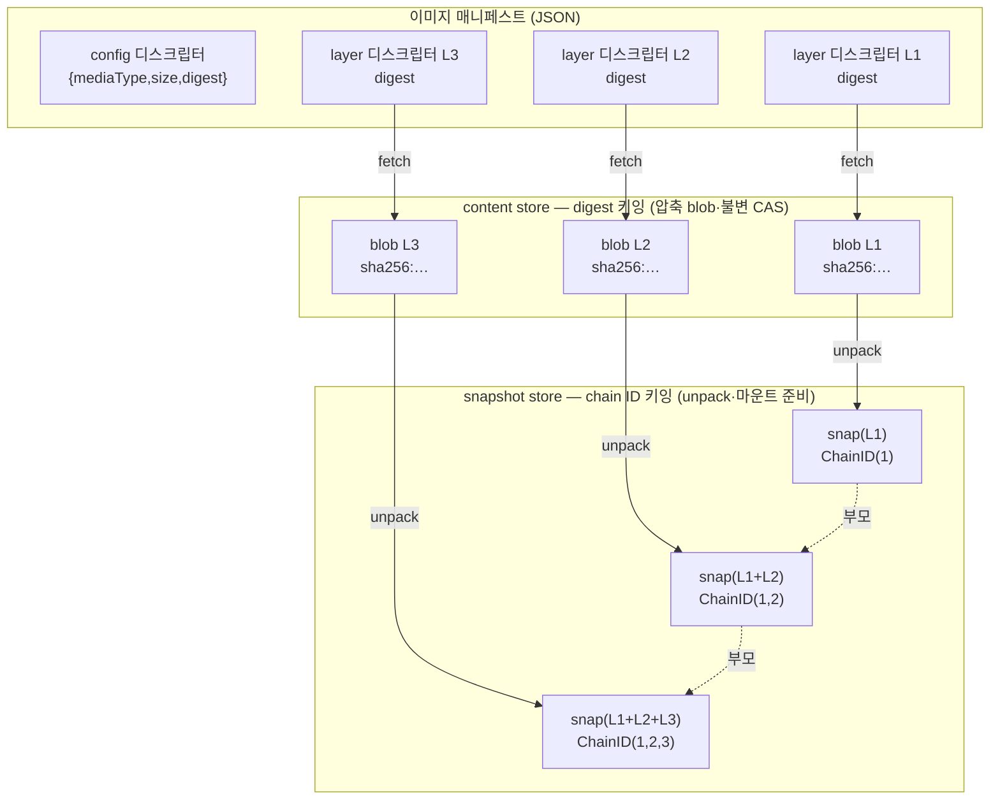
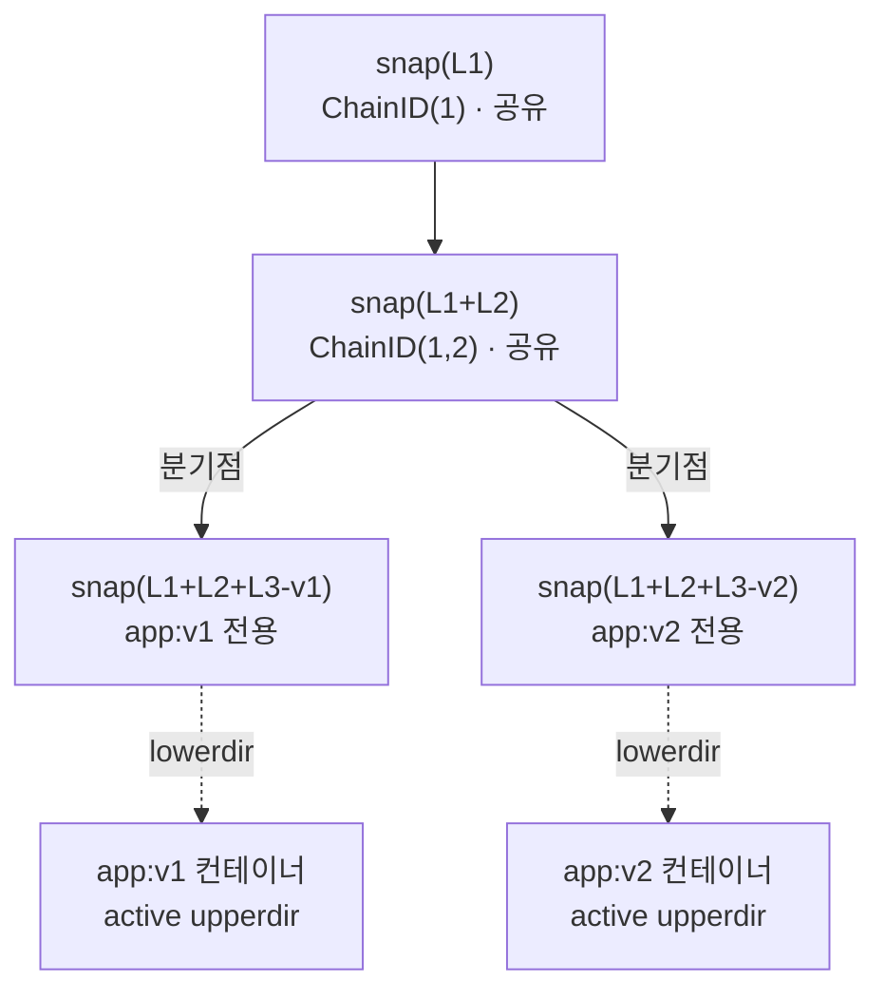
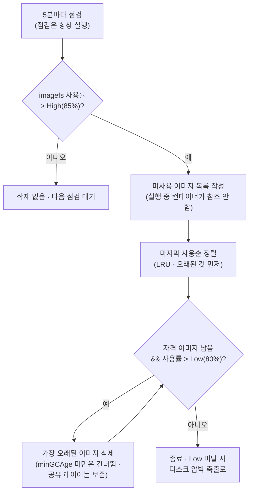

Kubernetes 노드가 컨테이너 이미지 레이어를 디스크에 어떻게 저장하고, 이미지·컨테이너 사이에서 어떻게 공유하며, 언제 정리하는지를 정리한 노트다. Kubernetes·containerd·OverlayFS 공식 문서와 OCI 스펙의 내용을 옮긴 것이다.

전체를 관통하는 사실 하나는 이렇다. **이미지 캐시는 노드 로컬이다.** 클러스터 전체가 공유하는 이미지 저장소는 기본적으로 없다. 이 한 문장이 레이어 재사용의 원리(같은 노드 안에서만 공유됨)와 스케일아웃 콜드스타트 지연(새 노드는 빈 캐시로 시작함)을 동시에 설명한다.

세부는 세 축으로 나뉜다.

- **콘텐츠 주소화(CAS)** — 레이어가 SHA-256 digest로 식별되므로 동일 레이어는 노드에 한 벌만 저장된다.
- **containerd snapshotter** — 각 레이어를 chain ID로 키잉한 스냅샷 트리로 관리해, 부모 포인터 체인으로 재사용을 구현한다.
- **kubelet 이미지 GC** — 고정 스케줄이 아니라 디스크 사용률 임계값으로 발동하며, 컨테이너 GC와는 별개의 메커니즘이다.

> [!NOTE] CRI 경계 — 어디까지가 런타임 공통이고 어디부터 containerd 특화인가
> Kubernetes는 [CRI](https://kubernetes.io/docs/concepts/architecture/cri/)(Container Runtime Interface, kubelet이 런타임과 통신하는 유일한 규약)로만 런타임과 대화한다. 그래서 kubelet 쪽 동작(`imagePullPolicy`, 이미지·컨테이너 GC)은 어떤 CRI 호환 런타임이든 동일하게 적용된다. 오늘날 지배적인 두 런타임은 [containerd](https://containerd.io/)와 [CRI-O](https://cri-o.io/)이며, EKS·GKE·AKS는 모두 containerd를 기본값으로 쓴다. 반면 런타임 내부 메커니즘(content store, chain ID, snapshotter)은 containerd 구현에 특화된 서술이다. CRI-O는 같은 OCI 이미지·OverlayFS 기반 개념을 쓰되 온디스크 저장을 `containers/storage`로 자체 구성한다. digest 주소화 레이어·공유 read-only 베이스 레이어·컨테이너당 쓰기 가능 레이어·디스크 압박 기반 이미지 GC 같은 상위 보장은 kubelet/CRI 경계에서 강제되므로 어느 런타임에서든 성립한다.

## 콘텐츠 주소화 저장 — 레이어가 재사용되는 원리

레이어가 재사용되는 이유는 **레이어가 이름이 아니라 콘텐츠의 해시로 식별되기 때문**이다. digest가 같은 두 레이어는 비트 단위로 동일하므로, 노드는 고유 digest당 한 벌만 저장하면 된다.

### 이미지의 구성 — 매니페스트·config·레이어 blob

컨테이너 이미지는 하나의 통짜 blob이 아니다. [OCI](https://github.com/opencontainers/image-spec)(Open Container Initiative) 이미지 포맷 스펙에 따르면 이미지는 세 종류의 구성요소로 이루어진다.

- **이미지 매니페스트**(JSON) — `config` blob 하나와 하나 이상의 `layers` blob을 나열한다. 각 항목은 **디스크립터** `{ mediaType, size, digest }`로 기술된다.
- **config blob**(JSON) — 이미지 메타데이터. entrypoint, 환경변수, 작업 디렉토리, 노출 포트, 그리고 레이어 `diff_ids`의 순서 있는 목록을 담는다.
- **레이어 blob** — 각각이 파일시스템 diff다. 관례상 gzip 압축된 tar 아카이브(`application/vnd.oci.image.layer.v1.tar+gzip`)이며, 바로 아래 레이어를 기준으로 그 레이어가 도입한 변경분을 나타낸다.

핵심 성질은 이것이다. **모든 blob(매니페스트, config, 각 레이어)은 이름이나 경로가 아니라 자기 콘텐츠의 SHA-256 digest로 주소화된다.** OCI 이미지 레이아웃 스펙은 `blobs/<alg>/<encoded>`의 콘텐츠가 반드시 digest `<alg>:<encoded>`와 일치해야 한다고 규정한다. 이것이 콘텐츠 주소화 저장(CAS, Content-Addressable Storage)이다 — 콘텐츠 조각의 식별자가 곧 그 콘텐츠의 암호학적 해시다.

직접적 귀결은 이렇다. **두 이미지가 동일 digest의 레이어를 공유하면, 그 레이어는 두 이미지 간에 비트 단위로 동일하다.** 따라서 노드의 로컬 content store는 고유 digest당 한 벌만 보관하면 된다. 노드가 이미지를 pull할 때의 순서는 다음과 같다.

1. 매니페스트와 config를 받아 레이어 digest 목록을 읽는다.
2. 각 레이어 digest에 대해, 그 digest가 이미 노드의 로컬 content store에 존재하는지 확인한다.
3. **아직 없는 digest만** 다운로드해 저장한다.
4. 두 이미지의 매니페스트는 공유 digest에 대해 동일한 온디스크 blob을 참조한다 — 중복도, 재다운로드도 없다.

`FROM ubuntu:22.04`로 빌드된 두 이미지가 동일한 베이스 레이어 digest를 공유하고, 그중 하나를 이미 가진 노드가 새 이미지의 *고유* 최상위 레이어만 받으면 되는 것도 이 원리 때문이다.

### 한 레이어에 식별자가 셋 — digest·diff ID·chain ID

레이어에 해시가 하나라고 생각하기 쉽지만, OCI/Docker 이미지 모델은 한 레이어에 대해 **서로 다른 목적의 식별자 세 개**를 추적한다.

- **digest** — 레이어의 **압축된** tar 스트림의 SHA-256 해시다. 레지스트리와 content store에 저장되는 형태이며, 이미지 매니페스트의 `layers[].digest` 필드에 나타난다. 레지스트리 pull 중 blob을 찾고 무결성을 검증할 때 쓰인다.
- **diff ID** — 레이어의 **비압축** tar 콘텐츠의 SHA-256 해시다. 이미지 config의 `rootfs.diff_ids` 배열에 저장된다(레지스트리 측 blob의 압축 방식과 무관하게 항상 비압축 digest). diff ID가 따로 있는 이유는, 같은 비압축 콘텐츠가 다르게 압축될 수 있어도(gzip 설정이 다르거나 압축기 자체가 달라도) 의미상으로는 "같은 레이어"이기 때문이다 — 이때 digest는 달라지지만 diff ID는 같다.
- **chain ID** — 단일 아티팩트의 해시가 아니라, **레이어 순서를 인코딩하는 diff ID 위의 재귀 관계**다. 최하위(맨 아래) 레이어는 `ChainID(layer_1) = DiffID(layer_1)`로, chain ID와 diff ID가 같은 유일한 경우다. 그 위의 모든 레이어는 `ChainID(layer_n) = SHA256(ChainID(layer_n-1) + " " + DiffID(layer_n))`로 계산된다. 각 chain ID가 그 아래 순서 있는 이력 전체를 접어 넣기 때문에, diff ID가 같아도 레이어 스택에서 *위치*가 다르면 chain ID가 달라진다.

세 번째 식별자가 왜 필요한가. **snapshotter는 diff ID가 아니라 chain ID로 스냅샷을 키잉한다.** 유니온 파일시스템의 레이어 병합이 순서에 민감하기 때문이다 — 상위 레이어의 충돌은 하위 레이어에 있던 것을 가린다. 그래서 "레이어 1+2+3을 그 순서로 쌓은 것"을 나타내는 스냅샷은 "1+2+3'(같은 diff ID, 다른 3번째 레이어)"을 나타내는 것과 구별 가능한 별개 객체여야 한다. devicemapper thin-provisioned 디바이스나 ZFS 같은 일부 snapshotter 백엔드는 스토리지 할당 자체를 위해 엄격한 선형 부모-자식 체인을 *요구*하는데, chain ID가 이를 자연히 제공한다.

그래서 containerd의 pull 파이프라인은 두 단계로 나뉜다.

- **fetch**(digest 주소) — 압축 blob을 content store로 다운로드하고 digest에 대해 검증한다.
- **unpack**(chain ID 주소) — 각 blob의 비압축 콘텐츠를 해당 레이어의 chain ID로 키잉한 스냅샷으로 추출하고, 이전 레이어의 chain ID를 부모로 지정한다.

3-레이어 이미지의 diff ID가 아래에서 위로 `d1`, `d2`, `d3`이라면 재귀식은 다음과 같이 풀린다.

```
ChainID(1)     = d1
ChainID(1,2)   = sha256( ChainID(1)   + " " + d2 )
ChainID(1,2,3) = sha256( ChainID(1,2) + " " + d3 )
```

각 스냅샷은 자신의 chain ID(`ChainID(1)`, `ChainID(1,2)`, `ChainID(1,2,3)`)로 키잉되고, 순서상 이전 chain ID로 키잉된 스냅샷을 부모로 갖는다. diff ID `d1, d2`를 그 순서로 최하위 두 레이어로 공유하는 두 이미지는, 세 번째 레이어가 무엇이든 동일한 `ChainID(1)`과 `ChainID(1,2)`를 계산하게 된다. 뒤에 나오는 두 이미지 pull 워크스루가 그렇게 동작하는 근거다.

### containerd 노드에서의 저장 위치 — content store와 snapshot store

containerd는 원본 압축 레이어 blob을 **content store**에 저장한다. 관례적 루트는 다음과 같다.

```
/var/lib/containerd/io.containerd.content.v1.content/blobs/sha256/<digest>
```

이것이 CAS 계층이다. 여기의 모든 blob은 digest로 명명되며 구조상 불변이다 — 바이트를 바꾸면 digest가 파일명과 더는 일치하지 않으므로 어떤 소비자든 거부한다.

content store는 **snapshot store**와 구분된다. snapshot store는 그 blob에서 파생된 *압축 해제된*(추출·마운트 준비된) 파일시스템 상태를 담는다. content store는 "무엇을 다운로드했는가"의 내구적·digest 주소화 캐시이고, 스냅샷은 그 캐시로부터 만든 런타임 사용 가능한 추출 형태다.

다음 그림은 한 이미지가 두 저장 계층을 어떻게 통과하는지를 보인다. 매니페스트의 레이어 디스크립터는 **digest로** content store의 압축 blob에 대응하고(fetch), 각 blob은 **chain ID로** 키잉된 스냅샷으로 풀린다(unpack). 두 계층이 서로 다른 키로 중복을 제거하는 것이 이 글 전체의 뼈대다.



## OverlayFS — 기본 snapshotter의 동작

[OverlayFS](https://docs.docker.com/engine/storage/drivers/overlayfs-driver/)는 리눅스 커널에 내장된 유니온 파일시스템으로, containerd의 기본 snapshotter다(Docker Engine의 기본 스토리지 드라이버 `overlay2`이기도 하다). **불변 레이어 diff의 스택을 컨테이너가 루트 파일시스템(rootfs)으로 쓸 수 있는 단일 파일시스템 뷰로 바꾸는 것**이 그 역할이다.

### 네 디렉토리 — lowerdir·upperdir·workdir·merged

overlay 마운트는 최대 네 개의 디렉토리를 요구한다.

| 디렉토리 | 역할 |
|---|---|
| **lowerdir** | 하나 이상의 **읽기전용** 레이어를 쌓은 것. 베이스 이미지 레이어들이며(컨테이너의 라이브 rootfs에서는, 컨테이너 자신의 쓰기 가능 레이어 아래에 있는 이미지의 이미 unpack된 상위 레이어들도 포함), OverlayFS는 **최대 128개의 하위 레이어 스택**을 지원한다. |
| **upperdir** | 단일 **쓰기 가능** 레이어. 두 맥락에서 쓰인다 — (a) pull 중 다음 이미지 레이어를 *unpack*할 때(다음 레이어의 불변 하위 레이어로 "커밋"되기 전의 스냅샷 스테이징 영역), (b) 컨테이너가 시작된 뒤 그 컨테이너의 라이브 **쓰기 가능 레이어**. |
| **workdir** | OverlayFS 내부 북키핑 공간. 커널 드라이버가 원자적 연산(예: 원자적 rename)을 위해 요구한다. merged 뷰의 일부가 아니며 직접 읽을 대상이 아니다. |
| **merged** | **통합 뷰**. lowerdir(들) + upperdir을 하나의 일관된 파일시스템으로 제시하며, 이것이 컨테이너의 rootfs로 마운트된다. |

`lowerdir` 파라미터는 모든 부모 레이어의 경로를 위에서 아래 순으로 콜론으로 이어 만든다.

```
lowerdir=/snapshots/22/fs:/snapshots/21/fs:/snapshots/20/fs
upperdir=/snapshots/24/fs
workdir=/snapshots/24/work
```

<details markdown="1">
<summary>심화: 온디스크 레이아웃과 심볼릭 별칭</summary>

Docker의 고전적 overlay2 드라이버(`/var/lib/docker/overlay2/` 아래)는 이 추상 디렉토리가 실제 경로로 어떻게 매핑되는지 보여주는 잘 문서화된 사례다. 각 레이어는 내부 레이어 ID로 명명된 자기 디렉토리를 갖고, 그 안에 실제 파일 콘텐츠를 담은 `diff/` 하위 디렉토리와, 그 레이어의 짧은(약 26자) 심볼릭 별칭을 담은 `link` 파일을 둔다.

짧은 별칭이 필요한 이유는 `mount` 시스템콜의 옵션 문자열에 길이 제한이 있어서다. 수십 개의 전체 `lowerdir` 절대경로를 이어 붙이면 제한을 넘을 수 있으므로, Docker는 최상위 `l/` 심볼릭 디렉토리를 통해 각 레이어를 짧은 별칭으로 해석하고 `lowerdir=` 문자열을 그 별칭으로 구성한다. 베이스가 아닌 레이어는 추가로 `lower` 파일(그 레이어 자신의 부모 체인 기록)을 가지며, 그 레이어가 활성 컨테이너의 라이브 rootfs일 때만 쓰이는 `merged/`·`work/` 디렉토리를 둔다.

containerd 자신의 레이아웃은 `/var/lib/containerd/io.containerd.snapshotter.v1.overlayfs/snapshots/<id>/fs`(그리고 content store는 `io.containerd.content.v1.content/blobs/sha256/<digest>`)로, 같은 개념적 분리를 따르되 사람이 읽을 이름 대신 숫자/짧은 스냅샷 ID를 쓴다. snapshot store는 직접 수동 검사·수정할 대상이 아닌 내부 상태이기 때문이다(그래서 raw 파일시스템 탐색이 아니라 뒤의 도구 절을 쓴다).

</details>

### copy-up — 첫 쓰기에서 파일 전체를 upperdir로 복사

컨테이너 안 프로세스가 파일에 쓸 때, OverlayFS의 동작은 그 파일이 현재 어디 있는지에 따라 갈린다. **읽기전용 하위 레이어는 절대 변경되지 않는다** — 쓰기·삭제는 모두 upperdir에서만 일어난다.

- **파일이 lowerdir(읽기전용)에만 있을 때** — *첫* 쓰기가 **copy-up**을 유발한다. 하위 레이어의 파일 *전체*가 upperdir로 복사되고, 쓰기는 그 upperdir 복사본에 적용된다. 이후 그 경로에 대한 읽기/쓰기는 하위 레이어 버전을 가리는 upperdir 복사본으로 해석된다.
- **파일이 이미 upperdir에 있을 때** — copy-up 없이 곧바로 그곳에 쓴다.
- **새 파일 생성** — upperdir에 직접 쓴다.
- **하위 레이어에 있는 파일 삭제** — OverlayFS는 파일을 실제로 제거할 수 없다(하위 레이어는 읽기전용이며 다른 소비자와 공유된다). 대신 upperdir의 해당 경로에 **whiteout** 마커를 만들어, merged 뷰에서 하위 레이어 파일을 숨긴다.
- **하위 레이어에 있는 디렉토리 삭제** — 디렉토리 단위의 동등한 처리. upperdir의 해당 디렉토리를 **opaque**로 표시해, 하위 레이어의 그 경로 아래 전체를 merged 뷰에서 숨긴다. 하위 레이어 디렉토리와 그 콘텐츠는 디스크에 그대로 물리적으로 남는다.

> [!IMPORTANT] copy-up은 파일 단위다 — 블록 단위가 아니다
> OverlayFS는 파일 레벨에서 동작하며 블록 레벨이 아니다. 대용량 파일의 copy-up은 몇 바이트만 바뀌어도 파일 *전체*를 복사한다. 대용량 파일에 소량 in-place 쓰기를 하는 워크로드(예: 데이터베이스가 마운트된 볼륨 대신 컨테이너의 쓰기 가능 레이어에 직접 쓰는 경우)에서 잘 알려진 성능 함정이다.

<details markdown="1">
<summary>심화: whiteout·opaque의 실제 구현</summary>

whiteout는 관례상 major/minor 번호가 `0/0`인 문자 디바이스 파일로 표현된다(고전적 overlayfs/AUFS 관례). 이것은 여전히 *이미지 레이어의* tar 스트림에 기록되는 형태다 — Docker/OCI 레이어 tar는 빌드 타임에 레이어에 구운 whiteout에 대해 `.wh.<filename>` 접두사 관례를 쓴다(예: Dockerfile의 `RUN rm`에서 생성).

라이브 마운트 레벨(tar 레이어 레벨이 아님)에서는 리눅스 커널 overlay 드라이버가 대신 크기 0 파일/디렉토리에 `trusted.overlay.whiteout`·`trusted.overlay.opaque` 확장 속성을 쓴다. 기능적으로 동등하되 문자 디바이스 특수 파일의 오버헤드를 피한다.

어느 쪽이든 레이어 재사용 관점의 요점은 같다 — 상위 레이어에서 무언가를 삭제해도 하위의 공유 읽기전용 레이어를 절대 변경하지 않는다. 상위 레이어에 "이 경로를 숨겨라"는 마커를 추가할 뿐이며, 그래서 여러 이미지/컨테이너가 같은 하위 레이어를 동시에 공유해도 안전하다.

</details>

### 이미지 레이어 vs. 컨테이너의 쓰기 가능 레이어

둘은 근본적으로 수명주기가 다르다. **이미지 레이어는 불변·공유이고, 컨테이너의 쓰기 가능 레이어는 컨테이너 인스턴스당 하나이며 일회용이다.**

| | 이미지 레이어 | 컨테이너 쓰기 가능 레이어 |
|---|---|---|
| 가변성 | 불변, 생성 후 절대 변경 안 됨 | 가변 — 실행 중인 컨테이너가 쓰는 곳 |
| 공유 | 같은 digest를 참조하는 모든 컨테이너/이미지가 공유 | **컨테이너 인스턴스당 하나** — 절대 공유 안 됨 |
| 수명 | 이미지 GC 전까지 노드에 잔존(개별 컨테이너와 무관) | **일시적** — 컨테이너 시작 시 생성, 제거 시 폐기 |
| 데이터 생존 | 컨테이너 재시작·Pod 재시작·노드 재부팅에도 생존 | 컨테이너 제거 시 소실. **단** Kubernetes 볼륨(`emptyDir`, PVC, hostPath 등)이 데이터를 받치면 그 마운트 지점은 레이어드 파일시스템을 완전히 우회한다 |

이것이 앞의 lowerdir/upperdir 분리 그 자체다 — 이미지의 레이어는 항상 lowerdir(읽기전용·공유)이고, 컨테이너 자신의 upperdir이 유일한 쓰기 가능 레이어로 설계상 얇고 폐기 가능하다.

"볼륨은 레이어드 파일시스템을 완전히 우회한다"는 점은 구체적으로 이렇다. 컨테이너 안 어떤 경로(예: `/data`)에 Kubernetes 볼륨이 마운트되면, 그 마운트 지점은 merged overlay 뷰의 그 경로에 접붙인 별개의 파일시스템/바인드 마운트다. `/data` 아래 쓰기는 컨테이너의 upperdir을 전혀 건드리지 않으므로, copy-up을 유발하지 않고, 그 컨테이너의 얇은 쓰기 가능 스냅샷을 키우지 않으며, (PVC처럼 Pod보다 오래 사는 볼륨 유형이면) 컨테이너와 심지어 Pod 삭제 후에도 생존한다. "지속해야 하거나 커지는 것은 볼륨을 마운트하라"는 지침이 단순한 관행을 넘어서는 기계적 근거가 여기 있다 — 컨테이너 자신의 overlay upperdir에 쓰는 것은 실제로 더 비싸고(파일 단위 copy-up) 실제로 더 일시적이다(컨테이너 제거 시 소멸).

## containerd snapshotter 모델 — chain ID로 키잉된 트리

containerd는 이미지 파일시스템을 "unpack된 하나의 디렉토리"로 보지 않는다. **각 레이어가 자기 스냅샷이 되고, chain ID로 키잉되며, 부모 포인터로 체인을 이룬다.** 이 구조에서 레이어 재사용이 그대로 흘러나온다.

### 스냅샷은 부모 포인터를 가진 트리/그래프다

각 레이어는 자신의 chain ID로 키잉된 스냅샷이 되고, 스냅샷은 **부모 포인터**로 베이스 레이어를 참조한다 — 내부적으로 `Snapshot` 레코드의 `ParentIDs` 필드 첫 원소가 직속 부모 스냅샷의 키다.

N개 레이어 이미지에 대해 containerd는 unpack 중 N개 스냅샷을 순서대로 생성(또는 재사용)한다. 최하위 레이어 스냅샷은 부모가 없고, 두 번째 레이어 스냅샷은 최하위를 부모로, 이런 식으로 각각 자기 chain ID로 키잉된다 — chain ID 재귀식에 의해 그 chain ID는 이미 그 아래 모든 레이어의 순서 있는 이력 전체를 인코딩한다. 이것은 유향 그래프를 이루지만, 대부분의 이미지가 Dockerfile의 순차 명령으로 선형 빌드되므로 실제로는 보통 선형 체인 집합이다.

재사용 성질은 chain ID 키잉에서 직접 나온다. **새 이미지의 처음 K개 레이어가 이미 unpack된 이미지의 처음 K개 레이어와 동일한 diff ID를 같은 순서로 가지면, 그 K개 레이어의 chain ID도 동일하다.** 그래서 containerd의 unpack 단계는 그 chain ID들이 snapshot store에 이미 있음을 발견하고 재추출을 건너뛰며, 기존 스냅샷 객체를 그대로 재사용한다. 분기점(diff ID나 순서가 처음 달라지는 지점) *이후* 레이어만 새로 unpack된다. 이것은 콘텐츠 주소화가 "이 blob을 다운로드했는가"(content store, digest 키잉) 계층과 "이 순서 있는 레이어 스택을 이미 추출했는가"(snapshot store, chain ID 키잉) 계층 양쪽에서 중복 제거를 수행함을 뜻한다.

### 컨테이너 rootfs 준비 순서

컨테이너를 시작하기 위해 containerd는 다음을 수행한다.

1. 이미지의 chain ID 시퀀스에 있는 모든 레이어 스냅샷이 존재하는지 보장한다(없는 것은 unpack). 이들은 "커밋된" 읽기전용 스냅샷으로, 각각 이미 디스크의 `fs` 디렉토리로 추출돼 있다.
2. snapshotter의 `Prepare`(최신 릴리스에서는 유사한 `View`/mount-then-commit 흐름)를 호출해, 이미지 체인의 최상위 커밋된 스냅샷을 부모로 하는 **새 활성(active) 쓰기 가능 스냅샷**을 만든다.
3. overlay 마운트를 구성한다 — `lowerdir` = 체인의 모든 커밋된 스냅샷의 `fs` 디렉토리를 위에서 아래 순으로 콜론 결합, `upperdir`/`workdir` = 새 활성 스냅샷 자신의 디렉토리.
4. 이것을 `merged`로 마운트하며, 그것이 컨테이너의 rootfs가 된다.

### 같은 이미지에서 시작된 컨테이너 사이에 중복 없음

이 메커니즘이 위키가 문서화하려는 성질을 직접 전달한다. **같은 노드에서 같은 이미지로 시작된 여러 컨테이너는 각자 별도의 쓰기 가능(active) 스냅샷을 갖지만, 모두 정확히 동일한 읽기전용 커밋 스냅샷 집합을 `lowerdir`로 가리킨다.** 컨테이너당 복사·중복되는 이미지 데이터는 없고, 컨테이너 인스턴스마다 고유한 것은 쓰기 전까지 대부분 비어 있는 얇은 active 스냅샷뿐이다. 컨테이너들이 같은 Pod든, 다른 Pod든, 전혀 무관한 워크로드든, 같은 이미지(같은 레이어 체인)를 참조하는 한 성립한다.

구체적으로, 한 노드에서 50개 Pod가 모두 같은 `myapp:v1` 이미지를 실행하면, 그 노드는 `myapp:v1`의 각 이미지 레이어를 디스크에 정확히 한 벌씩(커밋된 스냅샷으로) 갖고, 더해서 50개의 작고 대부분 비어 있는 active 스냅샷(컨테이너당 하나)을 갖는다 — 각 컨테이너 프로세스가 실제로 쓴 것만 담는다. 공유 부분의 디스크 사용은 컨테이너 수에 전혀 비례하지 않고, 작은 컨테이너별 쓰기 델타만 늘어난다.

정리(cleanup)는 같은 논리를 거울처럼 따른다. 50개 중 하나가 제거되면 *그* 컨테이너 자신의 active 스냅샷만 삭제되고, 아래의 49개 커밋·공유 읽기전용 스냅샷은 온전히 남는다 — 나머지 49개 컨테이너의 active 스냅샷을 위한 부모 체인으로, 그리고 이미지 객체 자체가(어떤 컨테이너와도 무관하게) 여전히 참조하기 때문이다. 커밋된 이미지 레이어 스냅샷은 그것을 부모로 참조하는 것이 *아무것도* 없을 때만 제거되며(실행 중 컨테이너의 active 스냅샷도, 살아 있는 이미지도 없을 때), 이것이 바로 이미지 GC가 레이어를 삭제하기 전에 확인하는 조건이다.

<details markdown="1">
<summary>심화: overlay snapshotter의 unpack 최적화</summary>

overlay snapshotter에 한해, containerd는 레이어 tar 스트림을 임시 위치에 풀었다가 복사하지 않고 **새 스냅샷의 upperdir로 직접 추출(untar)**해 레이어 unpack을 최적화한다. 이것은 "이 레이어의 파일을 실체화"와 "쓰기 가능 스테이징 영역 준비"를 겸해, 원래라면 두 번의 I/O 패스(추출 후 복사)를 한 번으로 접는다. unpack되고 나면 그 스냅샷은 "커밋"된다(active/쓰기 가능 상태에서 읽기전용·봉인 상태로 전환) — 그래야 다음 레이어의 unpack이나 이후 컨테이너의 rootfs를 위한 `lowerdir`로 안전히 쓰인다.

</details>

## 노드 로컬 이미지 캐시의 수명주기

pull·unpack된 이미지 레이어는 **어떤 컨테이너나 Pod의 수명주기에도 묶이지 않는다.** 명시적으로 GC되거나 수동 삭제되기 전까지 노드 디스크에 잔존한다 — 컨테이너 재시작, Pod 재시작, Pod 삭제·재생성(같은 노드로 재스케줄되는 한), 노드 재부팅을 가로질러 남는다.

### imagePullPolicy — IfNotPresent가 네트워크를 완전히 건너뛰는 이유

`imagePullPolicy`의 세 값은 kubelet이 pull을 어떻게 위임하는지가 다르다. 핵심 차이는 **kubelet이 로컬 캐시를 스스로 확인하느냐**에 있다.

- **`IfNotPresent`** — 이미지가 로컬에 아직 없을 때만 pull한다. kubelet은 컨테이너 런타임에 pull을 요청할지 결정하기 *전에*, CRI `ImageStatus` 호출로 자신의 로컬 이미지 인벤토리를 직접 확인한다. digest가 이미 로컬에서 해석되면 **네트워크 요청이 전혀 일어나지 않고**, Pod의 컨테이너가 캐시된 레이어에서 즉시 시작한다.
- **`Always`** — kubelet이 컨테이너를 띄울 때마다 컨테이너 런타임에 pull을 요청한다. 런타임이 레지스트리에 접속해 태그/이름을 digest로 해석하고, 아직 캐시되지 않은 레이어를 다운로드한다. 모든 레이어가 이미 있으면 런타임은 재다운로드 없이 캐시된 이미지를 쓴다. **kubelet 자신은 이미지가 로컬에 캐시됐는지 확인하지 않고 항상 런타임에 위임한다.** 그래서 `Always`는 결국 아무것도 다운로드하지 않더라도(태그→digest 해석과 새 레이어 확인을 위해) 레지스트리 왕복을 항상 유발한다 — pull 레이트 제한이 있는 레지스트리나 네트워크 분단 상황에서 의미 있는 차이다.
- **`Never`** — kubelet이 이미지 가져오기를 시도하지 않는다. 이미지가 어떻게든 이미 로컬에 있으면 컨테이너 시작을 시도하고, 없으면 시작이 실패한다. 이미지가 이미 존재함이 보장된 경우(사전 pull, 뒤 절)와 조합해야만 동작한다.

<details markdown="1">
<summary>심화: 멀티 아키텍처 이미지 — 노드당 한 아키텍처의 레이어만 캐시</summary>

`myapp:v1` 같은 이미지 참조는 단일 아키텍처 매니페스트가 아니라 **이미지 인덱스**(구 Docker 스키마의 "매니페스트 리스트")로 해석되는 경우가 많다. 이미지 인덱스는 여러 플랫폼별 매니페스트(예: `linux/amd64` 하나, `linux/arm64` 하나)를 각자의 digest와 함께 나열하는 작은 JSON 문서다. 노드가 `myapp:v1`을 pull하면 런타임은 인덱스를 **그 노드 자신의 아키텍처·OS에 맞는 매니페스트 하나**로 해석하고, 그 매니페스트의 레이어만 받아 캐시한다 — amd64 노드는 arm64 레이어를 절대 받거나 저장하지 않으며 그 반대도 같다.

그래서 혼합 아키텍처 클러스터(예: Graviton/arm64와 x86/amd64 노드 그룹이 함께)에서는 "같은" 태그가 노드마다 전혀 다른 레이어/digest 집합에 대응할 수 있다. 레이어 재사용은 여전히 완전히 적용되되, 주어진 아키텍처의 노드들 *안에서만* 성립한다 — 같은 논리적 이미지의 amd64 빌드와 arm64 빌드의 레이어 digest는 무관한 콘텐츠이기 때문이다.

Kubernetes 자체의 레퍼런스 이미지는 대체로 멀티 아치 이미지 인덱스를 게시해 단일 태그가 혼합 CPU 아키텍처 클러스터에서 동작하게 한다. 이미지 인덱스 이전 도구와의 하위 호환을 위해 아키텍처 접미사 태그도 때때로 게시된다(예: `pause`는 멀티 아치 인덱스, `pause-amd64`는 명시적 단일 아키텍처 폴백 태그).

이 때문에 사전 pull과 AMI 베이킹은 혼합 아치 클러스터에서 아키텍처를 인지해야 한다 — amd64 노드만 겨냥한 DaemonSet이나 AMI 빌드는 같은 클러스터의 arm64 노드에 캐시 이득이 전혀 없다. 명목상 "같은" 이미지 태그에 대해 전혀 다른 레이어 digest를 캐시하기 때문이다.

</details>

### 워크스루: 공유 베이스를 가진 두 이미지, 한 노드

앞 절들의 메커니즘을 한 노드에서 두 번의 이미지 pull로 구체화한다.

**1) `app:v1` pull** — `FROM ubuntu:22.04` + 애플리케이션 레이어 2개(총 3레이어: `L1` 베이스, `L2`, `L3-v1`).

- containerd가 3개 압축 blob을 digest로 content store에 fetch한다 — 이전에 로컬에 없던 것들이다.
- 3개 스냅샷으로 unpack하며 chain ID로 키잉한다 — `snap(L1)`은 부모 없음, `snap(L1+L2)`는 `snap(L1)`을 부모로, `snap(L1+L2+L3-v1)`은 `snap(L1+L2)`를 부모로.
- `app:v1`에서 컨테이너 시작 — `snap(L1+L2+L3-v1)`을 부모로 하는 새 active 스냅샷을 얻고, `lowerdir`은 그 세 `fs` 디렉토리를 이은 것이다.

**2) `app:v2` pull** — 마지막 `RUN` 단계만 바뀐 같은 Dockerfile(그래서 `L1`·`L2`는 `app:v1`과 바이트 단위 동일, 새 최상위 레이어는 diff ID가 다른 `L3-v2`).

- containerd가 `app:v2` 매니페스트를 읽는다 — `L1`·`L2`의 digest는 content store에 **이미 존재**(이전과 같은 digest)하므로 그 둘은 **0바이트 다운로드**. `L3-v2`의 digest만 fetch한다.
- unpack 시 — `snap(L1)`과 `snap(L1+L2)`의 chain ID는 `app:v1`이 이미 만든 것과 **동일**(같은 diff ID, 같은 순서)하다. containerd는 그 스냅샷들이 이미 있음을 발견하고 **재추출 없이 그대로 재사용**한다. `app:v1`도 쓰는 *같은* `snap(L1+L2)`를 부모로 하는 새 스냅샷 `snap(L1+L2+L3-v2)`만 생성된다.
- `app:v2`에서 컨테이너 시작 — 그 `lowerdir`은 `snap(L1)`과 `snap(L1+L2)`의 `fs` 디렉토리(app:v1의 컨테이너가 쓰는 **정확히 같은 온디스크 디렉토리**)에 더해, 새 최상위 레이어를 위한 `snap(L1+L2+L3-v2)`의 `fs` 디렉토리를 포함한다.

한 노드에서의 최종 결과: 두 이미지는 합쳐서 **고유 스냅샷 4개**(`L1`, `L1+L2`, `L1+L2+L3-v1`, `L1+L2+L3-v2`)의 디스크 공간을 차지한다 — 아무것도 공유되지 않았다면 6개(이미지당 3개)일 것이다. 그리고 두 번째 pull은 세 레이어가 아니라 한 레이어분의 네트워크 트래픽만 전송했다.

아래 스냅샷 트리에서 두 이미지가 `snap(L1)`과 `snap(L1+L2)`까지 같은 가지를 공유하다가 세 번째 레이어에서 갈라지는 것이 보인다. 뒤의 `ctr snapshots tree`가 실제 노드에서 이 모양을 그대로 렌더링한다.



### 사전 pull된 이미지가 Pod 시작을 앞당기는 이유

이미지 캐시가 클러스터가 아니라 **노드의 로컬 디스크**의 속성이라, 필요한 이미지 레이어를 이미 가진 노드로 스케줄된 Pod는 pull 단계를 아예 건너뛰거나(`IfNotPresent`) 새로 받을 게 없다(`Always`, 모든 레이어가 이미 일치하므로). 잘 알려진 두 최적화 패턴의 직접적 기계 설명이다.

- **"웜" 노드로의 스케줄링 어피니티** — 워크로드 이미지가 크고 일부 노드가 이전 Pod에서 이미 캐시했다면, 새 Pod를 그 노드로 유도(node affinity, 또는 스케줄러가 불필요하게 축출·재스케줄하지 않는 기본 동작)해 중복 pull을 피한다.
- **사전 pull** — Pod가 필요로 하기 전에 캐시를 미리 채워, 모든 후보 노드에서 "이미 로컬에 존재" 조건이 처음부터 참이 되게 한다.

### serial vs. parallel pull

기본적으로 **kubelet은 이미지를 직렬로 pull한다** — CRI 이미지 서비스에 한 번에 하나의 pull 요청만 진행 중이다. KubeletConfiguration에서 `serializeImagePulls: false`로 바꾸면 여러 이미지를 동시에 pull할 수 있다. `maxParallelImagePulls`(1 이상이어야 하고, 2 이상은 `serializeImagePulls: false`를 요구)는 네트워크/디스크 I/O 경합을 제한하기 위해 동시 pull 수의 상한을 정한다. 이 설정과 무관하게 **kubelet은 단일 Pod를 위해 여러 이미지를 병렬로 pull하지 않는다** — 한 Pod 자신의 컨테이너 이미지들은 서로에 대해 항상 하나씩 pull된다.

<details markdown="1">
<summary>심화: 캐시는 노드 로컬, imagePullSecrets 자격증명은 네임스페이스 로컬 — 독립된 두 스코프</summary>

혼동하기 쉬운 두 스코프를 명시적으로 분리한다.

- **pull된 *바이트*가 어디에 남는가** — 노드의 로컬 디스크. 노드당 캐시 하나.
- **애초에 무엇이 pull을 *인가*하는가**(사설 레지스트리의 경우) — Pod 스펙이 참조하는(또는 Pod의 ServiceAccount에 붙은) `imagePullSecrets`. `imagePullSecrets`는 Kubernetes Secret 객체이며, **Secret은 — 따라서 `imagePullSecrets`도 — 단일 네임스페이스로 스코프된다.** Pod는 자기 네임스페이스에 있는 `imagePullSecrets` 항목만 참조할 수 있다.

두 스코프는 일치할 필요가 없고, 그 불일치가 실제 운영 함정이다. **이미지가 노드에 일단 캐시되면, 그 노드의 어떤 Pod든 같은 태그/digest로 그 이미지를 참조하면 레지스트리에 재인증 없이 캐시에서 시작할 수 있다**(`IfNotPresent`면 pull 시도 자체가 없어 자격증명 확인도 없다). 즉 올바른 `imagePullSecrets`를 가진 네임스페이스가 사설 이미지를 한 번 pull하면, *다른* 네임스페이스의 워크로드가 *같은 노드*에서 그 이미지를 참조하며 스케줄될 경우, 그 두 번째 Pod는 자기 네임스페이스에 그 레지스트리 자격증명이 없어도 이미 캐시된 레이어에서 시작할 수 있다.

이것은 Kubernetes가 이미지 캐시 계층에서 강제하는 보안 경계가 아니다 — 노드 로컬 캐시에는 네임스페이스별·테넌트별 분할이 없다. 이런 암묵적 이미지 공유를 테넌트 간에 막아야 하는 멀티테넌트 클러스터는 이미지 캐시에 경계를 기대하기보다 노드 격리(테넌트당 전용 노드 풀)에 의존한다.

</details>

## kubelet 이미지 가비지 컬렉션

kubelet 이미지 GC는 **고정 스케줄로 삭제하는 것이 아니라, imagefs 디스크 사용률이 임계값을 넘을 때만 삭제한다.** 점검 자체는 5분마다 돌지만, 그 주기적 점검이 실제로 무언가를 *삭제*하는지는 imagefs 디스크 사용률 임계값이 좌우한다.

kubelet의 이미지 매니저는(디스크 사용 통계를 위해 [cAdvisor](https://github.com/google/cadvisor)와 협력하며) 다음을 평가한다. 디스크 사용률이 `HighThresholdPercent`를 넘으면 GC가 발동해, 마지막 사용 시각 순으로(가장 오래된 것부터) 이미지를 삭제하고, `LowThresholdPercent`에 도달할 때까지 삭제를 이어간다.

### KubeletConfiguration 필드와 기본값

이미지 GC를 제어하는 네 필드는 `k8s.io/kubelet/config/v1beta1` Go 소스로 검증된 것이다.

| 필드 | 타입 | 설명 | 기본값 |
|---|---|---|---|
| `imageGCHighThresholdPercent` | `*int32` | 이미지 GC가 항상 실행되는 디스크 사용률 퍼센트. `imageGCLowThresholdPercent`보다 커야 한다. | **85** |
| `imageGCLowThresholdPercent` | `*int32` | 이미지 GC가 결코 실행되지 않는 디스크 사용률 퍼센트. GC가 도달하려는 최저 디스크 사용률. `imageGCHighThresholdPercent`보다 작아야 한다. | **80** |
| `imageMinimumGCAge` | `metav1.Duration` | GC 대상이 되기 전 미사용 이미지의 최소 나이. 0보다 커야 하며, 미설정·0이면 2m로 기본 설정. | **"2m"** |
| `imageMaximumGCAge` | `metav1.Duration` | 미사용 이미지가 GC되기 전 최대 나이. 기본 0s는 이 필드를 비활성화(너무 오래 미사용됐다는 이유로는 GC 안 됨). | **"0s"(비활성)** |

`KubeletConfiguration` YAML 예시는 다음과 같다.

```yaml
apiVersion: kubelet.config.k8s.io/v1beta1
kind: KubeletConfiguration
imageGCHighThresholdPercent: 85
imageGCLowThresholdPercent: 80
imageMinimumGCAge: "2m"
imageMaximumGCAge: "12h45m"   # opt-in; 0s (unset) disables time-based GC
```

### imageMaximumGCAge — 디스크와 무관한 시간 기반 트리거 (KEP-4210)

`imageMaximumGCAge`는 디스크 사용률과 무관한 별개의 **시간 기반** 트리거다 — 운영자가 "여유 디스크가 얼마든 N시간/일 손대지 않은 이미지를 삭제하라"고 말할 수 있게 한다. [KEP-4210](https://www.kubernetes.dev/resources/keps/4210/)("ImageMaximumGCAge in Kubelet")의 동기는, 반복 롤링 업그레이드를 거치는 클러스터가 구버전 이미지를 쌓아 디스크를 "불필요하게 점유"하지만 디스크에 여유가 있으면 퍼센트 기반 임계값을 결코 건드리지 않는다는 문제다.

Kubernetes가 문서화한 두 가지 중요한 유의사항이 있다.

- 디스크 압박 기반 GC를 *보완*할 뿐 *대체*하지 않는다 — `HighThresholdPercent`/`LowThresholdPercent` 메커니즘은 무관하게 계속 돈다.
- **kubelet 재시작을 가로질러 이미지 사용을 추적하지 않는다.** kubelet이 재시작되면 추적된 이미지 나이가 초기화되어, 이미지가 나이 기반 GC 자격을 얻기까지 `imageMaximumGCAge` 전체 기간을 다시 기다린다 — 그래서 자주 재시작하는 kubelet(업그레이드·크래시 등)에서는 공격적으로 짧게 잡은 `imageMaximumGCAge`가 실제로 발동하지 못할 수 있다.

### 축출 순서 — LRU, 미사용 이미지만

임계값 기반이든 나이 기반이든 이미지 GC는 **현재 실행 중인 컨테이너를 받치지 않는 이미지만** 대상으로 삼는다 — 사용 중인 이미지는 나이나 디스크 압박 수준과 무관하게 결코 GC 후보가 아니다. 자격 있는(미사용) 이미지 중에서는 LRU 우선으로 축출한다 — 마지막 사용 시각 순으로 가장 오래된 것부터 삭제한다.

온디스크 레벨에서 "이미지를 삭제한다"는 것은, 그 이미지가 고유하게 소유한 최상위 이미지 전용 스냅샷(들)을 제거하는 것이다. 그 이미지 체인에서 아래에 있으면서 다른 살아남은 이미지가 여전히 참조하는 스냅샷은(공유 접두사 성질) 건드리지 않는다. 삭제하면 다른 이미지도 깨지기 때문이다 — 이미지 GC의 참조 추적은 애초에 레이어 재사용을 가능케 한 바로 그 공유 구조를 그대로 존중한다.

### 컨테이너 GC는 별개의 메커니즘이다

kubelet은 **컨테이너 가비지 컬렉션**도 실행한다. **1분 주기**(이미지 GC는 5분)이며, 완전히 다르고 더 오래된 `ContainerGCPolicy` 구조가 관장한다 — 이미지 GC 필드와 구별되는 세 변수다.

| 필드 | 의미 | 기본값 | 비활성화 |
|---|---|---|---|
| `MinAge` | 죽은 컨테이너가 GC되기 전 최소 나이 | `0`(최소 없음) | `0`으로 설정 |
| `MaxPerPodContainer` | (Pod UID, 컨테이너 이름) 쌍당 보관하는 죽은 컨테이너 최대 수 | `1` | `< 0`으로 설정 |
| `MaxContainers` | 노드 범위로 보관하는 죽은 컨테이너 최대 수 | `-1`(무제한) | `< 0`으로 설정 |

이미지 GC와의 핵심 차이는 이렇다.

- **정리 대상** — 죽은/종료된 **컨테이너 인스턴스**(그 얇은 쓰기 가능 레이어 스냅샷과 메타데이터)이며, 이미지 레이어가 아니다.
- **발동 조건** — 나이·개수 정책이며, 디스크 사용률 퍼센트가 아니다.
- **충돌 해소** — `MaxPerPodContainer`와 `MaxContainers`가 서로 충돌할 수 있으며, 이때 kubelet은 `MaxPerPodContainer`를 조정한다. 최악의 경우 `MaxPerPodContainer`를 `1`로 낮추고 가장 오래된 컨테이너를 축출한다. 삭제된 Pod가 소유한 컨테이너도 `MinAge`보다 오래되면 GC된다.
- kubelet은 자신이 관리하는 컨테이너만 GC한다(자기 북키핑 밖의 무관한 containerd/CRI-O 상태에 손대지 않는다).

요컨대 **이미지 GC는 공유되는 읽기전용 레이어 캐시를 비우고, 컨테이너 GC는 죽은 컨테이너의 작은 인스턴스별 잔해를 비운다.** 둘은 서로 다른 시계, 서로 다른 자격 규칙으로 돌며 서로 다른 데이터를 겨냥한다.

| | 이미지 GC | 컨테이너 GC |
|---|---|---|
| 주기 | 5분마다 점검 | 1분마다 점검 |
| 트리거 | imagefs 디스크 사용률이 `imageGCHighThresholdPercent`를 넘음, 또는 나이(`imageMaximumGCAge`) | 나이/개수 정책(`MinAge`, `MaxPerPodContainer`, `MaxContainers`) — 디스크 사용률 트리거 없음 |
| 대상 | 미사용 **이미지 레이어/스냅샷** | 죽은/종료된 **컨테이너 인스턴스**(작은 쓰기 가능 레이어 잔해) |
| 설정 위치 | `imageGC*` 필드, `KubeletConfiguration` v1beta1 | `ContainerGCPolicy`(별개의 오래된 구조) |
| 축출 순서 | LRU(마지막 사용이 가장 오래된 것부터) | 오래된 것부터, Pod별/전역 상한을 따름 |

### imagefs vs. nodefs — 이미지 GC가 실제로 적용되는 대상

Kubernetes는 kubelet이 축출/GC 목적으로 감시하는 파일시스템을 구분한다.

- **nodefs** — 노드의 주 파일시스템. 로컬 디스크 볼륨, 메모리 기반이 아닌 `emptyDir` 볼륨, 로그 저장, 임시 스토리지 등에 쓰이며 `/var/lib/kubelet`을 포함한다.
- **imagefs** — 컨테이너 런타임이 컨테이너 이미지(읽기전용 레이어)를 저장하는 데 쓸 수 있는 선택적 파일시스템. 별도의 `containerfs`가 없으면 이미지 파일시스템이 컨테이너 쓰기 가능 레이어도 저장한다.

여기서 세 가지 흔한 노드 디스크 배치가 나온다.

1. **단일 파일시스템** — `nodefs`·`imagefs`·`containerfs`가 모두 같은 디스크.
2. **분할 디스크(전용 imagefs)** — `imagefs`/`containerfs`가 한 디스크(이미지 + 쓰기 가능 레이어)를 공유하고 `nodefs`와 분리.
3. **분할 이미지** — `containerfs`/`nodefs`가 한 디스크(쓰기 가능 레이어 + 나머지 전부)를 공유하고, `imagefs`는 읽기전용 이미지 레이어*만* 담는 전용 디스크.

이미지 GC의 임계값(`imageGCHighThresholdPercent` 등)은 **imagefs** 사용률에 대해 평가된다.

> [!WARNING] 기본 이미지 GC 임계값과 하드 축출 임계값이 거의 겹친다
> 노드 압박 축출의 기본 **하드** 임계값에는 `imagefs.available < 15%`(즉 85% 사용)가 포함되는데, 이는 기본 `imageGCHighThresholdPercent` 85%와 수치가 동일하다. 그래서 기본 설정에서는 이미지 GC와 하드 디스크 압박 축출이 거의 같은 디스크 사용 지점에서 발동할 수 있다. 이미지 무거운 워크로드를 튜닝할 때는 kubelet이 Pod 축출에 나서기 *전에* 이미지 GC가 확실히 발동해 공간을 회수하도록 `imageGCHighThresholdPercent`를 낮추라고 흔히 권고된다.

### 워크스루: GC 패스가 실제로 진행되는 방식

기본 임계값(`imageGCHighThresholdPercent: 85`, `imageGCLowThresholdPercent: 80`)이고 imagefs가 전용 디스크에 있는 노드를 가정한다. 다음 흐름도는 한 번의 GC 점검이 밟는 분기를 요약한다 — 점검 자체는 5분마다 무조건 돌지만, *삭제*는 High 임계값을 넘을 때만 시작되고 Low 임계값에 닿거나 자격 이미지가 소진되면 멈춘다.



1. 반복된 Deployment 롤아웃(`app:v1` … `app:v47`)으로 수십 개 이미지 버전이 쌓이고, 대부분 더는 실행 중 컨테이너에 참조되지 않지만 마지막 pull 시점의 커밋된 스냅샷으로 디스크에 남아 있다.
2. 주기적 이미지 GC 점검(사용률과 무관하게 5분마다 실행 — 점검 자체는 스케줄되고 *삭제*만 임계값으로 게이트됨) 중 imagefs 사용률이 87%에 이른다.
3. 87% > `imageGCHighThresholdPercent`(85%)이므로 GC가 활성화된다. kubelet의 이미지 매니저가 **미사용** 이미지(실행 중 컨테이너가 참조하지 않는) 목록을 만들고 **마지막 사용이 가장 오래된 것부터** 정렬한다.
4. 그 목록에서 오래된 것부터 삭제하되, **`imageMinimumGCAge`(기본 2m)보다 어린 이미지는 건너뛴다** — 방금 pull된 이미지(예: 아직 `ContainerCreating` 상태인 컨테이너용)가 kubelet 북키핑에 아직 "사용 중"으로 잡히지 않은 경합을 방지한다.
5. imagefs 사용률이 `imageGCLowThresholdPercent`(80%) 이하로 떨어질 때까지, 또는 삭제할 자격 있는(미사용·충분히 오래된) 이미지가 더 없을 때까지 삭제를 이어간다. 자격 이미지를 소진한 뒤에도 사용률이 여전히 high 임계값을 넘으면(예: 대부분 이미지가 *실제로* 사용 중이라), kubelet은 이미지 GC만으로는 더 회수할 수 없고 노드는 디스크 압박 축출로 나아갈 수 있다.
6. 여기서 이미지를 삭제한다는 것은 — 그 매니페스트/config 참조를 제거하고, *남은 어떤* 이미지도 더는 참조하지 않는 레이어 스냅샷/content-store blob에 대해 그 스냅샷과 blob도 제거하는 것이다(살아남은 이미지가 여전히 참조하는 공유 레이어는 건드리지 않는다 — 재사용을 가능케 한 바로 그 digest/chain-ID 참조 카운팅 로직이 이제 정리를 위해 역방향으로 도는 것이다).

## 실무 점검 도구

이미지·스냅샷 상태를 실제 노드에서 확인하는 도구는 **CRI 레벨(런타임 무관)과 containerd 네이티브(더 하위 레벨)로 나뉜다.** 어느 계층을 보느냐에 따라 보이는 것이 다르다.

### crictl — CRI 레벨, 런타임 무관

[`crictl`](https://github.com/kubernetes-sigs/cri-tools/blob/master/docs/crictl.md)은 표준 CRI 이미지/런타임 서비스 API를 통해 어떤 CRI 호환 런타임(containerd, CRI-O)과도 대화하므로, 출력이 하부 런타임과 무관하게 동일하게 보인다.

- **`crictl images`**(별칭 `image`, `img`) — 런타임이 아는 모든 이미지를 나열한다. 필터 지원: `before=`, `dangling=(true|false)`, `reference=/regex/`, `since=`.
- **`crictl imagefsinfo`** — 이미지 스토리지 백엔드의 파일시스템 사용 정보(마운트 지점, 사용 바이트, inode 수)를 반환한다 — kubelet의 이미지 GC 임계값이 측정되는 그 imagefs의 CRI 레벨 뷰다. `df`로 간접 추론하지 않고 "이 노드가 이미지 GC 발동에 얼마나 가까운가"에 답하는 가장 직접적인 방법이다.
- **`crictl rmi <image>`** — ID나 참조로 하나 이상의 이미지를 제거한다. 명시적으로 언급된 유의점: 태그로 이미지를 지정하면 그 이미지를 가리키는 **모든 태그**가 제거되며, 이는 `docker rmi` 의미론과 다르다. `crictl rmi --prune`(지원되는 경우)은 어떤 컨테이너도 현재 쓰지 않는 이미지를 모두 제거한다 — 이미지 GC가 자동 적용하는 "미사용" 필터의 수동 트리거다.
- **`crictl pull <image>`** — pull을 수동으로 트리거한다. Pod 수명주기 밖에서 사전 시딩이나 pull 동작 테스트에 유용하다.
- **`crictl ps -a`** — 모든 컨테이너(실행 중·종료)를 나열한다. 이를 `crictl images`와 교차 참조하는 것은, kubelet의 이미지 매니저가 이미지 GC용 "미사용" 집합을 계산하려고 내부에서 하는 일의 수동 대응물이다 — `crictl images`에 있으나 `crictl ps -a`의 어떤 행도 받치지 않는 이미지 digest는 `imageMinimumGCAge`를 지나면 GC 자격이 된다.

### ctr — containerd 네이티브, 하위 레벨

`ctr`은 containerd 자신의 디버깅/관리 CLI(더 상위의 사용자 친화적 `nerdctl`과 구별)로, CAS/스냅샷 분리를 직접 노출한다.

- **`ctr content ls`** — content store의 모든 것(원본 digest 주소화 blob: 매니페스트·config·압축 레이어 tar)을 나열하며 각 행에 digest·크기·생성 시각을 보인다. "무엇을 다운로드했는가"의 뷰(fetch 단계)다.
- **`ctr snapshots ls`**(별칭 `ctr snapshot ls`) — 스냅샷(content-store blob에서 파생된 unpack·마운트 가능한 파일시스템 상태)을 나열하며 각 스냅샷의 키·종류(`Committed` vs `Active`)·부모를 포함한다. "디스크에 실제 실체화돼 마운트 준비된 것"의 뷰(unpack 단계, chain-ID 키잉 스냅샷 트리)다.
- **`ctr snapshots tree`** — 부모/자식 스냅샷 관계를 실제 트리로 렌더링한다. 여러 이미지 간 레이어/스냅샷 공유를 시각적으로 확인하는 가장 직접적인 방법이다 — 베이스를 공유하는 두 이미지는 분기점까지 같은 트리 가지를 눈에 띄게 공유한다.


- **`ctr images ls`** — 이미지(이름/태그 → 매니페스트 digest 매핑)를 나열하며, 스냅샷 위의 간접 계층이다. 이미지는 매니페스트를 가리키는 이름 있는 포인터이고, 매니페스트는 다시 레이어 digest/chain-ID 체인을 가리킨다.
- **`ctr content rm <digest>`** — digest로 content store에서 특정 blob을 제거한다.
- **`ctr snapshots rm <key>`** — 특정 스냅샷을 제거한다(부모로 의존하는 것이 아무것도 없을 때만 유효).

content-store/snapshot-store 분리는 앞의 원리에 그대로 대응한다 — content는 digest로 주소화되는 압축 CAS blob, 스냅샷은 chain ID로 주소화되는 추출·overlay 준비 디렉토리다. `ctr`은 CRI 계층 아래에서 동작하므로 `crictl`이 의도적으로 추상화해 감춘 상태를 보고 조작할 수 있다 — 두 이미지가 예상대로 디스크 공간을 공유하는지/왜 안 하는지 디버깅하는 데 유용하다.

<details markdown="1">
<summary>심화: Docker Engine 도구(dockerd가 런타임일 때 — 비-Kubernetes 호스트나 구형 셋업)</summary>

- **`docker system df`** — 디스크 사용을 카테고리별(이미지·컨테이너·로컬 볼륨·빌드 캐시)로 나누며 각각 총량 vs 회수 가능량을 보인다. 이미지의 "RECLAIMABLE" 열은 정확히 실행 중 컨테이너를 받치지 않는 레이어/이미지 집합이다 — Kubernetes 노드에서 이미지 GC가 자동 계산하는 것의 수동·온디맨드 대응물이다.
- **`docker system df -v`** — 이미지/컨테이너/볼륨별 상세 분해로, 개별 이미지 크기와 현재 "사용 중" 여부를 보인다.
- **`docker image prune`** — dangling(태그 없고 참조 없는) 이미지를 제거한다. `docker image prune -a`는 어떤 컨테이너도 참조하지 않는 이미지를 모두 제거해, dangling만 제거하는 기본보다 Kubernetes 이미지 GC에 가깝다.
- **`docker system prune`** — 컨테이너·네트워크·이미지, 그리고 `--volumes`와 함께면 볼륨까지 아우르는 넓은 정리다. Docker의 자체 지침은 `/var/lib/docker/overlay2` 아래 파일을 수동 삭제하지 말고 이 내장 prune 명령을 쓰라는 것이다. overlay2 디렉토리 구조(레이어별 `diff`·`link`·`lower`·`merged`·`work` 하위 디렉토리와, 셸 명령 길이 제한을 우회하는 짧은 심볼릭 이름의 `l/` 디렉토리)는 Docker 자신의 레이어 스토어가 일관성을 유지해야 하는 관리 메타데이터라, 수동 삭제는 레이어 스토어의 내부 북키핑(어떤 레이어가 어떤 이미지에 참조되는가)을 실제 디스크 상태와 어긋나게 만들 위험이 있다.

현대 Docker Engine 버전은 **containerd 이미지 스토어**를 대체 백엔드로 쓸 수 있으며, 그 경우 온디스크 레이아웃과 CAS/스냅샷 분리가 고전적 overlay2 드라이버 네이티브 레이아웃 대신 containerd 모델을 따른다.

</details>

### 레이어 재사용을 실제로 확인하기

실제 노드에서 공유 동작을 경험적으로 검증하려면 이렇다. `crictl images -v`(verbose)나 `ctr images ls`는 각 이미지를 매니페스트 digest·총 크기와 함께 나열하지만, *보고되는* 이미지별 크기는 그 이미지가 참조하는 모든 레이어(공유 레이어 포함)를 세는 경우가 많다 — 그래서 이미지가 레이어를 공유할 때 개별 이미지 크기를 합산하면 실제 디스크 사용을 과다 계산한다.

`crictl imagefsinfo`나 `docker system df`의 "Images" 행은 모든 이미지를 합친 *실제* 온디스크 사용을 보고하며, 이 수치가 공유를 드러낸다 — 합친 값이 각 이미지 자체 보고 크기의 단순 합보다 눈에 띄게 작으면, 그 격차가 레이어 재사용이 작동한 것이다. `ctr snapshots tree`가 가장 직접적인 구조적 확인을 준다 — 트리 출력에서 공유되는 가지가 곧 여러 이미지가 가리키는 chain-ID 키잉 스냅샷이다.


## 이미지 사전 pull / 웜 캐시 패턴

새 노드가 콜드 캐시로 시작하는 지연을 좁히기 위해, **필요해지기 전에 캐시를 미리 채우는** 패턴이 있다. 노드가 존재한 뒤 반응적으로 채우거나(사전 pull), 노드가 존재하기 전에 선제적으로 채운다(AMI 베이킹).

### 단일 사용 DaemonSet 기법

롤아웃 전에 클러스터의 모든 노드로 이미지를 강제로 올리는, 잘 알려진 커뮤니티 패턴이 있다([DaemonSet](https://kubernetes.io/docs/concepts/workloads/controllers/daemonset/)이 pull을 트리거하는 것만이 유일한 목적이다).

- DaemonSet은 Pod 레벨에서 `restartPolicy: Always`를 요구하는데, 즉시 끝나는 컨테이너는 크래시 루프로 재시작한다.
- 기법: pull을 유발하는 실제 작업을 **`initContainer`**에 둔다(대상 이미지를 참조하거나 문자 그대로 `docker pull`/`crictl pull`을 실행). init 컨테이너는 Pod가 스케줄될 때 한 번만 실행되고, 끝나면 Pod의 정규 컨테이너가 실행된다.
- 메인 컨테이너는 "사실상 아무것도 하지 않는" 무해한 것(예: 최소한의 `pause` 이미지나 `sleep infinity`)으로 두어, DaemonSet Pod가 의미 있는 리소스를 소모하지 않고 안정적 `Running` 상태에 머물러 루프 없이 DaemonSet 컨트롤러를 만족시킨다.
- 롤아웃 후 DaemonSet은 삭제할 수 있다. 이미지 자체는 이미지 GC 전까지 모든 노드에 캐시된 채 남는다.

더 단순하고 현대적인 관용 변형: 대상 이미지를 DaemonSet의 정규 컨테이너 중 하나로 직접 참조한다(init 컨테이너 우회 불필요). kubelet이 정상 Pod 스케줄링으로 pull하고, DaemonSet이 "모든 매칭 노드" 커버리지를 보장한다. DaemonSet의 `nodeSelector`/`nodeAffinity`로 사전 pull을 특정 노드 풀(예: GPU 노드만)로 스코프할 수 있다. pull 완료 후 컨테이너가 실제 작업 없이 `Running`에 머물도록 `sleep` 기반 no-op을 쓴 최소 예시는 다음과 같다.

```yaml
apiVersion: apps/v1
kind: DaemonSet
metadata:
  name: prepull-myapp-v2
spec:
  selector:
    matchLabels: { app: prepull-myapp-v2 }
  template:
    metadata:
      labels: { app: prepull-myapp-v2 }
    spec:
      nodeSelector:
        jobType: my-app    # 특정 노드 풀로 스코프
      containers:
        - name: prepull
          image: myregistry/myapp:v2   # 이 Pod를 스케줄하는 행위 자체가 이미지를 노드로 pull한다
          command: ["sleep", "infinity"]
          resources:
            requests: { cpu: "10m", memory: "16Mi" }
            limits: { cpu: "10m", memory: "16Mi" }
      tolerations:
        - operator: Exists              # 대상 풀이 tainted면 그 노드에도 안착하도록
```

웜 캐시가 필요했던 롤아웃이 끝나면 DaemonSet을 삭제한다 — DaemonSet 컨트롤러 자체는 일회용이고, 그것이 pull하게 만든 *이미지*는 DaemonSet 수명과 무관하게 이미지 GC 전까지 모든 노드 디스크에 남는다.

### AMI에 구운 이미지 (오토스케일러 통합 웜 캐시)

노드가 존재한 뒤 반응적으로 사전 pull하는 대신, 이미지를 노드 이미지 빌드 타임에 **노드 OS 이미지(AMI)에 직접 구울** 수 있다. 그러면 갓 만든 노드가 그 레이어를 로컬 캐시에 이미 가진 채 시작하고, 그 특정 이미지에 대해서는 노드의 맨 첫 Pod에서조차 pull이 전혀 필요 없다.

앞의 원리에 기반한 이 방식의 트레이드오프는 이렇다.

- **실제로 무엇이 구워지는가** — AMI 빌드 과정이 대상 이미지마다 실제 `docker pull`/`ctr pull`/`crictl pull`을 실행해야 하며, 그래서 결과 AMI의 루트 볼륨 스냅샷이 그 이미지들의 채워진 content store와 snapshot store를 이미 담는다. 그 AMI로 부팅된 새 인스턴스는 미리 채워진 `/var/lib/containerd`(또는 동등한) 상태를 루트 볼륨의 일부로 물려받고, 런타임 액션이 전혀 필요 없다.
- **staleness 위험** — 캐시가 AMI 빌드 타임에 구워지므로, 더 새로운 이미지 태그가 push되는 순간 낡는다. AMI가 `app:v1`만 구운 노드에서 `app:v2`를 요청하는 Pod는 여전히 `v2`의 고유 최상위 레이어를 전부 pull한다(단 `v1`과 `v2` 사이 공유 베이스 레이어는 앞의 워크스루처럼 이미 있어 건너뛴다). 그래서 AMI 베이킹은 자주 배포되는 애플리케이션 자신의 이미지보다 **안정적이고 느리게 바뀌는 이미지**(베이스 OS 이미지, 공통 사이드카, 관측 에이전트)에 가장 유용하다.
- **AMI 크기/빌드 시간 비용** — 구운 이미지마다 AMI 크기와 빌드 시간이 는다. 노드 시작마다 치르는 반복 비용이 아니라 AMI 게시 시점에 한 번 치르고 분할 상환되는 비용이라, 빠르고 잦은 노드 churn을 하는 오토스케일러 환경이 감수할 만한 거래다.

### 레지스트리 pull-through 캐시 / 미러

pull-through 캐시(또는 레지스트리 미러)는 노드와 상위 레지스트리 사이에 앉아, 첫 요청에서 blob을 캐시하고 같은 digest에 대한 후속 요청을 네트워크 로컬(흔히 같은 AZ·VPC) 캐시에서 제공한다. 이것은 노드별 pull을 없애지 않지만(각 노드는 여전히 이미지 pull을 실행하고 자기 로컬 content store/스냅샷을 앞의 원리대로 채운다), 네트워크 경로를 줄이고 먼/레이트 제한된 상위 레지스트리(예: 익명·무료 티어 pull 레이트 제한을 걸어 대규모 노드 fleet을 쓰로틀할 수 있는 Docker Hub)로의 반복 왕복을 피한다. 클라우드 관리 레지스트리(ECR, GCR/Artifact Registry, ACR)는 노드와 같은 클라우드 네트워크 안에 있어 그곳에 이미 호스팅된 이미지에는 이 우려를 상당 부분 비껴간다 — pull-through 캐시는 클러스터가 *공개 외부* 레지스트리(Docker Hub, GHCR, Quay)에 베이스 이미지를 크게 의존할 때 더 흔히 쓰인다.

캐시가 digest 주소화 blob 레벨에서 동작하므로(같은 콘텐츠 주소화 원리), 이미 캐시된 digest를 참조하는 *어떤* 이미지에도 투명하게 작동한다 — "이미지"라는 개념을 알 필요 없이 "digest X의 blob을 달라"만 알면 되며, 이것이 노드의 컨테이너 런타임이 pull 중 이미 하는 요청 형태다. containerd는 [`hosts.toml`](https://github.com/containerd/containerd/blob/main/docs/hosts.md) 설정으로 레지스트리 미러를 직접 구성할 수 있어, Pod 스펙의 이미지 참조를 바꾸지 않고 특정 레지스트리 호스트명의 pull을 미러 엔드포인트로 리다이렉트한다.

### lazy-pull / 스트리밍 이미지 포맷 (대조)

전통적 모델은 레이어의 **전체** 압축 tar가 다운로드·추출되기를 기다려야 그 안의 파일을 쓸 수 있다 — 이미지의 모든 레이어가 완전히 unpack되기 전에는 컨테이너가 시작할 수 없다. 몇몇 새 포맷은 이를 뒤집는다 — **충분한 메타데이터만 있으면 컨테이너를 시작하고, 실행 중 프로세스가 실제로 읽는 파일 콘텐츠를 온디맨드로 가져온다.**

- **[eStargz](https://github.com/containerd/stargz-snapshotter)**(`containerd/stargz-snapshotter`) — `stargz`(seekable tar.gz) 아이디어 위에 세운 lazy pull 가능 포맷. 표준 레지스트리에 push할 만큼 OCI/Docker 호환이라, lazy 포맷을 모르는 런타임에서도 (일반 non-lazy 이미지로) 실행된다. 압축 레이어 안 특정 파일로의 랜덤 접근을 가능케 하는 인덱스와, 시작 시 접근될 법한 파일에 대한 선택적 prefetch/최적화 힌트를 더한다.
- **[Nydus](https://github.com/containerd/nydus-snapshotter)**(`containerd/nydus-snapshotter`) — tar.gz를 전용 포맷(RAFS)으로 대체해 메타데이터와 콘텐츠 주소화 청크를 분리하고, 온디맨드·청크 레벨 fetch를 가능케 한다. EROFS 커널 파일시스템(Linux 5.19+)과 짝지어 데이터 경로의 FUSE 오버헤드를 피할 수 있다.
- **[SOCI](https://github.com/awslabs/soci-snapshotter)**(Seekable OCI, AWS) — *기존의 수정되지 않은* OCI 이미지 위에 외부 인덱스(zTOC)를 만드는 비침습적 방식으로, 이미지 자체를 재패키징하지 않고 seekable/재개 가능한 압축 해제를 가능케 한다. 인덱스는 레지스트리 Referrers API로 별도 OCI 아티팩트로 붙는다.

| | 이미지 호환성 | 이미지 재패키징 필요? | lazy 미인지 런타임에서 실행? | 데이터 경로 |
|---|---|---|---|---|
| eStargz | OCI/Docker 호환 변형 | 예(eStargz로 재빌드) | 예, 일반 전체 pull로 폴백 | FUSE 기반 |
| Nydus | 자체 포맷(RAFS), tar.gz 아님 | 예(RAFS로 변환) | 아니오 | FUSE, 또는 Linux 5.19+에서 EROFS(커널 네이티브, FUSE 없음) |
| SOCI | 표준·수정 없는 OCI 이미지 | 아니오(외부 인덱스만) | 예, 인덱스는 무시됨 | FUSE 기반 |

세 방식 모두 "pull 후 실행"을 "실행하며 pull"로 바꿔 대용량 이미지의 콜드 컨테이너 시작 지연을 상당히 줄일 수 있다 — 다만 I/O 비용을 pull 타임에서 런타임으로 옮기고(첫 접근 파일 읽기가 네트워크 읽기가 됨), 컨테이너 수명 내내(pull 타임만이 아니라) 레지스트리 가용성 의존을 도입한다(실행 중 레지스트리가 닿지 않게 되면 아직 안 가져온 파일 읽기가 멈추거나 실패할 수 있으며, 한 번 pull되면 이후 레지스트리 의존이 0인 전통적 모델과 다르다).

## 크로스 노드 현실 — 이미지 캐시는 노드 로컬이다

위의 모든 것 — content store, 스냅샷, overlay 마운트, 이미지 GC — 은 **한 노드 디스크의 로컬 상태**다. 바닐라 Kubernetes에는 클러스터 전역으로 공유되는 이미지 캐시가 없다. 스케줄러는 배치 결정 시 "어느 노드가 이미지 X를 이미 캐시했는가"에 대한 내장 인지가 없다(운영자가 세운 명시적 어피니티 규칙이 없는 한).

직접적 귀결은 잘 문서화된 지연의 원인이다.

- **새 노드**(대개 클러스터 오토스케일러(Cluster Autoscaler, [Karpenter](https://karpenter.sh/))가 갓 프로비저닝한)는 **빈** 이미지 캐시로 시작하거나, AMI 베이킹을 쓰면 그 AMI에 구운 특정 이미지만 가진 채 시작한다.
- 그 새 노드에 스케줄되는 **첫 Pod**가 아직 캐시되지 않은 이미지를 참조하면, 그 이미지의 **모든 레이어**를 마치 아무도 어디서도 처음 pull하는 것처럼 네트워크로 새로 받아야 한다(그 노드 관점에서 — 레지스트리 자체는 여전히 웜일 수 있고, pull-through 캐시는 콜드 노드에서도 네트워크 경로 레벨에서 도움이 된다).
- 이 콜드 캐시 pull이 **스케일아웃/콜드스타트 지연**의 잘 알려진 기여 요인이다 — 스케일업 이벤트는 노드가 클러스터에 합류해 `Ready`가 되는 순간 "끝난" 것이 아니다. 그 노드에 스케줄된 Pod는 시작 전에 여전히 전체 이미지 pull 시간을 치르며, 대용량 이미지(예: 멀티 GB ML/GPU 이미지)면 콜드 노드에서 수십 초에서 수 분이 될 수 있다 — 정확히 같은 이미지가 클러스터의 다른 모든 노드에는 이미 캐시돼 있어도, 이 새 노드의 디스크에는 0바이트도 기여하지 않았기 때문이다.
- 이 지연은 스케일아웃의 다른 모든 단계(노드 부팅, kubelet 등록, CNI 설정, 스케줄러 배치)에 **순전히 가산적**이다 — 더 빨리 프로비저닝한다고 병렬화로 없앨 수 없다. Pod가 실제로 새 노드에 스케줄되고 kubelet이 pull 요청을 낸 뒤에야 시작하기 때문이다. 더 빨리 부팅하는 노드는 "이제 이미지를 pull하라" 단계에 더 일찍 도달할 뿐, 그 단계 자체를 빠르게 만들지는 않는다.

이 노드별 캐시 지역성이 바로 사전 pull(반응적, 노드 존재 후)과 AMI 베이킹(선제적, 노드 존재 전)이 존재하는 이유다 — 둘 다 "새 노드 = 콜드 캐시 = 느린 첫 Pod" 격차를 줄이거나 없애기 위해 있다.

### 하나의 원리, 세 스코프

한 걸음 물러서면, 이 문서의 메커니즘은 하나의 아이디어 — 콘텐츠 주소화(digest/chain-ID 키잉) 저장으로 불변 데이터의 안전한 공유를 가능케 하는 것 — 를 서로 다른 세 스코프에 일관되게 적용한 것이며, 각 스코프는 자기 캐시 경계를 갖는다.

1. **한 컨테이너의 rootfs 마운트 안** — 여러 `lowerdir` 레이어가 읽기전용으로 안전하게 쌓여 공유되고, 단일 `upperdir`이 그 한 컨테이너의 쓰기를 격리한다.
2. **한 노드의 디스크 안** — 여러 이미지·여러 컨테이너의 스냅샷이 chain-ID 재사용으로 커밋된 읽기전용 레이어를 공유하며, 노드의 로컬 이미지 GC 정책에 묶인다.
3. **여러 노드를 서비스하는 레지스트리/미러 너머** — pull-through 캐시가 요청하는 모든 노드에 걸쳐 같은 digest 주소화 blob을 재사용해, 노드별 독립 pull의 *네트워크* 비용을 줄인다(그러나 각 노드가 여전히 자기 온디스크 스냅샷 스토어를 따로 실체화한다는 사실은 없애지 못한다).

기본적으로 이 스택 어디에도 존재하지 않는 것은 네 번째 스코프 — 노드를 가로질러 자동 공유되는 클러스터 전역 *디스크* 캐시다. 위의 모든 완화책은 그 빠진 스코프를 근사하려는 수동·반자동 시도이며, 개별 노드 캐시를 필요 전에 채우거나(사전 pull, AMI 베이킹) 각 노드의 여전히 독립적인 pull의 네트워크 비용을 줄이는(pull-through 캐시, lazy-pull) 방식이다.

## 참고 자료

- Kubernetes, [Garbage Collection](https://kubernetes.io/docs/concepts/architecture/garbage-collection/)
- Kubernetes, [Images](https://kubernetes.io/docs/concepts/containers/images/)
- Kubernetes, [Kubelet Configuration (v1beta1) reference](https://kubernetes.io/docs/reference/config-api/kubelet-config.v1beta1/)
- Kubernetes, [`k8s.io/kubelet/config/v1beta1` types.go](https://github.com/kubernetes/kubernetes/blob/master/staging/src/k8s.io/kubelet/config/v1beta1/types.go)
- Kubernetes, [Node-pressure Eviction](https://kubernetes.io/docs/concepts/scheduling-eviction/node-pressure-eviction/)
- Kubernetes Contributors, [ImageMaximumGCAge in Kubelet (KEP-4210)](https://www.kubernetes.dev/resources/keps/4210/)
- Kubernetes CRI tools, [crictl reference](https://github.com/kubernetes-sigs/cri-tools/blob/master/docs/crictl.md)
- containerd, [snapshotters README](https://github.com/containerd/containerd/blob/main/docs/snapshotters/README.md)
- Docker Docs, [OverlayFS storage driver](https://docs.docker.com/engine/storage/drivers/overlayfs-driver/)
- Docker Docs, [containerd image store with Docker Engine](https://docs.docker.com/engine/storage/containerd/)
- OCI, [Image Format Specification](https://github.com/opencontainers/image-spec/blob/main/spec.md)
- Itay Shakury, [The single use DaemonSet pattern and pre-pulling images in Kubernetes](https://blog.itaysk.com/2017/12/26/the-single-use-daemonset-pattern-and-prepulling-images-in-kubernetes)
- containerd, [stargz-snapshotter (eStargz)](https://github.com/containerd/stargz-snapshotter)
- containerd, [nydus-snapshotter](https://github.com/containerd/nydus-snapshotter)
- AWS Labs, [soci-snapshotter (Seekable OCI)](https://github.com/awslabs/soci-snapshotter)
