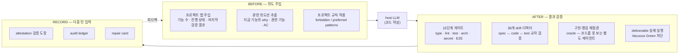
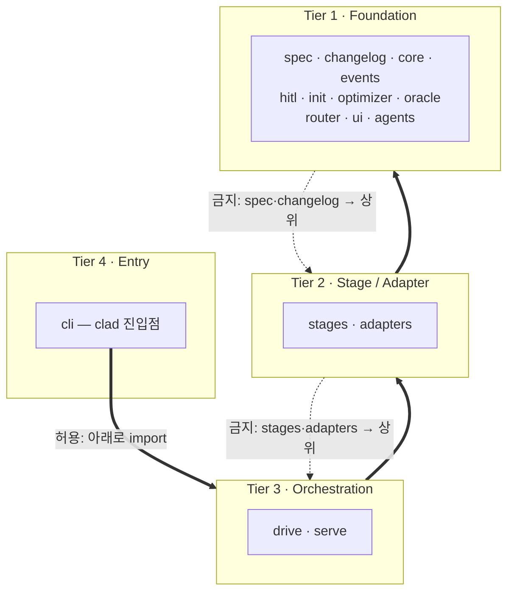
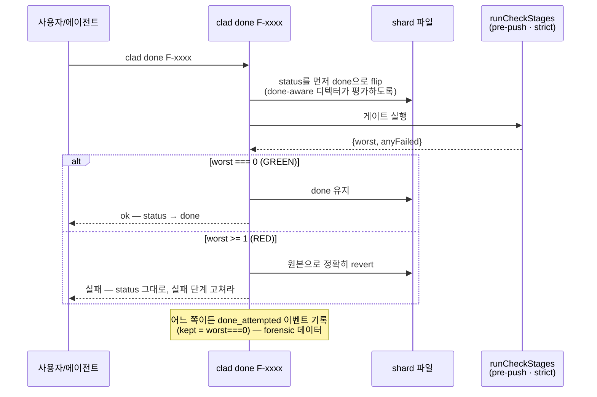

cladding(클래딩)은 코드를 직접 작성하지 않는다. 코드 작성은 언제나 host LLM(Claude Code · Codex · Gemini · Cursor)의 몫이고, cladding은 그 LLM을 감싸는 거버넌스 외피다. host LLM이 일을 시작하기 전(BEFORE) 프로젝트의 의도를 주입하고, 끝낸 뒤(AFTER) 그 결과가 스펙과 어긋나지 않았는지 검증한다. 이 글은 [cladding](https://github.com/qwerfunch/cladding) 공식 문서 7편(개요·아키텍처·SSoT 스펙 모델·Iron Law 게이트·드리프트 디텍터·페르소나 워크플로우·CLI/[MCP](https://modelcontextprotocol.io/) 레퍼런스)의 내용을 정리한 노트다.

기준 버전은 v0.6.0이다. 아래 수치·식별자는 그 버전의 `spec.yaml::inventory`와 문서 기준이며, 상류 프로젝트는 이후 버전에서 값이 달라질 수 있다.

## cladding이 무엇이고 왜 있는가

cladding은 host LLM을 감싸 "AI가 다 됐다고 말한 것"을 기계적으로 검증하는 하네스다. 이것이 푸는 문제는 하나로 요약된다 — AI의 "다 됐어요"를 주장(claim)에서 증명(proof)으로 바꾸는 것. 그래서 AI가 쓴 코드를 사람이 쓴 코드와 같은 신뢰로 출하할 수 있게 한다.

cladding은 **Ironclad** 표준의 공식 레퍼런스 구현이다. 코드 작성 자체는 하지 않고, 일하는 주체(LLM)는 그대로 둔 채 그 앞과 뒤를 책임진다. 현재 버전은 v0.6.0이며 Ironclad **L4** 적합성을 자기 선언한다.

AI 보조 개발은 코드를 빠르게 찍어내지만 프로젝트가 커질수록 일관성을 잃는다. cladding은 그 붕괴 지점을 구체적인 검증으로 막는다.

| 문제 | 바닐라 AI 코딩 | cladding |
|---|---|---|
| **spec ↔ code drift** (스펙과 코드의 어긋남) | 리뷰어가 우연히 발견해야 고쳐짐 | 편집 직후 자동 감지 · drift 중이면 done 통과 불가 |
| **아키텍처 불변식** | 메인테이너 머릿속에만 존재 | `spec/architecture.yaml`에 선언 → `ARCHITECTURE_FROM_SPEC`가 강제 |
| **멀티 개발자 안전성** | 동시에 기능 추가 시 merge conflict | hash-8 ID · 파일 분리(`<slug>-<hash>.yaml`) → 충돌 0 |
| **Vacuous Green** (공허한 초록불) | 테스트가 통과해도 프로그램이 안 돌아감 | deliverable smoke 단계가 실제 실행으로 차단 |
| **"다 됐어요" 주장** | LLM의 말을 믿는 수밖에 없음 | 게이트가 GREEN일 때만 `done`을 획득 |

### BEFORE / AFTER / RECORD 협업 루프

cladding은 host LLM이 못 하는 두 가지 — 시작할 때 의도를 정확히 기억하기, 끝낼 때 결과를 기계적으로 검증하기 — 를 대신 맡는다. 개발자는 그 사이에서 평소처럼 자연어로 개발하면 된다.



- **BEFORE** — 대화가 시작될 때마다 프로젝트 맵과 지금 다루는 기능의 의도만 골라 LLM에게 자동으로 건넨다. 전체 스펙을 통째로 쏟지 않는다(Least Context 원칙).
- **host LLM** — 코드를 쓴다. 이 단계는 항상 LLM의 몫이다.
- **AFTER** — 출력이 스펙에서 표류하면 차단한다. 9개 결정론적 단계는 완료 시점에, 전체 15단계는 CI에서 돈다.
- **RECORD** — 검증 결과가 LLM 컨텍스트로 되돌아간다. 실패를 남긴 채 대화를 끝내려 하면 한 번 차단하고 실패 요약을 다음 대화 첫머리로 자동 인계한다.

> [!NOTE] 실시간 개입의 범위(정직한 한계)
> 맵 주입 · 즉시 차단 · 종료 차단(stop-block)은 Claude Code에서 완전 검증되었다. Codex · Gemini · Cursor에서는 동일 검증이 대화 내 도구 호출 + git · CI 게이트로 흐른다. 즉시 차단은 1차 방어선, 사후 검증(게이트 · drift)은 2차 방어선이며, 어느 한 쪽도 단독 보증은 아니다.

### 핵심 수치와 어휘 (v0.6.0)

아래는 이 문서 전체에서 반복되는 기준값과 용어다. `spec.yaml::inventory` 및 README 기준의 실제 값이다.

| 항목 | 값 | 비고 |
|---|---:|---|
| version | **v0.6.0** | 2026-06 · Ironclad **L4** 자기 선언 |
| features | **171** | 170 done · cladding이 자기 자신을 스펙화(self-spec'd) |
| scenarios | **2** | `spec/scenarios/` |
| capabilities | **5** | `spec/capabilities.yaml` |
| detectors | **36** | drift 디텍터 |
| gate stages | **15** | Iron Law (9개 결정론적 + E2E · evidence) |
| tests | **1384 / 1384** | 전부 통과 · 134 test files |

주요 용어는 `glossary.md`의 "Brand / model terms" 정의를 따른다. 식별자는 영문 원형을 유지한다.

<details markdown="1">
<summary>핵심 어휘 정의 펼치기</summary>

| 용어 | 정의 |
|---|---|
| **`Ironclad`** | cladding이 구현하는 표준 — 스펙 포맷 + 단계 계약(stage contract) + 디텍터 의미론. |
| **`Iron Law`** | 4-phase 단계 파이프라인(code quality → tests/conformance → QA → human evidence). 결정론적 단계가 결정하고, 에이전트는 제안만 한다. |
| **`Iron Core`** | 기계용 내부 식별자·구조화 데이터 층 (F-ids, stage codes, detector IDs). |
| **`Soft Shell`** | 사용자용 표현 층 — Iron Core ID 위에 비즈니스 언어 라벨을 입힘(`src/ui/softShell.ts`). |
| **`Vacuous Green`** | 아무것도 검증하지 않으면서 PASS를 보고하는 게이트(skip을 pass로 셈, 빈 테스트 스위트, 깨진 진입점 미검증). cladding이 잡으려는 중심 실패 클래스. |
| **`drift`** | 디텍터가 잡는 spec · code · tests · docs 사이의 모든 어긋남. |
| **`shard`** | `spec/features/` 또는 `spec/scenarios/` 아래의 기능/시나리오 YAML 한 파일. |
| **`EARS`** | Easy Approach to Requirements Syntax — AC 패턴: ubiquitous / event / state / optional / unwanted. |
| **`Tier A/B/C/D`** | SSoT 계층. A=봉인된 스펙, B=설계(capabilities/architecture/context), C=파생(conventions/index/glossary), D=일시적 증거(events/audit logs). |
| **`AC`** | Acceptance Criterion — 한 기능 안의 검증 가능한 단일 동작(인수 기준). |
| **`oracle`** | 스펙 브리프만 보고 작성된 구현-맹검(impl-blind) 적합성 테스트(`tests/oracle/`). |
| **`deliverable`** | 게이트가 smoke-run 하는 출하 진입점(stage_2.4). |
| **`attestation`** | GREEN strict pre-push 게이트가 남기는 커밋된 검증 도장(`spec/attestation.yaml`) — done 기능별 모듈 tree-hash. |

</details>

## 4-tier 코드 아키텍처

cladding의 코드는 `src/` 아래 디렉터리들이 4개 tier로 계층화되어 있고, 의존성은 위에서 아래로만 흐른다. 이 규칙은 `spec/architecture.yaml`에 선언되어 `ARCHITECTURE_FROM_SPEC` 디텍터가 강제한다. 아키텍처를 코드가 아니라 스펙에 못 박아 두면, 메인테이너 머릿속에만 있던 불변식이 기계 검증 대상이 된다.

아키텍처의 SSoT는 `spec/architecture.yaml`이다. 이 파일의 `layers:` 배열은 tier(같은 아키텍처 레벨에 있는 디렉터리들의 동료 그룹)의 순서 있는 목록이고, 맨 위가 foundation이다. 의존성은 아래 방향으로만 흘러야 한다.

| Tier | 레이어(=`src/` 하위 디렉터리) | 역할 한 줄 |
|---|---|---|
| **1 · Foundation** | `spec`, `agents`, `changelog`, `core`, `events`, `hitl`, `init`, `optimizer`, `oracle`, `router`, `ui` | 순수한 빌딩 블록. 누구에게도 의존하지 않는 토대. |
| **2 · Stage / Adapter** | `stages`, `adapters` | foundation을 감싸 검사 스테이지를 돌리고, 호스트/SDK를 추상화. |
| **3 · Orchestration** | `drive`, `serve` | 스테이지를 묶어 자율 루프(`drive`)와 MCP 서버(`serve`)를 구성. |
| **4 · Entry** | `cli` | `clad` 명령. 모든 verb를 합성하는 최상위 진입점. |

순서에 이유가 있다. spec은 "무엇을 만들 것인가"의 SSoT이고, 스테이지 레이어가 spec을 감싸 검증(Iron Law)한다. 따라서 spec 자신이 스테이지 러너에 의존하면 토대가 자기를 검증하는 도구에 끌려들어가 순환이 생긴다. 그래서 의존성은 단방향(아래로)이다.

아래 그림은 네 tier의 적층 관계와 허용/금지 방향을 정리했다. 실선(허용)은 위 tier가 아래 tier를 import하는 방향이고, 점선(금지)은 `forbidden_imports`가 막는 역방향이다.



### forbidden_imports — 무엇을, 왜 막는가

`spec/architecture.yaml`의 `forbidden_imports:`는 `{from, to}` 쌍의 목록이다. import 문이 그 경계를 넘으면 `ARCHITECTURE_FROM_SPEC` 디텍터가 error를 낸다.

규칙은 네 갈래다.

- **`spec → {stages, drive, cli, serve}` 금지** — 스테이지 레이어가 spec을 감싸므로, spec 자신은 순수해야 한다. 자신을 검증하는 스테이지 러너에 끌려들어가면 안 된다.
- **`changelog → {stages, drive, cli, serve}` 금지** — changelog는 spec의 순수성을 그대로 따른다. collector/renderer는 `cli`와 `serve` 양쪽에서 import 가능해야 하므로(둘 다 changelog를 띄움), 스테이지 러너를 끌어들이지 않은 채 순수해야 한다.
- **`stages → {drive, cli, serve}` 금지** — 스테이지(Tier 2)는 오케스트레이션·진입(Tier 3·4)을 몰라야 한다. 스테이지는 상위 레이어에 호출당하며, 자신이 상위를 호출하지 않는다.
- **`adapters → {drive, cli, serve}` 금지** — 어댑터(호스트/SDK 추상화)도 마찬가지로 상위 레이어를 몰라야 한다.

`ARCHITECTURE_FROM_SPEC`(F-088, v0.3.13~)는 이 파일을 읽어 세 가지를 검사한다.

1. **forbidden_imports** — 위 쌍을 넘는 import → error
2. **undeclared directory** — `src/` 아래에 있지만 `layers:`에 없는 디렉터리 → warn
3. **empty layer** — `layers:`에 있지만 대응하는 `src/<layer>/`가 없음 → warn

### src/ 디렉터리 책임

각 tier의 디렉터리가 맡는 책임은 실제 파일 구성 기준으로 다음과 같다.

<details markdown="1">
<summary>Tier 1 · Foundation 디렉터리 투어</summary>

- **`spec/`** — `spec.yaml`을 로드·파싱·검증하는 토대. `load.ts`, `parse.ts`, `validate.ts`, `schema.json`, `types.ts`, `inventory.ts`(인벤토리 집계), `attestation.ts`(증명 스탬프), `ears.ts`(EARS 요구사항 문법), `new.ts`(해시 기반 신규 shard 생성), `deliverable-detect.ts`, `test-ref-repair.ts`. SSoT 자체이므로 어떤 상위 레이어에도 의존하지 않는다.
- **`agents/`** — `planner.md`, `developer.md`, `reviewer.md`, `observability.md`, `orchestrator.md`, `blind-author.md` 페르소나 본문과 `loader.ts`. 페르소나 분리(anti-self-cert)의 원천.
- **`changelog/`** — `collect.ts`(git 범위 `<sinceRef>..HEAD`를 `ChangelogManifest`로 변환), `render.ts`. "무엇이 출시됐나?"를 LLM의 git 기억이 아니라 spec으로부터 결정론적으로 답한다.
- **`core/`** — `checkpoint.ts`, `postmortem.ts`, `telemetry-summary.ts`.
- **`events/`** — `log.ts`. 상태 전이(스테이지 시작/종료, feature 활성화, drift 발화)를 기록. `.cladding/audit.log.jsonl`(HITL 증거)과 구분되는 "what happened, when".
- **`hitl/`** — `anti-self-cert.ts`(AC는 최소 1건의 `human`-authored 증거가 있어야 stage_4 통과), `audit.ts`, `identity.ts`.
- **`init/`** — `git-hook.ts`(pre-push 훅), `host-instructions.ts`, `host-setup.ts`.
- **`optimizer/`** — `context-slice.ts`(한 feature의 작업 세트만 슬라이스), `preamble.ts`, `prune.ts`, `tail.ts`. Least Context 원칙의 코드 구현.
- **`oracle/`** — `policy.ts`(SSoT: "이 done AC에 spec-conformance oracle이 필요한가?"를 `SPEC_CONFORMANCE` 디텍터와 `clad oracle --required`가 모두 여기를 통해 해석), `payload.ts`, `record.ts`.
- **`router/`** — `intent.ts`. 결정론적, regex 기반, 언어 태그. LLM을 호출하지 않고 "high-precision over high-recall"를 지킨다.
- **`ui/`** — `panel.ts`(Integrity Panel — feature당 한 행, Iron Law 스테이지당 한 열 + 말미 `att` 열), `pulse.ts`, `softShell.ts`.

</details>

<details markdown="1">
<summary>Tier 2~4 디렉터리 투어</summary>

- **`stages/`** (Tier 2) — `arch.ts`, `audit.ts`, `commit.ts`, `cov.ts`, `drift.ts`, `lint.ts`, `perf.ts`, `secret.ts`, `smoke.ts`, `spec-conformance.ts`, `type.ts`, `uat.ts`, `unit.ts`, `visual.ts`, `deliverable-smoke.ts` 등 각 검사 스테이지 러너 + `skip-policy.ts`, `types.ts`, `util.ts`, `toolchain/`.
- **`stages/detectors/`** (Tier 2) — `index.ts`의 `allDetectors` 배열에 등록되는 개별 디텍터들. detector 추가 시 개수는 빌드가 자동 재계산한다.
- **`adapters/`** (Tier 2) — `index.ts`, `types.ts`(`AgentAdapter` 계약), `host/`, `sdk/`. drive 루프가 활성 어댑터를 통해 페르소나 턴을 실행하게 하는 seam.
- **`drive/`** (Tier 3) — `agent.ts`(drive 루프와 활성 `AgentAdapter` 사이의 단일 seam — reviewer ≠ author 불변식 강제), `loop.ts`, `halt.ts`(모든 drive run은 정확히 하나의 `HaltReason`으로 끝남).
- **`serve/`** (Tier 3) — `server.ts`. `clad serve`가 cladding을 MCP 클라이언트에 노출하는 얇은 read 레이어 — 로직을 복제하지 않고 실제 cladding 함수를 호출해 결과를 MCP 형태로 번역한다.
- **`cli/`** (Tier 4) — `clad.ts`([commander](https://github.com/tj/commander.js) 기반 진입점), `init.ts`, `done.ts`, `doctor.ts`, `update.ts`, `clarify.ts`, `changelog.ts`, `hook.ts`, `benchmark.ts`, `intent-from-path.ts`, `scan/`. 각 verb 핸들러는 named export여서 서브프로세스 없이 단위 테스트가 호출 가능하고, 최상위 `program.parse()`는 `isCliEntry` 가드로 보호된다.

</details>

### bin/clad shim과 두 채널 배포

`bin/clad`는 CLI 진입 shim이며 두 경로를 가진다. `dist/clad.js`가 있으면(프로덕션) [esbuild](https://esbuild.github.io/) 단일 번들을 직접 import하고, 없으면(소스 편집 직후 등) [tsx](https://github.com/privatenumber/tsx)로 `src/cli/clad.ts`를 빌드 없이 실행한다. Windows에서는 ESM 로더가 절대경로를 거부하므로 `pathToFileURL`로 `file://` URL을 만들어 import하고, tsx 폴백도 `npx.cmd` 해결을 위해 `shell:true`를 쓴다.

배포는 두 채널로 이뤄지며 항상 함께 릴리스된다.

- **엔진 채널 — 글로벌 [npm](https://docs.npmjs.com/) `clad`** — 사용자는 글로벌 npm으로 엔진을 설치한다. `npm publish`가 핵심이고(태그 + `gh release`만으로는 도달하지 못함), `prepublishOnly`가 dist + 미러를 재빌드해 tarball이 stale하지 않게 한다.
- **플러그인 채널 — 마켓플레이스 플러그인** — Claude Code / Codex / Gemini 플러그인은 프롬프트 + `mcpServers` 와이어링만 싣고, 엔진은 글로벌 `clad`에 위임한다. `.claude-plugin/marketplace.json`의 catalog 버전이 호스트의 "update available" 신호다.

두 채널은 lockstep이 필수다. 버전 문자열은 9개 사이트에 흩어져 있으므로 손으로 고치지 말고 `npm run version-bump -- X.Y.Z`를 쓴다(놓치면 `HARNESS_INTEGRITY`가 막는다).

> [!WARNING] 릴리스 PR은 squash-merge 금지
> squash는 릴리스 커밋을 develop 조상 밖으로 밀어내, 다음 릴리스 PR이 그 이후 건드린 모든 파일을 phantom conflict로 보고하게 만든다. merge commit 또는 fast-forward 흐름을 쓴다.

아키텍처가 강제하는 불변식을 한눈에 정리하면 다음과 같다.

| 불변식 | 어디서 강제 |
|---|---|
| 의존성은 아래로만(forbidden_imports) | `ARCHITECTURE_FROM_SPEC` 디텍터(F-088) |
| spec / changelog는 순수(스테이지 러너 비의존) | 같은 디텍터 + 계층 선언 |
| reviewer ≠ author(페르소나 분리) | `hitl/anti-self-cert.ts` + `drive/agent.ts` 런타임 체크 |
| AC stage_4는 human 증거 필요 | `hitl/anti-self-cert.ts` |
| 버전은 9개 사이트 동기 | `HARNESS_INTEGRITY` 디텍터 + `version-bump` 스크립트 |
| feature는 하나씩 end-to-end | `PLANNED_BACKLOG` 디텍터 |

## Spec is SSoT — 4-tier 스펙 모델

cladding에서는 스펙이 단일 진실 공급원(Single Source of Truth, SSoT)이다. 코드가 옳다는 명제는 성립하지 않는다. 스펙이 옳고, 코드는 스펙을 따라가야 하는 종속물이다. 이 종속 관계가 있어야 "코드가 스펙에서 표류했다"를 기계가 판정할 수 있다.

가장 근본적인 불변식은 한 문장이다.

> `spec.yaml`이 권위를 갖는다(authoritative). 모든 코드 변경은 관련 `features[]`와 `acceptance_criteria`를 만족해야 한다.

이것은 슬로건이 아니라 디텍터로 강제된다. 코드가 스펙과 어긋나면 `clad check --strict`가 RED로 막는다. 이 종속 관계를 검증하는 대표 디텍터는 다음과 같다.

| 디텍터 | 검사 내용 |
|---|---|
| `UNMAPPED_ARTIFACT` | 모든 `src/` 파일이 어느 feature의 `modules`에 청구되어 있는가 |
| `MISSING_IMPLEMENTATION` | `features[].modules`에 적힌 경로가 디스크에 실제로 존재하는가 |
| `UNTESTED_AC` | `acceptance_criteria.test_refs`가 실제 테스트 파일을 가리키는가 |
| `STATUS_DRIFT` | `status: done` feature가 modules를 갖고 있는가 |
| `ARCHITECTURE_FROM_SPEC` | import이 `forbidden_imports` 경계를 넘지 않는가 |

### 4-Tier 산출물 분류

산출물은 4단계로 분류되고, 각 Tier는 권위(authority)와 갱신 권한(refresh authority)이 다르다. 이 모델은 "이 파일 누가 고쳐도 되는가? 무엇이 진실인가?"에 한 곳에서 답하기 위해 존재한다.

| Tier | 정의 | 권위 | 편집 정책 | 갱신 주체 |
|---|---|---|---|---|
| **A — Spec SSoT** | Iron Law 게이트 + 스키마 검증 | sealed(봉인) | `clad_create_feature` MCP 도구 경유, 또는 손편집 후 `clad sync` 검증 | `clad_create_feature` / 수동 |
| **B — Design SSoT** | 사용자 결정, 편집 친화적, A와 교차 검증 | A와 동등하되 충돌 시 **A가 이김** | 손편집 가능. 다음 refresh 때 새 본문은 `.cladding/scan/*.proposal`로 우회 | `clad init` / `clad clarify` / 수동 |
| **C — Derived / Observable** | 코드·관찰에서 파생 | 코드의 미러(거울) | 손편집 가능하나 다음 scan 때 proposal로 우회 | `clad init --scan` / `clad sync` |
| **D — Audit / Transient** | append-only 로그 또는 수명 종료 상태 | 이력(history) | 손편집 금지. `appendEvent` / `saveState`로만 추가 | append-only |

Tier별 대표 파일은 다음과 같다: A는 `spec.yaml` · `spec/features/*.yaml` · `spec/scenarios/*.yaml`, B는 `spec/architecture.yaml` · `spec/capabilities.yaml` · `docs/project-context.md`, C는 `docs/conventions.md` · `spec/index.yaml` · `spec/attestation.yaml`, D는 `.cladding/events.log.jsonl` · `.cladding/audit.log.jsonl` · `.cladding/onboarding/state.yaml`.

같은 정보가 여러 Tier에 살 때는 권위 순서를 따른다. **Tier A > Tier B**(`spec.yaml`과 `capabilities.yaml`이 이름에서 다르면 스펙이 이김), **Tier B > Tier C**(`project-context.md`가 설명한 레이어를 `conventions.md`가 빠뜨리면 project-context가 이김).

> [!IMPORTANT] Tier B 진입 조건
> Tier B 산출물은 반드시 "누가 이걸 읽고 어떤 결정을 내리는가?"에 답할 수 있어야 한다. "언젠가 누군가 유용할지도 모름"은 불합격(고아 산출물)이며, 고아는 Tier D(역사적 참조)로 강등되거나 제거된다.

모든 cladding 관리 산출물은 첫 줄에 Tier 배너를 단다. 페르소나(또는 AI 호스트)가 본문을 로드하지 않고 `head -1`만으로 Tier를 상수 비용에 식별하기 위함이다(YAML은 `#`, Markdown은 `<!-- ... -->` 주석으로).

```
# Cladding · Tier A · SSoT — Iron Law sealed · Refreshed by: clad_create_feature / manual
```

### 샤드 레이아웃 — feature 한 개 = 파일 한 개

`spec.yaml`은 거대한 단일 파일이 아니다. feature/scenario는 파일당 하나씩 분할 저장된다.

```
spec/
├── spec.yaml              # Tier A 루트 — project / inventory / ai_hints
├── features/              # feature 한 개 = 파일 한 개
│   ├── F-001.yaml         #   레거시 시퀀셜 (v0.3.9 이전)
│   ├── ...
│   └── clad-done-gated-transition-7afbd4.yaml  # 해시 기반 (현행)
├── scenarios/             # scenario 한 개 = 파일 한 개
│   ├── S-001.yaml
│   └── S-002.yaml
├── architecture.yaml      # Tier B — 레이어 + forbidden_imports
├── capabilities.yaml      # Tier B — capability ↔ feature 추적성
├── index.yaml             # Tier C — 생성된 feature 인덱스
└── attestation.yaml       # Tier C — GREEN 게이트 검증 스탬프
```

`spec/load.ts`가 이 레이아웃을 자동 감지하여 자식 파일들을 단일 `Spec` 객체로 머지한다(매 로드 시). 이렇게 나눈 이유는 멀티 개발자 안전성이다. 두 개발자가 동시에 새 feature를 추가해도 각자 다른 파일을 만들기 때문에 git merge 충돌이 나지 않는다. 한 거대 `spec.yaml`에 모두 인라인했다면 같은 라인 영역을 두고 충돌했을 것이다.

실제 feature 샤드의 구조는 다음과 같다(`spec/features/clad-done-gated-transition-7afbd4.yaml`).

```yaml
# Cladding · Tier A · SSoT — Iron Law sealed · Refreshed by: clad_create_feature / manual
id: F-7afbd4                       # 해시 기반 ID (= 파일명 해시)
slug: clad-done-gated-transition   # 사람이 읽는 앵커 (= 파일명 prefix)
title: clad done — the gated done-transition ...
status: done                       # planned | in_progress | done | archived
modules:                           # 이 feature가 청구하는 src/ 경로
  - src/cli/done.ts
depends_on:                        # 다른 feature ID 참조 (REFERENCE_INTEGRITY가 검증)
  - F-3788c2
acceptance_criteria:               # EARS 패턴 인수 기준 (AC)
  - id: AC-001                     # feature-scoped 시퀀셜
    ears: event
    condition: when `clad done <featureId>` runs and ... is GREEN
    action: 'flip the feature shard status to done ...'
    text: When clad done runs ... the system shall set ... and exit 0.
    test_refs: [tests/cli/done.test.ts]   # UNTESTED_AC가 검증
```

`acceptance_criteria`의 `action`은 무엇(WHAT)을, `response`/`text`는 결과를 기록한다. 왜(WHY) — 결정·불변식·트레이드오프 — 는 자유 형식 `notes` 필드에 기록하는 것이 규약이다. 단, 미래의 독자가 AC를 잘못된 방향으로 "고칠" 수 있을 때만(비자명한 순서, 불변식, 트레이드오프) 적는다.

### 해시 기반 Feature ID

식별자는 레이어별로 나뉜다.

| 레이어 | 식별자 | 예시 | 비고 |
|---|---|---|---|
| 파일명 | `<slug>-<hash>.yaml` | `clad-done-gated-transition-7afbd4.yaml` | 0.6.0부터 8 hex, 레거시 6 hex 유효 |
| Feature id | `F-<hash>` | `F-7afbd4`, `F-a3f9c2e1` | 파일명과 동일 해시 |
| Scenario id | `S-<hash>` | `S-c4d108e9` | feature와 대칭 모델(v0.3.12~) |
| Slug | yaml 필드 | `login-flow` | 사람이 읽는 앵커 |
| AC id | `AC-NNN` | `AC-001` | **feature-scoped 시퀀셜** |
| 레거시 | `F-NNN` / `S-NNN` | `F-001`~`F-083` | 글로벌 시퀀셜, 영원히 공존 |

해시는 입력(slug + user + hostname + ms + hrtime)으로부터 생성된다. 두 개발자가 의도적으로든 우연으로든 같은 해시를 만들 수 없도록 설계됐고, 이 속성이 git merge를 구조적으로(by construction) 안전하게 만든다.

- **다른 slug** → 다른 해시 → 다른 경로 → merge 깨끗.
- **같은 slug** → 여전히 다른 해시 → 파일은 깨끗하게 머지되지만, `SLUG_CONFLICT` 디텍터가 "동일 slug를 두 feature가 쓴다"고 에러를 올려 사람이 의도를 판단한다(같은 의도면 하나를 `archived`, 다른 의도면 slug 개명). cladding은 의미적 의도를 추측하지 않으므로 자동 머지/개명하지 않는다.

> [!WARNING] 손으로 `F-NNN` 파일을 만들지 말 것
> 사용자는 `clad spec new` 같은 CLI를 직접 치지 않는다. 호스트 AI에게 자연어로 요청하면("login-flow feature 추가해줘") AI가 `clad_create_feature` MCP 도구를 호출해 해시를 생성하고 파일을 쓴다. cladding 메인테이너가 수동 생성이 필요할 때만 `node -e "console.log('F-' + require('node:crypto').randomBytes(4).toString('hex'))"`를 쓴다.

레거시 `F-001`~`F-083`은 시퀀셜로 영원히 남는다(감사 로그·외부 참조의 안정 식별자). 마이그레이션 도구는 없다 — 스펙 로더가 두 파일명 레이아웃을 무차별 처리하고, `ID_COLLISION` 디텍터가 손으로 친 중복 ID를 잡기 때문이다.

### EARS 인수 기준 패턴

`acceptance_criteria`는 [EARS](https://alistairmavin.com/ears/)(Easy Approach to Requirements Syntax) 패턴을 따른다. 각 AC의 `ears:` 필드가 다섯 패턴 중 하나를 선언하며, `clad_create_feature`가 생성 시점에 형태(shape)를 검증한다(shift-left 검증).

| `ears` 값 | 의미 | 형태 | 예시(text) |
|---|---|---|---|
| `ubiquitous` | 항상 성립하는 불변식 | `action` (+ `response`) | "The system shall gate the done-transition through the same stage pipeline ..." |
| `event` | 사건 발생 시 | `condition: when ...` + `action` | "When clad done runs ... the system shall set status to done and exit 0." |
| `state` | 특정 상태 동안 | `condition: while ...` + `action` | "While the gate is running, the system shall ..." |
| `optional` | 기능이 있을 때 | `condition: where ...` + `action` | "Where verbose mode is enabled, the system shall ..." |
| `unwanted` | 원치 않는 조건의 처리 | `condition: if ...` + `action` | "If the strict gate is not GREEN, the system shall revert the shard byte-for-byte ..." |

EARS 형태 규칙은 하나의 순수 함수 `checkEarsShape`로 해소되며, 이 함수를 생성 시점 검증기(`createFeature`)와 게이트 시점 디텍터(`AC_DRIFT`/`checkAc`)가 함께 재사용한다. 따라서 생성 시점과 게이트가 "유효한 EARS 형태"에 대해 절대 의견이 갈리지 않는다. 생성 시 여러 AC가 동시에 잘못되면 모든 이슈를 AC 인덱스 기준으로 한 에러에 모아 보고한다.

### status 생명주기와 attestation

feature status는 `planned → in_progress → done → archived`로 전이한다. 핵심 규칙은 `status: done`을 손으로 쓸 수 없다는 것이다. `clad done`이 `clad check --tier=pre-push --strict`를 재실행하고 GREEN일 때만 `status: done`으로 flip하며, RED이면 샤드를 원래 바이트로 되돌린다. 코드보다 샤드를 앞서 작성하면 안 되고, 이것은 `PLANNED_BACKLOG` 디텍터가 강제한다.

`spec/attestation.yaml`(Tier C)은 검증 증거다. `status: done`인 feature마다 그 `modules`의 sha256 트리 해시(tree-hash) 한 줄을 기록한다 — "마지막으로 검증(attest)된 시점의 모듈 상태"의 지문이다.

```yaml
# Cladding · Tier C — verification attestation (GREEN strict pre-push gate). Do not edit by hand.
attested:
  F-001: 3de7280ae661ceaa
  F-7afbd4: <sha256 tree-hash>
  ...
```

GREEN strict pre-push 게이트가 통과하면 해시가 새로 스탬프된다. 이후 `STALE_ATTESTATION` 디텍터가 스탬프된 해시와 현재 모듈 해시를 비교해, `done` feature의 코드가 재검증 없이 바뀌면 불일치로 RED을 낸다. 즉 "한 번 done이면 영원히 done"이 아니라 done은 마지막 검증 시점에만 참임을 강제한다. 트리 해시는 파일 내용 기반(content-anchored)이므로 fresh clone, squash, rebase에도 살아남는다(`.gitattributes`에 `merge=union` 권장).

`spec.yaml` 루트 자체는 feature를 담지 않고 프로젝트 레벨 메타데이터를 담는다: `project`(name, language, version, `deliverable`, `ai_hints` — AI 행동 정책 SSoT), `inventory`(`clad sync`가 자동 유지하는 카운트, `INVENTORY_DRIFT`가 디스크와 대조). capability ↔ feature 추적성은 `spec/capabilities.yaml`(Tier B)이 담당하며, 현재 cladding은 5개 capability(drift-detection, harness-cli, spec-governance, mcp-host, ab-evaluation)를 선언한다.

```yaml
capabilities:
  - id: spec-governance
    title: "Spec governance (4-tier SSoT)"
    summary: "Tier A/B/C/D model with explicit refresh authority + banner convention"
    surface: feature
    features: [F-d12edf, F-4747ef, F-f6d13e, F-a04cd9]
```

`CAPABILITIES_FEATURE_MAPPING` 디텍터가 모든 `features[]` ID가 실제 feature 샤드로 해소되는지 검증하고 고아 capability를 경고한다.

## Iron Law 게이트 — 15단계 검증 파이프라인

**Iron Law**(철칙)는 host LLM의 작업 결과를 검증하는 단계형(staged) 파이프라인이다. 결정론적 단계가 GREEN/RED를 판정하고, 에이전트(LLM)는 코드를 제안할 뿐 통과 여부를 스스로 정할 수 없다. 이것이 "LLM이 끝냈다고 말하는 것"과 "코드가 실제로 spec을 만족하는 것" 사이의 간극을 메운다.

`glossary.md`의 정의는 다음과 같다.

> `Iron Law` — The 4-phase stage pipeline (code quality → tests/conformance → QA → human evidence). Deterministic stages decide; agents only propose.

설계 원칙은 세 가지다.

- **결정론적 단계가 판정한다** — 각 단계는 외부 도구([`tsc`](https://www.typescriptlang.org/)·[`eslint`](https://eslint.org/)·[`vitest`](https://vitest.dev/)·[`madge`](https://github.com/pahen/madge)·[`secretlint`](https://github.com/secretlint/secretlint)·[`git`](https://git-scm.com/) …)를 감싸고 그 exit code를 그대로 신호로 쓴다. LLM의 의견이 아니라 도구의 종료 코드가 GREEN/RED를 결정한다.
- **에이전트는 제안만 한다** — 코드를 작성한 에이전트는 자기 작업에 사인오프할 수 없다(anti-self-cert 불변식). 사람 증거 phase(stage_4.x)가 이를 강제한다.
- **각 단계는 한 모듈** — `src/stages/<name>.ts` 하나가 한 단계. 모두 동일한 `StageResult` 형태를 반환해 CLI가 균일하게 다룬다.

### StageResult와 exitCode 3-값 계약

모든 단계는 `src/stages/types.ts`의 `StageResult` 하나를 공통 계약으로 반환한다.

```typescript
export interface StageResult {
  readonly stage: string;     // 'stage_1.1', 'stage_2.3', ...
  readonly pass: boolean;
  readonly exitCode: number;  // 0 iff pass
  readonly stderr?: string;   // 실패 시에만 채워짐
}
```

`exitCode`는 세 값의 의미론을 가진다.

- `0` = **pass** (통과)
- `1` = **fail** (단계가 실제로 돌았고 문제를 찾음 — 차단)
- `2` = **skip** (cladding이 돌리지 않기로 선택 — 도구 없음 / 미지원 언어 — 비차단)

핵심 불변식(`src/stages/util.ts::ranToolResult`)은 돌아서 실패한 단계는 반드시 `1`을 반환해야 하고 `2`는 오직 skip 전용이라는 것이다. `tsc`는 타입 에러 시 raw exit 2를 내는데, 이를 그대로 relay했던 것이 실제 타입 실패를 skip으로 통과시킨 버그였다. 이제 매핑으로 교정한다.

### 15단계 전체 목록

`src/cli/clad.ts`의 `allStages` 배열이 권위 있는 순서이며, 4개 phase로 묶인다.

**Phase 1 — Static / 코드 품질 (stage_1.x · 결정론적)**

| stage | 파일 | 목적 | 기본 도구 |
|---|---|---|---|
| `stage_1.1` Type | `type.ts` | 타입 체커 exit 0, 타입 에러 없음 | polyglot: TS→`tsc` · Py→[`mypy`](https://mypy-lang.org/) · Rust→`cargo check` … |
| `stage_1.2` Lint | `lint.ts` | 린터 exit 0 | polyglot: TS→`eslint` · Py→[`ruff`](https://docs.astral.sh/ruff/) · Rust→[`clippy`](https://doc.rust-lang.org/clippy/) … |
| `stage_1.3` Drift | `drift.ts` | 등록된 모든 드리프트 디텍터에서 error-severity 0건 | plug-in 레지스트리 |
| `stage_1.4` Commit | `commit.ts` | 워킹 트리 + 인덱스 모두 clean (`git status --porcelain`) | git — 커밋 후에 호출, 편집 중엔 설계상 실패 |
| `stage_1.5` Arch | `arch.ts` | 아키텍처 규칙 위반 없음(순환 import 등) | TS→`madge --circular` · Py→[`lint-imports`](https://import-linter.readthedocs.io/) |
| `stage_1.6` Secret | `secret.ts` | 추적되는 코드에 하드코딩된 시크릿 없음 | TS→`secretlint` · 기타→[`gitleaks`](https://github.com/gitleaks/gitleaks) |

**Phase 2 — Tests / Conformance (stage_2.x)**

| stage | 파일 | 목적 | 결정성 |
|---|---|---|---|
| `stage_2.1` Unit | `unit.ts` | 유닛 테스트 러너 exit 0, 전 suite 통과 | deterministic |
| `stage_2.2` Cov | `cov.ts` | 커버리지 러너 exit 0 (임계값은 프로젝트 소유) | deterministic |
| `stage_2.3` Spec-conformance | `spec-conformance.ts` | 구현-맹검(impl-blind) oracle suite가 실제 코드에 대해 통과 | deterministic |
| `stage_2.4` Deliverable-smoke | `deliverable-smoke.ts` | spec이 선언한 출하 진입점을 실제로 실행해 크래시 안 함 | probabilistic (실 I/O) |

**Phase 3 — QA / E2E (stage_3.x · probabilistic · 프로젝트 소유)**

| stage | 파일 | 목적 | 기본 호출 |
|---|---|---|---|
| `stage_3.1` Smoke | `smoke.ts` | smoke / e2e 러너 exit 0 | `npm run smoke` (스크립트 없으면 skip) |
| `stage_3.2` Perf | `perf.ts` | 성능 예산 러너 exit 0 | `npm run perf` (타이밍 노이즈 → probabilistic) |
| `stage_3.3` Visual | `visual.ts` | 비주얼 회귀 러너 exit 0 ([playwright](https://playwright.dev/) VRT / chromatic / loki) | `npm run visual` |

**Phase 4 — Human evidence / 사람 증거 (stage_4.x · 결정론적)**

| stage | 파일 | 목적 |
|---|---|---|
| `stage_4.1` Audit | `audit.ts` | audit 로그에 언급된 모든 AC가 사람이 작성한 evidence 항목을 최소 1개 가짐(anti-self-cert 가드가 발화하는 곳) |
| `stage_4.2` UAT | `uat.ts` | 모든 `status=done` feature가 사람의 PASS 평결(`kind=pass`) evidence를 최소 1개 가짐 |

Phase 3/4가 비어 있어도 실패가 아니다. Smoke/Perf/Visual은 대응 npm 스크립트가 없으면 `exitCode 2`(skip)로 빠지고, Audit/UAT도 audit 로그가 아직 없으면 skip이다 — 첫날부터 모든 spec-없는 CI를 떨어뜨리지 않기 위함이다. 단, strict 모드의 skip-policy가 spec이 요구하는 skip은 fail로 승격시킨다(아래 참조).

개별 단계는 `package.json`의 `stage:*` 스크립트로 직접 실행할 수 있으며, 출력은 stdout에 한 줄 JSON, exit code는 단계 결과다(`npm run stage:type`, `stage:lint`, `stage:drift`, `stage:secret`, `stage:commit`, `stage:arch`, `stage:unit`, `stage:cov`, `stage:smoke`, `stage:perf`, `stage:visual`, `stage:audit`, `stage:uat`).

### Gate Tier — 어디서 어느 단계까지 돌리나

`clad check --tier=<...>`는 비용/시점에 따라 단계 부분집합을 고른다(`src/cli/clad.ts`의 `TIER_STAGES`).

| tier | 포함 단계 | 언제 |
|---|---|---|
| `pre-commit` | `1.3` Drift · `1.5` Arch · `1.6` Secret | 매 커밋마다(싸고 빠른 정적 검사만) |
| `pre-push` | `1.1`~`1.6` + `2.1`~`2.4` | push 전 — 권위 있는 로컬 게이트 |
| `all` | 15단계 전부(`1.x` + `2.x` + `3.x` + `4.x`) | CI / 전체 검증 — E2E·perf·visual·audit·UAT까지 |

```bash
# 외부 사용자 / CI
clad check --tier=pre-push --strict        # 권위 게이트
clad check --tier=pre-commit               # 커밋 훅에서
clad check --tier=all --strict --json      # 전부, 머신용 JSON
```

알 수 없는 tier는 `worst:2, anyFailed:true`로 즉시 막힌다. `--strict`가 켜지면 (1) skip-policy가 spec-요구 skip을 fail로 승격하고, (2) `pre-push`/`all`에서 GREEN이면 `spec/attestation.yaml`에 검증 도장을 찍는다.

### Vacuous Green과 3중 방어

**Vacuous Green**(공허한 초록불)은 cladding이 막으려는 중심 실패 클래스다. `glossary.md`의 정의는 "A gate that reports PASS while verifying nothing (skip counted as pass, empty suite, broken entry untested)"이다. 게이트가 "검증한 게 없으면서 PASS"를 외치는 전형은 셋이다.

1. **skip이 pass로 셈해짐** — 도구가 없어 skip(`exit 2`)된 단계가 비차단이라, 정작 spec이 의존하는 도구가 빠지면 "done = 검증됨"이 조용히 깨진다.
2. **빈 suite** — 테스트가 0개인데 러너가 exit 0.
3. **검증 안 된 깨진 진입점** — 유닛 테스트가 내부를 직접 import해서 진입점(`./run`)을 한 번도 호출하지 않으면, 진입점이 깨져도 GREEN.

방어는 세 겹이다.

**방어 1 — strict skip-policy** (`src/stages/skip-policy.ts`). `exit 2`(skip)는 비차단이다. 이 관대함은 신규 프로젝트·부분 툴체인엔 옳지만, 빠진 도구가 하필 spec이 의존하는 그것일 때 "done = 검증됨"을 조용한 pass로 바꾼다. 해법은 수요-게이트(demand-gated) 방식으로, 모든 skip을 막는 게 아니라 spec이 명시적으로 요구하는데 skip된 단계만 fail로 승격한다.

| stage | skip이 fail이 되는 조건 |
|---|---|
| `stage_1.1` Type | `project.language`가 선언됐고 done feature가 ≥1개인데 타입 체커가 안 돎 |
| `stage_2.1` Unit | done feature가 `test_refs`를 선언했는데 테스트 러너가 안 돎 |
| `stage_2.3` Spec-conformance | done AC가 `oracle_refs`를 선언했는데 conformance 러너가 안 돎 |
| `stage_2.4` Deliverable-smoke | `deliverable.is_safe_to_smoke: true`이고 done feature가 출하됐는데 smoke가 skip |

**방어 2 — impl-blind oracle** (`stage_2.3`). 빈/얕은 자가-테스트로 인한 vacuous green의 핵심 차단막이다. v6r A/B 벤치마크에서, 버그 5개가 있는 구현에도 게이트가 7/7 GREEN을 냈다 — 모든 이전 단계가 에이전트 자기가 쓴 테스트만 검증할 뿐 코드가 spec과 일치하는지는 본 적 없었기 때문이다. oracle은 구현을 보지 않은 채 spec 브리프만으로 작성되고 `tests/oracle/`에 산다. 게이트는 감지된 테스트 러너를 그 디렉터리에만 겨눈다(`vitest run tests/oracle` · `pytest tests/oracle` …). cladding 자신은 LLM을 호출하지 않는다 — `clad oracle <featureId>`가 결정론적 impl-blind 브리프(인수 기준 + 시그니처, 구현 미포함)를 출력하고, 신선한 blind 서브-에이전트가 oracle을 작성하며, 호스트가 `clad_author_oracle` MCP 툴로 provenance를 기록한다.

**방어 3 — deliverable-smoke** (`stage_2.4`). 게이트가 에이전트가 쓴 테스트가 아니라 spec이 선언한 출하물 자체를 실행해 크래시 안 하는지 확인한다. 실 부작용(서버가 포트를 잡음, 마이그레이션이 DB를 변경)을 동반하므로, 저자가 `deliverable.is_safe_to_smoke: true`로 보증할 때만 실행하고 하드 타임아웃(기본 5000ms)으로 제한하며 pre-commit엔 절대 연결하지 않는다. pass 기준은 `smoke_args`로 실행한 진입점이 `expect_exit`(기본 0)으로 종료하는 것이다. 이 단계는 "진입점이 깨졌다"는 잡지만 "진입점이 돌긴 하는데 spec과 다르게 동작한다"는 못 잡는다 — 그건 impl-blind oracle(`2.3`)이 맡는다. 둘은 서로 다른 실패를 잡아 상호보완하며, 어느 하나가 다른 하나를 대체하지 않는다.

### clad done은 GREEN일 때만 status를 뒤집는다

`clad done`은 `done`을 손으로 쓰는 것을 막고 게이트를 통과한 feature만 `status: done`이 되게 하는 장치다. 흐름은 flip → gate → revert-on-red다.



> [!NOTE] STALE_ATTESTATION 예외
> strict `pre-push`/`all` 실행이 오직 `STALE_ATTESTATION` 발견 때문에만 RED이고 나머지 단계가 전부 통과하면, 그 실행 자체가 staleness가 요구하던 재검증이므로 GREEN으로 센다(아니면 재-attestation이 자기 경고에 데드락). 이후 `spec/attestation.yaml`을 새로 스탬프한다.

cladding은 Ironclad의 shape(15단계 구조 + StageResult 계약 + GREEN/RED 판정 + attestation)만 자체 구현하고 무거운 일은 검증된 OSS에 위임한다. 언어-무관 OSS(`gitleaks` · [`semgrep`](https://semgrep.dev/docs/) · [`tree-sitter`](https://tree-sitter.github.io/tree-sitter/) · `git` · `cloc` · `ripgrep`), 언어-위임 OSS(`tsc` · `mypy` · `cargo check` · `go vet` · `phpstan` …), Ironclad-native 자체 구현(`AC_DRIFT` · `UNTESTED_AC` · `STATUS_DRIFT` · `EARS_VIOLATION` · HITL 인프라)의 3계층이다. 실제 도구는 `src/stages/toolchain/detect.ts`가 프로젝트 매니페스트(`package.json` / `pyproject.toml` / `Cargo.toml` / `go.mod` / `pom.xml` …)를 스캔해 결정하고, 인식 못 한 언어(`unknown`)는 실패가 아니라 `exitCode 2`(skip)다.

## 36개 드리프트 디텍터

드리프트 디텍터는 `spec.yaml`(SSoT)과 실제 코드·테스트·환경이 어긋났는지를 검사하는 순수·결정론적 함수들이다. 모두 LLM 없이 동기적으로 실행되며, `clad check --strict`가 이들을 전부 돌려 어긋남(drift)을 차단한다. 이것이 BEFORE/AFTER 루프의 "사후 검증" 핵심 엔진이다. 현재 36개가 등록돼 있다.

각 디텍터는 단 하나의 계약(`src/stages/types.ts`의 `DriftDetector`)을 지킨다.

```
(opts: CommandStageOptions) => readonly DriftFinding[]
```

즉 순수 함수다. 입력은 작업 디렉터리(cwd) 등 옵션, 출력은 발견 목록(findings)이다. 발견 하나하나는 `detector` 이름, `severity`(`error` / `warn` / `info`), 그리고 가능하면 `path` + `message`를 담는 실행 가능한(actionable) 신호다. 스테이지 통과 규칙은 단순하다 — `severity === 'error'`인 발견이 하나도 없으면 통과한다. `warn` / `info`는 기본 모드에서 게이트를 막지 않는다.

> [!IMPORTANT] 디텍터 계층에는 LLM이 없다
> 디텍터는 동기적(synchronous)이고 결정론적(deterministic)이어야 한다 — 같은 입력이면 항상 같은 출력. 디텍터 안에서 LLM을 호출하거나 외부 네트워크에 의존하거나 비결정적 판단을 내리는 것은 명시적으로 금지된 패턴이다. 의미론적 AC↔코드 비교처럼 추론이 필요한 작업은 디텍터가 아니라 상위 스테이지(reviewer 에이전트)의 몫이다.

`clad check --strict`는 그 한 번의 실행에 한해 모든 warn 발견을 error로 승격한다. CI / pre-push / pre-publish 게이트처럼 어떤 어긋남도 막아야 하는 곳에서 쓰는 손잡이다. 기본은 비-strict로, 활발한 개발 중에 warn이 신호를 묻어버리지 않게 한다.

### 개수는 빌드가 자동 재계산한다

디텍터 개수는 파일시스템 자체가 SSoT다. `src/stages/detectors/index.ts`의 `allDetectors` 배열이 정식 등록 목록이고, 현재 36개(상류 Ironclad 표준의 19개 + cladding 확장 17개)다. `scripts/build-plugin.mjs`의 Phase D가 빌드마다 `src/stages/detectors/*.ts`(index.ts 제외)를 다시 세어 `.claude-plugin/plugin.json`의 `ironclad.current.detectors` / `target.detectors`를 덮어쓴다. 그래서 README 배지(36), plugin.json, 등록 배열 길이가 항상 일치하며, `tests/self-consistency.test.ts`와 `tests/scripts/build-plugin-detector-count.test.ts`가 이 정직성을 강제한다. 새 디텍터를 추가할 때는 `N/N` 숫자를 손으로 고칠 필요 없이 `.ts`를 만들고 `index.ts`에 등록한 뒤 `npm run build:plugin`을 돌리면 된다.

### 카테고리별 디텍터 전체 (36개)

디텍터는 axis(어느 두 산출물을 대조하는가)로 분류된다 — spec ↔ code, code ↔ test, spec ↔ test, 환경/메타, within-spec, scaffold. 아래 표는 `index.ts::allDetectors`에 등록된 36개를 모두 포함하며 `#`는 README 카탈로그 번호다.

**A. spec ↔ code 추적성**

| # | 디텍터 ID | severity | 무엇을 잡는가 |
|---|---|---|---|
| 1 | `UNMAPPED_ARTIFACT` | warn(strict→error) | 스캔 경로의 소스 파일인데 어떤 feature의 `modules[]`도 그것을 주장하지 않음. `MISSING_IMPLEMENTATION`의 거울상 |
| 2 | `MISSING_IMPLEMENTATION` | error | spec가 선언한 `modules` 경로가 디스크에 없음 — 약속됐지만 구현 안 됨(또는 spec 갱신 없이 이름 변경) |
| 4 | `TECH_STACK_MISMATCH` | warn | `spec.project.language`와 실제 toolchain이 감지한 언어가 불일치 |
| 5 | `ARCHITECTURE_VIOLATION` | error | `toolchain.gates.arch` 위임 — TS는 `madge --circular`, Python은 import-linter. 순환 import 검사 |
| 6 | `CONVENTION_DRIFT` | warn | `modules[]`의 `.ts` 파일 첫 줄이 주석으로 시작하지 않음 — "Documentation: Why > What" 가드레일의 결정론적 floor |
| 25 | `ARCHITECTURE_FROM_SPEC` | graduated(error/warn) | `forbidden_imports` 규칙 위반(error), 미선언 디렉터리·빈 layer(warn). 스펙 없으면 조용히 skip |
| 27 | `AI_HINTS_FORBIDDEN_PATTERN` | error | `ai_hints.forbidden_patterns`의 식별자 substring(예: `eval(`, `innerHTML`)을 `src/**/*.ts(x)`에서 grep. 옵트인 |
| 29 | `PLANNED_BACKLOG` | warn(aware) | `planned`/`in_progress`인데 디스크에 코드가 전혀 없는 feature 수가 임계치 초과 — spec가 코드를 앞질러 달림 |
| 35 | `DELIVERABLE_INTEGRITY` | error/warn(aware) | `project.deliverable.path` 선언됐는데 디스크에 없음(error); done feature가 modules를 내는데 deliverable 미선언(warn) |

**B. code ↔ test / 커버리지**

| # | 디텍터 ID | severity | 무엇을 잡는가 |
|---|---|---|---|
| 7 | `MISSING_TESTS` | error(aware) | `status: done` AC가 `test_refs`도 `evidence_refs`도 둘 다 비어 있음. v0.2.18에 warn→error 승격 |
| 8 | `STALE_TESTS` | warn | 테스트 파일 mtime이 가장 최신 모듈보다 30일 넘게 오래됨 |
| 9 | `COVERAGE_DROP` | warn | vitest `coverage-summary.json`의 라인 커버리지가 70% 미만. 아티팩트 없으면 info(stage_2.2 산출물을 읽음) |
| 10 | `EVIDENCE_MISMATCH` | error | 감사 로그의 evidence 항목이 가리키는 `artifact` 파일이 사라짐 |
| 11 | `HARDCODED_SECRET` | error | `toolchain.gates.secret`(TS=secretlint, 그 외=gitleaks) 위임. 스캐너 부재 시 info 하나 |
| 12 | `PERFORMANCE_DRIFT` | warn | `perf/baseline.json` 대비 `perf/current.json` 메트릭이 10% 넘게 퇴화. 없으면 info(옵트인) |

**C. spec ↔ test (AC 검증)**

| # | 디텍터 ID | severity | 무엇을 잡는가 |
|---|---|---|---|
| 13 | `UNTESTED_AC` | error(aware) | `done` feature의 각 AC `test_refs[]` 경로가 디스크에 존재하는지 해석. `self-dogfood:`/`fixture:` 접두어는 skip, 빈 경우는 `MISSING_TESTS` 담당 |
| 14 | `STATUS_DRIFT` | error | `status: done`인데 modules·AC 둘 다 없음(속 빈 완료), 또는 done인데 선언 모듈이 없음. `in_progress`인데 모든 모듈 부재면 warn |
| 15 | `STALE_EVIDENCE` | warn | evidence 항목의 timestamp가 90일 넘게 오래됨 |
| 16 | `STALE_SPECIFICATION` | warn | 라이프사이클 메타 불일치 — `archived_at` 있는데 status≠archived, archived인데 모듈이 디스크에 남음 등 |
| 34 | `SPEC_CONFORMANCE` | error(aware) | done AC가 선언한 `oracle_ref`가 디스크에 해석돼야 함(항상). 정책상 오라클이 필수인데 없으면 error(옵트인). stage_2.3을 spec 쪽에서 받쳐줌 |

**D. environment / 메타 무결성**

| # | 디텍터 ID | severity | 무엇을 잡는가 |
|---|---|---|---|
| 17 | `HARNESS_INTEGRITY` | error | cladding 자기 메타데이터 자기일관성 — 디텍터 개수 ↔ plugin.json, host별 매니페스트 스키마, 매니페스트 간 version drift(package.json·plugin.json·codex·gemini·marketplace 모두 동일 버전) |
| 18 | `REFERENCE_INTEGRITY` | error | spec.yaml 내부 ID 참조가 모두 해석됨 — `depends_on[]`, `superseded_by`, `scenarios[].features[]`가 실재하는 feature id를 가리켜야 함 |
| 19 | `META_INTEGRITY` | error | spec 서브시스템 자체 자기검사 — `spec/schema.json`이 유효 JSON이고 `spec.yaml::schema` 버전이 스키마 `$id`와 일치("검증기를 검증") |

**E. within-spec 정합성**

| # | 디텍터 ID | severity | 무엇을 잡는가 |
|---|---|---|---|
| 22 | `ID_COLLISION` | error | 두 feature 또는 두 scenario가 같은 `id`를 가짐(hash-id 충돌 또는 복붙된 레거시 F-NNN) |
| 23 | `SLUG_CONFLICT` | error | 두 항목이 같은 `slug`를 가짐 — 두 브랜치가 독립적으로 같은 이름을 골라 머지가 의미적 중복을 만듦 |
| 24 | `AC_DUPLICATE_WITHIN_FEATURE` | error | 한 feature의 `acceptance_criteria` 안에 같은 `AC-NNN`이 두 번(AC id는 feature-스코프이므로 다른 feature 간 동명은 정상) |
| 28 | `INVENTORY_DRIFT` | error | `spec.yaml::inventory`의 features/scenarios/capabilities/test_files 개수가 디스크 실재 수와 불일치(`clad sync` 누락 시) |
| 31 | `DEPENDENCY_CYCLE` | error | `features[].depends_on` DAG에 순환(A→B→A) — drive loop가 영원히 unready로 교착 |

**F. spec ↔ spec / spec ↔ doc / fixture**

| # | 디텍터 ID | severity | 무엇을 잡는가 |
|---|---|---|---|
| 3 | `AC_DRIFT` | error | (1) AC가 `text`도 EARS 필드도 없는 구조적 공백, (2) EARS 패턴을 선언한 AC의 `condition` 키워드가 패턴(when/while/where/if)과 불일치 |
| 20 | `FIXTURE_REFERENCE_INVALID` | warn | `evidence_refs`/`test_refs`의 `fixture:NAME` 이름이 `conformance/fixtures.yaml` 레지스트리에 없음. fixtures.yaml 없는 프로젝트는 옵트아웃 |
| 26 | `CAPABILITIES_FEATURE_MAPPING` | graduated(error/warn/info) | `spec/capabilities.yaml`의 `capabilities[].features[]`가 실재 feature id를 가리키는지(dangling=error 등). Tier B↔A 링크 검증 |
| 30 | `HOLLOW_GOVERNANCE` | warn(scale-gated) | 규모가 큰 프로젝트인데 `capabilities.yaml`/`architecture.yaml`가 빈 seed 그대로 — "2-layer Vacuous Green" 차단 |
| 32 | `SCENARIO_COVERAGE` | warn(scale-gated) | feature 임계치를 넘었는데 scenario가 0개, 또는 feature를 하나도 묶지 않는 scenario |
| 33 | `PROJECT_CONTEXT_DRIFT` | warn(scale-gated) | 성장한 프로젝트인데 `docs/project-context.md`가 init 템플릿 placeholder 그대로 |

**G. scaffold / attestation**

| # | 디텍터 ID | severity | 무엇을 잡는가 |
|---|---|---|---|
| 21 | `ABSENCE_OF_GOVERNANCE` | graduated(error/warn/info) | cladding 스캐폴드가 아예 없는 트리 — spec.yaml·architecture·capabilities 부재를 명시적 신호로("신호 부재의 함정" 차단) |
| 36 | `STALE_ATTESTATION` | warn(aware, strict→승격) | 마지막으로 attest된 검증 이후 shipped 코드가 바뀜 — `spec/attestation.yaml`의 모듈 tree-hash와 현재 해시 비교. 파일 부재 시 info |

> [!NOTE] status policy — 두 방향의 status-aware
> 표의 `aware` 표시는 디텍터가 feature 라이프사이클에 따라 검사 대상을 좁힌다는 뜻이다.
> - **done-방향**(`MISSING_TESTS`, `UNTESTED_AC`, `SPEC_CONFORMANCE`, `DELIVERABLE_INTEGRITY`, `STALE_ATTESTATION`): `status: done` feature만 검사한다. 작성 중(`planned`/`in_progress`)인 feature는 테스트 파일이 아직 없는 게 당연하므로 에러로 떨구면 신호가 묻힌다.
> - **planned-방향**(`PLANNED_BACKLOG`): 정반대로 `planned`/`in_progress`만 검사한다 — spec가 코드를 앞질렀는지가 본업이기 때문.
> 그 외 모든 디텍터는 status-blind다 — 하드코딩된 시크릿, 깨진 참조, 아키텍처 위반은 feature가 작업 중이어도 문제다. 새 디텍터는 기본을 status-blind로 둔다.

### 발견을 억누르지 마라 — 고치거나 spec을 갱신하라

cladding의 운영 불변식: `clad check --strict`가 낸 발견을 묵살하지 않는다. 선택지는 둘뿐이다 — 현실(코드/테스트)을 spec에 맞추거나, spec을 현실에 맞추거나. 발견을 그냥 무시하거나 디텍터를 임의로 꺼버리는 것은 SSoT의 의미를 무너뜨린다. cladding은 이 정직성을 자기 자신에게도 적용한다(dogfooding). `STATUS_DRIFT`·`MISSING_TESTS`가 "속 빈 완료(hollow done)"를 막고, `HARNESS_INTEGRITY`가 자기 메타데이터를, `META_INTEGRITY`가 자기 검증기를 검사하는 식으로 디텍터 집합 자체가 레퍼런스 구현이 표준에서 표류하지 못하게 잠근다.

## 페르소나와 feature cycle

cladding은 코드 작성을 host LLM에 맡기되, 그 협업을 두 축으로 굴린다 — 누가 어떤 역할을 맡는가(페르소나)와 한 번에 한 feature씩 어떻게 도는가(feature cycle)다. 핵심 규칙은 작성자가 자기 일을 결재하지 못한다는 것(anti-self-cert 불변식)이다.

cladding은 `src/agents/` 아래에 페르소나 정의를 ships한다. 각 파일은 YAML frontmatter로 두 개의 평행 키를 선언한다.

- `tools:` — Claude Code subagent의 tool enum (`Read`, `Write`, `Edit`, `Bash`, `Agent`)
- `capabilities:` — 공급자 중립 capability 집합 (`read`, `write`, `edit`, `exec`, `dispatch`)

Claude Code가 아닌 호스트(Cursor · Cline · Continue …)는 `capabilities:`를 자기 권한 모델에 매핑하고 `tools:`는 무시한다.

| 페르소나 | 상태 | 역할 | tools / capabilities |
|---|---|---|---|
| `orchestrator` | stable | 사용자 의도를 적절한 페르소나로 라우팅. 파일은 절대 편집하지 않음 | Read, Write, Edit, Bash, Agent / read·write·edit·exec·dispatch |
| `planner` | stable (0.6.0) | spec 작성·관리자 — Tier A 소유, EARS AC 작성, archive 수명주기 관리(구명 `librarian`) | Read, Write, Edit, Bash / read·write·edit·exec |
| `developer` | stable (0.6.0) | 운영 코드와 테스트 구현. focus feature의 slice만 읽음. spec은 편집하지 않음(구명 `specialists`) | Read, Write, Edit, Bash / read·write·edit·exec |
| `reviewer` | stable | 독립 read-only 감사자 — anti-self-cert 방어선 | Read, Bash / read·exec |
| `observability` | stable | Tier-D 분석자 — events / audit / perf 로그만 다룸 | Read, Bash / read·exec |
| `blind-author` | stable (0.6.0) | 구현-맹검(impl-blind) 테스트/oracle 작성자 — tool 제한으로 맹검이 구조적 사실 | Write, Bash / write·exec |

`librarian` → `planner`, `specialists` → `developer`는 alias이며 0.7에서 제거 예정이다.

> [!IMPORTANT] 페르소나는 "프롬프트 갈아끼우기"가 아니다
> feature cycle은 진짜 멀티에이전트 실행이다 — 하나의 모델이 페르소나 프롬프트만 바꿔 쓰는 게 아니라 서로 독립된 에이전트 컨텍스트(host subagent)다. 이 독립성이 audit separation과 adversarial review를 명목상이 아니라 실제로 만든다.

### 각 페르소나가 읽는 Tier — Least Context

페르소나마다 읽을 수 있는 SSoT Tier가 다르다. 이것이 4계층 모델과 권한 분리의 핵심이다.

- **orchestrator**는 태그된 guardrail과 관련 modules만 전달한다 — spec 전체를 절대 dump하지 않는다(Least Context).
- **planner**는 Tier A(spec)를 쓰지만 코드는 못 본다.
- **developer**는 Tier C(코드/테스트)를 쓰지만 spec yaml은 못 고친다.
- **reviewer**는 audit이 모든 계층을 덮으므로 넓게 읽는다 — 충돌 시 A > B > C 우선.
- **observability**는 Tier D(audit/perf 로그)만 본다 — 소스 코드가 아니라 산출물을 다룬다.

### anti-self-cert 불변식 — 세 겹 강제

구현한 자가 검증할 수 없다는 것이 이 프로젝트의 가장 강한 거버넌스 규칙이다. 세 겹으로 강제된다.

1. **prompt-level 분리 (advisory)** — test-author에게는 AC + module signature(타입/API 표면)만 건네고 구현 본문은 절대 넘기지 않는다. 테스트가 코드가 아니라 spec을 인코딩하도록. 단 이건 권고일 뿐 sandbox가 아니다 — A/B 실험에서 test-author가 지시를 받고도 4/4 feature에서 repo 파일을 읽었다.
2. **tool-level 분리 (구조적)** — `blind-author`는 `tools: Write, Bash`뿐이라 Read·Grep·Glob·Edit가 아예 없다. 구현을 볼 수 없으므로 "spec과 일치"를 증명하지 "코드와 일치"를 증명하지 못한다. 맹검이 약속이 아니라 사실이다.
3. **identity-level 강제 (enforced)** — `checkAc`는 stage_4 전에 사람 증거를 요구하고, reviewer identity == implementer면 드라이브 루프가 halt한다. feature를 구현하거나 테스트한 reviewer는 그 feature를 통과시키지 못한다.

정직한 한계로, prompt 분리는 reviewer가 backstop으로 감사할 때까지만 유효하다. 진짜 보증은 identity 층(`checkAc` + reviewer≠implementer)에 있다.

### feature cycle — 한 번에 한 feature

feature는 한 번에 하나씩 spec → code → test → gate → done으로 끝낸다. feature shard를 전부 미리 작성해놓고 배치로 구현하지 않는다 — spec이 코드보다 앞서가면 cladding이 지키려는 spec↔code↔test lockstep이 깨진다. 한 feature를 `done`까지 끝내고 그 다음으로 간다. 디스크에 코드가 없는 `planned` feature가 너무 많으면 `PLANNED_BACKLOG` 디텍터가 `--strict`에서 gate fail을 낸다.

| # | 단계 | 페르소나 | 무엇을 | barrier |
|---|---|---|---|---|
| 1 | SPEC | `planner` | 이 feature의 shard만 작성 (AC + modules + scenario) | `clad sync` — shard 유효성(schema · EARS · inventory) |
| 2 | IMPLEMENT | `developer` | 자기 worktree에 운영 코드. 먼저 `clad checkpoint` | — |
| 3 | TEST | `blind-author` (별도 dispatch) | AC + signature만 받아 oracle 테스트 작성, 구현 맹검 | `clad check --tier=pre-push --strict` |
| 4 | REVIEW | `reviewer` × N (병렬 렌즈) | 코드+테스트를 AC에 비춰 감사 (correctness · spec-conformance · security · performance) | reviewer consensus(과반 passes) + 3단계 gate GREEN |
| 5 | DONE | `observability` | AC별 증거를 audit.log.jsonl 기록 후 `clad done` | `clad done` 내부의 strict gate가 GREEN일 때만 flip, 아니면 revert |

모든 barrier(`▣`)는 cladding gate(`clad sync`, `clad check`)로 동기적·LLM-free·결정론적이다. 비결정론적인 부분은 에이전트가 제안하는 내용뿐이고, 무엇이 ship되는지는 gate가 정한다.

> [!TIP] clad done이 권위 있는 단일 full gate
> `clad done`은 `clad check --tier=pre-push --strict`를 재실행하고 GREEN일 때만 status를 flip하며, 아니면 revert한다. `status: done`을 손으로 쓰지 말고, `clad done` 직전에 별도로 `clad check --tier=pre-push`를 또 돌리지 마라 — 같은 비싼 suite를 한 판정에 두 번 돌리는 셈이다.

구현 중(2/3단계)에는 feature 자기 테스트(`npx vitest run tests/<feature>.test.ts`)와 `clad check --tier=pre-commit`(drift/spec-vs-code, full suite 없음)으로 빠른 피드백만 받는다. full suite는 3단계 barrier와 `clad done`에서만 돈다.

병렬 실행은 같은 한-feature 사이클의 N개 동시 인스턴스다. feature들이 독립이면(공유 `modules` 없음, `depends_on` 이미 `done`) feature마다 병렬로 돌리되 feature당 git worktree 하나를 쓴다. 무엇을 함께 돌릴지는 에이전트가 아니라 `depends_on` DAG가 정한다. checkpoint를 먼저 찍고 재시도 예산 초과 시 `clad rollback`이 그 feature만 깨끗이 폐기하며(형제 unaffected), 최종 `clad check --strict`는 merge된 트리에서 돌아 cross-feature drift를 잡는다.

### 호스트 LLM lifecycle 통합 — clad hook

cladding은 호스트 LLM 세션의 lifecycle event에 **hook**으로 끼어든다. `clad hook`은 호스트의 lifecycle event 하나를 stdin JSON으로 받아 처리하는 프로토콜 어댑터이며(SessionStart / UserPromptSubmit / PreToolUse / PostToolUse / Stop), 항상 exit 0으로 끝난다. 이것이 BEFORE(의도 주입) · AFTER(결과 검증) · RECORD(피드백) 루프의 실제 메커니즘이다.

| hook event | 무엇을 주입/검사 | 비고 |
|---|---|---|
| **SessionStart** | 프로젝트 맵 주입 — feature 수, 진행중, 마지막 검증 결과, repair card | 대화 시작마다 자동 |
| **UserPromptSubmit** | 컨텍스트 slice 주입 — 해당 feature의 why + 관련 feature + AC + ai_hints (spec 전체 dump 아님) | Least Context |
| **PreToolUse** | spec 봉인 위반 즉시 차단 (lane one) | Edit/Write tool 호출만 보임 |
| **PostToolUse** | 편집 기록 | |
| **Stop** | 사후 디텍터 실행, fail 시 1회 차단 + repair card 다음 세션으로 (lane two) | `stop_blocked` event |

> [!WARNING] 두 lane 중 어느 것도 단독 보증이 아니다
> PreToolUse(lane one)의 차단은 `Edit`/`Write` tool 호출만 본다. Bash를 통해 YAML을 편집하면 lane one을 우회한다. Stop hook의 사후 디텍터(lane two)가 그 우회를 잡는 두 번째 방어선이다. 즉시 차단이 1차 방어선, 사후 검증이 2차 방어선이며 둘 중 어느 것도 standalone 보증이 아니다.

Least Context 원칙은 `clad context` verb로 기계화된다. `clad context <featureId>`는 한 feature의 컨텍스트 slice(focus feature + ancestors + scenarios + ai_hints + test_refs)를 출력하고, MCP로는 `clad_get_context`가 id/slug/module path로 slice를 조회한다 — spec 전체가 아니라 slice를 dispatch한다. `spec.yaml::project.ai_hints.token_budget_per_session`이 soft cap이고, 무관한 feature가 새어들어와 LLM을 혼동시키는 것을 막는다.

## CLI와 MCP 레퍼런스

cladding은 두 표면으로 조작된다 — 사람(또는 CI)이 터미널에서 부르는 CLI 동사(`clad <verb>`)와 host LLM이 세션 안에서 stdio로 자율 호출하는 MCP 도구(`clad_*`)다. 이름은 다르지만 둘은 같은 엔진을 공유한다. 사람은 `clad check`를 치고 host LLM은 `clad_run_gate`를 호출하며, 내부에서는 같은 Iron Law 게이트가 돈다. 아래 모든 이름은 `docs/glossary.md`(Tier C 용어 SSoT)를 출처로 한다.

### CLI 동사

`src/cli/clad.ts`가 디스패처이고 각 동사는 별도 모듈로 구현된다. 상태 컬럼은 stable(정식), alias(옛 이름, 0.7에서 제거 예정), removed(이미 제거됨)를 뜻한다.

| Verb | State | 의미 |
|---|---|---|
| `init` | stable | cladding 작업공간을 스캐폴딩한다(의도 인식 온보딩). `--with-hook` · `--with-ci` · `--scan` 옵션 |
| `sync` | stable | spec을 검증하고 생성 상태(inventory · deliverable · index)를 갱신한다 |
| `check` | stable | Iron Law 스테이지를 실행한다. `--tier`, `--strict`, `--json` 지원 |
| `done` | stable | 게이트 통과 시에만 `status: done`으로 플립한다 — GREEN일 때만 반영, 아니면 되돌린다 |
| `clarify` | stable | 온보딩 Q&A를 이어간다 |
| `refine` | alias → `clarify` | 옛 이름. 0.7에서 제거 |
| `status` | stable | feature × stage 무결성 매트릭스를 렌더링한다 |
| `panel` | alias → `status` | 옛 이름. 0.7에서 제거 |
| `run` | stable | 자율 feature 루프(EXPERIMENTAL; 호스트 위임 경로가 더 선호됨) |
| `drive` | alias → `run` | 옛 이름. 0.7에서 제거 |
| `work` | **removed** (0.6.0) | 영구 미구현 예약 스텁이었음(항상 exit 2) — 부정직한 표면이라 제거 |
| `serve` | stable | stdio 위에서 MCP 서버를 띄운다(호스트 LLM이 붙는 진입점) |
| `oracle` | stable | feature/AC의 구현-맹검(impl-blind) 작성 브리프를 출력한다 |
| `setup` | stable | 설치된 AI 호스트(Claude/Codex/Gemini/Cursor)에 cladding을 연결한다 |
| `update` | stable | 업그레이드 후 정리(재연결 · sync · 보고 전용 drift) |
| `doctor` | stable | events 로그로부터 dispatcher/telemetry 건강 상태를 진단한다 |
| `checkpoint` | stable | feature 체크포인트 이벤트를 기록한다(git HEAD + spec digest) |
| `rollback` | stable | 롤백 이벤트를 기록하고, 유지보수자가 직접 실행할 git 명령을 출력한다 |
| `route` | stable | 자연어 프롬프트를 동사로 분류한다(라우터 디버그 표면) |
| `context` | stable | 하나의 feature에 대한 컨텍스트 슬라이스를 출력한다(focus + ancestors + scenarios + ai_hints + test_refs) |
| `hook` | stable | 호스트 훅 프로토콜 어댑터. 생명주기 이벤트 하나를 stdin JSON으로 받는다. 항상 exit 0 |
| `changelog` | stable | git ref 이후 출하된 변경을 사람용 문서로 렌더링한다 — capability별 markdown / `--json` / `--audit` / `--catalog` |

alias 동사(`refine`→`clarify`, `panel`→`status`, `drive`→`run`)와 페르소나 alias(`librarian`→`planner`, `specialists`→`developer`)는 0.7에서 정규 이름으로 정리된다. `work`는 0.6.0에서 이미 제거됐다.

### 전형적인 커맨드라인 세션

일상 흐름은 "한 feature를 끝까지 → 다음 feature"의 사이클이다. 인프라 설치부터 한 feature 완료까지는 다음과 같다.

```bash
# ── 0. 인프라 설치 (1회) ────────────────────────────
npm install -g cladding
cd <project>
clad setup            # 설치된 AI 호스트 자동 연결 (Claude/Codex/Gemini/Cursor)

# ── 1. 프로젝트 스펙 생성 (프로젝트당 1회) ───────────
#  실제로는 AI 호스트 안에서 슬래시 커맨드로 호출한다:
#    [inside your AI tool] /cladding:init "B2B payment SaaS"
#  CLI 직접 호출도 가능:
clad init                 # 또는 clad init --with-hook --with-ci

# ── 2. feature 생성 (호스트 LLM이 clad_create_feature 호출) ──
#  사람은 그냥 자연어로 요청: "결제 환불 기능 추가해줘"
#  → 호스트가 spec/features/<slug>-<hash>.yaml 을 작성

# ── 3. 작성 브리프 확인 + 구현 ───────────────────────
clad context <featureId>   # 이 feature의 컨텍스트 슬라이스만 출력
clad oracle  <featureId>   # 구현-맹검 테스트 작성 브리프
#  ... 코드 구현 + 테스트 작성 ...

# ── 4. 게이트 검사 (사람/CI용) ───────────────────────
clad check --strict        # Iron Law 4단계 전체
clad status                # feature × stage 무결성 매트릭스 확인

# ── 5. 검증된 완료 처리 ──────────────────────────────
clad done <featureId>
#  strict pre-push 게이트가 GREEN이면 status→done, 아니면 되돌림.
```


feature shard는 사람이 손으로 만들지 않는다. 호스트가 MCP 도구 `clad_create_feature`를 호출해 hash 기반 ID로 생성한다. init 이후엔 커맨드를 외울 필요 없이 평소처럼 개발만 하면 되고, cladding이 호스트 훅(`clad hook`)으로 before/after 루프를 백그라운드에서 돌린다.

### MCP 도구

호스트 LLM은 cladding을 MCP 서버로 붙인다(`clad serve`). 4개 호스트 모두 연결 위치만 다를 뿐 같은 MCP 서버를 쓴다 — `/mcp` 슬래시도, 수동 connect도 없이 AI가 자연어 요청에 반응해 스스로 도구를 호출한다. 도구 이름은 frozen wire identifier다(절대 개명되지 않음; 표시 라벨만 개선 가능).

| Tool | 의미 |
|---|---|
| `clad_list_features` | status/slug로 feature를 조회한다 (읽기 표면) |
| `clad_get_feature` | id 또는 slug로 feature 한 개 + ACs를 가져온다 (읽기 표면) |
| `clad_run_check` | drift 탐지를 in-process로 실행한다 (기본 terse; `verbose:true`로 전체 finding). 값싼 drift 전용 뷰 |
| `clad_get_events` | 생명주기 이벤트 로그의 마지막 N개를 tail한다 (Tier D) |
| `clad_create_feature` | hash id + ACs를 가진 feature shard를 작성한다. 멀티 개발자 안전 모델 |
| `clad_create_scenario` | hash id를 가진 scenario shard를 작성한다 (`clad_create_feature`와 동일한 멀티-dev 안전성) |
| `clad_link_capability` | capability ↔ feature 바인딩을 upsert한다 (Tier B) |
| `clad_author_oracle` | 호스트가 작성한 구현-맹검 oracle + provenance를 기록한다 |
| `clad_run_gate` | 실제 Iron Law 게이트를 세션 안에서 실행한다 (0.6.0; 기본 strict). 검증 표면 — 값싼 drift 뷰가 필요하면 `clad_run_check`를 쓸 것 |
| `clad_get_context` | id/slug/module path로 하나의 feature 컨텍스트 슬라이스를 가져온다 (0.6.0) — 전체 spec이 아니라 슬라이스만 디스패치 |
| `clad_changelog` | git ref 이후의 결정론적 shipped-changes manifest (0.6.0). `format: markdown | audit | catalog` |

읽기/조회 표면(`clad_list_features` · `clad_get_feature` · `clad_get_context` · `clad_get_events` · `clad_run_check` · `clad_changelog`), spec을 쓰는 표면(`clad_create_*` · `clad_link_capability` · `clad_author_oracle`), 진짜 게이트를 돌리는 검증 표면(`clad_run_gate`)으로 나뉜다. MCP 도구는 LLM이 호출할 뿐, 통과/실패는 결정론적 게이트와 디텍터가 정한다. LLM이 `clad_run_gate`를 불러 RED가 나오면 그걸 GREEN으로 우길 수 없다.

CLI 동사와 MCP 도구의 대응은 대략 다음과 같다.

| 하는 일 | CLI (사람) | MCP (호스트 LLM) |
|---|---|---|
| feature 생성 | (직접 안 함 — 호스트 위임) | `clad_create_feature` |
| 컨텍스트 슬라이스 | `clad context` | `clad_get_context` |
| drift 빠른 점검 | `clad check`(terse) | `clad_run_check` |
| 진짜 게이트 실행 | `clad check --strict` | `clad_run_gate` |
| oracle 브리프/기록 | `clad oracle` | `clad_author_oracle` |
| 변경 이력 | `clad changelog` | `clad_changelog` |
| 이벤트 로그 | `clad doctor` (진단) | `clad_get_events` |

`skills/<verb>/SKILL.md`는 호스트 AI가 슬래시 커맨드로 호출하는 동사 스킬의 정규(canonical) 소스다. 사람이 `/cladding:init "..."`처럼 호스트 안에서 부르면 해당 스킬이 LLM에게 그 동사를 어떻게 수행할지 지시한다. `agents/`, `plugins/codex/skills/`, `plugins/gemini-cli/commands/`는 `scripts/build-plugin.mjs`가 이 소스로부터 빌드(미러)하므로 손으로 편집하지 않는다.

## 참고 자료

- qwerfunch, [cladding — Reference implementation of the Ironclad standard](https://github.com/qwerfunch/cladding)
- Model Context Protocol, [MCP 공식 문서](https://modelcontextprotocol.io/)
- Alistair Mavin, [EARS — Easy Approach to Requirements Syntax](https://alistairmavin.com/ears/)
