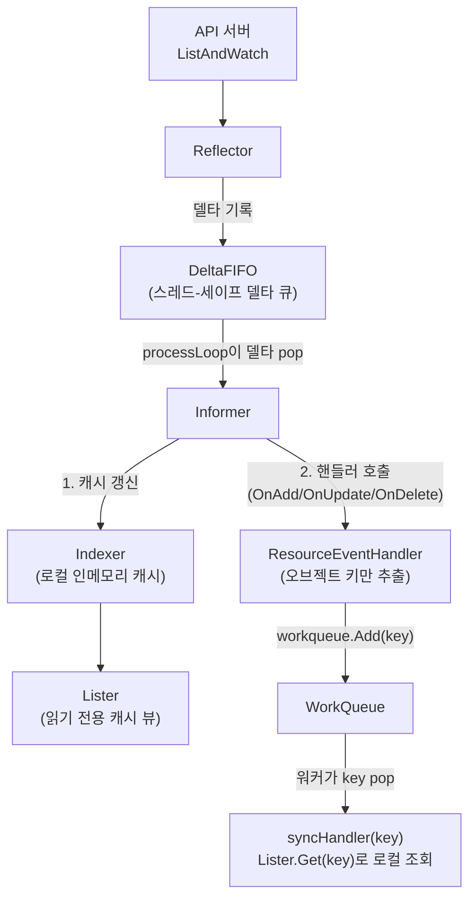
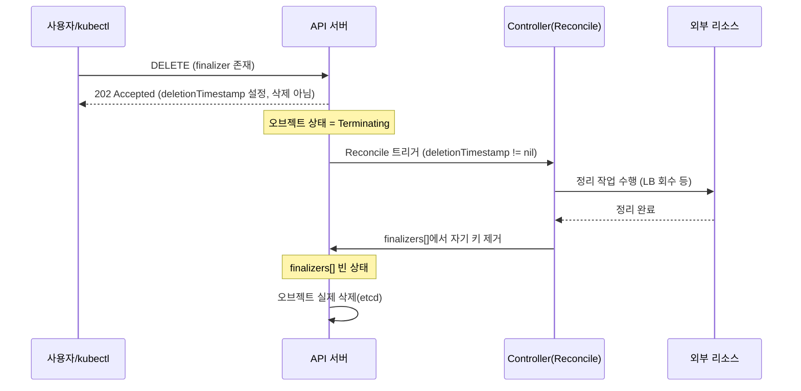



[Operator](https://kubernetes.io/docs/concepts/extend-kubernetes/operator/)는 [CustomResourceDefinition](https://kubernetes.io/docs/concepts/extend-kubernetes/api-extension/custom-resources/)(CRD)으로 새 API 종류를 등록하고, 그 CRD를 대상으로 "원하는 상태(spec)"와 "관측된 상태(status)"를 끊임없이 비교·수렴시키는 컨트롤러를 붙입니다. 이렇게 사람 운영자가 갖고 있던 애플리케이션별 운영 지식(배포·백업·업그레이드·장애 대응)을 코드로 인코딩하는 패턴입니다.

이 글은 kubernetes.io 공식 문서, Kubebuilder Book, Operator SDK, client-go/sample-controller 문서, Argo CD·Argo Workflows 공식 아키텍처 문서를 근거로 Operator 패턴의 개념·구현 배관·성숙도 모델을 정리한 노트입니다.

> [!NOTE] 전제 지식
> Kubernetes의 기본 리소스(Pod·Deployment)와 `kubectl` 사용법을 안다고 가정합니다. CRD·컨트롤러를 처음 접한다면 아래 1절부터 순서대로 읽으면 됩니다.

## CRD·Controller·Operator는 서로 다른 개념이다

**한 줄 요지: CRD는 API 계약, Controller는 범용 재조정 엔진, Operator는 그 엔진에 특정 애플리케이션의 운영 지식이 결합된 것이다.** 세 단어가 종종 뒤섞여 쓰이지만 분리해서 봐야 합니다.

[kubernetes.io 공식 문서](https://kubernetes.io/docs/concepts/extend-kubernetes/operator/)는 Operator를 다음과 같이 정의합니다.

> An Operator is a software extension to Kubernetes that uses custom resources to manage applications and their components. Operators follow Kubernetes principles, notably the control loop.

더 정확히 말하면, **Operator는 Custom Resource의 컨트롤러 역할을 하는 Kubernetes API 클라이언트**입니다. 이 패턴은 Kubernetes 자체의 코드를 수정하지 않고 클러스터 동작을 확장합니다 — CRD·컨트롤러·(선택적으로) 웹훅이라는 표준 확장 지점만으로 동작하므로 정합성을 갖춘 어떤 Kubernetes 클러스터에서도 이식 가능합니다.

세 개념을 표로 나누면 다음과 같습니다.

| 용어 | 정체 | 비유 |
|---|---|---|
| **CustomResourceDefinition(CRD)** | apiserver에 등록되는 API 계약/스키마. `spec`과 `status`를 가진 새 `Kind`(예: `PostgresCluster`)를 정의한다. | 인터페이스/API 표면 |
| **Controller** | watch → compare → act를 수행하는 범용 제어 루프 프로그램. 특정 애플리케이션 의미론에 묶이지 않는다 — Kubernetes 자체가 거의 전부 컨트롤러로 만들어져 있다(Deployment 컨트롤러, ReplicaSet 컨트롤러, Job 컨트롤러, Node 컨트롤러 등, `kube-controller-manager` 안에서 실행). | 감시·재조정하는 엔진 |
| **Operator** | 하나의(또는 소수 계열의) Custom Resource 타입을 위해 **애플리케이션 고유의 깊은 운영 지식**을 인코딩하도록 목적에 맞게 만들어진 컨트롤러. 보통 코어 컨트롤 플레인 바깥에서 실행되는 `Deployment`로 배포된다. | 엔진 + 특정 소프트웨어 운영 도메인 전문성 |

한마디로 **CRD = API 표면, Controller = 범용 재조정 엔진, Operator = CRD + Controller + 인코딩된 운영 지식**입니다. 모든 Operator는 Controller지만, 모든 Controller가 Operator는 아닙니다 — 내장 Deployment 컨트롤러는 Controller이지 통상적 의미의 "Operator"는 아닙니다. CRD가 아니라 내장 리소스를 관리하고 서드파티 애플리케이션 라이프사이클 지식을 인코딩하지 않기 때문입니다.

공식 문서는 Operator 패턴의 동기를 다음과 같이 설명합니다.

> The operator pattern aims to capture the key aim of a human operator who is managing a service or set of services. Human operators who look after specific applications and services have deep knowledge of how the system ought to behave, how to deploy it, and how to react if there are problems.

공식 문서가 예로 드는, Operator가 흔히 자동화하도록 만들어지는 작업은 다음과 같습니다.

- 요청 시 애플리케이션 배포(`kubectl apply`를 통한 셀프서비스)
- 애플리케이션 상태의 백업 수행·복원
- 데이터베이스 스키마 마이그레이션·설정 갱신 같은 관련 변경과 함께 애플리케이션 코드 업그레이드 처리
- Kubernetes API를 지원하지 않는 애플리케이션에 `Service`를 게시해 발견 가능하게 함
- 클러스터 전체 또는 일부의 장애를 시뮬레이션해 복원력 테스트(카오스 엔지니어링)
- 내부 멤버 선출 절차가 없는 분산 애플리케이션의 리더 선택

### 예시 — `SampleDB`

공식 문서는 `SampleDB`라는 Custom Resource 예시로 전체 라이프사이클을 설명합니다.

1. **CustomResourceDefinition**이 `SampleDB`를 새 API 종류로 등록한다.
2. **Operator의 Deployment**가 컨트롤러 로직을 실행하는 컨테이너("operator image")를 담은 Pod를 스케줄한다.
3. 컨트롤러 코드가 **컨트롤 플레인을 watch**해 설정된 `SampleDB` Custom Resource를 발견한다.
4. `SampleDB` 오브젝트 생성 시, 컨트롤러의 **재조정 로직**이 `PersistentVolumeClaim`, `StatefulSet`, 설정용 `Job`을 프로비저닝해 요청된 spec에 맞는 데이터베이스 인스턴스를 만든다.
5. 삭제 시, 컨트롤러는 `StatefulSet`과 볼륨을 제거하기 전에 마지막 스냅샷을 뜬다.
6. 이후 지속되는 백그라운드 자동화가 주기적 백업, 자동 버전 업그레이드, 헬스 모니터링을 관리한다 — 일회성 설치 스크립트를 넘어서는 진짜 "운영적" 동작이 시작되는 지점이다.

배포된 operator와 상호작용하는 방식은 내장 리소스와 똑같습니다.

```bash
kubectl get SampleDB                   # 설정된 데이터베이스 목록
kubectl edit SampleDB/example-database # 원하는 설정 변경
```

사용자는 오직 *원하는 상태*만 선언하고, 나머지는 operator의 재조정 루프가 처리합니다.

### Operator를 작성하는 프레임워크

공식 문서에 따르면 operator는 "클라이언트 라이브러리가 있는 Kubernetes API 클라이언트"이므로 어떤 언어로도 작성 가능합니다. kubernetes.io가 열거하는 프레임워크(비배타적 목록)는 다음과 같습니다.

- **[kubebuilder](https://book.kubebuilder.io/)**(Go) — 가장 널리 채택, `sigs.k8s.io/controller-runtime` 기반
- **[Operator Framework](https://operatorframework.io)**(Go/Ansible/Helm) — **Operator SDK**를 통해, Go 경로는 Kubebuilder 위에 구축
- **[Kopf](https://github.com/nolar/kopf)** — Kubernetes Operator Pythonic Framework
- **[kube-rs](https://kube.rs/)** — Rust
- **[KubeOps](https://dotnet.github.io/dotnet-operator-sdk/)** — .NET SDK
- **[Java Operator SDK](https://github.com/operator-framework/java-operator-sdk)**
- **[Metacontroller](https://metacontroller.github.io/metacontroller/intro.html)** — 재조정 로직을 컴파일된 컨트롤러 바이너리 대신 웹훅으로 작성
- **[shell-operator](https://github.com/flant/shell-operator)** — 재조정 로직을 셸 스크립트로 작성
- **[Charmed Operator Framework](https://github.com/canonical/operator/)**(`ops`, Python)

미리 만들어진 설치 가능 operator의 커뮤니티 카탈로그는 **[OperatorHub.io](https://operatorhub.io/)**입니다.

## 재조정 루프 아키텍처

**한 줄 요지: 컨트롤러는 이벤트로 깨어나지만(edge-triggered) 재조정 로직 자체는 현재 상태만 본다(level-triggered) — 이 하이브리드 덕분에 크래시 후 재시작돼도 특별한 복구 코드 없이 수렴한다.**

### 제어 루프의 기본 형태

[kubernetes.io 공식 컨트롤러 문서](https://kubernetes.io/docs/concepts/architecture/controller/)는 **제어 루프(control loop)**를 시스템 상태를 조절하는 비종료 루프로 정의하며, 교과서적 예시로 온도조절기를 듭니다.

1. **원하는 온도**를 설정한다(원하는 상태).
2. 온도조절기가 **실제 방 온도**를 측정한다(현재/관측된 상태).
3. 격차를 좁히도록 동작한다(냉난방 켬/끔).
4. 반복한다, 영원히.

Kubernetes 컨트롤러도 물리적 온도 대신 클러스터 오브젝트를 상대로 같은 일을 합니다.

1. 클러스터의 상태를 **watch**한다(API 서버를 통해).
2. 원하는 상태(오브젝트의 `spec`)와 관측된 상태(실제로 실행 중인 것)를 **비교**한다.
3. 격차를 좁히도록 변경을 만들거나 요청한다 — **act**.
4. **무한히 반복**한다. 컨트롤러 루프에는 종료 상태가 없다 — 프로세스가 살아있는 동안 계속 실행된다.

재조정되는 모든 리소스 타입은 이 구분을 스키마에 명시적으로 담습니다.

- **`spec`** — 원하는 상태. 사용자 또는 상위 컨트롤러가 작성한다. 컨트롤러 입장에서는 (일부 defaulting/mutating 웹훅의 드문 경우를 제외하면) 오직 *읽기* 전용이다.
- **`status`** — 관측된/현재 상태. *오직* 컨트롤러(또는 그 status subresource)만 작성하며, 사용자와 다른 컨트롤러가 읽는다. 프로덕션에서 손으로 편집하지 않는다.

[Kubebuilder Book](https://book.kubebuilder.io/cronjob-tutorial/controller-overview.html)은 컨트롤러의 임무를 이렇게 표현합니다.

> It's a controller's job to ensure that, for any given object, the actual state of the world (both the cluster state, and potentially external state...) matches the desired state in the object. This process is called reconciling.

### 직접 제어 vs 간접 제어

공식 문서는 컨트롤러가 원하는/관측된 상태 격차를 좁히는 두 가지 메커니즘을 구분합니다.

**간접 제어(API 서버를 통함)** — Kubernetes 내부의 지배적 패턴. 예: **Job 컨트롤러**.

```
사용자가 Job 생성(원하는 상태: 완료)
  → Job 컨트롤러가 spec을 읽고 Pod가 필요하다고 판단
  → Job 컨트롤러가 API 서버를 통해 Pod 오브젝트를 생성
  → (할당된 노드의) kubelet이 Pod를 감지, 컨테이너를 실행
  → Job 컨트롤러가 Pod 상태를 watch
  → 작업이 끝나면 Job 컨트롤러가 Job.status = Finished를 씀
```

컨트롤러는 워크로드 자체를 실행하지 않고, 다른 컴포넌트(스케줄러, kubelet)가 반응하는 API 호출만 발행합니다.

**직접 제어(외부 시스템)** — 컨트롤러가 클러스터 *바깥*의 무언가에 영향을 줘야 할 때 쓰입니다. 예: **클라우드 프로바이더 노드 오토스케일러**.

```
원하는 상태: 대기 중인 Pod를 만족시킬 만큼의 Node
  → 컨트롤러가 API 서버를 통해 현재 Node 수를 확인
  → 부족하면 컨트롤러가 클라우드 프로바이더의 API를 직접 호출
  → 클라우드 프로바이더가 새 VM 인스턴스를 프로비저닝
  → 컨트롤러가 새 상태를 클러스터에 다시 보고(Node 오브젝트가 나타남)
```

### Level-triggered vs Edge-triggered 재조정

이 성질은 Kubernetes 컨트롤러에서 가장 중요하면서도 가장 자주 오해되는 아키텍처 특성 중 하나입니다.

- **Edge-triggered**: *상태 전이*(이벤트/diff)에 반응한다. edge를 놓치면(크래시한 프로세스, 끊긴 watch 연결) 전체 이벤트 히스토리를 재생하지 않는 한 그 정보를 영원히 잃는다.
- **Level-triggered**: 어떻게 도달했는지와 무관하게 *현재 상태 자체*에 반응한다. 매 재조정은 "지금 무엇이 있어야 하고 지금 실제로 무엇이 있는가"만 묻는다 — 현재 상태를 만들어낸 구체적 이벤트 순서는 무시한다.

Kubernetes 컨트롤러는 **트리거 계층에서는 이벤트 기반**(API 서버의 watch 스트림이 리컨실러를 깨움)이지만 **재조정-로직 계층에서는 level 기반**(리컨실러가 이벤트 페이로드를 버리고 informer 캐시에서 오브젝트를 새로 읽음)입니다. 이 하이브리드는 의도된 설계입니다.

> An edge-triggered controller would have to replay all events in order to know what to do. A level-triggered controller does not care about any of them — it just looks at the cluster right now and asks: "are there the desired number of healthy Pods?" If no, it creates or deletes enough Pods to make it so.

실질적 이득은 이렇습니다. **Kubernetes 컨트롤러는 크래시할 수 있고, 임의의 시간 뒤에 재시작될 수 있으며, 특별한 복구 코드 없이도 올바르게 수렴합니다.** 모든 과거 이벤트를 목격했다는 것에 의존하지 않고, 깨어난 그 순간의 현재 spec과 현재 관측 상태를 읽을 수 있다는 것에만 의존하기 때문입니다. 그래서 reconcile 함수는 중복 호출되거나, 순서가 뒤바뀌거나, 임의로 긴 공백 뒤에 호출되어도 견뎌내도록 작성해야 합니다(멱등성 — 아래 "흔한 함정" 절 참고).

### client-go의 Informer/Lister/Workqueue 파이프라인

이것이 손으로 작성했든 Kubebuilder/Operator-SDK로 스캐폴딩했든, 모든 커스텀 컨트롤러가 그 위에 지어지는 구체적 구현 배관입니다. [`kubernetes/sample-controller`의 공식 문서(`docs/controller-client-go.md`)](https://github.com/kubernetes/sample-controller/blob/master/docs/controller-client-go.md)와 client-go 소스에 따르면 흐름은 다음과 같습니다.



각 컴포넌트의 책임은 정확히 다음과 같습니다.

- **Reflector** — API 서버의 한 리소스 타입에 대해 `ListAndWatch`를 실행한다. 시작 시 전체 `List`로 상태를 시딩한 뒤, 이후 델타를 스트리밍할 `Watch`를 연다. 관측된 모든 델타(Added/Updated/Deleted/Sync)를 `DeltaFIFO`에 기록한다.
- **DeltaFIFO** — 스레드-세이프한 델타 FIFO 큐. 오브젝트 키별로 중복 제거되어, 같은 오브젝트에 대한 빠른 업데이트 폭주가 최신 델타 하나로 합쳐진다.
- **Informer**(client-go 자체 용어로는 "base controller") — DeltaFIFO에서 델타를 pop하는 `processLoop`을 실행한다. 델타마다 (a) **Indexer**(로컬 인메모리 캐시)를 갱신하고 (b) 등록된 **ResourceEventHandler**(`AddFunc`, `UpdateFunc`, `DeleteFunc`)를 발화시킨다.
- **Indexer** — 스레드-세이프하고 인덱싱된 로컬 오브젝트 저장소. 기본적으로 `MetaNamespaceKeyFunc`를 통해 `<namespace>/<name>` 문자열로 키가 매겨지고, 선택적으로 커스텀 인덱스 함수(예: owner UID별, label별)로도 인덱싱된다.
- **Lister** — Indexer 캐시 위의 얇고, 생성된, 읽기 전용 타입 래퍼(예: `podLister.Pods(ns).Get(name)`). Lister를 통한 읽기는 **API 서버를 절대 건드리지 않는다** — 로컬 메모리 조회이며, 이것이 정확히 informer/lister 패턴이 스케일하는 이유다. N개 컨트롤러가 하나의 **SharedInformerFactory**를 공유하면 그 리소스 타입을 소비하는 컨트롤러 수와 무관하게 apiserver에 대해 정확히 하나의 `Watch`만 발행한다.
- **ResourceEventHandler** — 콜백 함수. 표준적으로 권장되는 패턴은 콜백 안에서 실제 작업을 하지 *않는* 것이다. 대신 오브젝트의 키를 추출(`cache.MetaNamespaceKeyFunc`)해 `workqueue.Add(key)`로 넣고, 실제 처리는 워커 풀에 미룬다.
- **WorkQueue**(`k8s.io/client-go/util/workqueue`) — 오브젝트의 *전달*(informer로부터)과 *처리*(reconcile 함수에 의해)를 분리한다. 이 분리가 주는 것은 다음과 같다.
  - **중복 제거** — 워커가 집기 전에 같은 키가 여러 번 enqueue되면 한 번의 처리 패스로 합쳐진다(`RateLimitingInterface`/`TypedRateLimitingInterface`가 내부적으로 "dirty" vs "processing" 집합을 추적한다).
  - **백오프를 동반한 재시도** — 실패한 아이템은 `AddRateLimited(item)`으로 큐에 다시 추가되며, 이는 설정 가능한 `RateLimiter`에 위임된다. `workqueue.DefaultControllerRateLimiter()`는 아이템별 `ItemExponentialFailureRateLimiter`(**기본 시작 지연 5ms, 최대 지연 1000s**)와 전체 `BucketRateLimiter`(토큰 버킷, **기본 10qps, burst 100**) 둘을 조합하며, 주어진 재시도의 실제 지연은 **둘 중 더 큰 값**이다. 레이트 리미팅이 아이템별(큐 키별)로 추적되기 때문에, 계속 실패하는 오브젝트 하나가 늘어나는 백오프를 갖더라도 다른 정상 오브젝트의 처리를 굶기거나 지연시키지 않는다.
  - **병렬 워커** — 여러 고루틴이 동시에 안전하게 `queue.Get()`을 호출할 수 있으며, 큐 자체가 같은 키가 두 워커에 의해 동시에 처리되지 않도록 보장한다(재처리를 위해 반드시 `queue.Done(key)`를 호출해야 릴리스된다).

<details markdown="1">
<summary>심화: 주기적 재동기화(resync)가 왜 필요한가</summary>

이벤트 기반 watch 스트림 외에도, 모든 `SharedInformer`는 팩토리 생성 시 `resyncPeriod` 인자(예: `informers.NewSharedInformerFactory(clientset, 30*time.Minute)`)로 설정되는 **주기적 전체 재동기화**를 수행합니다.

resync가 실제로 하는 일: API 서버에 **다시 접속하지 않습니다.** 대신 로컬 Indexer 캐시에 현재 있는 모든 오브젝트를 순회하며 각각을 `UpdateFunc(oldObj, newObj)`를 통해 다시 전달합니다 — 이때 `oldObj`와 `newObj`는 보통 *같은*(변경되지 않은) 오브젝트입니다. 이것이 존재하는 이유는 두 가지입니다.

1. **최종 일관성 안전망** — watch 연결이 조용히 끊길 수 있고, informer가 재연결/relist 구간 중 델타를 놓칠 수 있고, reconcile 자체가 이벤트를 과소 처리하는 잠복 버그를 가질 수 있다. resync는 이벤트를 놓쳤더라도 리컨실러가 늦어도 `resyncPeriod` 안에 모든 오브젝트에 대해 다시 호출됨을 보장해, 자가 치유 시스템에 유한한 최악의 드리프트-탐지 윈도를 제공한다.
2. **Level-triggered 시맨틱 강화** — Kubernetes 컨트롤러는 level-triggered이도록 의도되었으므로, resync는 "모든 이벤트를 다 봤다고 그냥 믿지 말고, 놓친 게 있더라도 주기적으로 전체 세상을 다시 검증하라"는 것의 기계적 구현이다.

한 가지 흔하고 중요한 구현 디테일: `UpdateFunc` 안에서 잘 작성된 핸들러는 `oldObj.GetResourceVersion()`과 `newObj.GetResourceVersion()`을 비교합니다. 둘이 같으면 그 업데이트는 순수한 resync(변경 없음)였으므로 비용이 큰 재조정 작업을 건너뛰거나 단축할 수 있습니다 — 다만 건너뛰기는 최적화일 뿐 정확성 요구사항이 아니므로, reconcile 함수 자체는 여전히 중복 호출에 안전해야 합니다.

</details>

## CRD 스키마 정의와 OpenAPI v3 검증

**한 줄 요지: `apiextensions.k8s.io/v1`부터는 structural schema가 강제되며, 이를 통해 알 수 없는 필드가 프루닝되고 기본값·CEL 검증이 가능해진다.**

### 최소 CRD 구조

[공식 문서](https://kubernetes.io/docs/tasks/extend-kubernetes/custom-resources/custom-resource-definitions/)에 따르면 `CustomResourceDefinition`은 다음을 요구합니다.

```yaml
apiVersion: apiextensions.k8s.io/v1
kind: CustomResourceDefinition
metadata:
  name: crontabs.stable.example.com   # <plural>.<group>과 반드시 같아야 함
spec:
  group: stable.example.com            # REST API 그룹
  scope: Namespaced                    # 또는 Cluster
  names:
    plural: crontabs
    singular: crontab
    kind: CronTab
    shortNames:
    - ct
  versions:
    - name: v1
      served: true                     # API로 노출됨
      storage: true                     # 정확히 하나의 버전만 storage version이어야 함
      schema:
        openAPIV3Schema:
          type: object
          properties:
            spec:
              type: object
              properties:
                cronSpec:
                  type: string
                image:
                  type: string
                replicas:
                  type: integer
```

적용되면 인스턴스는 내장 리소스와 똑같이 생성됩니다.

```yaml
apiVersion: stable.example.com/v1
kind: CronTab
metadata:
  name: my-new-cron-object
spec:
  cronSpec: "* * * * */5"
  image: my-awesome-cron-image
```

### Structural schema — `apiextensions.k8s.io/v1`부터 강제

`apiextensions.k8s.io/v1` CRD의 모든 버전에는 **structural schema**가 필수입니다. 규칙은 정확히 다음과 같습니다.

1. **모든 노드가 타입을 명시해야 한다** — 루트 오브젝트, `properties` 또는 `additionalProperties`를 통한 모든 오브젝트 필드, 모든 배열의 `items`. 유일한 예외는 `x-kubernetes-int-or-string: true` 또는 `x-kubernetes-preserve-unknown-fields: true`로 표시된 노드다.
2. **조합 전용 필드 정의 금지** — `allOf`, `anyOf`, `oneOf`, `not` 안에 나타나는 필드는 같은 레벨의 그 구성 바깥에도 *반드시* 정의되어 있어야 한다.
3. **특정 키워드는 논리 결합자 안에서 금지** — `description`, `type`, `default`, `additionalProperties`, `nullable`은 `allOf`/`anyOf`/`oneOf`/`not` 안에 직접 나타날 수 없다.
4. **메타데이터 제약은 제한적이다** — `metadata.name`과 `metadata.generateName`만 스키마 제약을 가질 수 있고, 다른 `metadata` 필드는 CRD 스키마로 제약할 수 없다.

스키마 위반 예시(non-structural, 무효):

```yaml
allOf:
- properties:
    foo:
      type: string   # 무효: foo가 allOf 안에서만 정의되고 최상위에 없음
```

유효한 대응 형태:

```yaml
type: object
properties:
  foo:
    type: string
allOf:
- properties:
    foo:
      pattern: "abc"   # 이미 최상위에 정의된 필드를 정교화하는 것은 괜찮음
```

<details markdown="1">
<summary>심화: 프루닝·기본값·CEL 검증·subresource·다중 버전</summary>

**프루닝·기본값·검증 규칙**

- **프루닝(Pruning)**: structural schema가 적용되면, 스키마에 선언되지 않은 필드를 클라이언트가 보내도 쓰기 시점에 자동으로 제거("프루닝")된다. 이것이 CRD가 임의의 정크 필드를 쌓지 않고 일관되게 동작하게 만든다.
- **기본값(Defaulting)**: 스키마의 `default:` 값은 필드가 생략됐을 때 적용된다.

  ```yaml
  properties:
    replicas:
      type: integer
      default: 1
  ```

- **`x-kubernetes-validations`**(CEL 기반 검증 규칙)는 일반 OpenAPI 제약을 넘어서는 크로스필드·복합 검증을 가능하게 한다.

  ```yaml
  properties:
    status:
      type: object
      x-kubernetes-validations:
      - rule: "self.readyReplicas <= self.replicas"
        message: "readyReplicas must be <= replicas"
  ```

- 표준 OpenAPI v3 제약(`minimum`, `maximum`, `pattern`, `enum`, `required` 등)은 `openAPIV3Schema` 안에서 그대로 지원된다.

**Subresource**

- **`status` subresource**(`subresources: {status: {}}`) — `.status` 필드를 오브젝트 본체에서 분리해, 일반 `PUT`/`PATCH`가 `.status`를 수정할 수 없게 하고, 컨트롤러가 전용 `/status` subresource 엔드포인트로 `.status`에 쓰게 한다(spec 변경만 보는 재조정 루프를 트리거하지 않지만 일반적인 update 이벤트는 여전히 생성한다). 이것이 사용자 쪽 `spec` 쓰기와 컨트롤러 쪽 `status` 쓰기가 독립적 RBAC와 독립적 낙관적 동시성 시맨틱을 갖게 하는 표준 메커니즘이다.
- **`scale` subresource** — `kubectl scale`을 커스텀 리소스에 대해 가능하게 한다.

  ```yaml
  subresources:
    scale:
      specReplicasPath: .spec.replicas
      statusReplicasPath: .status.readyReplicas
  ```

**다중 버전과 기타 기능**

- **동시에 여러 버전 서빙** — CRD는 여러 `versions[]` 항목을 선언할 수 있고, 각각 독립적으로 `served`(API에서 보임)이며 최대 하나만 `storage: true`(실제로 etcd에 저장되는 버전, conversion 웹훅이 served-but-non-storage 버전들을 연결)다.
- **`additionalPrinterColumns`** — spec/status에서 임의의 `jsonPath`를 추출해 `kubectl get` 테이블 출력을 커스터마이즈한다.
- **`categories`** — `kubectl get all` 같은 상위 카테고리로 CRD를 묶는다(`names.categories: [batch]` → `kubectl get batch`).
- 커스텀 리소스 인스턴스의 **Finalizer**는 내장 리소스와 동일하게 동작한다(아래 "흔한 함정" 절 참고).

</details>

## Operator 성숙도 모델

**한 줄 요지: Operator SDK의 공식 문서는 Operator 기능을 5단계 성숙도 사다리로 규정하며, 3단계 이상은 [Helm](https://helm.sh/docs/) 템플릿만으로는 도달할 수 없다.**

[Operator SDK의 공식 capability-levels 문서](https://sdk.operatorframework.io/docs/overview/operator-capabilities/)에 따르면 Operator 기능은 다음 5단계로 기술되며, 이 모델은 생태계 전반에서 쓰입니다(예: CloudNativePG가 자신이 어느 단계를 목표로 하는지 문서화).

```
Level 1        Level 2         Level 3        Level 4         Level 5
Basic     →    Seamless   →    Full      →    Deep       →    Auto
Install        Upgrades        Lifecycle      Insights        Pilot
```

- **Level 1 — Basic Install**: 자동화된 애플리케이션 프로비저닝과 설정 관리. Operator는 CR의 `spec`만으로 operand를 배포(또는 클러스터 밖 리소스를 설정)하고, 관리 대상 리소스가 정상 상태에 도달하기를 기다리고, CR의 `status` 블록을 통해 준비 완료를 알린다.
- **Level 2 — Seamless Upgrades**: operand를 무중단으로 업그레이드할 수 있다 — 새 operator 버전에 대응하든 CR spec 변경에 대응하든. Operator는 이전 operand 버전을 앞으로 마이그레이션하는 방법을 안다. 관리할 수 없는 operand 버전을 만나면 조용히 오작동하지 않고 `status`로 그 한계를 알린다.
- **Level 3 — Full Lifecycle**: operand 데이터의 백업·복원, 복잡한 재설정 오케스트레이션, 클러스터형 operand의 failover/failback, 클러스터 멤버 추가/제거를 트리거 이상의 수동 개입 없이 지원한다. operand를 위해 liveness/readiness probe, 롤링 업데이트 전략, `PodDisruptionBudget`, 리소스 requests/limits 같은 Kubernetes 복원력 모범 사례도 적용한다.
- **Level 4 — Deep Insights**: 포괄적 모니터링·경고 — operator가 자신의 헬스 메트릭과 operand의 헬스/성능 메트릭을 모두 노출하고, 의미 있는 경고(가능하면 runbook/SOP 링크 포함)를 발생시키며, 일반적인 Deployment 수준 이벤트를 넘어선 커스텀 Kubernetes `Event`를 표면화한다.
- **Level 5 — Auto Pilot**: 가장 상위 단계. 다음을 통해 수동 개입을 의미 있게 줄이거나 없앤다 — **오토스케일링**(부하 시 operand를 확장, 유휴 시 축소), **오토힐링**(비정상 operand 상태를 자동 복구 또는 사전 예방), **오토튜닝**(관측된 워크로드 패턴에 맞춰 operand를 자동 튜닝, 필요시 더 최적인 노드로 워크로드 이동), **비정상 탐지**(학습된/표준 성능 프로파일로부터의 이탈 식별).

**SDK 타입 참고**: 레벨 I과 II는 Operator SDK의 세 프로젝트 타입(Helm 기반, Ansible 기반, Go 기반) 어느 것으로도 도달 가능합니다. 레벨 III 이상은 일반적으로 Ansible 또는 Go operator의 명령형 유연성을 요구합니다 — 순수 Helm 템플릿 기반 operator는 failover 순서화나 오토튜닝 휴리스틱 같은 임의의 라이프사이클 오케스트레이션 로직을 쉽게 표현할 수 없습니다.

## Operator를 만드는 도구 — Kubebuilder, Operator SDK, controller-runtime

**한 줄 요지: controller-runtime이 실제 런타임 엔진이고, Kubebuilder는 그 위의 스캐폴딩 CLI이며, Operator SDK는 다시 Kubebuilder 위에 OLM 연동과 비-Go 프로젝트 타입을 얹은 것이다.**

세 도구의 관계는 다음과 같습니다.

- **[`sigs.k8s.io/controller-runtime`](https://github.com/kubernetes-sigs/controller-runtime)** — `Manager`, `Reconciler` 인터페이스, 범용 `Client`, 캐싱, 웹훅, 리더 선출, 메트릭을 제공하는 기반 Go 라이브러리. 실제 런타임 엔진이다.
- **Kubebuilder** — controller-runtime에 연결된 프로젝트 스켈레톤을 생성하는 CLI + 스캐폴딩 프레임워크. CRD 매니페스트·RBAC 마커·deepcopy 메서드를 위한 코드 생성 도구(`controller-gen`)도 포함한다.
- **Operator SDK** — Go 프로젝트 타입에 대해서는 Kubebuilder *위에* 구축된다(공식 문서: "the `operator-sdk` CLI tool will work with a project created by kubebuilder"). 여기에 Operator Lifecycle Manager(OLM) 연동, OperatorHub 번들 메타데이터, `scorecard` 테스트 도구를 기본으로 추가하고, Kubebuilder 자체는 제공하지 않는 비-Go 프로젝트 타입(Helm 기반, Ansible 기반 operator)도 지원한다.

### 프로젝트 스캐폴딩

공식 Kubebuilder 퀵스타트 명령입니다.

```bash
# 1. 프로젝트 스캐폴딩 초기화
kubebuilder init --domain my.domain --repo my.domain/guestbook

# 2. 새 API 스캐폴딩(CRD 타입 + 컨트롤러)
kubebuilder create api --group webapp --version v1 --kind Guestbook

# 3. +kubebuilder 마커로부터 CRD 매니페스트 + RBAC 생성
make manifests

# 4. 현재 설정된 클러스터에 CRD 설치
make install

# 5. 그 클러스터를 상대로 로컬에서 컨트롤러 실행(개발/디버그용)
make run

# 6. 컨트롤러 이미지를 빌드+push한 뒤 클러스터 내 Deployment로 배포
make docker-build docker-push IMG=<registry>/<project>:tag
make deploy IMG=<registry>/<project>:tag
```

기능적으로 동일한 Operator SDK 플로우(Go 프로젝트 타입에 대해 같은 하부 스캐폴딩)는 다음과 같습니다.

```bash
operator-sdk init --domain example.com --repo github.com/example/memcached-operator
operator-sdk create api --group=cache --version=v1alpha1 --kind=Memcached
```

이는 `api/v1alpha1/memcached_types.go`에 API 타입을, `controllers/memcached_controller.go`(또는 최신 Kubebuilder 레이아웃에서는 `internal/controller/`)에 리컨실러를 생성합니다.

controller-runtime 자체 패키지 문서는 **Manager**를 이렇게 설명합니다.

> A Manager is responsible for running controllers and webhooks, and setting up common dependencies, like shared caches and clients, as well as managing leader election.

하나의 `Manager` 프로세스가 보통 한 operator 바이너리의 모든 `Controller`를 호스팅하며, 하나의 informer 캐시와 하나의 API 클라이언트를 그 전부가 공유합니다.

### Reconciler 인터페이스

컨트롤러 작성자가 구현해야 하는 전체 계약은 메서드 하나입니다.

```go
func (r *CronJobReconciler) Reconcile(ctx context.Context, req ctrl.Request) (ctrl.Result, error)
```

- **`ctx context.Context`** — 취소 전파, (선택적으로) 트레이싱에 쓰인다.
- **`req ctrl.Request`** — 처리가 필요한 오브젝트의 `NamespacedName`(namespace + name)*만* 담고 있다 — 의도적으로 오브젝트 내용이나 트리거한 이벤트의 페이로드는 담지 않는다. 이것이 level-triggered 설계(위 "Level-triggered vs Edge-triggered" 참고)의 구체적 구현이다 — 리컨실러는 요청에 실려온 값을 신뢰하는 대신, 오브젝트를(보통 범용 클라이언트를 통해 informer 캐시에서) 새로 다시 가져올 것이 기대된다.
- **반환값 `ctrl.Result`**: `{Requeue bool; RequeueAfter time.Duration}`. `nil` 에러와 함께 제로값 `Result{}`를 반환하면 "재조정 성공, 추가적인 명시적 requeue 불필요"를 뜻한다(다만 주기적 resync와 향후 watch 이벤트가 여전히 리컨실러를 다시 트리거할 수 있다). `nil`이 아닌 `error`를 반환하면 controller-runtime이 **지수 백오프**로 자동 재큐잉한다. `RequeueAfter: someDuration`을 명시적으로 설정하면 다음 재조정을 그 시점에 예약한다(Kubebuilder의 CronJob 튜토리얼 컨트롤러가 다음 예약 실행이 정확히 언제인지 맞춰 깨어나는 데 이 방식을 자주 쓴다).

Kubebuilder의 공식 CronJob 튜토리얼은 생태계 전반의 참조 구현으로 쓰이는 표준 reconcile-loop 형태를 다음과 같이 문서화합니다.

1. 대상 오브젝트를 로드한다(`r.Get(ctx, req.NamespacedName, &cronJob)`).
2. 필드 인덱스를 통해 소유된 모든 자식 오브젝트(Job)를 나열한다(`client.MatchingFields{jobOwnerKey: req.Name}`).
3. 자식들을 active/successful/failed로 분류한다.
4. 방금 관측한 내용을 반영하도록 부모의 `.status`(condition 타입, 마지막 스케줄 시각 등)를 갱신한다.
5. 설정된 히스토리 한도를 넘는 오래된 Job을 정리한다(`r.Delete(ctx, job, ...)`).
6. `.spec.suspend`를 확인하고, CR이 관리상 일시정지 상태면 조기 반환(no-op)한다.
7. 다음 예약 실행 시각을 계산한다.
8. 예정되어 있으면(설정된 동시성 정책을 존중하며) 새 자식 Job을 생성하고, `ctrl.Result{RequeueAfter: <다음 예약 실행까지의 시간>}`을 반환한다.

### Owner Reference

Owner Reference는 컨트롤러가 "내가 이 자식 오브젝트를 만들었고, 이건 내 소유로 취급되어야 한다"고 선언하는 방법입니다. 다음과 같이 설정합니다.

```go
if err := ctrl.SetControllerReference(cronJob, job, r.Scheme); err != nil {
    return nil, err
}
```

이는 자식의 `metadata.ownerReferences[]`에 `apiVersion`, `kind`, `name`, `uid`, `controller: true`, (보통) `blockOwnerDeletion: true` 필드를 가진 항목을 씁니다. Owner reference는 **두 가지 서로 다른 역할을 동시에** 수행합니다.

1. **Kubernetes 가비지 컬렉션** — 내장 가비지 컬렉터 컨트롤러(`kube-controller-manager`의 일부)가 클러스터 전역에서 `ownerReferences`를 watch하다가, owner가 삭제되면(삭제 전파 정책에 따라) owner를 가리키는 `ownerReferences`를 가진 모든 dependent를 삭제(또는 고아로 만든다). CronJob/Deployment를 삭제할 때 자식 Job/Pod가 자동으로 제거되는 것이 이것이며, CronJob 컨트롤러 자체에는 커스텀 정리 코드가 전혀 없다.
2. **`.Owns()`를 통한 재조정 트리거링** — Kubebuilder/controller-runtime 빌더 패턴에서:

   ```go
   return ctrl.NewControllerManagedBy(mgr).
       For(&batchv1.CronJob{}).   // 1차 감시 타입
       Owns(&kbatch.Job{}).       // 2차 감시 타입 — 여기 변경이
       Named("cronjob").          // OWNER의 재조정을 재트리거
       Complete(r)
   ```

   `.Owns(&kbatch.Job{})`는 controller-runtime에게 "Job도 함께 watch하고, CronJob을 가리키는 owner reference를 가진 Job이 바뀔 때마다 *그 CronJob의* `NamespacedName`을 재조정 대상으로 enqueue하라"고 지시한다 — 리컨실러의 1차 `For()` 타입이 CronJob이지 Job이 아닌데도 그렇다.

<details markdown="1">
<summary>심화: 가비지 컬렉션 필드·삭제 모드, Finalizer, 리더 선출</summary>

**가비지 컬렉션 필드와 삭제 모드**

[공식 문서](https://kubernetes.io/docs/concepts/architecture/garbage-collection/)에 따른 owner-reference 필드의 정확한 의미는 다음과 같습니다.

| 필드 | 의미 |
|---|---|
| `metadata.ownerReferences[].apiVersion` | Owner의 API 버전 |
| `metadata.ownerReferences[].kind` | Owner의 Kind |
| `metadata.ownerReferences[].name` | Owner의 이름 |
| `metadata.ownerReferences[].uid` | Owner의 UID(권위 있는 식별자 검사 — 이름은 재사용될 수 있지만 UID는 그럴 수 없다) |
| `metadata.ownerReferences[].controller` | (bool, 선택) 이 참조를 *그* 관리 컨트롤러 참조로 표시, 다른 소유권 어노테이션과 구분 |
| `metadata.ownerReferences[].blockOwnerDeletion` | (bool, 선택) true면 foreground deletion 아래에서 owner가 제거되기 전에 이 dependent가 먼저 삭제되어야 함 |

세 가지 계단식 삭제 모드가 있습니다.

- **Background deletion(기본값)** — API 서버가 owner 오브젝트를 *즉시* 삭제하고, 가비지 컬렉터 컨트롤러가 이후 비동기로 dependent를 정리한다.
- **Foreground deletion** — owner에 `metadata.deletionTimestamp`가 표시되고 `metadata.finalizers: [foregroundDeletion]`을 갖는다. `blockOwnerDeletion: true`인 dependent가 모두 실제로 삭제될 때까지 "Terminating" 상태로 보이며, 그 시점에 비로소 owner 자체가 사라진다.
- **Orphan** — `kubectl delete <resource> <name> --cascade=orphan`은 owner만 삭제하고 dependent는 이제 매달린(dangling) owner reference를 가진 채 살아남는다.

중요한 제약: **네임스페이스를 넘는 owner reference는 설계상 허용되지 않는다** — 네임스페이스가 있는 dependent는 같은 네임스페이스(또는 클러스터 범위 owner)에 있는 owner만 참조할 수 있다. 무효한 크로스-네임스페이스 참조는 `OwnerRefInvalidNamespace` 사유의 경고 `Event`를 생성하며 가비지 컬렉션에서 사실상 무시된다.

**Finalizer — 삭제 전 커스텀 정리**

Owner reference + 내장 가비지 컬렉터는 *구조적* 정리(자식 API 오브젝트 삭제)를 처리합니다. 하지만 클라우드 로드밸런서 회수, 외부 데이터베이스 해제, CA로부터 인증서 폐기처럼 가비지 컬렉터가 스스로 할 수 없는 정리 작업이 필요할 때는 **Finalizer**가 필요합니다.

[공식 시맨틱](https://kubernetes.io/docs/concepts/overview/working-with-objects/finalizers/)은 다음과 같습니다.

- Finalizer는 문자열 키 목록인 **`metadata.finalizers[]`**에 산다. 커스텀 finalizer 이름은 **도메인으로 정규화되어야 한다**(예: `example.com/finalizer-name`) — API 서버는 정규화되지 않은 커스텀 finalizer 문자열을 거부한다.
- Finalizer를 가진 오브젝트에 `DELETE`가 실행되면:
  1. API 서버가 `metadata.deletionTimestamp`를 현재 시각으로 설정하고 HTTP **202 Accepted**(200이 아님)를 반환한다 — 오브젝트는 아직 etcd에서 실제로 제거되지 않는다.
  2. 오브젝트는 이제 사실상 "Terminating"이다. 여전히 읽을 수 있지만 **새 finalizer를 추가할 수 없고** **`deletionTimestamp`를 수정할 수 없다** — `finalizers[]`에서 항목을 *제거*만 할 수 있다.
  3. 나열된 finalizer 키 중 하나를 책임지는 각 컨트롤러는 `deletionTimestamp != nil`을 알아차리도록 기대된다(보통 일반 재조정에 쓰이는 *같은* `Reconcile` 함수 안에서 처리하는 것이 표준 Kubebuilder 패턴이다 — 삭제 전용 훅은 따로 없다), 정리 작업을 수행한 뒤, 업데이트를 통해 `finalizers[]`에서 자기 키를 제거한다.
  4. `finalizers[]`가 비면 오브젝트가 마침내 실제로 삭제된다.



- **Kubebuilder의 표준 finalizer 패턴**(`Reconcile` 안):

  ```go
  if cronJob.ObjectMeta.DeletionTimestamp.IsZero() {
      // 오브젝트가 삭제 중이 아님 — finalizer가 있는지 확인
      if !controllerutil.ContainsFinalizer(&cronJob, myFinalizerName) {
          controllerutil.AddFinalizer(&cronJob, myFinalizerName)
          if err := r.Update(ctx, &cronJob); err != nil { return ctrl.Result{}, err }
      }
  } else {
      // 오브젝트가 삭제 중임
      if controllerutil.ContainsFinalizer(&cronJob, myFinalizerName) {
          if err := r.cleanupExternalResources(&cronJob); err != nil {
              return ctrl.Result{}, err // 정리 재시도 — 아직 finalizer를 제거하지 않음
          }
          controllerutil.RemoveFinalizer(&cronJob, myFinalizerName)
          if err := r.Update(ctx, &cronJob); err != nil { return ctrl.Result{}, err }
      }
      return ctrl.Result{}, nil
  }
  ```

- 실제 내장 예시는 `kubernetes.io/pv-protection`이다. Kubernetes는 사용 중인 `PersistentVolume`에 이 finalizer를 자동으로 붙인다. 그 PV에 대한 삭제 요청은 소비 중인 Pod가 PV를 해제할 때까지 "Terminating"에 머물고, 그 시점에 finalizer가 제거되며 삭제가 완료된다.
- **위험 참고(공식)**: `kubectl patch ... --type=merge -p '{"metadata":{"finalizers":[]}}'`로 finalizer를 강제로 벗겨내면 의도된 정리를 완전히 우회하며 외부 리소스를 누출시킬 수 있다 — 다른 수단으로 정리가 이미 일어났음을 독립적으로 확인한 경우가 아니라면 공식 문서는 이를 명시적으로 경고한다.

**다중 복제본 HA 컨트롤러를 위한 리더 선출**

operator의 `Deployment`가 (롤링 업그레이드/노드 장애 중 가용성을 위해) 복제본을 하나 이상 실행하면, **모든 복제본이 같은 리소스를 watch하고 그렇지 않으면 모두 동시에 재조정을 시도**합니다 — 중복 작업, 낭비되는 API 호출, 레이스 컨디션, 같은 오브젝트에 대한 잠재적으로 충돌하는 쓰기("split-brain" 시나리오)를 일으킵니다. controller-runtime의 `Manager`는 표준 Kubernetes `Lease` API(`coordination.k8s.io/v1`)를 사용한 내장 리더 선출로 이를 해결합니다.

`sigs.k8s.io/controller-runtime/pkg/manager` 패키지 문서에 따른 정확한 `manager.Options` 필드와 기본값입니다.

| 필드 | 타입 | 기본값 | 의미 |
|---|---|---|---|
| `LeaderElection` | `bool` | `false` | 리더 선출을 활성화할지 여부 |
| `LeaderElectionResourceLock` | `string` | `"leases"` | 락을 뒷받침하는 API 오브젝트 타입(`Lease`가 현대적 기본값, 레거시 호환을 위한 `configmaps`/`endpoints` 옵션도 존재) |
| `LeaderElectionNamespace` | `string` | (반드시 설정) | `Lease` 오브젝트가 사는 네임스페이스 |
| `LeaderElectionID` | `string` | (반드시 설정) | `Lease`의 이름 — **논리적 컨트롤러별로 고유해야 함**. 관계없는 두 컨트롤러가 같은 ID를 공유하면 같은 lease를 두고 경쟁한다 |
| `LeaseDuration` | `*time.Duration` | **15초** | non-leader 후보가(마지막으로 관측된 leader heartbeat 이후) 강제로 리더십을 획득할 수 있게 되기까지 기다리는 시간 |
| `RenewDeadline` | `*time.Duration` | **10초** | 현재 리더가 자발적으로 물러나기 전까지 lease 갱신을 재시도하는 시간 |
| `RetryPeriod` | `*time.Duration` | **2초** | 대기 후보가 lease 획득을 시도하는 주기 |

동작상으로는, 현재 `Lease`를 쥔 복제본만 등록된 `Controller`(재조정 워커 시작)를 실행합니다. 대기 복제본은 유휴 상태로 있다가 lease가 만료되거나(크래시, 네트워크 파티션, 정상 종료) 새 리더 클레임이 성공하는 순간 넘겨받을 준비를 합니다. 이는 **active-passive HA**를 제공합니다 — 어느 시점에도 정확히 하나의 활성 재조정 인스턴스만 존재하고, 자동으로 1분 미만의 failover가 이루어지며, 오래된 복제본으로부터의 동시 충돌 재조정 위험이 없습니다.

</details>

## Operator vs Helm — 정확한 구분

**한 줄 요지: 가장 날카로운 한 줄 구분은 "Helm의 일은 `helm install`/`upgrade`가 반환되는 순간 끝나고, Operator의 일은 결코 끝나지 않는다"이다.**

자주 혼동되는 비교입니다. 정확하고 방어 가능한 구분은 다음과 같습니다.

| 차원 | Helm | Operator |
|---|---|---|
| **핵심 메커니즘** | Go 템플릿 + `values.yaml` 위의 클라이언트 사이드 템플릿 엔진. 정적 Kubernetes 매니페스트를 만든다 | 지속적인 reconcile 루프를 CRD에 대해 구현하는 실행 중인 컨트롤러 프로세스 |
| **관리 대상** | *설치 행위* — 차트 매니페스트를 한 번(또는 명시적 `helm upgrade` 시) 렌더링하고 `kubectl apply`하는 것 | 리소스의 *전체 지속적 라이프사이클*을, 추가 사용자 조작 없이 무기한 관리 |
| **설치 후 동작** | **Stateless** — `helm install`이 완료되면 명시적으로 `helm upgrade`/`helm rollback`을 실행하기 전까지 Helm 자체는 더 이상 아무것도 하지 않는다. 이후 클러스터의 드리프트를 감시하는 프로세스가 없다 | **지속적으로 재조정** — 살아있는 컨트롤러가 원하는/관측된 상태를 영원히 계속 watch하고, 사용자 조작 없이 드리프트를 스스로 치유한다(예: 수동으로 삭제된 자식 Pod가 재생성됨) |
| **드리프트 교정** | 내장되어 있지 않음 — 무언가 Helm이 설치한 리소스를 수동으로 편집하거나 삭제해도, 다음 명시적 `helm upgrade`까지 Helm은 알아채거나 복구하지 않는다 | 자동 — reconcile 루프가 다음 트리거(이벤트 또는 resync)에서 불일치를 탐지해 교정한다 |
| **도메인 로직** | 템플릿 + 훅(pre-install/post-install Job)으로 표현 가능한 것 — 정적 YAML + 단순 Job 기반 훅이 할 수 있는 것으로 본질적으로 제한된다 | 범용 언어(Go, Python 등)의 임의 명령형 로직 — 리더 failover, 스키마 마이그레이션, 백업/복원 시퀀싱 같은 다단계 상태 있는 워크플로우를 오케스트레이션할 수 있다 |
| **적합한 용도** | stateless하거나 단순한 애플리케이션의 템플릿화·패키징. 사실상의 Kubernetes 패키지 매니저(`apt`/`yum`에 대응) | 복잡한, 보통 상태 있는 시스템(데이터베이스, 메시지 큐, 인증서 발급, GitOps 지속 동기화)의 장기 실행 라이프사이클 자동화 |

가장 날카로운 한 줄 구분은 이렇습니다. **Helm의 일은 `helm install`/`helm upgrade`가 반환되는 순간 끝난다. Operator의 일은 결코 끝나지 않는다.** Operator의 성숙도 모델(위 절)이 "Auto Pilot"까지 올라가는 것도 바로 이 때문입니다 — Helm은 지속되는 프로세스가 없으므로 무언가를 "자동"으로 할 대상 자체가 없어 대응 개념이 존재하지 않습니다.

두 가지는 **상호 배타적이지 않습니다.** operator 자체(그 `Deployment`, `RBAC`, `CustomResourceDefinition`)를 `helm install`로 설치하는 것은 매우 흔합니다 — 그 이후로는 Helm이 아니라 *그 operator*가 자신이 관리하는 CR들의 지속적 재조정을 넘겨받습니다. Operator SDK의 Helm 기반 operator 타입도 중간 지점으로 존재합니다. Helm 차트의 렌더링 로직을 진짜 reconcile 루프 *안에* 감싸서, Helm의 템플릿화 위에 지속적 드리프트 교정을 얹습니다 — 이것이 Helm 타입 operator가 (위 성숙도 모델의) Capability Level I–II에 도달할 수 있게 하는 이유이며, 템플릿 기반임에도 그렇습니다.

## Argo CD가 Operator로서 어떻게 구성되어 있는가

**한 줄 요지: Argo CD는 "커스텀 리소스가 원하는 Git 상태를 나타내고 operand가 임의의 Kubernetes 매니페스트 집합인 Operator"의 대규모 프로덕션 사례다.**

### 컴포넌트

[`argo-cd.readthedocs.io/en/stable/operator-manual/architecture/`](https://argo-cd.readthedocs.io/en/stable/operator-manual/architecture/)에 따르면 구성은 다음과 같습니다.

- **API Server** — 애플리케이션 관리, 상태 보고, 오퍼레이션(sync, rollback, 사용자 정의 액션) 호출을 처리하고 RBAC/인증/자격증명 관리를 강제하는 gRPC/REST 서비스. `argocd` CLI와 웹 UI가 말하는 계층이다.
- **Repository Server** — 애플리케이션 매니페스트를 담은 Git 저장소(들)의 로컬 캐시를 유지하고, 주어진 repo URL + revision + 경로 + 템플릿 파라미터에 대해 최종 Kubernetes 매니페스트를 생성(Helm 차트, [Kustomize](https://kustomize.io/) 오버레이, 순수 YAML, [Jsonnet](https://jsonnet.org/) 렌더링)하는 내부 서비스.
- **Application Controller** — **이 아키텍처에서 실제 Kubernetes 컨트롤러**다. "실행 중인 애플리케이션을 지속적으로 모니터링하고 현재의 라이브 상태를(저장소에 명시된) 원하는 목표 상태와 비교한다." "OutOfSync" 애플리케이션을 탐지하고, `PreSync`/`Sync`/`PostSync` 라이프사이클 훅 호출을 포함해 교정 sync 프로세스를 몰아간다.

(더 넓은 배포에는 단일 제너레이터로부터 여러 `Application` 오브젝트를 템플릿화하는 `ApplicationSet` 컨트롤러, SSO용 `dex`, 캐싱용 `redis`도 포함됩니다 — 하지만 **application-controller가 Argo CD를 Operator로 만드는 재조정 엔진**입니다.)

### `Application` CRD

Argo CD의 중심 커스텀 리소스는 `Application`(`argoproj.io/v1alpha1`)입니다. 그 `spec`은 정확히 위에서 설명한 CRD-spec의 의미로 **원하는 상태**를 선언합니다.

- `spec.source`(또는 `sources[]`) — 렌더링할 Git 저장소 URL, 대상 리비전, 매니페스트 경로/차트
- `spec.destination` — 렌더링된 매니페스트를 적용할 클러스터 + 네임스페이스
- `spec.syncPolicy` — sync가 자동인지 수동인지, pruning/self-heal 동작

그 `status`는 **관측된 상태**를 반영합니다.

- `status.sync.status` — `Synced` 또는 `OutOfSync`
- `status.health.status` — `Healthy`, `Degraded`, `Progressing` 등
- `status.resources[]` — 리소스별 diff 상세

### GitOps 제어 루프

application-controller의 reconcile 사이클은 위에서 설명한 범용 패턴의 직접적인 인스턴스이며, Git을 원하는 상태의 소스로 특화한 형태입니다.

```
1. 원하는 상태 = render(Git 저장소 @ 대상 리비전, 경로, 템플릿 파라미터)   [repo-server를 통해]
2. 관측된 상태 = 대상 클러스터/네임스페이스에 현재 있는 라이브 오브젝트
3. 원하는 상태 vs 관측된 상태 diff → 리소스별 sync 상태(Synced / OutOfSync)
4. OutOfSync이고 auto-sync가 활성화됐거나(또는 수동 sync가 트리거되면):
     diff를 적용(kubectl apply와 동등)해 라이브 상태 → 원하는 상태로 수렴시킴
5. Application.status를 새 sync/health 상태로 갱신
6. 반복 — 주기적 재조정 타이머와, Git 저장소(웹훅 또는 폴링) 및
   라이브 클러스터 리소스 양쪽에 대한 watch 모두에 의해 구동됨
```

공식 문서와 컨트롤러 동작에 따르면, 기본 재조정 주기는 `argocd-cm` ConfigMap의 `timeout.reconciliation`이 관장하며 **기본값은 180초(3분)**이고 `timeout.reconciliation.jitter`로 지터를 설정할 수 있습니다 — 즉 Git 웹훅이 전혀 설정되지 않았어도 Argo CD는 최소 이 주기로 드리프트를 폴링합니다. 이는 client-go informer 계층이 아니라 GitOps 계층에 적용된, 위 "주기적 재동기화" 개념 그대로입니다.

각 `argocd-application-controller` 복제본은 내부적으로 **두 개의 별도 작업 큐**를 유지합니다 — 하나는 애플리케이션 *재조정*(상태 비교 — 밀리초 단위로 빠름)용이고 다른 하나는 애플리케이션 *sync*(실제 변경 적용 — 초 단위로 느림)용입니다. 이는 위 workqueue 절의 "탐지와 액션을 분리한다"는 범용 원칙이 그대로 반영된 것입니다.

### 왜 Argo CD가 "Operator"인가

위 CRD·Controller·Operator 구분에 정확히 대응합니다.

- **CRD** = `Application`(그리고 `ApplicationSet`, `AppProject`)
- **Controller** = `argocd-application-controller`
- **인코딩된 도메인 지식** = Helm/Kustomize/순수-YAML/Jsonnet 소스를 렌더링하는 방법, 임의의 Kubernetes 리소스를 (단순 바이트 diff가 아니라) 시맨틱하게 diff하는 방법, sync-wave 순서와 라이프사이클 훅을 시퀀싱하는 방법, 드리프트를 탐지하고 (선택적으로) 자동 치유하는 방법

Argo CD가 연구할 가치가 있는 가장 교훈적인 실전 Operator 중 하나로 자주 인용되는 이유가 바로 이것입니다 — 재조정 대상 리소스가 단일 애플리케이션 인스턴스가 아니라 *Git으로부터 유도된 전체 원하는 클러스터 상태*를 나타내지만, 재조정 아키텍처는 훨씬 작은 CRD(`CronJob`이나 `PostgresCluster` 같은)와 종류상 동일합니다.

## Argo Workflows가 Operator로서 어떻게 구성되어 있는가

**한 줄 요지: Workflow Controller가 client-go Informer 패턴 위에서 `Workflow` CRD를 재조정하며, 한 번에 하나의 Workflow만 직렬로 처리한다.**

### 컴포넌트

[`argo-workflows.readthedocs.io/en/latest/architecture/`](https://argo-workflows.readthedocs.io/en/latest/architecture/)에 따르면 시스템은 두 개의 Kubernetes `Deployment`로 구성됩니다.

- **Workflow Controller** — 모든 재조정 로직을 실행한다. API 서버 없이 단독으로 실행될 수 있다.
- **Argo Server** — REST/gRPC API와 웹 UI를 제공한다.

재조정되는 커스텀 리소스는 `Workflow`(`argoproj.io/v1alpha1`)이며, 그 `spec`은 DAG 또는 스텝 기반 파이프라인의 템플릿(각 템플릿은 궁극적으로 실행할 컨테이너에 매핑)을 선언하고, 그 `status`는 노드별(스텝별) phase(`Pending`, `Running`, `Succeeded`, `Failed`, `Error`)와 전체 워크플로우 phase를 추적합니다.

### 재조정 메커니즘

공식 아키텍처 문서에 따르면 다음과 같습니다.

> A set of worker goroutines process the Workflows which have been added to a Workflow queue based on adds and updates to Workflows and Workflow Pods.

결정적으로: **"the controller only ever processes a single Workflow at a time"** — 워커 슬롯당 그렇습니다. 즉 작업은 Workflow 단위로 분할되고, 하나의 Workflow 안에서 처리는 직렬화됩니다(다만 서로 다른 여러 Workflow의 워커 고루틴은 워커 풀 전체에서 병렬로 실행됩니다).

컨트롤러는 위의 client-go 패턴 그대로 **Informer**를 사용해 세 리소스 종류를 동시에 watch합니다 — `Workflow` 오브젝트, 워크플로우 스텝이 스폰하는 `Pod`, 다른 Argo CRD(`WorkflowTemplate`, `CronWorkflow` 등). Pod 상태 변화(예: 한 스텝의 Pod 완료)는 *소유하는 Workflow*를 재조정 대상으로 enqueue합니다 — 위 `.Owns()` 패턴과 정확히 유사하되, controller-runtime 빌더가 아니라 원시 client-go 계층에서 구현된 것입니다.

공식 문서에 따르면 스폰된 각 Pod는 **세 개의 컨테이너**를 실행합니다.

- **`init`** — 실제 작업이 시작되기 전에 입력 아티팩트와 파라미터를 가져오는 `InitContainer`
- **`main`** — 사용자가 지정한 이미지를 실행 래퍼의 일부로 주입된 `argoexec`와 함께 실행
- **`wait`** — `main` 종료 후 출력 아티팩트/파라미터 저장과 정리를 처리

컨트롤러는 각 Pod의 컨테이너 상태와 phase를 관측하고, 이를 대응하는 `Workflow.status` 노드 갱신으로 변환하며, DAG의 모든 leaf 노드가 해소되면 전체 `Workflow`를 `Succeeded`/`Failed`/`Errored`로 표시합니다.

### 왜 Operator인가

- **CRD** = `Workflow`(그리고 같은 계열의 관련 타입인 `WorkflowTemplate`, `CronWorkflow`, `WorkflowEventBinding`)
- **Controller** = `workflow-controller`
- **인코딩된 도메인 지식** = DAG/스텝 의존성 해석, 설정된 아티팩트 저장소를 통한 스텝 간 아티팩트 전달, 스텝별 재시도/백오프 시맨틱, `exit-handler`와 `onExit` 템플릿 시맨틱, 워크플로우 스텝으로서 임의의 Kubernetes 오브젝트를 적용/대기하는 리소스 템플릿 지원

Argo Workflows와 Argo CD는 아키텍처상 형제입니다 — 둘 다 `argoproj.io` CRD-plus-controller 쌍이지만, 근본적으로 다른 도메인을 재조정합니다. Argo CD는 "클러스터에 무엇이 있어야 하는가"를 Git에 대해 재조정하고, Argo Workflows는 "다단계 파이프라인의 어느 스텝이 지금 실행되어야 하는가"를 DAG 스펙과 라이브 Pod 상태에 대해 재조정합니다.

## 잘 알려진 실전 Operator

**한 줄 요지: Prometheus Operator·cert-manager·External Secrets Operator·PostgreSQL Operator는 모두 "외부 진실 소스에 대한 주기적 재조정"이라는 같은 패턴을 서로 다른 도메인에 반복한다.**

### Prometheus Operator

`Prometheus`, `Alertmanager`, `PrometheusRule`을 포함한 CRD로 Prometheus(그리고 Alertmanager, Thanos Ruler) 배포를 선언적으로 관리합니다. 가장 아키텍처적으로 흥미로운 것은 **`ServiceMonitor`**와 **`PodMonitor`**입니다.

**`ServiceMonitor` CRD**가 이 operator의 대표 추상화입니다. `prometheus.yml` scrape 설정을 손으로 편집하는 대신, 사용자는 *어떤 Service를 스크랩할지*, *어떤 포트*, *어떤 인증*, *어떤 relabeling 규칙*을 label selector로 선언합니다. Prometheus Operator의 컨트롤러는 `Prometheus` CR의 selector에 매칭되는 모든 `ServiceMonitor`/`PodMonitor` 오브젝트를 watch하고, 이를 실제 Prometheus scrape 설정으로 자동 컴파일한 뒤 설정 리로드를 트리거합니다 — "선언적 CRD 의도를 하부 애플리케이션의 네이티브 설정 포맷으로 번역한다"는 operator 패턴의 깔끔한 사례입니다.

### cert-manager

TLS 인증서 발급/갱신을 엔드투엔드로 관리합니다. 핵심 CRD는 다음과 같습니다.

- **`Issuer`**(네임스페이스 범위) / **`ClusterIssuer`**(클러스터 범위) — 인증서를 발급하는 기관(예: Let's Encrypt ACME, 내부 CA, Vault)을 나타내며, 다른 리소스의 `issuerRef` 필드를 통해 참조된다.
- **`Certificate`** — 인증서에 대한 사람이 읽을 수 있는 선언적 요청. cert-manager의 컨트롤러는 이를 입력으로 프라이빗 키와 `CertificateRequest` 리소스를 생성하고, 참조된 `Issuer`/`ClusterIssuer`로부터 서명된 인증서를 받아, 키와 인증서를 모두 `spec.secretName`에 명시된 `Secret`에 저장한다.

cert-manager는 "CRD를 watch하고 원하는 인증서 상태를 재조정하는 컨트롤러 집합으로 실행됩니다" — 결정적으로 여기에는 **자동 갱신**이 포함됩니다. 컨트롤러는 각 `Certificate`의 만료 시각을 현재 시각에 대해 지속적으로 재조정하고 만료 훨씬 전에 재발급합니다. 이는 정확히, 일회성 Helm 설치와 Operator를 구별하는 그런 종류의 지속적이고 무기한적인 백그라운드 책임입니다.

### [External Secrets Operator](https://external-secrets.io/latest/introduction/overview/)(ESO)

외부 시크릿 관리 시스템(AWS Secrets Manager, HashiCorp Vault, GCP Secret Manager, Azure Key Vault 등)의 시크릿을 네이티브 Kubernetes `Secret` 오브젝트로 동기화합니다. 핵심 CRD는 `SecretStore`/`ClusterSecretStore`(외부 백엔드로의 연결 설정)와 `ExternalSecret`(어떤 외부 시크릿 경로가 어떤 Kubernetes `Secret`에 매핑되는지 선언)입니다. 컨트롤러는 설정 가능한 갱신 주기로 외부 백엔드를 폴링하고 Kubernetes `Secret`의 내용을 그에 맞게 재조정합니다 — "외부의, Kubernetes 네이티브가 아닌 진실 소스에 대한 주기적 재조정"의 또 다른 구체적 사례이며, Argo CD가 Git에 대해 재조정하는 것과 구조적으로 동일합니다.

<details markdown="1">
<summary>심화: PostgreSQL Operator 두 사례</summary>

널리 쓰이는, 아키텍처상 구분되는 두 사례입니다.

- **[Zalando `postgres-operator`](https://github.com/zalando/postgres-operator)** — CRD 기반(커스텀 리소스는 보통 `postgresql`)이며, Postgres 자체의 HA/리더-선출을(컨트롤러 리더 선출과 혼동하지 말 것) 별도의 잘 확립된 Postgres HA 템플릿인 **[Patroni](https://patroni.readthedocs.io/)**에 내부적으로 위임한다. Operator는 CR spec을 `StatefulSet`과 Patroni가 관리하는 Postgres 인스턴스로 번역하며, 클러스터별 추가 사이드카 컨테이너 커스터마이징을 지원한다.
- **CrunchyData PGO(Postgres Operator)** — 중심 CRD는 `postgresclusters.postgres-operator.crunchydata.com`(`Kind: PostgresCluster`)이다. 네이티브 리소스(`Job`, `Pod`)와 커스텀 `PostgresCluster` 리소스를 모두 관리하는 컨트롤러 집합을 담은 단일 컨테이너 `Deployment`로 실행된다. 자동 failover(현재 리더 인스턴스가 다운되면 replica를 리더로 승격)를 위해서도 내부적으로 Patroni를 쓰고, 백업/복원을 위해 **[pgBackRest](https://pgbackrest.org/)**를 쓴다 — `PostgresCluster` CRD의 spec 표면은 리소스 할당, HA 토폴로지, 백업 스케줄링, 심지어 재해복구용 standby-cluster 설정까지 다루며, failover·백업/복원·스케일링 자동화를 감안하면 확실히 Capability Level 3+("Full Lifecycle")에 해당한다.

두 operator 모두 흔한 패턴의 좋은 사례입니다. **Operator의 컨트롤러는 HA/failover 로직을 처음부터 재구현하지 않고, 그 구체적인 어려운 문제를 이미 해결한 목적에 맞는 서브시스템(Patroni)을 오케스트레이션하며**, 그 위에 Kubernetes 네이티브 선언적 설정과 라이프사이클 자동화를 얹습니다.

</details>

## 흔한 Operator 함정

**한 줄 요지: 재조정은 언제든 중복 호출될 수 있으므로 Reconcile 함수는 반드시 멱등적이어야 하고, 레이트 리미터를 존중해야 하며, 복제본이 여럿이면 리더 선출이 사실상 필수다.**

### Reconcile 함수의 멱등성 요구사항

재조정은 level-triggered이며 언제든 중복 호출될 수 있습니다 — 크래시/재시작 후, 실제 변경 없는 주기적 resync 후, workqueue의 중복 제거가 완전히 접지 못한 중복 enqueue 후, 또는 단순히 같은 오브젝트가 두 개의 서로 다른 감시 타입(`.For()`와 `.Owns()`)에 의해 독립적으로 재트리거됐기 때문에. **모든 `Reconcile` 호출은 같은 상태에 대해 몇 번이든 안전하게 실행되어 같은 최종 결과를 내야 합니다**(고전적 의미의 "멱등적"). 구체적으로는 다음을 의미합니다.

- `client.Create`가 "already exists"로 실패하는 것을 성공으로 취급하기를 선호한다(또는 더 낫게는 확인-후-생성, 혹은 `controllerutil.CreateOrUpdate` 사용). reconcile이 논리적 "생성" 이벤트당 딱 한 번만 실행된다고 가정하지 않는다.
- reconcile 호출 사이에 인메모리 상태를 남겨 "이미 N단계를 했는가"를 판단하는 데 의존하지 않는다 — 그 상태는 오브젝트의 영속화된 `status`(또는 예상되는 자식 오브젝트의 존재)로부터 유도 가능해야 한다. 왜냐하면 (리더 failover, Pod 재시작으로 인해) 같은 리컨실러 프로세스가 이전 호출을 실행한 프로세스가 아닐 수도 있기 때문이다.
- 호출된 *횟수*에 비례하는 부작용을 갖는 reconcile 로직을 피한다(원하는 상태와 관측된 상태 사이의 *현재 격차*에 비례해야 한다) — 예를 들어 매 호출마다 로그에 추가하거나 카운터를 증가시키는 reconcile은, 그 상태가 이미 이 변경을 반영하고 있는지 먼저 확인하는 대신 그렇게 하면, Kubernetes 컨트롤러가 동작하는 보장된-중복-호출 모델 아래에서 조용히 상태를 손상시킨다.

### 지수 백오프와 레이트 리미팅

workqueue의 레이트 리미터(위 client-go 파이프라인 절)를 설정하거나 존중하지 않으면 구체적인 실패 모드가 생깁니다.

- 지속적인 오설정 등으로 **매 호출마다 에러를 내는 reconcile**은, 백오프 없이는, 큐가 재전달할 수 있는 최대 속도로 API 서버(그리고 reconcile이 호출하는 모든 외부 시스템)를 두드려 클러스터 전체의 apiserver 과부하에 기여할 수 있다.
- `workqueue.DefaultControllerRateLimiter()`의 조합(아이템별 지수 백오프 *그리고* 전체 토큰 버킷, 둘 중 최댓값을 취함)은 정확히 영구적으로 고장난 오브젝트 하나가 (점점 길어지는, 상한이 있는 백오프로) 우아하게 성능이 저하되면서도 같은 컨트롤러가 관리하는 다른 모든 정상 오브젝트의 재조정을 조절하지 않도록 존재한다 — 다만 이 보장은 컨트롤러 작성자가 실제로 에러를 `Reconcile`에서 반환할 때만 유효하다(레이트 리미터에 반영되도록). 에러를 삼키고 `nil, nil`을 반환하면 백오프 상태가 리셋될 뿐 아니라, 더 나쁘게는 controller-runtime이 *재시도조차 하지 않게* 만들어 해당 리소스가 조용히 재조정되지 않은 채로 남는다.

### Owner Reference를 통한 가비지 컬렉션 — 흔한 실수

- **`blockOwnerDeletion` 시맨틱을 잊는 것** — foreground deletion 아래에서 owner가 실제로 정리되기 전 API 관점에서는 이미 삭제된 것처럼 보이게 만들어, "`kubectl get`에서 사라짐"이 "완전히 정리됨"을 뜻한다고 가정하는 다운스트림 자동화를 혼란시킬 수 있다.
- **크로스-네임스페이스 owner reference**는 조용히 무효화된다(위 참고) — 흔한 실수는 클러스터 범위 컨트롤러가 네임스페이스 경계를 넘어 네임스페이스가 있는 리소스를 소유하려 시도하다가 가비지 컬렉션이 절대 발동하지 않는 것에 놀라는 것이다. 크로스-네임스페이스 또는 크로스-클러스터 정리를 위한 올바른 패턴은 owner reference가 아니라 **finalizer**다.
- **owner reference와 finalizer를 혼동하는 것** — owner reference는 *같은 클러스터 안의 다른 Kubernetes API 오브젝트*만 정리한다. 외부 클라우드 리소스를 deprovision하거나, 외부 자격증명을 폐기하거나, Kubernetes API가 아닌 다른 어떤 부작용도 수행할 수 없다. 외부 상태(클라우드 로드밸런서, DNS 레코드, 외부 데이터베이스 인스턴스)를 관리하면서 owner reference에만 의존하는 operator는 그 외부 상태를 영원히 누출시킨다 — finalizer가 필요하다.

### 리더 선출 없는 Split-Brain 위험

`LeaderElection`을 활성화하지 않고 여러 operator 복제본을 실행하면 **모든 복제본이 독립적으로 같은 오브젝트를 동시에 watch하고 재조정합니다.** 구체적 실패 모드는 다음과 같습니다.

- 중복 부작용 — 예를 들어 두 복제본이 모두 백업 Job이 필요하다고 판단해 둘 다 생성해, 부하를 두 배로 만들거나 단일-writer 시맨틱을 가정하는 백업 대상을 손상시킨다.
- 낭비되는 API 서버 부하 — N개 복제본이 모두 전체 informer 캐시를 실행하고 같은 watch/reconcile을 발행해, 아무 이득 없이 apiserver 트래픽을 대략 N배로 곱한다.
- 쓰기 레이스 컨디션 — 두 복제본이 조금씩 다른 관측 타이밍을 근거로 같은 오브젝트의 `status`(또는 자식 리소스)를 갱신하려다, 가짜 충돌 에러(HTTP 409, 오래된 `resourceVersion`)나, 더 나쁘게는 서로를 상대로 끝없이 재시도하면서 번갈아/깜빡이는 status 갱신이 발생한다.
- 올바른 완화책은 리더 선출(active-passive HA 모델, 위 참고)이다. N개 복제본이 모두 동시에 재조정하도록 두는 방식으로는 이 문제를 해결할 수 없다. controller-runtime의 `Manager`는 이를 몇 줄의 `Options` 설정(`LeaderElection: true`, 고유한 `LeaderElectionID`)으로 만들며, `replicas > 1`로 배포되는 operator라면 사실상 필수로 간주되어야 한다.

## 참고 자료

- [Operator pattern | Kubernetes](https://kubernetes.io/docs/concepts/extend-kubernetes/operator/)
- [Controllers | Kubernetes](https://kubernetes.io/docs/concepts/architecture/controller/)
- [Custom Resources | Kubernetes](https://kubernetes.io/docs/concepts/extend-kubernetes/api-extension/custom-resources/)
- [Custom Resource Definitions | Kubernetes](https://kubernetes.io/docs/tasks/extend-kubernetes/custom-resources/custom-resource-definitions/)
- [Finalizers | Kubernetes](https://kubernetes.io/docs/concepts/overview/working-with-objects/finalizers/)
- [Garbage Collection | Kubernetes](https://kubernetes.io/docs/concepts/architecture/garbage-collection/)
- [kubernetes/sample-controller — controller-client-go.md](https://github.com/kubernetes/sample-controller/blob/master/docs/controller-client-go.md)
- [client-go — default_rate_limiters.go](https://github.com/kubernetes/client-go/blob/master/util/workqueue/default_rate_limiters.go)
- [Operator Capability Levels | Operator SDK](https://sdk.operatorframework.io/docs/overview/operator-capabilities/)
- [What's in a controller? / Implementing a controller / Using Finalizers / Quick Start — The Kubebuilder Book](https://book.kubebuilder.io/)
- [manager 패키지 — sigs.k8s.io/controller-runtime/pkg/manager (pkg.go.dev)](https://pkg.go.dev/sigs.k8s.io/controller-runtime/pkg/manager)
- [Architecture Overview / High Availability — Argo CD](https://argo-cd.readthedocs.io/en/stable/operator-manual/architecture/)
- [Architecture / High Availability — Argo Workflows](https://argo-workflows.readthedocs.io/en/latest/architecture/)
- [Issuer / Certificate resource — cert-manager Documentation](https://cert-manager.io/docs/concepts/issuer/)
- [API reference — Prometheus Operator](https://prometheus-operator.dev/docs/api-reference/api/)
- [Overview — External Secrets Operator](https://external-secrets.io/latest/introduction/overview/)
- [Architecture — CrunchyData PGO](https://access.crunchydata.com/documentation/postgres-operator/latest/overview/architecture)
- [Operator capability levels — CloudNativePG](https://cloudnative-pg.io/docs/1.25/operator_capability_levels/)


