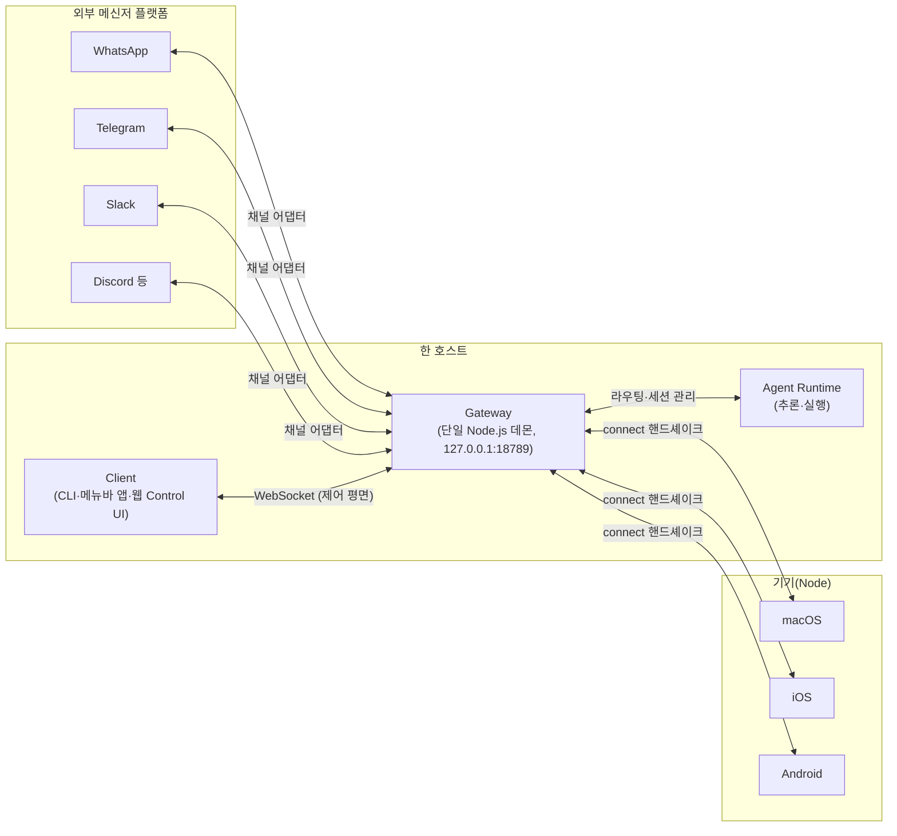
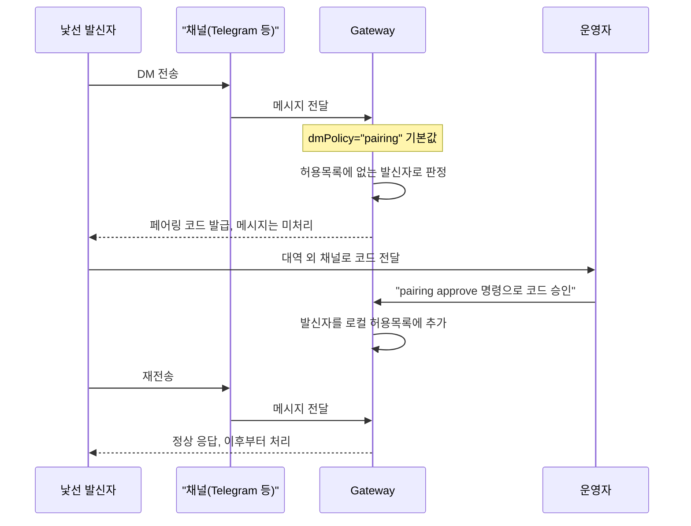

이 글은 [OpenClaw](https://github.com/openclaw/openclaw) 공식 README·아키텍처 문서·Skills/Nodes 문서, Cloudflare의 Moltworker 공식 저장소, Microsoft 보안 블로그를 근거로 OpenClaw의 아키텍처·확장 모델·보안 설계와 짧은 이름 변경 이력을 정리한 노트입니다.

> [!NOTE] 전제 지식
> [Node.js](https://nodejs.org/en) 기반 서버 프로세스(데몬)와 [WebSocket](https://datatracker.ietf.org/doc/html/rfc6455) 통신을 기본 개념으로 알고 있다고 가정합니다. 메신저 봇이나 개인 비서 도구를 처음 접한다면 아래 순서대로 읽으면 됩니다.

## OpenClaw는 무엇을 하는 도구인가

**한 줄 요지: OpenClaw는 한 사람이 자신의 기기에 직접 호스팅하는 개인 AI 비서이며, 하나의 비서 정체성을 여러 메신저·기기에서 동시에 접근하게 만드는 데 특화되어 있다.** 멀티에이전트 SaaS나 코딩 도구가 아니라, 명시적으로 단일 사용자·로컬 우선·기기 중심으로 설계됐습니다.

공식 README는 포지셔닝을 이렇게 명시합니다.

> "**OpenClaw** is a _personal AI assistant_ you run on your own devices. [...] The Gateway is just the control plane — the product is the assistant."

이어서 README는 macOS/iOS/Android에서 말하고 들을 수 있고 사용자가 제어하는 live Canvas를 렌더링할 수 있다고 설명합니다. 상단 태그라인("EXFOLIATE! EXFOLIATE!")은 프로젝트의 바닷가재 마스코트("Molty 🦞")가 껍질을 벗는(molt) 데서 온 말장난이며, 동시에 아래에서 다룰 프로젝트 자체의 개명 이력을 암시하는 이스터에그이기도 합니다.

공식 문서·README에 명시된 핵심 기능은 다음과 같습니다.

- **말하고 듣기** — macOS/iOS는 Voice Wake(웨이크워드 활성화), Android는 상시 음성 대화("Talk Mode")를 지원하며, [ElevenLabs](https://elevenlabs.io/docs/overview/intro)를 쓰고 시스템 TTS를 폴백으로 둔다.
- **Live Canvas** — **[A2UI](https://a2ui.org/)**라는 프로토콜로 렌더링되는 에이전트 주도 시각 워크스페이스. 에이전트가 실시간으로 UI·다이어그램·인터랙티브 위젯을 갱신하고, 사용자는 연결된 기기에서 상호작용한다.
- **어디서든 도달** — 20개 이상의 메신저 플랫폼(WhatsApp·Telegram·Slack·Discord 등, 전체 목록은 아래) 뒤에 하나의 비서 정체성을 세운다.
- **동반 앱** — Windows Hub 데스크톱 앱, macOS 메뉴바 앱, iOS/Android 앱이 카메라·캔버스·알림·센서 같은 기기 수준 능력을 에이전트에 노출하는 "Node" 역할을 한다.

웹사이트는 `openclaw.ai`, 문서는 `docs.openclaw.ai`, 주 코드 저장소는 `github.com/openclaw/openclaw`입니다.

---

## 아키텍처 — Gateway가 유일한 제어 평면이다

**한 줄 요지: Gateway라는 단일 상시 실행 데몬이 한 호스트의 모든 세션·채널·툴·이벤트를 관장하는 유일한 제어 평면이며, 여기에 연결하는 주체는 제어용 Client와 실제 기기인 Node로 나뉜다.**

### Gateway

아키텍처의 중심은 **Gateway**입니다. 공식 아키텍처 문서 기준으로 "유일하게 WhatsApp 세션을 여는 곳"이자 한 호스트의 모든 채널에 대해 "프로바이더 연결을 유지하는" 유일한 프로세스인 단일 Node.js 상시 데몬입니다. README의 "Highlights" 목록도 이를 첫머리에 둡니다.

> "**Local-first Gateway** — single control plane for sessions, channels, tools, and events."

`docs.openclaw.ai/concepts/architecture`와 GitHub의 `docs/concepts/architecture.md`에서 확인되는 Gateway의 핵심 사실은 다음과 같습니다.

- **기본적으로 loopback 주소에 바인딩**한다 — `127.0.0.1:18789`. 문서는 `gateway.bind: "loopback"`을 보안 모범 사례로 권장한다. Gateway를 네트워크에 직접 노출하지 말고 [Tailscale](https://tailscale.com/docs)/VPN이나 SSH 터널링을 쓰라는 것이다.
- 같은 포트(18789)가 WebSocket 제어 API와 Canvas용 HTTP 에셋 엔드포인트를 함께 서빙한다 — canvas 에셋은 `/__openclaw__/canvas/`, `/__openclaw__/a2ui/` 같은 경로로 노출된다.
- **호스트당 Gateway 하나.** WhatsApp·Telegram·Slack·Discord·Signal·iMessage·WebChat 등 해당 호스트의 모든 메시징 표면이 이 단일 프로세스로 멀티플렉싱된다. 의도된 제약이다 — WhatsApp의 하부 프로토콜(Baileys 라이브러리 경유)이 번호당 활성 세션 하나만 허용하므로, 하나의 Gateway로 중앙화해야 세션 충돌을 피한다.
- Gateway는 **타입이 있는 WebSocket API**를 노출한다 — 요청·응답·서버 푸시 이벤트가 [JSON Schema](https://json-schema.org/)로 검증된다. 프레임은 순수 JSON 텍스트(바이너리 아님)이며, 와이어 포맷은 프로토콜 버전 4로 문서화되어 있다: 호출은 `{type:"req"|"res"|"event", id, method, params}`, 서버 푸시 이벤트는 `{type:"event", event, payload, seq?, stateVersion?}`.
- Gateway가 발생시키는 이벤트 타입: `agent`, `chat`, `presence`, `health`, `heartbeat`, `cron`.
- **모든 연결의 첫 프레임은 반드시 `connect` 프레임**이어야 한다 — 문서는 "JSON이 아니거나 connect가 아닌 첫 프레임은 하드 클로즈"라고 명시한다. 이 connect 핸드셰이크가 기기 신원·요청 역할·능력을 실어 나르며, 페어링/허용목록 시스템의 진입점이 된다.

문서는 관심사 분리를 이렇게 못 박습니다.

> "The Gateway handles routing, connectivity, authentication, and session management. The Agent Runtime handles reasoning and execution. This separation of concerns is intentional and important."

### Client와 Node

**한 줄 요지: Client와 Node는 같은 WebSocket 피어이지만 `role` 필드로 구분된다.** 아키텍처 문서는 Gateway에 연결하는 WebSocket 피어를 두 종류로 나눕니다.

- **Client** — macOS 메뉴바 앱, CLI, 웹 Control UI, 자동화 스크립트 등 제어 평면 인터페이스. 설정된 바인드 호스트(기본 `127.0.0.1:18789`)로 WebSocket 연결한다.
- **Node** — macOS·iOS·Android·헤드리스 머신 등 물리 기기를 대표하는 연결. 접속할 때 `role: "node"`를 선언하고 지원하는 능력/명령의 명시적 목록을 함께 보내며, 페어링 승인 흐름에 쓰이는 기기 신원을 담는다.

Node는 전용 문서에서 이렇게 정의됩니다.

> "A **node** is a companion device (macOS/iOS/Android/headless) that connects to the Gateway **WebSocket**."

지금까지 나온 요소를 한 그림으로 그리면 아래와 같습니다 — Gateway가 유일한 허브이고, Channel(메신저)·Client(제어)·Node(기기)가 각자 다른 역할로 Gateway에 연결됩니다.



Node는 주변 장치이며 Gateway 자체를 구동하지 않습니다 — `node.invoke` 형태의 인터페이스로 에이전트가 호출할 수 있는 명령 표면을 노출할 뿐입니다. 문서화된 노드 명령 계열은 다음과 같습니다.

- **카메라**: `camera.list`, `camera.snap`(정지 사진), `camera.clip`(동영상)
- **캔버스/UI**: `canvas.present`, `canvas.snapshot`, `canvas.eval`, `canvas.a2ui.*`
- **기기 데이터**: `device.info`, `device.status`, `contacts.search`, `calendar.events`
- **시스템**: `system.notify`, `system.run`(명시적 승인 뒤에 게이트됨), `system.which`
- **플랫폼별**: Android의 SMS 명령, 모바일의 모션/위치 센서

노드에는 문서화된 운영 제약이 두 가지 있습니다.

1. 명령은 **두 개의 허용목록 게이트**를 통과해야 한다 — 노드 자신이 핸드셰이크 시점에 `connect.commands` 목록에 그 명령을 선언해야 하고, *동시에* Gateway 자체의 허용목록 설정도 그것을 허용해야 한다.
2. 캔버스·카메라 조작은 노드가 **포그라운드 상태**(실제로 화면에 표시·사용 중)여야 한다. 앱이 백그라운드로 내려간 상태에서 이런 명령을 호출하면 명시적 에러 코드 `NODE_BACKGROUND_UNAVAILABLE`가 반환된다.

Client와 Node 모두 기기 페어링은 승인 게이트를 거칩니다 — 신규 기기가 신원을 제시하면 Gateway가 페어링 요청을 만들고, 운영자가 이를 승인합니다(예: `openclaw devices approve <requestId>`). 대기 중인 페어링 요청은 승인되지 않으면 5분 뒤 만료됩니다. 승인되면 지속되는 기기 페어링 레코드가 재접속 시에도 그 기기가 할 수 있는 일을 결정합니다 — loopback(로컬호스트) 연결은 로컬 사용성 편의를 위해 자동 승인되도록 설정할 수 있지만, Tailnet/LAN 연결은 여전히 명시적 승인이 필요합니다.

### 멀티에이전트 라우팅과 세션

OpenClaw는 하나의 Gateway에서 둘 이상의 논리적 "에이전트"를 실행할 수 있으며, 각각 독립된 워크스페이스와 세션 상태를 갖습니다. README는 이를 1급 하이라이트로 나열합니다.

> "**Multi-agent routing** — route inbound channels/accounts/peers to isolated agents (workspaces + per-agent sessions)."

Gateway 설정 파일의 `agents.defaults`와 `agents.list[]` 아래에서 구성되며, 뒤에서 다룰 샌드박싱 모델의 후크 지점이기도 합니다 — 샌드박스 동작은 `agents.defaults.sandbox.mode`로 에이전트별 범위를 정합니다.

세션은 채팅·API로 노출된 전용 툴/명령으로 주소 지정·조회할 수 있습니다: `sessions_list`, `sessions_history`, `sessions_send`, (Skills 문서 기준) `sessions_spawn`. README에 문서화된 채팅 레벨 운영자 명령은 다음과 같습니다: `/status`, `/new`, `/reset`, `/compact`, `/think <level>`, `/verbose on|off`, `/trace on|off`, `/usage off|tokens|full`, `/restart`, `/activation mention|always`.

---

## 보안 모델 — DM 페어링과 샌드박싱

**한 줄 요지: 낯선 발신자의 DM은 기본적으로 페어링 코드로 차단하고, 운영자 자신의 세션만 호스트에 완전 접근을 허용하며 그 외 세션은 샌드박스로 격리한다.**

프로젝트의 핵심 전제 자체가 실제 메시징 표면(Telegram·WhatsApp·Discord DM 등)에 에이전트를 노출하는 것이므로, 문서는 **인바운드 DM을 신뢰할 수 없는 입력으로 취급해야 한다**고 명시합니다. README에서 직접 확인되는 기본 보안 태세는 다음과 같습니다.

> "Default behavior on Telegram/WhatsApp/Signal/iMessage/Microsoft Teams/Discord/Google Chat/Slack:
> - **DM pairing** (`dmPolicy="pairing"` / `channels.discord.dmPolicy="pairing"` / `channels.slack.dmPolicy="pairing"`; legacy: `channels.discord.dm.policy`, `channels.slack.dm.policy`): unknown senders receive a short pairing code and the bot does not process their message.
> - Approve with: `openclaw pairing approve <channel> <code>` (then the sender is added to a local allowlist store).
> - Public inbound DMs require an explicit opt-in: set `dmPolicy="open"` and include `"*"` in the channel allowlist (`allowFrom` / `channels.discord.allowFrom` / `channels.slack.allowFrom`; legacy: `channels.discord.dm.allowFrom`, `channels.slack.dm.allowFrom`)."

낯선 발신자가 처음 DM을 보냈을 때의 기본 흐름은 다음과 같습니다.



`openclaw doctor` 명령을 실행하면 위험하거나 잘못 설정된 DM 정책을 진단 단계에서 표면화해 보여줍니다.

기본적으로 주 세션("main"이라 불림)에서 호출된 툴은 **호스트에서 직접** 실행됩니다 — 운영자만 대화 상대일 때는 에이전트가 완전한 파일시스템/프로세스에 접근할 수 있다는 뜻입니다. 그룹 채팅이나 멀티유저 채널 컨텍스트에는 문서가 non-main 세션의 샌드박싱을 권장합니다.

> "Default: tools run on the host for the `main` session, so the agent has full access when it is just you.
> Group/channel safety: set `agents.defaults.sandbox.mode: "non-main"` to run non-`main` sessions inside sandboxes. [Docker](https://docs.docker.com/) is the default sandbox backend; SSH and OpenShell backends are also available.
> Typical sandbox default: allow `bash`, `process`, `read`, `write`, `edit`, `sessions_list`, `sessions_history`, `sessions_send`, `sessions_spawn`; deny `browser`, `canvas`, `nodes`, `cron`, `discord`, `gateway`."

의미 있는 설계 선택입니다 — 운영자 자신의 1:1 세션은 신뢰된 것(완전한 호스트 접근)으로 취급하되, 다른 사람이 도달 가능한 모든 것(Discord 서버, 그룹 채팅)은 기본적으로 격리가 필요하다고 취급합니다.

---

## 멀티채널 지원 — 채널 어댑터 패턴

**한 줄 요지: 23개 이상의 메신저 플랫폼을 채널 어댑터라는 동일한 패턴으로 통일해, 에이전트 런타임이 메시지가 어느 플랫폼에서 왔는지 전혀 신경 쓸 필요가 없게 만든다.**

### 전체 채널 목록

README는 지원 채널 목록을 두 곳(인트로 문단과 "Highlights" 절)에 똑같이 명시해 이를 정본 목록으로 확인해 줍니다.

> "Supported channels include: WhatsApp, Telegram, Slack, Discord, Google Chat, Signal, iMessage, IRC, Microsoft Teams, Matrix, Feishu, LINE, Mattermost, Nextcloud Talk, Nostr, Synology Chat, Tlon, Twitch, Zalo, Zalo Personal, WeChat, QQ, WebChat."

**23개의 명명된 채널**이며, 여기에 macOS/iOS/Android가 1급 기기 표면으로 별도 나열됩니다(Highlights 절의 "Multi-channel inbox" 항목: "...WebChat, macOS, iOS/Android"). 흔히 인용되는 "20개 이상 채널" 수치(일부 서드파티 취합에서는 "50개 이상 연동")는 macOS/iOS/Android 노드와 커뮤니티/플러그인으로 배포되는 채널(Matrix·Nostr·Twitch·Zalo는 다른 곳에서 "플러그인 채널"로 명시됨)을 이 목록에 함께 셀 경우 맞아떨어집니다.

### 어댑터 패턴의 구체적 동작

아키텍처적으로 지원되는 각 플랫폼은 Gateway와 외부 플랫폼 자체의 프로토콜/API 사이에 위치하는 **채널 어댑터**(채널 플러그인으로도 불림)로 구현됩니다. 아키텍처 문서와 공식 [Channel Plugin SDK 문서](https://docs.openclaw.ai/plugins/sdk-channel-plugins)를 근거로 보면 어댑터의 역할은 세 가지로 나뉩니다.

1. **인바운드 정규화** — 플랫폼 고유 페이로드(WhatsApp의 Baileys 프로토콜 프레임, grammY 경유 [Telegram Bot API](https://core.telegram.org/bots/api) 업데이트, [Slack Events API](https://docs.slack.dev/apis/events-api/) 페이로드 등)를 단일 통합 내부 메시지 형태(발신자·본문·첨부·채널 메타데이터)로 변환한다.
2. **아웃바운드 렌더링** — 에이전트의 응답을 대상 플랫폼이 지원하는 리치 메시지 포맷(버튼·카드·스레드·리액션)으로 변환한다.
3. **인증/세션 라이프사이클** — 웹훅 서명 검증, OAuth 토큰 갱신, 하부 프로바이더 연결의 헬스 유지. 특히 WhatsApp의 경우, Gateway가 호스트당 "유일하게 WhatsApp 세션을 여는 곳"으로 명시된다 — 하부 라이브러리가 번호당 살아있는 세션 하나만 허용하기 때문이다.

문서에 명시적으로 이름이 언급되는 1급 연동은 두 가지입니다.

- **[Baileys](https://github.com/WhiskeySockets/Baileys) 경유 WhatsApp**(비공식 WhatsApp Web API 라이브러리)
- **[grammY](https://grammy.dev/) 경유 Telegram**(Telegram Bot API 프레임워크)

**Channel Plugin SDK**는 서드파티/커뮤니티 채널 어댑터를 위해 이 패턴을 공식화합니다. 공식 SDK 문서에 따르면, 채널 플러그인은 `createChatChannelPlugin()`(`openclaw/plugin-sdk/channel-core`에서 임포트)으로 구축되며 다음을 제공해야 합니다.

- `config` 어댑터 — `listAccountIds()`, `resolveAccount(cfg, accountId?)`, 선택적으로 `inspectAccount(cfg, accountId?)`
- `message` 어댑터(`openclaw/plugin-sdk/channel-outbound`의 `defineChannelMessageAdapter` 경유) — `draftPreview`, `previewFinalization`, `progressUpdates`, `nativeStreaming`, `quietFinalization` 같은 능력을 선언하고 `MessageReceipt` 값을 반환
- `outbound` 어댑터 — 최소한 `sendText`(`{ messageId }` 반환), 선택적으로 `sendMedia`
- 선택적 `security`(DM 정책/허용목록 해석: `resolvePolicy`, `resolveAllowFrom`, `defaultPolicy: "allowlist" | "open"`), `pairing`(DM 승인 코드 전달), `threading`(`topLevelReplyToMode: "reply" | "quote" | "none"`) 어댑터

플러그인 등록은 `defineChannelPluginEntry({ id, name, description, plugin, registerCliMetadata?, registerFull? })`을 호출하는 `index.ts` 진입점, `extensions`·`setupEntry`·`channel: { id, label, blurb }`를 선언하는 `package.json`의 `"openclaw"` 키 아래 매니페스트, 그리고 채널 설정의 JSON Schema와 UI 힌트를 기술하는 `openclaw.plugin.json`으로 이뤄집니다.

이 패턴의 실질적 효과는 독립 기술 글들이 요약하듯, **에이전트 런타임이 메시지가 어느 플랫폼에서 왔는지 전혀 알 필요가 없다**는 것입니다 — Gateway가 이미 정규화된 메시지를 받아 올바른 세션/에이전트로 라우팅하고, 채널 어댑터가 응답을 나가는 길에 플랫폼 고유 문법으로 번역하는 일을 처리합니다. 덕분에 하나의 에이전트(하나의 메모리 집합, 하나의 성격, 하나의 스킬 세트)가 WhatsApp·Slack·웹사이트 위젯에서 동시에 도달 가능하면서도, 에이전트 자체의 로직이 플랫폼에 따라 분기하지 않습니다.

---

## 스킬 — 확장 메커니즘

**한 줄 요지: 스킬은 `SKILL.md` 파일 기반의 확장 단위이며, 6단계 디렉터리를 우선순위대로 탐색해 발견되고, 공개 레지스트리 ClawHub로 설치·검색한다.**

### 스킬이란 무엇인가

OpenClaw의 확장 메커니즘은 **스킬**이라 불리며, 에이전트에게 언제 어떻게 어떤 능력을 쓸지 가르치는 `SKILL.md` 파일(YAML frontmatter가 붙은 Markdown)을 담은 디렉터리입니다. `docs.openclaw.ai/tools/skills` 공식 문서 기준 frontmatter 필드는 다음과 같습니다.

**필수 frontmatter 필드:**
- `name` — 고유하고 소문자·하이픈으로 된 식별자. 로깅·충돌 해소·`openclaw` CLI에 쓰이며 슬래시 커맨드 이름이 되기도 한다.
- `description` — *모델을 위해* 작성된 한 줄 요약. 런타임이 이걸 읽고 스킬의 의도가 현재 요청과 맞는지 판단한다(사람을 위한 설명이 아니다).

**선택 frontmatter 필드:**
- `homepage` — macOS UI에 표시되는 URL
- `user-invocable`(boolean, 기본값 `true`) — 슬래시 커맨드로 노출할지 여부
- `disable-model-invocation`(boolean, 기본값 `false`) — 모델 주도 활성화 대상에서 제외
- `command-dispatch: "tool"` — 일반 모델 추론을 건너뛰고 슬래시 커맨드를 곧바로 툴로 라우팅
- `command-tool` — `command-dispatch: "tool"` 설정 시 라우팅할 툴 이름
- `command-arg-mode: "raw"`(기본값) — 가공되지 않은 인자를 `{ command, commandName, skillName }` 형태로 전달
- `metadata.openclaw` — 게이팅 규칙(아래), 이모지, OS 필터, 필요 바이너리/환경변수/설정 키, 설치 스펙, `primaryEnv` 지정을 담는 JSON5 블록

### 발견 순서·우선순위·게이팅

스킬은 고정된 루트 집합에 걸쳐 최대 **6단계 디렉터리 깊이**까지 탐색되며, 이름 충돌 시 우선순위는 다음 순서입니다(위쪽이 우선).

1. `<workspace>/skills/`(워크스페이스 로컬)
2. `<workspace>/.agents/skills/`(프로젝트 레벨 에이전트 스킬)
3. `~/.agents/skills/`(개인 에이전트 스킬)
4. `~/.openclaw/skills/`(관리형/로컬 스킬)
5. 번들 스킬(OpenClaw 자체와 함께 배포)
6. `skills.load.extraDirs/`와 플러그인으로 배포된 스킬(동일 우선순위 계층)

로드 우선순위와 별개로, **에이전트 허용목록**이 `agents.defaults.skills`와 `agents.list[].skills` 설정 배열로 특정 에이전트에게 *보이는* 스킬을 제한할 수 있습니다 — 비어있지 않은 에이전트별 목록은 기본값과 병합되는 게 아니라 **대체**합니다.

스킬은 `metadata.openclaw`로 로드 시점에 조건부 게이팅될 수 있습니다.

- `requires.bins` — 나열된 모든 바이너리가 `PATH`에 존재해야 함
- `requires.anyBins` — 나열된 것 중 최소 하나가 존재해야 함
- `requires.env` — 나열된 환경변수가 설정되어 있어야 함
- `requires.config` — 나열된 OpenClaw 설정 경로가 truthy로 해석되어야 함
- `os` — `darwin` / `linux` / `win32`로 제한
- `always` — 다른 게이트와 무관하게 강제 포함하는 boolean 오버라이드

### 컨텍스트 주입과 런타임 동작

에이전트 세션 시작 시, OpenClaw는 결정론적 파이프라인을 수행합니다.

1. 유효 스킬 목록을 결정한다(게이팅 규칙, 에이전트 허용목록, 설정 오버라이드 적용).
2. 적격 스킬 각각의 `skills.entries.<key>.env`와 `apiKey` 값을 **프로세스 환경**에 주입한다(문서화된 한계: 이건 호스트에서 실행되는 에이전트에만 도달한다 — 샌드박스된 실행은 이 주입된 환경을 받지 않는다).
3. 모든 적격 스킬을 컴팩트한 XML 블록으로 컴파일해 시스템 프롬프트에 주입한다.
4. 실행이 끝나면 원래 환경을 복원한다.

적격 스킬 스냅샷은 세션 시작 시 고정되어 여러 턴에 걸쳐 유지되지만, 두 경우에는 세션 도중 갱신될 수 있습니다 — 스킬 파일 워처가 `SKILL.md` 변경을 감지했을 때, 또는 신규 원격 노드가 연결됐을 때(예: macOS 노드가 Linux 호스팅 Gateway에 합류). 워칭은 `skills.load.watch`(기본값 `true`)와 `skills.load.watchDebounceMs`(기본값 `250`)로 제어됩니다.

### ClawHub — 공개 스킬 레지스트리

**ClawHub**(`clawhub.ai`, 소스는 `github.com/openclaw/clawhub`)는 OpenClaw의 공식 공개 스킬+플러그인 레지스트리이며, README에서 "Skill + Plugin Registry for OpenClaw"로 소개됩니다. 독립 기술 글들(DEV Community, DigitalOcean)은 벡터 검색을 써서 자연어 쿼리(예: "email automation")가 정확한 패키지명 매칭보다 더 관련성 높은 스킬을 노출하게 해준다고 설명하며, 별·다운로드 수 같은 사용 신호를 추적한다고 서술합니다.

스킬 관리를 위해 문서화된 핵심 CLI 명령은 다음과 같습니다.

| 동작 | 명령 |
|---|---|
| ClawHub에서 설치 | `openclaw skills install @owner/<slug>` |
| Git ref에서 설치 | `openclaw skills install git:owner/repo@ref` |
| 로컬 경로 설치 | `openclaw skills install ./path/to/skill --as my-tool` |
| 전역/관리형 디렉터리에 설치 | 모든 install 명령에 `--global` 추가 |
| 워크스페이스 스킬 전체 업데이트 | `openclaw skills update --all` |
| 스킬의 신뢰 봉투 검증 | `openclaw skills verify @owner/<slug>` |
| 대기 중인 "Skill Workshop" 제안 목록 | `openclaw skills workshop list` |
| 제안 적용 | `openclaw skills workshop apply <proposal-id>` |

눈여겨볼 자기 확장 기능이 **"Skill Workshop"**입니다 — 에이전트가 스스로 재사용 가능한 작업을 반복하고 있다고 판단하면, `SKILL.md`에 곧바로 쓰는 대신 새 스킬 또는 갱신된 스킬의 *제안(proposal)*을 작성합니다. 운영자가 검토하고 명시적으로 승인해야만 실제로 디스크에 반영됩니다. 에이전트 자신의 자기 확장에 적용되는, 사람이 개입하는 코드 리뷰 게이트와 닮은 구조입니다.

> [!WARNING] 검증되지 않은 정밀 규모 주장
> 서드파티 가이드(DEV Community, `dev.to`)는 ClawHub가 "1만 3천 개 이상의 커뮤니티 제작 스킬"을 호스팅한다고 서술합니다. 이 수치는 ClawHub 자체 레지스트리 페이지 대비 독립적으로 확인되지 않았으므로, 공식 수치가 아니라 근사적이고 시점에 민감한 서드파티 주장으로 취급해야 합니다.

### 외부 모델 연동

OpenClaw는 설계상 모델에 구애받지 않습니다. README는 "여러 프로바이더와 모델"을 지원한다고 명시하고, 서드파티 커버리지에서는 Anthropic·OpenAI·Google·DeepSeek을 구체적으로 언급하며, "신뢰하고 이미 쓰고 있는 프로바이더의 현재 플래그십 모델을 선호하라"고 권고합니다. 모델 설정과 CLI 플래그는 `docs.openclaw.ai/concepts/models`에, 자동 프로필 로테이션/폴백은 별도로 `docs.openclaw.ai/concepts/model-failover`에 문서화되어 있습니다. OAuth 기반 구독 결제는 최소 하나의 프로바이더에 대해 지원됩니다 — README는 "Subscriptions (OAuth)" 절 아래 "OpenAI (ChatGPT/Codex)"를 나열하며, OpenAI·GitHub·NVIDIA·Vercel·Blacksmith·Convex의 스폰서 로고도 함께 싣습니다.

---

## 이름 변경 이력 — Clawdbot에서 OpenClaw까지

**한 줄 요지: 프로젝트는 2025년 11월부터 5개월 안에 다섯 차례 이름을 바꿨는데, 결정적 계기는 Anthropic이 "Clawd(e)"라는 이름이 Claude와 지나치게 유사하다며 상표권 우려를 제기한 것이었다.** GitHub 저장소, Wikipedia, 독립 언론 보도(Yahoo News/SG, The Hans India, Cloudflare 자체 블로그)에 걸쳐 교차 검증된, 프로젝트의 짧은 역사에서 이례적인 사건입니다.

### 이름의 변천

| 대략적 시점 | 이름 | 비고 |
|---|---|---|
| 2025-11-24 | *Warelay* | Wikipedia가 인용한 타임라인 기준 가장 이른 문서화된 이름 |
| 2025-12-03 | *CLAWDIS* | 중간 개명 |
| 2026-01-02 | *Clawdbot* | 창작자 Peter Steinberger의 이전 개인 AI 비서 프로젝트 "Clawd"에서 이름을 물려받음. "Clawd" 자체가 Anthropic의 모델군 "Claude"에 대한 바닷가재 테마의 말장난이었다. |
| 2026-01-27 | *Moltbot* | Anthropic에 대한 직접적 대응으로 나온 임시 개명 |
| 2026-01-29~30 | **OpenClaw** | 최종, 자발적 개명. 현재 사용 중인 이름 |

### 왜 바뀌었나 — Anthropic의 상표권 문제 제기

여러 독립 소스가 같은 서술로 수렴합니다 — Anthropic이 창작자 **Peter Steinberger**(오스트리아 개발자로 소개됨)에게 언론 보도가 "정중하지만" 확고하다고 표현하는 상표권 우려 요청을 전달했습니다. "Clawdbot"이 "Claude"와 음성적으로 지나치게 가깝다고 판단됐고, 하부 비서/마스코트 자체가 "Clawd"라는 Claude에 대한 직접적 말장난이었다는 점이 더해졌습니다. 여러 매체(Yahoo News Singapore, The Hans India, TrendingTopics.eu)에 걸쳐 인용된 Steinberger 본인의 공개 발언은 이 개명이 "내 결정이 아니었다"는 것, 그리고 Anthropic의 접근을 공격적이라기보다 절제된 것으로 평가하면서도 사실상 Anthropic이 개명을 "강제"했다는 것이었습니다.

임시 이름 **Moltbot**(2026-01-27)으로의 개명은 갑각류 테마를 유지하면서 "Clawd(e)"로부터 거리를 두려고 일부러 고른 것입니다 — 바닷가재가 "탈피(molt)"하며 성장을 위해 껍질을 벗는다는 모티프이며, README의 짓궂은 "EXFOLIATE! EXFOLIATE!" 배너 문구의 근원이기도 합니다.

다만 Moltbot은 Steinberger와 프로젝트 자신이 **과도기적** 이름으로 분명히 프레이밍했을 뿐 영구적인 이름은 아니었습니다 — 그 시기 언론 보도(예: Substack의 한 논평가가 널리 퍼뜨린 기록)는 초기 실행이 혼란스러웠다고 서술합니다. GitHub 조직 개명이 잠깐 링크를 깨뜨렸고, 프로젝트의 X/Twitter 핸들은 혼란을 노린 암호화폐 사기꾼들에게 즉시 스쿼팅당했습니다 — 그 시점에 프로젝트는 이미 수만 개의 GitHub 스타를 보유하고 있었는데도 그랬습니다.

이틀에서 사흘 뒤(2026-01-29~30), 프로젝트는 현재 이름 **OpenClaw**로 정착했습니다. Wikipedia의 종합에 따르면, Steinberger는 "Moltbot"이 어색하다고 느꼈다고 합니다 — "입에 붙지 않았다"는 것입니다. 그는 앞으로 두 가지를 강조하는 이름을 원했습니다 — (1) 프로젝트의 오픈소스 성격, (2) 도구 자체가 명시적으로 멀티모델임을 감안해 특정 AI 벤더(Anthropic·OpenAI 등)에 브랜드를 묶지 않으면서도 claw/lobster 모티프와의 연속성.

> [!WARNING] 이른 시기 이름의 정밀도 미검증
> *Warelay*와 *CLAWDIS*라는 이름(2025년 11~12월)은 Wikipedia가 인용한 타임라인에서만 나온 것으로, 이번 조사 과정에서 1차 GitHub changelog나 Steinberger의 블로그 글로 독립적으로 교차 검증되지 않았습니다. Clawdbot(2026년 1월) → Moltbot(2026-01-27) → OpenClaw(2026-01-29~30)로 이어지는 구간은 여러 독립 언론 소스가 일치하는 잘 뒷받침된 핵심으로, Clawdbot 이전 이름들은 그럴듯하지만 신뢰도가 낮은 것으로 취급해야 합니다.

### 이 사건이 아키텍처적으로 의미 있는 이유

작명 일화를 넘어, 이 사건은 프로젝트 거버넌스 모델에 대해 뭔가를 보여준다는 점에서 눈길을 끕니다 — 모든 개명은 **표면적**이었습니다. 하부 코드베이스, Gateway 아키텍처, 채널 어댑터 설계는 세 이름에 걸쳐 연속적이었습니다. Cloudflare의 Moltworker 관련 자체 블로그 글은 두 번째와 세 번째 개명 사이 시점에 게시됐는데, 개명이 진행 중이던 것을 인정하는 실시간 편집 노트를 담고 있습니다("As of January 30, 2026, Moltbot was renamed to OpenClaw") — 이 프로젝트 초기 역사가 얼마나 빠르게 움직이고 커뮤니티 주도적이었는지를 보여주는 작은 증거이기도 합니다.

---

## 생태계 — GitHub 조직과 파생 프로젝트

**한 줄 요지: OpenClaw는 79개 저장소를 거느린 GitHub 조직으로 성장했고, Cloudflare가 자체 Sandbox 컨테이너 위에서 이를 구동하는 실험적 PoC(Moltworker)를 공개했다.**

### `openclaw` GitHub 조직

프로젝트는 `github.com/openclaw` 아래 조직화되어 있으며, 조직의 저장소 목록 페이지 기준 이번 조사 시점 **79개 저장소**를 호스팅합니다. 대표 저장소 `openclaw/openclaw` 모노레포 외에 눈여겨볼 저장소는 다음과 같습니다.

| 저장소 | 설명(목록 기준) | 언어 | 대략적 스타 수(스냅샷) |
|---|---|---|---|
| `openclaw/openclaw` | "Your own personal AI assistant. Any OS. Any Platform. The lobster way. 🦞" | TypeScript | ~38.1만 |
| `openclaw/clawhub` | "Skill + Plugin Registry for OpenClaw" | TypeScript | ~9,100 |
| `openclaw/gogcli` | "Google Workspace in your terminal" | Go | ~8,100 |
| `openclaw/Peekaboo` | AI 에이전트 스크린샷용 macOS CLI | Swift | ~4,800 |
| `openclaw/mcporter` | "Call MCPs via TypeScript, masquerading as simple TypeScript API" | TypeScript | ~4,800 |
| `openclaw/acpx` | "Headless CLI client for stateful Agent Client Protocol (ACP) sessions" | TypeScript | ~2,900 |
| `openclaw/crabbox` | "warm a box, sync the diff, run the suite" | Go | ~1,000 |
| `openclaw/agent-skills` | "Useful skills for agents and claws" | Python | ~861 |
| `openclaw/crabpot` | "Compatibility testbed for OpenClaw community plugins" | JavaScript | ~16 |
| `openclaw/clawsweeper-state` | (상태 추적 유틸리티) | JavaScript | ~15 |
| `openclaw/nix-openclaw` | OpenClaw용 Nix 패키징(메인 README에서 직접 링크됨) | — | — |

> [!WARNING] 스타 수는 특정 시점 스냅샷일 뿐이다
> 위의 모든 스타/포크 수치("38만 2천 스타"·"24만 7천 스타" 등 다른 곳에서 보도된 수치 포함)는 정확한 조회 시점에 따라 크게 달라지는 변동성 스냅샷입니다 — Wikipedia 자체 인용 수치(2026년 3월 2일 기준 약 24.7만 스타, 약 4.77만 포크)와 이 문서를 위해 GitHub에서 가져온 스냅샷(약 38.1만~38.2만)은 10만 이상 차이가 나는데, 어느 한쪽의 측정 오류라기보다 몇 주에 걸친 진짜 폭발적 성장에 부합하는 격차입니다. 이 문서의 어떤 특정 스타 수치든 "안정적 사실"이 아니라 "인용 시점 기준 자릿수 규모"로 취급해야 합니다.

### Moltworker — Cloudflare Workers 위의 OpenClaw

**Moltworker**(`github.com/cloudflare/moltworker`)는 전용 자체 관리 하드웨어 대신 **[Cloudflare Sandbox](https://developers.cloudflare.com/sandbox/)** 컨테이너 안에서 OpenClaw를 구동하도록 패키징한 Cloudflare 공식 관리 PoC입니다. 저장소 raw README에서 직접 확인되는 내용은 다음과 같습니다.

> "Run OpenClaw (formerly Moltbot, formerly Clawdbot) personal AI assistant in a Cloudflare Sandbox... **Experimental:** [...] It is not officially supported and may break without notice. Use at your own risk."

저장소에서 직접 확인된 주요 기술/비용 사실은 다음과 같습니다.

- **요구사항**: Cloudflare Workers **Paid 플랜**(Sandbox 컨테이너에 필요, 월 $5) 및 Anthropic API 키(또는 Cloudflare AI Gateway의 Unified Billing을 대안으로)
- **컨테이너 스펙**: Cloudflare Container 인스턴스 `standard-1` — 1/2 vCPU, 4GiB 메모리, 8GB 디스크
- **예상 비용**: 24시간 상시 실행 시 대략 **월 약 $34.50**(메모리 약 $26, CPU 약 $2, 디스크 약 $1.50, 여기에 Workers Paid 플랜 요금 $5). `SANDBOX_SLEEP_AFTER`(예: `10m`)를 설정해 유휴 시 컨테이너를 sleep시키면 가볍게 쓰는 개인 인스턴스 기준 컴퓨트 비용을 월 약 $5~6로 줄일 수 있다는 가이드도 함께 제공된다.
- **활용되는 선택적 Cloudflare 기능**: Cloudflare Access(인증), Browser Rendering(에이전트용 헤드리스 브라우저 자동화), AI Gateway(LLM 요청 라우팅/분석/과금), R2(컨테이너 재시작 간 지속성을 위한 선택적 영속화)
- **설정 흐름**: `npx wrangler secret put ANTHROPIC_API_KEY`, `openssl rand -hex 32`로 `MOLTBOT_GATEWAY_TOKEN`을 생성해 Wrangler 시크릿으로 저장한 뒤 `npm run deploy`. 원클릭 "Deploy to Cloudflare" 버튼도 제공된다.

> [!WARNING] 2차 소스에서 발견된 과장 정정
> Cloudflare 자체 블로그 글을 WebFetch로 요약한 한 2차 소스는 Moltworker 아키텍처가 에이전트 메모리에 **Durable Objects**와 **Workers KV**를 명시적으로 사용한다고 주장했습니다. 요약 계층을 우회해 `raw.githubusercontent.com`으로 직접 가져온 **원본 `moltworker` 저장소 README**를 교차 확인한 결과 Durable Objects나 Workers KV에 대한 언급이 **전혀 없었습니다** — 확인된 영속화 메커니즘은 **R2**(오브젝트 스토리지)뿐이며, 컨테이너 재시작을 넘어 살아남는 상태를 위해 선택적으로 쓰입니다.

Cloudflare 자체 엔지니어링 블로그 글(`blog.cloudflare.com/moltworker-self-hosted-ai-agent/`)은 이 프로젝트의 동기를 풀뿌리 채택 물결에 올라타는 것으로 프레이밍합니다 — "The Internet woke up this week to a flood of people buying Mac minis to run Moltbot"라며, 같은 워크로드가 전용 상시 가동 하드웨어 대신 자사 Developer Platform에서도 돌아갈 수 있음을 보여주려고 Moltworker를 만들었다고 명시하고, "a proof of concept, not a Cloudflare product"라고 명확히 못 박습니다.

### 공식 조직 밖의 커뮤니티 생태계

`openclaw` 조직 자체와 별개로, 그 주위에 눈에 띄는 2차 커뮤니티 생태계가 성장했습니다(GitHub 저장소 목록으로만 확인, 깊이 감사되지는 않음).

- `SamurAIGPT/awesome-openclaw` — 큐레이션 리소스 목록. 자체 태그라인에서 OpenClaw를 "open-source self-hosted AI agent for WhatsApp, Telegram, Discord & 50+ integrations"로 설명
- `mergisi/awesome-openclaw-agents` — "162 production-ready AI agent templates for OpenClaw", 19개 카테고리에 걸친 `SOUL.md` 설정 파일로 구성
- `Gen-Verse/OpenClaw-RL` — "Train any agent simply by talking"으로 소개되는 강화학습 훈련 하네스, 코어 프로젝트와는 별개
- 다수의 SEO/상업성 "호스팅 가이드" 사이트(OneClaw, ClawTrust, CrewClaw, OpenClawWay 등)가 관리형 호스팅·튜토리얼·"시스템 요구사항" 가이드를 제공하며 생겨났다 — 이들은 서드파티 상업 콘텐츠로, 이 원 raw 소스는 이를 권위 있는 것으로 취급하지 않았다.

---

## 라이선스·설치·배포

**한 줄 요지: OpenClaw는 MIT 라이선스로 배포되며, npm/pnpm/bun 전역 설치와 온보딩 마법사가 권장 설치 경로이고, macOS·Linux·Windows를 1급으로 지원한다.**

### 라이선스

OpenClaw는 **[MIT 라이선스](https://opensource.org/license/mit)**로 배포됩니다. `raw.githubusercontent.com/openclaw/openclaw/main/LICENSE`에서 직접 확인된 내용은 다음과 같습니다.

```
MIT License

Copyright (c) 2026 OpenClaw Foundation

Permission is hereby granted, free of charge, to any person obtaining a copy
of this software and associated documentation files (the "Software"), to deal
in the Software without restriction, including without limitation the rights
to use, copy, modify, merge, publish, distribute, sublicense, and/or sell
copies of the Software, and to permit persons to whom the Software is
furnished to do so, subject to the following conditions:

The above copyright notice and this permission notice shall be included in all
copies or substantial portions of the Software.

THE SOFTWARE IS PROVIDED "AS IS", WITHOUT WARRANTY OF ANY KIND, EXPRESS OR
IMPLIED, INCLUDING BUT NOT LIMITED TO THE WARRANTIES OF MERCHANTABILITY,
FITNESS FOR A PARTICULAR PURPOSE AND NONINFRINGEMENT. IN NO EVENT SHALL THE
AUTHORS OR COPYRIGHT HOLDERS BE LIABLE FOR ANY CLAIM, DAMAGES OR OTHER
LIABILITY, WHETHER IN AN ACTION OF CONTRACT, TORT OR OTHERWISE, ARISING FROM,
OUT OF OR IN CONNECTION WITH THE SOFTWARE OR THE USE OR OTHER DEALINGS IN THE
SOFTWARE.

Third-party notices for incorporated or adapted code are recorded in
THIRD_PARTY_NOTICES.md.
```

저작권자는 개인이 아니라 "**OpenClaw Foundation**"으로 명시되어 있으며, 프로젝트가 창작자 Peter Steinberger 개인과는 구분되는 어떤 형태의 재단/비영리 거버넌스 구조 아래 놓였음을 시사합니다 — 79개 조직 저장소와 수십만 스타라는 규모를 감안하면 단일 메인테이너 모델을 벗어난 것과 일치합니다. 번들/통합된 서드파티 코드는 LICENSE 파일과 README 양쪽에서 참조하는 `THIRD_PARTY_NOTICES.md`에 별도로 추적됩니다.

### 런타임 요구사항

README와 `docs.openclaw.ai/install` 페이지에서 직접 확인된 내용은 다음과 같습니다.

- **Node.js**: README가 명시하는 기준선은 "Node 24(권장) 또는 Node 22.19+"이며, 설치 문서는 좀 더 세분화된 버전 매트릭스를 제공한다 — **Node 22.19+, 23.11+, 또는 24+**. Node 24가 "설치·CI·릴리스 워크플로의 기본이자 권장 런타임"으로 지목되고, Node 22는 "활성 LTS 라인을 통해 계속 지원"된다.
- **OS 지원**: macOS·Linux·Windows 모두 1급 지원 — README는 메인 온보딩 명령이 "**macOS, Linux, Windows에서 동작**"한다고 명시한다. Windows 사용자는 추가로 설정, 트레이 상태, 채팅, 노드 모드, 로컬 MCP 모드용 네이티브 **Windows Hub** 동반 앱으로 안내받는다.
- **패키지 매니저**: [npm](https://docs.npmjs.com/), [pnpm](https://pnpm.io/), [bun](https://bun.com/docs)으로 동작한다. 소스에서 빌드하는 경우(모노레포 워크스페이스 툴링)에는 `pnpm`이 추가로 필요하다.
- **LLM 프로바이더 API 키**가 필요하다(Anthropic·OpenAI·Google 등 — "많은 프로바이더와 모델이 지원됨")

### 설치 방법

다음은 모두 공식 README와 설치 문서에서 직접 확인된 내용입니다.

**권장(npm/pnpm 전역 설치 + 온보딩 마법사):**
```bash
npm install -g openclaw@latest
# or: pnpm add -g openclaw@latest

openclaw onboard --install-daemon
```

`openclaw onboard --install-daemon`은 대화형 온보딩 마법사(인증, 워크스페이스, 채널 페어링, 스킬)를 실행하는 **동시에** Gateway를 감독되는 백그라운드 서비스로 설치합니다 — macOS에서는 [`launchd`](https://developer.apple.com/documentation/xpc/launchd) LaunchAgent(레이블 `ai.openclaw.gateway`), Linux에서는 [`systemd`](https://www.freedesktop.org/software/systemd/man/latest/systemd.unit.html) 사용자 유닛(`openclaw-gateway[-<profile>].service`)으로 설치되어 로그아웃/재부팅에도 프로세스가 살아남습니다. Linux에서는 시스템 레벨 유닛을 `/etc/systemd/system/` 아래 수동으로 설치할 수도 있습니다. Windows에서는 설치 프로그램이 `"OpenClaw Gateway"`라는 이름의 예약된 작업(Scheduled Task)을 만들며, Task Scheduler 접근이 불가능하면 Startup 폴더 런처로 폴백합니다.

**빠른 설치 셸 스크립트**(Node가 없으면 자동 감지·설치):
```bash
# macOS / Linux / WSL2
curl -fsSL https://openclaw.ai/install.sh | bash

# Windows PowerShell
iwr -useb https://openclaw.ai/install.ps1 | iex
```

**bun:**
```bash
bun add -g openclaw@latest
openclaw onboard --install-daemon
```

**소스에서 빌드:**
```bash
git clone https://github.com/openclaw/openclaw.git
cd openclaw
pnpm install && pnpm build && pnpm ui:build
pnpm link --global
openclaw onboard --install-daemon
```

**포그라운드/디버그 모드**(데몬을 우회, 트러블슈팅에 유용):
```bash
openclaw gateway stop
openclaw gateway --port 18789 --verbose
```

**검증/진단:**
```bash
openclaw --version
openclaw doctor
openclaw gateway status
```

**테스트 메시지 전송/비서와 직접 대화하기**(README 예시):
```bash
openclaw message send --target +1234567890 --message "Hello from OpenClaw"
openclaw agent --message "Ship checklist" --thinking high
```

**컨테이너화/대안 배포 대상**: README와 문서 전반에 걸쳐 참조되는 Docker, Podman(루트리스 대안), Nix(`github.com/openclaw/nix-openclaw`), 그리고 커뮤니티/Cloudflare가 관리하는 Moltworker 프로젝트를 통한 Cloudflare Workers/Sandbox(완전 관리형, 비자기호스팅 대안).

> [!WARNING] 검증되지 않은 구체적 하드웨어 사이징 수치
> 검색 과정에서 다수의 서드파티 "시스템 요구사항" 글(예: "2GB+ RAM 최소," "2 vCPU / 4GB RAM 권장," "SATA SSD 최소, NVMe 이상적")이 발견됐지만, 이들은 `docs.openclaw.ai` 자체가 아니라 상업적 VPS 호스팅 인접 콘텐츠 사이트에서 나온 것입니다. 이번 조사에서 가져온 공식 문서는 일반 하드웨어에서 Gateway를 자기 호스팅하는 데 필요한 명시적 RAM/CPU/디스크 최소값을 서술하지 않았습니다(위 Moltworker의 Cloudflare Container 스펙은 공식 문서화되어 있는 것과 구별됩니다). 이 서드파티 하드웨어 수치는 검증되지 않은 것으로 취급해 이 문서에서 제외합니다.

### 원격 접근 모델

Gateway가 기본적으로 loopback에 바인딩되므로, 이를 원격에서 접근하기 위해 문서화·보안적으로 승인된 경로는 **Tailscale/VPN**(우선)과 **SSH 터널링**(터널을 통해서도 동일한 핸드셰이크/인증이 적용됨)입니다. 직접적인 공개 노출은 승인된 경로에 포함되지 않습니다. 전용 "Gateway 노출 런북"(`docs.openclaw.ai/gateway/security/exposure-runbook`)이 README의 보안 절에서 "원격 노출 전에" 필독 문서로 명시적으로 링크되어 있습니다.

---

## 카테고리 구분 — OpenClaw는 Claude Code·cladding과 다른 범주다

**한 줄 요지: Claude Code나 cladding 같은 도구는 코드베이스를 대상으로 변경의 완료를 게이트·drift 탐지로 검증하는 "코딩 워크플로 거버넌스" 범주인 반면, OpenClaw는 코드베이스·스펙·PR 개념 자체가 없는 "개인 비서/메신저 통합 인프라" 범주다.** 셋 모두 "툴을 쓰는 LLM 에이전트"라는 공통점 때문에 종종 같은 부류로 잘못 묶이지만, 서로 다른 문제를 푸는 서로 다른 **범주**의 도구입니다.

### Claude Code/cladding이 속한 범주 — 코딩 워크플로 거버넌스

이 위키의 [[cladding]]·[[cladding-vs-sdd]] 기존 조사에 따르면, 이 범주의 도구는 **스펙에 앵커링된, 소프트웨어 엔지니어링 거버넌스용 에이전트 하네스**입니다 — AI 코딩 에이전트가 코드베이스를 어떻게 수정하는지를 제약·감사하려고 존재합니다. 예를 들어 cladding의 Iron Law 게이트 파이프라인(4단계 15스텝), spec↔code↔test 삼각형을 교차 검사하는 36개의 결정론적 drift 탐지기, anti-self-cert 불변식(변경을 작성한 페르소나가 그 변경의 완료를 인증하는 페르소나일 수 없다는 원칙)이 여기 속합니다. 조사 과정에서 확인된 "하네스 엔지니어링" 문헌(arXiv 2603.05344, 2605.01160)은 Claude Code 자체를 **소프트웨어 개발에 특화된** "모델이 프로젝트 컨텍스트·툴·제어 메커니즘에 연결되는 기술적·조직적·절차적 환경"으로 설명합니다 — 모델이 어떤 코드 컨텍스트를 보는지, 어떤 편집/실행 툴을 호출할 수 있는지, 변경이 어떻게 검증되는지(테스트·게이트), 어디서 사람의 승인이 필요한지를 결정합니다.

이 범주 전체를 관통하는 축은 **거버넌스 대상 아티팩트가 코드베이스**이고, **작업 단위가 변경**(PR·스펙 델타·피처)이라는 것입니다 — 이 변경은 "완료"로 인정되기 전에 어떤 근거 진실(테스트 통과, 스펙 정합성, drift 탐지)에 대해 검증되어야 합니다. 완료 판정은 **프로세스**(게이트·체크·2차 페르소나)가 내리며, 에이전트 자신의 말이 내리지 않습니다.

### OpenClaw가 속한 범주 — 개인 비서/메신저 통합 인프라

OpenClaw는 범주적으로 다른 문제를 풉니다 — **한 사람의 단일 AI 비서 정체성을 그가 쓰는 모든 메시징 표면에서 도달 가능하게 만들고, 그의 기기에서 말하고 듣게 하고, 스킬로 스스로를 확장하게 만드는 것**이며, "코드베이스"·"스펙"·"PR"·"변경 거버넌스"라는 개념이 사실상 내장되어 있지 않습니다. 그 복잡도의 주된 축은 다음과 같습니다.

- **채널 증식**(각기 다른 인증/웹훅/리치 메시지 특이성을 가진 23개 이상의 메시징 프로토콜) — 채널 어댑터 패턴(위 절)으로 풀리며, 코드 리뷰 게이트로 풀리지 않는다.
- **기기/세션 팬아웃**(하나의 비서가 폰·랩톱·스마트홈 인접 노드에서 도달 가능) — Gateway + Node 모델로 풀린다.
- **운영자와 외부 세계 사이의 신뢰 경계**(Discord에서 봇에게 DM할 수 있는 아무나는 기본적으로 낯선 사람이다) — DM 페어링/허용목록과 non-main 샌드박싱으로 풀리며, **코드 변경**을 둘러싼 품질/거버넌스 경계가 아니라 **신뢰할 수 없는 외부 발신자**를 둘러싼 보안 경계다.
- **스킬을 통한 자기 확장**은 Iron Law 게이트나 drift 탐지기 같은 등가물이 없다는 점에서 스펙 거버넌스 파이프라인보다는 플러그인/툴 사용 시스템(어떤 에이전트 프레임워크든 툴을 추가할 수 있게 해주는 것과 비슷)에 가깝다 — 가장 가까운 유사물인 "Skill Workshop" 제안-후-승인 흐름은, 에이전트가 스펙 아래의 **별도 코드베이스를 수정하는 것**에 대한 체크가 아니라, 에이전트가 **자기 자신을 확장하는 것**에 대한 가벼운 사람 개입 체크다.

독립적인 비교 글들(DataCamp, MindStudio, Verdent)도 이 조사 과정에서 확인된 것과 같은 프레이밍으로 수렴합니다 — Claude Code는 "터미널에 상주하며 코드베이스 전체를 이해하는, 코딩에 특화된 에이전트"로서 저장소를 읽고, 파일 간 의존성을 추적하고, 테스트 스위트를 실행하고, 다중 파일 리팩터를 처리하는 반면, "OpenClaw는 메시징 앱을 AI 모델에 연결하는 범용 라이프 비서"입니다. 한 비교 글은 이 트레이드오프를 이렇게 요약합니다 — OpenClaw는 "셸 명령을 실행하고, 파일을 편집하고, 스크립트를 돌릴 수 있으며, 적절한 스킬을 갖춘 에이전트는 기본적인 코딩 작업을 수행할 수 있지만, Claude Code가 제공하는 코드에 대한 깊은 의미론적 이해는 결여되어 있다." 반대로 Claude Code에는 WhatsApp 페어링 코드, Voice Wake, live Canvas 같은 개념이 전혀 없습니다.

### 이 구분이 이 위키에서 중요한 이유

올바르게 분류하면, OpenClaw와 cladding은 "경쟁하는 에이전트 툴"이 아니며, 서로 다른 사용자를 위해 서로 다른 문제를 푼다는 단서 없이 같은 비교 축(예: `wiki/comparisons/` 페이지)에 놓여서는 안 됩니다.

- **cladding/Claude Code 범주** = "나는 개발자이고, AI 에이전트가 내 코드베이스를 수정하기를 원하며, 그 변경이 완료로 불리기 전에 실제로 올바르다는 것을 증명하는 거버넌스 프로세스를 원한다."
- **OpenClaw 범주** = "나는 이미 대화하고 있는 모든 곳에서 도달 가능한, 음성과 시각 캔버스를 갖춘, 내가 통제하는 하드웨어에서 돌아가는 하나의 지속적 AI 비서 정체성을 원하는 개인이다."

이 두 범주가 정당하게 교차할 수 있는 유일한 지점은 어떤 OpenClaw 스킬이 코딩 에이전트 하네스를 감싸도록(예: OpenClaw 비서가 코딩 작업을 Claude Code나 cladding 거버넌스 파이프라인에 위임하고 결과를 Telegram으로 보고받는 스킬) 만들어진 경우입니다. 이 경우에도 OpenClaw는 코딩 하네스에 대한 **메시징 프론트엔드/디스패처** 역할에 한정되며, OpenClaw *자신*이 코딩 거버넌스 도구가 되는 것은 별개의 문제입니다. 이번 조사 시점 기준 그런 공식 1급 연동은 발견되지 않았으며, 직접 검증 없이 존재한다고 가정해서는 안 됩니다.

### 보안 측면에서도 범주가 갈린다

독립적으로 뒷받침되는 추가 데이터 포인트가 이 범주 구분을 강화합니다 — OpenClaw의 위협 모델은 대형 공개 스킬 마켓플레이스를 갖춘, 인터넷에 노출된 개인 비서 표면이라는 데 특화된 우려가 지배하며, 코드베이스 거버넌스에 특화된 우려는 지배하지 않습니다. Microsoft 자체 보안 블로그와 후속 보안 언론 보도(The Hacker News, Bitsight, Sangfor)에 따르면, 공개된 위험 카테고리에는 다음이 포함됩니다 — 피해자가 악성 웹페이지를 방문한 지 "밀리초" 만에 트리거 가능한 원클릭 RCE 취약점 체인(CVE-2026-25253, CVSS 8.8), 커맨드 인젝션 권고, 그리고 스킬 시스템(위 절)과 가장 밀접히 관련된 것으로 ClawHub를 통해 배포된, 전문적으로 보이는 문서와 무해한 이름을 내세운 수백 개의 악성 스킬(2차 소스에서 인용된 한 수치는 약 2,857개 스킬 레지스트리 중 약 12%가 어느 시점에 오염됐다고 밝혔습니다). Microsoft가 권고한 완화책은 OpenClaw를 완전히 격리된 환경(전용 VM 또는 별도의 물리 머신)에서 비특권·전용 자격증명과 지속적 모니터링으로만 실행하라는 것이었습니다. 이는 **사람의 메시징/기기 표면에 광범위하게 접근하는 비서**를 겨냥한 봉쇄 태세이며, **테스트 커버리지 아래 저장소를 수정하는 코딩 에이전트**를 겨냥한 것과는 대상이 다릅니다.

> [!WARNING] 검증되지 않은 정밀 CVE/취약점 개수
> 위 구체적 수치("138개 이상 공개된 CVE," "1차 정식 감사에서 발견된 총 512개 취약점," "2,857개 악성 스킬 중 341개" 등)는 단일 권위 있는 CVE 데이터베이스 조회가 아니라 2차 보안 업계 블로그 취합(thehackernews.com, sangfor.com, betterclaw.io)에서 나온 것입니다. 보안 위기 서사의 **존재** 자체와 **CVE-2026-25253/CVSS 8.8** 수치는 권위 있는 것으로 취급되는 Microsoft 자체 블로그 글로 뒷받침되지만, 더 광범위한 집계 수치는 방향성 있게 신뢰할 만하되 독립적으로 재검증된 개수는 아닌 것으로 취급해야 합니다.

---

## 용어 빠른 참조

<details markdown="1">
<summary>심화: 전체 용어 표</summary>

| 용어 | 의미 |
|---|---|
| **Gateway** | 한 호스트에서 세션·채널·툴·이벤트의 제어 평면인 단일 상시 실행 데몬(기본 `127.0.0.1:18789`) |
| **Client** | 제어 평면 WebSocket 피어(macOS 앱, CLI, 웹 Control UI, 자동화 스크립트) |
| **Node** | `role: "node"`를 선언하고 `node.invoke` 형태 명령으로 기기 능력(카메라·캔버스·센서)을 노출하는 동반 기기 WebSocket 피어(macOS/iOS/Android/헤드리스) |
| **Channel** | 채널 어댑터/플러그인 패턴으로 구현되는 메시징 플랫폼 연동(WhatsApp·Telegram·Slack 등) |
| **Skill** | 에이전트에게 언제/어떻게 능력을 쓸지 가르치는 `SKILL.md` 파일을 담은 디렉터리. 6단계 깊이의 우선순위 있는 디렉터리 집합에서 발견됨 |
| **ClawHub** | 스킬·플러그인을 게시/발견/설치하는 공식 공개 레지스트리(`clawhub.ai`) |
| **Canvas / A2UI** | 연결된 기기에서 렌더링되는 라이브 에이전트 주도 시각 워크스페이스 프로토콜 |
| **Voice Wake / Talk Mode** | 웨이크워드 음성 활성화(macOS/iOS) vs 상시 음성 대화(Android) |
| **Sandbox(`agents.defaults.sandbox.mode`)** | 에이전트/세션별 격리 설정. `"non-main"`은 주 세션을 제외한 모든 것을 제한적 툴 허용목록을 가진 Docker/SSH/OpenShell 샌드박스 안에서 실행 |
| **DM pairing** | 낯선 DM 발신자가 봇이 메시지를 처리하는 대신 일회성 페어링 코드를 받는 기본 정책. `openclaw pairing approve <channel> <code>`로 승인 |
| **Skill Workshop** | 에이전트가 `SKILL.md`를 직접 자기 수정하는 대신 운영자 검토용 새/갱신 스킬 제안을 작성하는 제안-후-승인 흐름 |
| **Moltworker** | 자기 호스팅 하드웨어 대신 Cloudflare Sandbox 컨테이너 안에서 OpenClaw를 구동하는 Cloudflare 공식 PoC |

</details>

---

## 참고 자료

- [OpenClaw — GitHub 저장소](https://github.com/openclaw/openclaw)
- [OpenClaw 공식 문서 — Architecture](https://docs.openclaw.ai/concepts/architecture)
- [OpenClaw 공식 문서 — 홈](https://docs.openclaw.ai/)
- [OpenClaw 공식 문서 — Skills](https://docs.openclaw.ai/tools/skills)
- [OpenClaw 공식 문서 — Nodes](https://docs.openclaw.ai/nodes)
- [OpenClaw 공식 문서 — Building channel plugins (SDK)](https://docs.openclaw.ai/plugins/sdk-channel-plugins)
- [openclaw/clawhub — GitHub 저장소](https://github.com/openclaw/clawhub)
- [cloudflare/moltworker — GitHub 저장소](https://github.com/cloudflare/moltworker)
- [Cloudflare Blog — Introducing Moltworker: a self-hosted personal AI agent, minus the minis](https://blog.cloudflare.com/moltworker-self-hosted-ai-agent/)
- [Microsoft Security Blog — Running OpenClaw safely: identity, isolation, and runtime risk](https://www.microsoft.com/en-us/security/blog/2026/02/19/running-openclaw-safely-identity-isolation-runtime-risk/)
- [OpenClaw — Wikipedia](https://en.wikipedia.org/wiki/OpenClaw)
- [Clawdbot creator says Anthropic 'forced' him to rename the viral AI agent — Yahoo News Singapore](https://sg.news.yahoo.com/clawdbot-creator-says-anthropic-forced-162839037.html)
- [From Zero to Skilled: A Practical Guide to OpenClaw's ClawHub Skill System — DEV Community](https://dev.to/divesh_kumar_b7937da30def/from-zero-to-skilled-a-practical-guide-to-openclaws-clawhub-skill-system-585o)
- [OpenClaw vs Claude Code: Which Should You Use? — claudefa.st](https://claudefa.st/blog/tools/extensions/openclaw-vs-claude-code)
- [Four OpenClaw Flaws Enable Data Theft, Privilege Escalation, and Persistence — The Hacker News](https://thehackernews.com/2026/05/four-openclaw-flaws-enable-data-theft.html)
