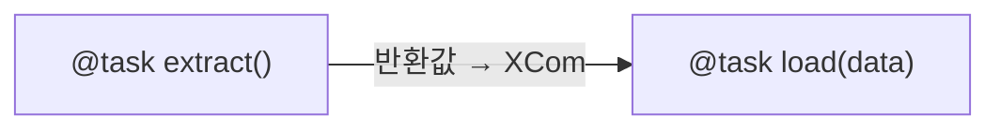
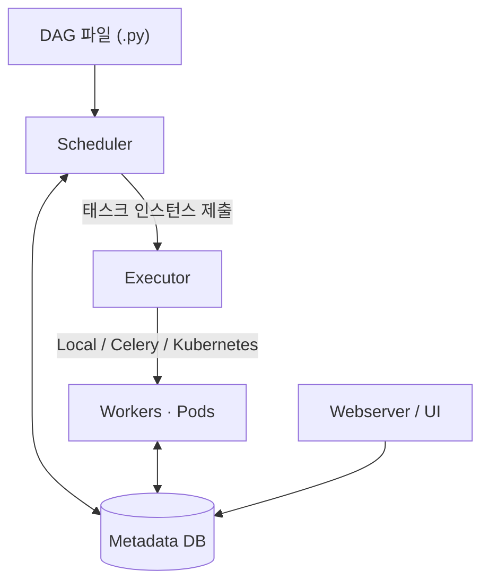

[Apache Airflow](https://airflow.apache.org/)는 워크플로우를 [Python](https://www.python.org/) 코드로 정의하고 스케줄·모니터링하는 오케스트레이션 플랫폼이다. 태스크 사이의 실행 순서(의존성)를 코드로 표현하고, 스케줄러가 그 순서대로 태스크를 돌린다. 데이터 파이프라인(ETL/ELT)·ML 파이프라인·배치 작업을 다룰 때 쓴다.

> [!NOTE] 버전 기준
> 이 글은 Apache Airflow 공식 문서를 정리한 노트이며, 2025년 4월 GA된 Airflow 3.x(현재 stable 3.2.x)를 기준으로 한다. 2.x와 3.0의 차이가 큰 지점은 본문에서 버전을 함께 표기한다.

## 한 줄 정의

- **Workflows as code** — GUI로 블록을 끌어다 놓는 방식이 아니라 파이프라인을 코드로 정의한다.
- Airbnb에서 2014년 시작(Maxime Beauchemin) → Apache 이관(2016) → Apache 톱레벨 프로젝트(2019).
- cron의 대체가 아니라 확장이다. cron이 주지 못하는 태스크 **의존성**·**재시도**·**모니터링 UI**·**백필(과거 구간 재실행)** 을 제공한다.

## 핵심 개념

파이프라인의 뼈대는 DAG이고, 그 안의 작업 단위가 Task, Task를 찍어내는 틀이 Operator다.

- **[DAG (Directed Acyclic Graph)](https://airflow.apache.org/docs/apache-airflow/stable/core-concepts/dags.html)**: 태스크와 그 의존관계의 집합. 방향이 있고 순환이 없다. Python으로 정의하며 `schedule`(cron 문자열·`timedelta`·`@daily` 같은 프리셋)과 `start_date`를 지정한다.
- **Task**: 작업의 최소 단위. Operator의 인스턴스다.
- **[Operator](https://airflow.apache.org/docs/apache-airflow/stable/core-concepts/operators.html)**: 태스크 템플릿.
  - `BashOperator` — 셸 명령 실행
  - `PythonOperator` — Python 함수 실행
  - provider operator — 클라우드/서비스별 연동(예: [S3](https://aws.amazon.com/s3/), [BigQuery](https://cloud.google.com/bigquery/docs))
  - `Sensor` — 조건이 충족될 때까지 대기하는 특수 operator
- **XCom (cross-communication)**: 태스크 사이에 **소량** 데이터를 주고받는 메커니즘. 대용량 데이터 전달용은 아니다.

> [!WARNING] XCom은 대용량 전달용이 아니다
> XCom 값은 메타데이터 DB에 저장된다. 큰 데이터프레임·파일을 XCom으로 넘기면 DB가 비대해지고 성능이 떨어진다. 대용량은 S3·오브젝트 스토리지 같은 외부 저장소에 두고 XCom으로는 그 경로(키)만 넘긴다.

### TaskFlow API (Airflow 2.0+)

[`@task` 데코레이터](https://airflow.apache.org/docs/apache-airflow/stable/tutorial/taskflow.html)를 붙이면 Python 함수를 그대로 태스크로 쓸 수 있다. 함수의 반환값이 XCom으로 자동 전달돼 태스크 간 데이터 연결을 명시적으로 쓰지 않아도 된다.

```python
from airflow.decorators import task

@task
def extract():
    return {"count": 42}

@task
def load(data):
    print(data["count"])

load(extract())   # 반환값이 XCom으로 자동 전달
```

호출식 `load(extract())`이 곧 의존성 선언이다. `extract`가 먼저 끝나야 그 반환값이 `load`로 들어가므로, 두 태스크의 실행 순서가 코드의 함수 호출 구조에서 그대로 결정된다.



## 아키텍처

Airflow는 네 구성요소로 나뉜다. 스케줄러가 DAG를 읽어 태스크를 만들고, Executor가 그 태스크를 어디서 어떻게 돌릴지 결정하며, 상태는 메타데이터 DB에, 조회는 UI에서 한다.

- **[Scheduler](https://airflow.apache.org/docs/apache-airflow/stable/core-concepts/overview.html)**: DAG 파일을 파싱하고 의존성·스케줄에 맞춰 태스크 인스턴스를 만들어 Executor에 제출한다. Airflow의 중심 구성요소다.
- **[Executor](https://airflow.apache.org/docs/apache-airflow/stable/core-concepts/executor/index.html)**: 태스크를 **어디서, 어떻게** 실행할지 정한다.
  - `LocalExecutor` — 단일 머신의 프로세스
  - `CeleryExecutor` — [Celery](https://docs.celeryq.dev/) 워커 풀에 분산
  - `KubernetesExecutor` — [Kubernetes](https://kubernetes.io/) 태스크마다 Pod 하나
  - `EdgeExecutor` — 분산·엣지(Airflow 3.0+)
- **Webserver / UI**: DAG·실행 이력·로그를 조회하고 수동 트리거한다. Airflow 3부터 [React](https://react.dev/) + [FastAPI](https://fastapi.tiangolo.com/) 기반 새 UI다.
- **Metadata DB**: DAG/태스크 상태와 실행 이력을 저장한다([Postgres](https://www.postgresql.org/)·[MySQL](https://dev.mysql.com/doc/)).
- **Workers**: Celery·Kubernetes 구성일 때 실제 태스크를 실행한다.

구성요소 사이의 흐름은 다음과 같다. Scheduler가 파싱한 태스크를 Executor에 넘기고, Executor가 워커(또는 Pod)에서 실행하며, 모든 상태는 Metadata DB를 거치고 UI가 그 DB를 읽어 보여 준다.



## 스케줄링

`schedule` 인자로 언제 돌릴지 정한다. cron 표현식, `timedelta`, `@daily`·`@hourly` 같은 프리셋을 쓸 수 있고, 3.0+에서는 [Asset 기반](https://airflow.apache.org/docs/apache-airflow/stable/authoring-and-scheduling/asset-scheduling.html) 이벤트 트리거도 지원한다.

- **[catchup](https://airflow.apache.org/docs/apache-airflow/stable/core-concepts/dag-run.html)**: `start_date`부터 현재까지 아직 돌지 않은 구간을 자동으로 메운다. 기본 동작이므로 원치 않으면 `catchup=False`로 끈다.
- **backfill**: 과거 특정 구간을 의도적으로 다시 실행한다.

> [!WARNING] catchup 기본값 주의
> `start_date`를 과거로 잡고 `catchup`을 끄지 않으면, 배포 순간 밀린 구간의 DAG run이 한꺼번에 실행된다. 의도한 게 아니라면 `catchup=False`를 명시한다.

## Airflow 3.0 (2025-04 GA)

2025년 4월 [Airflow 3.0이 GA](https://airflow.apache.org/blog/airflow-three-point-oh-is-here/)로 나왔다(현재 stable 3.2.x). 역대 최대 규모 릴리스로, DAG 버저닝·태스크 실행 방식·이벤트 스케줄링·UI가 크게 바뀌었다. 세부 항목은 [공식 릴리스 노트](https://airflow.apache.org/docs/apache-airflow/stable/release_notes.html)에 정리돼 있다.

- **DAG Versioning (AIP-66)**: DAG 구조 변경을 메타DB에 이력으로 추적한다. UI/API에서 과거 버전을 조회할 수 있고, 안전한 백필의 토대가 된다.
- **Task Execution API + Task SDK (AIP-72)**: 태스크가 메타DB에 **직접 접근하지 않는다.** Task Execution Interface를 거쳐 실행되므로 원격·격리 실행, 멀티/하이브리드 클라우드, 보안 모델 강화가 가능하다. 언어 비종속(비-Python) 태스크 실행의 토대다.
- **Assets (구 Datasets, AIP-74/75)**: 데이터 인지(data-aware) 스케줄링 개념을 `Asset`으로 재정의했다. `@asset` 데코레이터로 이벤트 기반 DAG를 정의한다.
- **새 UI**: React + FastAPI로 전면 재작성했다.
- **Scheduler-managed Backfill (AIP-78)**: 백필을 일반 DAG run처럼 스케줄·추적하고 UI/API로 다룬다.
- **Edge Executor (AIP-69)**: 분산·이벤트 기반·엣지 컴퓨트 워크플로우가 GA로 정식 지원된다.
- **제거**: SubDAG 등 레거시 기능이 정리됐다.

## 다른 오케스트레이터와의 자리

Airflow는 스케줄 기반 배치 데이터 파이프라인에 강하고 방대한 provider 생태계를 갖췄다. 같은 오케스트레이션 영역이라도 도구마다 겨냥하는 지점이 다르다.

- **[Argo Workflows](https://argo-workflows.readthedocs.io/en/latest/)**: Kubernetes 네이티브 컨테이너 워크플로우.
- **[Temporal](https://docs.temporal.io/)**: 상태ful(stateful) 코드형 워크플로우, 내구 실행(durable execution).

## 참고 자료

- Apache Airflow, [공식 문서](https://airflow.apache.org/docs/apache-airflow/stable/) — Core Concepts(DAG·Operator·Executor)·TaskFlow API·Asset 스케줄링·DAG Run 등 세부 페이지 포함
- Apache Airflow, [Apache Airflow® 3 is Generally Available!](https://airflow.apache.org/blog/airflow-three-point-oh-is-here/)
- Apache Airflow, [Release Notes](https://airflow.apache.org/docs/apache-airflow/stable/release_notes.html)
- Celery, [Distributed Task Queue 문서](https://docs.celeryq.dev/)
- Argo Project, [Argo Workflows 문서](https://argo-workflows.readthedocs.io/en/latest/)
- Temporal, [Platform 문서](https://docs.temporal.io/)
