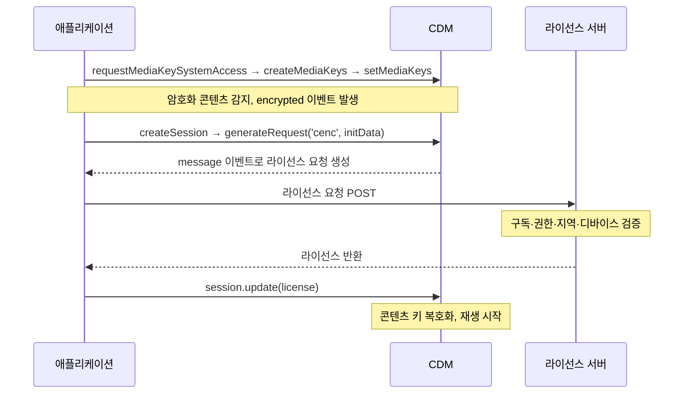
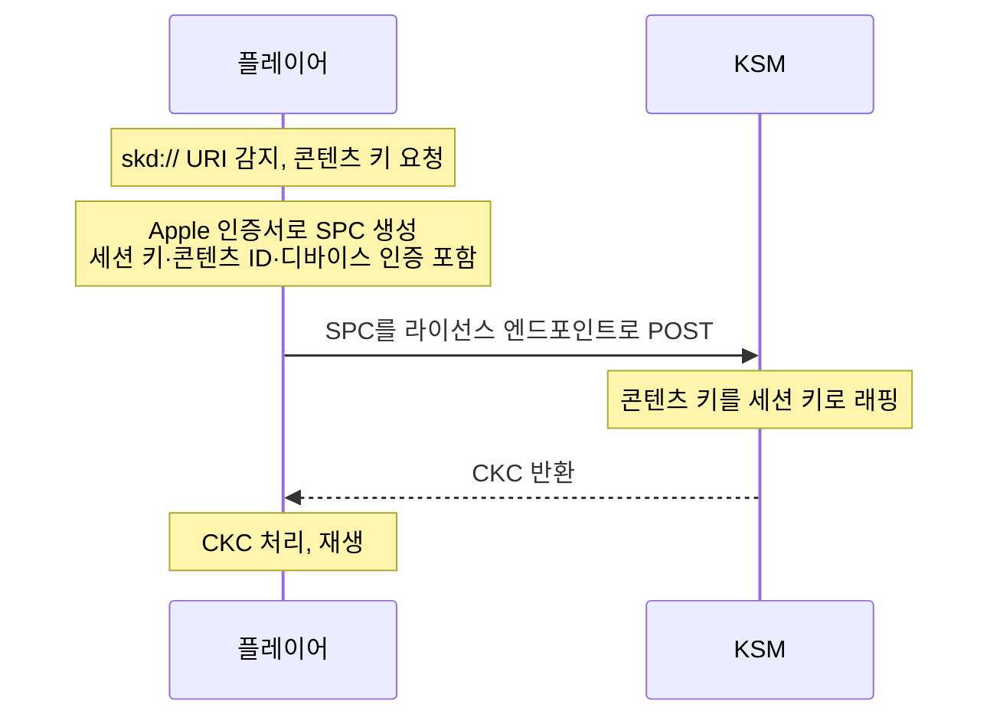
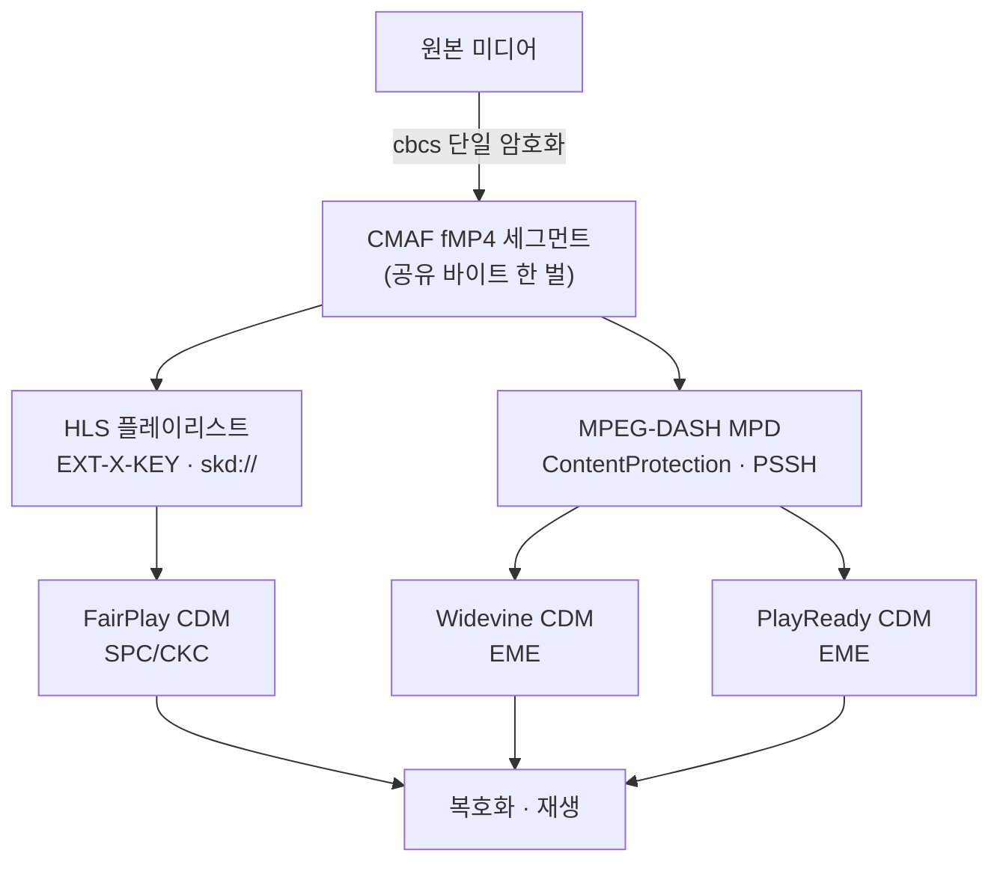

멀티-DRM은 암호화된 콘텐츠 한 벌로 세 DRM(Digital Rights Management, 디지털 저작권 관리) 시스템 — Widevine·FairPlay·PlayReady — 을 동시에 지원하는 방식이다. Apple·Google·Microsoft 생태계를 한 번에 커버하면서도 콘텐츠를 DRM마다 따로 암호화하지 않게 하는 것이 CENC·CMAF·EME 같은 공개 표준이다. 이 글은 그 공개 표준과 세 DRM의 공개된 특성을 정리한 노트다. 근거는 [W3C EME](https://www.w3.org/TR/encrypted-media/)·CENC 스펙과 각 벤더 공식 문서이며 특정 벤더의 사설 패키징 파이프라인은 다루지 않는다.

> [!NOTE] 전제
> 이 글은 HLS·MPEG-DASH·CMAF 같은 스트리밍 매니페스트/컨테이너의 기본 구조를 안다고 가정한다. DRM은 그 위에 얹혀 콘텐츠를 보호하는 계층이다.

## 멀티-DRM이 필요한 이유

DRM은 저마다 특정 플랫폼 생태계에 묶여 있어, 어느 하나만으로는 시장의 모든 기기를 감당하지 못한다.

- **[Widevine](https://developers.google.com/widevine/drm/overview)** — Google. Android, Chrome, Chromecast, 그리고 다수의 스마트TV.
- **[FairPlay](https://developer.apple.com/streaming/fps/)** — Apple. Safari와 iOS·iPadOS·tvOS·macOS.
- **[PlayReady](https://learn.microsoft.com/en-us/playready/)** — Microsoft. Windows, Edge, Xbox에 더해 스마트TV·셋톱박스 다수.

그래서 하나의 서비스가 이 단말을 빠짐없이 지원하려면 세 DRM을 전부 얹어야 한다. 그런데 같은 콘텐츠를 DRM마다 따로 암호화해 세 벌로 쌓아 두면 저장 공간이 그만큼 낭비된다. 이 비효율을 없애기 위해 나온 표준이 CENC다.

## CENC — 암호화 한 번으로 여러 DRM

[CENC](https://www.mpeg.org/standards/MPEG-B/7/)(Common Encryption, ISO/IEC 23001-7)는 미디어 바이트를 [AES-128](https://csrc.nist.gov/pubs/fips/197/final)로 단 한 번 암호화해 두고, 그 암호문 하나를 여러 DRM 클라이언트가 공유하도록 규정한 표준이다. DRM마다 갈리는 부분은 콘텐츠 키를 클라이언트에 넘기는 방법, 곧 라이선스 교환뿐이다. 암호화된 미디어 자체는 어느 DRM이 붙어도 똑같이 복호화된다.

### 네 가지 암호화 스킴

보호 스킴은 모두 네 가지이며, 각각은 파일 박스 안에 4문자 코드로 기록된다.

| 스킴 | 암호 알고리즘 | 적용 범위 |
|---|---|---|
| `cenc` | AES-CTR (카운터 모드) | 샘플 전체 |
| `cens` | AES-CTR | 블록 패턴 |
| `cbc1` | AES-CBC (블록 체이닝) | 샘플 전체 |
| `cbcs` | AES-CBC | 블록 패턴 |

패턴 암호화는 샘플을 통째로 잠그지 않고 블록 일부만 암호화하는 방식이다. `cbcs`의 경우 블록 하나를 암호화하면 뒤따르는 아홉 블록은 그대로 두는 1:9 패턴을 적용한다. 그 덕분에 복호화 없이도 헤더를 파싱할 수 있고 CPU 부담도 낮아진다.

### cbcs — 멀티-DRM을 하나로 묶는 스킴

세 DRM을 파일 하나로 합치는 핵심이 바로 `cbcs`다.

- **FairPlay** — 도입 초기부터 `cbcs` 계열, 즉 SAMPLE-AES만 써 왔다.
- **Widevine·PlayReady** — 2018년부터 `cbcs`를 지원하기 시작했다.
- 이 시점을 기준으로, `cbcs`로 암호화한 CMAF 파일 한 벌이면 Widevine·PlayReady·FairPlay 세 클라이언트가 모두 같은 파일을 재생할 수 있게 됐다.

> [!WARNING] cenc로 암호화하면 FairPlay가 빠진다
> 같은 CENC 표준이라도 `cenc`(AES-CTR) 스킴으로 암호화한 파일은 FairPlay에서 재생되지 않는다. 세 DRM을 한 벌로 묶으려면 `cbcs`를 골라야 한다.

이렇게 만든 단일 암호문 세그먼트를 실어 나르는 컨테이너 포맷이 [CMAF](https://www.mpeg.org/standards/MPEG-A/19/)(Common Media Application Format, ISO/IEC 23000-19)다.

## PSSH 박스와 SystemID

암호화된 파일에는 자신이 어떤 DRM을 위해 준비됐는지 알리는 메타데이터가 함께 담긴다.

- **`pssh` 박스(Protection System Specific Header)** — DRM별로 하나씩 만들어져 `moov`(초기화) 레벨에 자리한다. 안에는 해당 DRM이 라이선스를 받아오는 데 쓰는 초기화 데이터가 들어 있다.
- **`tenc` 박스(Track Encryption)** — 기본 키 식별자, 곧 default KID를 보관한다.

DRM을 구분하는 식별자는 SystemID로, DRM마다 고정된 UUID(공개된 상수)가 배정돼 있다.

| DRM | SystemID UUID |
|---|---|
| Widevine | `EDEF8BA9-79D6-4ACE-A3C8-27DCD51D21ED` |
| PlayReady | `9A04F079-9840-4286-AB92-E65BE0885F95` |
| Common CENC | `1077EFEC-C0B2-4D02-ACE3-3C1E52E2FB4B` |

FairPlay가 표에 빠진 이유는, HLS 환경에서는 `pssh` 박스가 아니라 매니페스트의 `EXT-X-KEY` 태그로 DRM을 신호하기 때문이다.

## DRM별 보안 레벨과 해상도 게이팅

세 DRM은 모두 하드웨어·소프트웨어 보안 등급 체계를 갖추고 있고, 단말이 어느 등급을 만족하느냐에 따라 재생 가능한 최고 해상도가 갈린다.

### Widevine (Google)

- 지원 대상은 Android, Chrome, Chromecast, 스마트TV다.
- 보안 등급은 **L1·L2·L3** 세 단계이며, 하드웨어에 기대는 L1이 위쪽 끝, 순수 소프트웨어인 L3가 아래쪽 끝이다.
  - **L1** — 복호화와 미디어 디코딩이 전부 하드웨어 TEE(Trusted Execution Environment, 신뢰 실행 환경) 내부에서 처리된다. 콘텐츠 키도, 복호화된 프레임도 일반 소프트웨어 영역으로 새어 나오지 않는다. 스튜디오급 HD·4K 콘텐츠를 틀려면 이 등급이 필요하다.
  - **L3** — TEE를 쓰지 않거나 아예 없는 환경에서 도는 소프트웨어 CDM(Content Decryption Module)이다. 지원 범위는 넓은 대신 화질은 대체로 SD로 제한된다.

### PlayReady (Microsoft)

- 지원 대상은 Windows, Edge, Xbox, 스마트TV, 셋톱박스다.
- **SL2000** — 소프트웨어로 구현되는 등급으로, 실무에서 가장 흔하다.
- **SL3000** — 하드웨어 TEE에 기반하며, 스튜디오가 HD·4K UHD를 요구할 때 필요한 등급이다. Widevine의 L1과 같은 위치에 놓인다.
- **SL150** — 개발과 테스트 용도.

### FairPlay (Apple)

- 지원 대상은 Apple 생태계, 곧 Safari와 iOS·iPadOS·tvOS·macOS다.
- **HLS 전용** — 스트리밍은 [HLS](https://developer.apple.com/streaming/)(HTTP Live Streaming)로만 가능하고 [DASH](https://dashif.org/)(Dynamic Adaptive Streaming over HTTP)는 받지 않는다. DRM 신호는 HLS 매니페스트의 `EXT-X-KEY` 태그와 `skd://` URI가 담당한다.
- 암호화 스킴은 SAMPLE-AES, 즉 `cbcs` 계열이다.
- 콘텐츠 키는 인증서 기반의 SPC/CKC 절차로 주고받는다(아래).

### 보안 등급과 해상도 게이팅

스튜디오는 콘텐츠 화질별로 통과해야 할 보안 등급을 다르게 요구한다.

- 소프트웨어 등급(Widevine L3·PlayReady SL2000) — 재생 화질이 SD 수준에서 묶이는 경우가 많다.
- 하드웨어 등급(Widevine L1·PlayReady SL3000·Apple 실리콘 FairPlay) — HD와 4K까지 열린다.

이 때문에 동일한 파일이라도 단말이 충족하는 DRM 등급에 따라 그 기기에서 볼 수 있는 최고 해상도가 달라진다.

## 콘텐츠 키 전달 흐름

암호화 자체는 세 DRM이 공유하지만, 콘텐츠 키를 클라이언트로 넘기는 흐름은 DRM 계열마다 다르다. 브라우저 쪽은 W3C EME를, Apple은 자체 SPC/CKC를 쓴다.

### 브라우저 환경 — W3C EME

EME(Encrypted Media Extensions, W3C)는 브라우저가 CDM과 대화하기 위한 표준 API다.

1. 먼저 `navigator.requestMediaKeySystemAccess(keySystem, config)`로 키 시스템 접근 권한을 얻고, `createMediaKeys()`를 거쳐 `video.setMediaKeys()`로 미디어 요소에 연결한다.
2. 재생 도중 암호화된 구간을 만나면 `encrypted` 이벤트가 발생한다. 이때 `mediaKeys.createSession()`으로 세션을 열고 `session.generateRequest('cenc', initData)`를 호출한다.
3. 그러면 `message` 이벤트에 라이선스 요청이 실려 나오고, 애플리케이션이 이를 라이선스 서버로 POST한다.
4. 서버는 구독 상태·권한·지역·디바이스를 확인한 뒤 라이선스를 돌려준다.
5. 받은 라이선스를 `session.update(license)`에 넘기면 CDM이 그 안의 콘텐츠 키를 풀어 재생이 시작된다.

다음 시퀀스는 위 다섯 단계의 메시지 흐름을 보여준다.

이 과정 내내 콘텐츠 키가 CDM 경계 밖으로 드러나는 일은 없다. 애플리케이션이 하는 일은 라이선스 바이트를 서버와 CDM 사이에서 오가게 하는 중계뿐이다.

### FairPlay — SPC와 CKC 교환

Apple은 EME를 따르지 않고 별도의 절차를 둔다.

1. 플레이어가 `skd://` URI를 발견하면 콘텐츠 키 요청이 시작된다.
2. Apple이 내준 인증서를 이용해 **SPC(Server Playback Context)**를 만든다. 여기에는 세션 키, 콘텐츠 ID, 디바이스 인증 정보가 들어간다.
3. 이 SPC를 **KSM(Key Security Module)** 라이선스 엔드포인트로 POST하면, KSM은 콘텐츠 키를 세션 키로 감싼 **CKC(Content Key Context)**를 돌려준다.
4. 플레이어가 이 CKC를 풀어 재생으로 넘어간다.

다음 시퀀스는 SPC/CKC 교환 과정을 보여준다.

## 멀티-DRM 패키징 워크플로

세 DRM을 하나의 자산으로 서빙하는 오늘날의 워크플로는 "암호화는 한 번, 매니페스트는 둘"이라는 구성으로 요약된다.

- 원본 미디어를 `cbcs`로 딱 한 번 암호화해 CMAF fMP4(fragmented MP4) 세그먼트 묶음을 만든다.
- 이 세그먼트를 가리키는 매니페스트는 두 종류로 낸다.
  - **HLS 플레이리스트** — Apple 계열 단말을 위한 것으로, FairPlay 신호를 `EXT-X-KEY`(그리고 `skd://`)에 담는다.
  - **MPEG-DASH MPD** — 나머지 단말을 위한 것으로, Widevine·PlayReady 신호를 `ContentProtection` 요소(그리고 PSSH)에 담는다.
- 두 매니페스트가 참조하는 세그먼트 바이트는 완전히 같은 한 벌이다. 갈라지는 것은 매니페스트 계층뿐이다.
- 재생 단계에서는 단말에 심긴 CDM(Widevine·FairPlay·PlayReady)이 각자의 라이선스 흐름을 따라 콘텐츠 키를 확보해 복호화를 수행한다.

다음 그림은 이 워크플로 전체를 보여준다.

역할을 나눠 보면 CENC는 "단일 암호화"를, CMAF `cbcs`는 "공유 세그먼트 한 벌"을, HLS·DASH 매니페스트는 "플랫폼별 DRM 신호"를 각각 맡는다. 세 층이 맞물린 덕분에 인코딩을 한 번만 돌려도 그 결과물이 주요 단말 전부에서 보호된 채 재생된다.

## 참고 자료

- W3C, [Encrypted Media Extensions (EME)](https://www.w3.org/TR/encrypted-media/)
- ISO/IEC, [Common encryption in ISO base media file format files (CENC), 23001-7](https://www.mpeg.org/standards/MPEG-B/7/)
- ISO/IEC, [Common media application format (CMAF), 23000-19](https://www.mpeg.org/standards/MPEG-A/19/)
- Google, [Widevine DRM](https://developers.google.com/widevine/drm/overview)
- Apple, [FairPlay Streaming](https://developer.apple.com/streaming/fps/)
- Microsoft, [PlayReady](https://learn.microsoft.com/en-us/playready/)
- Unified Streaming, [공유 CMAF 소스에서 HLS·DASH 멀티-DRM 패키징하기](https://docs.unified-streaming.com/documentation/package/multi-format-drm.html)
- Mux, [개발자를 위한 멀티-DRM 스트리밍 가이드](https://www.mux.com/articles/multi-drm-video-streaming-widevine-fairplay-playready)
