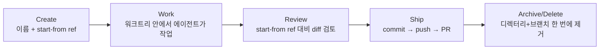
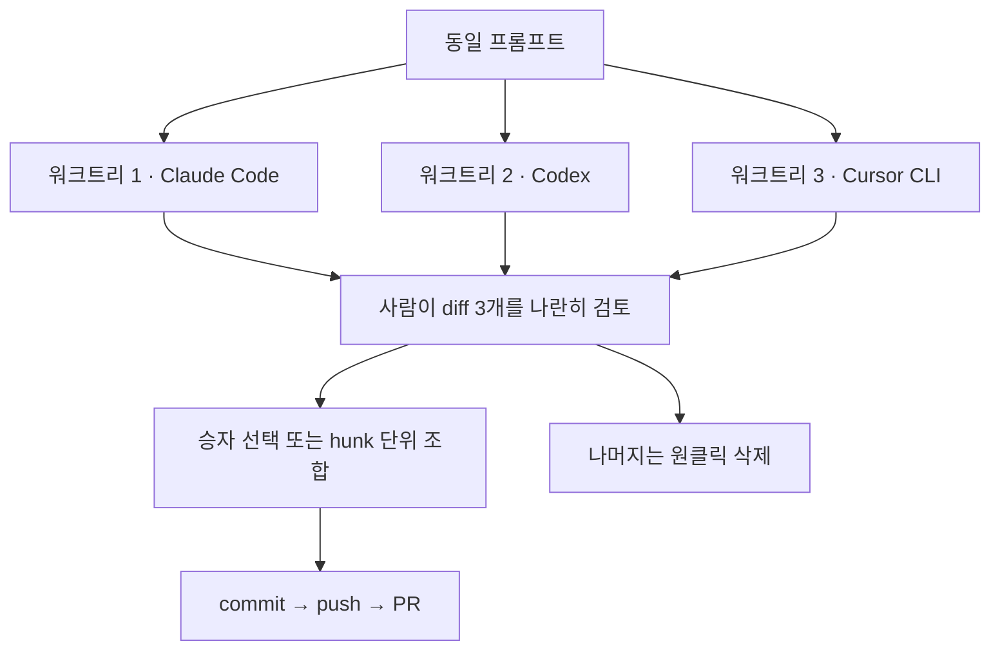
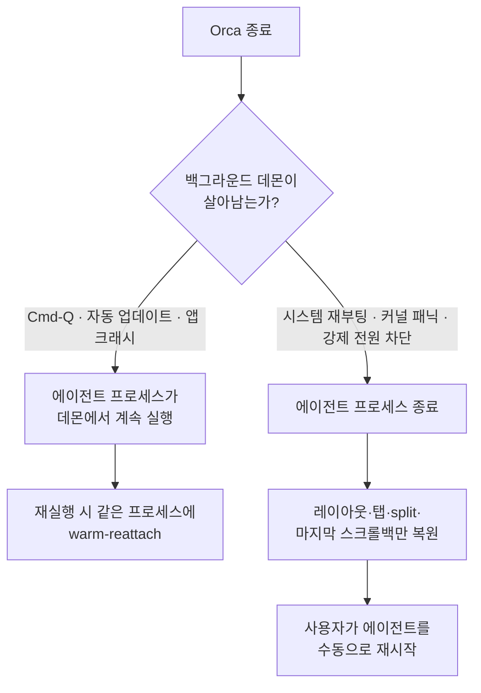
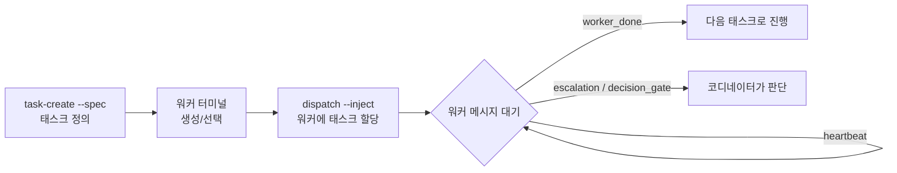

이 글은 오픈소스 병렬 코딩 에이전트 오케스트레이션 도구 [Orca](https://github.com/stablyai/orca)(`stablyai/orca`)의 공식 문서(`onorca.dev/docs`)와 GitHub 저장소, 독립 리뷰 자료를 근거로 아키텍처와 기능을 정리한 노트입니다.

> [!NOTE] 전제 지식
> `git worktree`와 Claude Code·Codex 같은 CLI 기반 코딩 에이전트를 사용해 본 경험이 있다고 가정합니다. 두 개념이 낯설다면 아래 "핵심 메커니즘" 절의 정의부터 천천히 읽으면 됩니다.

## Orca란 무엇인가

Orca는 코드를 한 줄도 직접 쓰지 않는 오케스트레이션 셸입니다. 스스로를 전통적 IDE와 구분해 **ADE(Agent Development Environment)**라는 자체 카테고리로 칭하며 [Claude Code](https://code.claude.com/docs/en/overview)·[Codex](https://learn.chatgpt.com/docs/codex/cli)·[Cursor CLI](https://cursor.com/docs/cli/overview)·[GitHub Copilot CLI](https://docs.github.com/en/copilot/how-tos/copilot-cli/use-copilot-cli/overview)·[OpenCode](https://opencode.ai/docs/)·[Gemini](https://google-gemini.github.io/gemini-cli/docs/) 등 30여 개 외부 CLI 코딩 에이전트를 실행하고 감독하는 것이 유일한 역할입니다.

GitHub 저장소 설명은 이 포지셔닝을 그대로 명시합니다.

> "Orca is the ADE for working with a fleet of parallel agents. Run any coding agent with your own subscription. Available on desktop and mobile."

README의 첫 문구도 같은 축을 반복합니다.

> "The AI Orchestrator for 100x builders. Run Codex, ClaudeCode, OpenCode or Pi side-by-side — each in its own worktree, tracked in one place."

`onorca.dev` 마케팅 페이지는 Orca를 자율 에이전트가 아니라 에이전트를 다루는 사람을 위한 도구로 규정합니다.

> "designed for people who already write code for a living and want to use AI as leverage — not as a replacement."

즉 Orca는 코드를 작성하지도, 모델 구독을 직접 보유하지도, 스스로 편집을 수행하지도 않습니다. 다른 CLI 코딩 에이전트를 각자 독립된 [`git worktree`](https://git-scm.com/docs/git-worktree)(같은 저장소를 브랜치별로 별도 디렉터리에 체크아웃하는 git 기능) 안에서 실행하고 그 주위에 공유 터미널·에디터·브라우저·diff 리뷰·이슈 트래커 화면을 둘러친 오케스트레이션/리뷰 셸입니다. **BYO(Bring Your Own) 구독** 모델이 핵심 전제라, Orca 자체에는 과금 레이어가 없고 사용자는 각 에이전트 벤더에게 직접 비용을 지불하며 Orca는 마진을 얹지 않습니다.

**플랫폼**: 데스크톱 앱은 macOS(Apple Silicon·Intel)·Windows·Linux(AppImage, `.deb`)를 지원합니다. 모바일 컴패니언 앱은 iOS(App Store·TestFlight)와 Android(APK, 베타)로 제공됩니다. 여기에 더해 Linux 박스에서 런타임 자체를 돌리는 헤드리스 "Remote Orca Server" 모드가 별도로 있습니다.

공식 문서가 꼽는 **주요 사용 사례**는 다음 네 가지입니다.

1. 같은 작업에 여러 에이전트를 병렬로 돌리고 결과 중 최선을 고르기
2. AI가 생성한 코드를 배포 전에 리뷰하기
3. 이미 비용을 지불 중인 에이전트 구독(Claude Code, Codex, Cursor CLI 등)을 오케스트레이션하기
4. 더 강력한 하드웨어에서 SSH로 에이전트를 원격 실행하기

## 핵심 메커니즘 — Parallel Worktrees

Orca의 헤드라인 기능은 "Parallel Worktrees"입니다. 하나의 프롬프트를 서로 다른 에이전트 여러 개에 동시에 던지되, 각 에이전트를 물리적으로 격리된 `git worktree` 안에 가두어 서로의 파일을 절대 건드리지 못하게 하는 것이 핵심입니다.

### worktree-native 아키텍처

공식 문서(`/docs/model/worktrees`)는 이 설계 선택을 다음과 같이 밝힙니다.

> "Orca is worktree-native."

한 체크아웃 위에서 브랜치를 바꾸고 stash를 쌓는 대신, 모든 태스크가 `git worktree`로 저장소의 디스크 사본을 독립적으로 하나씩 받습니다.

연결된 저장소마다 보통 `origin/main`인 **base ref**가 있습니다. 사용자가 새 워크트리를 만들 때 고르는 **start-from ref**(무엇에서 브랜치를 뻗어낼지)는 base 브랜치·다른 로컬 브랜치·커밋 SHA·리모트 브랜치 중 무엇이든 될 수 있습니다. 이 지점부터 각 워크트리는 "자신의 브랜치, 자신의 디스크 파일, 자신의 에이전트 터미널"을 갖습니다. 문서는 이 물리적 분리를 시스템 전체의 안전장치로 규정합니다.

> "This is what makes parallel agents safe — they never step on each other's files."

각 워크트리는 진짜 `git worktree`이므로 그 안에서 `git status`·`git rebase`·`git cherry-pick` 같은 표준 git 명령이 그대로 작동하며 Orca UI는 외부 변경을 감지하면 다음 렌더링 시 상태를 다시 읽습니다.

문서화된 **작업 단위 라이프사이클**은 5단계입니다.



### 팬아웃 — 프롬프트 하나, 에이전트 N개

`onorca.dev` 랜딩 페이지는 이 워크플로를 다음과 같이 요약합니다.

> "Fan one prompt across five agents, each in its own isolated git worktree — compare the results and merge the winner."

공식 **레시피**(`/docs/recipes/parallel-agents`)는 사용자가 그대로 따라야 할 절차를 다음 7단계로 못박습니다.

1. 같은 start-from ref에서 워크트리 세 개를 만든다. 이름은 `fix-bug`, `fix-bug-2`, `fix-bug-3`.
2. 각각에 다른 에이전트를 하나씩 실행한다 — Claude Code, Codex, Cursor CLI.
3. 동일한 프롬프트를 세 곳 모두에 붙여넣는다.
4. 패널을 나눠 작업 과정을 볼 수 있게 한다 — 탭을 가장자리로 드래그한다.
5. 완료되면 각 diff를 리뷰한다. 승자에게는 Annotate AI Diff를 사용한다.
6. 승자 워크트리에서 commit, push, PR을 연다.
7. 나머지 둘을 삭제한다 — 원클릭으로 워크트리와 브랜치가 함께 지워진다.



중요한 점은 이것이 **자동화된 토너먼트나 채점/병합 알고리즘이 아니라는 것**입니다. 비교와 "승자 병합"은 어디까지나 사람이 수행하는 수동 작업입니다 — 사람이 diff를 나란히 읽고 한 워크트리의 브랜치를 PR로 승격시킵니다. 문서는 이 방식이 순차 재시도보다 나은 이유를 다양성 논리로 설명합니다.

> "Different agents make different mistakes. Running the same task in parallel is cheaper than sequential retries and surfaces disagreement as a signal."

독립 리뷰(dev.to, "Orca Review: The IDE Built for Parallel Coding Agents")는 기본 레시피를 넘어선 관련 기능 하나를 특히 긍정적으로 평가했습니다 — 승자 하나를 통째로 고르는 대신 **에이전트 간 hunk를 cherry-pick**해 네 번째 "병합 워크트리"에 손으로 조합하는 것이 가능하다는 점입니다. 에이전트 A의 가장 좋은 부분과 에이전트 B의 가장 좋은 부분을 취해 all-or-nothing 선택을 피할 수 있습니다.

> [!WARNING] 자동 승자 선정 기능은 확인되지 않음
> 병렬 워크트리 간 자동 스코어링·투표·테스트 기반 승자 선정을 서술한 공식 문서는 없습니다. "비교하고 승자를 병합한다"는 모든 공식 서술은 사람이 N개의 diff를 눈으로 검토하고 수동으로 하나를 승격시키는 과정을 가리킵니다. 에이전트 간 자동 판정 기능이 있다는 주장은 현재 공식 문서 기준으로 미확인 상태로 취급해야 합니다.

### 레이아웃 모델 — 탭·페인·에이전트 세션

문서(`/docs/model/tabs-panes-splits`, `/docs/model/agents-sessions`)는 UI를 작은 어휘 집합으로 분해합니다.

- **Tab**: 터미널·에디터 버퍼·브라우저·diff·PR 뷰 중 하나인 단일 요소. 탭은 **탭 그룹** 안에 존재합니다.
- **Pane/split**: 탭을 페인 오른쪽 가장자리로 드래그하면 좌우(수평) split, 아래쪽 가장자리로 드래그하면 상하(수직) split이 생깁니다. split은 임의로 중첩됩니다 — 예를 들어 왼쪽에 에이전트 터미널, 오른쪽 위에 diff 뷰, 오른쪽 아래에 브라우저 탭을 동시에 둘 수 있습니다. 페인 경계 위치는 워크트리별로 저장되어 창 크기 조절 후에도 유지됩니다.
- **Agent session**: 한 워크트리 안 한 터미널에서 실행 중인 CLI 에이전트 하나. 여러 에이전트 세션이 서로 다른 터미널 탭/페인을 차지하는 방식으로 한 워크트리 안에 공존할 수 있습니다 — Claude Code·Codex·OpenCode를 워크트리 격리 없이 나란히 두는 방식이 이렇게 가능하지만 위의 팬아웃 레시피는 진짜 git 수준 격리를 위해 별도 워크트리를 씁니다.
- **세션 상태 점**: 초록색 깜빡임 = 작업 중, 노란색 = 사용자 입력 대기, 회색 = 유휴, 점 없음 = (인식되지 않은) 일반 셸. 라이프사이클은 Launch → Work → Idle → Exit이며 프로세스가 종료되면 "Restart 칩"이 나타나 세션을 다시 살릴 수 있습니다.

### 세션 복원 — 앱 재시작 후에도 그대로

`/docs/model/session-restore`에 따르면 Orca는 재시작 전후로 "모든 열린 워크트리, 모든 터미널 split, 각 페인의 스크롤백, 포커스했던 탭"을 보존합니다. 정확히 무엇이 복원되는지는 Orca가 *왜* 닫혔는지에 따라 갈립니다.

- **데몬이 살아남는 경우**(Cmd-Q, 자동 업데이트, 앱 크래시): 에이전트 프로세스가 백그라운드 데몬에서 계속 실행되며 재실행 시 Orca는 진행 중이던 작업에 끊김 없이 같은 프로세스에 "warm-reattach" 합니다.
- **데몬이 죽는 경우**(시스템 재부팅, 커널 패닉, 강제 전원 차단): 에이전트 프로세스는 종료되지만 레이아웃·탭·split·마지막 저장된 스크롤백은 그대로 복원됩니다. 사용자가 에이전트를 수동으로 다시 시작해야 합니다.



세션 복원은 별도로 워크트리를 명시적으로 닫아두지 않는 한 매 실행마다 자동으로 동작하며 "클린 슬레이트" 옵션은 없습니다.

## 워크트리를 감싸는 IDE 표면

각 워크트리는 단순한 파일 디렉터리가 아니라, VS Code에 준하는 터미널과 진짜 Chromium 브라우저, 클릭 한 번으로 UI 요소를 에이전트 프롬프트로 바꾸는 캡처 도구까지 갖춘 두툼한 리뷰 환경으로 둘러싸여 있습니다.

### 터미널

공식 문서 `/docs/terminal`은 렌더링 기반을 명확히 밝힙니다.

> "Orca's terminal is the same xterm.js-based terminal VS Code uses, with a few additions tuned for AI-agent workflows."

[xterm.js](https://xtermjs.org/) 위에 추가된 기능은 다음과 같습니다.

- **[Kitty 키보드 프로토콜](https://sw.kovidgoyal.net/kitty/keyboard-protocol/)(Shift+Enter 같은 조합키 입력까지 구분해 전달하는 확장 키보드 입력 규약)** 지원 — 그 덕분에 진짜 `Shift+Enter`, `Ctrl+Enter` 등 modifier가 결합된 키 입력이 [Ghostty](https://ghostty.org/)나 [WezTerm](https://wezterm.org/index.html) 같은 네이티브 터미널과 동일하게 에이전트 CLI에 도달합니다. 많은 코딩 에이전트 TUI(Claude Code, Codex)가 여러 줄 입력을 위해 Enter와 Shift+Enter를 구분하는데, 일반 터미널 에뮬레이터는 이 구분을 통과시키지 못하는 경우가 많아 이 지점이 중요합니다.
- **스크롤백 내 검색**(`Cmd-F`) — 일치 항목 강조, 대소문자 구분, 정규식, 일치 항목 간 이동을 지원합니다.
- **Ghostty 설정 가져오기** — 첫 실행 시(이후에도 Settings에서 재수행 가능) 기존 Ghostty 설치의 테마·폰트·커서 설정을 가져올 수 있습니다.
- 터미널도 일반 탭이므로 다른 탭 타입과 동일한 split/pane 메커닉을 지원해 "두 셸을 나란히" 볼 수 있습니다.

> [!WARNING] 마케팅 문구와 기술 문서의 불일치 — "WebGL 렌더링" 주장
> GitHub README와 `onorca.dev` 마케팅 랜딩 페이지는 터미널 기능을 **"Ghostty급 터미널, WebGL 렌더링, 무한 split, 재시작에도 살아남는 스크롤백"** 이라고 광고합니다. 그러나 전용 기술 문서 페이지(`/docs/terminal`)는 WebGL이나 GPU 렌더링, 캔버스 렌더링을 전혀 언급하지 않으며 대신 렌더러를 명시적으로 **xterm.js**라고 밝힙니다 — VS Code 내장 터미널이 쓰는 것과 동일한 DOM/캔버스 기반 라이브러리입니다("Ghostty급"이라는 표현은 렌더링 아키텍처가 아니라 입력 충실도/키보드 프로토콜 정합성과 테마 가져오기를 가리키는 것으로 보입니다). 이 글은 기술 문서 페이지를 렌더링 메커니즘의 더 권위 있는 소스로 취급하고 "WebGL" 마케팅 문구는 미검증/부정확 가능성이 있는 것으로 표시합니다. 다만 "스크롤백이 재시작에서 살아남는다"는 부분은 세션 복원 문서로 별도 확인됩니다.

### Design Mode

Design Mode는 클릭한 UI 요소를 에이전트 프롬프트용 구조화된 컨텍스트로 바꾸는 기능이며 `/docs/browser/design-mode`에 문서화되어 있습니다.

**활성화**는 내장 브라우저 툴바의 Design Mode 토글을 클릭하는 것으로, 커서가 요소 선택기로 바뀌고 커서 아래 요소가 하이라이트됩니다.

**클릭 시** Orca는 다음을 캡처해 패키징합니다.

- 요소의 HTML — "바깥쪽과 약간의 주변 맥락"(단일 태그가 아니라 주변 DOM 컨텍스트 일부 포함)
- 계산된 CSS — "색상, 폰트, 간격"
- 해당 요소만 크롭한 스크린샷
- 소스 파일/줄 번호 — "dev-mode 소스맵을 사용할 수 있는 경우" React/Vue 등 컴포넌트를 소스 위치까지 역추적

이 모든 것이 "활성 에이전트 터미널에 첨부물 하나로" 실려 들어가며 이후 사용자는 같은 프롬프트 안에 원하는 변경을 입력합니다.

**전체 루프**는 Design Mode 토글 → 요소 클릭 → 에이전트 채팅에 원하는 변경 설명 → 에이전트가 소스 편집 → Orca가 개발 서버 프리뷰 hot-reload → 다시 클릭해 검증, 순서로 이어집니다. 독립 리뷰(dev.to)는 이를 Orca의 **"sleeper feature"(숨은 강점)**라고 표현하며 HTML·CSS·스크린샷을 채팅창에 일일이 복사-붙여넣기하지 않아도 되는 점을 핵심 가치로 꼽았습니다.

### 내장 브라우저

`/docs/browser/overview`에 문서화된 이 브라우저는 외부 의존성이나 iframe이 아니라 "주소창·히스토리·devtools를 갖춘 진짜 Chromium 창"이 하나의 페인으로 내장된 것이며 터미널·에디터와 동등한 1급 페인 타입입니다.

**워크트리별 스코핑**: "탭은 워크트리별로 필터링됩니다. 워크트리를 전환하면 그 워크트리의 브라우저 탭과 스크롤 위치가 복원됩니다." 에이전트 A의 워크트리는 `localhost:3000`을 한 상태로 열어둔 채, 에이전트 B의 병렬 워크트리는 완전히 독립된 개발 서버 탭과 스크롤 위치를 가질 수 있습니다.

**표준 브라우저 기능**으로는 히스토리/URL 자동완성이 있는 주소창, 뒤로/앞으로/새로고침, 탭 열기/재열기(`Cmd-T`/`Cmd-Shift-T`), 페이지 내 검색(`Cmd-F`), 반응형 테스트를 위한 뷰포트/디바이스 에뮬레이션을 포함한 완전한 Chrome DevTools, "클릭 한 번으로 Chrome이나 Edge에서 쿠키를 가져와" 기존 로그인 세션을 유지하는 기능이 있습니다.

**Browser Profiles**(`/docs/browser/profiles`)는 페인마다 별도 아이덴티티로 실행할 수 있게 합니다 — 프로필별로 독립된 쿠키·로컬 스토리지·캐시를 가지며 "에이전트가 로그인해야 하거나, 세션별 버그를 재현하거나, 여러 사용자를 에뮬레이션해야 할 때" 유용합니다. 프로필은 Settings → Browser → Profiles에서 이름·선택적 쿠키/User-Agent/뷰포트로 생성하고 브라우저 툴바에서 페인별로 선택하며 "에이전트가 구동하는 브라우저 명령은 활성 프로필을 상속"합니다 — CLI로 구동되는 `orca click`/`orca fill` 호출이 그 페인에서 현재 활성화된 프로필 안에서 동작합니다.

같은 브라우저 인스턴스는 CLI 브라우저 자동화 명령 계열(`orca goto`, `orca snapshot`, `orca click`, `orca fill` 등)로도 스크립팅되므로, 사람이 클릭하는 것과 에이전트가 같은 명령으로 조작하는 것이 문자 그대로 같은 탭·같은 상태를 공유합니다.

## 이슈 트래커 통합

Orca는 GitHub·[Linear](https://linear.app/docs)·[Jira](https://www.atlassian.com/software/jira) 세 이슈/PR 트래커의 인앱 브라우징·편집을 네이티브로 제공하며 각각 Settings → Integrations에서 연결합니다. 공통 설계로 "Orca는 저장소별로 마지막에 쓴 태스크 소스(GitHub, Linear, Jira)를 기억합니다."

### GitHub

- **PR**: 연결된 리뷰가 사이드바에 open/merged/closed 상태로 표시되고 "GitHub checks, 리뷰, 코멘트가 PR 탭 안에서 인라인으로" 열립니다. 실패한 체크는 이름/링크와 함께 "에이전트"에게 곧바로 넘겨 수정을 시도시킬 수 있습니다. [GitHub Projects](https://docs.github.com/en/issues/planning-and-tracking-with-projects/learning-about-projects/about-projects) 보드는 Tasks 사이드바에서 탐색 가능하며 저장소에 설정된 기본 머지 방식을 존중하는 선택적 **자동 머지**를 지원합니다.
- **Issue**: 이슈 드로어에서 브라우징/필터링이 가능하고(GitLab 이슈도 지원) 이슈 상세 화면에는 코멘트와 타임라인 이벤트(할당, 멘션, 크로스레퍼런스, 상태 변경)가 섞인 Activity 섹션이 있습니다.
- **이슈로부터 워크트리 생성**: "이슈로부터 워크트리를 만들면 태스크 이름이 미리 채워지고 둘이 링크되어 리뷰가 태스크에 계속 붙어 있습니다."

### Linear

설정은 Settings → Integrations → Linear에서 Linear 자체 Settings → API 페이지의 개인 API 토큰을 입력한 뒤 어느 팀의 이슈를 Orca에 노출할지 선택하는 방식입니다. 상태·담당자·우선순위·라벨·estimate 같은 이슈 필드는 Linear의 우선순위 아이콘 세트를 그대로 재사용하며 Orca 안에서 바로 편집할 수 있고 긴 목록은 "더 보기"로 페이지네이션됩니다. 이슈로부터 워크트리를 만드는 프리필/링크 패턴은 GitHub와 동일합니다. 선택적으로 워크트리가 생성되면 Linear 이슈를 자동으로 "In Progress"로 바꾸는 **상태 동기화**를 팀 단위로 opt-in 할 수 있습니다(전역 설정 아님).

### Jira

설정에는 세 가지 정보가 필요합니다 — Jira Cloud 사이트 URL(예: `https://example.atlassian.net`), Atlassian 계정 이메일, Atlassian 계정 보안 페이지에서 생성한 API 토큰. 여러 Atlassian 사이트를 동시에 연결할 수 있습니다. 토큰은 "OS 키체인으로 암호화되어 로컬에 저장"되며 언제든 폐기할 수 있습니다. 인앱 편집은 상태 전이·우선순위·담당자·커스텀 필드와 코멘트 작성을 포함하며 워크트리-이슈 연결 동작은 GitHub·Linear와 동일합니다.

인앱 UI와는 별도로, Orca CLI는 전용 `orca linear ...` 명령 계열을 노출해 에이전트가 자신에게 할당된 Linear 티켓을 사람이 브라우징하는 것을 넘어 프로그램적으로 갱신할 수 있게 합니다 — 전체 명령 목록은 아래 [Orca CLI와 자동화](#orca-cli와-자동화) 섹션에 정리되어 있습니다.

## 원격 실행

Orca는 서로 다른 두 원격 실행 모델을 문서화하며 둘을 명확히 구분합니다. SSH Worktrees는 노트북의 Orca가 런타임을 소유한 채 SSH로 원격 머신에 접속하는 방식이고 Remote Orca Server는 원격 머신 자체가 자신의 Orca 런타임을 돌리는 방식입니다.

### SSH Worktrees

`/docs/ssh`에 문서화된 이 기능은 노트북의 Orca가 원격 머신에 접속하는 방식입니다. 설정은 Settings → SSH에서 호스트·사용자명·포트·선택적 identity 파일을 입력하며 Orca는 기존 OpenSSH 설정(`Include` 지시어로 딸려 들어오는 파일 포함)을 자동으로 가져오고 사용 전 연결 테스트를 제공합니다. 키 패스프레이즈는 "Orca 세션이 살아있는 동안만 메모리에 보관되며, Orca를 닫으면 지워집니다" — 설정에서 TTL을 연장하는 옵션도 있습니다.

워크트리가 SSH 호스트를 대상으로 하면 Orca는 세 가지를 수행합니다 — 원격 머신에 git 워크트리를 만들고 SSH 연결을 통해 에이전트 프로세스를 실행하며 파일 변경 이벤트를 로컬 UI로 다시 동기화합니다. 목표는 연산이 원격에서 일어나도 "에디터·diff·브라우저는 여전히 로컬처럼 느껴지게" 하는 것입니다.

<details markdown="1">
<summary>심화: SSH Worktrees의 복원력·연결 재사용·포트 포워딩</summary>

**복원력/자동 재연결**: 연결이 끊겨도 실행 중인 에이전트는 죽지 않습니다. Orca는 자동으로 재연결·재부착하며 3색 상태 표시(초록 = 연결됨, 노랑 = 재연결 중, 빨강 = 연결 끊김)를 보여줍니다. "데스크톱 앱을 닫아도 더 이상 원격 PTY(가상 터미널) 세션이 죽지 않습니다" — 릴레이 프로세스가 원격 호스트에 계속 남아있고 분리된 세션이 최종적으로 정리되기까지 기본 5분의 유예 기간을 설정할 수 있습니다.

**연결 재사용**: opt-out 가능한 "Reuse SSH connection for faster setup" 설정은 macOS/Linux에서 OpenSSH 멀티플렉싱을 사용해 반복적인 핸드셰이크를 건너뛰며 멀티플렉싱 세션을 금지하는 보안 정책을 쓰는 환경에서는 비활성화할 수 있습니다.

**포트 포워딩**: 사이드바가 원격 호스트에서 리스닝 중인 포트를 자동 감지(`/proc/net/tcp` 읽기)해 원클릭 포워딩을 제공합니다. 권한이 필요한 원격 포트는 로컬에서 자동으로 재매핑됩니다(예: 원격 `:80` → 로컬 `:10080`). 포워딩은 앱 재시작 후에도 유지됩니다.

**파일 다운로드**: 원격 파일 탐색기에서 파일을 우클릭하면 로컬 머신으로 네이티브 저장 대화상자를 통한 다운로드를 제공합니다.

</details>

공식 **레시피**(`/docs/recipes/remote-worktrees`)는 이를 다음 순서로 압축합니다 — Settings → SSH에서 호스트 설정 → 연결 확인 → SSH 대상을 선택해 저장소 추가(또는 폴더 열기) → 워크트리 생성(원격에서 `git worktree add`가 실행됨) → 에이전트 시작(원격 박스에서 실행됨) → 평소처럼 로컬에서 편집/리뷰/커밋/푸시. 복원력을 두고 문서는 이렇게 서술합니다.

> "Laptop sleeps, Wi-Fi drops — the agent keeps running remotely. Orca reconnects and re-attaches the terminal."

### Remote Orca Server

`/docs/remote-servers`에 문서화된 별개의 최신 기능입니다. 노트북이 소유한 런타임이 SSH로 밖으로 뻗어나가는 대신, 원격 Linux 머신이 `orca serve`로 자신만의 완전한 런타임을 돌리고 원하는 수만큼의 클라이언트(다른 데스크톱, 브라우저, 모바일)가 여기 접속합니다.

서버 측 설정은 서버 자체에 Orca와 필요한 에이전트 CLI를 설치하고 `orca`가 `PATH`에 있는지 확인한 뒤 다음을 실행하는 방식입니다.

```
orca serve --pairing-address <server-ip-or-tailscale-hostname>
```

이 명령은 "포그라운드에서 실행되며, 런타임 엔드포인트와 pairing URL을 출력하고, `Ctrl-C`를 누르면 멈춥니다." 클라이언트는 Settings → Remote Orca Servers → Add Server에서 pairing URL을 붙여넣어 연결합니다. 문서는 이 pairing URL을 민감 정보로 명시합니다.

> "The pairing URL grants access to the server runtime. Treat it like a secret."

실질적인 구분은 이렇습니다 — SSH Worktrees는 한 사용자를 위한 *점대점, 노트북 주도* 원격 실행 기능이고 Remote Orca Server는 모바일을 포함한 여러 클라이언트가 동시에 붙을 수 있는 *공유된, 서버 호스팅* 런타임입니다.

## 리뷰와 배포

diff를 검토하고 배포하는 흐름은 Diff Viewer·Annotate AI Diff·Attribution·Commit & Push 네 기능으로 구성됩니다.

### Diff Viewer

`/docs/review/diff-viewer`에 문서화된 Diff Viewer는 한 워크트리의 staged·unstaged·untracked 파일 전체에 걸친 "결합된 diff"를 렌더링하며 기본적으로 그 워크트리의 start-from ref 대비로 계산됩니다(diff 툴바에서 임의의 커밋/브랜치/base로 조정 가능). 주요 기능은 다음과 같습니다.

- 양쪽에 토글 가능한 줄 번호
- 바이너리 이미지 파일에 대한 side-by-side·swipe·onion-skin 모드의 이미지 diff
- 인라인 해결이 가능한 3-way 병합 충돌 UI
- hunk 단위 또는 줄 단위 스테이징 — "`git add -p`와 같지만 시각적"이라고 서술됨
- 긴 줄에 대한 선택적 word-wrap(기본 꺼짐)
- 키보드 내비게이션: 파일 간 `j`/`k`, hunk 간 `n`/`p`, 스테이지 `s`, 코멘트 `c`

### Annotate AI Diff

`/docs/review/annotate-ai-diff`는 이를 "에이전트가 생성한 코드를 위한 Orca의 인라인 리뷰 루프"라고 설명합니다. 동작 방식은 다음과 같습니다.

1. diff 줄에 마우스를 올리면 거터에 **+** 아이콘이 나타나고 클릭(또는 `c` 입력)하면 코멘트 박스가 열립니다. 마크다운을 지원하며 `Cmd-Enter`로 저장, `Esc`로 취소합니다.
2. 코멘트는 줄에 고정되고 diff가 밀려도 따라갑니다 — "코멘트는 정확한 줄에 고정되고, diff가 이동해도 그 줄을 따라가도록 Orca가 추적합니다."
3. 필요한 만큼 여러 줄에 코멘트를 단 뒤 diff 상단의 **Send to agent**를 클릭하면 모든 코멘트가 줄 앵커링과 함께 하나의 프롬프트로 배치되고 그 워크트리 안에서 어느 에이전트가 수정을 적용할지(또는 새 에이전트를 시작할지) 고르는 메뉴가 뜹니다.
4. 코멘트를 하나씩 보내지 않고 배치로 보내는 이유는 다음과 같이 설명됩니다 — 개별 전송은 "에이전트가 왔다갔다하게" 만드는 반면, 배치는 "한 번의 사고, 한 번의 수정 패스, 훨씬 높은 성공률"을 제공합니다.
5. 수정 패스 후에도 코멘트는 계속 보이며 리뷰어는 고쳐진 것을 **Resolve**하고 해결되지 않은 것은 다음 배치 전송에 자동으로 포함됩니다.

레시피 페이지(`/docs/recipes/review-ai-diff`)는 이를 7단계 루프로 반복합니다 — diff 열기 → `j`/`k`로 파일 훑기 → `c`로 코멘트 달기("완전한 문장이 가장 잘 작동합니다") → **Send to agent** → 상태 점 관찰(노랑 = 입력 필요, 초록 = 작업 중) → diff를 다시 열어 해결/미해결 코멘트 확인 → 만족할 때까지 반복 → 커밋.

### Attribution

Orca는 줄 범위마다 *마지막 작성자*가 에이전트인지 사람인지를 추적합니다 — "에이전트가 자신의 도구를 통해 파일에 쓰면 Orca가 그 범위를 기록"하고 diff 뷰어에서 AI가 작성한 줄에 거터 마커를 표시합니다. "AI 코드 위에 사람이 편집하면 attribution이 human으로 되돌아갑니다" — attribution은 불변의 이력 로그가 아니라 살아있고 바뀔 수 있는 최종 작성자 마커입니다. 이 마커는 Orca 자체 diff 뷰어 상태에 국한되며 기본적으로 git 히스토리/커밋 메타데이터에 기록되지 **않지만**, 규정 준수 등 영속 기록이 필요한 팀을 위해 diff 툴바가 diff 메타데이터 내보내기 기능을 제공합니다.

> [!WARNING] 문서화된 git trailer 형식은 없음
> Attribution을 위한 특정 git trailer나 커밋 메타데이터 규약(예: `Co-Authored-By:`에 대응하는 무언가)을 명시한 공식 문서는 없습니다. 내보내기 형식이 직접 확인되기 전까지는 Attribution을 Orca 로컬 UI 기능으로만 취급해야 합니다.

### Commit과 Push

커밋 흐름은 3단계입니다 — diff 뷰어에서 hunk/파일 단위로 스테이지 → 커밋 메시지를 직접 작성하거나 **"Generate with AI"**를 클릭해 staged diff로부터 초안을 작성 → `Cmd-Enter`로 커밋. pre-commit hook은 평소대로 실행되며 hook이 실패하면 Orca는 hook 출력을 인라인으로 보여주고 **"Fix with AI"**를 제공합니다 — 이 동작은 hook 출력, 시도했던 메시지, staged 파일을 에이전트에게 넘기는데, 문서는 에이전트가 "보호 장치를 우회하거나 강제 커밋하라는 지시가 아니라 오직 수정 가이드만 받는다"고 명시적으로 밝힙니다.

Push는 브랜치를 `origin`으로 보내고 첫 push 시 upstream 추적을 설정합니다. Orca는 분기된 브랜치에 대한 무음 force-push를 막고 대신 별도의 **"Force push with lease"** 액션을 노출합니다(`--force-with-lease` 사용, 마지막 fetch 이후 리모트가 움직였으면 중단) — 커밋 개수와 upstream 브랜치 이름을 함께 보여줘 투명성을 확보합니다.

PR 생성은 Source Control 패널의 호스팅된 리뷰 액션에서 이루어지며(base 브랜치·제목·설명·draft 여부 확인), 브랜치의 diff와 커밋 히스토리로부터 제목/설명 초안을 작성하는 선택적 **"Generate pull request details with AI"**를 제공합니다. 여기 나온 모든 AI 기반 동작(커밋 메시지 생성, PR 상세 생성, hook 실패 수정)은 설정 가능한 **action recipe**로 구현되어 있어 저장소별 또는 전역으로 Settings → Git & Source Control에서 편집할 수 있습니다.

## Orca CLI와 자동화

Orca CLI는 *이미 실행 중인* Orca 데스크톱 인스턴스를 스크립팅하는 커맨드라인 표면이며 독립된 헤드리스 도구가 아닙니다.

`/docs/cli/overview`에 따르면 사용자나 에이전트가 "워크트리를 만들고 조회하고, 에이전트 터미널을 구동하고, 파일과 diff를 열고, 내장 브라우저를 자동화하고, 예약된 자동화를 실행하고, 스크립트나 AI 에이전트로부터 Orca 네이티브 도구를 제어"할 수 있게 합니다. Orca 워크트리 안에서 실행 중인 어떤 코딩 에이전트든 `orca` 바이너리를 셸아웃해 자신의 IDE 환경 자체(파일 열기, diff 읽기, 내장 브라우저 구동, 다른 에이전트에게 메시지 보내기)를 자기 도구 사용 루프의 일부로 조작할 수 있다는 뜻입니다.

**설치/검증**: CLI는 데스크톱 앱과 함께 배포되며 Settings → Experimental → CLI에서 한 번 등록해야 합니다. `command -v orca`와 `orca status --json`으로 검증합니다. 에이전트는 `npx skills add https://github.com/stablyai/orca --skill orca-cli`로 대응하는 스킬 정의를 설치합니다.

거의 모든 명령이 머신 판독 가능한 출력을 위한 `--json`을 지원하고 대부분의 작업은 `--worktree` 선택자를 받습니다 — 셸이 실행 중인 워크트리를 가리키는 `active`, 또는 명시적 대상을 가리키는 `id:<worktreeId>`입니다.

<details markdown="1">
<summary>심화: Orca CLI 전체 명령어 레퍼런스 (`/docs/cli/reference`)</summary>

**Runtime**
```
orca open --json
orca status --json
orca serve --port 6768 --pairing-address <server-ip-or-tailscale-hostname> --json
```

**Repos**
```
orca repo list --json
orca repo add --path /abs/path/to/repo --json
orca repo show --repo id:<repoId> --json
orca repo set-base-ref --repo id:<repoId> --ref origin/main --json
orca repo search-refs --repo id:<repoId> --query main --limit 10 --json
```

**Worktrees**
```
orca worktree list --repo id:<repoId> --json
orca worktree ps --json
orca worktree current --json
orca worktree show --worktree active --json
orca worktree create --repo id:<repoId> --name fix-login --json
orca worktree create --name child-task --agent codex --prompt "..." --json
orca worktree set --worktree active --comment "..." --json
orca worktree rm --worktree id:<worktreeId> --force --json
```
`worktree create`의 시작 플래그: `--agent`, `--prompt`, `--setup run|skip|inherit`, `--parent-worktree active`, `--no-parent`.

**Terminals**
```
orca terminal list --worktree active --json
orca terminal show --terminal <handle> --json
orca terminal read --terminal <handle> --json
orca terminal read --terminal <handle> --cursor <cursor> --limit 1000 --json
orca terminal send --terminal <handle> --text "..." --enter --json
orca terminal wait --terminal <handle> --for tui-idle --timeout-ms 300000 --json
orca terminal create --worktree active --title "..." --command "..." --json
orca terminal split --terminal <handle> --direction horizontal --command "..." --json
orca terminal rename --terminal <handle> --title "..." --json
orca terminal switch --terminal <handle> --json
orca terminal close --terminal <handle> --json
```

**Files**
```
orca file open src/App.tsx --worktree active --json
orca file diff src/App.tsx --staged --worktree active --json
orca file open-changed --mode both --worktree active --json
```

**내장 브라우저** (Design Mode의 프로그램적 대응물이 바로 이 CLI 표면입니다)
```
orca goto --url http://localhost:3000 --worktree active --json
orca snapshot --worktree active --json
orca click --element @e3 --worktree active --json
orca fill --element @e1 --value "..." --worktree active --json
orca wait --text "..." --worktree active --json
orca screenshot --worktree active --json
orca tab list --worktree active --json
orca tab create --url http://localhost:3000 --worktree active --json
orca tab switch --index 1 --worktree active --json
orca capture start --worktree active --json
orca console --limit 50 --worktree active --json
orca network --limit 50 --worktree active --json
orca full-screenshot --worktree active --json
orca pdf --worktree active --json
orca exec --command "<command>" --json
orca set device --name "iPhone 12" --worktree active --json
```

**Desktop Computer Use** (아래 [Computer Use](#computer-use) 섹션 참고)
```
orca computer permissions --json
orca computer list-apps --json
orca computer get-app-state --app com.apple.Safari --json
orca computer click --app com.apple.Safari --element-index 12 --json
orca computer paste-text --app com.apple.Safari --text "..." --json
```

**Mobile emulator**
```
orca emulator list --worktree active --json
orca emulator attach "<device-name-or-udid>" --worktree active --json
orca emulator tap 0.5 0.7 --worktree active --json
orca emulator type "..." --worktree active --json
orca emulator gesture '[...]' --worktree active --json
orca emulator button home --worktree active --json
orca emulator rotate landscape_left --worktree active --json
orca emulator exec --command "..." --worktree active --json
orca emulator kill --worktree active --json
orca emulator shutdown --worktree active --json
```

**Linear** — 조회:
```
orca linear issue --current --full --json
orca linear issue ENG-123 --comments --children --json
orca linear search "..." --workspace all --json
orca linear list --json
orca linear team list --json
orca linear team states --team <key|id> --json
orca linear team labels --team <key|id> --json
```
쓰기:
```
orca linear status set --current --to "In Progress" --json
orca linear assignee set --current --me --json
orca linear priority set ENG-123 --to high --json
orca linear estimate set --current --to 3 --json
orca linear due-date set --current --to 2026-08-01 --json
orca linear label add --current --label backend --json
orca linear comment add --current --body "..." --json
orca linear attach --current --url https://example.com/repro --title "..." --json
orca linear create --title "..." --team ENG --priority high --json
```

**Automations & environments**
```
orca automations list --json
orca automations create --name "..." --trigger daily --time 09:00 --prompt "..." --provider codex --repo id:<repoId> --disabled --json
orca automations run <automationId> --json
orca environment add --name work-laptop --pairing-code "orca://pair?code=..." --json
orca environment list --json
orca environment rm --environment <selector> --json
```

**Agent hooks**
```
orca agent hooks status --json
orca agent hooks on --json
orca agent hooks off --json
```

</details>

### Orchestration — 여러 에이전트 조율

`/docs/cli/orchestration`은 Orca 안에서 여러 에이전트를 조율하기 위한, 별도이며 더 높은 층위인 `orca orchestration ...` 명령 계열을 다룹니다. 네 가지 원시 단위로 구성됩니다.

- **Message** — 터미널 사이의 영속적인 메모. 타입은 `status`, `dispatch`, `worker_done`, `escalation`, `decision_gate`, `heartbeat`입니다.
- **Task** — spec과 상태(`pending`, `ready`, `dispatched`, `completed`, `failed`, `blocked`)를 가진 작업 항목.
- **Dispatch** — 특정 터미널에 태스크를 할당하는 것으로, 새 컨텍스트로 재시도할 수 있습니다.
- **Decision gate** — 답이 나올 때까지 태스크를 막는, 코디네이터가 소유한 질문.

전형적인 팬아웃 패턴은 `orca orchestration task-create --task-title "..." --spec "..."`로 작업을 정의하고 → 워커 터미널을 만들거나 선택하고 → `orca orchestration dispatch --inject ...`로 태스크를 워커에게 넘긴 뒤 → `worker_done`/`escalation`/`decision_gate` 메시지를 기다려 다음 단계로 넘어갈지 판단하는 순서입니다.



메시지는 그룹 주소 지정을 지원합니다 — `@all`(브로드캐스트), `@idle`(할당되지 않은 워커), `@codex`/`@droid`(에이전트 타입 필터), `@worktree:<id>`(워크트리 범위 지정). 디스패치된 워커는 계약상 task/dispatch ID·요약·남은 항목을 담은 `worker_done` 메시지를 정확히 하나 보내고 장시간 작업 중에는 주기적으로 `heartbeat`를 보내며 사람에게 직접 프롬프트하는 대신 코디네이터 질문에는 `orca orchestration ask`를 쓰도록 기대됩니다.

완전히 손을 뗀 오케스트레이션을 위해서는 `orca orchestration run --spec "..." --max-concurrent 3 --worktree active`가 태스크 DAG(작업 간 선행 관계를 표현하는 방향성 비순환 그래프)를 관리하며 준비된 항목을 가용한 워커에게 자동으로 디스패치하게 합니다.

### Skills — CLI 배포 방식

`/docs/cli/skills`에 따르면 Orca CLI의 명령 표면은 모든 에이전트에 기본 내장되어 있지 않고 **스킬**로 배포됩니다 — "에이전트가 자신의 스킬 디렉터리에 설치할 수 있는 버전이 매겨진 패키지"이며 `npx skills add https://github.com/stablyai/orca --skill <skill-name>`으로 설치합니다. 기본 제공 스킬 셋은 다음 세 가지입니다.

- **orca-cli** — 워크트리, 터미널, 파일, 자동화, 내장 브라우저
- **computer-use** — 데스크톱 앱 제어
- **orchestration** — 위에서 설명한 멀티 에이전트 조율 표면

더 좁은 용도의 스킬 두 가지가 추가로 있습니다 — **orca-linear**(Linear 티켓 통합), **orca-emulator**(iOS Simulator 제어). `skills/<name>/SKILL.md` 파일을 가진 어떤 저장소든 같은 방식으로 설치 가능하므로, 팀은 같은 메커니즘으로 회사 전용 기능을 배포할 수 있습니다. Orca는 별개로 Settings → Integrations → MCP로 [MCP](https://modelcontextprotocol.io/)(Model Context Protocol) 서버도 지원합니다 — 스킬이 아닌 방식으로 에이전트에 외부 도구를 노출하는 또 다른 경로입니다.

### Worktree Checkpoint

모든 워크트리는 UI에 자유 텍스트 **comment** 필드가 있으며 — "지금 워크트리가 무엇을 하고 있는지의 상태 스냅샷" — `orca worktree set --worktree active --comment "..." --json`으로 에이전트가 갱신할 수 있습니다(사람이 설정한 목표를 덮어쓰지 않도록 먼저 `orca worktree current --json`으로 현재 상태를 읽는 것이 권장됨). 권장 갱신 시점은 구현 단계 완료, 가설 확인/반증, 리뷰 패스 완료, 블로커 발생, 조사/수정/검증 단계 전환입니다. 형식 가이드는 다음과 같습니다 — "첫 줄은 액션이다: 방금 무엇이, 어디서 일어났고, 상태나 다음 단계가 무엇인지." comment 필드는 사이드바를 한 번 보는 것만으로 사람 협업자에게 진행 상황을 알리는, 채팅 없는 비동기 방식으로 명시적으로 설계되었습니다.

## 계정 전환과 사용량 추적

여러 계정을 병렬 워크트리에 물려 쓰는 경우가 흔하기 때문에, Orca는 사용량을 어떻게 재는지와 계정을 어떻게 재인증 없이 바꾸는지를 별도로 문서화합니다.

### 사용량 측정

`/docs/agents/usage-tracking`에 따르면 Orca는 사용량을 측정하기 위해 어떤 벤더 API도 호출하지 않고 각 에이전트 CLI 자신의 디스크상 로컬 상태를 읽습니다.

> "reads the local usage state each agent maintains on disk (under `~/.claude`, `~/.codex`, and the Gemini/OpenCode equivalents)... no API calls, no extra auth."

상태 표시줄은 활성 계정의 플랜 대비 현재 소비량과 함께 "5시간, 일간, 주간, 그리고 (해당하는 경우) Claude 구독 주간 윈도우"의 리셋 카운트다운을 보여주며 사용량이 한도의 80%를 넘으면 경고 칩이 뜹니다. 벤더 API를 실시간으로 폴링하는 것이 아니라 에이전트가 써놓은 상태를 읽는 방식이라 "숫자는 에이전트가 쓸 때 갱신되며, 실시간이 아닙니다" — 실제 토큰 소비와 표시되는 숫자 사이에 짧은 지연이 있을 수 있습니다. 여러 계정을 설정해두면 계정 전환기에서 각자의 사용량과 함께 모두 보이지만 상태 표시줄은 항상 현재 활성 계정 하나만 반영합니다.

> [!WARNING] 병렬 실행은 사용량도 병렬로 소비합니다
> 여러 워크트리에서 같은 프롬프트를 동시에 돌리면 그만큼의 벤더 rate-limit·사용량 할당량이 각 에이전트 계정에서 동시에 소진됩니다. 상태 표시줄은 활성 계정 하나만 보여주므로, 병렬로 돌린 워크트리 전체의 소비량은 계정 전환기에서 각각 확인해야 합니다(아래 "알림·액티비티 피드·트러블슈팅" 절의 독립 리뷰 참고).

### Hot-swap

Codex(`/docs/agents/codex-hot-swap`)와 Claude Code에 동일하게 문서화된 Hot-swap은 재인증이 아니라 **자격증명 포인터 재작성**입니다.

> "Orca rewrites the active credential pointer, it does not re-authenticate."

설정 순서는 각 계정을 자체 CLI 로그인 흐름으로 한 번 인증하면(자격증명은 평소대로 `~/.codex`나 `~/.claude`에 놓임) → Settings → Agents → [Codex/Claude] Accounts가 감지된 모든 계정을 사용량/한도와 함께 보여주고 → "개인용", "회사용" 같은 친숙한 라벨을 붙이는 방식입니다. 전환은 상태 표시줄의 계정 칩에서 "재로그인도, 설정 편집도 없이 클릭 한 번"으로 이루어집니다. 새 세션은 새로 활성화된 계정으로 실행되지만 **이미 실행 중인 세션은 재시작 전까지 원래 계정을 유지**하며 restart 칩은 재시작 시점에 활성화되어 있는 계정으로 에이전트를 다시 실행합니다.

이 방식은 문서가 Codex를 두고 명시적으로 언급하는 흔한 관행 — 병렬 워크트리 전체에 걸쳐 "토큰 할당량을 최대화하기 위해" 여러 계정을 동시에 굴리는 것 — 을 직접 뒷받침합니다.

## Computer Use

`/docs/cli/computer-use`에 문서화된 Computer Use는 `orca computer` CLI 계열로 에이전트가 "네이티브 데스크톱 앱을 검사·제어"할 수 있게 합니다 — 실행 중인 앱 나열, 접근성 트리(OS가 화면의 UI 요소를 프로그램적으로 읽을 수 있게 노출하는 트리 구조) 읽기, 컨트롤 클릭, 값 설정, 텍스트 입력, 스크롤, 스크린샷 촬영. 터미널과 내장 브라우저 바깥에서 임의의 네이티브 OS 애플리케이션을 상대로 동작합니다.

**상호작용 루프**는 접근성 트리 + 스크린샷으로 앱의 현재 상태를 읽고 → 특정 UI 요소에 동작 하나를 수행하고 → 결과를 확인하기 위해 상태를 다시 읽는 순서입니다. 앱은 주로 번들 ID로 대상이 지정되며(`list-apps`에서 얻음), 앱 이름이나 PID로도 대체 가능합니다.

**동작 verb**: `click`, `set-value`, `type-text`, `press-key`, `hotkey`(예: `CmdOrCtrl+A`), `paste-text`, `scroll`, `drag`, `perform-secondary-action`(컨텍스트 메뉴 동작), 그리고 읽기 전용인 `list-apps`, `get-app-state`.

<details markdown="1">
<summary>심화: Computer Use 사용 가이드와 안전 노트</summary>

- `type-text`/`press-key` 같은 원시 키 입력보다 `click`·`set-value`·`perform-secondary-action` 같은 의미론적 동작을 우선한다 — 의미론적 동작은 "접근성 요소를 직접 타깃하며 포커스 변화에도 살아남는" 반면, 원시 키 입력은 시퀀스 도중 포커스가 옮겨가면 엉뚱한 필드에 들어갈 수 있습니다.
- 시크릿은 셸 히스토리에 남지 않도록 일반 CLI 인자 대신 `--value-stdin`/`--text-stdin`을 통해 전달합니다.
- 접근성 트리만 필요할 때는 `get-app-state --no-screenshot`으로 픽셀 캡처를 건너뛰어 속도를 높이고 `--restore-window`는 숨겨진 창을 읽기 전에 최소화 해제/표면화합니다.
- 요소 인덱스는 **안정적이지 않습니다** — 내비게이션, 포커스 변화, 스크롤, 어떤 UI 재렌더링 후에도 갱신되므로, 에이전트는 턴 사이에 인덱스를 캐싱하지 말고 재사용 전에 `get-app-state`를 다시 호출해야 합니다.

</details>

**상태**: 문서에 명시적으로 **Beta**로 표시되어 있고 플랫폼 네이티브 헬퍼 바이너리로 배포되며 OS 수준 접근성 권한이 필요합니다(macOS는 스크린샷 캡처를 위해 화면 기록 권한도 추가로 필요). `computer-use` 스킬이 이 명령 표면을 에이전트용 안전 가이드와 함께 패키징합니다.

## 모바일 컴패니언 앱

`/docs/mobile`에 문서화된 iOS·Android 앱은 **베타** 상태입니다(iOS는 App Store 또는 TestFlight 프리뷰 채널, Android는 현재 APK 0.0.25로 설치).

기능은 몇 가지 상호작용 예외를 둔 "읽기 중심"으로 요약됩니다.

- **모니터링**: 모든 워크트리, 그 에이전트, 현재 상태(작업 중/완료/입력 대기)
- **터미널**: 스크롤백 보기, 텍스트 선택/복사, 자주 쓰는 키보드 단축키를 위한 화면 내 보조 행
- **상호작용**: 에이전트가 입력을 기다리며 막혀 있을 때 답장하기, 사진/파일 첨부, 음성-텍스트 변환으로 받아쓰기
- **브라우저**: 워크트리별 내장 브라우저 세션, 반응형 테스트를 위한 Web/Mobile 뷰포트 모드 전환
- **소스 컨트롤**: 변경된 파일 보기, stage/unstage, 커밋을 휴대폰에서
- **계정**: 활성 에이전트 계정 전환과 사용량/rate-limit 상태 확인(데스크톱과 동일한 계정 전환기)

**페어링**은 클라우드 릴레이 없이 기기 대 기기로 이루어집니다 — 데스크톱 계정 메뉴에서 페어링 코드를 생성하고 → 모바일 앱에 붙여넣으면 → 두 기기가 직접 디바이스 토큰을 교환합니다. 문서는 이것이 뜻하는 바를 명시적으로 밝힙니다 — "데스크톱 앱을 닫으면 연결이 끊깁니다. 클라우드 릴레이가 없기 때문입니다." 모바일 앱이 대화할 상대가 있으려면 데스크톱 인스턴스(또는 Remote Orca Server)가 계속 실행 중이어야 합니다. 모바일 푸시 알림은 데스크톱 알림 트리거를 그대로 미러링합니다.

## 세션 히스토리와 Hibernation

### 세션 히스토리

`/docs/agents/session-history`에 따르면 Orca는 각 지원 에이전트 CLI가 네이티브로 디스크에 쓰는 세션 트랜스크립트(Codex 자신의 `~/.codex/sessions`, Claude 자신의 히스토리 디렉터리 등)를 별도 설정 없이 인덱싱하며 세션마다 작업 디렉터리·git 브랜치·모델·메시지/토큰 수·대화 미리보기를 기록합니다. **Agent Session History** 패널은 오른쪽 사이드바의 Agents 탭에 있으며 제목/디렉터리/브랜치/모델로 필터링할 수 있고 현재 워크스페이스·활성 프로젝트·전체 머신 범위로 스코핑됩니다. 보기 옵션 메뉴에서 개별 에이전트 CLI를 켜고 끄기, 최근순/생성순 정렬, 프로젝트/폴더/에이전트별 그룹화, 빈(메시지 0개) 세션 숨기기를 지원합니다. 세션 상세 화면에서 **Resume**은 원래 컨텍스트로 "에이전트 자신의 resume 명령"을 다시 실행하며 resume 명령·세션 ID·트랜스크립트 파일 경로를 복사하거나 트랜스크립트/작업 디렉터리를 OS 파일 관리자에서 직접 열 수도 있습니다.

### Hibernation (실험적 기능)

`/docs/agents/hibernation`에 문서화된 이 실험적 리소스 관리 기능은 유휴 상태인 백그라운드 에이전트 터미널을 일시정지시키고 다음에 열 때 자동으로 재개시킵니다. 터미널이 hibernate 되려면 다음 조건이 **모두** 충족되어야 합니다.

- 에이전트가 (입력 대기 중이 아닌) "done" 상태에 도달했다
- 그 터미널이 현재 어떤 페인에도 보이지 않는다
- 완료 이후 키 입력이 없었다
- 에이전트 CLI가 세션 재개를 지원한다(문서화된 목록: Claude, Codex, Gemini, Antigravity, OpenCode, Droid, Grok)
- 유휴 시간이 설정 가능한 임계값(기본 30분)을 넘었다
- 그 터미널을 활성 제어 중인 모바일 세션이 없다

근거는 다음과 같습니다 — "각 터미널은 모델 세션을 메모리에 들고 있는 살아있는 PTY"이며 이것이 "수십 개의 워크트리"에 걸쳐 누적됩니다. hibernate된 워크트리를 다시 열면 "Orca는 Agent Session History에서 쓰는 것과 같은 resume 플래그로 에이전트 CLI를 재실행"해 대화·작업 디렉터리·provider 세션을 복원합니다. resume이 실패하면 이전 트랜스크립트는 세션 히스토리로 계속 접근 가능한 채로 터미널은 새 프롬프트로 폴백합니다.

## 지원 에이전트

`/docs/agents/supported`에 따르면 지원 에이전트는 두 통합 등급으로 나뉩니다.

**Deep integration**(사용량 추적·hot-swap·hook까지 갖춘 네이티브 지원): **Claude Code**, **[Claude Agent Teams](https://code.claude.com/docs/en/agent-teams)**, **Codex**, **Cursor CLI**.

**Auto-setup**(CLI 감지를 통한 원클릭 실행, 깊은 계정/사용량 통합은 없음)으로 분류된 에이전트는 알파벳순으로 Aider · Amp · Ante · Antigravity · Auggie · Autohand · Charm Crush · Cline · Codebuff · Command Code · Continue · Devin · Droid(Factory) · Gemini · GitHub Copilot CLI · Goose · Grok · Hermes · Kilocode · Kimi · Kiro · Mistral Vibe · OMP · OpenCode · Pi · Qwen Code · Rovo Dev까지 총 27종입니다. 그리고 눈에 띄게, **OpenClaw** 자신도 Orca 안에서 실행 가능한 auto-setup 에이전트로 목록에 올라 있습니다.

**그 밖의 어떤 CLI 에이전트든** `/docs/agents/custom-cli`를 참고해 수동으로 추가할 수 있습니다 — Settings → Agents → Add custom agent에서 이름, 바이너리 경로/명령, 선택적 기본 인자, 선택적 startup hook(실행 전 실행되는 셸 명령, 예: `source .envrc`)을 지정합니다. 커스텀 에이전트는 모든 워크트리의 터미널 콤보박스에 나타나고 현재 워크트리 디렉터리로 스코핑되어 실행되며 종료 시 자동 재시작됩니다. 작업 중/유휴 상태 점이 실시간으로 표시되려면 에이전트가 `working`/`idle` 단어를 포함한 OSC(터미널 제목을 통해 상태를 알리는 Operating System Command 시퀀스) 타이틀 업데이트를 내보내야 하며 그렇지 않으면 터미널은 정상 동작하되 상태 표시는 없습니다. 이 방식은 순수히 스코핑된 터미널 접근만을 위해 일반 `bash`/`zsh` 셸을 "커스텀 에이전트"로 돌릴 수 있을 만큼 일반적입니다.

<details markdown="1">
<summary>심화: Deep integration 개별 설치/감지 경로</summary>

- **Claude Code**: `npm i -g @anthropic-ai/claude-code`로 설치됩니다. Orca는 "`~/.claude`를 자동으로 인식"합니다.
- **Codex**: "OpenAI 문서대로 Codex를 설치합니다. 아무 터미널에서나 로그인합니다. Orca는 계정과 자격증명을 위해 `~/.codex`를 읽습니다" — `codex`를 워크트리를 `cwd`로 실행합니다.
- **Cursor CLI**: Cursor 자체 문서대로 설치하고 한 번 로그인하면 Orca가 `PATH`에서 자동 감지합니다. "모델 선택은 Cursor 자체 설정이 결정합니다. Orca는 이를 오버라이드하지 않습니다."
- **GLM-5.2**(`/docs/agents/glm-agent`): 1차 에이전트가 아니라, [Z.ai CodePlan](https://docs.z.ai/devpack/overview) 구독으로 기존 하네스에 끼워 넣는 모델입니다 — 예를 들어 `~/.claude/settings.json`에서 Claude Code의 모델 환경 변수를 오버라이드하거나, base URL `https://api.z.ai/api/coding/paas/v4`와 모델명 `glm-5.2`로 OpenAI 호환 하네스를 설정하는 방식입니다.

</details>

## 설치·텔레메트리·운영

Orca를 내려받아 처음 띄우는 절차, 수집하는 텔레메트리의 범위, 알림·트러블슈팅같이 일상적으로 마주치는 운영 정보를 한데 모았습니다.

### 설치

**데스크톱 다운로드**(GitHub Releases 또는 `onorca.dev`): `orca-macos-arm64.dmg`/`orca-macos-x64.dmg`(macOS, 서명 및 공증됨), `orca-windows-setup.exe`(Windows), Linux AppImage 또는 `.deb`.

**패키지 매니저**:
```bash
brew install --cask stablyai/orca/orca   # macOS
brew upgrade --cask orca                 # 업데이트(stable 채널만)
yay -S stably-orca-bin                   # Arch Linux (AUR)
```

**첫 실행**은 저장소 관리를 위한 홈 디렉터리 접근을 요청하고 기존 `~/.claude`·`~/.codex`·Ghostty 터미널 설정을 가져올지 제안한 뒤 첫 저장소를 추가하는 랜딩 화면을 보여줍니다. 업데이트 채널은 기본이 stable이며 release-candidate 빌드는 "Check for Updates" 클릭 시 Shift를 누르고 있거나 GitHub Releases에서 직접 내려받아 접근할 수 있습니다. Windows 사용자는 Settings → Terminal에서 기본 셸(PowerShell 또는 CMD)을 설정합니다.

모바일은 iOS가 App Store 또는 TestFlight, Android는 직접 배포되는 APK(작성 시점 기준 v0.0.25)이며 둘 다 베타입니다.

### 텔레메트리와 프라이버시

`/docs/telemetry`에 따르면 Orca는 계정·이메일·IP가 아니라 무작위 로컬 ID에 연결된 익명·집계 제품 사용 텔레메트리만 수집합니다. 수집 범주는 앱 실행 라이프사이클 이벤트, 상위 수준 워크스페이스 액션(저장소가 어떻게 추가됐는지 — 이름/URL은 절대 아님), 어떤 *타입*의 에이전트가 실행됐는지(프롬프트/출력은 절대 아님), 폭넓은 에러 카테고리(원문 메시지나 스택 트레이스 없음), 화이트리스트에 오른 기능 플래그/설정 토글입니다. 문서가 명시적으로 제외한다고 밝힌 항목은 다음과 같습니다.

> "No file paths, repo names, branch names, URLs, commit messages, or current working directory," 그리고 "agent prompts, responses, or terminal contents."

**Opt-out**은 다음 중 하나로 가능합니다 — Settings → Privacy → "Share anonymous usage data" 끄기, 환경 변수 `DO_NOT_TRACK=1`, 또는 Orca 전용 `ORCA_TELEMETRY_DISABLED=1`. 데이터는 [PostHog](https://posthog.com/docs) Cloud(미국 리전)에 저장되며 접근은 핵심 메인테이너로 제한되고 PostHog 표준 플랜 기본값에 따라 보존됩니다.

### 알림·액티비티 피드·트러블슈팅

**알림**(`/docs/notifications`)은 "에이전트가 작업 중에서 유휴 상태로 전환될 때"(단순 일시정지가 아니라 완료 시점) 정확히 발동합니다. 채널은 OS 시스템 알림, 선택적 사운드, 워크트리 탭의 시각적 칩이며 macOS는 추가로 Dock 아이콘에 안 읽은 개수를 뱃지로 표시합니다. 헤더의 벨 아이콘은 모든 워크트리에 걸친 안 읽은 알림을 모으고 클릭하면 해당 워크트리/페인으로 바로 이동합니다. Settings에서 카테고리별(시스템/사운드/칩만)로 설정 가능하며 커스텀 알림 사운드(MP3, WAV, OGG, M4A, AAC, FLAC)와 독립적인 볼륨을 지원합니다.

**액티비티 피드**(`/docs/activity`)는 별도의, 시간순이며 워크트리를 가로지르는 활동 로그(사이드바 "Agents" 항목)로, 에이전트 턴 완료·새 워크트리 생성·입력 대기로 막힌 상태를 응답 미리보기 스니펫과 함께 보여주며 실행 중인 에이전트는 상단에 고정됩니다. 이 피드는 알림 벨을 대체하는 것이 아니라 보완하는 것으로, 자리를 비운 동안 일어난 모든 일을 훑어보는 캐치업/트리아지 화면이며 `Cmd+F`/`Ctrl+F`로 필터링됩니다.

**공식 트러블슈팅**(`/docs/troubleshooting`)이 문서화한 해결책은 다음과 같습니다.

| 증상 | 해결 |
|---|---|
| 에이전트가 시작하지 않음 | 에이전트 CLI를 직접 실행해 인증/설치 문제를 격리하고 Orca가 인식하는 `PATH`에 있는지 확인(Settings → Agents), 탭의 "Restart" 칩 사용 |
| diff 뷰가 멈추거나 잘못됨 | diff 툴바의 새로고침 아이콘 클릭 — 새로고침 사이의 외부 git 작업(rebase, reset)이 뷰를 어긋나게 만들 수 있음 |
| 워크트리 생성 실패 | start-from ref가 로컬에 fetch되지 않았다면 `git fetch origin` 실행, 또는 그 브랜치의 충돌하는 기존 워크트리를 제거/이름 변경 |
| `orca` 명령을 찾을 수 없음 | Settings → Experimental → CLI에서 CLI 등록, macOS에서는 shim이 설치되는 `~/.local/bin`이 셸 `PATH`에 있는지 확인 |
| 브라우저 `browser_no_tab` 에러 | 스크립팅 전에 탭을 먼저 생성(`orca tab create --url ...`)하거나 브라우저 페인을 수동으로 열기 |
| 성능/메모리 문제 | 쓰지 않는 워크트리를 닫아 파일 워처 오버헤드를 줄이고 split 레이아웃에서 가장 큰 RAM 소비원으로 지목된 불필요한 브라우저 탭을 닫기 |
| 버그 리포트 작성 시 | Help → Open Logs로 로그 디렉터리 확인 |

독립 리뷰(dev.to)는 공식 문서에는 없지만 실사용에 유용한 주의점을 추가로 지적했습니다.

- **매일 릴리스되는 빠른 주기에는 거친 부분도 있다** — 버그도 함께 배포되지만 보통 24시간 안에 수정되며 리뷰어는 팀 단위 롤아웃에는 최신 버전을 그대로 따라가기보다 버전 고정을 권장했습니다.
- **메모리 사용량**은 대략 250~800MB로, [Electron](https://www.electronjs.org/docs/latest/)급 데스크톱 아키텍처에 기인하며 열려 있는 워크트리/터미널/브라우저 탭 수에 비례해 늘어납니다.
- **rate-limit이 곱절로 소모됨** — 같은 프롬프트를 병렬 에이전트 세 개에 돌리면 그 에이전트들이 물린 벤더 쪽 할당량을 대략 3배 소비하며 리뷰어는 사용량 추적 기능이 이를 보여줌에도 신규 사용자들이 이 점에 놀란다고 지적했습니다.
- **Linux 패키징 격차** — 리뷰 시점 기준 AppImage만 제공되어 macOS/Windows 빌드만큼의 네이티브 패키징 완성도가 없다고 서술됐습니다.
- **SSH 워크트리는 "Orca를 아는" 원격 환경이 필요함** — 원격 박스에 호환되는 git/에이전트 CLI 도구가 설치되어 있어야 하며 리뷰어는 이를 통제가 엄격한 기업 환경에서의 마찰 요인으로 지목했습니다.

## 라이선스·회사·생태계

Orca는 MIT 라이선스의 오픈소스이며 저작권자는 4인 규모 샌프란시스코 팀 Stably AI(법인명 Lovecast Inc.)입니다.

저장소 루트의 `LICENSE` 파일은 "Copyright (c) 2026 Lovecast Inc."로 되어 있습니다 — 법적 저작권 보유자는 **Lovecast Inc.**이며 "Stably" 브랜드 뒤의 법인체로 보입니다(GitHub 조직은 `stablyai`, 제품은 공개적으로 "Stably AI"/"Stably"로 브랜딩됨).

**저장소 통계**(GitHub API로 실시간 조회): 스타 16,027개, 포크 1,251개, open issue 1,228개, 저장소 생성일 2026-03-17, 기본 브랜치 `main`. 주 언어는 TypeScript(전체 소스 약 63MB 중 약 61.3MB)이고 Electron 셸/웹 레이어를 위한 JavaScript·CSS·HTML, iOS 컴패니언 앱을 위한 **Swift**, Android 컴패니언 앱을 위한 **Kotlin**, 그리고 더 작은 지원 도구/설치 스크립트 언어로 Python/Shell/Ruby/PowerShell/NSIS/Batchfile이 있습니다. 저장소의 GitHub 토픽은 `claude-code`, `codex`, `ghostty`, `terminal`, `cli`, `cursor-agent`, `opencode`, `orchestration`, `worktrees`, `parallel-agents`, `pi`, `ade`, `ide`, `mobile-app`, `agent-ide`, `ai-agents`, `devtools`, `yc-backed`입니다.

Y Combinator 회사 프로필에 따르면 Stably AI는 **2022년**에 설립되어 **YC Winter 2022(W22) 배치**를 거쳤습니다 — 회사 자체는 Orca보다 약 4년 앞섭니다. 원래/병행 제품인 "Stably" 역시 AI QA 테스트 에이전트로, "코드를 작성하지 않고도 팀의 누구나 테스트를 만들고 유지할 수 있게 하는 AI 테스트 에이전트"입니다. Orca는 같은 회사의 새로운 오픈소스 개발자 도구 제품 라인으로 문서화되어 있습니다("Building OSS Devtools for 100x builders").

**창업자**:
- **Jinjing Liang** — 공동창업자 겸 CEO. YC 프로필에는 "수십억 사용자에게 Google Chrome을 배포하는 테스트·릴리스 인프라를 만든" Google Chrome 전 시니어 엔지니어, 2회차 창업자, 코넬 대학교 동문으로 소개됩니다.
- **Neil Parker** — 창업자 겸 CTO. Uber Safety 팀에서 대규모 ML 프로젝트를 이끈 Uber 전 테크 리드이며 역시 2회차 창업자이자 코넬 동문입니다.

**커뮤니티 채널**: Discord(`discord.gg/fzjDKHxv8Q`), X/Twitter(`@orca_build`).

**최근 릴리스 주기** — "매일 배포한다"는 독립 리뷰의 주장을 뒷받침하는 changelog 발췌입니다.

| 버전 | 날짜 | 주요 변경 |
|---|---|---|
| v1.3.41 | 2026-05-07 | 워크트리별 인라인 에이전트 상태 목록, Tasks에 GitHub Projects 추가, Expo 기반 모바일 컴패니언 베타 |
| v1.3.32 | 2026-05-03 | 터미널/split/커서/스크롤백 전체 세션 복원, [Homebrew](https://brew.sh/) cask 지원, 실험적 Agent Dashboard v2 |
| v1.3.23 | 2026-04-28 | Markdown 프리뷰, SSH 포트 포워딩, SSH 세션 자동 복원 |
| v1.3.18 | 2026-04-25 | Annotate AI Diff 출시, Linear 통합, Claude 계정 전환기 |
| v1.3.12 | 2026-04-22 | Create Workspace 대화상자 재설계, 저장소 간 이슈 뷰 |
| v1.3.8 | 2026-04-21 | Computer Use, 멀티 프로필 브라우저 세션 |
| v1.3.0 | 2026-04-18 | 데몬을 통한 터미널 영속화, 탭 드래그앤드롭 |
| v1.2.0 | 2026-04-15 | 여러 페인 타입에 대한 split 지원, Mermaid 뷰어 |
| v1.1.32 | 2026-04-14 | 초기 SSH 원격 워크스페이스 지원 |

## cladding·OpenClaw와 다른 종류의 도구

"셋 다 도구를 가진 LLM을 오케스트레이션한다"는 표면적 패턴 매칭은 Orca를 [cladding](/posts/cladding/)이나 [OpenClaw](/posts/openclaw/)와 같은 카테고리로 묶는 오류로 이어지기 쉽습니다. 실제로는 서로 다른 문제를 푸는 세 가지 **다른 카테고리**의 도구입니다.

**cladding — 단일 에이전트 거버넌스/검증 하네스.** cladding은 단일 host LLM(Claude Code, Codex, Gemini, Cursor 중 하나)을 감싸는 spec 기반 에이전트 하네스입니다. BEFORE 단계가 LLM이 행동하기 전에 프로젝트 의도를 주입하고 AFTER 단계가 15단계 "Iron Law" 게이트 파이프라인과 36개의 결정론적 drift 디텍터를 돌려 LLM이 주장하는 완료 상태를 `spec.yaml`과 대조 검증하며 RECORD 단계가 attestation/감사 원장에 도장을 찍습니다. 핵심 속성은 **anti-self-cert**입니다 — 코드를 작성하는 페르소나는 그것을 완료로 인증하는 페르소나가 될 수 없으며 여섯 개로 분리된 페르소나가 프롬프트·도구·아이덴티티 수준에서 이를 강제합니다. cladding은 여러 에이전트를 병렬로 돌리지 않고 격리 단위로 git worktree를 쓰지도 않습니다 — 관심 대상은 "한 코드베이스가 spec에 부합하는가"이며 이 판정은 사람이 diff를 눈으로 보는 것이 아니라 자동화된 결정론적 프로세스가 판정합니다.

**OpenClaw — 메신저/기기 통합 개인비서 런타임.** OpenClaw는 23개 이상의 메시징 채널(WhatsApp, Telegram, Slack 등)을 하나의 비서 아이덴티티 뒤에 통합하는 항상 켜져 있는 단일 **Gateway** 데몬을 중심으로 만들어진 셀프호스팅 개인 AI 비서이며 제어 화면을 위한 Client와 물리 기기(카메라, 캔버스, 센서)를 위한 Node를 구분하고 공개 레지스트리(ClawHub)를 가진 `SKILL.md` 기반 스킬 시스템으로 확장됩니다. 코드베이스·git worktree·diff·PR이라는 개념이 아예 없습니다 — 복잡도의 축은 코드 변경 거버넌스가 아니라 채널 증식, 기기 확산, 미확인 발신자에 대한 신뢰 경계(DM 페어링)입니다. 흥미롭게도 OpenClaw 자신도 Orca가 워크트리 안에서 실행할 수 있는 약 30개 CLI 에이전트 중 하나(auto-setup 에이전트)로 목록에 올라 있지만 이 사실은 Orca가 OpenClaw를 그저 감독할 또 하나의 터미널 구동 CLI 프로세스로 다루는 것일 뿐이며 두 프로젝트의 실제 목적 사이에 더 깊은 아키텍처적 접점이 있는 것은 아닙니다.

**Orca — 거버넌스 레이어가 없는 멀티 에이전트 함대 오케스트레이션 IDE.** Orca는 앞의 둘과 구별되는 세 번째 카테고리에 있습니다 — 독립적이고 거버넌스되지 않은 여러 코딩 에이전트 세션을 병렬로 돌리기 위한 UI/오케스트레이션 셸이며 각 세션은 진짜 `git worktree`로 완전히 격리되고 사람이 개입하는 리뷰(Diff Viewer, Annotate AI Diff)가 완료를 판정하는 **유일한** 메커니즘입니다.

- **spec/SSoT 개념이 없습니다** — `spec.yaml`도, 인수 조건도, spec/코드/테스트 사이의 drift 탐지도 없습니다.
- **자동화된 게이트나 "완료" 판정이 없습니다** — 완료는 사람이 가장 낫다고 판단한 워크트리에서 commit → push → PR 열기를 클릭하는 것입니다. cladding의 Iron Law 게이트가 spec을 위반하는 변경을 막는 방식으로 나쁜 diff가 배포되는 것을 막는 장치는 아무것도 없습니다.
- **anti-self-cert 분리가 없습니다** — 한 워크트리의 코드를 쓴 바로 그 에이전트가 Annotate AI Diff 코멘트를 근거로 그 코드를 다시 수정하도록 요청받는 것이 자유롭게 허용됩니다. 페르소나 분리 불변식이 없습니다.
- **단일 에이전트가 아니라 함대 규모입니다** — cladding은 LLM 하나의 태스크 하나를 거버넌스하고 Orca는 N개 에이전트 × N개 워크트리 × 프롬프트 1개를 예외가 아니라 **기본 워크플로**로 삼도록 명시적으로 설계되어 있습니다.

cladding은 "이 에이전트 하나의 변경이 실제로 맞는가"라는 질문에 결정론적 프로세스로 답하고 OpenClaw는 "내 비서 하나가 어디서든 나에게 닿으려면 어떻게 해야 하는가"라는 질문에 채널 통합 데몬으로 답하며 Orca는 "여러 에이전트의 시도 중 무엇을 배에 실어야 하는가"라는 질문에 병렬 git 격리와 사람의 리뷰 UI로 답할 뿐, 스스로의 자동화된 정확성 판정은 의도적으로 두지 않습니다. 이론적으로는 셋을 조합할 수 있습니다 — Orca로 Claude Code/Codex/Cursor에 걸쳐 병렬 워크트리로 태스크를 팬아웃하고 그 워크트리 하나하나를 cladding으로 거버넌스해 사람이 비교하기 전에 각 시도가 개별적으로 게이트를 통과하게 하는 식입니다. 다만 이번 조사에서 Orca와 cladding 사이의 공식 통합은 발견되지 않았으며 존재한다고 가정해서는 안 됩니다.

## 용어 정리

| 용어 | 의미 |
|---|---|
| ADE (Agent Development Environment) | Orca가 스스로에게 붙인 카테고리 — 직접 코드를 쓰지 않고 여러 외부 코딩 에이전트를 감독하는 데 초점을 맞춘 개발 환경 |
| Worktree (Orca 의미) | Orca가 태스크 하나를 위해 만드는 진짜 `git worktree` — 자신의 브랜치·디스크 파일·터미널·브라우저 탭을 가지며 병렬 에이전트 실행의 격리 단위 |
| Start-from ref | 새 워크트리가 뻗어나가는 git ref(브랜치, SHA, 리모트 브랜치) |
| Base ref | 저장소 수준의 기본 start-from ref, 보통 `origin/main` |
| Agent session | 한 워크트리 안 한 터미널에서 실행되는 CLI 코딩 에이전트 하나 |
| Parallel Worktrees | 프롬프트 하나를 각자 워크트리를 가진 N개 에이전트로 팬아웃한 뒤 최선의 diff를 수동으로 비교/병합하는 패턴 |
| Design Mode | 클릭한 브라우저 UI 요소의 HTML/CSS/스크린샷/소스맵 위치를 에이전트 프롬프트 첨부물 하나로 바꾸는 클릭-투-캡처 기능 |
| Annotate AI Diff | 에이전트가 생성한 diff를 수정하기 위한 줄 단위 코멘트-후-배치전송 리뷰 루프 |
| Attribution (diff viewer) | 각 줄을 마지막으로 쓴 것이 에이전트인지 사람인지 표시하는 거터 마킹, 수동 편집 시 "human"으로 되돌아감 |
| SSH Worktrees | 노트북이 소유한 Orca 런타임이 원격 머신에 워크트리와 에이전트를 SSH로 만들고 실행, 자동 재연결과 포트 포워딩 포함 |
| Remote Orca Server | 원격 머신에서 `orca serve`가 자신만의 완전한 런타임을 실행 — 여러 클라이언트(데스크톱/브라우저/모바일)가 접속 가능하며 SSH Worktrees와 구별됨 |
| Hot-swap | 로컬 자격증명 포인터를 재작성해 활성 Claude Code/Codex 계정을 전환 — 재로그인도 설정 편집도 없음 |
| Hibernation | 유휴 상태이고 완료됐으며 백그라운드로 밀려난 에이전트 터미널을 실험적으로 자동 일시정지(기본 30분 후)했다가 재열 때 resume 플래그로 재실행 |
| Computer Use | 접근성 트리, 스크린샷, 의미론적 UI 동작으로 네이티브 데스크톱 앱을 에이전트가 제어하게 하는 `orca computer` CLI 계열 |
| Skill (Orca CLI 의미) | Orca CLI(또는 커스텀 기능)의 일부를 에이전트에 노출하는, `skills/<name>/SKILL.md` 파일로 식별되는 버전 관리된 설치 가능(`npx skills add`) 패키지 |
| Worktree checkpoint | 워크트리의 자유 텍스트 `comment` 필드 — `orca worktree set --comment`로 에이전트가 갱신 가능하며 비동기 사람-가시적 상태 스냅샷으로 쓰임 |
| Orchestration (CLI) | 여러 에이전트 터미널을 코디네이터 아래 워커로 조율하는 `orca orchestration` 명령 계열(메시지/태스크/디스패치/decision-gate) |

## 확인되지 않은 부분

이번 조사가 확인하지 못한 채 남겨둔 지점은 다음과 같습니다.

- `/docs/enterprise` URL은 사이트맵에 링크되어 있음에도 조사 시점에 HTTP 404를 반환했습니다 — MIT 라이선스 오픈소스 데스크톱 앱을 넘어서는 "Enterprise" 등급이 실제로 무엇을 더해주는지 서술하는 공식 페이지가 없다는 뜻이며 사이트맵 목록만으로 추정하지 말고 `onorca.dev/enterprise`를 직접 재확인해야 합니다.
- 사용량 추적 문서(§10.1)가 5시간/일간/주간 윈도우와 나란히 언급한 "Claude 구독 주간 윈도우"라는 표현의 정확한 의미는 이번 조사에서 Anthropic 자체의 현재 요금제 용어와 독립적으로 교차 검증되지 않았습니다 — 사실로 재인용하기 전에 확인이 필요합니다.
- Orca와 cladding류 spec 거버넌스 하네스 사이의 공식 1차 연동(예: "이긴 워크트리가 먼저 거버넌스 게이트를 통과해야 병합 가능")은 현재 존재하지 않는 것으로 확인됐습니다 — Orca의 orchestration 기능이 향후 외부 검증 도구용 hook을 갖추게 될지는 재확인이 필요합니다.
- 릴리스 주기가 워낙 빠르기 때문에(하루 단위 배포), 자동 승자 선정이나 WebGL 렌더링처럼 이 글이 "미확인"으로 표시한 항목들은 이후 버전에서 달라졌을 수 있어 재검증이 필요합니다.

## 참고 자료

- [stablyai/orca — GitHub 저장소](https://github.com/stablyai/orca)
- [Orca 공식 문서](https://www.onorca.dev/docs)
- Orca 독립 리뷰, [DEV Community](https://dev.to/andrew-ooo/orca-review-the-ide-built-for-parallel-coding-agents-15df)
- [Y Combinator — Stably AI(Orca) 회사 프로필](https://www.ycombinator.com/companies/stably-ai-orca)
- [Orca changelog](https://www.onorca.dev/changelog)
