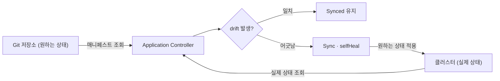
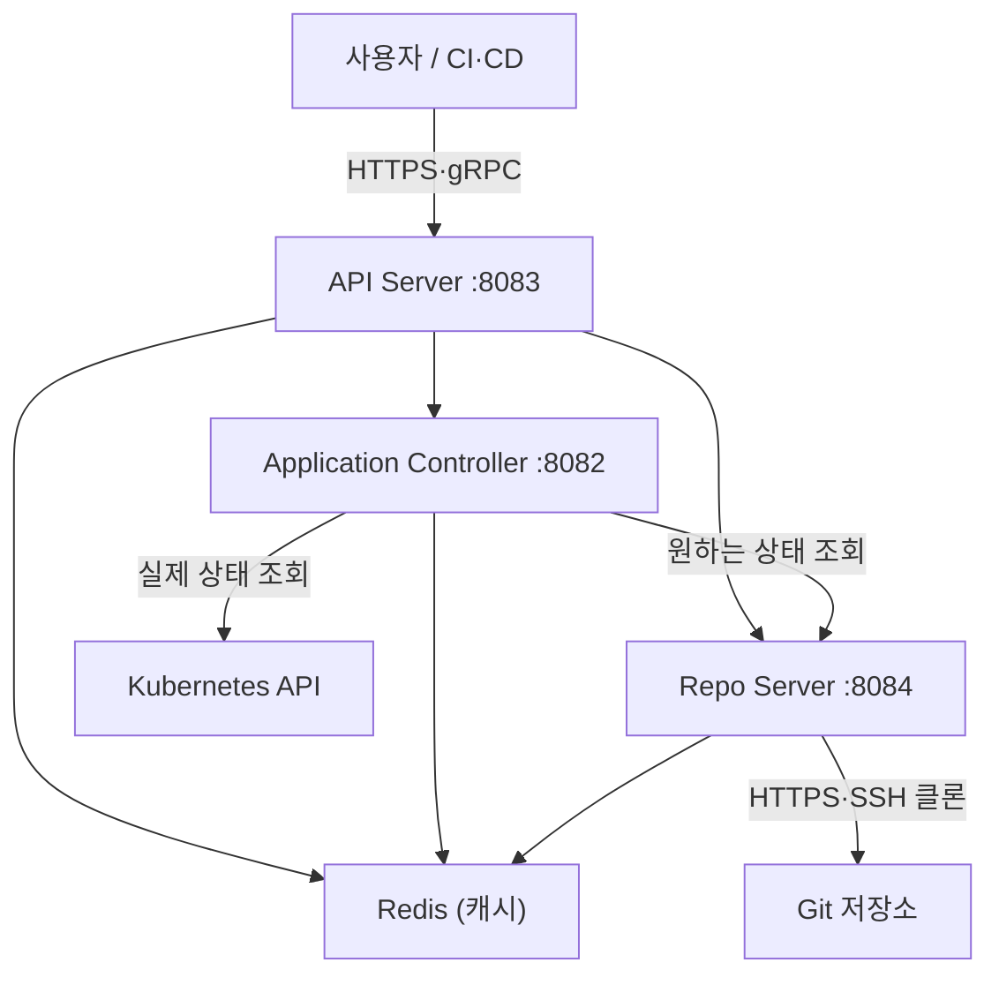
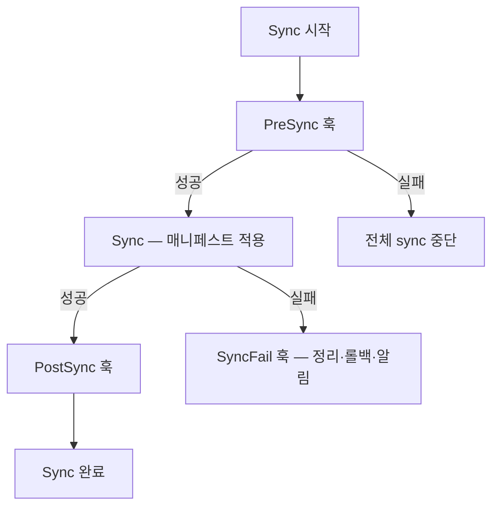



[Argo CD](https://argo-cd.readthedocs.io/en/stable/)는 [Kubernetes](https://kubernetes.io/) 클러스터의 배포를 [Git](https://git-scm.com/) 저장소로 관리하는 선언적(declarative) [GitOps](https://opengitops.dev/) 지속적 배포(Continuous Delivery, CD) 도구입니다. Git에 선언한 매니페스트를 클러스터의 실제 상태와 계속 비교하고 둘이 어긋나면(drift) 자동으로 되돌립니다. 배포 파이프라인을 코드로 선언하고 클러스터 변경 이력을 Git 커밋으로 남기며 수백 개 클러스터·환경을 하나의 제어 지점에서 관리하는 것이 목적입니다. [CNCF](https://www.cncf.io/) Graduated 프로젝트입니다.

핵심 원칙은 세 가지입니다.

- Git이 single source of truth. 저장소의 상태가 곧 클러스터의 원하는 상태입니다.
- 클러스터 상태를 지속적으로 모니터링하고 drift가 생기면 자동 복구합니다.
- 배포 파이프라인 전체를 선언적 YAML로 정의합니다.

세 원칙이 맞물리면 다음과 같은 조정 루프(reconciliation loop)가 됩니다. Application Controller가 Git의 원하는 상태와 클러스터의 실제 상태를 주기적으로 비교하고 어긋나면(drift) 원하는 상태로 되돌립니다.



매니페스트 소스로는 Plain YAML, [Helm](https://helm.sh/) chart, [Kustomize](https://kustomize.io/) overlay, [Jsonnet](https://jsonnet.org/), Config Management Plugin(CMP)을 지원합니다.

> [!NOTE] 전제 지식
> 이 글은 Kubernetes의 기본 리소스(Deployment·Service·Namespace)와 [CustomResourceDefinition(CRD)](https://kubernetes.io/docs/concepts/extend-kubernetes/api-extension/custom-resources/) 개념을 안다고 가정합니다. 등장하는 Argo CD 고유 개념은 첫 등장에 정의합니다.

## 아키텍처 — 7개 컴포넌트

Argo CD는 역할이 분리된 7개 컴포넌트로 동작합니다. 외부 요청 처리, 매니페스트 생성, 상태 비교, 캐시, 인증, Application 자동 생성, 알림을 각각 다른 프로세스가 맡습니다. 부하가 큰 부분(매니페스트 생성·상태 비교)만 따로 스케일할 수 있도록 컴포넌트를 나눈 구조입니다.

### API Server

**타입**: Deployment · **메트릭 포트**: 8083

[gRPC](https://grpc.io/)/REST 인터페이스로 모든 외부 요청(Web UI, CLI, CI/CD 시스템)을 처리합니다. 주요 책임은 다음과 같습니다.

- Application 관리 및 상태 보고
- Sync, Rollback 등 Application 오퍼레이션 실행
- Git webhook 알림 처리 (GitHub, GitLab, Bitbucket)
- RBAC 정책 적용
- Dex 또는 외부 OIDC 프로바이더로 인증 위임
- 자격 증명(Repository·Cluster credentials) 관리
- `argocd` CLI와 통신하는 gRPC 엔드포인트 제공

### Repository Server (repo-server)

**타입**: Deployment · **메트릭 포트**: 8084

Git 저장소를 클론·캐싱하고 Kubernetes 매니페스트를 생성하는 내부 서비스입니다. 주요 책임은 다음과 같습니다.

- Git 저장소 로컬 클론 유지 (기본 3분 폴링 또는 webhook 트리거)
- 입력(repoURL, revision, path, Helm values)으로 최종 K8s 매니페스트 생성
- 생성한 매니페스트를 24시간 동안 Redis에 캐시
- Helm chart 렌더링, Kustomize overlay 처리, Jsonnet 평가
- Config Management Plugin(CMP) 사이드카 실행

성능 튜닝 지점은 세 가지입니다.

- `--parallelismlimit` 플래그로 동시 매니페스트 생성 수를 제한합니다(OOM 방지).
- `TMPDIR` 환경 변수로 Git 클론 디렉토리를 바꿉니다(기본 `/tmp`).
- `ARGOCD_EXEC_TIMEOUT` 기본값은 90초입니다. 복잡한 Helm chart는 이 값을 늘려야 합니다.

### Application Controller

**타입**: StatefulSet (HA 스케일링 지원) · **메트릭 포트**: 8082

핵심 Kubernetes 컨트롤러입니다. Git의 원하는 상태와 클러스터의 실제 상태를 지속적으로 비교합니다. 주요 책임은 다음과 같습니다.

- 애플리케이션 동기화 상태(Synced/OutOfSync) 계산
- 자동 동기화(auto-sync) 트리거
- sync/lifecycle 훅 실행
- 클러스터 정보 업데이트
- OutOfSync 감지 시 자동 복구 (`selfHeal=true`인 경우)

스케일링(HA) 설정은 다음과 같습니다.

- StatefulSet replicas + `ARGOCD_CONTROLLER_REPLICAS` 환경 변수
- 1000개 애플리케이션 기준 `--status-processors 50`, `--operation-processors 25`
- 샤딩 방식: legacy(UID 기반), round-robin, consistent-hashing

### Redis

**타입**: Deployment (HA 모드: Sentinel 3개)

일시적(disposable) 캐시 레이어입니다. 데이터를 잃어도 서비스 중단 없이 재구축할 수 있습니다. [Redis](https://redis.io/)가 캐싱하는 대상은 다음과 같습니다.

- Git 저장소 매니페스트 (24시간 TTL)
- 애플리케이션 상태, 리소스 메타데이터, 동기화 상태
- API Server와 Application Controller 간 통신 버퍼
- Kubernetes API 호출 감소 (rate limit 방지)

HA 구성은 Redis Sentinel 3개로 leader를 선출하며 최소 3 노드가 필요합니다.

### Dex

**타입**: Deployment (선택적) · **포트**: 5558

[Dex](https://dexidp.io/)는 OIDC([OpenID Connect](https://openid.net/developers/how-connect-works/)) 프로바이더입니다. 외부 IdP와 연동해 Argo CD 인증/인가를 처리합니다. 지원 IdP 커넥터는 GitHub, Google, LDAP, SAML 2.0, Microsoft, Okta 등입니다.

```yaml
# argocd-cm ConfigMap의 Dex 설정 예시
data:
  dex.config: |
    connectors:
    - type: github
      id: github
      name: GitHub
      config:
        clientID: $dex.github.clientID
        clientSecret: $dex.github.clientSecret
        orgs:
        - name: my-github-org
          teams:
          - platform-team
          - dev-team
```

Dex 없이 `oidc.config` 키로 argocd-cm에 OIDC를 직접 연동할 수도 있습니다.

### ApplicationSet Controller

**타입**: Deployment · **메트릭 포트**: 8080

ApplicationSet CRD를 읽고 여러 Application 리소스를 자동 생성합니다. 멀티 클러스터·멀티 환경 배포를 선언적으로 관리합니다.

### Notifications Controller

**타입**: Deployment · **메트릭 포트**: 9001

Application 이벤트를 모니터링하고 Slack, PagerDuty, GitHub 등 외부 서비스로 알림을 발송합니다.

### 컴포넌트 통신 흐름

다음 다이어그램은 요청이 컴포넌트 사이를 어떻게 흐르는지 보여줍니다. API Server가 외부 진입점이고 Application Controller가 Git의 원하는 상태와 클러스터의 실제 상태를 양쪽에서 읽어 비교합니다.



> [!NOTE] 서비스 간 통신 암호화
> 모든 서비스 간 통신은 TLS로 암호화됩니다. Redis 통신만 기본적으로 비암호화이며 별도 TLS 설정이 가능합니다.

## Application CRD

Application은 Argo CD의 중심 Kubernetes Custom Resource입니다. "원하는 상태(Git)"와 "배포 대상(클러스터)"을 하나로 묶어 무엇을 어디에 어떻게 동기화할지를 선언합니다.

<details markdown="1">
<summary>전체 Application YAML 예시 (모든 필드 주석 포함) — 펼치기</summary>

```yaml
apiVersion: argoproj.io/v1alpha1
kind: Application
metadata:
  name: my-app
  namespace: argocd
  # Argo CD가 Application 삭제 시 종속 리소스도 함께 삭제
  finalizers:
    - resources-finalizer.argocd.argoproj.io
  labels:
    team: backend
    env: production
spec:
  # 소속 AppProject (격리 단위)
  project: team-backend

  # ── 소스 (Git 저장소) ──────────────────────────────────────────
  source:
    repoURL: https://github.com/myorg/k8s-manifests.git
    # 브랜치명, 태그, 커밋 SHA, HEAD 모두 가능
    targetRevision: main
    # Git 저장소 내 경로
    path: apps/my-app/overlays/production

  # Helm chart 소스 예시 (path 대신 chart 사용)
  # source:
  #   repoURL: https://charts.example.com
  #   chart: my-chart
  #   targetRevision: "1.2.3"
  #   helm:
  #     releaseName: my-release
  #     valueFiles:
  #       - values-production.yaml
  #     values: |
  #       replicaCount: 3
  #     parameters:
  #       - name: image.tag
  #         value: "v2.0.0"

  # ── 배포 대상 ───────────────────────────────────────────────────
  destination:
    # 로컬 클러스터: https://kubernetes.default.svc
    server: https://kubernetes.default.svc
    # 또는 name: in-cluster (server와 name은 둘 중 하나만 사용)
    namespace: my-app-production

  # ── 동기화 정책 ─────────────────────────────────────────────────
  syncPolicy:
    automated:
      # Git에 없는 리소스는 클러스터에서 제거
      prune: true
      # 클러스터에서 직접 변경된 상태를 Git 상태로 되돌림
      selfHeal: true
      # 모든 리소스 삭제 허용 (allowEmpty: false가 기본 - 실수 방지)
      allowEmpty: false

    syncOptions:
      # 네임스페이스 자동 생성
      - CreateNamespace=true
      # 대규모 리소스에 server-side apply 사용 (annotation 크기 제한 우회)
      - ServerSideApply=true
      # out-of-sync 리소스만 적용 (성능 최적화)
      - ApplyOutOfSyncOnly=true
      # ignoreDifferences를 sync 단계에도 적용
      - RespectIgnoreDifferences=true
      # 리소스 삭제 시 foreground cascading 방식 사용
      - PrunePropagationPolicy=foreground
      # 다른 리소스가 모두 healthy 된 후에 prune
      - PruneLast=true

    # 네임스페이스 메타데이터 관리 (CreateNamespace=true 필요)
    managedNamespaceMetadata:
      labels:
        team: backend
        environment: production
      annotations:
        contact: team-backend@company.com

    # 동기화 실패 시 재시도
    retry:
      limit: 5
      backoff:
        duration: 5s
        factor: 2
        maxDuration: 3m

  # ── Diff 무시 설정 ───────────────────────────────────────────────
  ignoreDifferences:
    # HPA가 관리하는 replicas 무시
    - group: apps
      kind: Deployment
      jsonPointers:
        - /spec/replicas
    # 사이드카 injector가 추가한 컨테이너 무시
    - group: apps
      kind: Deployment
      jqPathExpressions:
        - .spec.template.spec.initContainers[] | select(.name == "istio-init")
    # 특정 컨트롤러의 managedFields 무시
    - group: "*"
      kind: "*"
      managedFieldsManagers:
        - kube-controller-manager

  # ── 리비전 이력 제한 ─────────────────────────────────────────────
  revisionHistoryLimit: 10
```

</details>

> [!WARNING] 자동 동기화의 파괴적 동작
> `automated` 정책에서 `prune: true`는 Git에서 사라진 리소스를 클러스터에서 삭제하고 `selfHeal: true`는 클러스터의 수동 변경을 Git 상태로 되돌립니다. 운영 리소스를 Git에서 실수로 지우면 그대로 삭제되므로, 도입 초기에는 `prune: false`로 동작을 확인한 뒤 켜는 것이 안전합니다.

### 멀티 소스 (Multi-Source) Application

Argo CD v2.6+에서는 여러 Git 저장소/Helm 소스를 하나의 Application에 합칠 수 있습니다. 한 소스의 Helm values를 다른 소스의 파일로 override하는 것도 가능합니다.

```yaml
spec:
  sources:
    - repoURL: https://charts.bitnami.com/bitnami
      chart: postgresql
      targetRevision: "12.1.3"
      helm:
        releaseName: postgresql
    - repoURL: https://github.com/myorg/k8s-manifests.git
      targetRevision: main
      path: apps/postgresql/config
      # 첫 번째 소스의 Helm values를 이 소스의 파일로 override
      ref: postgresql-config
```

## Sync 단계·훅·Wave

동기화는 정해진 단계(Phase)를 순서대로 밟습니다. 각 단계에 훅(hook)을 걸고 Wave 숫자로 리소스 적용 순서를 조정하면, "DB 마이그레이션 먼저 → 배포 → 알림" 같은 순차 배포를 선언으로 제어할 수 있습니다.

### Sync Phase

Phase는 매니페스트를 적용하기 전후로 훅을 끼워 넣는 지점입니다. 실패 시 동작이 단계마다 다릅니다.

| Phase | 실행 시점 | 실패 시 동작 |
|---|---|---|
| **PreSync** | 매니페스트 적용 직전 | 전체 sync 중단 |
| **Sync** | 매니페스트 적용과 동시에 | 전체 sync 실패 |
| **PostSync** | 모든 리소스 Healthy 후 | 이전 단계 성공 시에만 실행 |
| **SyncFail** | Sync 실패 시 | 정리/롤백/알림용 |
| **Skip** | 매니페스트에 적용 제외 표시 | — |
| **PreDelete** | Application 삭제 직전 | 삭제 중단 |
| **PostDelete** | 모든 리소스 삭제 후 | — |

배포 시 밟는 세 단계(PreSync → Sync → PostSync)와 실패 경로는 다음과 같습니다.



훅은 리소스의 annotation으로 선언합니다.

```yaml
metadata:
  annotations:
    argocd.argoproj.io/hook: PreSync
    argocd.argoproj.io/hook-delete-policy: HookSucceeded
```

### 훅 예시 — DB 마이그레이션

Sync 직전에 마이그레이션 Job을 돌리고 성공하면 Job을 자동 삭제하는 예시입니다. `sync-wave: "-1"`로 다른 PreSync 훅보다 먼저 실행합니다.

```yaml
apiVersion: batch/v1
kind: Job
metadata:
  name: db-migrate
  annotations:
    # Sync 전에 실행
    argocd.argoproj.io/hook: PreSync
    # 성공하면 Job 자동 삭제
    argocd.argoproj.io/hook-delete-policy: HookSucceeded
    # wave -1: 다른 PreSync 훅들보다 먼저
    argocd.argoproj.io/sync-wave: "-1"
spec:
  template:
    spec:
      containers:
      - name: migrate
        image: my-app:latest
        command: ["./migrate.sh"]
      restartPolicy: Never
  backoffLimit: 3
```

### Sync Wave — 순서 제어

Wave는 동일 Phase 내에서 리소스 적용 순서를 정수로 제어합니다.

- 낮은 wave → 높은 wave 순으로 적용합니다(음수 → 0 → 양수).
- 동일 wave는 병렬로 적용합니다.
- 각 wave 사이 기본 2초를 대기합니다(`ARGOCD_SYNC_WAVE_DELAY` 환경변수로 조정).

적용 우선순위는 **Phase → Wave → Kubernetes 리소스 종류 → 리소스 이름** 순입니다.

```yaml
# Wave 예시: CRD → Namespace → ConfigMap → Deployment 순으로 배포
---
# Wave -2: CRD 먼저
apiVersion: apiextensions.k8s.io/v1
kind: CustomResourceDefinition
metadata:
  annotations:
    argocd.argoproj.io/sync-wave: "-2"
---
# Wave -1: Namespace
apiVersion: v1
kind: Namespace
metadata:
  annotations:
    argocd.argoproj.io/sync-wave: "-1"
---
# Wave 0 (기본): ConfigMap
apiVersion: v1
kind: ConfigMap
---
# Wave 5: Deployment (ConfigMap 적용 후 실행)
apiVersion: apps/v1
kind: Deployment
metadata:
  annotations:
    argocd.argoproj.io/sync-wave: "5"
---
# Wave 10: Ingress (Deployment healthy 후 공개)
apiVersion: networking.k8s.io/v1
kind: Ingress
metadata:
  annotations:
    argocd.argoproj.io/sync-wave: "10"
```

### 훅 삭제 정책 (hook-delete-policy)

훅 리소스를 언제 정리할지 결정하는 정책입니다.

| 정책 | 동작 |
|---|---|
| `HookSucceeded` | 훅 성공 시 리소스 삭제 |
| `HookFailed` | 훅 실패 시 리소스 삭제 |
| `BeforeHookCreation` | 새 훅 생성 전 기존 리소스 삭제 (기본값) |

### PostSync 알림 훅

모든 리소스가 Healthy가 된 뒤 외부로 알림을 쏘는 PostSync 훅 예시입니다.

```yaml
apiVersion: batch/v1
kind: Job
metadata:
  name: notify-deploy-success
  annotations:
    argocd.argoproj.io/hook: PostSync
    argocd.argoproj.io/hook-delete-policy: HookSucceeded
spec:
  template:
    spec:
      containers:
      - name: notify
        image: curlimages/curl:latest
        command:
        - curl
        - -X
        - POST
        - -H
        - "Content-Type: application/json"
        - -d
        - '{"text": "Deployment completed successfully!"}'
        - $(SLACK_WEBHOOK_URL)
        env:
        - name: SLACK_WEBHOOK_URL
          valueFrom:
            secretKeyRef:
              name: slack-secret
              key: webhook-url
      restartPolicy: Never
```

## 헬스 평가 (Health Assessment)

Argo CD는 배포한 리소스가 실제로 정상 동작하는지를 6가지 상태로 판정합니다. 이 판정으로 "동기화는 됐지만 Pod가 죽는" 상황을 구분하고 PostSync 훅·알림·Progressive Sync의 진행 여부를 결정합니다.

### 6가지 헬스 상태

| 상태 | 의미 | 예시 상황 |
|---|---|---|
| **Healthy** | 정상 동작 중 | Deployment가 원하는 replicas에 도달 |
| **Progressing** | 아직 준비 중이나 진행 중 | Deployment rolling update 중 |
| **Degraded** | 오류 발생 | Pod CrashLoopBackOff |
| **Suspended** | 일시 중지, 외부 이벤트 대기 | CronJob 일시 중지, Argo CD sync 중지 |
| **Missing** | 클러스터에 존재하지 않음 | 리소스가 아직 생성되지 않음 |
| **Unknown** | 헬스 체크 불가 | 커스텀 리소스에 헬스 체크 없음 |

Application 전체 상태를 계산할 때는 나쁜 상태가 우선합니다. 우선순위는 **Healthy < Suspended < Progressing < Missing < Degraded < Unknown** 순으로, 한 리소스라도 Degraded면 Application 전체가 Degraded로 집계됩니다.

### 리소스 타입별 내장 헬스 체크

기본 제공되는 리소스 타입은 다음 기준으로 판정합니다.

- **Deployment / ReplicaSet / StatefulSet / DaemonSet**: `observedGeneration == desiredGeneration`이고 `updatedReplicas == desiredReplicas`이면 Healthy, 업데이트 진행 중이면 Progressing.
- **Service (LoadBalancer)**: `status.loadBalancer.ingress`에 hostname 또는 IP가 있으면 Healthy.
- **Ingress**: `status.loadBalancer.ingress` 리스트가 비어 있지 않으면 Healthy.
- **PersistentVolumeClaim**: `status.phase == "Bound"`이면 Healthy.
- **Job**: 완료되면 Healthy, 실패하면 Degraded, `.spec.suspended == true`이면 Suspended.
- **CronJob**: 마지막 Job 실패면 Degraded, 마지막 Job 실행 중이면 Progressing.

<details markdown="1">
<summary>커스텀 Lua 헬스 체크 예시 (cert-manager·커스텀 CR) — 펼치기</summary>

내장 체크가 없는 CRD는 [Lua](https://www.lua.org/) 스크립트로 헬스 체크를 정의합니다. `argocd-cm` ConfigMap에 리소스별 로직을 등록합니다. 아래는 [cert-manager](https://cert-manager.io/)의 Certificate와 커스텀 Operator CR에 헬스 체크를 다는 예시입니다.

```yaml
# argocd-cm ConfigMap
data:
  # cert-manager Certificate 헬스 체크
  resource.customizations.health.cert-manager.io_Certificate: |
    hs = {}
    if obj.status ~= nil then
      if obj.status.conditions ~= nil then
        for i, condition in ipairs(obj.status.conditions) do
          if condition.type == "Ready" then
            if condition.status == "False" then
              hs.status = "Degraded"
              hs.message = condition.message
              return hs
            end
            if condition.status == "True" then
              hs.status = "Healthy"
              hs.message = condition.message
              return hs
            end
          end
        end
      end
    end
    hs.status = "Progressing"
    hs.message = "Waiting for certificate to be issued"
    return hs

  # 커스텀 Operator의 MyApp CR 헬스 체크
  resource.customizations.health.mycompany.io_MyApp: |
    hs = {}
    if obj.status ~= nil and obj.status.phase ~= nil then
      if obj.status.phase == "Running" then
        hs.status = "Healthy"
        hs.message = "Application is running"
      elseif obj.status.phase == "Failed" then
        hs.status = "Degraded"
        hs.message = obj.status.message or "Application failed"
      else
        hs.status = "Progressing"
        hs.message = "Application is " .. obj.status.phase
      end
    else
      hs.status = "Unknown"
      hs.message = "Status not available"
    end
    return hs
```

</details>

## App of Apps와 ApplicationSet

수백 개의 Application을 손으로 관리하지 않기 위한 두 가지 패턴입니다. App of Apps는 부모 Application이 자식 YAML을 배포하는 계층 구조이고 ApplicationSet은 Generator가 목록(클러스터·디렉토리·파일)을 읽어 Application을 자동 생성합니다.

### App of Apps 패턴

부모 Application이 자식 Application들을 배포하는 계층적 패턴입니다. 부모의 `path`에 자식 Application YAML 파일들을 두면, 부모를 sync할 때 자식들이 함께 배포됩니다.

```yaml
# 부모 Application: 여러 팀의 앱을 관리
apiVersion: argoproj.io/v1alpha1
kind: Application
metadata:
  name: root-app
  namespace: argocd
spec:
  project: default
  source:
    repoURL: https://github.com/myorg/gitops-root.git
    targetRevision: main
    path: apps  # 이 경로 안에 여러 Application YAML 파일 존재
  destination:
    server: https://kubernetes.default.svc
    namespace: argocd  # Application CR은 argocd 네임스페이스에 배포
  syncPolicy:
    automated:
      prune: true
      selfHeal: true
```

```
gitops-root/
└── apps/
    ├── team-frontend.yaml   # Application CR
    ├── team-backend.yaml    # Application CR
    ├── team-data.yaml       # Application CR
    └── monitoring.yaml      # Application CR
```

장점은 단순하고 직관적이라는 점입니다. 단점은 파일을 수동으로 추가/삭제해야 하고 수백 개 앱에서는 반복 코드가 많아진다는 점입니다.

### ApplicationSet

ApplicationSet Controller가 단일 YAML로 여러 Application을 자동 생성·관리합니다. `generators`가 파라미터 목록을 만들고 `template`이 그 파라미터를 채워 Application을 찍어냅니다.

```yaml
apiVersion: argoproj.io/v1alpha1
kind: ApplicationSet
metadata:
  name: my-applicationset
  namespace: argocd
spec:
  # 동시 Application 생성 수 제한
  syncPolicy:
    applicationsSync: create-update  # 또는 create-only, create-delete
  generators:
    - <generator 설정>
  template:
    metadata:
      name: '{{.name}}'
    spec:
      project: default
      source:
        repoURL: '{{.repoURL}}'
        targetRevision: main
        path: '{{.path}}'
      destination:
        server: '{{.server}}'
        namespace: '{{.namespace}}'
      syncPolicy:
        automated:
          prune: true
          selfHeal: true
```

<details markdown="1">
<summary>Generator 종류별 상세 예시 (Cluster·Git Directory·Git File·Matrix·List) — 펼치기</summary>

Generator는 목록의 출처가 다른 여러 종류가 있습니다.

**Cluster Generator** — 등록된 클러스터 목록에서 Application을 생성합니다.

```yaml
generators:
  - clusters:
      selector:
        matchLabels:
          environment: production
        matchExpressions:
          - key: region
            operator: In
            values: [ap-northeast-2, us-east-1]
      values:
        revision: stable
```

생성되는 파라미터: `{{.name}}`, `{{.server}}`, `{{.metadata.labels.<key>}}`, `{{.metadata.annotations.<key>}}`.

**Git Directory Generator** — Git 저장소의 디렉토리 구조로 Application을 생성합니다. 제외 규칙이 포함 규칙보다 우선합니다.

```yaml
generators:
  - git:
      repoURL: https://github.com/myorg/k8s-manifests.git
      revision: HEAD
      directories:
        # apps/ 하위 모든 디렉토리
        - path: "apps/*"
        # 특정 디렉토리 제외 (제외 규칙이 포함 규칙보다 우선)
        - path: "apps/deprecated"
          exclude: true
```

생성되는 파라미터: `{{.path.path}}`, `{{.path.basename}}`, `{{.path.basenameNormalized}}`, `{{index .path.segments 0}}`.

**Git File Generator** — JSON/YAML 파일 내용을 플랫 파라미터로 변환합니다.

```yaml
generators:
  - git:
      repoURL: https://github.com/myorg/fleet-config.git
      revision: HEAD
      files:
        - path: "clusters/**/config.yaml"
```

```yaml
# clusters/prod-seoul/config.yaml
cluster:
  name: prod-seoul
  region: ap-northeast-2
  environment: production
app:
  version: "1.5.0"
  replicas: 3
```

위 파일은 `{{.cluster.name}}`, `{{.cluster.region}}`, `{{.app.version}}` 파라미터로 변환됩니다.

**Matrix Generator** — 두 Generator의 곱집합으로 모든 경우의 수를 생성합니다. 3개 환경 × 5개 앱 = 15개 Application을 선언 하나로 관리할 수 있습니다.

```yaml
# 예: 3개 환경 × 5개 앱 = 15개 Application 자동 생성
generators:
  - matrix:
      generators:
        # Git 디렉토리로 앱 목록 수집
        - git:
            repoURL: https://github.com/myorg/apps.git
            revision: HEAD
            directories:
              - path: "services/*"
        # 클러스터로 환경 목록 수집
        - clusters:
            selector:
              matchLabels:
                argocd.argoproj.io/secret-type: cluster
template:
  metadata:
    name: '{{.path.basename}}-{{.name}}'
  spec:
    destination:
      server: '{{.server}}'
      namespace: '{{.path.basename}}'
```

Matrix Generator의 제약: 자식 Generator는 정확히 2개여야 하고 Merge Generator와 중첩해서 쓸 수 없습니다.

**List Generator** — 하드코딩된 목록으로 Application을 생성합니다. 테스트·소규모에 적합합니다.

```yaml
generators:
  - list:
      elements:
        - cluster: dev
          url: https://dev-cluster.example.com
          namespace: my-app-dev
        - cluster: staging
          url: https://staging-cluster.example.com
          namespace: my-app-staging
        - cluster: production
          url: https://prod-cluster.example.com
          namespace: my-app-prod
```

</details>

## Diff 전략

Diff는 Git의 원하는 상태와 클러스터의 실제 상태가 어디서 다른지를 계산하는 단계입니다. 계산 방식에 따라 불필요한 OutOfSync가 줄고 동기화 전에 검증 오류를 미리 잡을 수 있습니다.

### 3가지 Diff 전략

| 전략 | 상태 | 설명 | 활성화 방법 |
|---|---|---|---|
| **Legacy** | 기본값 | 3-way diff (live state + desired state + last-applied-configuration annotation) | 별도 설정 불필요 |
| **Structured-Merge Diff** | 지원 중단 | SMD 라이브러리 기반, CRD 기본값 처리 문제로 폐기 | — |
| **Server-Side Diff** | Stable (v3.1.0+) | [Server-Side Apply](https://kubernetes.io/docs/reference/using-api/server-side-apply/) dry-run 모드 실행 | 아래 참조 |

### Server-Side Diff 활성화

전역으로 켜려면 `argocd-cmd-params-cm`을 설정하고 Application Controller를 재시작합니다.

```yaml
apiVersion: v1
kind: ConfigMap
metadata:
  name: argocd-cmd-params-cm
  namespace: argocd
data:
  controller.diff.server.side: "true"
```

Application별로 켜려면 annotation을 답니다.

```yaml
metadata:
  annotations:
    argocd.argoproj.io/compare-options: ServerSideDiff=true
```

Server-Side Diff의 장점은 다음과 같습니다.

- Admission Webhook이 diff 계산에 참여합니다. sync 단계가 아닌 diff 단계에서 validation 오류를 조기에 발견합니다.
- `managedFields` 기반으로 더 정확한 diff를 계산합니다.
- `ignoreDifferences` 설정이 더 적게 필요합니다.
- 결과를 캐시해 성능을 높입니다.

<details markdown="1">
<summary>ignoreDifferences 상세 설정 (Application·시스템 레벨) — 펼치기</summary>

특정 필드의 차이를 무시해 불필요한 OutOfSync를 없애는 설정입니다. [HPA](https://kubernetes.io/docs/tasks/run-application/horizontal-pod-autoscale/)가 관리하는 replicas, 사이드카 injector가 추가한 컨테이너, 특정 컨트롤러의 managedFields 등이 대상입니다.

Application 레벨:

```yaml
spec:
  ignoreDifferences:
    # JSON Pointer로 특정 필드 무시
    - group: apps
      kind: Deployment
      jsonPointers:
        - /spec/replicas    # HPA 관리 필드
        - /metadata/labels/pod-template-hash

    # JQ 표현식으로 동적 조건 무시
    - group: apps
      kind: Deployment
      jqPathExpressions:
        - .spec.template.spec.initContainers[] | select(.name == "istio-init")
        - .spec.template.spec.containers[] | select(.name == "sidecar")

    # 특정 컨트롤러의 managedFields 변경 무시
    - group: "*"
      kind: "*"
      managedFieldsManagers:
        - kube-controller-manager
        - eks.amazonaws.com

    # 슬래시 포함 키 이스케이프 (~ → ~0, / → ~1)
    - group: ""
      kind: Node
      jsonPointers:
        - /metadata/labels/node-role.kubernetes.io~1master
```

시스템 레벨(모든 Application에 적용)은 `argocd-cm`에 등록합니다.

```yaml
# argocd-cm ConfigMap
data:
  # MutatingWebhookConfiguration의 caBundle 무시
  resource.customizations.ignoreDifferences.admissionregistration.k8s.io_MutatingWebhookConfiguration: |
    jqPathExpressions:
    - '.webhooks[]?.clientConfig.caBundle'

  # 모든 리소스에 적용 (전역)
  resource.customizations.ignoreDifferences.all: |
    managedFieldsManagers:
    - kube-controller-manager
    jsonPointers:
    - /spec/replicas
```

</details>

### managedNamespaceMetadata

`CreateNamespace=true` syncOption과 함께 쓰면, Argo CD가 생성하는 네임스페이스에 레이블/어노테이션을 자동으로 관리합니다. [Pod Security Standards](https://kubernetes.io/docs/concepts/security/pod-security-standards/), 팀 소유권 태그, 비용 센터 같은 메타데이터를 선언으로 붙입니다.

```yaml
spec:
  syncPolicy:
    syncOptions:
      - CreateNamespace=true
    managedNamespaceMetadata:
      labels:
        # Pod Security Standards 적용
        pod-security.kubernetes.io/enforce: restricted
        # 팀 소유권 태그
        team: backend
        cost-center: "12345"
      annotations:
        contact: team-backend@company.com
        # 네임스페이스 소유권을 Argo CD가 트래킹
        argocd.argoproj.io/managed-by: argocd
```

> [!WARNING] 네임스페이스 소유권
> `managedNamespaceMetadata`를 설정하면 Argo CD가 해당 네임스페이스의 owner가 됩니다. 수동으로 추가한 레이블/어노테이션은 다음 sync 때 Argo CD가 덮어씁니다.

## AppProject와 RBAC

AppProject는 Application을 팀 단위로 격리하는 멀티테넌시의 기본 단위입니다. 허용 소스·배포 대상·리소스 종류·배포 시간대·역할을 하나로 묶고 [Casbin](https://casbin.org/) 정책으로 세밀한 권한을 겁니다.

<details markdown="1">
<summary>AppProject CRD 전체 예시 (소스·대상·리소스·역할·SyncWindow) — 펼치기</summary>

Application을 논리적으로 그룹화하고 접근을 제어합니다. 아래 예시는 허용 저장소, 허용 배포 대상, 클러스터 리소스 화이트리스트, 네임스페이스 리소스 블랙리스트, 역할, Sync Window를 모두 담고 있습니다.

```yaml
apiVersion: argoproj.io/v1alpha1
kind: AppProject
metadata:
  name: team-backend
  namespace: argocd
  finalizers:
    - resources-finalizer.argocd.argoproj.io
spec:
  description: "백엔드 팀 프로젝트"

  # ── 허용 소스 저장소 ──────────────────────────────────────────
  sourceRepos:
    # 특정 조직의 모든 저장소 허용
    - "https://github.com/myorg/*"
    # SSH 저장소 명시적 차단 (! 접두사 = 부정)
    - "!ssh://git@github.com:myorg/secret-repo"

  # ── 허용 배포 대상 ──────────────────────────────────────────────
  destinations:
    # 로컬 클러스터의 backend-* 네임스페이스
    - namespace: "backend-*"
      server: https://kubernetes.default.svc
    # 원격 스테이징 클러스터
    - namespace: "staging"
      server: https://staging-k8s.example.com
    # kube-system 명시적 차단
    - namespace: "!kube-system"
      server: "*"

  # ── 클러스터 수준 리소스 허용 목록 ────────────────────────────
  clusterResourceWhitelist:
    # Namespace 생성 허용
    - group: ""
      kind: Namespace
    # RBAC 리소스 허용
    - group: "rbac.authorization.k8s.io"
      kind: ClusterRole
    - group: "rbac.authorization.k8s.io"
      kind: ClusterRoleBinding

  # ── 네임스페이스 수준 리소스 블랙리스트 ────────────────────────
  namespaceResourceBlacklist:
    # ResourceQuota 직접 생성 금지 (플랫폼 팀만 관리)
    - group: ""
      kind: ResourceQuota
    - group: ""
      kind: LimitRange

  # ── 프로젝트 레벨 RBAC 역할 ─────────────────────────────────────
  roles:
    - name: developer
      description: "개발자: 읽기 + 동기화만 허용"
      policies:
        - p, proj:team-backend:developer, applications, get, team-backend/*, allow
        - p, proj:team-backend:developer, applications, sync, team-backend/*, allow
        # 운영 환경 삭제 금지
        - p, proj:team-backend:developer, applications, delete, team-backend/*, deny
      groups:
        - github:myorg/backend-developers   # SSO 그룹 매핑

    - name: lead
      description: "팀 리더: 모든 권한"
      policies:
        - p, proj:team-backend:lead, applications, *, team-backend/*, allow
      groups:
        - github:myorg/backend-leads

  # ── 동기화 창 (Sync Window) ────────────────────────────────────
  syncWindows:
    # 운영 환경: 매일 오전 2-4시만 자동 sync 허용
    - kind: allow
      schedule: "0 2 * * *"   # cron 형식
      duration: 2h
      applications:
        - "*-production"
      namespaces:
        - "backend-production"
      clusters:
        - "https://prod-k8s.example.com"
      manualSync: false  # 수동 sync도 금지
    # 긴급 패치: 언제든지 수동 sync 허용
    - kind: allow
      schedule: "* * * * *"
      duration: 1h
      applications:
        - "*-hotfix"
      manualSync: true

  # ── 프로젝트 소속 클러스터/저장소만 허용 ──────────────────────
  permitOnlyProjectScopedClusters: false
```

</details>

### 전역 RBAC 설정

인스턴스 전체에 적용되는 역할과 그룹 매핑은 `argocd-rbac-cm`에 정의합니다. 정책 형식은 Casbin입니다.

```yaml
apiVersion: v1
kind: ConfigMap
metadata:
  name: argocd-rbac-cm
  namespace: argocd
data:
  # 기본 정책: 전체 읽기 전용
  policy.default: role:readonly

  # 커스텀 정책 (Casbin 형식)
  policy.csv: |
    # 역할 정의
    p, role:admin, *, *, *, allow
    p, role:readonly, applications, get, */*, allow
    p, role:readonly, clusters, get, *, allow
    p, role:readonly, repositories, get, *, allow

    # 팀별 역할 정의
    p, role:backend-admin, applications, *, team-backend/*, allow
    p, role:backend-admin, applicationsets, *, team-backend/*, allow
    p, role:backend-developer, applications, get, team-backend/*, allow
    p, role:backend-developer, applications, sync, team-backend/*, allow

    # 특정 사용자에게 직접 역할 부여
    g, alice@company.com, role:admin
    g, bob@company.com, role:backend-admin

    # SSO 그룹에 역할 부여 (github.com의 경우: github:orgname/teamname)
    g, github:myorg/platform-team, role:admin
    g, github:myorg/backend-team, role:backend-developer

  # OIDC 스코프 설정 (groups 클레임 요청)
  scopes: '[groups, email]'

  # 익명 사용자 접근 허용 여부
  users.anonymous.enabled: "false"
```

RBAC 정책 문법은 두 종류입니다.

```
p, <대상>, <리소스>, <액션>, <객체>, <효과>
g, <사용자/그룹>, <역할>
```

- **리소스 종류**: `applications`, `applicationsets`, `clusters`, `repositories`, `projects`, `accounts`, `certificates`, `gpgkeys`, `logs`, `exec`, `extensions`
- **액션 종류**: `get`, `create`, `update`, `delete`, `sync`, `action`, `override`(applications), `invoke`(extensions)
- **객체 형식**: `<project>/<app-name>`(applications), `*`(와일드카드)

정책은 CLI로 검증·테스트합니다.

```bash
# 정책 문법 검증
argocd admin settings rbac validate --policy-file policy.csv

# 특정 권한 테스트
argocd admin settings rbac can alice applications get team-backend/my-app
```

### SSO Dex 설정 (GitHub OAuth)

GitHub 조직과 팀을 그룹으로 매핑하는 Dex 커넥터 예시입니다. 자격 증명은 `argocd-secret`에 저장합니다.

```yaml
# argocd-cm ConfigMap
data:
  url: https://argocd.company.com
  dex.config: |
    connectors:
    - type: github
      id: github
      name: GitHub
      config:
        clientID: $dex.github.clientID
        clientSecret: $dex.github.clientSecret
        orgs:
        - name: myorg
        # 팀 클레임 포함 요청
        loadAllGroups: false
        teamNameField: slug
        useLoginAsID: false
```

```yaml
# argocd-secret에 OAuth 자격 증명 저장
apiVersion: v1
kind: Secret
metadata:
  name: argocd-secret
  namespace: argocd
stringData:
  dex.github.clientID: "your-client-id"
  dex.github.clientSecret: "your-client-secret"
```

## Notifications

Notifications Controller는 Application 이벤트를 감시해 Slack·PagerDuty·GitHub 같은 외부 채널로 알림을 보냅니다. 서비스·트리거·템플릿·구독 네 요소로 "언제·무엇을·어디로" 보낼지 선언합니다.

### 아키텍처 구성요소

| 구성요소 | 역할 |
|---|---|
| **서비스(Service)** | 알림 발송 채널 (Slack, PagerDuty, GitHub 등) |
| **트리거(Trigger)** | 알림 발송 조건 정의 |
| **템플릿(Template)** | 알림 메시지 내용 정의 |
| **구독(Subscription)** | Application과 트리거를 연결 |

<details markdown="1">
<summary>argocd-notifications-cm 전체 설정 (서비스·트리거·템플릿) — 펼치기</summary>

서비스·트리거·템플릿을 한 ConfigMap에 정의합니다. 아래는 Slack·PagerDuty·GitHub 서비스, sync 성공/실패/헬스/배포 트리거, 메시지 템플릿을 담은 예시입니다.

```yaml
apiVersion: v1
kind: ConfigMap
metadata:
  name: argocd-notifications-cm
  namespace: argocd
data:
  # ── Slack 서비스 설정 ────────────────────────────────────────
  service.slack: |
    token: $slack-token
    username: ArgoCD Bot
    icon: ":argo:"

  # ── PagerDuty 서비스 설정 ───────────────────────────────────
  service.pagerdutyv2: |
    serviceKeys:
      my-service: $pagerduty-key

  # ── GitHub 서비스 설정 (커밋 상태 업데이트) ─────────────────
  service.github: |
    appID: $github-app-id
    installationID: $github-installation-id
    privateKey: $github-private-key

  # ── 트리거 정의 ──────────────────────────────────────────────
  trigger.on-sync-succeeded: |
    - when: app.status.operationState.phase in ['Succeeded']
      oncePer: app.status.sync.revision
      send: [app-sync-succeeded]

  trigger.on-sync-failed: |
    - when: app.status.operationState.phase in ['Error', 'Failed']
      oncePer: app.status.operationState.startedAt
      send: [app-sync-failed]

  trigger.on-health-degraded: |
    - when: app.status.health.status == 'Degraded'
      oncePer: app.status.operationState.startedAt
      send: [app-health-degraded]

  trigger.on-deployed: |
    - when: >
        app.status.operationState != nil and
        app.status.operationState.phase == 'Succeeded' and
        app.status.health.status == 'Healthy'
      oncePer: app.status.sync.revision
      send: [app-deployed]

  # ── 메시지 템플릿 ────────────────────────────────────────────
  template.app-sync-succeeded: |
    message: |
      {{if eq .serviceType "slack"}}:white_check_mark:{{end}}
      Application {{.app.metadata.name}} sync 완료
      Status: {{.app.status.sync.status}}
      Revision: {{.app.status.sync.revision | truncate 7}}
    slack:
      attachments: |
        [{
          "title": "{{.app.metadata.name}}",
          "title_link": "{{.context.argocdUrl}}/applications/{{.app.metadata.name}}",
          "color": "#18be52",
          "fields": [
            {"title": "Sync Status", "value": "{{.app.status.sync.status}}", "short": true},
            {"title": "Health", "value": "{{.app.status.health.status}}", "short": true}
          ]
        }]

  template.app-sync-failed: |
    message: |
      {{if eq .serviceType "slack"}}:x:{{end}}
      Application {{.app.metadata.name}} sync 실패
      {{.app.status.operationState.message}}
    slack:
      attachments: |
        [{
          "title": "{{.app.metadata.name}} Sync Failed",
          "title_link": "{{.context.argocdUrl}}/applications/{{.app.metadata.name}}",
          "color": "#E96D76",
          "fields": [
            {"title": "Error", "value": "{{.app.status.operationState.message}}", "short": false}
          ]
        }]

  template.app-deployed: |
    github:
      repoURLPath: "{{.app.spec.source.repoURL}}"
      revisionPath: "{{.app.status.operationState.syncResult.revision}}"
      status:
        state: success
        label: "continuous-delivery/argocd"
        targetURL: "{{.context.argocdUrl}}/applications/{{.app.metadata.name}}"
```

</details>

### Application 구독 설정

Application의 annotation으로 어떤 트리거를 어떤 채널로 받을지 구독합니다.

```yaml
# Application 어노테이션으로 구독
apiVersion: argoproj.io/v1alpha1
kind: Application
metadata:
  name: my-app
  annotations:
    # sync 성공 시 Slack #deployments 채널로 알림
    notifications.argoproj.io/subscribe.on-sync-succeeded.slack: deployments
    # sync 실패 시 PagerDuty 인시던트 생성
    notifications.argoproj.io/subscribe.on-sync-failed.pagerdutyv2: my-service
    # 배포 완료 시 GitHub 커밋 상태 업데이트
    notifications.argoproj.io/subscribe.on-deployed.github: ""
    # health degraded 시 Slack #alerts 채널
    notifications.argoproj.io/subscribe.on-health-degraded.slack: alerts
```

### 기본 제공 트리거 목록

Argo CD Notifications에 내장된 트리거는 다음과 같습니다.

- `on-created` — Application 생성 시
- `on-deleted` — Application 삭제 시
- `on-deployed` — 성공적 배포 완료 시
- `on-health-degraded` — 헬스 상태가 Degraded로 변경 시
- `on-sync-failed` — 동기화 실패 시
- `on-sync-running` — 동기화 실행 중
- `on-sync-status-unknown` — 동기화 상태 Unknown으로 변경 시
- `on-sync-succeeded` — 동기화 성공 시

## 멀티테넌시

하나의 Argo CD를 여러 팀이 나눠 쓰거나, 대규모에서 여러 인스턴스로 나누는 방법입니다. AppProject 격리, 네임스페이스 스코프 Application, Hub & Spoke 세 가지 구성이 있습니다.

### 단일 인스턴스 멀티테넌시 (AppProject 기반)

가장 일반적인 패턴입니다. 하나의 Argo CD 인스턴스를 여러 팀이 공유하되 AppProject로 격리합니다.

```
Argo CD 인스턴스 (argocd 네임스페이스)
├── AppProject: team-frontend
│   ├── sourceRepos: [github.com/myorg/frontend-*]
│   ├── destinations: [{namespace: frontend-*, server: local}]
│   └── roles: [developer, lead]
├── AppProject: team-backend
│   ├── sourceRepos: [github.com/myorg/backend-*]
│   ├── destinations: [{namespace: backend-*, server: local}]
│   └── roles: [developer, lead]
└── AppProject: platform
    ├── sourceRepos: [*]
    ├── destinations: [{namespace: *, server: *}]
    └── roles: [admin]
```

### 네임스페이스 스코프 Application (v2.5+)

Application CR을 `argocd` 네임스페이스 밖의 팀별 네임스페이스에 배포할 수 있습니다. 팀이 자신의 네임스페이스에서 Application을 자율 관리하므로 클러스터 관리자 의존도가 줄어듭니다.

먼저 `argocd-cmd-params-cm`에서 허용 네임스페이스를 지정합니다.

```yaml
# argocd-cmd-params-cm
data:
  application.namespaces: "team-frontend, team-backend, team-data"
```

```yaml
# team-frontend 네임스페이스에 Application 배포
apiVersion: argoproj.io/v1alpha1
kind: Application
metadata:
  name: frontend-app
  namespace: team-frontend  # argocd 네임스페이스가 아님
spec:
  project: team-frontend
  source:
    # ...
```

### 다중 인스턴스 (Hub & Spoke 패턴)

대규모 엔터프라이즈에서 쓰는 패턴입니다. 중앙 Hub가 여러 Spoke 클러스터의 Argo CD를 제어합니다.

```
Management Cluster
└── Hub Argo CD (중앙 제어)
    ├── Spoke Cluster 1 (팀 A 전용 Argo CD)
    │   └── team-a-app-*
    ├── Spoke Cluster 2 (팀 B 전용 Argo CD)
    │   └── team-b-app-*
    └── Spoke Cluster 3 (공유 인프라)
        └── monitoring-*, logging-*
```

### Sync Window로 배포 시간 제어

Sync Window는 배포를 허용/차단하는 시간대를 cron으로 지정합니다. 주말 배포 금지, 운영 배포 창 고정 같은 정책을 선언으로 강제합니다.

```yaml
spec:
  syncWindows:
    # 운영 환경: 매주 화요일 오전 2-6시 + 금요일 오전 2-4시만 허용
    - kind: allow
      schedule: "0 2 * * 2"  # 화요일 02:00
      duration: 4h
      applications: ["*-production"]
    - kind: allow
      schedule: "0 2 * * 5"  # 금요일 02:00
      duration: 2h
      applications: ["*-production"]
    # 금요일 오후 ~ 월요일: 배포 차단 (주말 배포 금지)
    - kind: deny
      schedule: "0 18 * * 5"  # 금요일 18:00
      duration: 62h           # 월요일 08:00까지
      applications: ["*-production"]
      manualSync: false
```

## Image Updater

Argo CD Image Updater는 컨테이너 레지스트리에 새 이미지가 올라오면 Application을 자동으로 갱신하는 별도 도구입니다. 이미지 태그 변경까지 GitOps 루프 안으로 넣어 배포를 수동 커밋 없이 이어갑니다. argocd 네임스페이스에 별도 컨트롤러로 배포합니다.

### 업데이트 전략 4가지

| 전략 | 설명 | 권장 사용처 |
|---|---|---|
| `semver` | [SemVer](https://semver.org/) 제약 조건에 맞는 최신 버전 | 프로덕션 (버전 관리 엄격) |
| `latest` (= `newest-build`) | 빌드 시각 기준 가장 최신 | 개발/스테이징 브랜치 추적 |
| `digest` | 태그의 SHA digest 추적 (mutable tag) | `main`, `dev` 같은 태그 추적 |
| `alphabetical` (= `name`) | 알파벳 순 정렬 최후 값 | [CalVer](https://calver.org/) (YYYY-MM-DD 형식) |

### Application 어노테이션 설정

이미지 목록과 이미지별 전략을 Application annotation으로 지정합니다.

```yaml
apiVersion: argoproj.io/v1alpha1
kind: Application
metadata:
  name: my-app
  namespace: argocd
  annotations:
    # 업데이트할 이미지 목록 (alias=image:tag 형식)
    argocd-image-updater.argoproj.io/image-list: >
      backend=myregistry.io/myorg/backend,
      frontend=myregistry.io/myorg/frontend

    # backend 이미지: semver 전략, 1.x.x 범위 내 최신
    argocd-image-updater.argoproj.io/backend.update-strategy: semver
    argocd-image-updater.argoproj.io/backend.allow-tags: regexp:^1\.[0-9]+\.[0-9]+$
    argocd-image-updater.argoproj.io/backend.helm.image-name: backend.image.repository
    argocd-image-updater.argoproj.io/backend.helm.image-tag: backend.image.tag

    # frontend 이미지: digest 전략, main 태그 추적
    argocd-image-updater.argoproj.io/frontend.update-strategy: digest
    argocd-image-updater.argoproj.io/frontend.force-update: "true"
```

### Write-Back 방식

갱신 결과를 어디에 기록할지가 Write-Back 방식입니다. 기본값은 Argo CD API에 직접 쓰는 방식이고 GitOps 워크플로우에서는 Git에 커밋하는 방식을 씁니다.

| 방식 | 영속성 | 사용 사례 | 설정 |
|---|---|---|---|
| **Argo CD API** (기본) | 가상 (Application 삭제 시 소실) | 명령적으로 생성한 Application | 별도 설정 불필요 |
| **Git Write-Back** | 영구 (Git 커밋) | GitOps 워크플로우 | `write-back-method: git` |

Git Write-Back 설정:

```yaml
annotations:
  # Git write-back 활성화
  argocd-image-updater.argoproj.io/write-back-method: git
  # 특정 브랜치에 커밋 (브랜치 추적 필수)
  argocd-image-updater.argoproj.io/git-branch: main
  # Kustomize overlay에 write-back
  argocd-image-updater.argoproj.io/write-back-target: "kustomization"
```

Git Write-Back은 `.argocd-source-<appName>.yaml` 파일을 커밋해 GitOps 루프를 완성합니다.

```yaml
helm:
  parameters:
  - name: backend.image.tag
    value: "1.5.2"
  - name: frontend.image.tag
    value: "sha256:abc123..."
```

### 보호 브랜치 대응 — PR 모드

`main` 같은 보호 브랜치에 직접 커밋하는 대신 Pull Request를 생성하도록 바꿀 수 있습니다.

```yaml
annotations:
  argocd-image-updater.argoproj.io/write-back-method: git
  # main 브랜치에 직접 커밋 대신 PR 생성
  argocd-image-updater.argoproj.io/git-branch: "main"
  argocd-image-updater.argoproj.io/write-back-target: "git-pr"
```

## Argo CD와 Flux CD 비교

Argo CD와 [Flux CD](https://fluxcd.io/)는 모두 Kubernetes용 GitOps 도구입니다. 가장 큰 차이는 제어 모델입니다. Argo CD는 중앙 집중식에 내장 UI·자체 RBAC이 강하고 Flux CD는 각 클러스터가 독립적으로 pull하는 분산형입니다.

### 핵심 아키텍처 차이

| 항목 | Argo CD | Flux CD |
|---|---|---|
| **제어 모델** | 중앙 집중식 (Hub) | 분산형 (각 클러스터 독립) |
| **UI** | 내장 Web UI (강력) | 없음 (Weave GitOps 별도) |
| **RBAC** | 자체 RBAC + AppProject | Kubernetes RBAC 의존 |
| **멀티 클러스터** | 중앙에서 여러 클러스터 관리 | 각 클러스터에 독립 인스턴스 |
| **CRD 설계** | Application, AppProject, ApplicationSet | GitRepository, HelmRelease, Kustomization |
| **배포 전략** | Sync Phases + Waves + Hooks | Kubernetes 이벤트 기반 |
| **알림** | Notifications Controller 내장 | Provider/Alert CRD |
| **이미지 업데이트** | Image Updater (별도 도구) | Image Automation Controller (내장) |

### 모델 비교

두 도구 모두 Pull 모델이지만 제어 평면 위치가 다릅니다.

- **Argo CD**: 중앙 컨트롤 플레인이 여러 원격 클러스터를 "push"하는 것처럼 보이지만 실제로는 각 클러스터 API에 pull로 접근합니다.
- **Flux CD**: 각 클러스터 내부에 Flux 컨트롤러를 설치해 완전한 pull 모델로 동작합니다. 클러스터가 외부 접근 없이 자율 동작합니다.

### 선택 가이드

**Argo CD가 맞는 경우**:

- 중앙에서 수십~수백 클러스터를 가시화·관리해야 할 때
- 개발팀이 직접 배포 상태를 UI에서 확인·제어해야 할 때
- 복잡한 배포 오케스트레이션(PreSync hooks, Waves)이 필요할 때
- 강력한 RBAC + 멀티테넌시가 핵심 요구사항일 때

**Flux CD가 맞는 경우**:

- 클러스터가 외부로 아무것도 공개하지 않아야 할 때 (에어갭 환경)
- Kubernetes 네이티브 GitOps(CRD 기반)를 원할 때
- 경량화 + 최소 의존성이 필요할 때
- 인프라 팀 중심 운영일 때 (개발자 자율성 낮아도 됨)

## 프로덕션 운영

프로덕션에서 Argo CD를 안정적으로 굴리려면 고가용성(HA) 구성, 리소스 한도, 컨트롤러·Repo Server 튜닝, 백업이 필요합니다. Application 수가 수백~수천 개로 늘어날 때 병목이 되는 지점을 설정으로 조정합니다.

### 고가용성(HA) 설치

HA 매니페스트로 설치하며 최소 3 노드가 필요합니다.

```bash
# HA 설치 (최소 3 노드 필요)
kubectl apply -n argocd -f https://raw.githubusercontent.com/argoproj/argo-cd/stable/manifests/ha/install.yaml
```

컴포넌트별 권장 replicas는 다음과 같습니다.

| 컴포넌트 | 기본 Replicas | HA 권장 |
|---|---|---|
| argocd-server | 1 | 3+ |
| argocd-repo-server | 1 | 3+ |
| argocd-application-controller | 1 | 2~3 (StatefulSet) |
| argocd-applicationset-controller | 1 | 2 |
| redis | 1 | Redis Sentinel HA (3 sentinel) |

argocd-server를 노드에 분산 배치하고 replica 수를 환경 변수와 맞추는 예시입니다.

```yaml
# argocd-server HA 설정
apiVersion: apps/v1
kind: Deployment
metadata:
  name: argocd-server
spec:
  replicas: 3
  # 노드 분산 (anti-affinity)
  template:
    spec:
      affinity:
        podAntiAffinity:
          requiredDuringSchedulingIgnoredDuringExecution:
          - labelSelector:
              matchLabels:
                app.kubernetes.io/name: argocd-server
            topologyKey: kubernetes.io/hostname
      env:
      - name: ARGOCD_API_SERVER_REPLICAS
        value: "3"  # replica 수와 동일하게 설정
```

### 리소스 제한 권장값

컴포넌트별 requests/limits 권장값입니다.

```yaml
# argocd-application-controller
resources:
  requests:
    cpu: "500m"
    memory: "512Mi"
  limits:
    cpu: "2"
    memory: "2Gi"

# argocd-repo-server
resources:
  requests:
    cpu: "250m"
    memory: "256Mi"
  limits:
    cpu: "1"
    memory: "1Gi"

# argocd-server
resources:
  requests:
    cpu: "100m"
    memory: "128Mi"
  limits:
    cpu: "500m"
    memory: "512Mi"
```

### Application Controller 튜닝

Application 1000개 이상을 운영할 때 조정하는 값입니다.

```yaml
# 1000개+ 애플리케이션 운영 시
argocd-cmd-params-cm:
  data:
    # 상태 처리 동시성 (기본 20)
    controller.status.processors: "50"
    # 오퍼레이션 처리 동시성 (기본 10)
    controller.operation.processors: "25"
    # 클러스터 캐시 만료 시간
    controller.cache.expiration: "10s"
    # Reconciliation 지터 (스파이크 방지)
    controller.reconciliation.jitter.max.seconds: "60"
    # 기본 재동기화 주기 (기본 180s)
    timeout.reconciliation: "300s"
```

### Repo Server 최적화

동시 매니페스트 생성 수를 제한하고 모노레포에서는 특정 경로 변경 시에만 reconcile을 트리거합니다.

```yaml
argocd-cmd-params-cm:
  data:
    # 동시 매니페스트 생성 수 제한
    reposerver.parallelism.limit: "10"
    # 매니페스트 생성 타임아웃
    controller.app.resync.jitter: "60"
```

```yaml
# 특정 경로 변경 시에만 reconcile 트리거 (모노레포)
apiVersion: argoproj.io/v1alpha1
kind: Application
metadata:
  annotations:
    # apps/my-app 또는 shared/config 변경 시에만 reconcile
    argocd.argoproj.io/manifest-generate-paths: >
      /apps/my-app;/shared/config
```

모노레포는 shallow clone(depth=1)으로 클론 속도를 개선합니다. 저장소 Secret 단위로 지정하거나, `argocd-cm`에서 전역 fetch 병렬성을 조정합니다.

```yaml
# repository 설정에서 shallow clone (depth=1)
apiVersion: v1
kind: Secret
metadata:
  name: my-repo
  labels:
    argocd.argoproj.io/secret-type: repository
stringData:
  type: git
  url: https://github.com/myorg/monorepo.git
  # shallow clone으로 clone 속도 개선
```

```yaml
# argocd-cm에서 전역 fetch 병렬성
data:
  # fully-qualified ref 사용으로 성능 향상
  # (short name 대신 refs/heads/main 형식)
  repository.fetch.parallelism.limit: "5"
```

### 백업 및 복원

두 가지 방법이 있습니다. 내장 export는 간단하고 [Velero](https://velero.io/)는 Secret까지 포함한 네임스페이스 전체 백업으로 프로덕션에 권장됩니다.

```bash
# 방법 1: Argo CD 내장 export
argocd admin export -n argocd > backup.yaml
argocd admin import -n argocd < backup.yaml
```

```bash
# 방법 2: Velero (프로덕션 권장) — Secret 포함 네임스페이스 전체 백업
velero backup create argocd-backup \
  --include-namespaces argocd \
  --storage-location default

velero restore create --from-backup argocd-backup
```

백업해야 할 중요 리소스는 다음과 같습니다.

- `argocd-secret` — JWT signing key, admin 비밀번호 bcrypt hash
- `argocd-cm` — 설정 (URL, Dex config, OIDC config)
- `argocd-rbac-cm` — RBAC 정책
- `argocd-notifications-cm` — 알림 설정
- Application, AppProject CRD

> [!WARNING] 백업 파일의 민감정보
> `argocd admin export` 결과와 `argocd-secret`에는 JWT 서명 키와 admin 비밀번호 bcrypt 해시가 들어갑니다. 백업 파일을 평문으로 저장소에 커밋하지 말고 암호화해 보관합니다.

### Webhook으로 폴링 제거

Git 저장소에 webhook을 설정하면 기본 3분 폴링 없이 즉시 sync를 트리거합니다.

```
GitHub → Settings → Webhooks → Add webhook
Payload URL: https://argocd.company.com/api/webhook
Content type: application/json
Secret: <webhook-secret>
Events: Push events, Pull request events
```

```yaml
# argocd-secret에 webhook secret 추가
stringData:
  webhook.github.secret: "my-webhook-secret"
```

## 트러블슈팅

운영에서 자주 마주치는 증상과 확인 절차입니다. 대부분 OutOfSync·훅 중단·Repo Server OOM·클러스터 연결 실패로 좁혀집니다.

**Application이 계속 OutOfSync** — HPA가 관리하는 replicas가 흔한 원인입니다. diff를 확인하고 `ignoreDifferences`에 `/spec/replicas`를 추가합니다.

```bash
argocd app diff my-app
```

**Sync이 PreSync hook에서 중단** — 훅 Job의 로그와 상태를 확인합니다.

```bash
kubectl logs -n argocd job/my-presync-hook
kubectl describe job -n target-namespace my-presync-hook
```

**Repo Server OOM (대형 Helm chart)** — parallelism limit을 낮추고 exec timeout을 늘립니다.

```yaml
argocd-cmd-params-cm:
  data:
    reposerver.parallelism.limit: "3"

argocd-repo-server:
  env:
  - name: ARGOCD_EXEC_TIMEOUT
    value: "5m"
```

**클러스터 연결 실패** — 클러스터 목록과 자격 증명을 확인합니다.

```bash
argocd cluster list
argocd cluster add <context-name> --name <cluster-name>
```

<details markdown="1">
<summary>유용한 argocd CLI 명령어 모음 — 펼치기</summary>

```bash
# Application 목록 및 상태
argocd app list
argocd app get my-app
argocd app history my-app

# 수동 sync (dry-run)
argocd app sync my-app --dry-run

# 강제 sync (리소스 삭제 후 재생성)
argocd app sync my-app --force

# 롤백
argocd app rollback my-app <revision>

# 특정 리소스만 sync
argocd app sync my-app --resource apps:Deployment:my-deployment

# 로컬 YAML로 sync (로컬 개발용)
argocd app sync my-app --local ./manifests/

# Application 삭제 (cascade: 종속 리소스도 삭제)
argocd app delete my-app --cascade

# AppProject 관리
argocd proj list
argocd proj get team-backend
argocd proj create team-frontend

# 사용자/토큰 관리
argocd account list
argocd account generate-token --account ci-bot
```

</details>

## 고급 패턴

Argo CD 자체를 GitOps로 관리하거나, ApplicationSet에 점진 배포를 붙이거나, Helm·Kustomize 외 도구를 연결하는 확장 패턴입니다.

<details markdown="1">
<summary>고급 패턴 3가지 예시 (Self-Managing · Progressive Sync · CMP) — 펼치기</summary>

### 자기 관리형(Self-Managing) Argo CD

Argo CD 자신을 Application으로 등록하면 Argo CD 자체 업그레이드도 GitOps로 관리됩니다. 자체 삭제를 막기 위해 `prune: false`로 둡니다.

```yaml
apiVersion: argoproj.io/v1alpha1
kind: Application
metadata:
  name: argocd
  namespace: argocd
spec:
  project: default
  source:
    repoURL: https://github.com/argoproj/argo-cd
    path: manifests/cluster-install
    targetRevision: stable
    # 또는 Helm chart 사용
  destination:
    server: https://kubernetes.default.svc
    namespace: argocd
  syncPolicy:
    automated:
      prune: false   # Argo CD 자체 삭제 방지
      selfHeal: true
```

### ApplicationSet + Progressive Sync

ApplicationSet의 Progressive Sync(진행형 동기화)로 카나리/롤링 배포를 ApplicationSet 레벨에서 제어합니다. canary 레이블 클러스터를 먼저 배포하고 이후 production 클러스터를 단계적으로 배포합니다.

```yaml
apiVersion: argoproj.io/v1alpha1
kind: ApplicationSet
metadata:
  name: progressive-sync-example
spec:
  strategy:
    type: RollingSync
    rollingSync:
      steps:
        # 1단계: canary 레이블 클러스터 먼저
        - matchExpressions:
          - key: environment
            operator: In
            values: ["canary"]
          maxUpdate: 1  # 한 번에 1개 클러스터
        # 2단계: production 클러스터
        - matchExpressions:
          - key: environment
            operator: In
            values: ["production"]
          maxUpdate: "25%"  # 25%씩 단계적 배포
  generators:
    - clusters: {}
  template:
    # ...
```

### Config Management Plugin (CMP)

Helm·Kustomize 외 커스텀 도구를 매니페스트 소스로 연결합니다. v2.7+에서는 사이드카 방식이 권장됩니다.

```yaml
# argocd-cm에 CMP 설정
data:
  configManagementPlugins: |
    - name: my-tool
      init:
        command: ["sh", "-c"]
        args: ["my-tool init"]
      generate:
        command: ["sh", "-c"]
        args: ["my-tool generate > /dev/stdout"]
```

```yaml
# Repo Server에 사이드카로 CMP 컨테이너 추가 (v2.7+ 권장)
spec:
  template:
    spec:
      containers:
      - name: cmp-my-tool
        image: my-cmp-image:latest
        command: ["/var/run/argocd/argocd-cmp-server"]
        volumeMounts:
        - mountPath: /var/run/argocd
          name: var-files
        - mountPath: /home/argocd/cmp-server/plugins
          name: plugins
```

</details>

## 참고 자료

- Argo Project, [Argo CD 공식 문서](https://argo-cd.readthedocs.io/en/stable/)
- Argo Project, [argo-cd GitHub](https://github.com/argoproj/argo-cd)
- Argo Project, [Argo CD Image Updater](https://argocd-image-updater.readthedocs.io/)
- Kubernetes, [Kubernetes 공식 문서](https://kubernetes.io/docs/)
- Flux, [Flux CD 공식 문서](https://fluxcd.io/)


