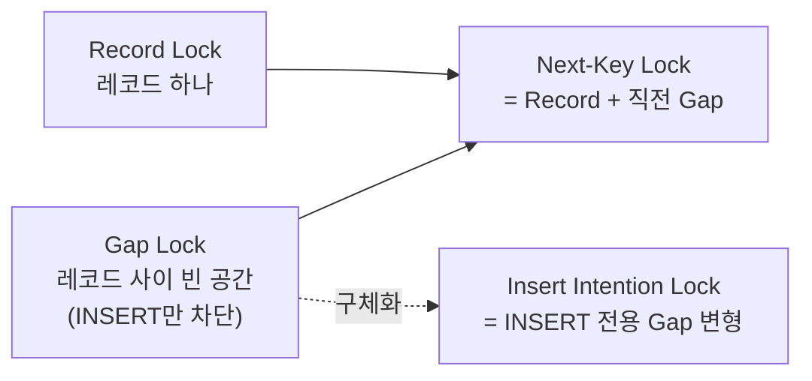
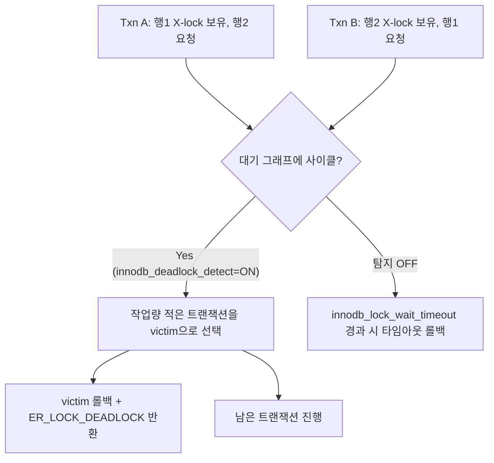

이 글은 MySQL 8.0 공식 레퍼런스 매뉴얼 중 [InnoDB](https://dev.mysql.com/doc/refman/8.0/en/innodb-locking.html) 락(Lock) 관련 챕터를 정리한 노트다. 여러 커넥션이 같은 행을 동시에 읽고 쓸 때 dirty read(커밋 전 데이터를 읽는 문제)나 lost update(동시 갱신 중 한쪽이 사라지는 문제)가 생기지 않도록, InnoDB가 어떤 종류의 락을 언제 걸고 격리 수준이 그 범위를 어떻게 바꾸는지를 다룬다.

> [!NOTE] 사전 지식
> 트랜잭션·커밋/롤백·ACID 개념을 이미 안다고 전제한다. 격리 수준(isolation level) 자체의 배경 설명은 다루지 않고 그것이 락 범위를 어떻게 바꾸는지만 다룬다.

### 락이 필요한 이유

- **dirty read**: 트랜잭션 A가 아직 커밋하지 않은 값을 B가 읽어버리는 것. A가 나중에 롤백하면 B는 존재한 적 없는 데이터를 근거로 움직인 셈이 된다.
- **lost update**: A와 B가 같은 값을 읽고 각자 계산해 다시 쓰면, 나중에 쓴 쪽이 먼저 쓴 갱신을 덮어써 한쪽 변경이 사라진다(`SELECT` → 계산 → `UPDATE` 패턴에서 흔하다).
- 락은 이렇게 충돌하는 동시 작업을 직렬화해 ACID의 격리성(Isolation)을 지키는 수단이다. InnoDB는 일반 `SELECT`에는 [MVCC](https://dev.mysql.com/doc/refman/8.0/en/innodb-multi-versioning.html) 스냅샷(락 없이 특정 시점의 데이터를 보여주는 방식)을 쓴다. 쓰기 의도가 있는 읽기(`FOR UPDATE`/`FOR SHARE`)와 모든 `UPDATE`/`DELETE`/`INSERT`에는 명시적 락을 건다.

### 락의 단위와 모드

단위(granularity)는 락이 데이터를 얼마나 넓게 덮느냐, 모드(mode)는 그 락을 다른 트랜잭션과 어떻게 공유하느냐를 정한다.

- **테이블 락**: [MyISAM](https://dev.mysql.com/doc/refman/8.0/en/myisam-storage-engine.html)/MEMORY/MERGE 엔진, 또는 `LOCK TABLES`가 쓴다. 락 객체가 테이블당 하나라 가볍지만 쓰기 하나가 그 테이블의 모든 읽기를 막아 동시성이 낮다.
- **행 락**: InnoDB 기본. 인덱스 레코드 단위로 잠가 관련 없는 행끼리는 서로 막지 않는다 — 고동시성 OLTP에 적합한 이유다. 단, InnoDB도 행 락과 항상 함께 테이블 수준 Intention Lock(IS/IX)을 건다. 전체 테이블 락 요청이 행 하나하나를 스캔하지 않고도 "이 테이블에 충돌하는 행 락이 있는가"를 즉시 판단하기 위한 장치다.
- **공유 락(S)**: 읽기용. 여러 트랜잭션이 같은 행에 S를 동시에 보유할 수 있다(읽기는 읽기를 막지 않는다). X 요청은 대기시킨다.
- **배타 락(X)**: 수정·삭제용. 어떤 락(S든 X든)과도 공존할 수 없다.
- 한 문장 요약: 읽기는 읽기를 막지 않지만 쓰기는 모든 것을 막는다.

### InnoDB 행 락 3종

SQL 표준 개념이 아니라 InnoDB 구현 특유의 개념으로, 모두 행이 아니라 **인덱스 레코드**를 기준으로 건다(명시적 인덱스가 없으면 InnoDB가 내부적으로 만드는 클러스터드 인덱스에 건다).



- **Record Lock** — 인덱스 레코드 정확히 하나에 거는 락.
- **Gap Lock** — 레코드와 레코드 "사이의 빈 공간"(또는 첫 레코드 앞/마지막 레코드 뒤)에 거는 락. 그 자체로는 읽기·수정을 막지 않고 오직 그 공간에 `INSERT`하는 것만 막는 "순수 저지용" 락이다. 서로 다른 트랜잭션이 같은 gap에 충돌하는 gap lock(S/X)을 동시에 보유할 수 있다.
- **Next-Key Lock** — Record Lock + 그 직전 Gap Lock의 조합. [`REPEATABLE READ`](https://dev.mysql.com/doc/refman/8.0/en/innodb-transaction-isolation-levels.html)(InnoDB 기본 격리 수준)에서 비유니크 인덱스 범위 스캔의 기본 동작이며 phantom read(같은 범위 쿼리를 두 번 실행했을 때 없던 행이 새로 보이는 현상)를 막는다.
- **Insert Intention Lock** — `INSERT` 직전에 거는 특수한 Gap Lock. 같은 gap 안에서도 서로 다른 위치에 삽입하는 두 `INSERT`끼리는 충돌시키지 않기 위한 장치다(같은 위치에 삽입할 때만 충돌한다).

인덱스 컬럼 `c1`이 `{10, 11, 13, 20}`을 가질 때 next-key lock은 인덱스를 다음 구간으로 나눠 잠근다.

```
(-inf, 10]  (10, 11]  (11, 13]  (13, 20]  (20, +inf)
```

```sql
-- Session A
START TRANSACTION;
SELECT c1 FROM t WHERE c1 BETWEEN 10 AND 20 FOR UPDATE;
-- 레코드 10,11,13,20 + 그 사이 gap까지 next-key lock으로 잠금

-- Session B (A가 아직 COMMIT하지 않은 상태)
INSERT INTO t VALUES (15);
-- 15는 13과 20 사이 gap에 속해 A가 끝날 때까지 대기(BLOCKS)
```

> [!WARNING] 보조 인덱스로 잠그면 PK도 함께 잠긴다
> 보조 인덱스로 행을 잠그면 InnoDB는 대응하는 클러스터드 인덱스(PK) 레코드도 함께 잠근다. 선택도가 낮은 인덱스나 인덱스 없는 `WHERE ... FOR UPDATE`는 겉보기보다 훨씬 넓은 범위(최악의 경우 테이블 전체)를 잠글 수 있다 — 락 범위를 줄이려면 인덱스 설계가 중요한 이유다.

### 격리 수준이 바꾸는 락 범위

격리 수준은 무엇을 볼 수 있는지뿐 아니라 얼마나 잠그는지도 바꾼다.

- **`READ COMMITTED`**: 일반 범위 스캔에 gap lock을 걸지 않는다(FK 체크·중복 키 체크는 예외) → 락 경합이 줄지만 phantom read를 허용한다. `UPDATE`는 semi-consistent read(이미 락 걸린 행을 만나면 최신 커밋 버전으로 `WHERE` 조건을 재확인해 조건에 더는 맞지 않으면 잠그지 않는 방식)를 쓴다.
- **`REPEATABLE READ`**(InnoDB 기본값): next-key lock으로 phantom read까지 막는다.
- 실무 함의: 락 경합이 심한 구간을 `READ COMMITTED`로 낮추면 gap lock이 줄어 처리량이 오르지만 같은 트랜잭션 안에서 phantom row를 허용하게 되는 트레이드오프가 있다. 두 격리 수준 모두 `READ UNCOMMITTED` 위 단계라 dirty read는 막는다.

### 명시적으로 락 걸기

락은 명시적으로 걸지 않아도 이미 걸려 있다. 일반 `SELECT`만 락 없는 MVCC 스냅샷이고 `UPDATE`/`DELETE`는 `WHERE`가 훑는 모든 행에 X락을 건다. 행 락은 문장이 끝난 뒤가 아니라 트랜잭션이 커밋·롤백될 때까지 유지된다 — "트랜잭션을 짧게 유지하라"는 조언의 근거다.

애플리케이션에서 명시적으로 락을 걸 때는 트랜잭션 안에서 다음 구문을 쓴다.

```sql
START TRANSACTION;
SELECT stock FROM items WHERE id = 1 FOR UPDATE;   -- X-lock: 읽기 + 쓰기 의도
UPDATE items SET stock = stock - 1 WHERE id = 1;
COMMIT;
```

- `FOR UPDATE`: 배타 락. `FOR SHARE`: 공유 락(과거 `LOCK IN SHARE MODE`의 대체 문법).
- `NOWAIT`: 이미 잠겨 있으면 대기하지 않고 즉시 에러.
- `SKIP LOCKED`: 잠긴 행은 건너뛰고 잠기지 않은 행만 반환한다(작업 큐 구현에 유용하지만 반복 불가능한 뷰라 일반 트랜잭션 로직에는 부적합하다).
- `LOCK TABLES ... READ|WRITE`는 테이블 단위의 투박한 대안이다. 현재 열린 트랜잭션을 암묵적으로 커밋시키는 등 InnoDB에서는 대부분 권장되지 않는 MyISAM 시대의 도구다.

> [!TIP] SKIP LOCKED로 작업 큐 만들기
> 여러 워커 프로세스가 같은 테이블을 `SELECT ... FOR UPDATE SKIP LOCKED`로 폴링하면, 이미 다른 워커가 집어간 행은 건너뛰고 서로 다른 행을 하나씩 받아간다. 대기열(job queue) 폴링을 구현할 때 흔히 쓰는 패턴이다.

### 락 확인과 데드락

지금 걸린 락과 대기 상태는 [Performance Schema](https://dev.mysql.com/doc/refman/8.0/en/performance-schema.html)로 확인한다. `performance_schema.data_locks`는 현재 보유·요청 중인 락을, `data_lock_waits`는 어떤 요청이 어떤 락에 막혀 대기 중인지를 보여준다. 가장 최근 데드락 상세는 `SHOW ENGINE INNODB STATUS`의 `LATEST DETECTED DEADLOCK` 항목에서 확인한다.

- [**데드락**](https://dev.mysql.com/doc/refman/8.0/en/innodb-deadlocks.html)은 두 트랜잭션이 서로 필요한 락을 상대가 이미 쥐고 있어 영원히 대기하는 상황이다(락 획득 순서가 반대인 경우 흔하다). 버그가 아니라 동시성 제어에서 정상적으로 발생하는 이벤트다.
- InnoDB는 기본값(`innodb_deadlock_detect = ON`)으로 이를 자동 탐지해 작업량이 적은 쪽을 골라 즉시 롤백하고 에러(`ER_LOCK_DEADLOCK`)를 반환한다. 탐지를 끄면 대신 `innodb_lock_wait_timeout`(기본 50초)으로 타임아웃 처리한다.
- 애플리케이션은 이 에러를 예외로 잡아 재시도하도록 설계해야 한다. 락 획득 순서 통일, 트랜잭션 짧게 유지, `WHERE` 절 컬럼에 인덱스 추가가 표준적인 완화책이다.



---

**참고 자료**
- MySQL 8.0 Reference Manual, [InnoDB Locking](https://dev.mysql.com/doc/refman/8.0/en/innodb-locking.html)
- MySQL 8.0 Reference Manual, [Transaction Isolation Levels](https://dev.mysql.com/doc/refman/8.0/en/innodb-transaction-isolation-levels.html)
- MySQL 8.0 Reference Manual, [Deadlocks in InnoDB](https://dev.mysql.com/doc/refman/8.0/en/innodb-deadlocks.html)
- MySQL 8.0 Reference Manual, [Performance Schema](https://dev.mysql.com/doc/refman/8.0/en/performance-schema.html)
